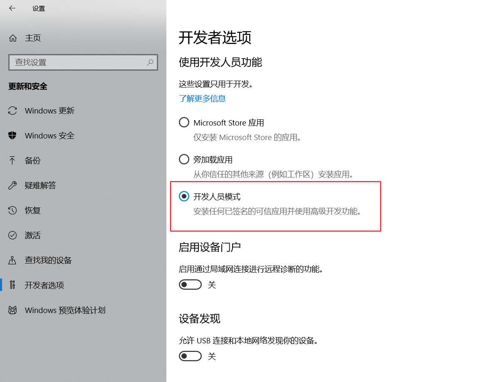
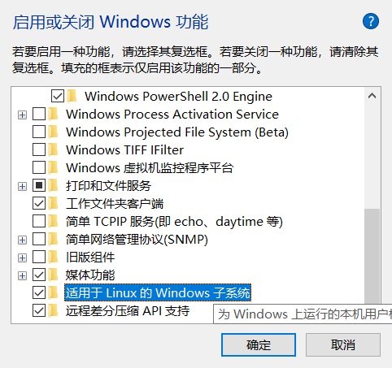
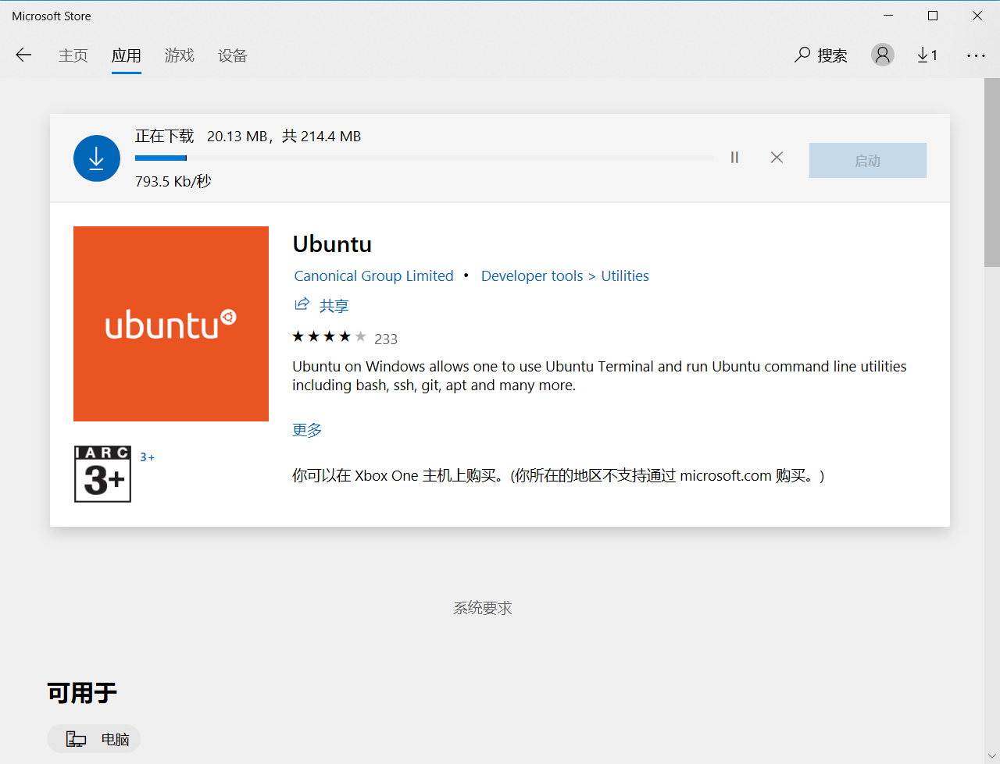
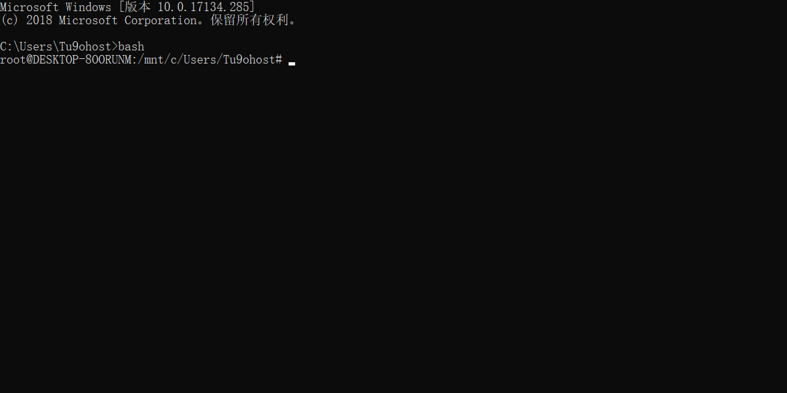

# 安装 WSL (Bash on Ubuntu on Windows)

## 第一步: 打开开发者模式

首先， 你需要打开你的 Windows 电脑的 *开发人员模式*。

依次访问 **设置 -> 更新和安全 -> 针对开发人员**, 然后点击打开右侧的 “开发人员模式” 。



## 第二步: 安装 WSL

接着, 你需要安装 WSL 。

在开始菜单里， 搜索 “启用或关闭Windows功能”， 打开对应的控制面板， 勾选名为 “Windows Subsystem for Linux (Beta)” 的多选框。



点击确定， 并重启你的电脑。

## 第三步：安装Linux发行版

在Windows Store中下载任意你喜欢的Linux发行版



## 第三步: 创建一个 Unix 账户

然后, 我们需要在命令行里激活 WSL 。 打开一个命令行(Command Prompt) 并执行如下命令:

```
> bash
```

## 第四步: 好好享受你的 Linux 吧!

