# 20160605

这几天追剧，搞得我日记写得很不全，所以追剧是堕落的源头，以后慎重追剧。

今天要做的是就是JavaEE入门。

首先先谷歌`JavaEE`入门

#### 环境

首先需要环境和工具

[jdk](http://www.oracle.com/technetwork/java/javase/downloads/index.html)环境自不多说

还需要[Tomcat](http://tomcat.apache.org/)

自行下载，然后按照这个[教程](https://blog.csdn.net/weixin_38322156/article/details/72852607)完成相关环境配置。

在Windows机器下，Tomcat可以通过执行一下命令来启动：

```
%CATALINA_HOME%\bin\startup.bat
或者
C:\apache-tomcat-5.5.29\bin\startup.bat
```

在Windows机器下，Tomcat可以通过执行一下命令来关闭：

```
%CATALINA_HOME%\bin\shutdown
或者
C:\apache-tomcat-5.5.29\bin\shutdown
```


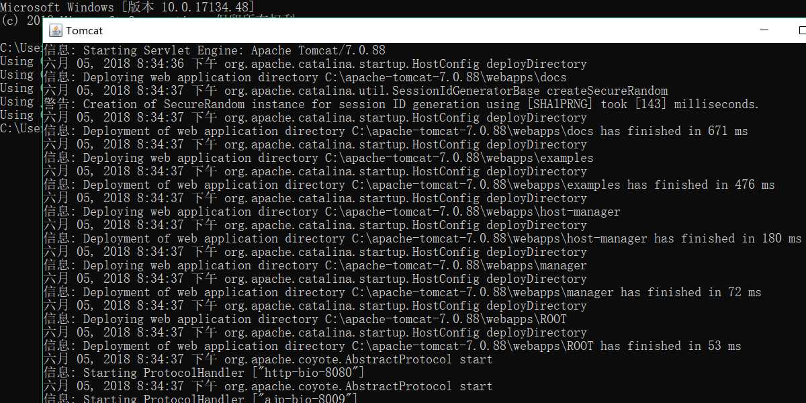

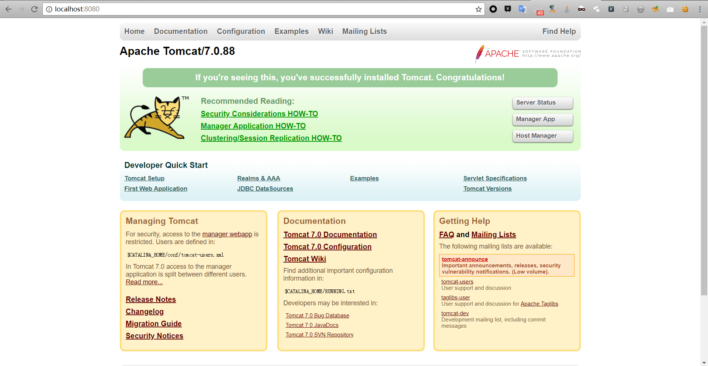

两张图解释，配置好了环境。

然后编写第一个案例

在`C:\apache-tomcat-7.0.88\webapps\ROOT`中建立`test.jsp`其中的目录路径按自己的本地情况来。

`test.jsp`代码如下：

```jsp
<%@ page contentType="text/html;charset=UTF-8" %>
<%
out.print("hello world");
%> 
```

效果

#### 将 Tomcat 和 Eclipse 相关联

[eclipse](http://www.eclipse.org/downloads/)下载

Eclipse J2EE下载后，解压即可使用，我们打开Java EE ，选择菜单栏Windows-->preferences（Mac 系统为 Eclipse-->偏好设置），弹出如下界面： 

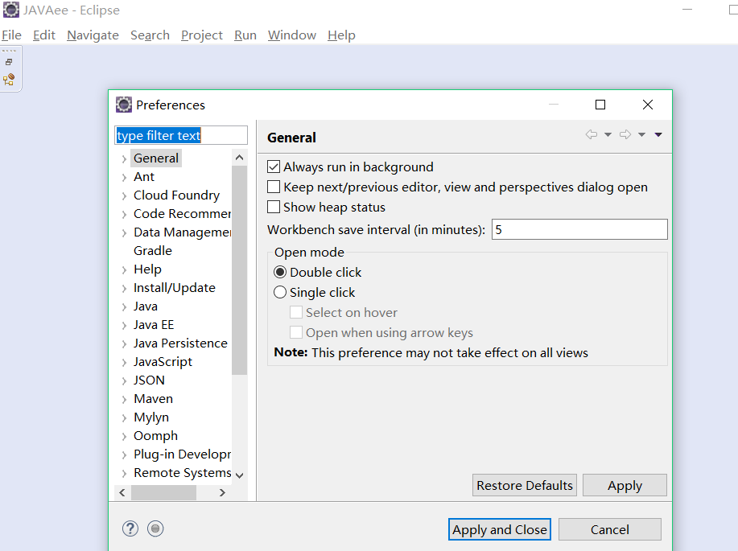

选择server

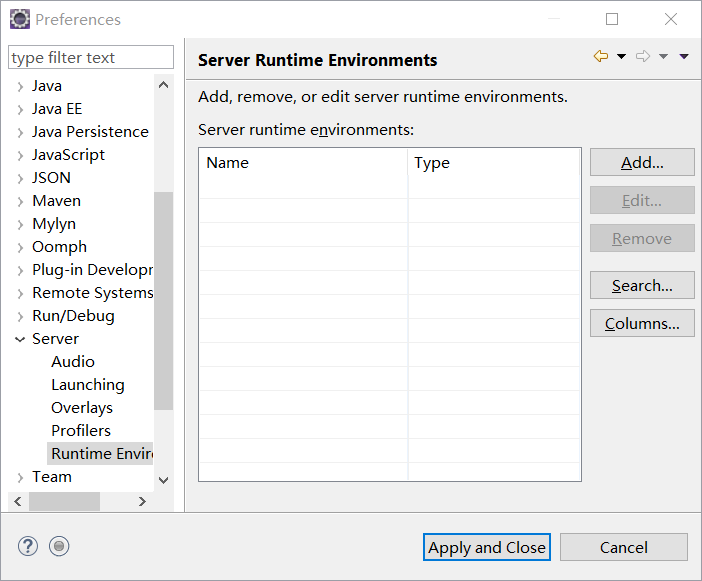

选择上图，然后按照下图完成配置


按下`Finish`完成配置

选择 "File-->New-->Dynamic Web Project"，创建 TomcatTest 项目： 

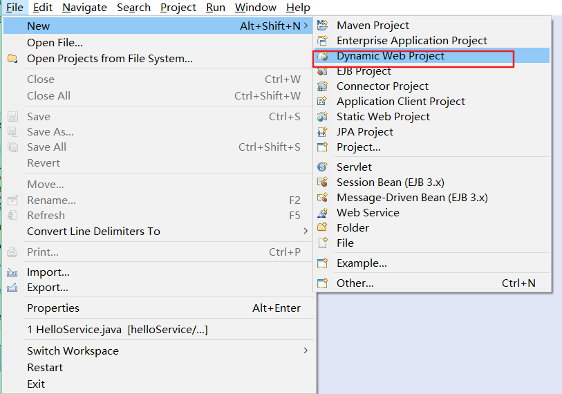

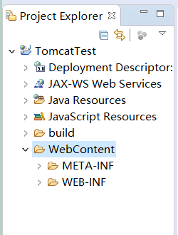

创建项目之后的文件结构：

- deployment descriptor：部署的描述。
- Web App Libraries：自己加的包可以放在里面。
- build：放入编译之后的文件。
- WebContent:放进写入的页面。

在WebContent文件夹下新建一个test.jsp文件。在下图中可以看到它的默认代码： 

```jsp
<%@ page language="java" contentType="text/html; charset=ISO-8859-1"
    pageEncoding="ISO-8859-1"%>
<!DOCTYPE html PUBLIC "-//W3C//DTD HTML 4.01 Transitional//EN" "http://www.w3.org/TR/html4/loose.dtd">
<html>
<head>
<meta http-equiv="Content-Type" content="text/html; charset=ISO-8859-1">
<title>Insert title here</title>
</head>
<body>

</body>
</html>
```

接着我们修改下test.jsp文件代码如下所示： 

```jsp
<%@ page language="java" contentType="text/html; charset=ISO-8859-1"
    pageEncoding="ISO-8859-1"%>
<!DOCTYPE html PUBLIC "-//W3C//DTD HTML 4.01 Transitional//EN" "http://www.w3.org/TR/html4/loose.dtd">
<html>
<head>
<meta http-equiv="Content-Type" content="text/html; charset=ISO-8859-1">
<title>helloworld</title>
</head>
<body>
<%
	out.println("hello world");
%>
</body>
</html>
```

然后修改下浏览器

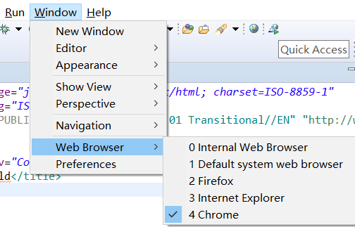

运行成功：


#### Servlet 实例创建

我们也可以使用以上环境创建 Servlet 文件，选择 "File-->New-->Servlet"

位于 TomcatTest项目的 /TomcatTest/src 目录下创建 "HelloServlet" 类，包为 "com.runoob.test":

HelloServlet.java 代码如下所示： 

```java
package com.runoob.test;
import java.io.IOException;
import javax.servlet.ServletException;
import javax.servlet.annotation.WebServlet;
import javax.servlet.http.HttpServlet;
import javax.servlet.http.HttpServletRequest;
import javax.servlet.http.HttpServletResponse;

/**
 * Servlet implementation class HelloServlet
 */
@WebServlet("/HelloServlet")
public class HelloServlet extends HttpServlet {
    private static final long serialVersionUID = 1L;
       
    /**
     * @see HttpServlet#HttpServlet()
     */
    public HelloServlet() {
        super();
        // TODO Auto-generated constructor stub
    }

    /**
     * @see HttpServlet#doGet(HttpServletRequest request, HttpServletResponse response)
     */
    protected void doGet(HttpServletRequest request, HttpServletResponse response) throws ServletException, IOException {
        // 使用 GBK 设置中文正常显示
        response.setCharacterEncoding("GBK");
        response.getWriter().write("jsp你好");
    }

    /**
     * @see HttpServlet#doPost(HttpServletRequest request, HttpServletResponse response)
     */
    protected void doPost(HttpServletRequest request, HttpServletResponse response) throws ServletException, IOException {
        // TODO Auto-generated method stub
        doGet(request, response);
    }

}
```

创建 /TomcatTest/WebContent/WEB-INF/web.xml 文件（如果没有），代码如下所示： 

```xml
<?xml version="1.0" encoding="UTF-8"?>  
<web-app version="2.5"   
    xmlns="http://java.sun.com/xml/ns/javaee"   
    xmlns:xsi="http://www.w3.org/2001/XMLSchema-instance"   
    xsi:schemaLocation="http://java.sun.com/xml/ns/javaee   
    http://java.sun.com/xml/ns/javaee/web-app_2_5.xsd">  
  <servlet>  
     <!-- 类名 -->  
    <servlet-name>HelloServlet</servlet-name>  
    <!-- 所在的包 -->  
    <servlet-class>com.runoob.test.HelloServlet</servlet-class>  
  </servlet>  
  <servlet-mapping>  
    <servlet-name>HelloServlet</servlet-name>  
    <!-- 访问的网址 -->  
    <url-pattern>/TomcatTest/HelloServlet</url-pattern>  
    </servlet-mapping>  
</web-app>  
```

接着重启 Tomcat，浏览器访问 **http://localhost:8080/TomcatTest/HelloServlet**： 

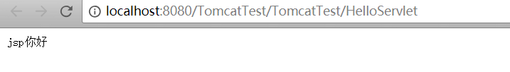

##### JSP处理

网络服务器需要一个 JSP 引擎，也就是一个容器来处理 JSP 页面。容器负责截获对 JSP 页面的请求。

JSP 容器与 Web 服务器协同合作，为JSP的正常运行提供必要的运行环境和其他服务，并且能够正确识别专属于 JSP 网页的特殊元素。

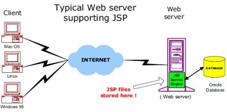

以下步骤表明了 Web 服务器是如何使用JSP来创建网页的： 

- 就像其他普通的网页一样，您的浏览器发送一个 HTTP 请求给服务器。 
- Web 服务器识别出这是一个对 JSP 网页的请求，并且将该请求传递给 JSP 引擎。通过使用 URL或者 .jsp 文件来完成。 
- JSP 引擎从磁盘中载入 JSP 文件，然后将它们转化为 Servlet。这种转化只是简单地将所有模板文本改用 println() 语句，并且将所有的 JSP 元素转化成 Java 代码。 
- JSP 引擎将 Servlet 编译成可执行类，并且将原始请求传递给 Servlet 引擎。 
- Web 服务器的某组件将会调用 Servlet 引擎，然后载入并执行 Servlet 类。在执行过程中，Servlet 产生 HTML 格式的输出并将其内嵌于 HTTP response 中上交给 Web 服务器。 
- Web 服务器以静态 HTML 网页的形式将 HTTP response 返回到您的浏览器中。 
- 最终，Web 浏览器处理 HTTP response 中动态产生的HTML网页，就好像在处理静态网页一样。 

以上提及到的步骤可以用下图来表示： 

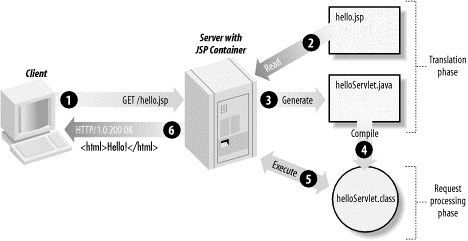

一般情况下，JSP 引擎会检查 JSP 文件对应的 Servlet 是否已经存在，并且检查 JSP 文件的修改日期是否早于 Servlet。如果 JSP 文件的修改日期早于对应的 Servlet，那么容器就可以确定 JSP 文件没有被修改过并且 Servlet 有效。这使得整个流程与其他脚本语言（比如 PHP）相比要高效快捷一些。

总的来说，JSP 网页就是用另一种方式来编写 Servlet 而不用成为 Java 编程高手。除了解释阶段外，JSP 网页几乎可以被当成一个普通的 Servlet 来对待。

##### JSP生命周期

理解JSP底层功能的关键就是去理解它们所遵守的生命周期。

JSP生命周期就是从创建到销毁的整个过程，类似于servlet生命周期，区别在于JSP生命周期还包括将JSP文件编译成servlet。

以下是JSP生命周期中所走过的几个阶段：

- **编译阶段：**

  servlet容器编译servlet源文件，生成servlet类

- **初始化阶段：**

  加载与JSP对应的servlet类，创建其实例，并调用它的初始化方法

- **执行阶段：**

  调用与JSP对应的servlet实例的服务方法

- **销毁阶段：**

  调用与JSP对应的servlet实例的销毁方法，然后销毁servlet实例

很明显，JSP生命周期的四个主要阶段和servlet生命周期非常相似，下面给出图示： 

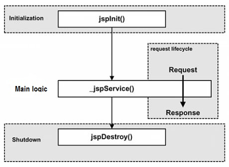

###### JSP编译

当浏览器请求JSP页面时，JSP引擎会首先去检查是否需要编译这个文件。如果这个文件没有被编译过，或者在上次编译后被更改过，则编译这个JSP文件。

编译的过程包括三个步骤：

- 解析JSP文件。
- 将JSP文件转为servlet。
- 编译servlet。

###### JSP初始化

容器载入JSP文件后，它会在为请求提供任何服务前调用jspInit()方法。如果您需要执行自定义的JSP初始化任务，复写jspInit()方法就行了，就像下面这样： 

```java
public void jspInit(){
  // 初始化代码
}
```

一般来讲程序只初始化一次，servlet也是如此。通常情况下您可以在jspInit()方法中初始化数据库连接、打开文件和创建查询表。 

###### JSP执行

这一阶段描述了JSP生命周期中一切与请求相关的交互行为，直到被销毁。

当JSP网页完成初始化后，JSP引擎将会调用_jspService()方法。

_jspService()方法需要一个HttpServletRequest对象和一个HttpServletResponse对象作为它的参数，就像下面这样：

```java
void _jspService(HttpServletRequest request,
                 HttpServletResponse response)
{
   // 服务端处理代码
}
```

_jspService()方法在每个request中被调用一次并且负责产生与之相对应的response，并且它还负责产生所有7个HTTP方法的回应，比如GET、POST、DELETE等等。 

###### JSP清理

JSP生命周期的销毁阶段描述了当一个JSP网页从容器中被移除时所发生的一切。

jspDestroy()方法在JSP中等价于servlet中的销毁方法。当您需要执行任何清理工作时复写jspDestroy()方法，比如释放数据库连接或者关闭文件夹等等。

jspDestroy()方法的格式如下：

```java
public void jspDestroy()
{
   // 清理代码
}
```

###### 实例

JSP生命周期代码实例如下所示： 

```jsp
<%@ page language="java" contentType="text/html; charset=UTF-8"
    pageEncoding="UTF-8"%>
<html>
<head>
<title>life.jsp</title>
</head>
<body>

<%! 
  private int initVar=0;
  private int serviceVar=0;
  private int destroyVar=0;
%>
  
<%!
  public void jspInit(){
    initVar++;
    System.out.println("jspInit(): JSP被初始化了"+initVar+"次");
  }
  public void jspDestroy(){
    destroyVar++;
    System.out.println("jspDestroy(): JSP被销毁了"+destroyVar+"次");
  }
%>

<%
  serviceVar++;
  System.out.println("_jspService(): JSP共响应了"+serviceVar+"次请求");

  String content1="初始化次数 : "+initVar;
  String content2="响应客户请求次数 : "+serviceVar;
  String content3="销毁次数 : "+destroyVar;
%>
<h1>JSP 测试实例</h1>
<p><%=content1 %></p>
<p><%=content2 %></p>
<p><%=content3 %></p>

</body>
</html>
```

###### JSP链接数据库

```jsp
<%@ page contentType="text/html; charset=gb2312" %>   
<%@ page language="java" %>   
<%@ page import="com.mysql.jdbc.Driver" %>   
<%@ page import="java.sql.*" %>   
<%   
//加载驱动程序   
String driverName="com.mysql.jdbc.Driver";   
//数据库信息  
String userName="root";   
//密码   
String userPasswd="root";   
//数据库名   
String dbName="runoob";   
//表名   
String tableName="websites";   
//将数据库信息字符串连接成为一个完整的url（也可以直接写成url，分开写是明了可维护性强）   
  
String url="jdbc:mysql://localhost:3306/"+dbName+"?user="+userName+"&password="+userPasswd;   
Class.forName("com.mysql.jdbc.Driver").newInstance();   
Connection conn=DriverManager.getConnection(url);   
Statement stmt = conn.createStatement();   
String sql="SELECT * FROM "+tableName;   
ResultSet rs = stmt.executeQuery(sql);   
out.print("id");   
out.print("|");   
out.print("name");   
out.print("|");   
out.print("phone");   
out.print("<br>");   
while(rs.next()) {   
out.print(rs.getString(1)+" ");   
out.print("|");   
out.print(rs.getString(2)+" ");   
out.print("|");   
out.print(rs.getString(3));   
out.print("<br>");   
}   
out.print("<br>");   
out.print("ok， Database Query Successd！");   
rs.close();   
stmt.close();   
conn.close();   
%>  
```

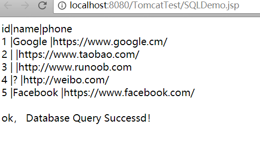

今晚就到这了。