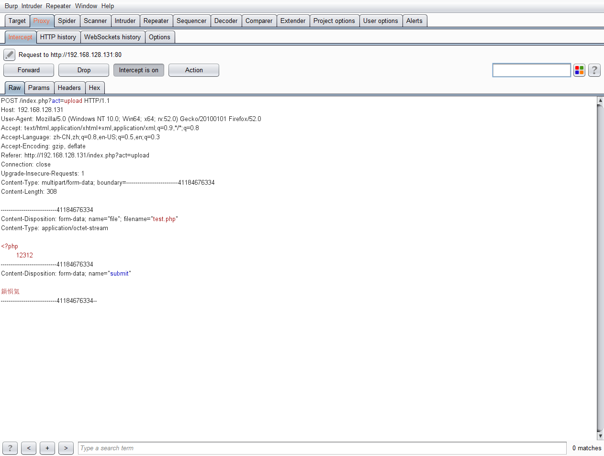
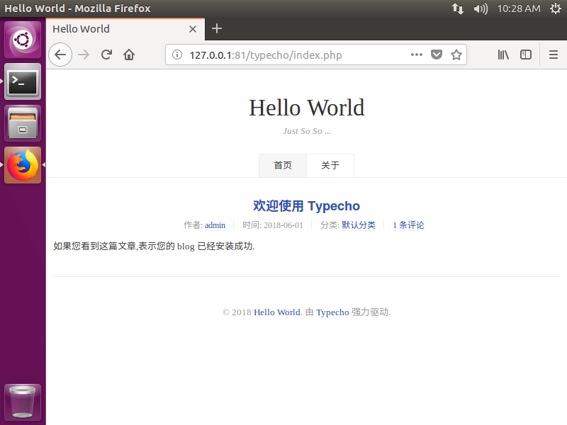
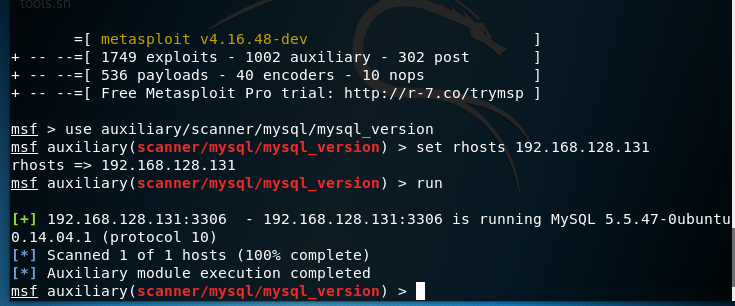
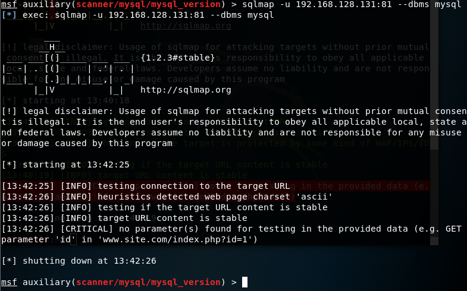
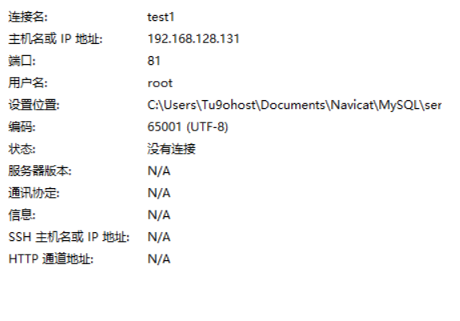
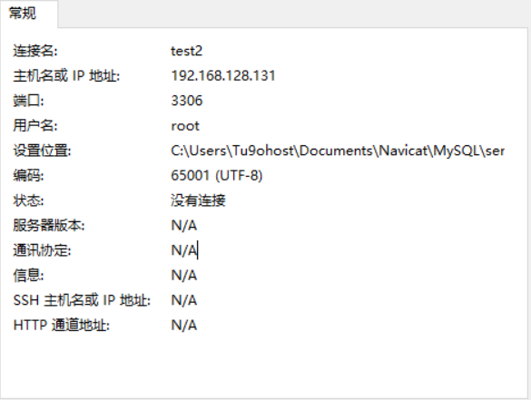
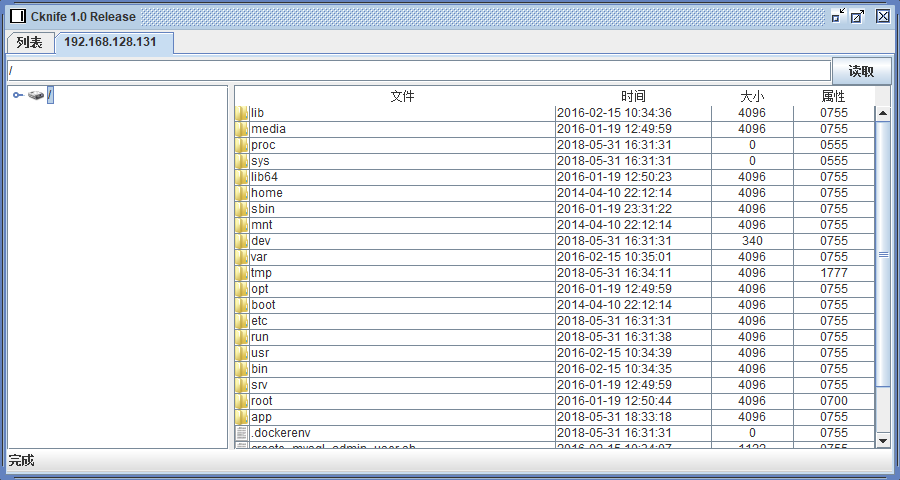
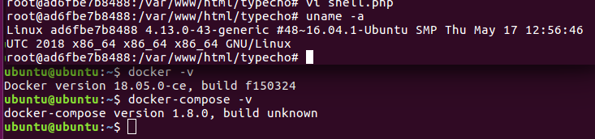

# 20180531

昨晚问了下那位大佬，getshell如何fuzz过滤字符串的。

我看了他的结果，感觉自己有点智障，当时。


然后下课，回来试了下



然后爆破

```
<?php
```

后面的内容就可以了。

然后在这里简单解释下fuzz：
> 就是一个个试，然后把范围不断缩小。

今天下午，看到K0rz3n师傅在空间发分享的[自动化渗透框架](https://xz.aliyun.com/t/2362)

看了下文章，感觉还行，而且本来自己暑假也准备边挖洞，边写这种工具的。无奈，认识的人先发不了。


但是，确实一个很好的指路标签吧（其实，也没多少不知道的知识。

然后自己在本地搭建了一个


问了师傅，他说前端还没开源╮(╯-╰)╭

只能暑假慢慢搞了。

今晚唯一比较有点价值的收获就是在Linux快速搭建lamp环境
```
docker pull tutum/lamp
docker run -d -p 80:81 -p 3306:3306 tutum/lamp
docker exec -it ID /bin/bash
git clone 相关项目
```
配合daocloud加速器，时间缩短了很多。

在虚拟机搞了下typecho


首先需要创建一个typecho数据库，因为typecho不能自己创建数据库。而且tutum/lamp镜像中的mysql是没有密码的。

> mysql -uroot

创建数据库
> CREATE DATABASE typecho;

ok,到这里差不都数据已经完成了，然后就是安装了。

然后，我想对这个想法进行安全监测，按照我现有的知识，出现问题比较多的地方出在3306端口


利用auxiliary/scanner/mysql/mysql_version模块查看mysql信息。

 
>  MySQL 5.5.47-0ubuntu0.14.04.1

想用sqlmap对其进行注入

看样子，就知道没成功啊。。
然后想用navicat 连接数据库


以上配置都连不了。  

以上都是假装自己不知道mysql密码的情况下做的测试。

就算，cms有问题，getshell了，get的也是docker的shell，貌似docker逃逸目前还没出现过

深夜耐不住寂寞，又对他进行了getshell测试


shell.php中的内容


菜刀连接成功


不过是在docker里面的

我试试脏牛漏洞实现docker逃逸。

先给出系统版本信息


按照网上的教程，本地并没有复现成功

`make`命令用不了


原因是没有安装，安装好之后，用`make`

也没有用。
快三点半了，先到这了。