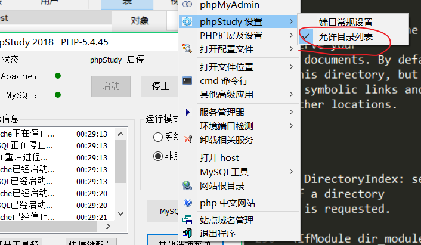

# 20180608

今天遇到了一个很奇怪的问题

首先自己本地安装了，phpstudy和tomcat

谷歌了解了，不是apache的httd.conf问题，也不是我想的apache和tomcat两者“同时存在”的问题，而是phpstudy设置问题

这样勾选就可以了。

感觉学计算机不是学计算机而是解决若干个玄学问题。

并且，这次事情暴露了自己对`服务器`的理解还不到位，技术还不是懂，只是个脚本小子试试别人做过的。

已经来到了南京，参加由东南大学承办的全国大学生信息安全竞赛半决赛，表示对那个赛制一点不熟悉，并且对大家出的题也没有认知感。看了下ATD出的[题](https://github.com/DXkite/CISCN2018-ATD-SSHOP)表示醉醉的，因为这有点小脑洞。

然后就是自己换了硬盘，工具什么的都不是很齐全。凉凉，难道等比赛的时候再搞工具么。

然后防止薅羊毛是用IP来限制，就是不让他获得毛利。

坐等明天了，因为压根没怎么参加过这种比赛，哪怕失败就当攒攒经验了。