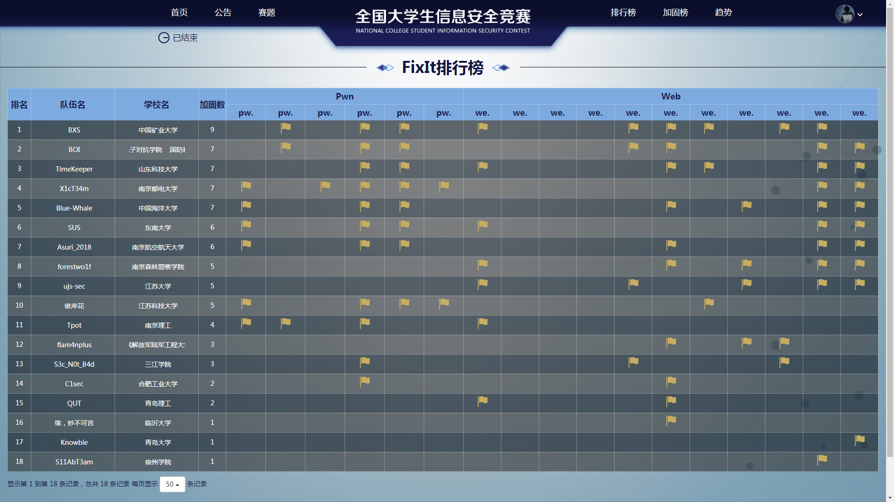

# 20180610

CISCN华东北赛区比完了，最终成绩是做出来一个fixit。

总结下，就是没有题目提示和题目名，做起来很脑洞，跟CTF不一样，CTF最起码会给个提示，这个一个提示都没有，只有Hint，也不知道大佬们怎么做出来的，只能说自己好菜，并且，当天的工具有的用不了，这是我意料之外的。有两道题是与flag擦肩而过，醉了。稍微有点不甘心，而且自己本来就不是很强，希望一年之后能够更强。