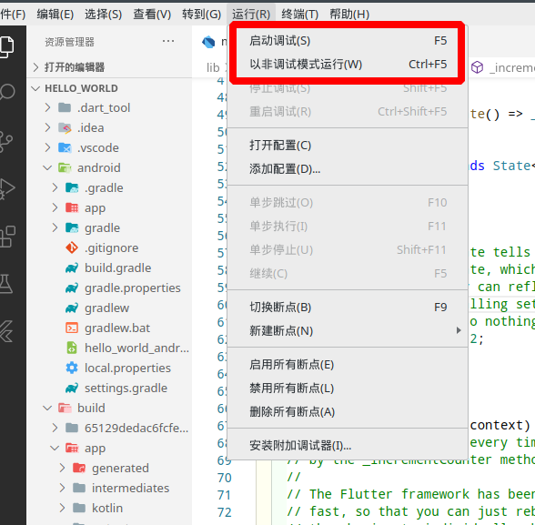

## Flutter安装

参考官网文档即可：https://flutter.dev/docs/get-started/install

## 使用Flutter docter命令来检测环境配置


如果缺少某一个组建，请仔细检查一下。

## 使用vscode搭建项目并运行

vscode 需要使用`Dart`和`Flutter插件`，安装即可。

使用`command + shift + p`，输入`Flutter new project`来创建新的项目。

项目创建好之后，需要修改`build.gradle`中的`repositories`内容（如果是国内的话）。

```gradle
repositories {
        maven { url 'https://maven.aliyun.com/repository/google' }
        maven { url 'https://maven.aliyun.com/repository/jcenter' }
        maven { url 'http://maven.aliyun.com/nexus/content/groups/public' }
    }
```

此外，运行的时候还需要修改环境变量。

比如我的linux，我需要在`etc/profile`中添加如下

> export PUB_HOSTED_URL=https://pub.flutter-io.cn
> export FLUTTER_STORAGE_BASE_URL=https://storage.flutter-io.cn

当项目build完成的时候


使用vscode的运行即可运行




