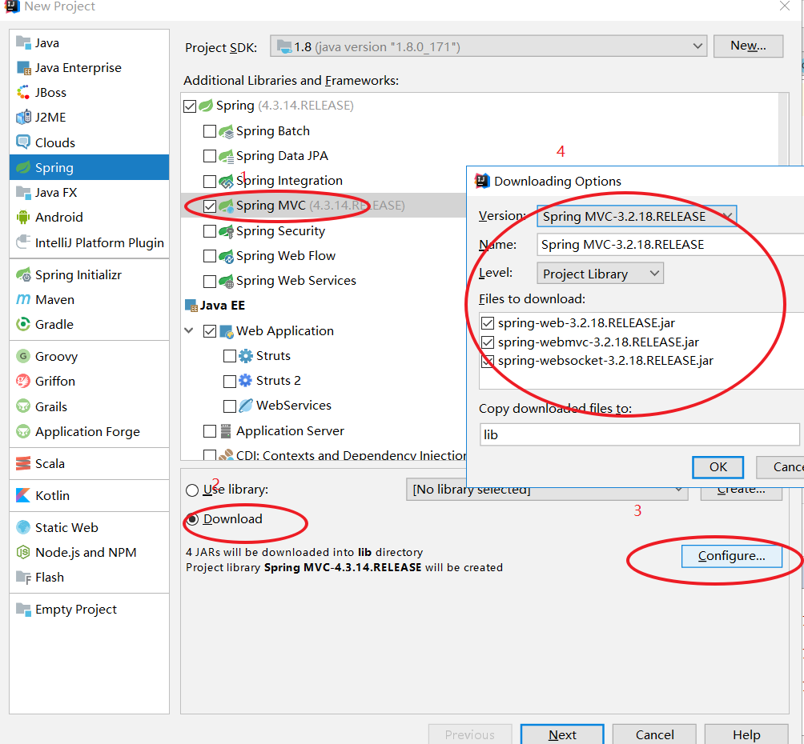
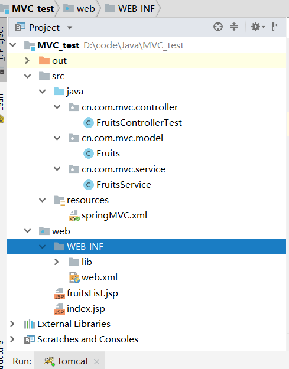
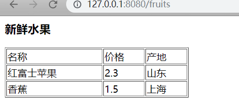

# IDEA+tomcat+springMVC

1、新建项目



在我项目做完后的目录结构如图：



lib目录是我本地的jar包

2、添加model类

```java
package cn.com.mvc.model;

public class Fruits {
    private String name;
    private double price;
    private String producing_area;

    public String getName() {
        return name;
    }

    public void setName(String name) {
        this.name = name;
    }

    public double getPrice() {
        return price;
    }

    public void setPrice(double price) {
        this.price = price;
    }

    public String getProducing_area() {
        return producing_area;
    }

    public void setProducing_area(String producing_area) {
        this.producing_area = producing_area;
    }
}

```

3、添加service类

```java
package cn.com.mvc.service;

import cn.com.mvc.model.Fruits;

import java.util.ArrayList;
import java.util.List;

public class FruitsService{
    public List<Fruits> queryFruitsList(){
        List<Fruits> fruitsList = new ArrayList<Fruits>();

        Fruits apple = new Fruits();
        apple.setName("红富士苹果");
        apple.setPrice(2.3);
        apple.setProducing_area("山东");

        Fruits Banana = new Fruits();
        Banana.setName("香蕉");
        Banana.setPrice(1.5);
        Banana.setProducing_area("上海");

        fruitsList.add(apple);
        fruitsList.add(Banana);
        return fruitsList;
    }
}

```

4、添加controller类

```java
package cn.com.mvc.controller;

import cn.com.mvc.model.Fruits;
import cn.com.mvc.service.FruitsService;
import org.springframework.web.servlet.mvc.Controller;
import org.springframework.web.servlet.ModelAndView;

import javax.servlet.http.HttpServletRequest;
import javax.servlet.http.HttpServletResponse;
import java.util.List;

public class FruitsControllerTest implements Controller {
    private FruitsService fruitsService = new FruitsService();

    @Override
    public ModelAndView handleRequest(HttpServletRequest request, HttpServletResponse response) throws Exception{
        //模拟Service获取水果商品列表
        List<Fruits> fruitsList = fruitsService.queryFruitsList();
        //返回modelandview
        ModelAndView modelAndView = new ModelAndView();
        //相当于request的setAttribut，在JSP页面中通过fruitsList获取数据
        modelAndView.addObject("fruitsList",fruitsList);
        //指定视图
        modelAndView.setViewName("fruitsList.jsp");
        return modelAndView;
    }
}


```

5、设置spring配置文件

```xml
<?xml version="1.0" encoding="UTF-8" ?>
<beans xmlns="http://www.springframework.org/schema/beans"
       xmlns:xsi="http://www.w3.org/2001/XMLSchema-instance" xmlns:aop="http://www.springframework.org/schema/aop"
       xmlns:tx="http://www.springframework.org/schema/tx" xmlns:jdbc="http://www.springframework.org/schema/jdbc"
       xmlns:context="http://www.springframework.org/schema/context"
       xmlns:mvc="http://www.springframework.org/schema/mvc"
       xsi:schemaLocation="http://www.springframework.org/schema/jdbc http://www.springframework.org/schema/jdbc/spring-jdbc-3.0.xsd
        http://www.springframework.org/schema/aop http://www.springframework.org/schema/aop/spring-aop-3.0.xsd
        http://www.springframework.org/schema/beans http://www.springframework.org/schema/beans/spring-beans-3.0.xsd
        http://www.springframework.org/schema/context http://www.springframework.org/schema/context/spring-context-3.0.xsd
        http://www.springframework.org/schema/tx http://www.springframework.org/schema/tx/spring-tx-3.0.xsd
        http://www.springframework.org/schema/mvc http://www.springframework.org/schema/mvc/spring-mvc-3.2.xsd">

    <!--<context:component-scan base-package="cn.com.mvc.controller" />
    <mvc:annotation-driven />-->
    <!--Spring3.1开始的注解 HandlerMapping -->
    <bean class="org.springframework.web.servlet.mvc.method.annotation.RequestMappingHandlerMapping"/>
    <!--Spring3.1开始的注解 HandlerAdapter -->
    <bean class="org.springframework.web.servlet.mvc.method.annotation.RequestMappingHandlerAdapter"/>
    <bean class="org.springframework.web.servlet.mvc.SimpleControllerHandlerAdapter" />
    <bean class="org.springframework.web.servlet.mvc.HttpRequestHandlerAdapter" />
    <bean id="simpleUrlHandlerMapping"
          class="org.springframework.web.servlet.handler.SimpleUrlHandlerMapping">
        <property name="mappings">
            <props>
                <prop key="/fruits">fruitsControllerTest</prop>
            </props>
        </property>
    </bean>
    <bean id="fruitsControllerTest" class="cn.com.mvc.controller.FruitsControllerTest"/>
</beans>
```

6、设置web.xml

```xml
<?xml version="1.0" encoding="UTF-8"?>
<web-app xmlns:xsi="http://www.w3.org/2001/XMLSchema-instance"
         xmlns="http://java.sun.com/xml/ns/javaee"
         xmlns:web="http://java.sun.com/xml/ns/javaee"
         xsi:schemaLocation="http://java.sun.com/xml/ns/javaee http://java.sun.com/xml/ns/javaee/web-app_2_5.xsd" version="2.5">
    <servlet>
        <servlet-name>springmvc</servlet-name>
        <servlet-class>org.springframework.web.servlet.DispatcherServlet</servlet-class>
        <init-param>
            <param-name>contextConfigLocation</param-name>
            <param-value>classpath:springMVC.xml</param-value>
        </init-param>
        <load-on-startup>1</load-on-startup>
    </servlet>
    <servlet-mapping>
        <servlet-name>springmvc</servlet-name>
        <url-pattern>/</url-pattern>
    </servlet-mapping>
    <welcome-file-list>
        <welcome-file>index.jsp</welcome-file>
    </welcome-file-list>
</web-app>
```

7、创建fruitsList.jsp

名字要和FruitsControllerTest.java中的

> ```java
> //指定视图
> modelAndView.setViewName("fruitsList.jsp");
> ```

""括起来的名字要一样

```jsp
    <%@ page language="java" contentType="text/html; charset=UTF-8"
             pageEncoding="UTF-8" import="java.util.*" isELIgnored="false"%>
    <%@ taglib uri="http://java.sun.com/jsp/jstl/core" prefix="c" %>
    <html>
    <head>
        <meta http-equiv="Content-Type" content="text/html; charset=UTF-8">
        <title>水果列表</title>
    </head>
    <body>
        <h3>新鲜水果</h3>
        <table width="300px;" border=1>
            <tr>
                <td>名称</td>
                <td>价格</td>
                <td>产地</td>
            </tr>
            <c:forEach items="${fruitsList}" var="fruit">
                <tr>
                    <td>${fruit.name}</td>
                    <td>${fruit.price}</td>
                    <td>${fruit.producing_area}</td>
                </tr>
            </c:forEach>
        </table>
    </body>
    </html>

```

8、效果预览



如果没有jstl包，可以去https://github.com/TUGOhost/SSMLib 下载