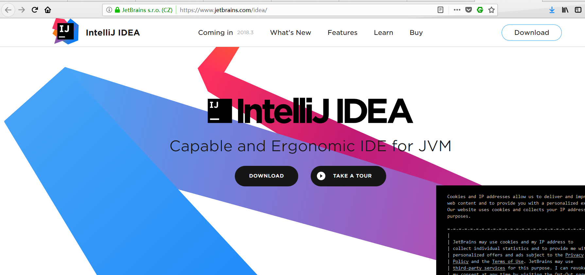
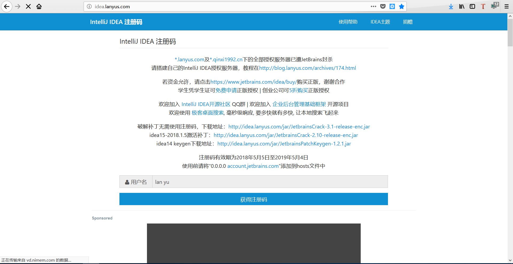
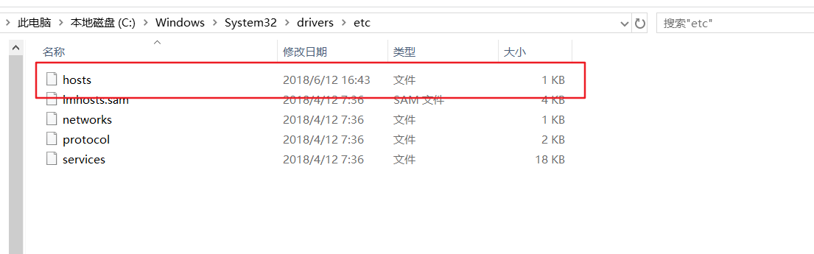
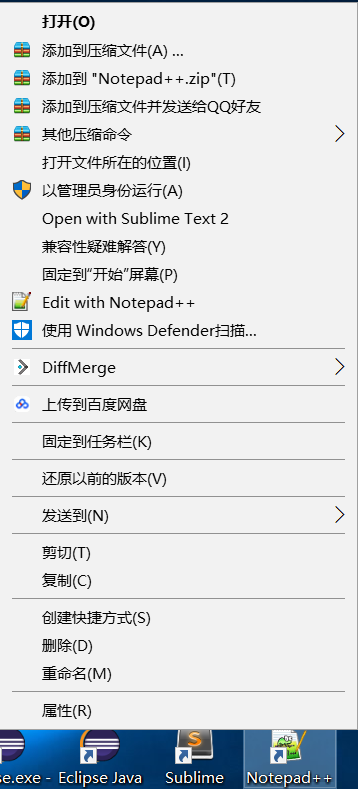
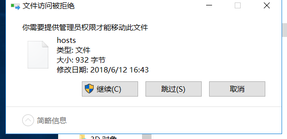
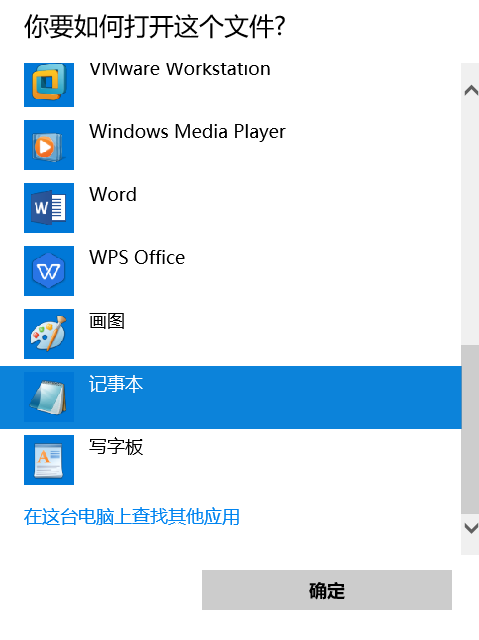
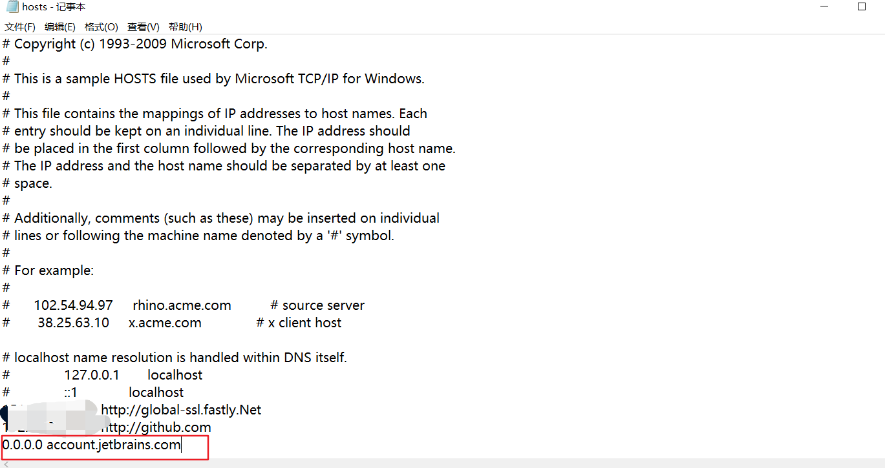
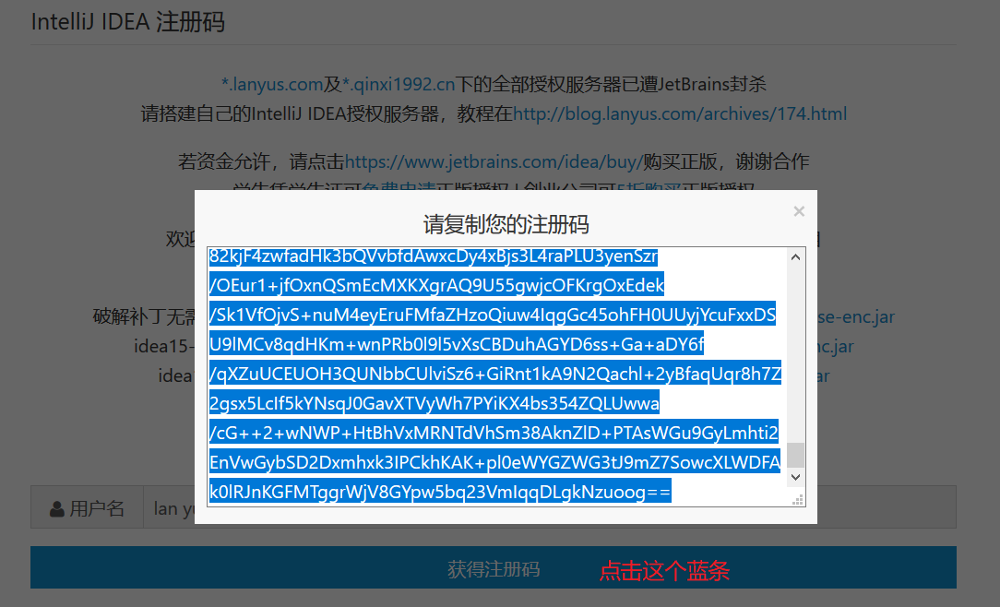

# IDEA安装和激活

### IDEA安装

按照最新版本有可能会有很多BUG的原则，我们就安装IDEA 2018.1.6版本的。

首先，我们到IDEA官网去下载IDEA，[官网链接](https://www.jetbrains.com/idea/)，但是这个界面的版本一般为最新的。

这里我放出IDEA2018.1.6版本的下载连接，如果想下载其他版本可以试试改版本号。

[下载链接](https://download.jetbrains.com/idea/ideaIU-2018.1.6.exe)

选择好安装地址，之后无脑**next**。

### IDEA激活

可以去这个[网站](http://idea.lanyus.com/)去获得注册码之类的。

我这里使用激活码方式激活IDEA，其他方式可以看他的[博客](http://blog.lanyus.com/)查询。

#### 首先更改hosts文件

拿Windows为例

`hosts文件`一般在`C:\Windows\System32\drivers\etc`目录下

`hosts文件`存在权限，所以需要管理员权限才能打开。

这里以`notepad++`为例

(

当然如果想通过记事本打开，只有将`hosts文件`拖到桌面，然后打开，再修改`hosts文件`。

具体步骤：

- 将`hosts文件`拖向桌面

  

  点击继续即可。

- 修改`hosts文件`内容

  

  选择记事本打开。

  

  粘贴这一段到最后一行即可。

#### 使用验证码

- 复制[网站](http://idea.lanyus.com/)的验证码

- 复制完之后，粘贴到IDEA激活界面的`linsence code`中即可。