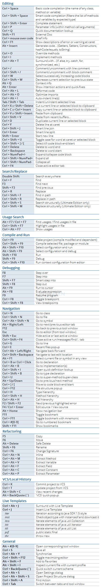

# IDEA快捷键

### 查找相关快捷键

1. 双击shift 在项目的所有目录查找，就是你想看到你不想看到的和你没想过你能看到的都给你找出来  
2. ctrl+f 当前文件查找特定内容  
3. ctrl+shift+f 当前项目查找包含特定内容的文件  
4. ctrl+n 查找类  
5. ctrl+shift+n 查找文件  
6. ctrl+e 最近的文件  
7. alt+F7 非常非常频繁使用的一个快捷键，可以帮你找到你的函数或者变量或者类的所有引用到的地方 

### 编辑相关快捷键

1. shift+enter 另起一行  
2. ctrl+r 当前文件替换特定内容 
3. ctrl+shift+r 当前项目替换特定内容  
4. shift+F6 非常非常省心省力的一个快捷键，可以重命名你的类、方法、变量等等，而且这个重命名甚至可以选择替换掉注释中的内容  
5. ctrl+d 复制当前行到下一行  
6. ctrl+x 剪切当前行  
7. ctrl+c \ ctrl+v  大家都懂的  
8. ctrl+z 撤销  
9. ctrl+shift+z 取消撤销  
10. ctrl+k 提交代码到SVN  
11. ctrl+t 更新代码  
12. alt+insert 可以自动生成构造器、getter/setter等等常用方法  
13. alt+enter 自动修复  
14. ctrl+alt+L 格式化 

### IDEA所有快捷键

