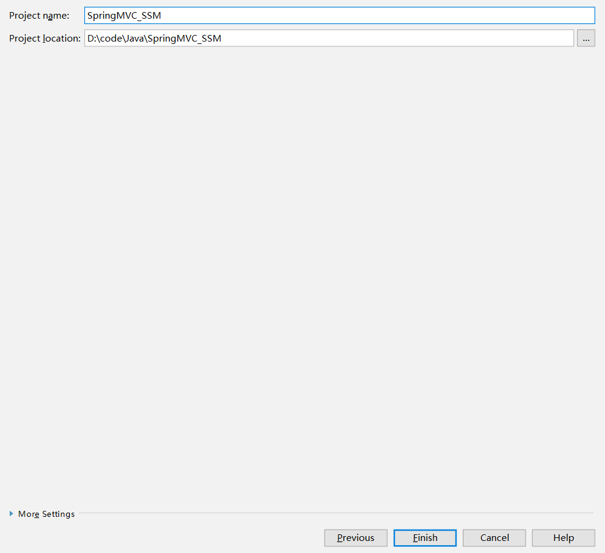

# IDEA搭建MAVEN+SSM项目

### 新建项目

在`File`中选择new=>project...选择maven，如图


然后填入相应的maven项目组信息


选择自己的maven本地仓库路径


next



finsh

然后右下角会出来这个对话框


我一般都选择红圈圈中的选项，自动导包。

### 导入依赖包

可以去阿里云的maven仓库找

这里给出该仓库的搜索地址：http://maven.aliyun.com/mvn/search

```xml
<?xml version="1.0" encoding="UTF-8"?>
<project xmlns="http://maven.apache.org/POM/4.0.0"
         xmlns:xsi="http://www.w3.org/2001/XMLSchema-instance"
         xsi:schemaLocation="http://maven.apache.org/POM/4.0.0 http://maven.apache.org/xsd/maven-4.0.0.xsd">
    <modelVersion>4.0.0</modelVersion>

    <groupId>com.happycoder</groupId>
    <artifactId>ssm</artifactId>
    <version>1.0-SNAPSHOT</version>

    <dependencies>
        <!-- MySQL驱动 -->
        <dependency>
            <groupId>mysql</groupId>
            <artifactId>mysql-connector-java</artifactId>
            <version>5.1.17</version>
        </dependency>
        <!-- druid数据源 -->
        <dependency>
            <groupId>com.alibaba</groupId>
            <artifactId>druid</artifactId>
            <version>0.1.18</version>
        </dependency>
        <!-- mybatis -->
        <dependency>
            <groupId>org.mybatis</groupId>
            <artifactId>mybatis</artifactId>
            <version>3.2.1</version>
        </dependency>
        <!-- 单元测试 -->
        <dependency>
            <groupId>junit</groupId>
            <artifactId>junit</artifactId>
            <version>4.11</version>
        </dependency>
        <!-- spring上下文 -->
        <dependency>
            <groupId>org.springframework</groupId>
            <artifactId>spring-context-support</artifactId>
            <version>4.3.3.RELEASE</version>
        </dependency>
        <!-- spring-jdbc -->
        <dependency>
            <groupId>org.springframework</groupId>
            <artifactId>spring-jdbc</artifactId>
            <version>4.3.3.RELEASE</version>
        </dependency>
        <!-- 事务管理 -->
        <!-- aop -->
        <!-- spring-mvc 这个依赖中已经包含了事务管理和aop -->
        <dependency>
            <groupId>org.springframework</groupId>
            <artifactId>spring-webmvc</artifactId>
            <version>4.3.3.RELEASE</version>
        </dependency>
        <!-- mybatis-spring -->
        <dependency>
            <groupId>org.mybatis</groupId>
            <artifactId>mybatis-spring</artifactId>
            <version>1.3.0</version>
        </dependency>
        <!-- 第三方依赖，防止部分依赖不可用 -->
        <dependency>
            <groupId>org.aspectj</groupId>
            <artifactId>aspectjweaver</artifactId>
            <version>1.8.10</version>
        </dependency>
        <!-- jstl语法依赖 -->
        <dependency>
            <groupId>jstl</groupId>
            <artifactId>jstl</artifactId>
            <version>1.2</version>
        </dependency>
    </dependencies>
</project>
```

我的`pom.xml`

### 新建文件夹

`java`设置为`Sources Root`


新建`resources`设置为`Resources Root`


### 配置SpringMVC

首先需要配置Web.xml这个不必多说，网站项目运行第一个加载的就是web.xml，进入src->main->webapp->WEB-INF->web.xml

```xml
<web-app xmlns="http://xmlns.jcp.org/xml/ns/javaee"
         xmlns:xsi="http://www.w3.org/2001/XMLSchema-instance"
         xsi:schemaLocation="http://xmlns.jcp.org/xml/ns/javaee http://xmlns.jcp.org/xml/ns/javaee/web-app_3_1.xsd"
         version="3.1">
  <!-- 1.针对Spring配置：读取配置文件 -->
  <context-param>
    <param-name>contextConfigLocation</param-name>
    <param-value>classpath:applicationContext.xml</param-value>
  </context-param>

  <!-- 注册ServletContext监听器，创建容器对象，并且将ApplicationContext对象放到Application域中 -->
  <listener>
    <listener-class>org.springframework.web.context.ContextLoaderListener</listener-class>
  </listener>

  <!-- 针对SpringMVC的配置：：：：：：中央调度器：本质上一个serlvet            配置的关于SpringmVC组件 -->
  <servlet>
    <servlet-name>springmvc</servlet-name>
    <servlet-class>org.springframework.web.servlet.DispatcherServlet</servlet-class>
    <init-param>
      <param-name>contextConfigLocation</param-name>
      <param-value>classpath:applicationContext.xml</param-value>
    </init-param>
    <load-on-startup>1</load-on-startup>
  </servlet>

  <servlet-mapping>
    <servlet-name>springmvc</servlet-name>
    <url-pattern>*.do</url-pattern>
  </servlet-mapping>

  <!-- 解决乱码的过滤器 -->
  <filter>
    <filter-name>CharacterEncodingFilter</filter-name>
    <filter-class>org.springframework.web.filter.CharacterEncodingFilter</filter-class>
    <init-param>
      <param-name>encoding</param-name>
      <param-value>utf-8</param-value>
    </init-param>

    <init-param>
      <param-name>forceEncoding</param-name>
      <param-value>true</param-value>
    </init-param>
  </filter>

  <filter-mapping>
    <filter-name>CharacterEncodingFilter</filter-name>
    <url-pattern>/*</url-pattern>
  </filter-mapping>
</web-app>
```

然后在Resources资源文件夹下新建applicationContext.xml

```xml
<?xml version="1.0" encoding="UTF-8"?>
<beans xmlns="http://www.springframework.org/schema/beans"
   xmlns:xsi="http://www.w3.org/2001/XMLSchema-instance"
   xmlns:aop="http://www.springframework.org/schema/aop"
   xmlns:context="http://www.springframework.org/schema/context"
   xmlns:p="http://www.springframework.org/schema/p"
   xmlns:tx="http://www.springframework.org/schema/tx"
   xsi:schemaLocation="
       http://www.springframework.org/schema/beans 
       http://www.springframework.org/schema/beans/spring-beans.xsd
        http://www.springframework.org/schema/aop
        http://www.springframework.org/schema/aop/spring-aop-4.1.xsd
        http://www.springframework.org/schema/tx
        http://www.springframework.org/schema/tx/spring-tx-4.1.xsd
          http://www.springframework.org/schema/context
        http://www.springframework.org/schema/context/spring-context-4.1.xsd  " >
       
  <!-- 01.配置数据源 -->
  <bean id="dataSource" class="com.mchange.v2.c3p0.ComboPooledDataSource">
       <property name="driverClass" value="${jdbc.driverClass}"></property>
        <property name="jdbcUrl" value="${jdbc.jdbcUrl}"></property>
        <property name="user" value="${jdbc.user}"></property>
        <property name="password" value="${jdbc.password}"></property>
  </bean>
  
  <!-- 1.1 关联jdbc.properties -->
 <context:property-placeholder location="classpath:jdbc.properties"/>

  <!-- 02.配置SessionFactory -->
<bean id="sessionFactory" class="org.mybatis.spring.SqlSessionFactoryBean">
     <property name="configLocation" value="classpath:mybatis-config.xml"></property>
      <property name="dataSource" ref="dataSource"></property>
  </bean>
  

  <!-- 03.生成dao代理對象 -->
   <bean class="org.mybatis.spring.mapper.MapperScannerConfigurer">
      <property name="sqlSessionFactoryBeanName" value="sessionFactory"></property>
      <property name="basePackage" value="cn.jpp.dao"></property>
   </bean>
   
   <!--04.配置service-->
    <bean id="userService" class="cn.jpp.service.UserInfoServiceImpl">
       <property name="dao" ref="IUserInfoDAO"></property>
   </bean>

   <!-- 05.配置action -->
    <bean id="/userAction.do" class="cn.jpp.controller.UserInfoController">
      <property name="service" ref="userService"></property>
   </bean>
   
   <!-- 06.配置事务管理器 -->
   <bean id="transactionManager" class="org.springframework.jdbc.datasource.DataSourceTransactionManager">
     <property name="dataSource" ref="dataSource"></property>
   </bean>
    
   <!-- 07.配置开启事务操作 -->
  <tx:advice id="txAdvice" transaction-manager="transactionManager">
    <tx:attributes>
    <!--指定在连接方法上应用的事务属性 -->
       <tx:method name="add*" isolation="DEFAULT" propagation="REQUIRED"/>
    </tx:attributes>
  </tx:advice>
  <!-- aop配置 -->
 <aop:config>
    <aop:pointcut expression="execution(* *..service.*.*(..))" id="stockPointcut"/>
    <aop:advisor advice-ref="txAdvice" pointcut-ref="stockPointcut"/>
 </aop:config>

</beans>
```

jdbc.properties

```properties
jdbc.driverClass=com.mysql.jdbc.Driver
jdbc.jdbcUrl=jdbc:mysql://localhost:3306/how2java?characterEncoding=UTF-8
jdbc.user=root
jdbc.password=root
```

mybatis-config.xml

```xml
<?xml version="1.0" encoding="UTF-8" ?>
<!DOCTYPE configuration
PUBLIC "-//mybatis.org//DTD Config 3.0//EN"
"http://mybatis.org/dtd/mybatis-3-config.dtd">
<configuration>
 <typeAliases>
    <package name="cn.jpp.entity"/>
 </typeAliases>
    <mappers>
        <!--<mapper resource="cn/happy/entity/IUserInfoDAO.xml" /> -->
        <package name="cn.jpp.dao"/>
   </mappers>
</configuration>
```

将maven方式环境变量中


然后`cmd`中输入`mvn -version`