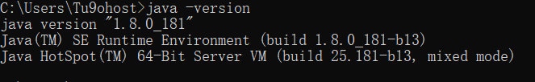
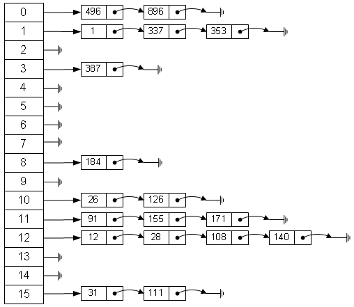
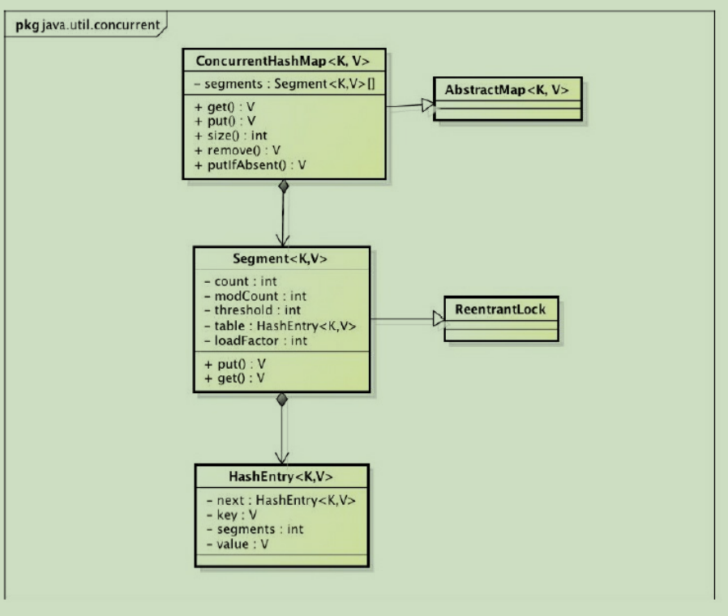
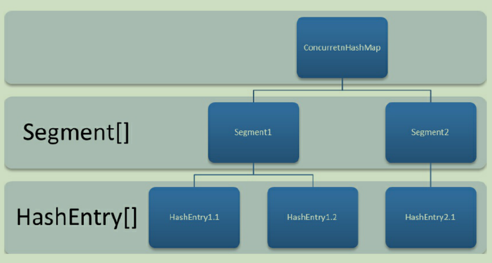

# JDK版本



# ArrayList

### ArrayList简介

ArrayList 是一个数组队列，相当于 动态数组。与Java中的数组相比，它的容量能动态增长。它继承于AbstractList，实现了List, RandomAccess, Cloneable, java.io.Serializable这些接口。
ArrayList 继承了AbstractList，实现了List。它是一个数组队列，提供了相关的添加、删除、修改、遍历等功能。
ArrayList 实现了RandmoAccess接口，即提供了随机访问功能。RandmoAccess是java中用来被List实现，为List提供快速访问功能的。在ArrayList中，我们即可以通过元素的序号快速获取元素对象；这就是快速随机访问。稍后，我们会比较List的“快速随机访问”和“通过Iterator迭代器访问”的效率。
ArrayList 实现了Cloneable接口，即覆盖了函数clone()，能被克隆。
ArrayList 实现java.io.Serializable接口，这意味着ArrayList支持序列化，能通过序列化去传输。

和Vector不同，ArrayList中的操作不是线程安全的！所以，建议在单线程中才使用ArrayList，而在多线程中可以选择Vector或者CopyOnWriteArrayList。

### ArrayList属性

```java
public class ArrayList<E> extends AbstractList<E>
        implements List<E>, RandomAccess, Cloneable, java.io.Serializable
{
	//序列化ID
    private static final long serialVersionUID = 8683452581122892189L;

    //默认初始化的容量
    private static final int DEFAULT_CAPACITY = 10;

    //一个空数组实例
    private static final Object[] EMPTY_ELEMENTDATA = {};

    //一个空数组实例，如果使用默认构造函数创建，则默认对象内容默认是该值
    private static final Object[] DEFAULTCAPACITY_EMPTY_ELEMENTDATA = {};

    //当前数据对象存放地方，当前对象不参与序列化
    transient Object[] elementData; // non-private to simplify nested class access

    //当前数组的大小
    private int size;
    ...
```

### ArrayList构造函数

#### 无参构造函数

```java
//无参构造函数
    public ArrayList() {
        this.elementData = DEFAULTCAPACITY_EMPTY_ELEMENTDATA;
    }
```

#### 带int类型的构造函数

```java
//带int类型的构造函数
    public ArrayList(int initialCapacity) {
        if (initialCapacity > 0) {
            this.elementData = new Object[initialCapacity];
        } else if (initialCapacity == 0) {
            this.elementData = EMPTY_ELEMENTDATA;
        } else {
            throw new IllegalArgumentException("Illegal Capacity: "+
                                               initialCapacity);
        }
    }
```

#### 带Collection对象的构造函数

```java
//带Collection对象的构造函数
    public ArrayList(Collection<? extends E> c) {
        elementData = c.toArray();
        if ((size = elementData.length) != 0) {
            // c.toArray might (incorrectly) not return Object[] (see 6260652)
            if (elementData.getClass() != Object[].class)
                elementData = Arrays.copyOf(elementData, size, Object[].class);
        } else {
            // replace with empty array.
            this.elementData = EMPTY_ELEMENTDATA;
        }
    }
```

### add方法

#### add(E e)

add主要的执行逻辑如下：
1）确保数组已使用长度（size）加1之后足够存下 下一个数据
2）修改次数modCount 标识自增1，如果当前数组已使用长度（size）加1后的大于当前的数组长度，则调用grow方法，增长数组，grow方法会将当前数组的长度变为原来容量的1.5倍。
3）确保新增的数据有地方存储之后，则将新元素添加到位于size的位置上。
4）返回添加成功布尔值。

```java
public boolean add(E e) {
        ensureCapacityInternal(size + 1);  // Increments modCount!!
        elementData[size++] = e;
        return true;
    }
```
将修改次数（modCount）自增1，判断是否需要扩充数组长度,判断条件就是用当前所需的数组最小长度与数组的长度对比，如果大于0，则增长数组长度。

ensureCapacityInternal

```java
private void ensureCapacityInternal(int minCapacity) {
        ensureExplicitCapacity(calculateCapacity(elementData, minCapacity));
    }
```
calculateCapacity
```java
private static int calculateCapacity(Object[] elementData, int minCapacity) {
        if (elementData == DEFAULTCAPACITY_EMPTY_ELEMENTDATA) {
            return Math.max(DEFAULT_CAPACITY, minCapacity);
        }
        return minCapacity;
    }
```
将修改次数（modCount）自增1，判断是否需要扩充数组长度,判断条件就是用当前所需的数组最小长度与数组的长度对比，如果大于0，则增长数组长度。

ensureExplicitCapacity

```java
private void ensureExplicitCapacity(int minCapacity) {
        modCount++;

        // overflow-conscious code
        if (minCapacity - elementData.length > 0)
            grow(minCapacity);
    }
```
如果当前的数组已使用空间（size）加1之后 大于数组长度，则增大数组容量，扩大为原来的1.5倍。

grow

```java
private void grow(int minCapacity) {
        // overflow-conscious code
        int oldCapacity = elementData.length;
        int newCapacity = oldCapacity + (oldCapacity >> 1);
        if (newCapacity - minCapacity < 0)
            newCapacity = minCapacity;
        if (newCapacity - MAX_ARRAY_SIZE > 0)
            newCapacity = hugeCapacity(minCapacity);
        // minCapacity is usually close to size, so this is a win:
        elementData = Arrays.copyOf(elementData, newCapacity);
    }
```

#### add(int index, E e)

这个方法其实和上面的add类似，该方法可以按照元素的位置，指定位置插入元素，具体的执行逻辑如下：
1）确保数插入的位置小于等于当前数组长度，并且不小于0，否则抛出异常
2）确保数组已使用长度（size）加1之后足够存下 下一个数据
3）修改次数（modCount）标识自增1，如果当前数组已使用长度（size）加1后的大于当前的数组长度，则调用grow方法，增长数组
4）grow方法会将当前数组的长度变为原来容量的1.5倍。
5）确保有足够的容量之后，使用System.arraycopy 将需要插入的位置（index）后面的元素统统往后移动一位。
6）将新的数据内容存放到数组的指定位置（index）上

```java
public void add(int index, E e) {
            rangeCheckForAdd(index);
            checkForComodification();
            parent.add(parentOffset + index, e);
            this.modCount = parent.modCount;
            this.size++;
        }
```

### get方法

返回指定位置上的元素

```java
public E get(int index) {
            rangeCheck(index);
            checkForComodification();
            return ArrayList.this.elementData(offset + index);
        }
```

### set方法

确保set的位置小于当前数组的长度（size）并且大于0，获取指定位置（index）元素，然后放到oldValue存放，将需要设置的元素放到指定的位置（index）上，然后将原来位置上的元素oldValue返回给用户。

```java
public E set(int index, E element) {
        rangeCheck(index);

        E oldValue = elementData(index);
        elementData[index] = element;
        return oldValue;
    }
```

### contains方法

调用indexOf方法，遍历数组中的每一个元素作对比，如果找到对于的元素，则返回true，没有找到则返回false。

```java
public boolean contains(Object o) {
        return indexOf(o) >= 0;
    }
```

indexOf

```java
public int indexOf(Object o) {
        if (o == null) {
            for (int i = 0; i < size; i++)
                if (elementData[i]==null)
                    return i;
        } else {
            for (int i = 0; i < size; i++)
                if (o.equals(elementData[i]))
                    return i;
        }
        return -1;
    }
```

### remove方法

#### 根据索引remove

1）判断索引有没有越界

2）自增修改次数

3）将指定位置（index）上的元素保存到oldValue

4）将指定位置（index）上的元素都往前移动一位

5）将最后面的一个元素置空，好让垃圾回收器回收

6）将原来的值oldValue返回

```java
public E remove(int index) {
        rangeCheck(index);

        modCount++;
        E oldValue = elementData(index);

        int numMoved = size - index - 1;
        if (numMoved > 0)
            System.arraycopy(elementData, index+1, elementData, index,
                             numMoved);
        elementData[--size] = null; // clear to let GC do its work

        return oldValue;
    }
```

#### 根据对象

```java
public boolean remove(Object o) {
        if (o == null) {
            for (int index = 0; index < size; index++)
                if (elementData[index] == null) {
                    fastRemove(index);
                    return true;
                }
        } else {
            for (int index = 0; index < size; index++)
                if (o.equals(elementData[index])) {
                    fastRemove(index);
                    return true;
                }
        }
        return false;
    }
```

定位到需要remove的元素索引，先将index后面的元素往前面移动一位（调用System.arraycooy实现），然后将最后一个元素置空。

fastRemove

```java
private void fastRemove(int index) {
        modCount++;
        int numMoved = size - index - 1;
        if (numMoved > 0)
            System.arraycopy(elementData, index+1, elementData, index,
                             numMoved);
        elementData[--size] = null; // clear to let GC do its work
    }
```

### clear方法

添加操作次数（modCount），将数组内的元素都置空，等待垃圾收集器收集，不减小数组容量。

```java
public void clear() {
        modCount++;

        // clear to let GC do its work
        for (int i = 0; i < size; i++)
            elementData[i] = null;

        size = 0;
    }
```

### subList方法

我们看到代码中是创建了一个ArrayList 类里面的一个内部类SubList对象，传入的值中第一个参数时this参数，其实可以理解为返回当前list的部分视图，真实指向的存放数据内容的地方还是同一个地方，如果修改了sublist返回的内容的话，那么原来的list也会变动。

```java
public List<E> subList(int fromIndex, int toIndex) {
        subListRangeCheck(fromIndex, toIndex, size);
        return new SubList(this, 0, fromIndex, toIndex);
    }
```

### trimTosize方法

1）修改次数加1
2）将elementData中空余的空间（包括null值）去除，例如：数组长度为10，其中只有前三个元素有值，其他为空，那么调用该方法之后，数组的长度变为3.

```java
public void trimToSize() {
        modCount++;
        if (size < elementData.length) {
            elementData = (size == 0)
              ? EMPTY_ELEMENTDATA
              : Arrays.copyOf(elementData, size);
        }
    }
```

### iterator方法

interator方法返回的是一个内部类，由于内部类的创建默认含有外部的this指针，所以这个内部类可以调用到外部类的属性。

```java
public Iterator<E> iterator() {
        return new Itr();
    }
```

这里转发别人的：

一般的话，调用完iterator之后，我们会使用iterator做遍历，这里使用next做遍历的时候有个需要注意的地方，就是调用next的时候，可能会引发ConcurrentModificationException，当修改次数，与期望的修改次数（调用iterator方法时候的修改次数）不一致的时候，会发生该异常，详细我们看一下代码实现：

```java
@SuppressWarnings("unchecked")
        public E next() {
            checkForComodification();
            int i = cursor;
            if (i >= size)
                throw new NoSuchElementException();
            Object[] elementData = ArrayList.this.elementData;
            if (i >= elementData.length)
                throw new ConcurrentModificationException();
            cursor = i + 1;
            return (E) elementData[lastRet = i];
        }
```

expectedModCount这个值是在用户调用ArrayList的iterator方法时候确定的，但是在这之后用户add，或者remove了ArrayList的元素，那么modCount就会改变，那么这个值就会不相等，将会引发ConcurrentModificationException异常，这个是在多线程使用情况下，比较常见的一个异常。
```java
final void checkForComodification() {
            if (modCount != expectedModCount)
                throw new ConcurrentModificationException();
        }
```

### 小结

ArrayList总体来说比较简单，不过ArrayList还有以下一些特点：

- ArrayList自己实现了序列化和反序列化的方法，因为它自己实现了 private void writeObject(java.io.ObjectOutputStream s)和 private void readObject(java.io.ObjectInputStream s) 方法
- ArrayList基于数组方式实现，无容量的限制（会扩容）
- 添加元素时可能要扩容（所以最好预判一下），删除元素时不会减少容量（若希望减少容量，trimToSize()），**删除元素时，将删除掉的位置元素置为null，下次gc就会回收这些元素所占的内存空间**。
- 线程不安全
- add(int index, E element)：添加元素到数组中指定位置的时候，需要将该位置及其后边所有的元素都整块向后复制一位
- get(int index)：获取指定位置上的元素时，可以通过索引直接获取（O(1)）
- remove(Object o)需要遍历数组
- remove(int index)不需要遍历数组，只需判断index是否符合条件即可，效率比remove(Object o)高
- contains(E)需要遍历数组
- 使用iterator遍历可能会引发多线程异常

# LinkedList

### LinkedList简介

LinkedList 是一个继承于AbstractSequentialList的双向链表。它也可以被当作堆栈、队列或双端队列进行操作。
LinkedList 实现 List 接口，能对它进行队列操作。
LinkedList 实现 Deque 接口，即能将LinkedList当作双端队列使用。
LinkedList 实现了Cloneable接口，即覆盖了函数clone()，能克隆。
LinkedList 实现java.io.Serializable接口，这意味着LinkedList支持序列化，能通过序列化去传输。
LinkedList 是非同步的。

LinkedList相对于ArrayList来说，是可以快速添加，删除元素，ArrayList添加删除元素的话需移动数组元素，可能还需要考虑到扩容数组长度。

### LinkedList属性

```java
public class LinkedList<E>
    extends AbstractSequentialList<E>
    implements List<E>, Deque<E>, Cloneable, java.io.Serializable
{
	//当前拥有多少个节点
    transient int size = 0;

    //第一个节点
    transient Node<E> first;

    //最后一个节点
    transient Node<E> last;

...
```

### LinkedList构造方法

默认构造方法是空的，什么都没做，表示初始化的时候size为0，first和last的节点都为空：

```java
public LinkedList() {
    }
```

另一个构造方法是带Collection值得对象作为入参的构造函数的，下面是执行逻辑：
1）使用this（）调用默认的无参构造函数。

2）调用addAll（）方法，传入当前的节点个数size，此时size为0，并将collection对象传递进去

3）检查index有没有数组越界的嫌疑

4）将collection转换成数组对象a

5）循环遍历a数组，然后将a数组里面的元素创建成拥有前后连接的节点，然后一个个按照顺序连起来。

6）修改当前的节点个数size的值

7）操作次数modCount自增1.

```java
public LinkedList(Collection<? extends E> c) {
        this();
        addAll(c);
    }
```

调用带参数的addAll方法

```java
public boolean addAll(Collection<? extends E> c) {
        return addAll(size, c);
    }
```

将collection对象转换成数组链表

```java
public boolean addAll(int index, Collection<? extends E> c) {
        checkPositionIndex(index);

        Object[] a = c.toArray();
        int numNew = a.length;
        if (numNew == 0)
            return false;

        Node<E> pred, succ;
        if (index == size) {
            succ = null;
            pred = last;
        } else {
            succ = node(index);
            pred = succ.prev;
        }

        for (Object o : a) {
            @SuppressWarnings("unchecked") E e = (E) o;
            Node<E> newNode = new Node<>(pred, e, null);
            if (pred == null)
                first = newNode;
            else
                pred.next = newNode;
            pred = newNode;
        }

        if (succ == null) {
            last = pred;
        } else {
            pred.next = succ;
            succ.prev = pred;
        }

        size += numNew;
        modCount++;
        return true;
    }
```

### add方法

#### add(E e)

该方法直接将新增的元素放置链表的最后面，然后链表的长度（size）加1，修改的次数（modCount）加1

```java
public boolean add(E e) {
        linkLast(e);
        return true;
    }
```

linkLast

```java
void linkLast(E e) {
        final Node<E> l = last;
        final Node<E> newNode = new Node<>(l, e, null);
        last = newNode;
        if (l == null)
            first = newNode;
        else
            l.next = newNode;
        size++;
        modCount++;
    }
```

#### add(int index, E element)

指定位置往数组链表中添加元素

1）检查添加的位置index 有没有小于等于当前的长度链表size，并且要求大于0

2）如果是index是等于size，那么直接往链表的最后面添加元素，相当于调用add(E e)方法

3）如果index不等于size，则先是索引到处于index位置的元素，然后在index的位置前面添加新增的元素。

```java
public void add(int index, E element) {
        checkPositionIndex(index);

        if (index == size)
            linkLast(element);
        else
            linkBefore(element, node(index));
    }
```

把索引到的元素添加到新增的元素之后

```java
void linkBefore(E e, Node<E> succ) {
        // assert succ != null;
        final Node<E> pred = succ.prev;
        final Node<E> newNode = new Node<>(pred, e, succ);
        succ.prev = newNode;
        if (pred == null)
            first = newNode;
        else
            pred.next = newNode;
        size++;
        modCount++;
    }
```

### get方法

#### get

首先是判断索引位置有没有越界，确定完成之后开始遍历链表的元素，那么从头开始遍历还是从结尾开始遍历呢，这里其实是要索引的位置与当前链表长度的一半去做对比，如果索引位置小于当前链表长度的一半，否则从结尾开始遍历

```java
public E get(int index) {
        checkElementIndex(index);
        return node(index).item;
    }
```

遍历链表元素

```java
Node<E> node(int index) {
        // assert isElementIndex(index);

        if (index < (size >> 1)) {
            Node<E> x = first;
            for (int i = 0; i < index; i++)
                x = x.next;
            return x;
        } else {
            Node<E> x = last;
            for (int i = size - 1; i > index; i--)
                x = x.prev;
            return x;
        }
    }
```

#### getfirst

直接将第一个元素返回

```java
public E getFirst() {
        final Node<E> f = first;
        if (f == null)
            throw new NoSuchElementException();
        return f.item;
    }
```

#### getlast

直接将最后一个元素返回

```java
public E getLast() {
        final Node<E> l = last;
        if (l == null)
            throw new NoSuchElementException();
        return l.item;
    }
```

### remove

#### remove

remove方法本质调用的还是removeFirst方法

```java
public E remove() {
        return removeFirst();
    }
```

#### removeFirst

移除第一个节点，将第一个节点置空，让下一个节点变成第一个节点，链表长度减1，修改次数加1，返回移除的第一个节点。

```java
public E removeFirst() {
        final Node<E> f = first;
        if (f == null)
            throw new NoSuchElementException();
        return unlinkFirst(f);
    }
```

unlinkFirst

```java
private E unlinkFirst(Node<E> f) {
        // assert f == first && f != null;
        final E element = f.item;
        final Node<E> next = f.next;
        f.item = null;
        f.next = null; // help GC
        first = next;
        if (next == null)
            last = null;
        else
            next.prev = null;
        size--;
        modCount++;
        return element;
    }
```

#### removeLast

移除最后一个节点，将最后一个节点置空，最后一个节点的上一个节点变成last节点，，链表长度减1，修改次数加1，返回移除的最后一个节点。

```java
public E removeLast() {
        final Node<E> l = last;
        if (l == null)
            throw new NoSuchElementException();
        return unlinkLast(l);
    }
```

#### remove(int index)

先是检查移除的位置是否在链表长度的范围内，如果不在则抛出异常，根据索引index获取需要移除的节点，将移除的节点置空，让其上一个节点和下一个节点对接起来。

```java
public E remove(int index) {
        checkElementIndex(index);
        return unlink(node(index));
    }
```

```java
private E unlinkLast(Node<E> l) {
        // assert l == last && l != null;
        final E element = l.item;
        final Node<E> prev = l.prev;
        l.item = null;
        l.prev = null; // help GC
        last = prev;
        if (prev == null)
            first = null;
        else
            prev.next = null;
        size--;
        modCount++;
        return element;
    }
```

#### remove(Object o)

移除此列表中第一個出現的指定元素，如果它存在。如果此列表中不包含該元素，此列表是不變的。

```java
public boolean remove(Object o) {
        if (o == null) {
            for (Node<E> x = first; x != null; x = x.next) {
                if (x.item == null) {
                    unlink(x);
                    return true;
                }
            }
        } else {
            for (Node<E> x = first; x != null; x = x.next) {
                if (o.equals(x.item)) {
                    unlink(x);
                    return true;
                }
            }
        }
        return false;
    }
```

```java
E unlink(Node<E> x) {
        // assert x != null;
        final E element = x.item;
        final Node<E> next = x.next;
        final Node<E> prev = x.prev;

        if (prev == null) {
            first = next;
        } else {
            prev.next = next;
            x.prev = null;
        }

        if (next == null) {
            last = prev;
        } else {
            next.prev = prev;
            x.next = null;
        }

        x.item = null;
        size--;
        modCount++;
        return element;
    }
```

### set

检查设置元素位然后置是否越界，如果没有，则索引到index位置的节点，将index位置的节点内容替换成新的内容element，同时返回旧值。

```java
public E set(int index, E element) {
        checkElementIndex(index);
        Node<E> x = node(index);
        E oldVal = x.item;
        x.item = element;
        return oldVal;
    }
```

### clear

将所有链表元素置空，然后将链表长度修改成0，修改次数加1

```java
public void clear() {
        // Clearing all of the links between nodes is "unnecessary", but:
        // - helps a generational GC if the discarded nodes inhabit
        //   more than one generation
        // - is sure to free memory even if there is a reachable Iterator
        for (Node<E> x = first; x != null; ) {
            Node<E> next = x.next;
            x.item = null;
            x.next = null;
            x.prev = null;
            x = next;
        }
        first = last = null;
        size = 0;
        modCount++;
    }
```

### pop 和 push

push其实就是调用addFirst(e)方法，pop调用的就是removeFirst()方法。

### toArray

创建一个Object的数组对象，然后将所有的节点都添加到Object对象中，返回Object数组对象。

```java
public Object[] toArray() {
        Object[] result = new Object[size];
        int i = 0;
        for (Node<E> x = first; x != null; x = x.next)
            result[i++] = x.item;
        return result;
    }
```

### listIterator

这个方法返回的是一个内部类ListIterator，用户可以使用这个内部类变量当前的链表元素，但是由于LinkedList也是非线程安全的类，所以和上一篇文章中的[JDK源码分析（1）ArrayList](https://blog.csdn.net/tangzongpi6936/article/details/83048126#t11)  Iterator一样，多线程下面使用，也可能会产生多线程修改的异常。

```java
public ListIterator<E> listIterator(int index) {
        checkPositionIndex(index);
        return new ListItr(index);
    }
```

# HashSet

### HashSet简介

### HashSet特点

- 非线程安全
- 允许null值
- 添加值得时候会先获取对象的hashCode方法，如果hashCode 方法返回的值一致，则再调用equals方法判断是否一致，如果不一致才add元素。
  注意： 对于HashSet中保存的对象，请注意正确重写其equals和hashCode方法，以保证放入的对象的唯一性。

### HashSet源码

```java
public class HashSet<E>
    extends AbstractSet<E>
    implements Set<E>, Cloneable, java.io.Serializable
{
    static final long serialVersionUID = -5024744406713321676L;

	//底层使用HashMap来保存HashSet中所有元素。 
    private transient HashMap<E,Object> map;

    //定义一个虚拟的Object对象作为HashMap的value，将此对象定义为static final。
    private static final Object PRESENT = new Object();

    /** 
    * 默认的无参构造器，构造一个空的HashSet。 
    *  
    * 实际底层会初始化一个空的HashMap，并使用默认初始容量为16和加载因子0.75。 
    */  
    public HashSet() {
        map = new HashMap<>();
    }

     /** 
     * 构造一个包含指定collection中的元素的新set。 
     * 
     * 实际底层使用默认的加载因子0.75和足以包含指定 
     * collection中所有元素的初始容量来创建一个HashMap。 
     * @param c 其中的元素将存放在此set中的collection。 
	 *
     * @throws NullPointerException if the specified collection is null
     */
    public HashSet(Collection<? extends E> c) {
        map = new HashMap<>(Math.max((int) (c.size()/.75f) + 1, 16));
        addAll(c);
    }

    /** 
     * 以指定的initialCapacity和loadFactor构造一个空的HashSet。 
     * 
     * 实际底层以相应的参数构造一个空的HashMap。 
     * @param initialCapacity 初始容量。 
     * @param loadFactor 加载因子。
     * @throws     IllegalArgumentException if the initial capacity is less
     *             than zero, or if the load factor is nonpositive
     */
    public HashSet(int initialCapacity, float loadFactor) {
        map = new HashMap<>(initialCapacity, loadFactor);
    }

    /** 
     * 以指定的initialCapacity构造一个空的HashSet。 
	 * 
  	 * 实际底层以相应的参数及加载因子loadFactor为0.75构造一个空的HashMap。 
	 * @param initialCapacity 初始容量。
     * @throws     IllegalArgumentException if the initial capacity is less
     *             than zero
     */
    public HashSet(int initialCapacity) {
        map = new HashMap<>(initialCapacity);
    }

    /** 
     * 以指定的initialCapacity和loadFactor构造一个新的空链接哈希集合。 
     * 此构造函数为包访问权限，不对外公开，实际只是是对LinkedHashSet的支持。 
     * 
     * 实际底层会以指定的参数构造一个空LinkedHashMap实例来实现。 
     * @param initialCapacity 初始容量。 
     * @param loadFactor 加载因子。 
     * @param dummy 标记。！
     * @throws     IllegalArgumentException if the initial capacity is less
     *             than zero, or if the load factor is nonpositive
     */
    HashSet(int initialCapacity, float loadFactor, boolean dummy) {
        map = new LinkedHashMap<>(initialCapacity, loadFactor);
    }

    /**
     * 返回对此set中元素进行迭代的迭代器。返回元素的顺序并不是特定的。 
     *  
     * 底层实际调用底层HashMap的keySet来返回所有的key。 
     * 可见HashSet中的元素，只是存放在了底层HashMap的key上， 
     * value使用一个static final的Object对象标识。 
     * @return 对此set中元素进行迭代的Iterator。
     * @see ConcurrentModificationException
     */
    public Iterator<E> iterator() {
        return map.keySet().iterator();
    }

    /**
     * 返回此set中的元素的数量（set的容量）。 
	 * 
	 * 底层实际调用HashMap的size()方法返回Entry的数量，就得到该Set中元素的个数。 
	 * @return 此set中的元素的数量（set的容量）。
     */
    public int size() {
        return map.size();
    }

    /**
     * 如果此set不包含任何元素，则返回true。 
     * 
     * 底层实际调用HashMap的isEmpty()判断该HashSet是否为空。 
     * @return 如果此set不包含任何元素，则返回true。 
     */
    public boolean isEmpty() {
        return map.isEmpty();
    }

    /**
     * 如果此set包含指定元素，则返回true。 
     * 更确切地讲，当且仅当此set包含一个满足(o==null ? e==null : o.equals(e)) 
     * 的e元素时，返回true。 
     * 
     * 底层实际调用HashMap的containsKey判断是否包含指定key。 
     * @param o 在此set中的存在已得到测试的元素。 
     * @return 如果此set包含指定元素，则返回true。
     */
    public boolean contains(Object o) {
        return map.containsKey(o);
    }

    /**
     * 如果此set中尚未包含指定元素，则添加指定元素。 
     * 更确切地讲，如果此 set 没有包含满足(e==null ? e2==null : e.equals(e2)) 
     * 的元素e2，则向此set 添加指定的元素e。 
     * 如果此set已包含该元素，则该调用不更改set并返回false。 
     * 
     * 底层实际将将该元素作为key放入HashMap。 
     * 由于HashMap的put()方法添加key-value对时，当新放入HashMap的Entry中key 
     * 与集合中原有Entry的key相同（hashCode()返回值相等，通过equals比较也返回true）， 
     * 新添加的Entry的value会将覆盖原来Entry的value，但key不会有任何改变， 
     * 因此如果向HashSet中添加一个已经存在的元素时，新添加的集合元素将不会被放入HashMap中， 
     * 原来的元素也不会有任何改变，这也就满足了Set中元素不重复的特性。 
     * @param e 将添加到此set中的元素。 
     * @return 如果此set尚未包含指定元素，则返回true。
     */
    public boolean add(E e) {
        return map.put(e, PRESENT)==null;
    }

    /**
     * 如果指定元素存在于此set中，则将其移除。 
     * 更确切地讲，如果此set包含一个满足(o==null ? e==null : o.equals(e))的元素e， 
     * 则将其移除。如果此set已包含该元素，则返回true 
     * （或者：如果此set因调用而发生更改，则返回true）。（一旦调用返回，则此set不再包含该元素）。 
     * 
     * 底层实际调用HashMap的remove方法删除指定Entry。 
     * @param o 如果存在于此set中则需要将其移除的对象。 
     * @return 如果set包含指定元素，则返回true。
     */
    public boolean remove(Object o) {
        return map.remove(o)==PRESENT;
    }

    /**
     * 从此set中移除所有元素。此调用返回后，该set将为空。 
     * 
     * 底层实际调用HashMap的clear方法清空Entry中所有元素。
     */
    public void clear() {
        map.clear();
    }

    /**
     * 返回此HashSet实例的浅表副本：并没有复制这些元素本身。 
     * 
     * 底层实际调用HashMap的clone()方法，获取HashMap的浅表副本，并设置到  HashSet中。
     * @return a shallow copy of this set
     */
    @SuppressWarnings("unchecked")
    public Object clone() {
        try {
            HashSet<E> newSet = (HashSet<E>) super.clone();
            newSet.map = (HashMap<E, Object>) map.clone();
            return newSet;
        } catch (CloneNotSupportedException e) {
            throw new InternalError(e);
        }
    }

    /**
     * Save the state of this <tt>HashSet</tt> instance to a stream (that is,
     * serialize it).
     *
     * @serialData The capacity of the backing <tt>HashMap</tt> instance
     *             (int), and its load factor (float) are emitted, followed by
     *             the size of the set (the number of elements it contains)
     *             (int), followed by all of its elements (each an Object) in
     *             no particular order.
     */
    private void writeObject(java.io.ObjectOutputStream s)
        throws java.io.IOException {
        // Write out any hidden serialization magic
        s.defaultWriteObject();

        // Write out HashMap capacity and load factor
        s.writeInt(map.capacity());
        s.writeFloat(map.loadFactor());

        // Write out size
        s.writeInt(map.size());

        // Write out all elements in the proper order.
        for (E e : map.keySet())
            s.writeObject(e);
    }

    /**
     * Reconstitute the <tt>HashSet</tt> instance from a stream (that is,
     * deserialize it).
     */
    private void readObject(java.io.ObjectInputStream s)
        throws java.io.IOException, ClassNotFoundException {
        // Read in any hidden serialization magic
        s.defaultReadObject();

        // Read capacity and verify non-negative.
        int capacity = s.readInt();
        if (capacity < 0) {
            throw new InvalidObjectException("Illegal capacity: " +
                                             capacity);
        }

        // Read load factor and verify positive and non NaN.
        float loadFactor = s.readFloat();
        if (loadFactor <= 0 || Float.isNaN(loadFactor)) {
            throw new InvalidObjectException("Illegal load factor: " +
                                             loadFactor);
        }

        // Read size and verify non-negative.
        int size = s.readInt();
        if (size < 0) {
            throw new InvalidObjectException("Illegal size: " +
                                             size);
        }
        // Set the capacity according to the size and load factor ensuring that
        // the HashMap is at least 25% full but clamping to maximum capacity.
        capacity = (int) Math.min(size * Math.min(1 / loadFactor, 4.0f),
                HashMap.MAXIMUM_CAPACITY);

        // Constructing the backing map will lazily create an array when the first element is
        // added, so check it before construction. Call HashMap.tableSizeFor to compute the
        // actual allocation size. Check Map.Entry[].class since it's the nearest public type to
        // what is actually created.

        SharedSecrets.getJavaOISAccess()
                     .checkArray(s, Map.Entry[].class, HashMap.tableSizeFor(capacity));

        // Create backing HashMap
        map = (((HashSet<?>)this) instanceof LinkedHashSet ?
               new LinkedHashMap<E,Object>(capacity, loadFactor) :
               new HashMap<E,Object>(capacity, loadFactor));

        // Read in all elements in the proper order.
        for (int i=0; i<size; i++) {
            @SuppressWarnings("unchecked")
                E e = (E) s.readObject();
            map.put(e, PRESENT);
        }
    }

    /**
     * Creates a <em><a href="Spliterator.html#binding">late-binding</a></em>
     * and <em>fail-fast</em> {@link Spliterator} over the elements in this
     * set.
     *
     * <p>The {@code Spliterator} reports {@link Spliterator#SIZED} and
     * {@link Spliterator#DISTINCT}.  Overriding implementations should document
     * the reporting of additional characteristic values.
     *
     * @return a {@code Spliterator} over the elements in this set
     * @since 1.8
     */
    public Spliterator<E> spliterator() {
        return new HashMap.KeySpliterator<E,Object>(map, 0, -1, 0, 0);
    }
}

```

# HashMap

### HashMap简介

HashMap基于哈希表的 Map 接口的实现。此实现提供所有可选的映射操作，并允许使用 null 值和 null 键。（除了不同步和允许使用 null 之外，HashMap 类与 Hashtable 大致相同。）此类不保证映射的顺序，特别是它不保证该顺序恒久不变。

　　值得注意的是HashMap不是线程安全的，如果想要线程安全的HashMap，可以通过Collections类的静态方法synchronizedMap获得线程安全的HashMap。

>  Map map = Collections.synchronizedMap(new HashMap());

### HashMap的数据结构

HashMap的底层主要是基于数组和链表来实现的，它之所以有相当快的查询速度主要是因为它是通过计算散列码来决定存储的位置。HashMap中主要是通过key的hashCode来计算hash值的，只要hashCode相同，计算出来的hash值就一样。如果存储的对象对多了，就有可能不同的对象所算出来的hash值是相同的，这就出现了所谓的hash冲突。学过数据结构的同学都知道，解决hash冲突的方法有很多，HashMap底层是通过链表来解决hash冲突的。
下面一幅图，形象的反映出HashMap的数据结构：数组加链表实现



### HashMap属性

```java
/**
     * 初始容量，必须是2的倍数，默认是16
     */
    static final int DEFAULT_INITIAL_CAPACITY = 1 << 4; // aka 16

    /**
     * 最大所能容纳的key-value 个数
     */
    static final int MAXIMUM_CAPACITY = 1 << 30;

    /**
     * 默认的加载因子
     */
    static final float DEFAULT_LOAD_FACTOR = 0.75f;

    /**
     * 树化链表节点的阈值，当某个链表的长度大于或者等于这个长度，则扩大数组容量，或者数化链表
     */
    static final int TREEIFY_THRESHOLD = 8;
```

### HashMap构造方法

默认构造方法将使用默认的加载因子（0.75）初始化。

```java
public HashMap() {
        this.loadFactor = DEFAULT_LOAD_FACTOR; // all other fields defaulted
    }
```

### HashMap(int initialCapacity, float loadFactor)

使用指定的初始容量和默认的加载因子初始化HashMap，这里需要注意的是，并不是你指定的初始容量是多少那么初始化之后的HashMap的容量就是多大，例如new HashMap(20,0.8); 那么实际的初始化容量是32，因为tableSizeFor（）方法会严格要求把初始化的容量是以2的次方数成长只能是16、32、64、128...

```java
public HashMap(int initialCapacity, float loadFactor) {
        if (initialCapacity < 0)
            throw new IllegalArgumentException("Illegal initial capacity: " +
                                               initialCapacity);
        if (initialCapacity > MAXIMUM_CAPACITY)
            initialCapacity = MAXIMUM_CAPACITY;
        if (loadFactor <= 0 || Float.isNaN(loadFactor))
            throw new IllegalArgumentException("Illegal load factor: " +
                                               loadFactor);
        this.loadFactor = loadFactor;
        this.threshold = tableSizeFor(initialCapacity);
    }
```

```java
static final int tableSizeFor(int cap) {
        int n = cap - 1;
        n |= n >>> 1;
        n |= n >>> 2;
        n |= n >>> 4;
        n |= n >>> 8;
        n |= n >>> 16;
        return (n < 0) ? 1 : (n >= MAXIMUM_CAPACITY) ? MAXIMUM_CAPACITY : n + 1;
    }
```

### HashMap(int initialCapacity)

其实这个方法也是调用HashMap(int initialCapacity, float loadFactor)   方法实现的，我们来看看源码实现：

```java
public HashMap(int initialCapacity) {
        this(initialCapacity, DEFAULT_LOAD_FACTOR);
    }
```

### HashMap(Map<? extends K, ? extends V> m)

该方法是按照之前的hashMap的对象，重新深拷贝一份HashMap对象，使用的加载因子是默认的加载因子：0.75。

```java
public HashMap(Map<? extends K, ? extends V> m) {
        this.loadFactor = DEFAULT_LOAD_FACTOR;
        putMapEntries(m, false);
    }
```

### put

执行逻辑：
1）根据key计算当前Node的hash值，用于定位对象在HashMap数组的哪个节点。
2）判断table有没有初始化，如果没有初始化，则调用resize（）方法为table初始化容量，以及threshold的值。
3）根据hash值定位该key 对应的数组索引，如果对应的数组索引位置无值，则调用newNode（）方法，为该索引创建Node节点
4）如果根据hash值定位的数组索引有Node，并且Node中的key和需要新增的key相等，则将对应的value值更新。
5）如果在已有的table中根据hash找到Node，其中Node中的hash值和新增的hash相等，但是key值不相等的，那么创建新的Node，放到当前已存在的Node的链表尾部。
​      如果当前Node的长度大于8,则调用treeifyBin（）方法扩大table数组的容量，或者将当前索引的所有Node节点变成TreeNode节点，变成TreeNode节点的原因是由于TreeNode节点组成的链表索引元素会快很多。
6）将当前的key-value 数量标识size自增，然后和threshold对比，如果大于threshold的值，则调用resize（）方法，扩大当前HashMap对象的存储容量。
7）返回oldValue或者null。
put 方法比较经常使用的方法，主要功能是为HashMap对象添加一个Node 节点，如果Node存在则更新Node里面的内容。

```java
public V put(K key, V value) {
        return putVal(hash(key), key, value, false, true);
    }
```

put的主要的实现逻辑还是在putVal 实现的.下面我们来看看put主要实现逻辑：

```java
/**
     * Implements Map.put and related methods
     *
     @param key的hash值
     * @param key值
     * @param value值
     * @param onlyIfAbsent如果是true，则不修改已存在的value值
     * @param evict if false, the table is in creation mode.
     * @return 返回被修改的value，或者返回null。
     */
    final V putVal(int hash, K key, V value, boolean onlyIfAbsent,
                   boolean evict) {
        Node<K,V>[] tab; Node<K,V> p; int n, i;
        if ((tab = table) == null || (n = tab.length) == 0)
            n = (tab = resize()).length;
        if ((p = tab[i = (n - 1) & hash]) == null)
            tab[i] = newNode(hash, key, value, null);
        else {
            Node<K,V> e; K k;
            if (p.hash == hash &&
                ((k = p.key) == key || (key != null && key.equals(k))))
                e = p;
            else if (p instanceof TreeNode)
                e = ((TreeNode<K,V>)p).putTreeVal(this, tab, hash, key, value);
            else {
                for (int binCount = 0; ; ++binCount) {
                    if ((e = p.next) == null) {
                        p.next = newNode(hash, key, value, null);
                        if (binCount >= TREEIFY_THRESHOLD - 1) // -1 for 1st
                            treeifyBin(tab, hash);
                        break;
                    }
                    if (e.hash == hash &&
                        ((k = e.key) == key || (key != null && key.equals(k))))
                        break;
                    p = e;
                }
            }
            if (e != null) { // existing mapping for key
                V oldValue = e.value;
                if (!onlyIfAbsent || oldValue == null)
                    e.value = value;
                afterNodeAccess(e);
                return oldValue;
            }
        }
        ++modCount;
        if (++size > threshold)
            resize();
        afterNodeInsertion(evict);
        return null;
    }
```

上面调用到了一个resize方法， 我们来看看这个方法里面做了什么，实现逻辑如下：
1）如果当前数组为空，则初始化当前数组

2）如果当前table数组不为空，则将当前的table数组扩大两倍，同时将阈值（threshold）扩大两倍数组长度和阈值扩大成两倍之后，将之前table数组中的值全部放到新的table中去

```java
/**
     * 初始化，或者是扩展table 的容量。
     * table的容量是按照2的指数增长的。
	 * 当扩大table 的容量的时候，元素的hash值以及位置可能发生变化
     *
     * @return the table
     */
    final Node<K,V>[] resize() {
        Node<K,V>[] oldTab = table;
        int oldCap = (oldTab == null) ? 0 : oldTab.length;
        int oldThr = threshold;
        int newCap, newThr = 0;
        if (oldCap > 0) {
            if (oldCap >= MAXIMUM_CAPACITY) {
                threshold = Integer.MAX_VALUE;
                return oldTab;
            }
            else if ((newCap = oldCap << 1) < MAXIMUM_CAPACITY &&
                     oldCap >= DEFAULT_INITIAL_CAPACITY)
                newThr = oldThr << 1; // double threshold
        }
        else if (oldThr > 0) // initial capacity was placed in threshold
            newCap = oldThr;
        else {               // zero initial threshold signifies using defaults
            newCap = DEFAULT_INITIAL_CAPACITY;
            newThr = (int)(DEFAULT_LOAD_FACTOR * DEFAULT_INITIAL_CAPACITY);
        }
        if (newThr == 0) {
            float ft = (float)newCap * loadFactor;
            newThr = (newCap < MAXIMUM_CAPACITY && ft < (float)MAXIMUM_CAPACITY ?
                      (int)ft : Integer.MAX_VALUE);
        }
        threshold = newThr;
        @SuppressWarnings({"rawtypes","unchecked"})
            Node<K,V>[] newTab = (Node<K,V>[])new Node[newCap];
        table = newTab;
        if (oldTab != null) {
            for (int j = 0; j < oldCap; ++j) {
                Node<K,V> e;
                if ((e = oldTab[j]) != null) {
                    oldTab[j] = null;
                    if (e.next == null)
                        newTab[e.hash & (newCap - 1)] = e;
                    else if (e instanceof TreeNode)
                        ((TreeNode<K,V>)e).split(this, newTab, j, oldCap);
                    else { // preserve order
                        Node<K,V> loHead = null, loTail = null;
                        Node<K,V> hiHead = null, hiTail = null;
                        Node<K,V> next;
                        do {
                            next = e.next;
                            if ((e.hash & oldCap) == 0) {
                                if (loTail == null)
                                    loHead = e;
                                else
                                    loTail.next = e;
                                loTail = e;
                            }
                            else {
                                if (hiTail == null)
                                    hiHead = e;
                                else
                                    hiTail.next = e;
                                hiTail = e;
                            }
                        } while ((e = next) != null);
                        if (loTail != null) {
                            loTail.next = null;
                            newTab[j] = loHead;
                        }
                        if (hiTail != null) {
                            hiTail.next = null;
                            newTab[j + oldCap] = hiHead;
                        }
                    }
                }
            }
        }
        return newTab;
    }
```

下面我们来看看treeifyBin方法的具体实现

```java
/**
     * 如果table长度太小，则扩大table 的数组长度
     * 否则，将所有链表节点变成TreeNode，提高索引效率
     */
    final void treeifyBin(Node<K,V>[] tab, int hash) {
        int n, index; Node<K,V> e;
        if (tab == null || (n = tab.length) < MIN_TREEIFY_CAPACITY)
            resize();
        else if ((e = tab[index = (n - 1) & hash]) != null) {
            TreeNode<K,V> hd = null, tl = null;
            do {
                TreeNode<K,V> p = replacementTreeNode(e, null);
                if (tl == null)
                    hd = p;
                else {
                    p.prev = tl;
                    tl.next = p;
                }
                tl = p;
            } while ((e = e.next) != null);
            if ((tab[index] = hd) != null)
                hd.treeify(tab);
        }
    }
```

### get

根据key的hash值和key，可以唯一确定一个value，下面我们来看看get方法执行的逻辑

1）根据key计算hash值

2）根据hash值和key  确定所需要返回的结果，如果不存在，则返回空。

```java
public V get(Object key) {
        Node<K,V> e;
        return (e = getNode(hash(key), key)) == null ? null : e.value;
    }
```

具体的实现在getNode方法实现

```java
/**
     * @param key 的hash值
     * @param key的值
     * @return 返回由key和hash定位的Node，或者null
     */
    final Node<K,V> getNode(int hash, Object key) {
        Node<K,V>[] tab; Node<K,V> first, e; int n; K k;
        if ((tab = table) != null && (n = tab.length) > 0 &&
            (first = tab[(n - 1) & hash]) != null) {
            if (first.hash == hash && // always check first node
                ((k = first.key) == key || (key != null && key.equals(k))))
                return first;
            if ((e = first.next) != null) {
                if (first instanceof TreeNode)
                    return ((TreeNode<K,V>)first).getTreeNode(hash, key);
                do {
                    if (e.hash == hash &&
                        ((k = e.key) == key || (key != null && key.equals(k))))
                        return e;
                } while ((e = e.next) != null);
            }
        }
        return null;
    }
```

### containKey

containsKey方法实际也是调用getNode方法实现的，如果key对应的value不存在则返回false

```java
public boolean containsKey(Object key) {
        return getNode(hash(key), key) != null;
    }
```

### containsValue

containsValue方法的话需要遍历对象所有的value，遇到value相等的，则返回true，具体实现如下

```java
public boolean containsValue(Object value) {
        Node<K,V>[] tab; V v;
        if ((tab = table) != null && size > 0) {
            for (int i = 0; i < tab.length; ++i) {
                for (Node<K,V> e = tab[i]; e != null; e = e.next) {
                    if ((v = e.value) == value ||
                        (value != null && value.equals(v)))
                        return true;
                }
            }
        }
        return false;
    }
```

### remove

执行逻辑：

1）根据key得到key的hash值

2）根据key 和hash值定位需要remove的Node

3)  将Node从对应的链表移除，然后再将Node 前后的节点对接起来

4）返回被移除 的Node

5）key-value的数量减一，修改次数加一

```java
/**
     * Implements Map.remove and related methods
     *
     * @param key的hash值
     * @param key值
     * @param 需要remove 的value，
     * @param 为true时候，当value相等的时候才remove
     * @param 如果为false 的时候，不会移动其他节点。
     * @return 返回被移除的Node，或者返回null
     */
    final Node<K,V> removeNode(int hash, Object key, Object value,
                               boolean matchValue, boolean movable) {
        Node<K,V>[] tab; Node<K,V> p; int n, index;
        if ((tab = table) != null && (n = tab.length) > 0 &&
            (p = tab[index = (n - 1) & hash]) != null) {
            Node<K,V> node = null, e; K k; V v;
            if (p.hash == hash &&
                ((k = p.key) == key || (key != null && key.equals(k))))
                node = p;
            else if ((e = p.next) != null) {
                if (p instanceof TreeNode)
                    node = ((TreeNode<K,V>)p).getTreeNode(hash, key);
                else {
                    do {
                        if (e.hash == hash &&
                            ((k = e.key) == key ||
                             (key != null && key.equals(k)))) {
                            node = e;
                            break;
                        }
                        p = e;
                    } while ((e = e.next) != null);
                }
            }
            if (node != null && (!matchValue || (v = node.value) == value ||
                                 (value != null && value.equals(v)))) {
                if (node instanceof TreeNode)
                    ((TreeNode<K,V>)node).removeTreeNode(this, tab, movable);
                else if (node == p)
                    tab[index] = node.next;
                else
                    p.next = node.next;
                ++modCount;
                --size;
                afterNodeRemoval(node);
                return node;
            }
        }
        return null;
    }
```

### replace

#### replace(K key, V oldValue, V newValue)

根据key和value定位到Node，然后将Node中的value用新value 替换，返回旧的value，否则返回空。

```java
public boolean replace(K key, V oldValue, V newValue) {
        Node<K,V> e; V v;
        if ((e = getNode(hash(key), key)) != null &&
            ((v = e.value) == oldValue || (v != null && v.equals(oldValue)))) {
            e.value = newValue;
            afterNodeAccess(e);
            return true;
        }
        return false;
    }
```

#### replace(K key, V value)

根据key定位到Node，然后将Node中的value 替换，返回旧的value，否则返回空

```java
public V replace(K key, V value) {
        Node<K,V> e;
        if ((e = getNode(hash(key), key)) != null) {
            V oldValue = e.value;
            e.value = value;
            afterNodeAccess(e);
            return oldValue;
        }
        return null;
    }
```

### clear

clear 方法将每个数组元素置空

```java
public void clear() {
        Node<K,V>[] tab;
        modCount++;
        if ((tab = table) != null && size > 0) {
            size = 0;
            for (int i = 0; i < tab.length; ++i)
                tab[i] = null;
        }
    }
```

# Vector

### Vector简介

```java
/**
 * The {@code Vector} class implements a growable array of
 * objects. Like an array, it contains components that can be
 * accessed using an integer index. However, the size of a
 * {@code Vector} can grow or shrink as needed to accommodate
 * adding and removing items after the {@code Vector} has been created.
 *
 * <p>Each vector tries to optimize storage management by maintaining a
 * {@code capacity} and a {@code capacityIncrement}. The
 * {@code capacity} is always at least as large as the vector
 * size; it is usually larger because as components are added to the
 * vector, the vector's storage increases in chunks the size of
 * {@code capacityIncrement}. An application can increase the
 * capacity of a vector before inserting a large number of
 * components; this reduces the amount of incremental reallocation.
 *
 * <p><a name="fail-fast">
 * The iterators returned by this class's {@link #iterator() iterator} and
 * {@link #listIterator(int) listIterator} methods are <em>fail-fast</em></a>:
 * if the vector is structurally modified at any time after the iterator is
 * created, in any way except through the iterator's own
 * {@link ListIterator#remove() remove} or
 * {@link ListIterator#add(Object) add} methods, the iterator will throw a
 * {@link ConcurrentModificationException}.  Thus, in the face of
 * concurrent modification, the iterator fails quickly and cleanly, rather
 * than risking arbitrary, non-deterministic behavior at an undetermined
 * time in the future.  The {@link Enumeration Enumerations} returned by
 * the {@link #elements() elements} method are <em>not</em> fail-fast.
 *
 * <p>Note that the fail-fast behavior of an iterator cannot be guaranteed
 * as it is, generally speaking, impossible to make any hard guarantees in the
 * presence of unsynchronized concurrent modification.  Fail-fast iterators
 * throw {@code ConcurrentModificationException} on a best-effort basis.
 * Therefore, it would be wrong to write a program that depended on this
 * exception for its correctness:  <i>the fail-fast behavior of iterators
 * should be used only to detect bugs.</i>
 *
 * <p>As of the Java 2 platform v1.2, this class was retrofitted to
 * implement the {@link List} interface, making it a member of the
 * <a href="{@docRoot}/../technotes/guides/collections/index.html">
 * Java Collections Framework</a>.  Unlike the new collection
 * implementations, {@code Vector} is synchronized.  If a thread-safe
 * implementation is not needed, it is recommended to use {@link
 * ArrayList} in place of {@code Vector}.
 *
 * @author  Lee Boynton
 * @author  Jonathan Payne
 * @see Collection
 * @see LinkedList
 * @since   JDK1.0
 */
```

首先，Vector 是一个可增长的数组（和 ArrayList 类似），能够用索引直接找到元素，Vector 的容量可增可减

其次，Vector 使用变量 `capacity` 和 `capacityIncrement` 来进行容量的管理，关于容量和大小的说法，之前也提到过，容量是最多能够容纳多少元素，而大小是目前容纳了多少元素。`capacity` 指的就是容量，是永远大于或等于 Vector 的大小的，不过容量通常是大于 Vector 的大小的，因为它扩容的方式有点特殊，下文提及，在插入大量数据之前，最好能进行适当的扩容，避免了再分配的时间浪费

Vector 是线程安全的，它所有的方法都加上了 `synchronized` 关键字。

### 源码分析

```java
package java.util;

public class Vector<E>
    extends AbstractList<E>
    implements List<E>, RandomAccess, Cloneable, java.io.Serializable
{
	 //保存Vector中的数据的数组
    protected Object[] elementData;

	 // 实际数据的长度
    protected int elementCount;

	 //容量增长系数
    protected int capacityIncrement;

    /** use serialVersionUID from JDK 1.0.2 for interoperability */
	//Vector的版本序号
    private static final long serialVersionUID = -2767605614048989439L;

	 // Vector有参构造函数，指定Vector“容量大小”和“增长系数”的构造函数
    public Vector(int initialCapacity, int capacityIncrement) {
        super();
        if (initialCapacity < 0)
            throw new IllegalArgumentException("Illegal Capacity: "+
		//新建一个数组，数组容量是initialCapacity										initialCapacity);
        this.elementData = new Object[initialCapacity];
        //设置容量增长系数
		this.capacityIncrement = capacityIncrement;
    }

	 // Vector有参构造函数，容量大小的构造函数
    public Vector(int initialCapacity) {
        this(initialCapacity, 0);
    }

	 //Vector无参构造函数，默认容量为10
    public Vector() {
        this(10);
    }
	
	 //Vector有参构造函数，指定集合的Vector构造函数
    public Vector(Collection<? extends E> c) {
        //获取“集合(c)”的数组，并将其赋值给elementData
		elementData = c.toArray();
        //设置数组长度
		elementCount = elementData.length;
        // c.toArray might (incorrectly) not return Object[] (see 6260652)
        
		if (elementData.getClass() != Object[].class)
            elementData = Arrays.copyOf(elementData, elementCount, Object[].class);
    }

    // 将数组Vector的全部元素都拷贝到数组anArray中 
    public synchronized void copyInto(Object[] anArray) {
        System.arraycopy(elementData, 0, anArray, 0, elementCount);
    }

    // 将当前容量值设为 = 实际元素个数  
    public synchronized void trimToSize() {
        modCount++;
        int oldCapacity = elementData.length;
        if (elementCount < oldCapacity) {
            elementData = Arrays.copyOf(elementData, elementCount);
        }
    }

    // 确定Vector的容量
    public synchronized void ensureCapacity(int minCapacity) {
        if (minCapacity > 0) {
            modCount++;
            ensureCapacityHelper(minCapacity);
        }
    }

    
    private void ensureCapacityHelper(int minCapacity) {
        // overflow-conscious code
        if (minCapacity - elementData.length > 0)
            grow(minCapacity);
    }

    //设置最大数组长度
    private static final int MAX_ARRAY_SIZE = Integer.MAX_VALUE - 8;

    private void grow(int minCapacity) {
        // overflow-conscious code
        int oldCapacity = elementData.length;
        int newCapacity = oldCapacity + ((capacityIncrement > 0) ?
                                         capacityIncrement : oldCapacity);
        if (newCapacity - minCapacity < 0)
            newCapacity = minCapacity;
        if (newCapacity - MAX_ARRAY_SIZE > 0)
            newCapacity = hugeCapacity(minCapacity);
        elementData = Arrays.copyOf(elementData, newCapacity);
    }

    private static int hugeCapacity(int minCapacity) {
        if (minCapacity < 0) // overflow
            throw new OutOfMemoryError();
        return (minCapacity > MAX_ARRAY_SIZE) ?
            Integer.MAX_VALUE :
            MAX_ARRAY_SIZE;
    }

    // 设置容量值为 newSize  
    public synchronized void setSize(int newSize) {
        modCount++;
        if (newSize > elementCount) {
			// 若 "newSize 大于 Vector容量"，则调整Vector的大小。 
            ensureCapacityHelper(newSize);
        } else {
			// 若 "newSize 小于/等于 Vector容量"，则将newSize位置开始的元素都设置为null  
            for (int i = newSize ; i < elementCount ; i++) {
                elementData[i] = null;
            }
        }
        elementCount = newSize;
    }

    // 返回“Vector的总的容量”  
    public synchronized int capacity() {
        return elementData.length;
    }

    // 返回“Vector的实际大小”，即Vector中元素个数 
    public synchronized int size() {
        return elementCount;
    }

    // 判断Vector是否为空 
    public synchronized boolean isEmpty() {
        return elementCount == 0;
    }

    // 返回“Vector中全部元素对应的Enumeration” 
    public Enumeration<E> elements() {
		// 通过匿名类实现Enumeration  
        return new Enumeration<E>() {
            int count = 0;
			
			// 是否存在下一个元素 
            public boolean hasMoreElements() {
                return count < elementCount;
            }

			// 获取下一个元素 
            public E nextElement() {
                synchronized (Vector.this) {
                    if (count < elementCount) {
                        return elementData(count++);
                    }
                }
                throw new NoSuchElementException("Vector Enumeration");
            }
        };
    }

    // 返回Vector中是否包含对象(o)  
    public boolean contains(Object o) {
        return indexOf(o, 0) >= 0;
    }

    /**
     * Returns the index of the first occurrence of the specified element
     * in this vector, or -1 if this vector does not contain the element.
     * More formally, returns the lowest index {@code i} such that
     * <tt>(o==null&nbsp;?&nbsp;get(i)==null&nbsp;:&nbsp;o.equals(get(i)))</tt>,
     * or -1 if there is no such index.
     *
     * @param o element to search for
     * @return the index of the first occurrence of the specified element in
     *         this vector, or -1 if this vector does not contain the element
     */
    public int indexOf(Object o) {
        return indexOf(o, 0);
    }

    // 从index位置开始向后查找元素(o)。  
    // 若找到，则返回元素的索引值；否则，返回-1  
    public synchronized int indexOf(Object o, int index) {
        if (o == null) {
			// 若查找元素为null，则正向找出null元素，并返回它对应的序号  
            for (int i = index ; i < elementCount ; i++)
                if (elementData[i]==null)
                    return i;
        } else {
			// 若查找元素不为null，则正向找出该元素，并返回它对应的序号
            for (int i = index ; i < elementCount ; i++)
                if (o.equals(elementData[i]))
                    return i;
        }
        return -1;
    }

    // 从后向前查找元素(o)。并返回元素的索引 
    public synchronized int lastIndexOf(Object o) {
        return lastIndexOf(o, elementCount-1);
    }

    // 从后向前查找元素(o)。开始位置是从前向后的第index个数；  
    // 若找到，则返回元素的“索引值”；否则，返回-1。  
    public synchronized int lastIndexOf(Object o, int index) {
        if (index >= elementCount)
            throw new IndexOutOfBoundsException(index + " >= "+ elementCount);

        if (o == null) {
			// 若查找元素为null，则反向找出null元素，并返回它对应的序号
            for (int i = index; i >= 0; i--)
                if (elementData[i]==null)
                    return i;
        } else {
			// 若查找元素不为null，则反向找出该元素，并返回它对应的序号 
            for (int i = index; i >= 0; i--)
                if (o.equals(elementData[i]))
                    return i;
        }
        return -1;
    }

    // 返回Vector中index位置的元素。  
    // 若index月结，则抛出异常  
    public synchronized E elementAt(int index) {
        if (index >= elementCount) {
            throw new ArrayIndexOutOfBoundsException(index + " >= " + elementCount);
        }

        return elementData(index);
    }

    // 获取Vector中的第一个元素。  
    // 若失败，则抛出异常！
    public synchronized E firstElement() {
        if (elementCount == 0) {
            throw new NoSuchElementException();
        }
        return elementData(0);
    }

    // 获取Vector中的最后一个元素。  
    // 若失败，则抛出异常！  
    public synchronized E lastElement() {
        if (elementCount == 0) {
            throw new NoSuchElementException();
        }
        return elementData(elementCount - 1);
    }

    // 设置index位置的元素值为obj
    public synchronized void setElementAt(E obj, int index) {
        if (index >= elementCount) {
            throw new ArrayIndexOutOfBoundsException(index + " >= " +
                                                     elementCount);
        }
        elementData[index] = obj;
    }

    // 删除index位置的元素 
    public synchronized void removeElementAt(int index) {
        modCount++;
        if (index >= elementCount) {
            throw new ArrayIndexOutOfBoundsException(index + " >= " +
                                                     elementCount);
        }
        else if (index < 0) {
            throw new ArrayIndexOutOfBoundsException(index);
        }
        int j = elementCount - index - 1;
        if (j > 0) {
            System.arraycopy(elementData, index + 1, elementData, index, j);
        }
        elementCount--;
        elementData[elementCount] = null; /* to let gc do its work */
    }

    // 在index位置处插入元素(obj)  
    public synchronized void insertElementAt(E obj, int index) {
        modCount++;
        if (index > elementCount) {
            throw new ArrayIndexOutOfBoundsException(index
                                                     + " > " + elementCount);
        }
        ensureCapacityHelper(elementCount + 1);
        System.arraycopy(elementData, index, elementData, index + 1, elementCount - index);
        elementData[index] = obj;
        elementCount++;
    }

    // 将“元素obj”添加到Vector末尾  
    public synchronized void addElement(E obj) {
        modCount++;
        ensureCapacityHelper(elementCount + 1);
        elementData[elementCount++] = obj;
    }

    // 在Vector中查找并删除元素obj。  
    // 成功的话，返回true；否则，返回false。
    public synchronized boolean removeElement(Object obj) {
        modCount++;
        int i = indexOf(obj);
        if (i >= 0) {
            removeElementAt(i);
            return true;
        }
        return false;
    }

    // 删除Vector中的全部元素  
    public synchronized void removeAllElements() {
        modCount++;
        // Let gc do its work
		// 将Vector中的全部元素设为null 
        for (int i = 0; i < elementCount; i++)
            elementData[i] = null;

        elementCount = 0;
    }
	
	//@SuppressWarnings注解用于抑制编译器产生警告信息。
    // 克隆函数
    public synchronized Object clone() {
        try {
            @SuppressWarnings("unchecked")
                Vector<E> v = (Vector<E>) super.clone();
				// 将当前Vector的全部元素拷贝到v中 
            v.elementData = Arrays.copyOf(elementData, elementCount);
            v.modCount = 0;
            return v;
        } catch (CloneNotSupportedException e) {
            // this shouldn't happen, since we are Cloneable
            throw new InternalError(e);
        }
    }

    // 返回Object数组 
    public synchronized Object[] toArray() {
        return Arrays.copyOf(elementData, elementCount);
    }

    // 返回Vector的模板数组。所谓模板数组，即可以将T设为任意的数据类型
    @SuppressWarnings("unchecked")
    public synchronized <T> T[] toArray(T[] a) {
		// 若数组a的大小 < Vector的元素个数；  
        // 则新建一个T[]数组，数组大小是“Vector的元素个数”，并将“Vector”全部拷贝到新数组中  
        if (a.length < elementCount)
            return (T[]) Arrays.copyOf(elementData, elementCount, a.getClass());

		// 若数组a的大小 >= Vector的元素个数；  
        // 则将Vector的全部元素都拷贝到数组a中。  
        System.arraycopy(elementData, 0, a, 0, elementCount);

        if (a.length > elementCount)
            a[elementCount] = null;

        return a;
    }

    // Positional Access Operations

    @SuppressWarnings("unchecked")
    E elementData(int index) {
        return (E) elementData[index];
    }

    // 获取index位置的元素 
    public synchronized E get(int index) {
        if (index >= elementCount)
            throw new ArrayIndexOutOfBoundsException(index);

        return elementData(index);
    }

    // 设置index位置的值为element。并返回index位置的原始值  
    public synchronized E set(int index, E element) {
        if (index >= elementCount)
            throw new ArrayIndexOutOfBoundsException(index);

        E oldValue = elementData(index);
        elementData[index] = element;
        return oldValue;
    }

    // 将“元素e”添加到Vector最后。
    public synchronized boolean add(E e) {
        modCount++;
        ensureCapacityHelper(elementCount + 1);
        elementData[elementCount++] = e;
        return true;
    }

    // 删除Vector中的元素o 
    public boolean remove(Object o) {
        return removeElement(o);
    }

    // 在index位置添加元素element 
    public void add(int index, E element) {
        insertElementAt(element, index);
    }

    // 删除index位置的元素，并返回index位置的原始值
    public synchronized E remove(int index) {
        modCount++;
        if (index >= elementCount)
            throw new ArrayIndexOutOfBoundsException(index);
        E oldValue = elementData(index);

        int numMoved = elementCount - index - 1;
        if (numMoved > 0)
            System.arraycopy(elementData, index+1, elementData, index,
                             numMoved);
        elementData[--elementCount] = null; // Let gc do its work

        return oldValue;
    }

    // 清空Vector
    public void clear() {
        removeAllElements();
    }

    // Bulk Operations

    // 返回Vector是否包含集合c
    public synchronized boolean containsAll(Collection<?> c) {
        return super.containsAll(c);
    }

    // 将集合c添加到Vector中  
    public synchronized boolean addAll(Collection<? extends E> c) {
        modCount++;
        Object[] a = c.toArray();
        int numNew = a.length;
        ensureCapacityHelper(elementCount + numNew);
        // 将集合c的全部元素拷贝到数组elementData中  
		System.arraycopy(a, 0, elementData, elementCount, numNew);
        elementCount += numNew;
        return numNew != 0;
    }

    // 删除集合c的全部元素
    public synchronized boolean removeAll(Collection<?> c) {
        return super.removeAll(c);
    }

    // 删除“非集合c中的元素”  
    public synchronized boolean retainAll(Collection<?> c) {
        return super.retainAll(c);
    }

    // 从index位置开始，将集合c添加到Vector中  
    public synchronized boolean addAll(int index, Collection<? extends E> c) {
        modCount++;
        if (index < 0 || index > elementCount)
            throw new ArrayIndexOutOfBoundsException(index);

        Object[] a = c.toArray();
        int numNew = a.length;
        ensureCapacityHelper(elementCount + numNew);

        int numMoved = elementCount - index;
        if (numMoved > 0)
            System.arraycopy(elementData, index, elementData, index + numNew,
                             numMoved);

        System.arraycopy(a, 0, elementData, index, numNew);
        elementCount += numNew;
        return numNew != 0;
    }

    // 返回两个对象是否相等  
    public synchronized boolean equals(Object o) {
        return super.equals(o);
    }

	// 计算哈希值
    public synchronized int hashCode() {
        return super.hashCode();
    }

    // 调用父类的toString() 
    public synchronized String toString() {
        return super.toString();
    }

    // 获取Vector中fromIndex(包括)到toIndex(不包括)的子集  
    public synchronized List<E> subList(int fromIndex, int toIndex) {
        return Collections.synchronizedList(super.subList(fromIndex, toIndex),
                                            this);
    }

    // 删除Vector中fromIndex到toIndex的元素  
    protected synchronized void removeRange(int fromIndex, int toIndex) {
        modCount++;
        int numMoved = elementCount - toIndex;
        System.arraycopy(elementData, toIndex, elementData, fromIndex,
                         numMoved);

        // Let gc do its work
        int newElementCount = elementCount - (toIndex-fromIndex);
        while (elementCount != newElementCount)
            elementData[--elementCount] = null;
    }

    //从文件中读取数据，放到Vector中
    private void readObject(ObjectInputStream in)
            throws IOException, ClassNotFoundException {
        ObjectInputStream.GetField gfields = in.readFields();
        int count = gfields.get("elementCount", 0);
        Object[] data = (Object[])gfields.get("elementData", null);
        if (count < 0 || data == null || count > data.length) {
            throw new StreamCorruptedException("Inconsistent vector internals");
        }
        elementCount = count;
        elementData = data.clone();
    }

    // java.io.Serializable的写入函数
    private void writeObject(java.io.ObjectOutputStream s)
            throws java.io.IOException {
        final java.io.ObjectOutputStream.PutField fields = s.putFields();
        final Object[] data;
        synchronized (this) {
            fields.put("capacityIncrement", capacityIncrement);
            fields.put("elementCount", elementCount);
            data = elementData.clone();
        }
        fields.put("elementData", data);
        s.writeFields();
    }

    //ListInterator迭代器
    public synchronized ListIterator<E> listIterator(int index) {
        if (index < 0 || index > elementCount)
            throw new IndexOutOfBoundsException("Index: "+index);
        return new ListItr(index);
    }

    
    public synchronized ListIterator<E> listIterator() {
        return new ListItr(0);
    }

    //迭代器
    public synchronized Iterator<E> iterator() {
        return new Itr();
    }

    //迭代器内部类
    private class Itr implements Iterator<E> {
        int cursor;       // index of next element to return
        int lastRet = -1; // index of last element returned; -1 if no such
        int expectedModCount = modCount;

        public boolean hasNext() {
            // Racy but within spec, since modifications are checked
            // within or after synchronization in next/previous
            return cursor != elementCount;
        }

        public E next() {
            synchronized (Vector.this) {
                checkForComodification();
                int i = cursor;
                if (i >= elementCount)
                    throw new NoSuchElementException();
                cursor = i + 1;
                return elementData(lastRet = i);
            }
        }

        public void remove() {
            if (lastRet == -1)
                throw new IllegalStateException();
            synchronized (Vector.this) {
                checkForComodification();
                Vector.this.remove(lastRet);
                expectedModCount = modCount;
            }
            cursor = lastRet;
            lastRet = -1;
        }

        @Override
        public void forEachRemaining(Consumer<? super E> action) {
            Objects.requireNonNull(action);
            synchronized (Vector.this) {
                final int size = elementCount;
                int i = cursor;
                if (i >= size) {
                    return;
                }
        @SuppressWarnings("unchecked")
                final E[] elementData = (E[]) Vector.this.elementData;
                if (i >= elementData.length) {
                    throw new ConcurrentModificationException();
                }
                while (i != size && modCount == expectedModCount) {
                    action.accept(elementData[i++]);
                }
                // update once at end of iteration to reduce heap write traffic
                cursor = i;
                lastRet = i - 1;
                checkForComodification();
            }
        }

        final void checkForComodification() {
            if (modCount != expectedModCount)
                throw new ConcurrentModificationException();
        }
    }

    /**
     * An optimized version of AbstractList.ListItr
     */
    final class ListItr extends Itr implements ListIterator<E> {
        ListItr(int index) {
            super();
            cursor = index;
        }

        public boolean hasPrevious() {
            return cursor != 0;
        }

        public int nextIndex() {
            return cursor;
        }

        public int previousIndex() {
            return cursor - 1;
        }

        public E previous() {
            synchronized (Vector.this) {
                checkForComodification();
                int i = cursor - 1;
                if (i < 0)
                    throw new NoSuchElementException();
                cursor = i;
                return elementData(lastRet = i);
            }
        }

        public void set(E e) {
            if (lastRet == -1)
                throw new IllegalStateException();
            synchronized (Vector.this) {
                checkForComodification();
                Vector.this.set(lastRet, e);
            }
        }

        public void add(E e) {
            int i = cursor;
            synchronized (Vector.this) {
                checkForComodification();
                Vector.this.add(i, e);
                expectedModCount = modCount;
            }
            cursor = i + 1;
            lastRet = -1;
        }
    }

    @Override
    public synchronized void forEach(Consumer<? super E> action) {
        Objects.requireNonNull(action);
        final int expectedModCount = modCount;
        @SuppressWarnings("unchecked")
        final E[] elementData = (E[]) this.elementData;
        final int elementCount = this.elementCount;
        for (int i=0; modCount == expectedModCount && i < elementCount; i++) {
            action.accept(elementData[i]);
        }
        if (modCount != expectedModCount) {
            throw new ConcurrentModificationException();
        }
    }

    @Override
    @SuppressWarnings("unchecked")
    public synchronized boolean removeIf(Predicate<? super E> filter) {
        Objects.requireNonNull(filter);
        // figure out which elements are to be removed
        // any exception thrown from the filter predicate at this stage
        // will leave the collection unmodified
        int removeCount = 0;
        final int size = elementCount;
        final BitSet removeSet = new BitSet(size);
        final int expectedModCount = modCount;
        for (int i=0; modCount == expectedModCount && i < size; i++) {
            @SuppressWarnings("unchecked")
            final E element = (E) elementData[i];
            if (filter.test(element)) {
                removeSet.set(i);
                removeCount++;
            }
        }
        if (modCount != expectedModCount) {
            throw new ConcurrentModificationException();
        }

        // shift surviving elements left over the spaces left by removed elements
        final boolean anyToRemove = removeCount > 0;
        if (anyToRemove) {
            final int newSize = size - removeCount;
            for (int i=0, j=0; (i < size) && (j < newSize); i++, j++) {
                i = removeSet.nextClearBit(i);
                elementData[j] = elementData[i];
            }
            for (int k=newSize; k < size; k++) {
                elementData[k] = null;  // Let gc do its work
            }
            elementCount = newSize;
            if (modCount != expectedModCount) {
                throw new ConcurrentModificationException();
            }
            modCount++;
        }

        return anyToRemove;
    }

    @Override
    @SuppressWarnings("unchecked")
    public synchronized void replaceAll(UnaryOperator<E> operator) {
        Objects.requireNonNull(operator);
        final int expectedModCount = modCount;
        final int size = elementCount;
        for (int i=0; modCount == expectedModCount && i < size; i++) {
            elementData[i] = operator.apply((E) elementData[i]);
        }
        if (modCount != expectedModCount) {
            throw new ConcurrentModificationException();
        }
        modCount++;
    }

    @SuppressWarnings("unchecked")
    @Override
    public synchronized void sort(Comparator<? super E> c) {
        final int expectedModCount = modCount;
        Arrays.sort((E[]) elementData, 0, elementCount, c);
        if (modCount != expectedModCount) {
            throw new ConcurrentModificationException();
        }
        modCount++;
    }

    /**
     * Creates a <em><a href="Spliterator.html#binding">late-binding</a></em>
     * and <em>fail-fast</em> {@link Spliterator} over the elements in this
     * list.
     *
     * <p>The {@code Spliterator} reports {@link Spliterator#SIZED},
     * {@link Spliterator#SUBSIZED}, and {@link Spliterator#ORDERED}.
     * Overriding implementations should document the reporting of additional
     * characteristic values.
     *
     * @return a {@code Spliterator} over the elements in this list
     * @since 1.8
     */
    @Override
    public Spliterator<E> spliterator() {
        return new VectorSpliterator<>(this, null, 0, -1, 0);
    }

    /** Similar to ArrayList Spliterator */
    static final class VectorSpliterator<E> implements Spliterator<E> {
        private final Vector<E> list;
        private Object[] array;
        private int index; // current index, modified on advance/split
        private int fence; // -1 until used; then one past last index
        private int expectedModCount; // initialized when fence set

        /** Create new spliterator covering the given  range */
        VectorSpliterator(Vector<E> list, Object[] array, int origin, int fence,
                          int expectedModCount) {
            this.list = list;
            this.array = array;
            this.index = origin;
            this.fence = fence;
            this.expectedModCount = expectedModCount;
        }

        private int getFence() { // initialize on first use
            int hi;
            if ((hi = fence) < 0) {
                synchronized(list) {
                    array = list.elementData;
                    expectedModCount = list.modCount;
                    hi = fence = list.elementCount;
                }
            }
            return hi;
        }

        public Spliterator<E> trySplit() {
            int hi = getFence(), lo = index, mid = (lo + hi) >>> 1;
            return (lo >= mid) ? null :
                new VectorSpliterator<E>(list, array, lo, index = mid,
                                         expectedModCount);
        }

        @SuppressWarnings("unchecked")
        public boolean tryAdvance(Consumer<? super E> action) {
            int i;
            if (action == null)
                throw new NullPointerException();
            if (getFence() > (i = index)) {
                index = i + 1;
                action.accept((E)array[i]);
                if (list.modCount != expectedModCount)
                    throw new ConcurrentModificationException();
                return true;
            }
            return false;
        }

        @SuppressWarnings("unchecked")
        public void forEachRemaining(Consumer<? super E> action) {
            int i, hi; // hoist accesses and checks from loop
            Vector<E> lst; Object[] a;
            if (action == null)
                throw new NullPointerException();
            if ((lst = list) != null) {
                if ((hi = fence) < 0) {
                    synchronized(lst) {
                        expectedModCount = lst.modCount;
                        a = array = lst.elementData;
                        hi = fence = lst.elementCount;
                    }
                }
                else
                    a = array;
                if (a != null && (i = index) >= 0 && (index = hi) <= a.length) {
                    while (i < hi)
                        action.accept((E) a[i++]);
                    if (lst.modCount == expectedModCount)
                        return;
                }
            }
            throw new ConcurrentModificationException();
        }

        public long estimateSize() {
            return (long) (getFence() - index);
        }

        public int characteristics() {
            return Spliterator.ORDERED | Spliterator.SIZED | Spliterator.SUBSIZED;
        }
    }
}

```

# set
### set简介

```java
/**
 * A collection that contains no duplicate elements.  More formally, sets
 * contain no pair of elements <code>e1</code> and <code>e2</code> such that
 * <code>e1.equals(e2)</code>, and at most one null element.  As implied by
 * its name, this interface models the mathematical <i>set</i> abstraction.
 *
 * <p>The <tt>Set</tt> interface places additional stipulations, beyond those
 * inherited from the <tt>Collection</tt> interface, on the contracts of all
 * constructors and on the contracts of the <tt>add</tt>, <tt>equals</tt> and
 * <tt>hashCode</tt> methods.  Declarations for other inherited methods are
 * also included here for convenience.  (The specifications accompanying these
 * declarations have been tailored to the <tt>Set</tt> interface, but they do
 * not contain any additional stipulations.)
 *
 * <p>The additional stipulation on constructors is, not surprisingly,
 * that all constructors must create a set that contains no duplicate elements
 * (as defined above).
 *
 * <p>Note: Great care must be exercised if mutable objects are used as set
 * elements.  The behavior of a set is not specified if the value of an object
 * is changed in a manner that affects <tt>equals</tt> comparisons while the
 * object is an element in the set.  A special case of this prohibition is
 * that it is not permissible for a set to contain itself as an element.
 *
 * <p>Some set implementations have restrictions on the elements that
 * they may contain.  For example, some implementations prohibit null elements,
 * and some have restrictions on the types of their elements.  Attempting to
 * add an ineligible element throws an unchecked exception, typically
 * <tt>NullPointerException</tt> or <tt>ClassCastException</tt>.  Attempting
 * to query the presence of an ineligible element may throw an exception,
 * or it may simply return false; some implementations will exhibit the former
 * behavior and some will exhibit the latter.  More generally, attempting an
 * operation on an ineligible element whose completion would not result in
 * the insertion of an ineligible element into the set may throw an
 * exception or it may succeed, at the option of the implementation.
 * Such exceptions are marked as "optional" in the specification for this
 * interface.
 *
 * <p>This interface is a member of the
 * <a href="{@docRoot}/../technotes/guides/collections/index.html">
 * Java Collections Framework</a>.
 *
 * @param <E> the type of elements maintained by this set
 *
 * @author  Josh Bloch
 * @author  Neal Gafter
 * @see Collection
 * @see List
 * @see SortedSet
 * @see HashSet
 * @see TreeSet
 * @see AbstractSet
 * @see Collections#singleton(java.lang.Object)
 * @see Collections#EMPTY_SET
 * @since 1.2
 */
```
### 源码分析
```java

```

# ConcurrentHashMap

## ConcurreentHashMap的实现原理与使用

ConcurrentHashMap是线程安全且高效的HashMap。

### 为什么要使用ConcurrentHashMap

在并发编程中使用HashMap可能导致程序死循环。而使用线程安全的HashTable效率又非常低下，基于以上两个原因，便有了ConcurrentHashMap的登场机会。

1. 线程不安全的HashMap

   在多线程环境下，使用HashMap进行put操作会引起死循环，导致CPU利用率接近100%，所以在并发情况下不能使用HashMap。

   HashMap在并发执行put操作时会引起死循环，是因为多线程会导致HashMap的Entry链表形成环形数据结构，一旦形成环形数据结构，Entry的next节点永远不为空，，就会产生死循环获取Entry。

2. 效率低下的HashTable

   HashTable容器使用了synchronized来保证线程安全，但在线程竞争激烈的情况下HashTable的效率非常低下。因为当一个线程访问HashTable的同步方法，其他线程也访问HashTable的同步方法时，会进入阻塞或轮询状态。

3. ConcurrentHashMap的锁分段技术可有效提升并发访问率

   容器里有很多把锁，每一把锁用于锁容器中其中一部分数据，那么当多线程访问容器里不同数据段的数据时，线程间就不会存在锁竞争，从而可以有效提高并发访问效率，这就是ConcurrentHashMap所使用的锁分段技术。

### ConcurrentHashMap的结构

ConcurrentHashMap是由Segment数组结构和HashEntry数据结构组成。Segment是一种可重入锁（ReentrantLock），在ConcurrentHashMap里扮演锁的角色；HashEntry则用于存储键值对数据。





### ConcurrentHashMap的操作

1. get操作

   Segment的get操作实现非常简单和高效。先经过一次再散列，然后使用这个散列值通过散列运算定位到Segment，再通过散列算法定位到元素：

   ```java
    public V get(Object key) {
           Node<K,V>[] tab; Node<K,V> e, p; int n, eh; K ek;
           int h = spread(key.hashCode());
           if ((tab = table) != null && (n = tab.length) > 0 &&
               (e = tabAt(tab, (n - 1) & h)) != null) {
               if ((eh = e.hash) == h) {
                   if ((ek = e.key) == key || (ek != null && key.equals(ek)))
                       return e.val;
               }
               else if (eh < 0)
                   return (p = e.find(h, key)) != null ? p.val : null;
               while ((e = e.next) != null) {
                   if (e.hash == h &&
                       ((ek = e.key) == key || (ek != null && key.equals(ek))))
                       return e.val;
               }
           }
           return null;
       }
   ```

2. put操作

   由于put操作方法里需要对共享变量进行写操作，所以为了线程安全，在操作共享变量时必须加锁。

   ```java
   public V put(K key, V value) {
           return putVal(key, value, false);
       }
   final V putVal(K key, V value, boolean onlyIfAbsent) {
           if (key == null || value == null) throw new NullPointerException();
           int hash = spread(key.hashCode());
           int binCount = 0;
           for (Node<K,V>[] tab = table;;) {
               Node<K,V> f; int n, i, fh;
               if (tab == null || (n = tab.length) == 0)
                   tab = initTable();
               else if ((f = tabAt(tab, i = (n - 1) & hash)) == null) {
                   if (casTabAt(tab, i, null,
                                new Node<K,V>(hash, key, value, null)))
                       break;                   // no lock when adding to empty bin
               }
               else if ((fh = f.hash) == MOVED)
                   tab = helpTransfer(tab, f);
               else {
                   V oldVal = null;
                   synchronized (f) {
                       if (tabAt(tab, i) == f) {
                           if (fh >= 0) {
                               binCount = 1;
                               for (Node<K,V> e = f;; ++binCount) {
                                   K ek;
                                   if (e.hash == hash &&
                                       ((ek = e.key) == key ||
                                        (ek != null && key.equals(ek)))) {
                                       oldVal = e.val;
                                       if (!onlyIfAbsent)
                                           e.val = value;
                                       break;
                                   }
                                   Node<K,V> pred = e;
                                   if ((e = e.next) == null) {
                                       pred.next = new Node<K,V>(hash, key,
                                                                 value, null);
                                       break;
                                   }
                               }
                           }
                           else if (f instanceof TreeBin) {
                               Node<K,V> p;
                               binCount = 2;
                               if ((p = ((TreeBin<K,V>)f).putTreeVal(hash, key,
                                                              value)) != null) {
                                   oldVal = p.val;
                                   if (!onlyIfAbsent)
                                       p.val = value;
                               }
                           }
                       }
                   }
                   if (binCount != 0) {
                       if (binCount >= TREEIFY_THRESHOLD)
                           treeifyBin(tab, i);
                       if (oldVal != null)
                           return oldVal;
                       break;
                   }
               }
           }
           addCount(1L, binCount);
           return null;
       }
   ```


   (1)是否需要扩容

   在插入元素前先会先判断Segment里的HashEntry数组是否超过容量（threshold），如果超过阈值，则对数组进行扩容

   (2)如何扩容

   在扩容的时候，首先会创建一个容量是原来容量两倍的数组，然后对原数组里的元素进行再散列后插入到新的数组里。为了高效，ConcurrentHashMap不会对整个容器进行扩容，而只对某个segment进行扩容。

3. size操作

   如果要统计整个ConcurrentHashMap里元素的大小，就必须统计所有Segment里的元素的大小后求和。

   ```java
   public int size() {
           long n = sumCount();
           return ((n < 0L) ? 0 :
                   (n > (long)Integer.MAX_VALUE) ? Integer.MAX_VALUE :
                   (int)n);
       }
   ```


## ConcurrentHashMap源码分析

1. **table**：默认为null，初始化发生在第一次插入操作，默认大小为16的数组，用来存储Node节点数据，扩容时大小总是2的幂次方。
2.  **nextTable**：默认为null，扩容时新生成的数组，其大小为原数组的两倍。

-  **sizeCtl** ：默认为0，用来控制table的初始化和扩容操作，具体应用在后续会体现出来。
- **-1 **代表table正在初始化
- **-N **表示有N-1个线程正在进行扩容操作
- 其余情况：
   1、如果table未初始化，表示table需要初始化的大小。
   2、如果table初始化完成，表示table的容量，默认是table大小的0.75倍，居然用这个公式算0.75（n - (n >>> 2)）。
-  **Node**：保存key，value及key的hash值的数据结构。

```java
class Node<K,V> implements Map.Entry<K,V> {
    final int hash;
    final K key;
    volatile V val;
    volatile Node<K,V> next;
    ...
}
```

其中value和next都用volatile修饰，保证并发的可见性。

-  **ForwardingNode**：一个特殊的Node节点，hash值为-1，其中存储nextTable的引用。

```java
final class ForwardingNode<K,V> extends Node<K,V> {
    final Node<K,V>[] nextTable;
    ForwardingNode(Node<K,V>[] tab) {
        super(MOVED, null, null, null);
        this.nextTable = tab;
    }
}
```

只有table发生扩容的时候，ForwardingNode才会发挥作用，作为一个占位符放在table中表示当前节点为null或则已经被移动。

#### 实例初始化

实例化ConcurrentHashMap时带参数时，会根据参数调整table的大小，假设参数为100，最终会调整成256，确保table的大小总是2的幂次方，算法如下：

```java
ConcurrentHashMap<String, String> hashMap = new ConcurrentHashMap<>(100);
private static final int tableSizeFor(int c) {
    int n = c - 1;
    n |= n >>> 1;
    n |= n >>> 2;
    n |= n >>> 4;
    n |= n >>> 8;
    n |= n >>> 16;
    return (n < 0) ? 1 : (n >= MAXIMUM_CAPACITY) ? MAXIMUM_CAPACITY : n + 1;
}
```

**注意**，ConcurrentHashMap在构造函数中只会初始化sizeCtl值，并不会直接初始化table，而是延缓到第一次put操作。

#### table初始化

前面已经提到过，table初始化操作会延缓到第一次put行为。但是put是可以并发执行的，Doug Lea是如何实现table只初始化一次的？让我们来看看源码的实现。

```java
private final Node<K,V>[] initTable() {
    Node<K,V>[] tab; int sc;
    while ((tab = table) == null || tab.length == 0) {
//如果一个线程发现sizeCtl<0，意味着另外的线程执行CAS操作成功，当前线程只需要让出cpu时间片
        if ((sc = sizeCtl) < 0) 
            Thread.yield(); // lost initialization race; just spin
        else if (U.compareAndSwapInt(this, SIZECTL, sc, -1)) {
            try {
                if ((tab = table) == null || tab.length == 0) {
                    int n = (sc > 0) ? sc : DEFAULT_CAPACITY;
                    @SuppressWarnings("unchecked")
                    Node<K,V>[] nt = (Node<K,V>[])new Node<?,?>[n];
                    table = tab = nt;
                    sc = n - (n >>> 2);
                }
            } finally {
                sizeCtl = sc;
            }
            break;
        }
    }
    return tab;
}
```

sizeCtl默认为0，如果ConcurrentHashMap实例化时有传参数，sizeCtl会是一个2的幂次方的值。所以执行第一次put操作的线程会执行Unsafe.compareAndSwapInt方法修改sizeCtl为-1，有且只有一个线程能够修改成功，其它线程通过Thread.yield()让出CPU时间片等待table初始化完成。

##### put操作

假设table已经初始化完成，put操作采用CAS+synchronized实现并发插入或更新操作，具体实现如下。

```java
final V putVal(K key, V value, boolean onlyIfAbsent) {
    if (key == null || value == null) throw new NullPointerException();
    int hash = spread(key.hashCode());
    int binCount = 0;
    for (Node<K,V>[] tab = table;;) {
        Node<K,V> f; int n, i, fh;
        if (tab == null || (n = tab.length) == 0)
            tab = initTable();
        else if ((f = tabAt(tab, i = (n - 1) & hash)) == null) {
            if (casTabAt(tab, i, null, new Node<K,V>(hash, key, value, null)))
                break;                   // no lock when adding to empty bin
        }
        else if ((fh = f.hash) == MOVED)
            tab = helpTransfer(tab, f);
        ...省略部分代码
    }
    addCount(1L, binCount);
    return null;
}
```

1. hash算法	

```java
static final int spread(int h) {return (h ^ (h >>> 16)) & HASH_BITS;}
```

1. table中定位索引位置，n是table的大小

```java
int index = (n - 1) & hash
```

1. 获取table中对应索引的元素f。
    Doug Lea采用Unsafe.getObjectVolatile来获取，也许有人质疑，直接table[index]不可以么，为什么要这么复杂？
    在java内存模型中，我们已经知道每个线程都有一个工作内存，里面存储着table的副本，虽然table是volatile修饰的，但不能保证线程每次都拿到table中的最新元素，Unsafe.getObjectVolatile可以直接获取指定内存的数据，保证了每次拿到数据都是最新的。
2. 如果f为null，说明table中这个位置第一次插入元素，利用Unsafe.compareAndSwapObject方法插入Node节点。

- 如果CAS成功，说明Node节点已经插入，随后addCount(1L, binCount)方法会检查当前容量是否需要进行扩容。
- 如果CAS失败，说明有其它线程提前插入了节点，自旋重新尝试在这个位置插入节点。

1. 如果f的hash值为-1，说明当前f是ForwardingNode节点，意味有其它线程正在扩容，则一起进行扩容操作。
2. 其余情况把新的Node节点按链表或红黑树的方式插入到合适的位置，这个过程采用同步内置锁实现并发，代码如下:

```java
synchronized (f) {
    if (tabAt(tab, i) == f) {
        if (fh >= 0) {
            binCount = 1;
            for (Node<K,V> e = f;; ++binCount) {
                K ek;
                if (e.hash == hash &&
                    ((ek = e.key) == key ||
                     (ek != null && key.equals(ek)))) {
                    oldVal = e.val;
                    if (!onlyIfAbsent)
                        e.val = value;
                    break;
                }
                Node<K,V> pred = e;
                if ((e = e.next) == null) {
                    pred.next = new Node<K,V>(hash, key,
                                              value, null);
                    break;
                }
            }
        }
        else if (f instanceof TreeBin) {
            Node<K,V> p;
            binCount = 2;
            if ((p = ((TreeBin<K,V>)f).putTreeVal(hash, key,
                                           value)) != null) {
                oldVal = p.val;
                if (!onlyIfAbsent)
                    p.val = value;
            }
        }
    }
}
```

在节点f上进行同步，节点插入之前，再次利用tabAt(tab, i) == f判断，防止被其它线程修改。

1. 如果f.hash >= 0，说明f是链表结构的头结点，遍历链表，如果找到对应的node节点，则修改value，否则在链表尾部加入节点。
2. 如果f是TreeBin类型节点，说明f是红黑树根节点，则在树结构上遍历元素，更新或增加节点。
3. 如果链表中节点数binCount >= TREEIFY_THRESHOLD(默认是8)，则把链表转化为红黑树结构。

#### table扩容

当table容量不足的时候，即table的元素数量达到容量阈值sizeCtl，需要对table进行扩容。
 整个扩容分为两部分：

1. 构建一个nextTable，大小为table的两倍。
2. 把table的数据复制到nextTable中。

这两个过程在单线程下实现很简单，但是ConcurrentHashMap是支持并发插入的，扩容操作自然也会有并发的出现，这种情况下，第二步可以支持节点的并发复制，这样性能自然提升不少，但实现的复杂度也上升了一个台阶。

先看第一步，构建nextTable，毫无疑问，这个过程只能只有单个线程进行nextTable的初始化，具体实现如下：

```java
private final void addCount(long x, int check) {
    ...
    if (check >= 0) {
        Node<K,V>[] tab, nt; int n, sc;
        while (s >= (long)(sc = sizeCtl) && (tab = table) != null &&
               (n = tab.length) < MAXIMUM_CAPACITY) {
            int rs = resizeStamp(n);
            if (sc < 0) {
                if ((sc >>> RESIZE_STAMP_SHIFT) != rs || sc == rs + 1 ||
                    sc == rs + MAX_RESIZERS || (nt = nextTable) == null ||
                    transferIndex <= 0)
                    break;
                if (U.compareAndSwapInt(this, SIZECTL, sc, sc + 1))
                    transfer(tab, nt);
            }
            else if (U.compareAndSwapInt(this, SIZECTL, sc,
                                         (rs << RESIZE_STAMP_SHIFT) + 2))
                transfer(tab, null);
            s = sumCount();
        }
    }
}
```

通过Unsafe.compareAndSwapInt修改sizeCtl值，保证只有一个线程能够初始化nextTable，扩容后的数组长度为原来的两倍，但是容量是原来的1.5。

节点从table移动到nextTable，大体思想是遍历、复制的过程。

1. 首先根据运算得到需要遍历的次数i，然后利用tabAt方法获得i位置的元素f，初始化一个forwardNode实例fwd。
2. 如果f == null，则在table中的i位置放入fwd，这个过程是采用Unsafe.compareAndSwapObjectf方法实现的，很巧妙的实现了节点的并发移动。
3. 如果f是链表的头节点，就构造一个反序链表，把他们分别放在nextTable的i和i+n的位置上，移动完成，采用Unsafe.putObjectVolatile方法给table原位置赋值fwd。
4. 如果f是TreeBin节点，也做一个反序处理，并判断是否需要untreeify，把处理的结果分别放在nextTable的i和i+n的位置上，移动完成，同样采用Unsafe.putObjectVolatile方法给table原位置赋值fwd。

遍历过所有的节点以后就完成了复制工作，把table指向nextTable，并更新sizeCtl为新数组大小的0.75倍 ，扩容完成。

#### 红黑树构造

**注意**：如果链表结构中元素超过TREEIFY_THRESHOLD阈值，默认为8个，则把链表转化为红黑树，提高遍历查询效率。

```java
if (binCount != 0) {
    if (binCount >= TREEIFY_THRESHOLD)
        treeifyBin(tab, i);
    if (oldVal != null)
        return oldVal;
    break;
}
```

接下来我们看看如何构造树结构，代码如下：

```java
private final void treeifyBin(Node<K,V>[] tab, int index) {
    Node<K,V> b; int n, sc;
    if (tab != null) {
        if ((n = tab.length) < MIN_TREEIFY_CAPACITY)
            tryPresize(n << 1);
        else if ((b = tabAt(tab, index)) != null && b.hash >= 0) {
            synchronized (b) {
                if (tabAt(tab, index) == b) {
                    TreeNode<K,V> hd = null, tl = null;
                    for (Node<K,V> e = b; e != null; e = e.next) {
                        TreeNode<K,V> p =
                            new TreeNode<K,V>(e.hash, e.key, e.val,
                                              null, null);
                        if ((p.prev = tl) == null)
                            hd = p;
                        else
                            tl.next = p;
                        tl = p;
                    }
                    setTabAt(tab, index, new TreeBin<K,V>(hd));
                }
            }
        }
    }
}
```

可以看出，生成树节点的代码块是同步的，进入同步代码块之后，再次验证table中index位置元素是否被修改过。
 1、根据table中index位置Node链表，重新生成一个hd为头结点的TreeNode链表。
 2、根据hd头结点，生成TreeBin树结构，并把树结构的root节点写到table的index位置的内存中，具体实现如下：

```java
TreeBin(TreeNode<K,V> b) {
    super(TREEBIN, null, null, null);
    this.first = b;
    TreeNode<K,V> r = null;
    for (TreeNode<K,V> x = b, next; x != null; x = next) {
        next = (TreeNode<K,V>)x.next;
        x.left = x.right = null;
        if (r == null) {
            x.parent = null;
            x.red = false;
            r = x;
        }
        else {
            K k = x.key;
            int h = x.hash;
            Class<?> kc = null;
            for (TreeNode<K,V> p = r;;) {
                int dir, ph;
                K pk = p.key;
                if ((ph = p.hash) > h)
                    dir = -1;
                else if (ph < h)
                    dir = 1;
                else if ((kc == null &&
                          (kc = comparableClassFor(k)) == null) ||
                         (dir = compareComparables(kc, k, pk)) == 0)
                    dir = tieBreakOrder(k, pk);
                    TreeNode<K,V> xp = p;
                if ((p = (dir <= 0) ? p.left : p.right) == null) {
                    x.parent = xp;
                    if (dir <= 0)
                        xp.left = x;
                    else
                        xp.right = x;
                    r = balanceInsertion(r, x);
                    break;
                }
            }
        }
    }
    this.root = r;
    assert checkInvariants(root);
}
```

主要根据Node节点的hash值大小构建二叉树。这个红黑树的构造过程实在有点复杂，感兴趣的同学可以看看源码。

#### get操作

get操作和put操作相比，显得简单了许多。

```java
public V get(Object key) {
    Node<K,V>[] tab; Node<K,V> e, p; int n, eh; K ek;
    int h = spread(key.hashCode());
    if ((tab = table) != null && (n = tab.length) > 0 &&
        (e = tabAt(tab, (n - 1) & h)) != null) {
        if ((eh = e.hash) == h) {
            if ((ek = e.key) == key || (ek != null && key.equals(ek)))
                return e.val;
        }
        else if (eh < 0)
            return (p = e.find(h, key)) != null ? p.val : null;
        while ((e = e.next) != null) {
            if (e.hash == h &&
                ((ek = e.key) == key || (ek != null && key.equals(ek))))
                return e.val;
        }
    }
    return null;
}
```

1. 判断table是否为空，如果为空，直接返回null。
2. 计算key的hash值，并获取指定table中指定位置的Node节点，通过遍历链表或则树结构找到对应的节点，返回value值。

