# 运行时数据区域
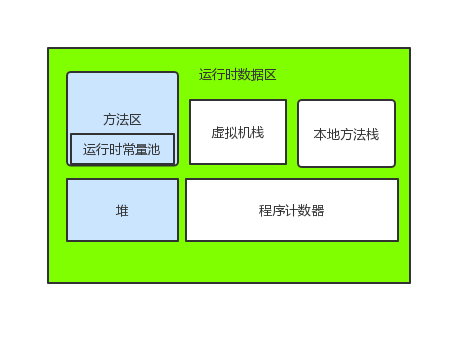

图中深色区域为，由所有线程共享的数据区域，其他为线程隔离的数据区。

## 程序计数器
程序计数器可以看作是当前线程执行的字节码的行号指示器。

## 虚拟机栈
虚拟机栈描述的是Java方法执行的内存模型；每个方法在执行的同时都会创建一个栈帧（Stack Frame）用于存储局部变量表、操作数栈、动态链接、方法出口等信息。

## 本地方法栈
与虚拟机栈类似，JVM调用Native方法时都会创建一个本地方法栈。

## 堆
堆是被所有线程共享的一块内存区域，在虚拟机启动时创建。此内存区域的唯一目的是存放对象实例，几乎所有的对象实例都在这里分配内存。
堆是垃圾收集器管理的主要区域，因此很多时候也被称做“GC堆”。

### 老年代

### 新生代

## 方法区
元数据区取代了1.7版本及以前的永久代。元数据区和永久代本质上都是方法区的实现。
方法区与Java堆一样，是被所有线程共享的一块内存区域。方法区用于已被虚拟机加载的类信息、常量、静态变量、即时编译器编译后的代码等数据。

## 运行时常量池
运行时常量池是方法区的一部分。
用于存放编译器生成的各种字面量的符号引用，这部分内存将在类加载后进入方法区中的运行时常量池中存放。
运行常量池具备动态性，运行期间也可能将新的常量放入池中，例如String类的intern()。

# 垃圾收集
垃圾收集主要是针对堆和方法区进行。程序计数器、虚拟机栈和本地方法栈这三个区域述语线程私有的，只存在于线程的生命周期内，线程结束之后就会消失，因此不需要对这三个区域进行垃圾回收。

## 判断一个对象是否可被回收

### 引用计数算法
为对像添加一个引用计数器，当对象增加一个引用计数器加1，引用失效时计数器减1。引用计数为0的对象可被回收。
在两个对象出现循环引用的情况下，此时引用计数器永远不为0，导致无法对它们进行回收。正是因为循环引用的存在，因此Java虚拟机不使用引用计数算法。
```java
public class ReferenceCountingGC{
                  public Object intance = null;
                  private static final int _1MB = 1024 * 1024;
                  private byte[] bigSize = new byte[2 * _1MB];
                  public static void testGC(){
                              ReferenceCountingGC objA = new ReferenceCountingGC();
                              ReferenceCountingGC objB = new ReferenceCountingGC();
                              objA.instance = objB;
                              objB.instance = objA;

                              objA = null;
                              objB = null;

                              System.gc();    
                  }
}
```

### 可达性分析算法
以 GC Roots 为起始点进行搜索，可达的对象都是存活的，不可达的对象可被回收。

Java 虚拟机使用该算法来判断对象是否可被回收，GC Roots 一般包含以下内容：
- 虚拟机栈中局部变量表中引用的对象
- 本地方法栈中 JNI 中引用的对象
- 方法区中类静态属性引用的对象
- 方法区中的常量引用的对象

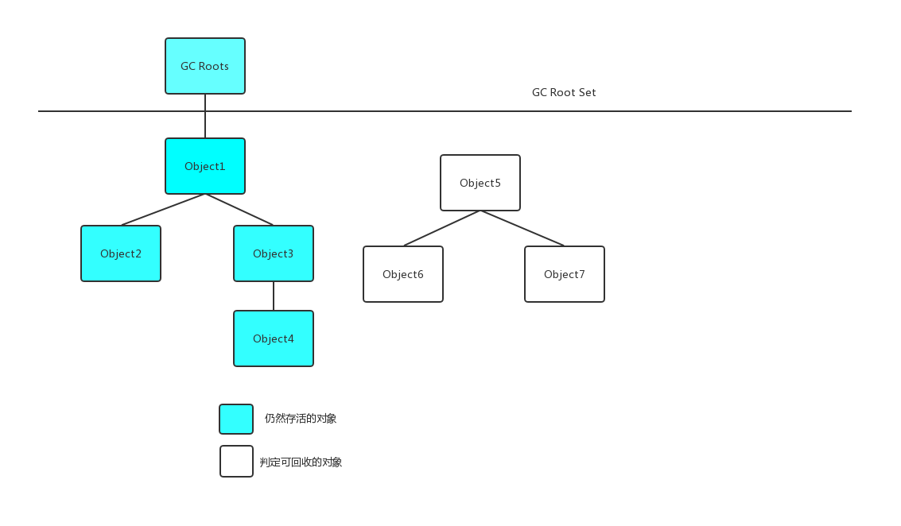

### 方法区的回收
因为方法区主要存放永久代对象，而永久代对象的回收率比新生代低很多，所以在方法区上进行回收性价比不高。
主要是对常量池的回收和对类的卸载。
为了避免内存溢出，在大量使用反射和动态代理的场景都需要虚拟机具备类卸载功能。
类的卸载条件很多，需要满足以下三个条件，并且满足了条件也不一定会被卸载：
- 该类所有的实例都已经被回收，此时堆中不存在该类的任何实例。
- 加载该类的ClassLoader已经被回收。
- 该类对应的Class对象没有在任何地方被引用，也就无法在任何地方通过反射访问该类方法。

### finalize()
类似 C++ 的析构函数，用于关闭外部资源。但是 try-finally 等方式可以做得更好，并且该方法运行代价很高，不确定性大，无法保证各个对象的调用顺序，因此最好不要使用。

当一个对象可被回收时，如果需要执行该对象的 finalize() 方法，那么就有可能在该方法中让对象重新被引用，从而实现自救。自救只能进行一次，如果回收的对象之前调用了 finalize() 方法自救，后面回收时不会再调用该方法。

## 引用类型
无论是通过引用计数算法判断对象的引用数量，还是通过可达性分析算法判断对象是否可达，判定对象是否可被回收都与引用有关。

Java 提供了四种强度不同的引用类型。

### 强引用
被强引用关联的对象不会被回收。

使用 new 一个新对象的方式来创建强引用。
```java
Object obj = new Object();
```
### 软引用
被软引用关联的对象只有在内存不够的情况下才会被回收。
使用SoftReference类来创建软引用。
```java
Object obj = new Object();
SoftReference<Object> sf = new SoftReference<Object>(obj);
obj = null;  // 使对象只被软引用关联
```
### 弱引用
被弱引用关联的对象一定会被回收，也就是说他只能存活到下一次垃圾回收发生之前。
使用WeakReference类来创建弱引用。
```java
Object obj = new Object();
WeakReference<Object> wf = new WeakReference<Object>(obj);
obj = null;
```
### 虚引用
又称为幽灵引用或者幻影引用，一个对象是否有虚引用的存在，不会对其生存时间造成影响，也无法通过虚引用得到一个对象。
为一个对象设置虚引用的唯一目的是能在这个对象被回收时收到一个系统通知。
使用 PhantomReference 来创建虚引用。
```java
Object obj = new Object();
PhantomReference<Object> pf = new PhantomReference<Object>(obj);
obj = null;
```
## 垃圾收集算法

### 标记-清除
 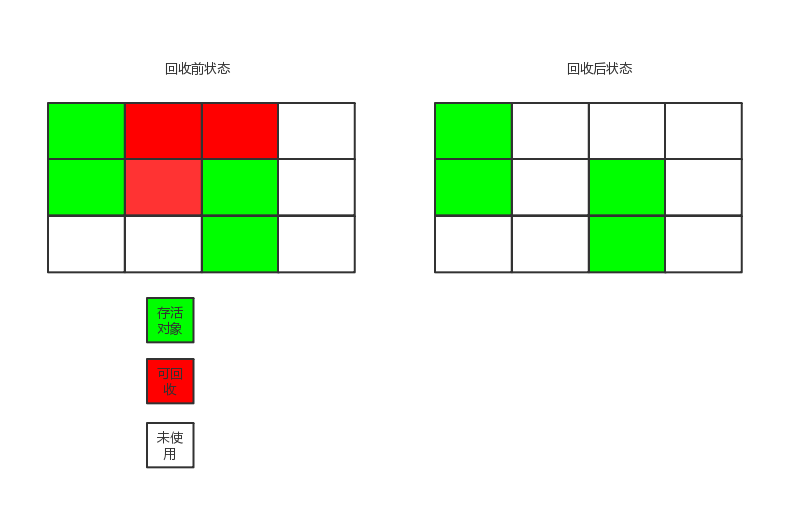

标记要回收的对象，然后清除。
不足：
- 标记和清除过程效率都不高；
- 会产生大量不连续的内存碎片，导致无法给大对象分配内存。

### 标记-整理
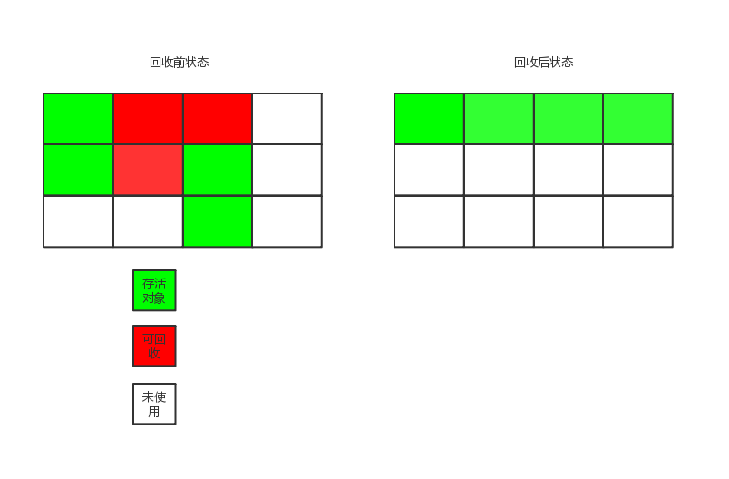
让所有存活的对象都向一端移动，然后直接清理掉端边界以外的内存。
### 复制
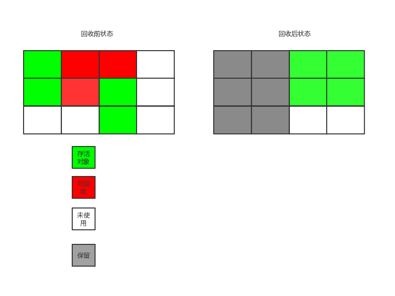
将内存划分为大小相等的两块，每次只使用其中一块，当这一块内存用完了就将还存活的对象复制到另一块上面，然后再把使用过的内存空间进行一次清理。

主要不足是只使用了内存的一半。
现在的商业虚拟机都采用这种收集算法回收新生代，但是并不是划分为大小相等的两块，而是一块较大的 Eden 空间和两块较小的 Survivor 空间，每次使用 Eden 和其中一块 Survivor。在回收时，将 Eden 和 Survivor 中还存活着的对象全部复制到另一块 Survivor 上，最后清理 Eden 和使用过的那一块 Survivor。

HotSpot 虚拟机的 Eden 和 Survivor 大小比例默认为 8:1，保证了内存的利用率达到 90%。如果每次回收有多于 10% 的对象存活，那么一块 Survivor 就不够用了，此时需要依赖于老年代进行空间分配担保，也就是借用老年代的空间存储放不下的对象。
### 分代收集
现在的商业虚拟机采用分代收集算法，它根据对象存活周期将内存划分为几块，不同块采用适当的收集算法。

一般将堆分为新生代和老年代。

- 新生代使用：复制算法
- 老年代使用：标记 - 清除 或者 标记 - 整理 算法

## 垃圾收集器
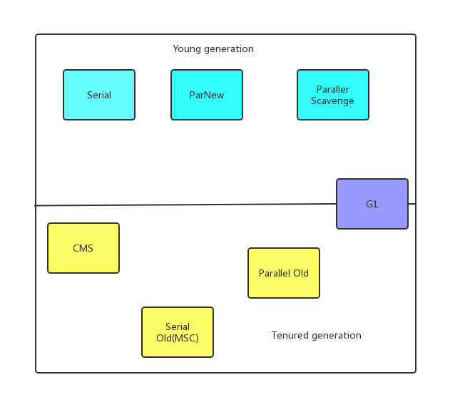
以上是 HotSpot 虚拟机中的 7 个垃圾收集器，连线表示垃圾收集器可以配合使用。

- 单线程与多线程：单线程指的是垃圾收集器只使用一个线程，而多线程使用多个线程；
- 串行与并行：串行指的是垃圾收集器与用户程序交替执行，这意味着在执行垃圾收集的时候需要停顿用户程序；并行指的是垃圾收集器和用户程序同时执行。除了 CMS 和 G1 之外，其它垃圾收集器都是以串行的方式执行。

### Serial收集器

Serial收集器是最基本、历史最悠久的收集器，曾经（在JDK1.3.1之前）是虚拟机新生代收集的唯一选择。大家看名字就知道，这个收集器是单线程的收集器，但它的“单线程”的意义并不仅仅是说明它只会使用一个CPU或一条收集线程去完成垃圾收集工作，更重要的是在它进行垃圾收集时，必须暂停其他所有的工作线程（Sun将这件事情称之为“Stop The World”），直到它收集结束。"Stop The World"这个名字也许听起来很酷，但这项工作实际上是由虚拟机在后台自动发起和自动完成的，在用户不可见的情况下把用户的正常工作的线程全部停掉，这对很多应用来说都是难以接受的。你想，要是你的电脑每运行一个小时就会暂停响应5分钟，你会有什么样的心情？下图示意了Serial/Serial Old收集器的运行过程。	
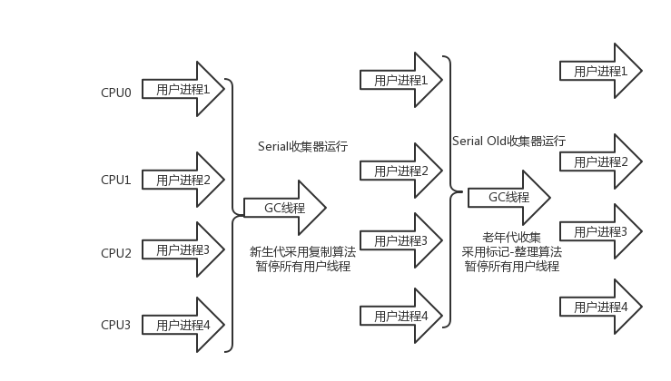

Serial 翻译为串行，也就是说它以串行的方式执行。
它是单线程的收集器，只会使用一个线程进行垃圾收集工作。
它的优点是简单高效，在单个 CPU 环境下，由于没有线程交互的开销，因此拥有最高的单线程收集效率。
它是 Client 场景下的默认新生代收集器，因为在该场景下内存一般来说不会很大。它收集一两百兆垃圾的停顿时间可以控制在一百多毫秒以内，只要不是太频繁，这点停顿时间是可以接受的。

### ParNew收集器

ParNew收集器其实就是Serial收集器的多线程版本，除了使用多线程进行垃圾收集之外，其余行为包括Serial收集器可用的所有控制参数（例如：-XX:SurvivorRatio、-XX:PretenureSizeThreshold、-XX:HandlePromotionFailure等）、收集算法、Stop The World、对象分配规则、回收策略等都与Serial收集器完全一样，实际上这两种收集器也共用了相当多的代码。ParNewS收集器的工作过程如图：

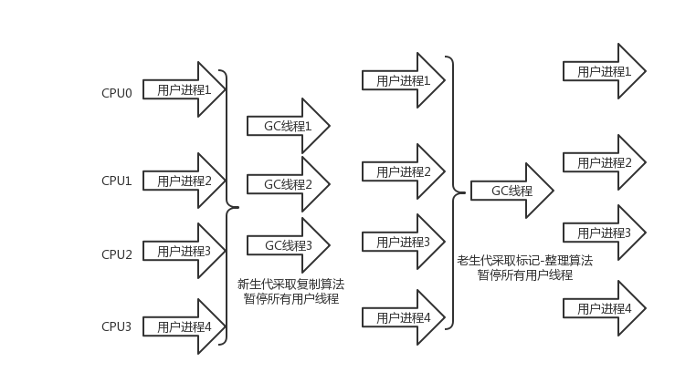

它是 Server 场景下默认的新生代收集器，除了性能原因外，主要是因为除了 Serial 收集器，只有它能与 CMS 收集器配合使用。

---

**注意** 从ParNew收集器开始，后面还将会接触到几款并发和并行地收集器。有必要先解释两个名词：并发和并行。

- 并行（Parallel）：指多条垃圾收集线程并行工作，但此时用户线程仍然处于等待状态。
- 并发（Concurrent）：指用户线程与垃圾收集线程同时执行（但不一定是并行的，可能会交替执行），用户程序继续运行，而垃圾收集程序运行于另一个CPU上。

---

### Parallel Scavenge收集器

Parallel Scavenge收集器也是一个新生代收集器，它也是使用复制算法的收集器，又是并行的多线程收集器……看上去和ParNew都一样，那它有什么特别之处呢？

Parallel Scavenge收集器的特点是它关注点与其他收集器不同，CMS等收集器的关注点尽可能地缩短垃圾收集时用户线程地停顿时间，而Parallel Scavenge收集器地目标则是达到一个可控制的 吞吐量（Throughput）。所谓吞吐量就是CPU用于运行用户代码的时间与CPU总消耗时间的比值。

停顿时间越短就越适合需要与用户交互的程序，良好的响应速度能提升用户的体验；而高吞吐量则可以最高相率地利用CPU时间，尽快地完成程序的运算任务，主要适合在后台运算而不需要太多交互的任务。

Parallel Scavenge收集器提供了两个参数用于精确控制吞吐量，分别是控制最大垃圾收集停顿时间的-XX:MaxGCPauseMillis参数及直接设置吞吐量大小的-XX:GCTimeRation参数。

MaxGCPauseMillis参数允许的值是一个大于0的毫秒数，收集器将尽力保证内存回收花费的时间不超过设定值。

GCTimeRation参数的值应当是一个大于0小于100的证书，也就是垃圾收集时间占总时间的比率，相当于是吞吐量的倒数。

由于与吞吐量关系密切，Parallel Scavenge收集器也经常被称为“吞吐量优先”收集器。除了上述两个参数之外，Parallel Scavenge收集器还有一个参数-XX:+UseAdaptiveSizePolicy值得关注。这是一个开关参数，当这个参数打开之后，就不需要手工指定新生代的大小（-Xmn）、Eden与Survivor区的比例（-XX:SurvivorRatio）、晋升老年代对像年龄（-XX:PretenureSizeThreshold）等细节参数了，虚拟机会根据当前系统的运行情况收集性能监控信息，动态调整这些参数以提供最适合的停顿时间或最大吞吐量，这种调节方式称为GC自适应的调节策略（GC Ergonomics）。如果读者对于收集器运作原理不太了解，手工优化存在困难的时候，使用Parallel Scavenge收集器配合自适应调节策略，把内存管理的调优任务交给虚拟机去完成将是一个很不错的选择。只需要把基本的内存数据设置好（如-Xmx设置最大堆），然后使用MaxGCPauseMillis参数（更关注最大停顿时间）或GCTimeRatio参数（更关注吞吐量）给虚拟机设立一个优化目标，那具体细节参数的调节工作就由虚拟机完成了。自适应调节策略也是Parallel Scavenge收集器与ParNew收集器的一个重要区别。

### Serial Old收集器

Serial Old收集器是Serial收集器的老年代版本，它同样是一个单线程收集器，使用“标记-整理”算法。这个收集器的主要意义也是被Client模式下的虚拟机使用。如果在Server模式下，它主要还有两大用途：一个是在JDK1.5及之前的版本中与Parallel Scavenge收集器搭配使用，另外一个就是作为CMS收集器的后被预案，在并发收集发生Concurrent Mode Failure的时候使用。

### Paralel Old收集器

Paralel Old是Paralel Scavenge收集器的老年代版本，使用多线程和“标记-整理”算法。这个收集器是在JDK1.6中才开始提供的，在此之前，新生代的Paralel Scavenge收集器一直处于比较尴尬的状态。原因是，如果新生代选择了Paralel Scavenge收集器，老年代除了Serial Old（PS MarkSweep）收集器外别无选择（还记得上面说过Parallel Scavenge收集器无法与CMS收集器配合工作么？）。由于单线程的老年代Serial Old收集器在服务端应用性能上的“拖累”，即便使用了Parallel Scavenge收集器也未必能在整体应用上获得吞吐量最大化的效果，又因为老年代收集中无法充分利用服务器多CPU的处理能力，在老年代很大而且硬件比较高级的环境中，这种组合的吞吐量甚至还不一定有ParNew加CMS的组合“给力”。

直到Parallel Old收集器出现后，“吞吐量优先”收集器终于有了比较名副其实的应用组合，在注重吞吐量及CPU资源敏感的场合，都可以优先考虑Parallel Scavenge加Parallel Old收集器。

### CMS收集器

CMS（Concurrent Mark Sweep）收集器是一种以获取最短回收停顿时间为目标的收集器。目前最大一部分的Java应用都集中在互联网站或B/S系统的服务端上，这类应用尤其重视服务的响应速度，希望系统停顿时间最短，以给用户带来较好的体验。

它的运作过程相当于前面几种收集器来说更复杂一些，整个过程分为4个步骤，包括：

- 初始化标记（CMS initial mark）
- 并发标记（CMS concurrent mark）
- 重新标记（CMS remark）
- 并发清除（CMS concurrent sweep）

其中初始标记、重新标记这两个步骤仍然需要“Stop The World”。初始标记仅仅只是标记以下GC Roots能直接关联到的对象，速度很快，并发标记阶段就是进行GC Roots Tracing的过程，而重新标记阶段则是为了修正并发标记期间，因用户程序继续运作而导致标记产生变动的那一部分对象的标记记录，这个阶段的停顿时间一般会比初始化标记阶段稍长一些，但远比并发标记的时间短。

由于整个过程中耗时最长的并发标记和并发清除过程中，收集器线程都可以与用户线程一起工作，所以总体上来说，CMS收集器的内存回收过程与用户线程一起并发地执行地。通过下图可以比较清除地看到CMS收集器地运作步骤中并发和需要停顿地时间。

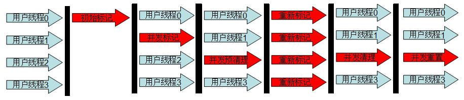

CMS是一款优秀地收集器，它地最主要优点在名字上已经体现出来了：并发收集、低停顿，Sun的一些官方文档里面也称之为并发低停顿收集器（Concurrent Low Pause Collector）。但是CMS还远达不到完美的程度，它有以下三个显著的缺点：

- CMS收集器对CPU资源非常敏感。
- CMS收集器无法处理浮动垃圾（Floating Garbage），
- 收集结束时会产生大量空间碎片

### G1收集器

G1（Garbage First）收集器是当前收集器技术发展的最前沿成果，在JDK1.6_Update14中提供了Early Access版本的G1收集器以供试用。这里只对G1收集器进行简单的介绍。

G1收集器是垃圾收集器理论进一步发展的产物，它与前面的CMS收集器相比有两个显著的改进：一是G1收集器是基于“标记-整理”算法实现的收集器，也就是说它不会产生空间碎片，这对于长时间运行的应用系统来说非常重要。二是它可以非常精确地控制停顿，即能让使用者明确指定在一个长度为M毫秒地时间片段内，消耗地垃圾收集上地时间不得超过N毫秒，这几乎已经是实时Java（RTSJ）地垃圾收集器地特征了。

G1收集器可以实现在基本不牺牲吞吐量地前提下完成低停顿的内存回收，这是由于它能够极力地避免全区域的垃圾收集，之前的收集器进行收集的范围都是整个新生代或老年代，而G1将整个Java堆（包括新生代、老年代）划分为多个大小固定的独立区域（Region），并且跟踪这些区域里面的垃圾堆积程度，在后台维护一个优先列表，每次根据允许的收集时间，优先回收垃圾最多的区域（这就是Garbage First名称的来由）。区域划分及优先级的区域回收，保证了G1收集器在有限时间内可以获得最高的收集效率。
# 内存分配与回收策略
## Minor GC和Full GC
- Minor GC：回收新生代上，因为新生代对象存活时间很短，因此 Minor GC 会频繁执行，执行的速度一般也会比较快。
- Full GC：回收老年代和新生代，老年代对象其存活时间长，因此 Full GC 很少执行，执行速度会比 Minor GC 慢很多。

## 内存分配策略
### 对象优先在Eden分配
大多数情况下，对象在新生代Eden区分配，当Eden区空间不够时，发起Minor GC。
### 大对象直接进入老年代
大对象是指需要连续内存空间的对象，最典型的大对象是那种很长的字符串以及数组。
经常出现大对象会提前触发垃圾收集以获取足够的连续空间分配给大对象。
-XX:PretenureSizeThreshold，大于此值的对象直接在老年代分配，避免在 Eden 区和 Survivor 区之间的大量内存复制。

### 长期存活的对象进入老年代
为对象定义年龄计数器，对象在 Eden 出生并经过 Minor GC 依然存活，将移动到 Survivor 中，年龄就增加 1 岁，增加到一定年龄则移动到老年代中。

-XX:MaxTenuringThreshold 用来定义年龄的阈值。

### 动态对象年龄判定
虚拟机并不是永远地要求对象的年龄必须达到 MaxTenuringThreshold 才能晋升老年代，如果在 Survivor 中相同年龄所有对象大小的总和大于 Survivor 空间的一半，则年龄大于或等于该年龄的对象可以直接进入老年代，无需等到 MaxTenuringThreshold 中要求的年龄。

### 空间分配担保
在发生 Minor GC 之前，虚拟机先检查老年代最大可用的连续空间是否大于新生代所有对象总空间，如果条件成立的话，那么 Minor GC 可以确认是安全的。

如果不成立的话虚拟机会查看 HandlePromotionFailure 设置值是否允许担保失败，如果允许那么就会继续检查老年代最大可用的连续空间是否大于历次晋升到老年代对象的平均大小，如果大于，将尝试着进行一次 Minor GC；如果小于，或者 HandlePromotionFailure 设置不允许冒险，那么就要进行一次 Full GC。
## Full GC的触发条件
对于 Minor GC，其触发条件非常简单，当 Eden 空间满时，就将触发一次 Minor GC。而 Full GC 则相对复杂，有以下条件：
### 调用System.gc()
只是建议虚拟机执行 Full GC，但是虚拟机不一定真正去执行。不建议使用这种方式，而是让虚拟机管理内存。
### 老年代空间不足
老年代空间不足的常见场景为前文所讲的大对象直接进入老年代、长期存活的对象进入老年代等。

为了避免以上原因引起的 Full GC，应当尽量不要创建过大的对象以及数组。除此之外，可以通过 -Xmn 虚拟机参数调大新生代的大小，让对象尽量在新生代被回收掉，不进入老年代。还可以通过 -XX:MaxTenuringThreshold 调大对象进入老年代的年龄，让对象在新生代多存活一段时间。
### 空间分配担保失败
使用复制算法的 Minor GC 需要老年代的内存空间作担保，如果担保失败会执行一次 Full GC。具体内容请参考上面的第五小节。
### JDK 1.7 及以前的永久代空间不足
在 JDK 1.7 及以前，HotSpot 虚拟机中的方法区是用永久代实现的，永久代中存放的为一些 Class 的信息、常量、静态变量等数据。

当系统中要加载的类、反射的类和调用的方法较多时，永久代可能会被占满，在未配置为采用 CMS GC 的情况下也会执行 Full GC。如果经过 Full GC 仍然回收不了，那么虚拟机会抛出 java.lang.OutOfMemoryError。

为避免以上原因引起的 Full GC，可采用的方法为增大永久代空间或转为使用 CMS GC。
### Concurrent Mode Failure
执行 CMS GC 的过程中同时有对象要放入老年代，而此时老年代空间不足（可能是 GC 过程中浮动垃圾过多导致暂时性的空间不足），便会报 Concurrent Mode Failure 错误，并触发 Full GC。

# 类加载机制
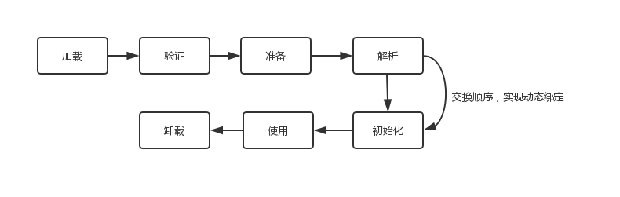
包括以下 7 个阶段：
- 加载（Loading）
- 验证（Verification）
- 准备（Preparation）
- 解析（Resolution）
- 初始化（Initialization）
- 使用（Using）
- 卸载（Unloading）

## 类加载过程
包含了加载、验证、准备、解析和初始化这 5 个阶段。

### 加载
加载是类加载的一个阶段，注意不要混淆。

加载过程完成以下三件事：
- 通过类的完全限定名称获取定义该类的二进制字节流。
- 将该字节流表示的静态存储结构转换为方法区的运行时存储结构。
- 在内存中生成一个代表该类的 Class 对象，作为方法区中该类各种数据的访问入口。

其中二进制字节流可以从以下方式中获取：
- 从 ZIP 包读取，成为 JAR、EAR、WAR 格式的基础。
-从网络中获取，最典型的应用是 Applet。
-运行时计算生成，例如动态代理技术，在 java.lang.reflect.Proxy 使用 ProxyGenerator.generateProxyClass 的代理类的二进制字节流。

由其他文件生成，例如由 JSP 文件生成对应的 Class 类。

### 验证
确保 Class 文件的字节流中包含的信息符合当前虚拟机的要求，并且不会危害虚拟机自身的安全。

### 准备
类变量是被 static 修饰的变量，准备阶段为类变量分配内存并设置初始值，使用的是方法区的内存。

实例变量不会在这阶段分配内存，它会在对象实例化时随着对象一起被分配在堆中。应该注意到，实例化不是类加载的一个过程，类加载发生在所有实例化操作之前，并且类加载只进行一次，实例化可以进行多次。

初始值一般为 0 值，例如下面的类变量 value 被初始化为 0 而不是 123。
```java
public static int value = 123;
```
如果类变量是常量，那么它将初始化为表达式所定义的值而不是 0。例如下面的常量 value 被初始化为 123 而不是 0。
```java
public static final int value = 123;
```
### 解析
将常量池的符号引用替换为直接引用的过程。
其中解析过程在某些情况下可以在初始化阶段之后再开始，这是为了支持 Java 的动态绑定。
### 初始化
初始化阶段才真正开始执行类中定义的 Java 程序代码。初始化阶段是虚拟机执行类构造器 <clinit>() 方法的过程。在准备阶段，类变量已经赋过一次系统要求的初始值，而在初始化阶段，根据程序员通过程序制定的主观计划去初始化类变量和其它资源。

在准备阶段，已经为类变量分配了系统所需的初始值，并且在初始化阶段，根据程序员通过程序进行的主观计划来初始化类变量和其他资源。

<clinit>() 是由编译器自动收集类中所有类变量的赋值动作和静态语句块中的语句合并产生的，编译器收集的顺序由语句在源文件中出现的顺序决定。特别注意的是，静态语句块只能访问到定义在它之前的类变量，定义在它之后的类变量只能赋值，不能访问。例如以下代码：
```java
public class Test {
    static {
        i = 0;                // 给变量赋值可以正常编译通过
        System.out.print(i);  // 这句编译器会提示“非法向前引用”
    }
    static int i = 1;
}
```
由于父类的 <clinit>() 方法先执行，也就意味着父类中定义的静态语句块的执行要优先于子类。例如以下代码：
```java
static class Parent {
    public static int A = 1;
    static {
        A = 2;
    }
}

static class Sub extends Parent {
    public static int B = A;
}

public static void main(String[] args) {
     System.out.println(Sub.B);  // 2
}
```
接口中不可以使用静态语句块，但仍然有类变量初始化的赋值操作，因此接口与类一样都会生成 <clinit>() 方法。但接口与类不同的是，执行接口的 <clinit>() 方法不需要先执行父接口的 <clinit>() 方法。只有当父接口中定义的变量使用时，父接口才会初始化。另外，接口的实现类在初始化时也一样不会执行接口的 <clinit>() 方法。

虚拟机会保证一个类的 <clinit>() 方法在多线程环境下被正确的加锁和同步，如果多个线程同时初始化一个类，只会有一个线程执行这个类的 <clinit>() 方法，其它线程都会阻塞等待，直到活动线程执行 <clinit>() 方法完毕。如果在一个类的 <clinit>() 方法中有耗时的操作，就可能造成多个线程阻塞，在实际过程中此种阻塞很隐蔽。

## 类初始化时机
### 主动引用
虚拟机规范中并没有强制约束何时进行加载，但是规范严格规定了有且只有下列五种情况必须对类进行初始化（加载、验证、准备都会随之发生）：
- 遇到 new、getstatic、putstatic、invokestatic 这四条字节码指令时，如果类没有进行过初始化，则必须先触发其初始化。最常见的生成这 4 条指令的场景是：使用 new 关键字实例化对象的时候；读取或设置一个类的静态字段（被 final 修饰、已在编译期把结果放入常量池的静态字段除外）的时候；以及调用一个类的静态方法的时候。
- 使用 java.lang.reflect 包的方法对类进行反射调用的时候，如果类没有进行初始化，则需要先触发其初始化。
- 当初始化一个类的时候，如果发现其父类还没有进行过初始化，则需要先触发其父类的初始化。
- 当虚拟机启动时，用户需要指定一个要执行的主类（包含 main() 方法的那个类），虚拟机会先初始化这个主类；

当使用 JDK 1.7 的动态语言支持时，如果一个 java.lang.invoke.MethodHandle 实例最后的解析结果为 REF_getStatic, REF_putStatic, REF_invokeStatic 的方法句柄，并且这个方法句柄所对应的类没有进行过初始化，则需要先触发其初始化；
### 被动引用
以上 5 种场景中的行为称为对一个类进行主动引用。除此之外，所有引用类的方式都不会触发初始化，称为被动引用。被动引用的常见例子包括：
- 通过子类引用父类的静态字段，不会导致子类初始化。
```java
System.out.println(SubClass.value);  // value 字段在 SuperClass 中定义
```
- 通过数组定义来引用类，不会触发此类的初始化。该过程会对数组类进行初始化，数组类是一个由虚拟机自动生成的、直接继承自 Object 的子类，其中包含了数组的属性和方法。
```java
SuperClass[] sca = new SuperClass[10];
```
- 常量在编译阶段会存入调用类的常量池中，本质上并没有直接引用到定义常量的类，因此不会触发定义常量的类的初始化。
```java
System.out.println(ConstClass.HELLOWORLD);
```
## 类与类加载器
两个类相等，需要类本身相等，并且使用同一个类加载器进行加载。这是因为每一个类加载器都拥有一个独立的类名称空间。

这里的相等，包括类的 Class 对象的 equals() 方法、isAssignableFrom() 方法、isInstance() 方法的返回结果为 true，也包括使用 instanceof 关键字做对象所属关系判定结果为 true。
### 类加载器分类
从 Java 虚拟机的角度来讲，只存在以下两种不同的类加载器：

- 启动类加载器（Bootstrap ClassLoader），使用 C++ 实现，是虚拟机自身的一部分；

- 所有其它类的加载器，使用 Java 实现，独立于虚拟机，继承自抽象类 java.lang.ClassLoader。

从 Java 开发人员的角度看，类加载器可以划分得更细致一些：

- 启动类加载器（Bootstrap ClassLoader）此类加载器负责将存放在 <JRE_HOME>\lib 目录中的，或者被 -Xbootclasspath 参数所指定的路径中的，并且是虚拟机识别的（仅按照文件名识别，如 rt.jar，名字不符合的类库即使放在 lib 目录中也不会被加载）类库加载到虚拟机内存中。启动类加载器无法被 Java 程序直接引用，用户在编写自定义类加载器时，如果需要把加载请求委派给启动类加载器，直接使用 null 代替即可。

- 扩展类加载器（Extension ClassLoader）这个类加载器是由 ExtClassLoader（sun.misc.Launcher$ExtClassLoader）实现的。它负责将 <JAVA_HOME>/lib/ext 或者被 java.ext.dir 系统变量所指定路径中的所有类库加载到内存中，开发者可以直接使用扩展类加载器。

- 应用程序类加载器（Application ClassLoader）这个类加载器是由 AppClassLoader（sun.misc.Launcher$AppClassLoader）实现的。由于这个类加载器是 ClassLoader 中的 getSystemClassLoader() 方法的返回值，因此一般称为系统类加载器。它负责加载用户类路径（ClassPath）上所指定的类库，开发者可以直接使用这个类加载器，如果应用程序中没有自定义过自己的类加载器，一般情况下这个就是程序中默认的类加载器。
  
## 双亲委派模型
应用程序是由三种类加载器互相配合从而实现类加载，除此之外还可以加入自己定义的类加载器。

下图展示了类加载器之间的层次关系，称为双亲委派模型（Parents Delegation Model）。该模型要求除了顶层的启动类加载器外，其它的类加载器都要有自己的父类加载器。类加载器之间的父子关系一般通过组合关系（Composition）来实现，而不是继承关系（Inheritance）。
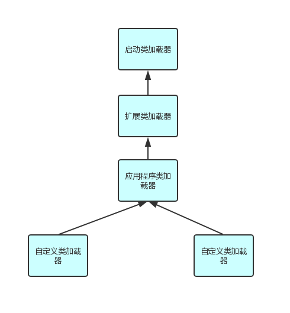
### 工作过程
一个类加载器首先将类加载请求转发到父类加载器，只有当父类加载器无法完成时才尝试自己加载。
### 好处
使得 Java 类随着它的类加载器一起具有一种带有优先级的层次关系，从而使得基础类得到统一。

例如 java.lang.Object 存放在 rt.jar 中，如果编写另外一个 java.lang.Object 并放到 ClassPath 中，程序可以编译通过。由于双亲委派模型的存在，所以在 rt.jar 中的 Object 比在 ClassPath 中的 Object 优先级更高，这是因为 rt.jar 中的 Object 使用的是启动类加载器，而 ClassPath 中的 Object 使用的是应用程序类加载器。rt.jar 中的 Object 优先级更高，那么程序中所有的 Object 都是这个 Object。

### 实现
以下是抽象类 java.lang.ClassLoader 的代码片段，其中的 loadClass() 方法运行过程如下：先检查类是否已经加载过，如果没有则让父类加载器去加载。当父类加载器加载失败时抛出 ClassNotFoundException，此时尝试自己去加载。
```java
public abstract class ClassLoader {
    // The parent class loader for delegation
    private final ClassLoader parent;

    public Class<?> loadClass(String name) throws ClassNotFoundException {
        return loadClass(name, false);
    }

    protected Class<?> loadClass(String name, boolean resolve) throws ClassNotFoundException {
        synchronized (getClassLoadingLock(name)) {
            // First, check if the class has already been loaded
            Class<?> c = findLoadedClass(name);
            if (c == null) {
                try {
                    if (parent != null) {
                        c = parent.loadClass(name, false);
                    } else {
                        c = findBootstrapClassOrNull(name);
                    }
                } catch (ClassNotFoundException e) {
                    // ClassNotFoundException thrown if class not found
                    // from the non-null parent class loader
                }

                if (c == null) {
                    // If still not found, then invoke findClass in order
                    // to find the class.
                    c = findClass(name);
                }
            }
            if (resolve) {
                resolveClass(c);
            }
            return c;
        }
    }

    protected Class<?> findClass(String name) throws ClassNotFoundException {
        throw new ClassNotFoundException(name);
    }
}
```
### 自定义类加载器
FileSystemClassLoader 是自定义类加载器，继承自 java.lang.ClassLoader，用于加载文件系统上的类。它首先根据类的全名在文件系统上查找类的字节代码文件（.class 文件），然后读取该文件内容，最后通过 defineClass() 方法来把这些字节代码转换成 java.lang.Class 类的实例。

java.lang.ClassLoader 的 loadClass() 实现了双亲委派模型的逻辑，自定义类加载器一般不去重写它，但是需要重写 findClass() 方法。

```java
public class FileSystemClassLoader extends ClassLoader {

    private String rootDir;

    public FileSystemClassLoader(String rootDir) {
        this.rootDir = rootDir;
    }

    protected Class<?> findClass(String name) throws ClassNotFoundException {
        byte[] classData = getClassData(name);
        if (classData == null) {
            throw new ClassNotFoundException();
        } else {
            return defineClass(name, classData, 0, classData.length);
        }
    }

    private byte[] getClassData(String className) {
        String path = classNameToPath(className);
        try {
            InputStream ins = new FileInputStream(path);
            ByteArrayOutputStream baos = new ByteArrayOutputStream();
            int bufferSize = 4096;
            byte[] buffer = new byte[bufferSize];
            int bytesNumRead;
            while ((bytesNumRead = ins.read(buffer)) != -1) {
                baos.write(buffer, 0, bytesNumRead);
            }
            return baos.toByteArray();
        } catch (IOException e) {
            e.printStackTrace();
        }
        return null;
    }

    private String classNameToPath(String className) {
        return rootDir + File.separatorChar
                + className.replace('.', File.separatorChar) + ".class";
    }
}
```

# 参考资料
- 周志明. 深入理解 Java 虚拟机 [M]. 机械工业出版社, 2011.