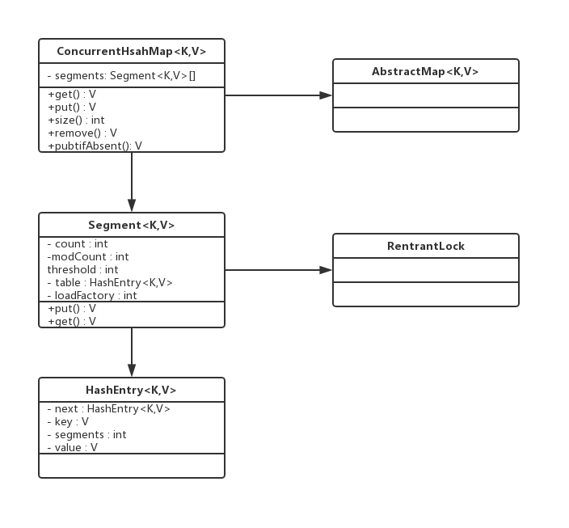
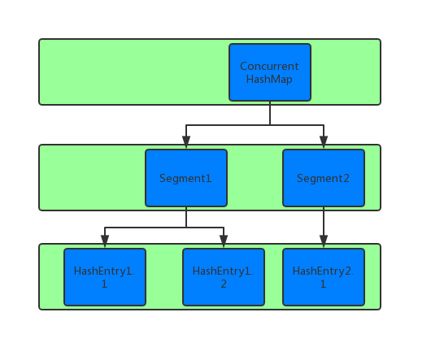

# ConcurreentHashMap的实现原理与使用

ConcurrentHashMap是线程安全且高效的HashMap。

## 为什么要使用ConcurrentHashMap

在并发编程中使用HashMap可能导致程序死循环。而使用线程安全的HashTable效率又非常低下，基于以上两个原因，便有了ConcurrentHashMap的登场机会。

1. 线程不安全的HashMap

   在多线程环境下，使用HashMap进行put操作会引起死循环，导致CPU利用率接近100%，所以在并发情况下不能使用HashMap。

   HashMap在并发执行put操作时会引起死循环，是因为多线程会导致HashMap的Entry链表形成环形数据结构，一旦形成环形数据结构，Entry的next节点永远不为空，，就会产生死循环获取Entry。

2. 效率低下的HashTable

   HashTable容器使用了synchronized来保证线程安全，但在线程竞争激烈的情况下HashTable的效率非常低下。因为当一个线程访问HashTable的同步方法，其他线程也访问HashTable的同步方法时，会进入阻塞或轮询状态。

3. ConcurrentHashMap的锁分段技术可有效提升并发访问率

   容器里有很多把锁，每一把锁用于锁容器中其中一部分数据，那么当多线程访问容器里不同数据段的数据时，线程间就不会存在锁竞争，从而可以有效提高并发访问效率，这就是ConcurrentHashMap所使用的锁分段技术。

## ConcurrentHashMap的结构

ConcurrentHashMap是由Segment数组结构和HashEntry数据结构组成。Segment是一种可重入锁（ReentrantLock），在ConcurrentHashMap里扮演锁的角色；HashEntry则用于存储键值对数据。





## ConcurrentHashMap的操作

### get操作

Segment的get操作实现非常简单和高效。先经过一次再散列，然后使用这个散列值通过散列运算定位到Segment，再通过散列算法定位到元素：

```java
public V get(Object key) {
    Node<K,V>[] tab; Node<K,V> e, p; int n, eh; K ek;
    int h = spread(key.hashCode());
    if ((tab = table) != null && (n = tab.length) > 0 &&
        (e = tabAt(tab, (n - 1) & h)) != null) {
         if ((eh = e.hash) == h) {
             if ((ek = e.key) == key || (ek != null && key.equals(ek)))
                return e.val;
         }
          else if (eh < 0)
             return (p = e.find(h, key)) != null ? p.val : null;
          while ((e = e.next) != null) {
              if (e.hash == h &&
                 ((ek = e.key) == key || (ek != null && key.equals(ek))))
                    return e.val;
           }
     }
     return null;
}
```

### put操作

由于put操作方法里需要对共享变量进行写操作，所以为了线程安全，在操作共享变量时必须加锁。

```java
public V put(K key, V value) {
        return putVal(key, value, false);
}
final V putVal(K key, V value, boolean onlyIfAbsent) {
        if (key == null || value == null) throw new NullPointerException();
        int hash = spread(key.hashCode());
        int binCount = 0;
        for (Node<K,V>[] tab = table;;) {
            Node<K,V> f; int n, i, fh;
            if (tab == null || (n = tab.length) == 0)
                tab = initTable();
            else if ((f = tabAt(tab, i = (n - 1) & hash)) == null) {
                if (casTabAt(tab, i, null,
                             new Node<K,V>(hash, key, value, null)))
                    break;                   // no lock when adding to empty bin
            }
            else if ((fh = f.hash) == MOVED)
                tab = helpTransfer(tab, f);
            else {
                V oldVal = null;
                synchronized (f) {
                    if (tabAt(tab, i) == f) {
                        if (fh >= 0) {
                            binCount = 1;
                            for (Node<K,V> e = f;; ++binCount) {
                                K ek;
                                if (e.hash == hash &&
                                    ((ek = e.key) == key ||
                                     (ek != null && key.equals(ek)))) {
                                    oldVal = e.val;
                                    if (!onlyIfAbsent)
                                        e.val = value;
                                    break;
                                }
                                Node<K,V> pred = e;
                                if ((e = e.next) == null) {
                                    pred.next = new Node<K,V>(hash, key,
                                                              value, null);
                                    break;
                                }
                            }
                        }
                        else if (f instanceof TreeBin) {
                            Node<K,V> p;
                            binCount = 2;
                            if ((p = ((TreeBin<K,V>)f).putTreeVal(hash, key,
                                                           value)) != null) {
                                oldVal = p.val;
                                if (!onlyIfAbsent)
                                    p.val = value;
                            }
                        }
                    }
                }
                if (binCount != 0) {
                    if (binCount >= TREEIFY_THRESHOLD)
                        treeifyBin(tab, i);
                    if (oldVal != null)
                        return oldVal;
                    break;
                }
            }
        }
        addCount(1L, binCount);
        return null;
    }
```


   ### 是否需要扩容

   在插入元素前先会先判断Segment里的HashEntry数组是否超过容量（threshold），如果超过阈值，则对数组进行扩容

   ### 如何扩容

   在扩容的时候，首先会创建一个容量是原来容量两倍的数组，然后对原数组里的元素进行再散列后插入到新的数组里。为了高效，ConcurrentHashMap不会对整个容器进行扩容，而只对某个segment进行扩容。

### size操作

如果要统计整个ConcurrentHashMap里元素的大小，就必须统计所有Segment里的元素的大小后求和。

```java
public int size() {
        long n = sumCount();
        return ((n < 0L) ? 0 :
                (n > (long)Integer.MAX_VALUE) ? Integer.MAX_VALUE :
                (int)n);
    }
```

# ConcurrentHashMap源码分析

1. **table**：默认为null，初始化发生在第一次插入操作，默认大小为16的数组，用来存储Node节点数据，扩容时大小总是2的幂次方。
2.  **nextTable**：默认为null，扩容时新生成的数组，其大小为原数组的两倍。

-  **sizeCtl** ：默认为0，用来控制table的初始化和扩容操作，具体应用在后续会体现出来。
- **-1 **代表table正在初始化
- **-N **表示有N-1个线程正在进行扩容操作
- 其余情况：
   1、如果table未初始化，表示table需要初始化的大小。
   2、如果table初始化完成，表示table的容量，默认是table大小的0.75倍，居然用这个公式算0.75（n - (n >>> 2)）。
-  **Node**：保存key，value及key的hash值的数据结构。

```java
class Node<K,V> implements Map.Entry<K,V> {
    final int hash;
    final K key;
    volatile V val;
    volatile Node<K,V> next;
    ...
}
```

其中value和next都用volatile修饰，保证并发的可见性。

-  **ForwardingNode**：一个特殊的Node节点，hash值为-1，其中存储nextTable的引用。

```java
final class ForwardingNode<K,V> extends Node<K,V> {
    final Node<K,V>[] nextTable;
    ForwardingNode(Node<K,V>[] tab) {
        super(MOVED, null, null, null);
        this.nextTable = tab;
    }
}
```

只有table发生扩容的时候，ForwardingNode才会发挥作用，作为一个占位符放在table中表示当前节点为null或则已经被移动。

## 实例初始化

实例化ConcurrentHashMap时带参数时，会根据参数调整table的大小，假设参数为100，最终会调整成256，确保table的大小总是2的幂次方，算法如下：

```java
ConcurrentHashMap<String, String> hashMap = new ConcurrentHashMap<>(100);
private static final int tableSizeFor(int c) {
    int n = c - 1;
    n |= n >>> 1;
    n |= n >>> 2;
    n |= n >>> 4;
    n |= n >>> 8;
    n |= n >>> 16;
    return (n < 0) ? 1 : (n >= MAXIMUM_CAPACITY) ? MAXIMUM_CAPACITY : n + 1;
}
```

**注意**，ConcurrentHashMap在构造函数中只会初始化sizeCtl值，并不会直接初始化table，而是延缓到第一次put操作。

## table初始化

前面已经提到过，table初始化操作会延缓到第一次put行为。但是put是可以并发执行的，Doug Lea是如何实现table只初始化一次的？让我们来看看源码的实现。

```java
private final Node<K,V>[] initTable() {
    Node<K,V>[] tab; int sc;
    while ((tab = table) == null || tab.length == 0) {
//如果一个线程发现sizeCtl<0，意味着另外的线程执行CAS操作成功，当前线程只需要让出cpu时间片
        if ((sc = sizeCtl) < 0) 
            Thread.yield(); // lost initialization race; just spin
        else if (U.compareAndSwapInt(this, SIZECTL, sc, -1)) {
            try {
                if ((tab = table) == null || tab.length == 0) {
                    int n = (sc > 0) ? sc : DEFAULT_CAPACITY;
                    @SuppressWarnings("unchecked")
                    Node<K,V>[] nt = (Node<K,V>[])new Node<?,?>[n];
                    table = tab = nt;
                    sc = n - (n >>> 2);
                }
            } finally {
                sizeCtl = sc;
            }
            break;
        }
    }
    return tab;
}
```

sizeCtl默认为0，如果ConcurrentHashMap实例化时有传参数，sizeCtl会是一个2的幂次方的值。所以执行第一次put操作的线程会执行Unsafe.compareAndSwapInt方法修改sizeCtl为-1，有且只有一个线程能够修改成功，其它线程通过Thread.yield()让出CPU时间片等待table初始化完成。

## put操作

假设table已经初始化完成，put操作采用CAS+synchronized实现并发插入或更新操作，具体实现如下。

```java
final V putVal(K key, V value, boolean onlyIfAbsent) {
    if (key == null || value == null) throw new NullPointerException();
    int hash = spread(key.hashCode());
    int binCount = 0;
    for (Node<K,V>[] tab = table;;) {
        Node<K,V> f; int n, i, fh;
        if (tab == null || (n = tab.length) == 0)
            tab = initTable();
        else if ((f = tabAt(tab, i = (n - 1) & hash)) == null) {
            if (casTabAt(tab, i, null, new Node<K,V>(hash, key, value, null)))
                break;                   // no lock when adding to empty bin
        }
        else if ((fh = f.hash) == MOVED)
            tab = helpTransfer(tab, f);
        ...省略部分代码
    }
    addCount(1L, binCount);
    return null;
}
```

1. hash算法	

```java
static final int spread(int h) {return (h ^ (h >>> 16)) & HASH_BITS;}
```

1. table中定位索引位置，n是table的大小

```java
int index = (n - 1) & hash
```

1. 获取table中对应索引的元素f。
    Doug Lea采用Unsafe.getObjectVolatile来获取，也许有人质疑，直接table[index]不可以么，为什么要这么复杂？
    在java内存模型中，我们已经知道每个线程都有一个工作内存，里面存储着table的副本，虽然table是volatile修饰的，但不能保证线程每次都拿到table中的最新元素，Unsafe.getObjectVolatile可以直接获取指定内存的数据，保证了每次拿到数据都是最新的。
2. 如果f为null，说明table中这个位置第一次插入元素，利用Unsafe.compareAndSwapObject方法插入Node节点。

- 如果CAS成功，说明Node节点已经插入，随后addCount(1L, binCount)方法会检查当前容量是否需要进行扩容。
- 如果CAS失败，说明有其它线程提前插入了节点，自旋重新尝试在这个位置插入节点。

1. 如果f的hash值为-1，说明当前f是ForwardingNode节点，意味有其它线程正在扩容，则一起进行扩容操作。
2. 其余情况把新的Node节点按链表或红黑树的方式插入到合适的位置，这个过程采用同步内置锁实现并发，代码如下:

```java
synchronized (f) {
    if (tabAt(tab, i) == f) {
        if (fh >= 0) {
            binCount = 1;
            for (Node<K,V> e = f;; ++binCount) {
                K ek;
                if (e.hash == hash &&
                    ((ek = e.key) == key ||
                     (ek != null && key.equals(ek)))) {
                    oldVal = e.val;
                    if (!onlyIfAbsent)
                        e.val = value;
                    break;
                }
                Node<K,V> pred = e;
                if ((e = e.next) == null) {
                    pred.next = new Node<K,V>(hash, key,
                                              value, null);
                    break;
                }
            }
        }
        else if (f instanceof TreeBin) {
            Node<K,V> p;
            binCount = 2;
            if ((p = ((TreeBin<K,V>)f).putTreeVal(hash, key,
                                           value)) != null) {
                oldVal = p.val;
                if (!onlyIfAbsent)
                    p.val = value;
            }
        }
    }
}
```

在节点f上进行同步，节点插入之前，再次利用tabAt(tab, i) == f判断，防止被其它线程修改。

1. 如果f.hash >= 0，说明f是链表结构的头结点，遍历链表，如果找到对应的node节点，则修改value，否则在链表尾部加入节点。
2. 如果f是TreeBin类型节点，说明f是红黑树根节点，则在树结构上遍历元素，更新或增加节点。
3. 如果链表中节点数binCount >= TREEIFY_THRESHOLD(默认是8)，则把链表转化为红黑树结构。

## table扩容

当table容量不足的时候，即table的元素数量达到容量阈值sizeCtl，需要对table进行扩容。
 整个扩容分为两部分：

1. 构建一个nextTable，大小为table的两倍。
2. 把table的数据复制到nextTable中。

这两个过程在单线程下实现很简单，但是ConcurrentHashMap是支持并发插入的，扩容操作自然也会有并发的出现，这种情况下，第二步可以支持节点的并发复制，这样性能自然提升不少，但实现的复杂度也上升了一个台阶。

先看第一步，构建nextTable，毫无疑问，这个过程只能只有单个线程进行nextTable的初始化，具体实现如下：

```java
private final void addCount(long x, int check) {
    ...
    if (check >= 0) {
        Node<K,V>[] tab, nt; int n, sc;
        while (s >= (long)(sc = sizeCtl) && (tab = table) != null &&
               (n = tab.length) < MAXIMUM_CAPACITY) {
            int rs = resizeStamp(n);
            if (sc < 0) {
                if ((sc >>> RESIZE_STAMP_SHIFT) != rs || sc == rs + 1 ||
                    sc == rs + MAX_RESIZERS || (nt = nextTable) == null ||
                    transferIndex <= 0)
                    break;
                if (U.compareAndSwapInt(this, SIZECTL, sc, sc + 1))
                    transfer(tab, nt);
            }
            else if (U.compareAndSwapInt(this, SIZECTL, sc,
                                         (rs << RESIZE_STAMP_SHIFT) + 2))
                transfer(tab, null);
            s = sumCount();
        }
    }
}
```

通过Unsafe.compareAndSwapInt修改sizeCtl值，保证只有一个线程能够初始化nextTable，扩容后的数组长度为原来的两倍，但是容量是原来的1.5。

节点从table移动到nextTable，大体思想是遍历、复制的过程。

1. 首先根据运算得到需要遍历的次数i，然后利用tabAt方法获得i位置的元素f，初始化一个forwardNode实例fwd。
2. 如果f == null，则在table中的i位置放入fwd，这个过程是采用Unsafe.compareAndSwapObjectf方法实现的，很巧妙的实现了节点的并发移动。
3. 如果f是链表的头节点，就构造一个反序链表，把他们分别放在nextTable的i和i+n的位置上，移动完成，采用Unsafe.putObjectVolatile方法给table原位置赋值fwd。
4. 如果f是TreeBin节点，也做一个反序处理，并判断是否需要untreeify，把处理的结果分别放在nextTable的i和i+n的位置上，移动完成，同样采用Unsafe.putObjectVolatile方法给table原位置赋值fwd。

遍历过所有的节点以后就完成了复制工作，把table指向nextTable，并更新sizeCtl为新数组大小的0.75倍 ，扩容完成。

## 红黑树构造

**注意**：如果链表结构中元素超过TREEIFY_THRESHOLD阈值，默认为8个，则把链表转化为红黑树，提高遍历查询效率。

```java
if (binCount != 0) {
    if (binCount >= TREEIFY_THRESHOLD)
        treeifyBin(tab, i);
    if (oldVal != null)
        return oldVal;
    break;
}
```

接下来我们看看如何构造树结构，代码如下：

```java
private final void treeifyBin(Node<K,V>[] tab, int index) {
    Node<K,V> b; int n, sc;
    if (tab != null) {
        if ((n = tab.length) < MIN_TREEIFY_CAPACITY)
            tryPresize(n << 1);
        else if ((b = tabAt(tab, index)) != null && b.hash >= 0) {
            synchronized (b) {
                if (tabAt(tab, index) == b) {
                    TreeNode<K,V> hd = null, tl = null;
                    for (Node<K,V> e = b; e != null; e = e.next) {
                        TreeNode<K,V> p =
                            new TreeNode<K,V>(e.hash, e.key, e.val,
                                              null, null);
                        if ((p.prev = tl) == null)
                            hd = p;
                        else
                            tl.next = p;
                        tl = p;
                    }
                    setTabAt(tab, index, new TreeBin<K,V>(hd));
                }
            }
        }
    }
}
```

可以看出，生成树节点的代码块是同步的，进入同步代码块之后，再次验证table中index位置元素是否被修改过。
 1、根据table中index位置Node链表，重新生成一个hd为头结点的TreeNode链表。
 2、根据hd头结点，生成TreeBin树结构，并把树结构的root节点写到table的index位置的内存中，具体实现如下：

```java
TreeBin(TreeNode<K,V> b) {
    super(TREEBIN, null, null, null);
    this.first = b;
    TreeNode<K,V> r = null;
    for (TreeNode<K,V> x = b, next; x != null; x = next) {
        next = (TreeNode<K,V>)x.next;
        x.left = x.right = null;
        if (r == null) {
            x.parent = null;
            x.red = false;
            r = x;
        }
        else {
            K k = x.key;
            int h = x.hash;
            Class<?> kc = null;
            for (TreeNode<K,V> p = r;;) {
                int dir, ph;
                K pk = p.key;
                if ((ph = p.hash) > h)
                    dir = -1;
                else if (ph < h)
                    dir = 1;
                else if ((kc == null &&
                          (kc = comparableClassFor(k)) == null) ||
                         (dir = compareComparables(kc, k, pk)) == 0)
                    dir = tieBreakOrder(k, pk);
                    TreeNode<K,V> xp = p;
                if ((p = (dir <= 0) ? p.left : p.right) == null) {
                    x.parent = xp;
                    if (dir <= 0)
                        xp.left = x;
                    else
                        xp.right = x;
                    r = balanceInsertion(r, x);
                    break;
                }
            }
        }
    }
    this.root = r;
    assert checkInvariants(root);
}
```

主要根据Node节点的hash值大小构建二叉树。这个红黑树的构造过程实在有点复杂，感兴趣的同学可以看看源码。

## get操作

get操作和put操作相比，显得简单了许多。

```java
public V get(Object key) {
    Node<K,V>[] tab; Node<K,V> e, p; int n, eh; K ek;
    int h = spread(key.hashCode());
    if ((tab = table) != null && (n = tab.length) > 0 &&
        (e = tabAt(tab, (n - 1) & h)) != null) {
        if ((eh = e.hash) == h) {
            if ((ek = e.key) == key || (ek != null && key.equals(ek)))
                return e.val;
        }
        else if (eh < 0)
            return (p = e.find(h, key)) != null ? p.val : null;
        while ((e = e.next) != null) {
            if (e.hash == h &&
                ((ek = e.key) == key || (ek != null && key.equals(ek))))
                return e.val;
        }
    }
    return null;
}
```

1. 判断table是否为空，如果为空，直接返回null。
2. 计算key的hash值，并获取指定table中指定位置的Node节点，通过遍历链表或则树结构找到对应的节点，返回value值。
