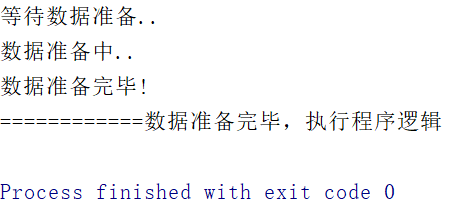
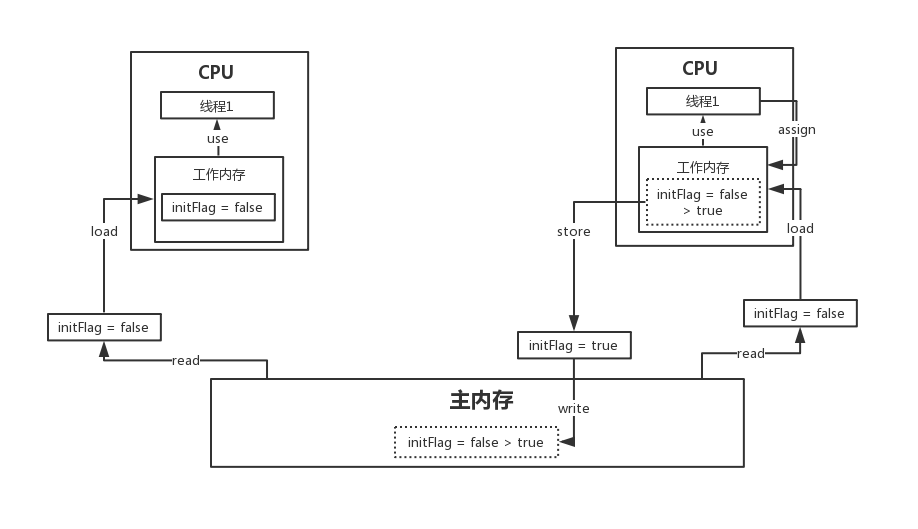

# CPU多核并发缓存架构剖析

# 多核并发缓存架构


# Java内存模型

Java线程内存模型跟CPU缓存模型类似，是基于CPU缓存模型来建立的，Java线程内存模型是标准化的，屏蔽掉了底层不同计算机的区别。


## 例子

编写代码来分析

```java
public class VolatileVisibilityTest {
    private static boolean initFlag = false;

    public static void main(String[] args) throws InterruptedException {
        new Thread(new Runnable() {
            @Override
            public void run() {
                System.out.println("等待数据准备..");
                while (!initFlag){

                }
                System.out.println("============数据准备完毕，执行程序逻辑");
            }
        }).start();
        Thread.sleep(2000);
        
        new Thread(new Runnable() {
            @Override
            public void run() {
                prepareData();
            }
        }).start();
    }

    public static void prepareData(){
        System.out.println("数据准备中..");
        initFlag = true;
        System.out.println("数据准备完毕!");
    }
}
```

执行程序，打印结果


并未出现

> ```
> ============数据准备完毕，执行程序逻辑
> ```

这段结果

### 分析

第一个线程给了initFlag为false，第二个执行了prepareData()所以initFlag为true，但是第一个线程中的flag还是为false。

如果给initFlag加个`volatile`关键字：

```java
public class VolatileVisibilityTest {
    private static volatile boolean initFlag = false;

    public static void main(String[] args) throws InterruptedException {
        new Thread(new Runnable() {
            @Override
            public void run() {
                System.out.println("等待数据准备..");
                while (!initFlag){

                }
                System.out.println("============数据准备完毕，执行程序逻辑");
            }
        }).start();
        Thread.sleep(2000);

        new Thread(new Runnable() {
            @Override
            public void run() {
                prepareData();
            }
        }).start();
    }
    public static void prepareData(){
        System.out.println("数据准备中..");
        initFlag = true;
        System.out.println("数据准备完毕!");
    }
}

```

执行程序，返回结果



# JMM数据原子操作

- read（读取）：从主内存读取数据
- load（载入）：将主内存读取到的数据写入工作内存
- use（使用）：从工作内存读取数据来计算
- assign（赋值）：将计算好的值重新赋值到工作内存中
- strore（存储）：将工作内存数据写入主内存
- write（写入）：将store过去的变量值赋值给主内存中的变量
- lock（锁定）：将主内存变量枷锁，表示为线程独占状态
- unlock（解锁）：将主内存变量解锁，解锁后其他线程可以锁定该变量

整个过程如下

