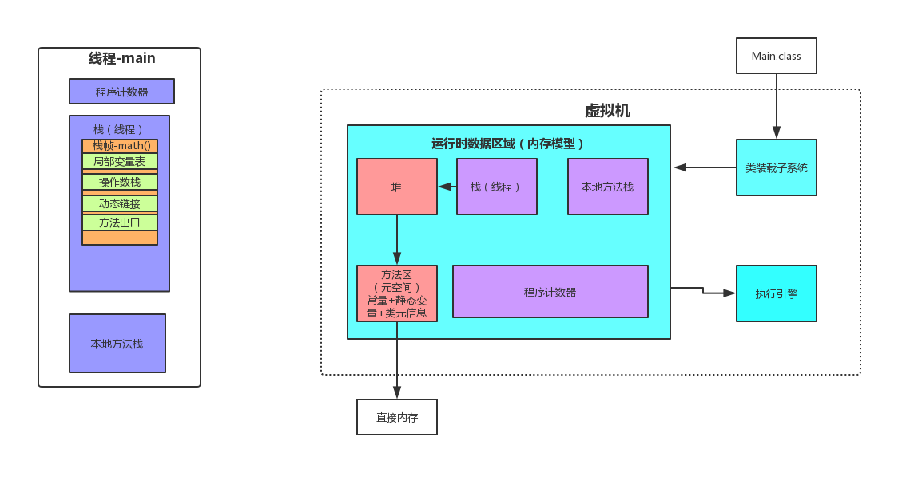
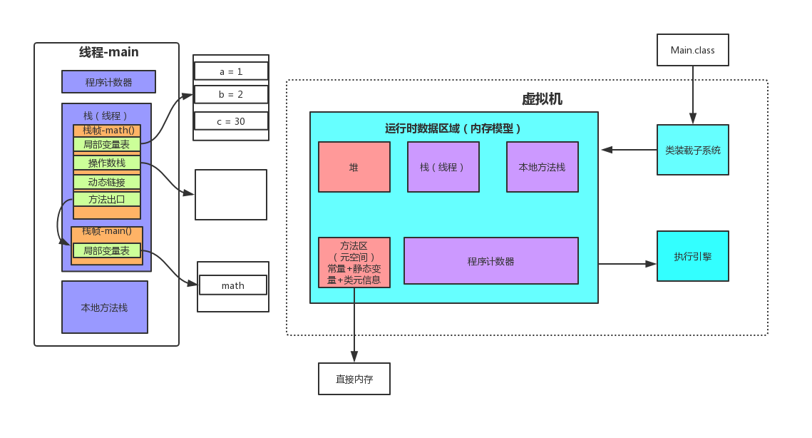
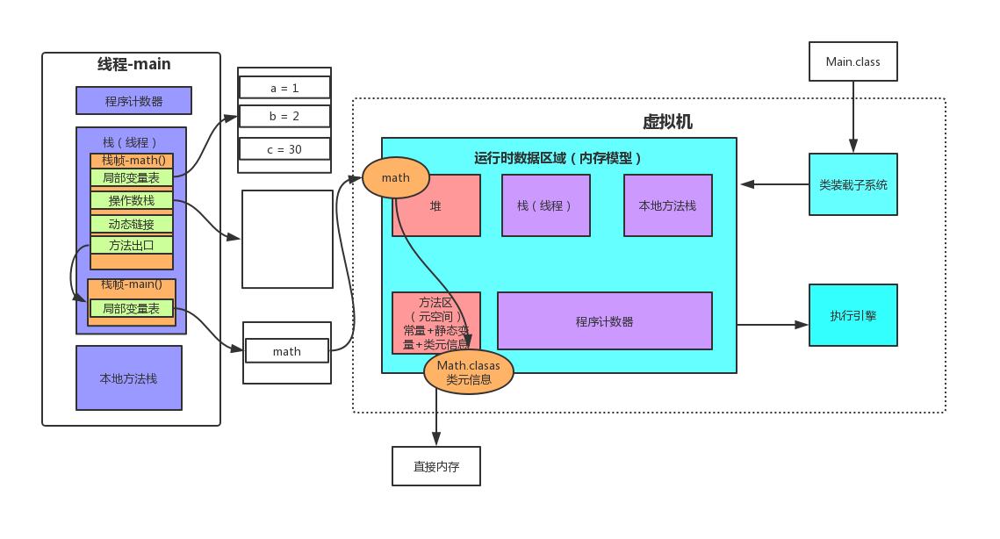
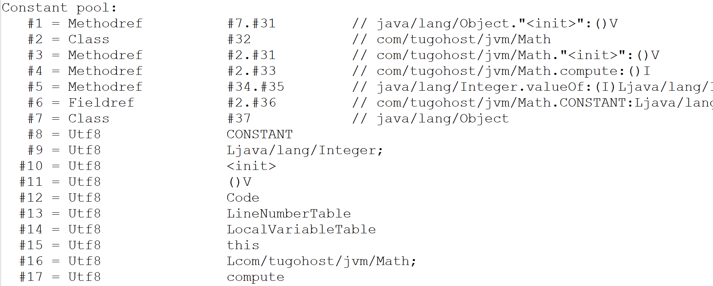
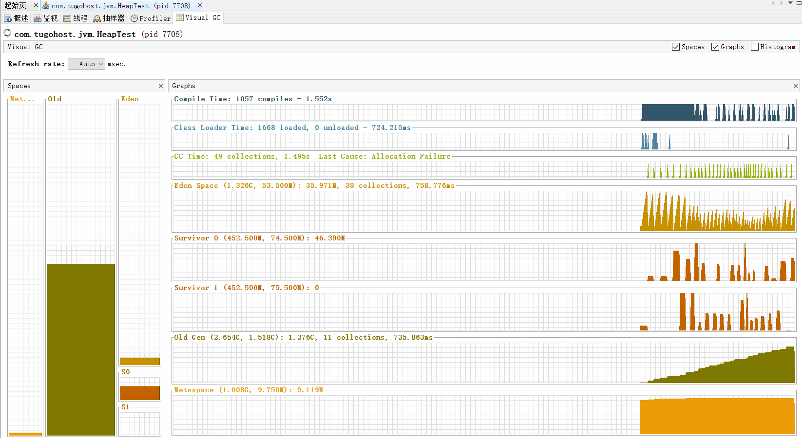

# 深入剖析Java虚拟机内存模型

# JVM整体架构

JVM整体架构如下：




通过编写代码来分析整个内存区域

```java
public class Math {
    public static final Integer CONSTANT = 666;

    public int compute(){
        int a = 1;
        int b = 2;
        int c = (a + b) * 10;
        return c;
    }

    public static void main(String[] args) {
        Math math = new Math();
        math.compute();
    }
}
```


对上述代码的class文件进行`javap - c Math.class > Math.txt`

`javap -c`是对代码进行反汇编

得到`Math.txt`文件

对compute方法进行分析：

```java
public int compute();
    Code:
       0: iconst_1 //  将int型(1)推送至栈顶
       1: istore_1 //  将栈顶int型数值存入第二个本地变量
       2: iconst_2 //  将int型(2)推送至栈顶
       3: istore_2 //  将栈顶int型数值存入第三个本地变量
       4: iload_1 //   将第二个int型本地变量推送至栈顶
       5: iload_2 //   将第三个int型本地变量推送至栈顶
       6: iadd // 	   将栈顶两int型数值相加并将结果压入栈顶
       7: bipush        10 // 将单字节的常量值(-128~127)推送至栈顶
       9: imul // 将栈顶两int型数值相乘并将结果压入栈顶
      10: istore_3 // 将栈顶int型数值存入第四个本地变量
      11: iload_3 // 将第四个int型本地变量推送至栈顶
      12: ireturn
```

上面程序，在JVM中的运行时区域如下：



# 栈

操作的操作暂时的数据存放到`操作数栈`。

main()的局部变量表存放对象的引用地址。



## 动态链接

`动态链接`就是当我们这个程序运行main方法时，当执行math对象额compute方法时，去compute方法执行，compute方法算是符号引用，找到符号引用所在的方法体，执行。

执行`javap -v Math.class > Math.txt`得到字节码文件

找到main方法所在的位置

```java
public static void main(java.lang.String[]);
    descriptor: ([Ljava/lang/String;)V
    flags: ACC_PUBLIC, ACC_STATIC
    Code:
      stack=2, locals=2, args_size=1
         0: new           #2                  // class com/tugohost/jvm/Math
         3: dup
         4: invokespecial #3                  // Method "<init>":()V
         7: astore_1
         8: aload_1
         9: invokevirtual #4                  // Method compute:()I
        12: pop
        13: return
      LineNumberTable:
        line 17: 0
        line 18: 8
        line 19: 13
      LocalVariableTable:
        Start  Length  Slot  Name   Signature
            0      14     0  args   [Ljava/lang/String;
            8       6     1  math   Lcom/tugohost/jvm/Math;
```

其中

> 9: invokevirtual #4                  // Method compute:()I

这一行表示，main函数中的math对象调用compute方法，

再往上找，找到常量池



找到

> #4 = Methodref          #2.#33         // com/tugohost/jvm/Math.compute:()I

再找`#2`、`#33`

>    #2 = Class              #32            // com/tugohost/jvm/Math
>    #3 = Methodref          #2.#31         // com/tugohost/jvm/Math."<init>":()V

所以这个过程就是`动态链接`的过程。


 # 本地方法栈

本地方法栈就是存储`native`方法

# 堆


如果Eden区放满，会`minor GC`，如果还存活的对象，会放到`From区`生命值+1，同理会放到`To区`生命值+1，如果生命值大于某个值（可以自己设置），会放到`老年代`。

通过写一个死循环代码来看看堆中垃圾收集器的工作：

```java
public class HeapTest {
    byte[] a = new byte[1024 * 100]; // 100Kb

    public static void main(String[] args) throws InterruptedException {
        ArrayList<HeapTest> heapTests = new ArrayList<>();
        while (true){
            heapTests.add(new HeapTest());
            Thread.sleep(10);
        }
    }
}

```

通过命令行`jvisualvm `打开`Java visualVM`



如果老年代满了触发`Full GC`。如果`Full GC`对老年代没有用，即老年代中没有无用的对象时，出现OOM效果。