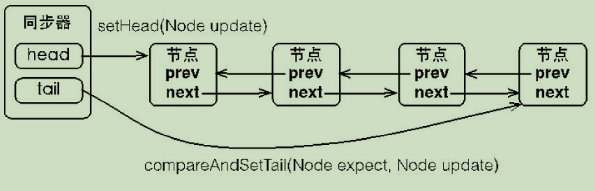
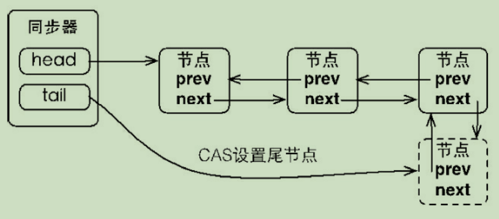
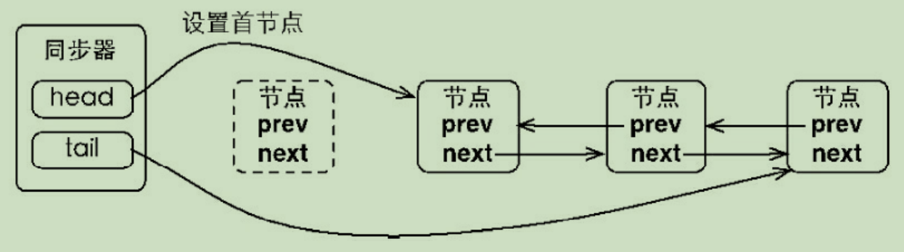
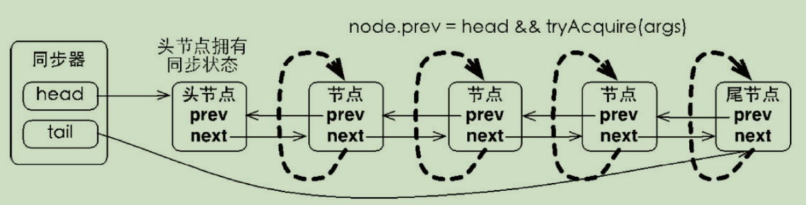
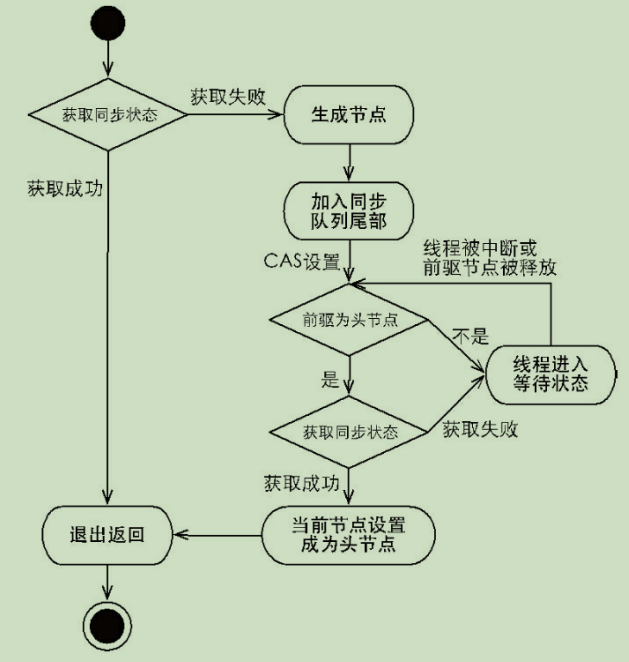

# 队列同步器
队列同步器AbstractQueuedSynchronizer（以下简称同步器），是用来构建锁或者其他同步组件的基础框架，它使用了一个int成员变量表示同步状态，通过内置的FIFO队列来完成资源获取线程的排队工作，并发包的作者（Doug Lea）期望它能够成为实现大部分同步需求的基础。

同步器是实现锁（也可以是任意同步组件）的关键，在锁的实现中聚合同步器，利用同步器实现锁的语义。可以这样理解二者之间的关系：锁是面向使用者的，它定义了使用者与锁交互的接口（比如可以允许两个线程并行访问），隐藏了实现细节；同步器面向的是锁的实现者，它简化了锁的实现方式，屏蔽了同步状态关系、线程的排队、等待与唤醒等底层操作。

## 队列同步器的接口与示例

同步器的设计是基于模板方法模式的，也就是说，使用者需要继承同步器并重写指定的方法，随后将同步器组合在自定义同步组件的实现中，并调用同步器提供的模板方法，而这些模板方法将会调用使用者重写方法。

重写同步器指定的方法时，需要使用同步器提供的如下3个方法来访问或修改同步状态。

- getState()：获取当前同步状态。
- setState(int newState)：设置当前同步状态。
- compareAndSetState(int expect,int update)：使用CAS设置当前状态，该方法能够保证状态设置的原子性。

同步器可重写的方法与描述如表所示：

| 方法名称                                   | 描述                                                         |
| ------------------------------------------ | ------------------------------------------------------------ |
| protected boolean tryAcquire(int arg)      | 独占锁获取同步状态，实现该方法需要查询当前状态并判断同步状态是否符合预期，然后再进行CAS设置同步状态 |
| protected boolean tryRelease(int arg)      | 独占式释放同步状态，等待获取同步状态的线程将有机会获取同步状态 |
| protected int tryAcquireShared(int arg)    | 共享式获取同步状态，返回大于等于0的值，表示获取成功，反之，获取失败 |
| protected boolean tryReleaseShare(int arg) | 共享式释放同步状态                                           |
| protected boolean isHeldExclusively        | 当前同步器是否在独占模式下被线程占用，一般该方法表示是否被当前线程所独占 |

实现自定义同步组件时，将会调用同步器提供的模板方法，这些（部分）模板方法与描述如表所示：

| 方法名称                                          | 描述                                                         |
| ------------------------------------------------- | ------------------------------------------------------------ |
| void acuire(int arg)                              | 独占式获取同步状态，如果当前线程获取同步状态成功，则由该方法返回，否则，将会进入同步队列等待，该方法将会调用重写的tryAcquire(int arg)方法 |
| void acquireInterruptibly(int arg)                | 与acquire(int arg)相同，但是该方法响应中断，当前线程未获取到同步状态而进入同步队列中，如果当前线程被中断，则该方法会抛出InterruptedException并返回 |
| boolean tryAcquireNanos(int arg,long nanos)       | 在acquireInterruptibly(int arg)基础上增加了超时限制，如果当前线程在超时时间内没有获取到同步状态，那么将会返回false，如果获取到了返回true |
| void acquireShared(int arg)                       | 共享式的获取同步状态，如果当前线程未获取到同步状态，将会进入同步队列等待，与独占式获取的主要区别是在同一时刻可以有多个线程获取到同步状态 |
| void acquireSharedInterruptibly(int arg)          | 与acquireShared(int arg)相同，该方法响应中断                 |
| boolean tryAcquireSharedNanos(int arg,long nanos) | 在acquireSharedInterruptibly(int arg)基础上增加了超时限制    |
| boolean release(int arg)                          | 独占式的释放同步状态，该方法会在释放同步状态之后，将同步队列中第一个节点包含的线程唤醒 |
| boolean releaseShared(int arg)                    | 共享式的释放同步状态                                         |
| Collection<Thread> getQueueThreads()              | 获取等待在同步队列上的线程集合                               |

同步器提供的模板方法基本上分为3类：独占式获取与释放同步状态、共享式获取与释放同步状态和查询同步队列中的等待线程情况。自定义同步组件将使用同步器提供的模板方法来实现自己的同步语义。

只有掌握了同步器的工作原理才能更加深入地理解并发包中其他地并发组件，所以下面通过一个独占锁的示例来深入了解一下同步器的工作原理。

顾名思义，独占锁就是在同一时刻只能有一个线程获取到锁，而其他获取锁的线程只能处于同步队列中等待，只有获取锁的线程释放了锁，后继的线程才能够获取锁：

```java
class Mutex implements Lock{
    //静态内部类，自定义同步器
    private static class Sync extends AbstractQueuedSynchronizer{
        //是否处于占用状态
        protected boolean isHeldExclusively(){
            return getState() == 1;
        }
        //当状态为0的时候获取锁
        public boolean tryAcquire(int acquires){
            if(compareAndSetState(0,1)){
                setExclusiveOwnerThread(Thread.currentThread());
                return true;
            }
            return false;
        }
        //释放锁，将状态设置为0
        protected boolean tryRelease(int releases){
            if(getState() == 0) throw new 
                IllegalMonitorStateException();
            setExcelusiveOwnerThread(null);
            setState(0);
            return true;
        }
        //返回一个Condition，每个codition都包含了一个codition队列
        Codition newConditon() {return new CoditionObject();}
    }
    //仅需要将操作代理到Sync上即可
    private final Sync sync = new Sync();
    public void lock(){sync.acuire(1);}
    public boolean tryLock() {return sync.tryAcquire(1);}
    public void unlock(){sync.release(1);}
    public Condition newCodition(){return sysc.newCondition();}
    public boolean isLocked() {return sync.isHeldExclusively();}
    public boolean hasQueuedThreads(){return sync.hasQueuedThreads();}
    public void lockInterruptibly() throw InterruptedException{
        sync.acqurieInterruptibly(1);
    }
    public boolean tryLock(long timeout,TimeUnit unit) throws InterruptedException{
        return sync.tryAcquireNanos(1,unit.toNanos(timeout));
    }
}
```

上述示例中，独占锁Mutex是一个自定义同步组件，它在同一时刻只允许一个线程占用锁。Mutex中定义了一个静态内部类，该内部类继承了同步器并实现了独占式获取和释放同步状态。在tryAcquire(int acquires)方法中，如果经过CAS设置成功（同步状态设置为1），则代表获取了同步状态，而在tryRelease(int releases)方法中只是将同步状态重置为0。

## 队列同步器的实现分析

1.同步队列

同步器依赖内部的同步队列（一个FIFO双向队列）来完成同步状态的管理，当前线程获取同步状态失败时，同步器会将当前线程以及等待状态等信息构造成为一个节点（Node）并将其加入同步队列，同时会阻塞当前线程，当同步状态释放时，会把首节点中的线程唤醒，使其再次尝试获取同步状态。

同步队列中的节点（Node）用来保存获取同步状态失败的线程引用、等待状态以及前驱和后继节点，节点的属性类型与名称以及描述如表所示：


**节点是构成同步队列的基础**，同步器拥有首节点（head）和尾节点（tail），没有成功获取同步状态和线程将会成为节点加入该队列的尾部，同步队列的基本结构如图所示：



当一个线程成功地获取了同步状态（或者锁），其他线程将无法获取到同步状态，转而被构造成为节点并加入到同步队列中，而这个加入队列地过程必须要保证线程安全，因此同步器提供了一个基于CAS地设置尾节点地方法：compareAndSetTail(Node expect,Node update)，它需要传递当前线程“认为”的尾节点和当前节点，只有设置成功后，当前节点才正式与之前的尾节点建立关联。

同步器将节点加入到同步队列的过程如图所示：



同步队列遵循FIFO，首节点是获取同步状态成功的节点，首节点的线程在释放同步状态时，将会唤醒后继节点，而后继节点将会在获取同步状态成功时将自己设置为首节点，过程如图所示：



上图中，设置首节点是通过获取同步状态成功的线程来完成的，由于只有一个线程能够成功获取到同步状态，因此设置头节点的方法并不需要使用CAS来保证，它只需要将首节点设置成为原首节点的后继节点并断开原首节点的next引用即可。

---

2.独占式同步状态获取与释放

通过调用同步器的acquire(int arg)方法可以获取同步状态，该方法对中断不敏感，也就是由于线程获取同步状态失败后进入同步队列中，后继对线程进行中断操作时，线程不会从同步队列中移出，该方法代码如下：

```java
public final void acquire(int arg){
    if(!tryAcquire(arg) && 
      acquireQueued(addWaiter(Node.EXCLUSIVE),arg))
        selfInterrupt();
}
```

其主要逻辑是：首先调用自定义同步器实现的tryAcquire(int arg)方法，该方法保证线程安全的获取同步状态，如果同步状态获取失败，则构造同步节点（独占式Node.EXCLUSIVE，同一时刻只能有一个线程成功获取同步状态）并通过addWaiter(Node node)方法将该节点加入到同步队列的尾部，最后调用acquireQueued(Node node,int arg)方法，使得该节点以“死循环”的方式获取同步状态。如果获取不到则阻塞节点中的线程，而被阻塞线程的唤醒主要依靠前驱节点的出队或阻塞现场被中断来实现。

下面分析一个相关工作。首先是节点的构造以及加入同步队列，如代码所示。

```java
private Node addWaiter(Node mode){
    Node node = new Node(Thread.currentThread(),mode);
    //快速尝试在尾部添加
    Node pred = tail;
    if(pred != null){
        node.prev = pred;
        if(compareAndSetTail(pred,node)){
            pred.next = node;
            return node; 
        }
    }
    enq(node);
    return node;
}
private Node enq(final Node node){
    for(;;){
        Node t = tail;
        if(t == null){
            //Must initialize
       		if(compareAndHead(new Node()))
                tail = head;
        }else{
            node.prev = t;
            if(compareAndSetTail(t,node)){
                t.next = node;
                return t;
            }
        }
    }
}
```

上述代码通过使用compareAndSetTail(Node expect,Node update)方法来确保节点能够被线程安全的添加。如果使用一个普通的LinkedList来维护节点之间的关系，那么当一个线程获取了同步状态，而其他多个线程由于调用tryAcquire(int arg)方法获取同步状态失败而并发地被添加到LinkedList时，LinkedList将难以保证Node的正确添加，最终的结果可能是节点的数量有偏差，而且顺序也是混乱的。

在enq(final Node node)方法中，同步器通过“死循环”来保证节点的正确添加，在“死循环”中只有通过CAS将节点设置成为尾节点之后，当前线程才能从该方法返回，否则，当前线程不断地尝试设置。可以看出，enq(final Node node)方法将并发节点的请求通过CAS变得“串行化”了。

节点进入同步队列之后，就进入了一个自旋的过程，每个节点（或者说每个线程）都在自省地观察，当条件满足，获取到了同步状态，就可以从这个自选过程中退出，否则依旧留在这个自旋过程中（并会阻塞节点地线程），如代码所示：

```java
final boolean acquireQueued(final Node node,int arg){
    boolean failed = true;
    try{
        boolean interrupted = false;
        for(;;){
            final Node p = node.predecessor();
            if(p == head && tryAcquire(arg)){
                setHead(node);
                p.next = null;//help GC
                failed = false;
                return interrupted;
            }
            if(shouldParkAfterFailedAcquire(p,node) &&
               parkAndCheckInterrupt())
                interrupted = true;
        }
    }finally{
        if(failed)
            cancelAcquire(node);
    }
}
```

在acquireQueued(final Node node,int arg)方法中，当前线程在“死循环”中尝试获取同步状态，而只有前驱结点是头节点才能够获取同步状态，这是为什么？原因有两个，如下。

第一，头节点是成功获取到同步状态的节点，而头节点的线程释放了同步状态之后，将会唤醒其后继节点，后继节点的线程被唤醒后需要检查自己的前驱节点是否是头节点。

第二，维护同步队列的FIFIO原则。该方法中，节点自旋获取同步状态的行为如图所示：



上图中，由于非首节点线程前驱节点出队或者被中断而从等待状态返回，随后检查自己的前驱是否是头节点，如果是则尝试获取同步状态。可以看到节点和节点之间在循环检查的过程中基本不相互通信，而是简单地判断自己的前驱是否为头节点，这样就使得节点的释放规则符合FIFO，并且也便于对过早通知的处理（过早通知是指前驱节点不是头节点的线程由于中断而被唤醒）。

独占式同步状态获取流程，也就是acquire(int arg)方法调用线程，如图所示：



在上图中，前驱节点为头节点且能够获取同步状态的判断条件和线程进入等待状态是获取同步状态的自选过程。当同步状态获取成功之后，当前线程从acqurie(int arg)方法返回，如果对于锁这种并发组件而言，代表着当前线程获取了锁。

当前线程获取同步状态并执行了相应逻辑之后，就需要释放同步状态，使得后续节点能够继续获取同步状态。通过调用同步器的release(int arg)方法可以释放同步状态，该方法在释放了同步状态之后，会唤醒其后继节点（进而使后继节点重新尝试获取同步状态）。该方法代码如下所示：

```java
public final boolean release(int arg){
    if(tryRelease(arg)){
        Node h = head;
        if(h != null && h.waitStatus != 0){
            unparkSuccessor(h);
        }
        return true;
    }
    return false;
}
```

该方法执行时，会唤醒头节点的后继节点线程，uparkSuccessor(Node node)方法使用LockSupport来唤醒处于等待状态的线程。

做个总结：在获取同步状态时，同步器维护一个同步队列，获取状态失败的线程都会被加入到队列中并在队列中进行自旋；移出队列（或停止自旋）的条件是前驱节点为头节点且成为获取了同步状态。在释放同步状态时，同步器调用tryRelease(int arg)方法释放同步状态，然后唤醒头节点的后继节点。

---

3.共享同步状态获取与释放

共享式获取与独占式获取最主要的区别在于同一时刻能否有多个线程同时获取到同步状态。


上图中，左半部分，共享式访问资源时，其他共享式的访问均被允许，而独占式访问被阻塞，右半部分是独占式访问资源时，同一时刻其他访问均被阻塞。

通过调用同步器的acquireShared(int arg)方法可以共享式地获取同步状态，该方法代码如下：

```java
public final void acquireShared(int arg){
    if(tryAcquireShared(arg)<0){
        doAcquireShared(arg);
    }
    private void doAcquireShared(int arg){
        final Node node = addWaiter(Node.SHARED);
        boolean failed = true;
        try{
            boolean interrupted = false;
            for(;;){
                final Node p = node.predecessor();
                if(p == head){
                    int r = tryAcquireShared(arg);
                    if(r >= 0){
                        setHeadAndPropagate(node,r);
                        p.next = null;
                        if(interrupted){
                            selfInterrupt();
                        }
                        failed = false;
                        return;
                    }
                }
                if(shouldParkAfterFailedAcquire(p,node)&&
                   parkAndCheckInterrupt()){
                  	interrupted = true;
                }
            }
            finally{
                if(failed){
                    cancelAcquire(node);
                }
            }
        }
    }
}
```

在acquireShared(int arg)方法中，同步器调用tryAcquireShared(int arg)方法尝试获取同步状态，tryAcquireShared(int arg)方法返回值为int类型，当返回值大于等于0时，表示能够获取到同步状态。因此，在共享式获取地自旋过程中，成功获取到同步状态并退出自旋地条件是tryAcquireShared(int arg)方法返回值大于等于0.可以看到，在doAcquireShared(int arg)地自旋过程中，如果当前节点地前驱为头节点时，尝试获取同步状态，如果返回值大于等于0，表示该次获取同步状态成功并从自旋过程中退出。

---

4.独占式超时获取同步状态

响应中断的同步状态获取过程。在Java 5之前，当一个线程获取不到锁而被阻塞在synchronized之外时，对该线程进行中断操作，此时该过程的中断标志位会被修改，但线程依旧会阻塞在synchronized上，等待着获取锁。在Java 5中，同步器提供了acquireInterruptibly(int arg)方法，这个方法在等待获取同步状态时，如果当前线程被中断，会立刻返回，并抛出InterruptedException。

超市获取同步状态过程可以被视作响应中断获取同步状态过程的“增强版”，doAcquireNanos(int arg,long nanosTimeout)方法在支持响应中断的基础上，增加了超时获取的特性。针对超市获取，主要需要计算出需要睡眠的时间间隔nanosTimeout，为了防止过早通知，nanosTimeout计算公式为：nanosTimeout = now -lastTime，其中now为当前唤醒时间，lastTime为上次唤醒时间。


上图中可以看出，独占式超时获取状态doAcquireNanos(int arg,long nanosTimeout)和独占式获取同步状态acquire(int args)在流程上非常相似，其主要区别在于未获取到同步状态时的处理逻辑。

---

5.自定义同步组件——TwinsLock

该工具在同一时刻，只允许至多两个线程同时访问，超过两个线程的访问将被阻塞，我们将这个同步工具命名未TwinsLock。

设置初始状态status为2，当一个线程进行获取，status减1，该线程释放，则status加1，其中0表示当前已经有两个线程获取了同步资源，此时再有其他线程对同步状态进行获取，该线程只能被阻塞。
