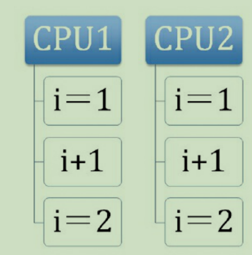
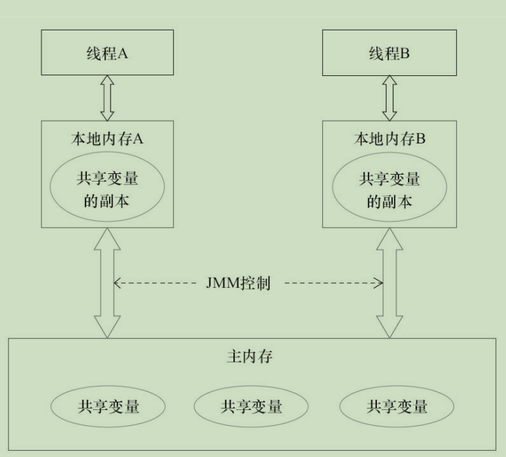
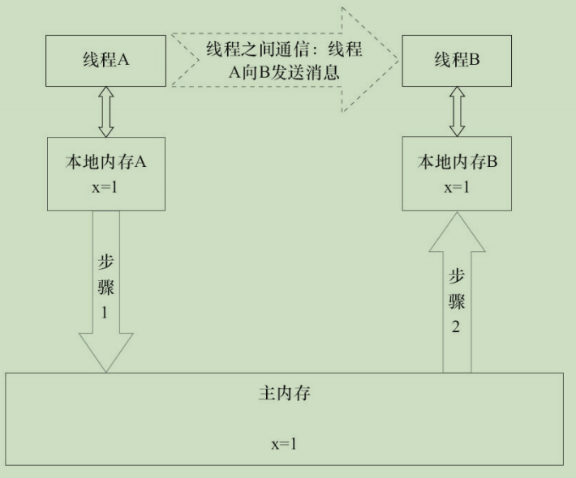
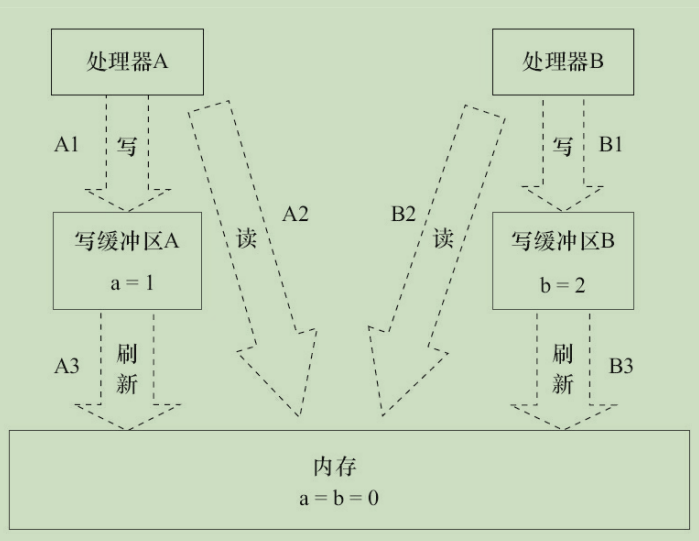
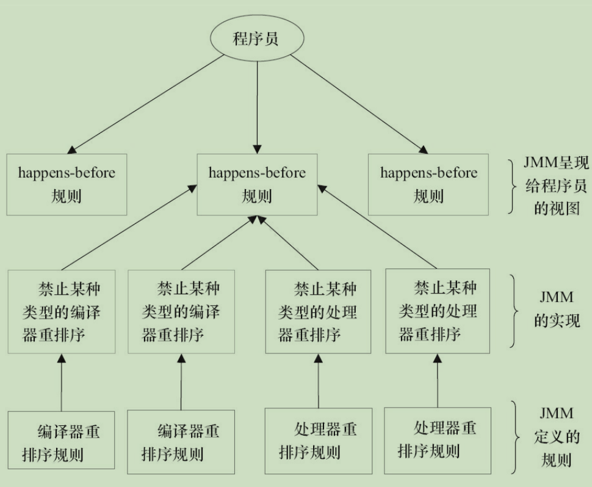
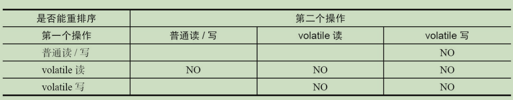
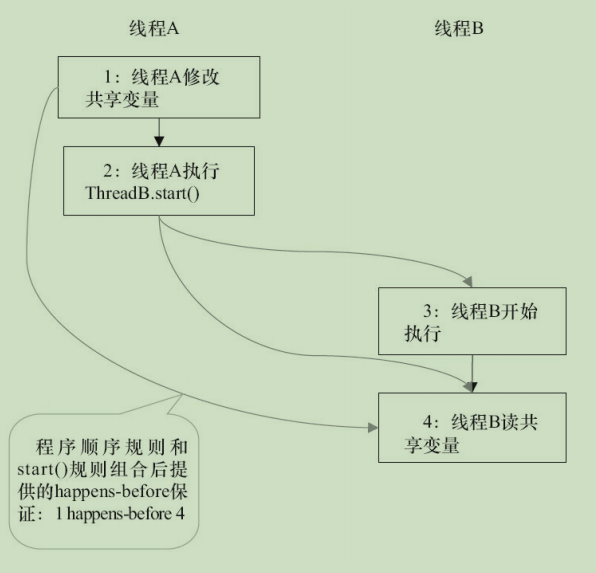

# 并发编程的挑战

## 上下文切换

# Java并发机制的底层实现原理

Java代码在编译后会变成Java字节码，字节码被类加载器加载到JVM里，JVM执行字节码，最终需要转化为汇编指令在CPU上执行，Java中所使用的并发机制依赖于JVM的实现和CPU的指令

### volatile的应用

在多线程并发编程中synchronized和volatile都扮演着重要的角色，volatile是轻量级的synchronized，它在多处理器开发中保证了共享变量的“可见性”。可见性的意思是当一个线程修改一个共享变量时，另外一个线程能读到这个修改的值。如果volatile变量修饰符使用恰当的话，它比synchronized的使用和执行成本更低，因为它不会引起线程上下文的切换和调度。

#### 1.volatile的定义与实现原理

Java语言规范第3版中对volatile的定义如下：Java编程语言允许线程访问共享变量，为了确保共享变量能被准确和一致地更新，线程应该确保通过排他锁单独获得这个变量。Java语言提供了volatile，在某些情况下比锁要更加方便。如果一个字段被声明成volatile，Java线程内存模型确保所有线程看到这个变量的值是一致的。

在了解volatile实现原理之前，我们先来看下与其实现原理相关的CPU术语与说明。

| 术语       | 英文单词               | 术语描述                                                     |
| ---------- | ---------------------- | ------------------------------------------------------------ |
| 内存屏障   | memory barriers        | 是一组处理器指令，用于实现对内存操作的顺序限制               |
| 缓冲行     | cache line             | 缓存中可以分配的最小存储单位。处理器填写缓存线时会加载整个缓存线，需要使用多个主内存读周期 |
| 原子操作   | atomic operations      | 不可中断的一个或一系列操作                                   |
| 缓冲行填充 | cache line fill        | 当处理器识别到从内存中读取操作数是可缓存的，处理器读取整个缓存行到适当的缓存（L1，L2，L3的或所有） |
| 缓存命中   | cache hit              | 如果进行告诉缓存行填充操作的内存位置仍然是下次处理器访问的地址时，处理器从缓存中读取操作数，而不是从内存读取 |
| 写命中     | write hit              | 当处理器将操作数写回到一个内存缓存的区域时，它首先会检查这个缓存的内存地址是否在缓存行中，如果存在一个有效的缓存行，则处理器将这个操作数写回到缓存，而不是写回到内存，这个操作被称为写命中 |
| 写缺失     | write misses the cache | 一个有效的缓存行被写入到不存在的内存区域                     |


volatile是如何来保证可见性的呢？让我们在X86处理器下通过工具获取JIT编译器生成的汇编指令来查看对volatile进行写操作时，CPU会做什么事情。

Java代码如下：

> instance = new Singleton(); //instance是volatile变量

转变成汇编代码，如下：

> 0x01a3de1d: movb $0x0,0x1104800(%esi);
>
> oxo1a3de24: lock add1 $0x0,(%esp);

有volatile变量修饰的共享变量进行写操作的时候会多出第二行汇编代码，通过查IA-32架构软件开发者手册可知，Lock前缀的指令在多核处理器下会引发了两件事情。

1) 将当前处理器缓存行的数据写回到系统内存。

2) 这个写回内存的操作会使在其他CPU里缓存了该内存地址的数据无效。

为了提高处理速度，处理器不直接和内存进行通信，而是先将系统内存的数据读到内存缓存（L1，L2或其他）后再进行操作，但操作完不知道何时会写到内存。如果对声明了volatile的变量进行写操作，JVM就会向处理器发送一条Lock前缀的指令，将这个变量所在缓存行的数据写回到系统内存。但是就算写回到内存，如果其他处理器缓存的值还是旧的，再执行计算操作就会有问题。所以，在多处理器下，为了保证各个处理器的缓存是一致的，就会实现缓存一致性协议，每个处理器通过嗅探在总线上传播的数据来检查自己缓存的值是不是过期了，当处理器发现自己缓存行对应的内存地址被修改，就会将当前处理器的缓存行设置成无效状态，当处理器对这个数据进行修改操作的时候，会重新从系统内存中把数据读到处理器缓存里。

下面来具体讲解volatile的两条实现原则。

1) **Lock前缀指令会引起处理器缓存回写到内存**。Lock前缀指令导致在执行指令期间，声名处理器的LOCK#信号。在多处理器环境中，LOCK#信号确保在声名该信号期间，处理器可以独占任何共享内存。但是，在最近的处理器里，LOCK#信号一般不锁总线，而是锁缓存，毕竟锁总线开销的比较大。对于Intel486和Pentium处理器，在锁操作时，总是在总线上声明LOCK#信号。但在P6和目前的处理器中，如果访问的内存区域已经缓存在处理器内部，则不会声明LOCK#信号。相反，它会锁定这块内存区域的缓存并会写到内存，并使用缓存一致性机制来确保修改的原子性，此操作被称为“缓存锁定”，缓存一致性机制会阻止同时修改由两个以上处理器缓存的内存区域数据。

2) **一个处理器的缓存回写到内存会导致其他处理器的缓存无效**。IA-32处理器和inter 64处理器使用MESI（修改、独占、共享、无效）控制协议去维护内部缓存和其他处理器缓存的一致性。在多核处理器系统中进行操作的时候，IA-32和inter 64处理器能嗅探其他处理器访问系统内存和它们的内部缓存。处理器使用嗅探技术保证它的内部缓存、系统内存和其他处理器的缓存的数据在总线上保持一致。例如，在Pentium和P6 family处理器中，如果通过嗅探一个处理器来检测其他处理器打算写内存地址，而这个地址当前处于共享状态，那么正在嗅探的处理器将使它的缓存行无效，在下次访问相同内存地址时，强制执行缓存行填充。

#### 2.volatile的使用优化

著名的Java并发编程大师Dourglea在JDK7的并发包里新增一个队列集合类LinkedTransferQueue，它在使用volatile变量时，用一种追加字节的方式来优化队列出队和入队的性能。LinkedTransferQueue的代码如下

```java
//队列中的头部节点
private transient final PaddedAtomicReference<QNode> head;
//队列中的尾部节点
private transient final PaddedAtomicReferfence<QNode> tail;
static final class PaddedAtomicReference<T> extends AtomicReference {
    //使用很多4个字节的引用追加64个字节
    Object p0,p1,p2,p3,p4,p5,p6,p7,p8,p9,pa,pb,pc,pd,pe;
    PaddedAtomicReference(T r){
        super(r);
    }
}
public class AtomicReference <V> implements java.io.Serializable{
    private volatile V value;
    //省略其他代码
}
```

**追加字节能优化性能**？这种方式看起来很神奇，但如果深入理解处理器架构就能理解其中的奥秘。让我们先来看看LinkedTransferQueue这个类，它使用一个内部类类型来定义队列的头节点（head）和尾节点（tail），而这个内部类PaddedAtomicReference相对于父类AtomicReference只做了一件事情，就是将共享变量追加到64字节。我们可以来计算下，一个对象的引用占4个字节，它追加了15个变量（共占60个字节），再加上父类的value变量，一个64个字节。

**为什么追加64字节能够提高并发编程的效率呢**？因为对于英特尔酷睿i7、酷睿、Atom和NetBurst，以及Core Solo和Pentium M处理器的L1、L2或L3缓存的高速缓存行是64个字节宽，不支持部分填充缓存行，这意味着，如果队列的头节点和尾节点都不足64字节的话，处理器会将它们都读到同一个高速缓存行中，在多处理器下每个处理器都会缓存同样的头、尾节点，当一个处理器试图修改头节点时，会将整个缓存行锁定，那么在缓存一致性机制的作用下，会导致其他处理器不能访问自己高速缓存中的尾节点，而队列的入队和出队操作则需要不停修改头节点和尾节点，所以在多处理器的情况下将会严重影响到队列的入队和出队效率。Douglea使用追加到64字节的方式来填满高速缓冲区的缓存行，避免头节点和尾节点加载到同一个缓存行，使头、尾节点在修改时不会互相锁定。

**那么是不是在使用volatile变量时都应该追加到64字节呢**？不是的。在两种场景下不应该使用这种方式：

1. **缓存行非64字节宽的处理器**。如P6系列和奔腾处理器，它们的L1和L2告诉缓存行是32个字节宽。
2. **共享变量不会被频繁地写**。因为使用追加字节地方式需要处理器读取更多的字节到高速缓冲区，这本身就会带来一定的性能消耗，如果共享变量不被频繁写的话，锁的几率也非常小，就没必要通过追加字节的方式来避免相互锁定。

### synchronized的实现原理与应用

在多线程并发编程中synchronized一直是元老级角色，很多人都会称呼它为重量级锁。但是，随着Java SE 1.6对synchronized进行了各种优化之后，有些情况下它就并不那么重了。

先来看下利用synchronized实现同步的基础：Java中的每一个对象都可以作为锁。具体表现为以下3种形式：

- 对于普通同步方法，锁是当前实例对象。
- 对于静态同步方法，锁是当前类的Class对象。
- 对于同步方法块，锁是synchronized括号里配置的对象。

当一个线程试图访问同步代码块时，它首先必须得到锁，退出或抛出异常时必须释放锁。那么所到底存在哪里呢？锁里面会存储什么信息呢？

从JVM规范中可以看到synchronized在JVM里的实现原理，JVM基于进入和退出Monitor对象来实现方法同步和代码块同步，但两者的实现细节不一样。代码块同步是使用monitorenter和monitorexit指令实现的，而方法同步是使用另外一种方式实现的，细节在JVM规范里并没有详细说明。但是，方法的同步同样可以使用这两个指令来实现。

monitorenter指令是在编译后插入到同步代码块的开始位置，而monitorexit是插入到方法结束处和异常处，JVM要保证每个monitorenter必须有对应的monitorexit与之配对。任何对象都有一个monitor与之关联，当且一个monitor被持有后，它将处于锁定状态。线程执行到monitorenter指令时，将会尝试获取对象所对应的monitor的所有权，即尝试获得对象的锁。

#### Java对象头

synchronized用的锁是存在Java对象头里的。如果对象是数组类型，则虚拟机用3个字款（Word）存储对象头，如果对象是非数组类型，则用2字宽存储对象头。在32位虚拟机中，1字宽等于4字节，即32bit，如表所示：

| 长度     | 内容                   | 说明                             |
| -------- | ---------------------- | -------------------------------- |
| 32/64bit | Mark Word              | 存储对象的hashCode或锁信息等     |
| 32/64bit | Class Metadata Address | 存储到对象类型数据的指针         |
| 32/32bit | Array length           | 数组的长度（如果当前对象是数组） |

Java对象头里的Mark Word里默认存储对象的HashCode、分代年龄和锁标记位。32位JVM的Mark Word的默认存储结构如表所示

| 锁状态   | 25bit          | 4bit         | 1bit是否是偏向锁 | 2bit锁标志位 |
| -------- | -------------- | ------------ | ---------------- | ------------ |
| 无锁状态 | 对象的hashCode | 对象分代年龄 | 0                | 01           |

在运行期间，Mark Word里存储的数据会随着锁标志位的变化而变化。Mark Word可能变化位存储以下4种数据，如表所示：


在64位虚拟机下，Mark Word是64bit大小的，其存储结构如表所示：


#### 锁的升级与对比

Java SE 1.6为了减少获得锁和释放锁带来的性能消耗，引入了“偏向锁”和“轻量级锁”，在Java SE 1.6种，锁一共有4种状态，级别从低到高依次是：无锁状态、偏向锁状态、轻量级锁状态和重量级锁状态，这几个状态会随着竞争情况逐渐升级。锁可以升级但不能降级，意味着偏向锁升级成轻量级锁后不能降级成偏向锁。这种锁升级却不能降级的策略，目的是为了提高获得锁和释放锁的效率。

##### 1.偏向锁

HotSpot的作者经常研究发现，大多数情况下，锁不仅不存在多线程竞争，而且总是由同一线程多次获得，为了让线程获得锁的代价更低而引入了偏向锁。当一个线程访问同步块并获取锁时，会在对象头和栈帧种的锁记录里存储锁偏向的线程ID，以后该线程在进入和退出同步块时不需要进行CAS操作来加锁和解锁，只需简单地测试下对象头的Mark Word里是否存储着指向当前线程的偏向锁。如果测试成功，表示线程已经获得了锁。如果测试失败，则需要再测试一下Mark Word中偏向锁的标识是否设置成1（表示当前是偏向锁）；如果没有设置，则使用CAS竞争锁；如果设置了，则尝试使用CAS将对象头的偏向锁指向当前线程。


##### 3.锁的优缺点对比

| 锁       | 优点                                                         | 缺点                                           | 适用场景                         |
| -------- | ------------------------------------------------------------ | ---------------------------------------------- | -------------------------------- |
| 偏向锁   | 加锁和解锁不需要额外的消耗，和执行非同步方法相比仅存在纳秒级的差距 | 如果线程间存在锁竞争，会带来额外的锁撤销的消耗 | 适用于只有一个线程访问同步块场景 |
| 轻量级锁 | 竞争的线程不会阻塞，提高了程序的响应速度                     | 如果始终得不到锁竞争的线程，使用自旋会消耗CPU  | 追求响应时间同步块执行速度非常快 |
| 重量级锁 | 线程竞争不使用自旋，不会消耗CPU                              | 线程阻塞，响应时间缓慢                         | 追求吞吐量同步块执行速度较长     |

### 原子操作的实现原理

原子（atomic）本意是“不能被进一步分割的最小粒子”，而原子操作（atomic operation）意为“不可被中断的一个或一系列操作”。在多处理器上实现原子操作就变得有点复杂。

#### 1.术语定义

| 术语名称     | 英文                   | 解释                                                         |
| ------------ | ---------------------- | ------------------------------------------------------------ |
| 缓存行       | Cache line             | 缓存的最小操作单位                                           |
| 比较并交换   | Compare and Swap       | CAS操作需要输入两个数值，一个旧制（期望操作前的值）和一个新值，在操作期间先比较旧值没有发生变化，入宫没有发生变化，才交换新值，发生了则不交换 |
| CPU流水线    | CPU pipeline           | CPU流水线的工作方式就像工业生产上的装配流水线，在CPU中由5~6个不同功能的电路单元组成一条指令处理流水线，然后将一条X86指令5 ~ 6步后再由这些电路单元分别执行，这样就能实现在一个CPU时钟周期完成一条指令，因此提高CPU的运算速度 |
| 内存顺序冲突 | Memory order violation | 内存顺序冲突一般是由假共享引起的，假共享是指多个CPU同时修改同一个缓存行的不同部分而引起其中一个CPU的操作无效，当出现这个内存顺序冲突时，CPU必须清空流水线 |

#### 2.处理器如何实现原子操作

32位IA-32处理器使用基于对缓存加锁或总线加锁的方式来实现多处理器之间的原子操作。首先处理器会自动保证基本的内存操作的原子性。处理器保证从系统内存中读取或写入一个字节是原子的，意思是当一个处理器读取一个字节时，其他处理器不能访问这个字节的内存地址。Pentium 6和最新的处理器能自动保证单处理器对同一个缓存行里进行16/32/64位的操作是原子的，但是复杂的内存操作处理器是不能自动保证其原子性的，比如跨总线宽度、跨多个缓存行和跨页表的访问。但是，处理器提供总线锁定和缓存锁定两个机制来保证复杂内存操作的原子性。

（1）使用总线锁保证原子性

**第一个机制是通过总线锁保证原子性**。如果多个处理器同时对共享变量进行读改写操作（i++就是经典的读改写操作），那么共享变量就会被多个处理器同时进行操作，这样读改写操作就不是原子的，操作完之后共享变量的值会和期望的不一致。举个例子，如果i=1，我们进行两次i++操作，我们期望的结果是3，但是有可能结果是2，如果所示：



原因可能是多个处理器同时从各自的缓存中读取变量i，分别进行加1操作，然后分别写入系统内存中。那么，想要保证读写改共享变量的操作是原子的，就必须保证CPU1读改写共享变量的时候，CPU2不能操作缓存了该共享变量内存地址的缓存。

处理器使用总线锁就是来解决这个问题的。所谓总线锁就是使用处理器提供的一个LOCK#信号，当一个处理器在总线上输出此信号时，其他处理器的请求将被阻塞住，那么该处理器可以独占共享内存。

（2）使用缓存锁保证原子性

**第二个机制是通过缓存锁定来保证原子性**。在同一时刻，我们只需保证对某个内存地址的操作是原子性即可，但总线锁定把CPU和内存之间的通信锁住了，这使得锁定期间，其他处理器不能操作其他内存地址的数据，所以总线锁定的开销比较大，目前处理器在某些场合下使用缓存锁定代替总线锁定来进行优化。

**但是有两种情况下处理器不会使用缓存锁定**

第一种情况是：当操作的数据不能被缓存在处理器内部，或操作的数据跨多个缓存行（cache line）时，则处理器会调用总线锁定。

第二种情况是：有些处理器不支持缓存锁定。对于Inter 486和Pentium处理器，就算锁定的内存区域在处理器的缓存行中也会调用总线锁定。

#### 3.Java如何实现原子操作

在Java中可以通过锁和循环CAS的方式来实现原子操作。

（1）使用循环CAS实现原子操作

JVM中的CAS操作正是利用了处理器提供的MPXCHG指令实现的。自旋CAS实现的基本思路就是循环进行CAS操作直到成功为止，以下代码实现了一个基于CAS线程安全的计数器方法safeCount和一个非线程安全的计数器count。

```java
private AtomicInteger atomicI = new AtomicInteger(0);
private int i = 0;
public static void main(Stirng[] args){
    final Counter cas = new Counter();
    List<Thread> ts = new ArrayList<Thread>(600);
    long start = System.currentTimeMillis();
    for(int j = 0; j < 100; j++){
        Thread t = new Thread(new Runnable(){
        @Override
        public void run(){
            for(int i = 0; i < 1000; i++){
                cas.count();
                cas.safeCount();
            }
        }
        });
        ts.add(t);
    }
    for(Thread t : ts){
        t.start();
    }
    //等待所有线程执行完成
    for(Thread t : ts){
        try{
            t.join();
        }catch(InterruptedException e){
            e.printStackTrace();
        }
    }
    System.out.println(cas.i);
    System.out.pritnln(cas.atomicI.get());
    System.out.pritnln(System.currentTimeMillis() - start);
}
//使用CAS实现线程安全计数器
private void safeCount(){
    for(;;){
        int i = atomicI.get();
        boolean suc = atomicI.compareAndSet(i, ++i);
        if(suc){
            break;
        }
    }
}
//非线程安全计数器
private void ocunt(){
    i++;
}
}
```


（2）CAS实现原子操作的三大问题

在Java并发包中有一些并发框架也使用了自旋CAS的方式来实现原子操作，比如LinkedTransferQueue类的Xfer方法。CAS虽然很高效地解决了原子操作，但是CAS仍然存在三大问题。

**1)ABA问题**。因为CAS需要在操作值地时候，检查值有没有发生变化，如果没有发生变化则更新，但是如果一个值原来是A，变成了B，又变成了A，那么使用CAS进行检查时会发现它地值没有发生变化，但是实际上却变化了。ABA问题地解决思路就是使用版本号。在变量前面追加上版本号，每次变量更新地时候把版本号加1，那么A->B->A就会变成1A->2B->3A。从Java1.5开始，JDK地Atomic包里提供了一个类AtomicStampeReference来解决ABA问题。这个类地comareAndSet方法地作用是首先检查当前引用是否等于预期引用，并且检查当前标志是否等于预期标志，如果全部相等，则以源自方式将该引用和该标志地值设置为给定的更新值。

**2)循环时间长开销大**。自旋CAS如果长时间不成功，会给CPU带来非常大的执行开销。如果JVM能支持处理器提供的pause指令，那么效率会有一定的提示。

**3)只能保证一个共享变量的原子操作**。当对一个共享变量执行操作时，我们可以使用循环CAS的方式来保证原子操作，但是对多个共享变量操作时，循环CAS就无法保证操作的原子性，这个时候就可以用锁。

（3）使用锁机制实现原子操作

锁机制保证了只有获得锁的线程才能够操作锁定的内存区域。JVM内部实现了很多种锁机制，有偏向锁、轻量级锁和互斥锁。除了偏向锁，JVM实现锁的方式都用了循环CAS，即当一个线程想进入同步块的时候使用循环CAS的方式来获取锁，当它退出同步块的时候使用循环CAS释放锁。

# Java内存模型

## Java内存模型的基础

### 并发编程模型的两个关键问题

在并发编程种，需要处理两个关键问题：线程之间如何通信及线程之间如何同步（这里的线程是指并发执行的活动实体）。通信是指线程之间以何种机制来交换信息。在命令式编程种，线程之间的通信机制有两种：共享内存和消息传递。

在共享内存的并发模型里，线程之间共享程序的公共状态，通过写-读内存中的公共状态进行隐式通信。在消息传递的并发模型里，线程之间没有公共状态，线程之间必须通过发送消息来显式进行通信。

同步是指程序中用于控制不同线程间操作发生相对顺序的机制。在共享内存并发模型里，同步是闲时间进行的。程序员必须显式指定某个方法或某段代码需要在线程之间互斥执行。在消息传递的并发模型里，由于消息的发送必须在消息的接受之前，因此同步是隐式进行的。

Java的并发采用的是共享内存模型，Java线程之间的通信总是隐式进行，整个通信过程对程序员完全透明。如果编写多线程程序的Java程序员不理解隐式进行的线程之间通信的工作机制，很可能会遇到各种奇怪的内存可见性问题。

### Java内存模型的抽象结构

Java线程之间的通信由Java内存模型（简称为JMM）控制，JMM决定一个线程对共享变量的写入何时对另一个线程可见。

Java内存模型的抽象示意图如图所示：



如果线程A与线程B之间要通信的话，必须要经历下面2个步骤：

1)线程A把本地内存A中更新过的共享变量刷新到主内存中去。

2)线程B到主内存中去读取线程A之前已更新过的共享变量。

下面通过示意图来说明这两个步骤：



如图所示，本地内存A和本地内存B由主内存中共享变量x的副本。假设初始时，这3个内存中的x值都为0。线程A在执行时，把更新后的x值（假设值为1）临时存放在自己的本地内存A中。当线程A和线程B需要通信时，线程A首先会把自己本地内存中修改后的x值刷新到主内存中，此时主内存中的x值变为了1.随后，线程B到主内存中读取线程A更新后的x值，此时线程B的本地内存的x值也变为了1。

从整体来看，这两个步骤实质上是线程A在向线程B发送消息，而且这个通信过程必须要经过主内存。JMM通过控制主内存与每个线程的本地内存之间的交互，来为Java程序提供内存可见性保证。

### 从源代码到指令序列的重排序

在执行程序时，为了提高性能，编译器和处理器常常会对指令做重排序。重排序分3种类型。

1) 编译器优化的重排序。编译器在不改变单线程程序语义的前提下，可以重新安排语句的执行顺序。

2) 指令级并行的重排序。现代处理器采用了指令级并行技术（Instruction-Level Parallelism，ILP）来讲多条指令重叠执行。如果不存在数据依赖性，处理器可以改变语句对应机器指令的执行顺序。

3) 内存系统的重排序。由于处理器使用缓存和读/写缓冲区，这使得加载和存储操作看上去可能是在乱序执行。

从Java源代码到最终实际执行的指令序列，会分别经历下面3种重排序，如图所示：


上述的1属于编译器重排序，2和3属于处理器重排序。

### 并发编程模型的分类

现在的处理器使用写缓冲区临时保存向内存写入的数据。写缓冲区可以保证指令流水线持续运行，它可以避免由于处理器停顿下来等待向内存写入数据而产生的延迟。同时，通过以批处理的方式刷新写缓冲区，以及合并写缓冲区中对同一内存地址的多次写，减少对内存总线的占用。虽然写缓存区有这么多好处，但每个处理器上的写缓冲区，仅仅对它所在的处理器可见。这个特性会对内存操作的执行顺序产生重要的影响：处理器对内存的读/写操作的执行顺序，不一定与内存实际发生的读/写操作顺序一致！为了具体说明，请看下面的图：


假设处理器A和处理器B按程序的顺序并执行内存访问，最终可能得到x=y=0的结果。



这里处理器A和处理器B可以同时把共享变量写入自己的写缓冲区（A1，B1），然后从内存中读取另一个共享变量（A2，B2），最后才把自己写缓存区中保存的脏数据刷新到内存中（A3，B3）。当以这种时序执行时，程序就可以得到x=y=0的结果。

从内存操作实际发生的顺序来看，直到处理器A执行A3来刷新自己的写缓存区，写操作A1才算真正执行了。虽然处理器A执行内存操作的顺序为A1->A2，但内存操作实际发生的顺序却是A2->A1。此时，处理器A的内存操作顺序被重排序了（处理器B的情况和处理器A一样这里就不赘述了）。

---

**注意**

- sparc_TSO是指以TSO(Total Store Order)内存模型运行时sparc处理器的特性。
- 表中的X86包含X64及AMD64。
- 由于ARM处理器的内存模型与PowerPC处理器的内存模型非常类似，本文将忽略它。

为了保证内存可见性，Java编译器在生成指令序列的适当位置会插入内存屏障指令来禁止特定类型的处理器重排序。JMM把内存屏障指令来禁止指令分为四类，如表所示：

| 屏障类型            | 指令实例                 | 说明                                                         |
| ------------------- | ------------------------ | ------------------------------------------------------------ |
| LoadLoad Barriers   | Load1;LoadLoad;Load2     | 确保Load1数据的装载先于Load2及所有后续装载指令的装载         |
| StoreStore Barriers | Store1;StoreStore;Store2 | 确保Store1数据对其他处理器可见（刷新到内存）先于Store2及所有后续存储指令的存储 |
| LoadStore Barriers  | Load1;LoadStroe;Store2   | 确保Load1数据装载先于Store2及所有后续的存储指令刷新到内存    |
| StoreLoad Barriers  | Store1;StoreLoad;Load2   | 确保Store1数据对其他处理器变得可见（指刷新到内存）先于Load2及所有后续装载指令的装载。StoreLoad Barriers会使该屏障之前的所有内存访问指令（存储和装载指令）完成之后，才执行该屏障之后的内存访问指令。 |

StoreLoad Barriers是一个“全能型”的屏障，它同时具有其他3个屏障的效果。现代的多处理器大多支持该屏障（其他类型的屏障不一定被所有处理器支持）。执行该屏障开销会很昂贵，因为当前处理器通常要把写缓冲区中的数据全部刷新到内存中（Buffer Fuller Flush）。

### happens-before简介

从JDK5开始，Java使用新的JSR-133内存模型（除非特别说明，本文针对的都是JSR-133内存模型）。JSR-133使用happens-before的概念来阐述操作之间的内存可见性。在JMM中，如果一个操作执行的结果需要对另一个操作可见，那么这两个操作之间必须要存在happens-before关系。这里提到的两个操作既可以是在一个线程之内，也可以是在不同线程之间。

与程序员密切相关的happens-before规则如下。

- 程序顺序规则：一个线程中的每个操作，happens-before于该线程中的任意后续操作。
- 监视器锁规则：对一个锁的解锁，happens-before于随后对这个锁的加锁。
- volatile变量规则：对一个volatile域的写，happens-before于任意后续对这个volatile域的读。
- 传递性：如果A happens-before B，且B happens-before C，那么A happens-before C。

---

**注意**  两个操作之间具有happens-before关系，并不意味着前一个操作必须要在后一个操作之前执行！happens-before仅仅要求前一个操作（执行的结果）对后一个操作可见，且前一个操作按顺序排在第二个操作之前（this first is visible to and ordered before the second）。

happens-before与JMM的关系如图所示：



如图所示，一个happens-before规则对应于一个或多个编译器和处理器重排序规则。对于Java程序员来说，happens-before规则简单易懂，它避免Java程序员为了理解JMM提供的内存可见性保证而去学习复杂的重排序规则以及这些规则的具体实现方法。

## 重排序

重排序是指编译器和处理器为了优化程序性能而对指令序列进行重新排序的一种手段。

### 数据依赖性

如果两个操作访问同一个变量，且这两个操作中有一个为写操作，此时这两个操作之间就存在数据依赖性。数据以来分为下列3种类型。

| 名称   | 代码示例  | 说明                         |
| ------ | --------- | ---------------------------- |
| 写后读 | a=1; b=a; | 写一个变量之后，再读这个位置 |
| 写后写 | a=1; a=2; | 写一个变量之后，再写这个变量 |
| 读后写 | a=b; b=1; | 读一个变量之后，再写这个变量 |

### as-if-serial语义

as-if-serial语义的意思是：不管怎么重排序（编译器和处理器为了提高并行度），（单线程）程序的执行结果不能被改变。编译器、runtime和处理器都必须遵守as-if-serial语义。

为了遵守as-if-serial语义，编译器和处理器不会对存在数据依赖关系的操作做重排序，因为这种重排序会改变执行结果。

## 顺序一致性

### 数据竞争与顺序一致性

Java内存模型规范对数据竞争的定义如下。

>在一个线程中写一个变量，
>
>在另一个线程读同一个变量，
>
>而且写和读没有通过同步来排序。

如果一个多线程程序能够正确同步，这个程序将是一个没有数据竞争的程序。

如果程序是正确同步的，程序的执行讲具有顺序一致性（Sequentially Consistent）——即程序的执行结果与该程序在顺序一致性内存模型中的执行结果相同。这里的同步是指广义上的同步，包括对常用同步原语（synchronized、volatile和final）的正确使用。

### 顺序一致性内存模型

顺序一致性内存模型有两大特性。

1）一个线程中的所有操作必须按照程序的顺序来执行。

2）（不管程序是否同步）所有现场都只能看到一个单一的操作执行顺序。在顺序一致性内存模型中，每个操作都必须源自执行且立刻对所有线程可见。

顺序一致性模型中，所有操作完全按程序的顺序串行执行。

### 未同步程序的执行特性

未同步程序在两个模型中的执行特性有如下几个差异。

1）顺序一致性模型保证单线程内的操作会按程序的顺序执行，而JMM不保证单线程内的操作会按程序的顺序执行

2）顺序一致性模型保证所有线程只能看到一致的操作执行顺序，而JMM不保证所有线程能看到一致的操作执行顺序。

3）JMM不保证对64位的long型和double型变量的写操作具有原子性，而顺序一致性模型保证对所有的内存读/写操作都具有原子操作

在计算机中，数据通过总线在处理器和内存之间传递。每次处理器和内存之间的数据传递都是通过一系列步骤来完成的，这一系列步骤称之为总线事务（	Bus Transaction）。总线事务包括读事务（Read Transaction）和写事务（Write Transaction）。读事务从内存传送数据到处理器，写事务从处理器传送数据到内存，每个事务会读/写内存中一个或多个物理上来连续的字。这里的关键是，总线会同步视图并发使用总线的事务。在一个处理器执行总线事务期间，总线会禁止其他的处理器和I/O设备执行内存的读/写。

在任意时间点，最多只能有一个处理器可以访问内存。这个特性确保了单个总线事务之中的内存读/写操作具有原子性。

在**一些32位的处理器**上，如果要求对64位数据的写操作具有原子性，会有比较大的开销。当JMM在这种处理器上运行时，可能会把一个64位long/double型变量的写操作拆分为两个32位的写操作来执行。这两个32位的写操作可能会被分配到不同的总线事务中执行，此时对这个64位变量的写操作将不具有原子性。

## volatile的内存语义

### volatile的特性

理解volatile特性的一个好方法是把对volatile变量的单个读/写，堪称是使用同一个锁对这些单个读/写操作做了同步。

锁的happens-before规则保证释放锁和获取锁的两个线程之间的内存可见性，这意味着对一个volatile变量的读，总是能看到（任意线程）对这个volatile变量最后的写入。

锁的语义决定了临界区代码的执行具有原子性。即使是64位的long型和double型变量，只要它是volatile变量，对该变量的读/写就具有原子性。如果是多个volatile操作或类似于volatile++这种复合操作，这些操作整体上不具有原子性。

volatile变量自身具有下列特性。

- 可见性。对一个volatile变量的读，总是能看到（任意线程）对这个volatile变量最后的写入。
- 原子性：对任意单个volatile变量的读/写具有原子性，但类似于volatile++这种复合操作不具有原子性。

### volatile写-读的内存语义

volatile写的内存语义如下。

**当写一个volatile变量时，JMM会把该线程对应的本地内存中的共享变量值刷新到主内存。**

volatile读的内存语义如下。

**当读一个volatile变量时，JMM会把该线程对应的本地内存置为无效。线程接下来将从主内存中读取共享变量。**

对volatile写和volatile读的内存语义做个总结。

- 线程A写一个volatile变量，实质上是线程A向接下来将要读这个volatile变量的某个线程发出了（其对共享变量所做修改的）消息。
- 线程B读一个volatile变量，实质上是线程B接受了之前某个线程发出的（在写这个volatile变量之前对共享变量所做的修改的）消息。
- 线程A写一个volatile变量，随后线程B读这个volatile变量，这个过程实质上是线程A通过主内存线程B发送消息。


### volatile内存语义的实现

volatile重排序规则表



从表中我们可以看出。

- 当第二个操作是volatile写时，不管第一个操作是什么，都不能重排序。
- 当第一个操作是volatile读时，不管第二个操作是什么，都不能重排序。
- 当第一个操作是volatile写，第二个操作是volatile读时，不能重排序。

保守策略下，volatile写插入内存屏障后生成的指令序列示意图：


在保守策略下，volatile读插入内存屏障后生成的指令序列示意图：


### JSR-133为什么要增强volatile的内存语义

严格限制编译器和处理器对volatile变量与普通变量的重排序，确保volatile的写-读和锁的释放-获取具有相同的内存语义。

在功能上，锁比volatile更强大；在可伸缩性和执行性能上，volatile更加优势。

## 锁的内存语义

### 锁的释放-获取建立的happens-before关系

锁除了让临界区互斥执行外，还可以让释放锁的线程向获取一个锁的线程发送消息。

下面是锁释放-获取的示例代码。

```java
class MonitorExample{
    int a = 0;
    public synchronized void writer(){ //1
        a++; //2
    } //3
    public synchronized void reader(){ //4
        int i = a; //5
        ... 
    } //6
}
```

假设线程A执行writer()方法，随后线程B执行reader()方法。根据happens-before规则，这个过程包含的happens-before关系可以分为3类。

1）根据程序次序规则，1 happens-before 2,2 happens-before 3;4 happens-before 5 5 happens-before 6。

2）根据监视器锁规则，3 happens-before 4。

3）根据happens-before的传递性，2 happens-before 5。

上述happens-before关系的图像化形式如图：


在上图中，2 happens-before 5。因此，线程A在释放锁之前所有可见的共享变量，在线程B获取同一个锁之后，将立刻变得对B线程可见。

### 锁的释放和获取的内存语义

当线程释放锁时，JMM会把该线程对应的本地内存中的共享变量刷新到主内存中。以上面的MonitorExample程序为例，A线程释放锁后，共享数据的状态示意图如图所示：


当线程获取锁时，JMM会把该线程对应的本地内存置为无效。从而使得被监视器保护的临界区代码必须从主内存中读取共享变量。所获取的状态示意图：


对比锁释放-获取的内存语义与volatile写-读的内存语义可以看出：锁释放与volatile写有相同的内存语义；锁获取与volatile读有相同的内存语义。

下面对锁释放和锁获取的内存语义做个总结。

- 线程A释放一个锁，实质上是线程A向接下来将要获取这个锁的某个线程发出了（线程A对共享变量所作修改的）消息。
- 线程B获取一个锁，实质上是线程B接受了之前某个线程发出的（在释放这个锁之前对共享变量所做修改的）消息。
- 线程A释放锁，随后线程B获取这个锁，这个过程实质上是线程A通过主内存向线程B发送消息。

### 锁内存语义的实现

```java
class ReentrantLockExample{
    int a = 0;
    ReentrantLock lock = new ReentrantLock();
    public void writer(){
        lock.lock(); //获取锁
        try{
            a++;
        } finally{
            lock.unlock(); //释放锁
        }
    }
    public void reader(){
        lock.lock(); //获取锁
        try{
            int i = a;
            ...
        } finally{
            lock.unlock(); //释放锁
        }
    }
}
```

在ReentrantLock中，调用lock()方法获取锁；调用unlock()方法释放锁。

ReentrantLock的实现依赖于Java同步器AbstractQueuedSynchronizer（本文简称之为AQS）。AQS使用一个整型的volatile变量（命名为state）来维护同步状态，马上我们会看到，这个volatile变量就是ReentrantLock内存语义实现的关键。

ReentrantLock的类图：


ReentrantLock分为公平锁和非公平锁，我们首先分析公平锁。

使用公平锁时，加锁方法lock()调用轨迹如下。

1）ReentrantLock:lock()。

2）FairSync:lock()。

3）AbstractQueuedSynchronizer:acquire(int arg)。

4）ReentrantLock:tryAcquire(int acquires)。

在第4步真正开始加锁，下面是该方法的源代码。

```java
protected final boolean tryAcquire(int acquires){
    final Thread current = Thread.currentThread();
    int c = getState(); //获取锁的开始，首先读volatile变量state
    if(c == 0){
        if(isFirst(current)&&
           compareAndSetState(0,acquires)){
            setExclusiveOwnerThread(current);
            return true;
        }
    }
    else if(current == getExclusiveOwnerThread()){
		int nextc = c + acquires;
        if(nextc < 0){
            throw new Error("Maximum lock count exceeded");
        }
        setState(nextc);
        return true;
    }
    return false;
}
```

从上面源代码中我们可以看出，加锁方法首先读volatile变量state。

在使用公平锁时，解锁方法unlock()调用轨迹如下。

1）ReentrantLock:lock()。

2）AbstractQueuedSynchronizer:release(int arg)。、

3）Sync:tryRelease(int releases)。

在第3步真正开始释放锁，下面是该方法的源代码。

```java
protected final boolean tryRelease(int releases){
    int c = getState() - release;
    if(Thread.currentThread() != getExclusiveOwnerThread()){
        throw new IllegalMonitorStateException();
    }
    boolean free = false;
    if(c == 0){
        free = true;
        setExclusiveOwnerThread(null);
    }
    setState(c); //释放锁的最后，写volatile变量state
    return free;
}
```

从上面的源代码可以看出，在释放锁的最后写volatile变量state。

公平锁在释放锁的最后写volatile变量state，在获取锁时首先读这个volatile变量。根据volatile的happens-before规则，释放锁的线程在写volatile变量之前可见的共享变量，在获取锁的线程读取同一个volatile变量后将立即变得对获取锁的线程可见。

现在我们来分析非公平锁的内存语义的实现。非公平锁的释放和公平锁完全一样，所以这里仅仅分析非公平锁的获取。使用公平锁时，加锁方法lock()调用轨迹如下。

1）ReentrantLock:lock()。

2）NonfairSync:lock()。

3）AbstractQueuedSynchronizer:compareAndSetState(int expect,int update)。

在第3步真正开始加锁，下面时该方法的源代码。

```java
protected final boolean compareAndSetState(int expect,int update){
    return unsafe.compareAndSwapInt(this,stateOffset,expect,update);
}
```

该方法以原子操作的方式更新state变量，本文把Java的compareAndSet()方法调用简称为CAS。JDK文档对该方法的说明如下：如果当前状态值等于预期值，则以原子方式将同步状态设置为给定的更新值。此操作具有volatile读和写的内存语义。

这里我们分别从编译器和处理器的角度来分析，CAS如何同时具有volatile读和volatile写的内存语义。

编译器不会对volatile读与volatile读后面的任意内存操作重排序；编译器不会对volatile写与volatile写前面的任意内存操作重排序。组合这两个条件，意味着为了同时实现volatile读和volatile写的内存语义，编译器不能对CAS与CAS前面和后面的任意内存操作重排序。

下面我们来分析在常见的intel X86处理器中，CAS是如何同时具有volatile读和volatile写的内存语义的。

下面是sun.misc.Unsafa类的compareAndSwapInt()方法的源代码。

```java
public final natice boolean compareAndSwapInt(Object o,long offset,
                                             int expected,
                                             int x);
```

可以看到，这是一个本地方法调用。这个本地方法在openjdk中依次调用的C++代码为:unsafe.cpp，atomic.cpp和atomic_windows_x86.inline.hpp。这个本地方法的最终实现在x86\vm\atomic_windwos_x86.inline.hpp（对应于Windows操作系统，X86处理器位）。下面是对应于intel X86处理器的源代码的片段。

```assembly
inline jint Atomic:cmpxchg (jint exchange_value,volatile jint* dest,
	jint compare_value){
        //alternative for InterlockedCompareExchange
        int mp = os::is_MP();
        __asm{
            mov edx, dest
            mov ecx, exchange_value
            mov eax,compare_value
            LOCK_IF_MP(mp)
            comxchg dword ptr (edx), ecx
        }
	}
```

如上面源代码所示，程序会根据当前处理器的类型来决定是否为cmpxchg指令添加lock前缀。如果程序是在多处理器上运行，就为cmpxchg指令加上lock前缀（Lock Cmpxchg）。反之，如果程序是在单处理器上运行，就省略lock前缀（单处理器自身会维护单处理器内的顺序一致性，不需要lock前缀提供的内存屏障效果）。

Intel的手册对lock前缀的说明如下。

1）确保对内存的读-改-写操作原子执行。

2）禁止该指令，与之前和之后的读和写指令重排序。

3）把写缓冲区中的所有数据刷新到内存中。

上面的第2点和第3点所具有的内存屏障效果，足以同时实现volatile读和volatile写的内存语义。

经过上面的分析，现在我们终于能明白为什么JDK文档说CAS同时具有volatile读和volatile写的内存语义了。

现在对公平锁和非公平锁的内存语义做个总结。

- 公平锁和非公平锁释放时，最后都要写一个volatile变量state。
- 公平锁获取时，首先会去读volatile变量。
- 非公平锁获取时，首先会用CAS更新volatile变量，这个操作同时具有volatile读和volatile写的内存语义。

锁释放-获取的内存语义的实现至少有下面两种方式。

1）利用volatile变量的写-读所具有的内存语义。

2）利用CAS所附带的volatile读和volatile写的内存语义。

## final域的内存语义

与前面介绍的锁和volatile相比，对final域的读和写更像是普通恶的变量访问。

### final域的重排序规则

对于final域，编译器和处理器要遵守两个重排序规则。

1）在构造函数内对一个final域的写入，与随后把这个被构造对象的引用赋值给一个引用变量，这两个操作之间不能重排序。

2）初次读一个包含final域的对象的引用，与随后初次读这个final域，这两个操作之间不能重排序。

下面通过一些示例性的代码来分别说明这两个规则。

```java
public class FinalExample{
	int i; //普通变量
	final int j; //final变量
	state FinalExample obj;
    public FinalExample(){ //构造函数
        i = 1; //写普通域
        j = 2; // 写final域
    }
    public static void writer(){ //写线程A执行
        obj = new FinalExample();
    }
    public static void reader(){ //读线程B执行
        FinalExample object = obj; //读对象引用
        int a = object.i; //读普通域
        int b = object.j; //读final域
    }
}
```

### 写final域的重排序规则

写final域的重排序规则禁止把final域的写重排序到构造函数之外。这个规则的实现包含下面2个方面。

1）JMM禁止编译器把final域的写重排序到构造函数之外。

2）编译器会在final域的写之后，构造函数return之前，插入一个StroeStore屏障。这个屏障禁止处理器把final域的写重排序到构造函数之外。

现在让我们分析writer()方法。write()方法只包含一行代码：`finalExample = new FinalExample()`。这行代码包含两个步骤，如下：

1）构造一个FinalExample类型的对象。

2）把这个对象的引用赋值给引用变量obj。

假设线程B读对象引用与读对象的成员域之间没有重排序，下图是一种可能的执行时序：


图中，写普通域的操作被编译器重排序到了构造函数之外，读线程B错误地读取了普通变量i初始化之前的值。而写final域的操作，被写final的重排序规则“限定”在了构造函数之内，读线程B正确地读取了final变量初始化之后的值。

写final域的重排序规则可以确保：在对象引用为任意线程可见之前，对象的final域已经被正确初始化过了，而普通域不具有这个保障。

### 读final域的重排序规则

读final域的重排序规则是，在一个线程中，初次读对象引用与初次读该对象包含的final域，JMM禁止处理器重排序这两个操作（注意，这个规则仅仅针对处理器）。编译器会在读final域操作的前面插入一个LoadLoad屏障。

reader()方法包含3个操作。

- 初次读引用变量obj。
- 初次读引用变量obj指向对象的普通域j。
- 初次读引用变量obj指向对象的final域i。

现在假设写线程A没有发生任何重排序，同时程序在不遵守间接依赖的处理器上执行，下图所示是一种可能的执行时序。


图中，读对象的普通域的操作被处理器重排序到读对象引用之前。读普通域时，该域还没有被写线程A写入，这是一个错误的读取操作。而读final域的重排序规则会把读对象final域的操作“限定”在读对象引用之后，此时该final域已经被A线程初始化过了，这是一个正确的读取操作。

读final域的重排序规则可以确保：在读一个对象的final域之前，一定会先读包含这个final域的对象的引用。

### final域为引用类型

对于引用类型，写final域的重排序规则对编译器和处理器增加了如下约束：在构造函数之内对一个final引用的对象的成员域的写入，与随后在构造函数外把这个被构造对象的引用赋值给一个引用变量，这两个操作之间不能重排序。

## happens-before

happens-before是JMM最核心的概念。对应Java程序员来说，理解happens-before是理解JMM的关键。

### JMM的设计

首先，让我们来看JMM的设计意图。从JMM设计者的角度，在设计JMM时，需要考虑两个关键因素。

- 程序员对内存模型的使用。程序员系统内存模型易于理解、易于编程。程序员希望基于一个强内存模型来编写代码。
- 编译器和处理器对内存模型的实现。编译器和处理器希望内存模型对它们的舒服越少越好，这样它们就可以尽可能多的优化来提高性能。编译器和处理器希望实现一个弱内存模型。

由于这两个因素互相矛盾，所以JSR-133专家组在设计JMM时的核心目标就是找到一个好的平衡点：一方面，要为程序员提供足够强大的内存可见性保证；另一方面，对编译器和处理器的限制要尽可能地放松。下面让我们来看JSR-133是如何实现这一目标的。

```java
double pi = 3.14; //A
double r = 1.0; //B
double area = pi * r; //C
```

上面计算圆的面积的示例代码在3个happens-before关系，如下。

- A happens-before B。
- B happens-before C。
- A happens-before C。

在3个happens-before关系中，2和3是必需的，但1是不必要的。因此，JMM把happens-before要求禁止的重排序分为了下面两类。

- 会改变程序执行结果的重排序。
- 不会改变程序执行结果的重排序。

JMM对这两种不同性质的重排序，采取了不同的策略，如下。

- 对于会改变程序执行结果的重排序，JMM要求编译器和处理器必须禁止这种重排序。
- 对于不会改变程序执行结果的重排序，JMM对编译器和处理器不做要求（JMM允许这种重排序）。

如图是JMM的设计示意图：


从图中可以看出两点，如下：

- JMM向程序员提供的happens-before规则能满足程序员的需求。JMM的happens-before规则不但简单易懂，而且也向程序员提供了足够强的内存可见性保证              
- JMM对编译器和处理器的束缚已经尽可能少。 从上面的分析可以看出，JMM其实是在遵循一个基本原则：只要不改变程序的执行结果（指的是单线程程序和正确同步的多线程程序），编译器和处理器怎么优化都行。

### happens-before的定义

《JSS-131:Java Memory Model and Thread Specification》对happens-before关系的定义如下。

1）如果一个操作happens-before另一个操作，那么第一个操作的执行结果将对第二个操作可见，而且第一个操作的执行顺序排在第二个操作之前。

2）两个操作之间存在happens-before关系，并不意味着Java平台的具体实现必须要按照happens-before关系指定的顺序来执行。

**上面的1）是JMM对程序员的承诺**

**上面的2）是JMM对编译器和处理器重排序的约束原则**

### happens-before规则

《JSS-131:Java Memory Model and Thread Specification》定义了如下happens-before规则。

1）程序顺序规则：一个线程中的每个操作，happens-before于该线程中的任意后续操作。

2）监视器锁规则：对一个锁的解锁，happens-before于随后对这个锁的加锁。

3）volatile变量规则：对一个volatile域的写，happens-before于任意后续对这个volatile域的读。

4）传递性：如果A happens-before B，且B happens-before C，那么A happens-before C。

5）start()规则：如果线程A执行操作ThreadB.start()（启动线程B），那么A线程的ThreadB.start()操作happens-before于线程B的任意操作。

6）join()规则：如果线程A执行操作ThreadB.join()并成功返回，那么线程B中的任意操作happens-before于线程A从ThreadB.join()操作成功返回。

这里的规则1）、2）3）和4）前面都讲到过，这里再做个总结。由于2）和3）情况类似，这里只以1）、3）和4）为例来说明。下图是volatile写-读建立的happens-before关系图。


 结合上图，我们做以下分析。

- 1 happens-before 2和3 happens-before 4由程序顺序规则产生。由于编译器和处理器都要遵守as-if-serial语义，也就是说，as-if-serial语义保证了程序顺序规则。因此把程序顺序规则看成是对as-if-serial语义的“封装”。
- 2 happens-before 3是由volatile规则产生。前面提到过，对一个volatile变量的读，总是能看到（任意线程）之前对这个volatile变量最后的写入。因此，volatile的这个特性可以保证实现volatile规则。
- 1 happens-before 4是由传递性规则产生的。这里的传递性是由volatile的内存屏障插入策略和volatile的编译器重排序规则共同来保证的。

下面我们来看start()规则。假设线程A在执行的过程中，通过执行ThreadB.start()来启动线程B；同时，假设线程A在执行ThreadB.start()之前修改了一些共享变量，线程B在开始执行后会读这些共享变量。下图是该程序对应的happens-before关系图。



上图中，1 happens-before 2由程序顺序规则产生。2 happens-before 4由start()规则产生。根据传递性，将有1 happens-before 4。这意味着，线程A在执行ThreadB.start()前共享变量所做的修改，接下来在线程B开始执行后都将确保对线程B可见。

下面来看看join()规则。假设线程A在执行的过程中，通过执行ThreadB.join()来等待线程B终止；同时，假设线程B在终止之前修改了一些共享变量，线程A从ThreadB.join()返回后会读这些共享变量。下图是该程序对应的happens-before关系图。


上图中，2 happens-before 4有join()规则产生；4 happens-before 5由程序顺序规则产生。根据传递性规则，将有2 happens-before 5。这意味着，线程A执行ThreadB.join()并成功返回后，线程B中的任意操作都将对线程A可见。

# Java中的锁

## Lock接口

锁是用来控制多个线程访问共享资源的方式，一般来说，一个锁能够防止多个线程同时访问共享资源（但是有些锁可以允许多个线程并发的访问共享资源，比如读写锁）。

Lock接口（以及相关实现类）用来实现锁功能，它提供了与synchronized关键字类似的同步功能，只是在使用时需要显式地获取和释放锁。虽然它缺少了（通过synchronized块或者方法所提供的）隐式获取释放锁的便捷性，但是却拥有了锁获取与释放的可操作性、可中断的获取锁以及超时获取锁等多种synchronized关键字所不具备的同步特性。

使用synchronized关键字将会隐式地获取锁，但是它将锁的获取和释放固化了，也就是先获取再释放。

> tips：不要将获取锁的过程卸载try块中，因为如果在获取锁（自定义锁的实现）时发生了异常，异常抛出的同时，也会导致锁无故释放。

Lock接口提供的synchronized关键字不具备的主要特性：

| 特性               | 描述                                                         |
| ------------------ | ------------------------------------------------------------ |
| 尝试非阻塞地获取锁 | 当前线程尝试获取锁，如果这一时刻锁没有被其他线程获取到，则成功获取并持有锁 |
| 能被中断地获取锁   | 与synchronized不同，获取到锁的线程能够响应中断，当获取到锁的线程被中断时，中断异常将会被抛出，同时锁会被释放 |
| 超时获取锁         | 在指定的截止时间之前获取锁，如果截至实践到了仍旧无法获取锁，则返回 |

Lock是一个接口，它定义了锁获取和释放的基本操作。

| 方法名称                                                     | 描述                                                         |
| ------------------------------------------------------------ | ------------------------------------------------------------ |
| void lock()                                                  | 获取锁，调用该方法当前线程将会获取锁，当锁获得后，从该方法返回 |
| void lockInterruptibly() throw InterruptedException          | 可中断地获取锁，和lock()方法的不同之处在于该方法会响应中断，即在锁的获取中可以中断当前线程 |
| boolean tryLock()                                            | 尝试非阻塞的获取锁，调用该方法后立刻返回，如果能够获取则返回true，否则返回false |
| boolean tryLock(long time,TimeUnit unit) throws InterruptedException | 超时的获取锁，当前线程在以下3种情况下会返回：1.当前线程在超时时间内获得了锁 2.当前线程在超时时间内被中断 3.超时时间结束，返回false |
| void unlock()                                                | 释放锁                                                       |
| Condition newCondition()                                     | 获取等待通知组件，该组件和当前的锁绑定，当前线程只有获得了锁，才能调用该组件的wait()方法，而调用后，当前线程将释放锁 |

## 队列同步器

队列同步器AbstractQueueSynchronizer（以下简称同步器），是用来构建锁或者其他同步组件的基础框架，它使用了一个int成员变量表示同步状态，通过内置的FIFO队列来完成资源获取线程的排队工作，并发包的作者（Doug Lea）期望它能够成为实现大部分同步需求的基础。

同步器是实现锁（也可以是任意同步组件）的关键，在锁的实现中聚合同步器，利用同步器实现锁的语义。可以这样理解二者之间的关系：锁是面向使用者的，它定义了使用者与锁交互的接口（比如可以允许两个线程并行访问），隐藏了实现细节；同步器面向的是锁的实现者，它简化了锁的实现方式，屏蔽了同步状态关系、线程的排队、等待与唤醒等底层操作。

### 队列同步器的接口与示例

同步器的设计是基于模板方法模式的，也就是说，使用者需要继承同步器并重写指定的方法，随后将同步器组合在自定义同步组件的实现中，并调用同步器提供的模板方法，而这些模板方法将会调用使用者重写方法。

重写同步器指定的方法时，需要使用同步器提供的如下3个方法来访问或修改同步状态。

- getState()：获取当前同步状态。
- setState(int newState)：设置当前同步状态。
- compareAndSetState(int expect,int update)：使用CAS设置当前状态，该方法能够保证状态设置的原子性。

同步器可重写的方法与描述如表所示：

| 方法名称                                   | 描述                                                         |
| ------------------------------------------ | ------------------------------------------------------------ |
| protected boolean tryAcquire(int arg)      | 独占锁获取同步状态，实现该方法需要查询当前状态并判断同步状态是否符合预期，然后再进行CAS设置同步状态 |
| protected boolean tryRelease(int arg)      | 独占式释放同步状态，等待获取同步状态的线程将有机会获取同步状态 |
| protected int tryAcquireShared(int arg)    | 共享式获取同步状态，返回大于等于0的值，表示获取成功，反之，获取失败 |
| protected boolean tryReleaseShare(int arg) | 共享式释放同步状态                                           |
| protected boolean isHeldExclusively        | 当前同步器是否在独占模式下被线程占用，一般该方法表示是否被当前线程所独占 |

实现自定义同步组件时，将会调用同步器提供的模板方法，这些（部分）模板方法与描述如表所示：

| 方法名称                                          | 描述                                                         |
| ------------------------------------------------- | ------------------------------------------------------------ |
| void acuire(int arg)                              | 独占式获取同步状态，如果当前线程获取同步状态成功，则由该方法返回，否则，将会进入同步队列等待，该方法将会调用重写的tryAcquire(int arg)方法 |
| void acquireInterruptibly(int arg)                | 与acquire(int arg)相同，但是该方法响应中断，当前线程未获取到同步状态而进入同步队列中，如果当前线程被中断，则该方法会抛出InterruptedException并返回 |
| boolean tryAcquireNanos(int arg,long nanos)       | 在acquireInterruptibly(int arg)基础上增加了超时限制，如果当前线程在超时时间内没有获取到同步状态，那么将会返回false，如果获取到了返回true |
| void acquireShared(int arg)                       | 共享式的获取同步状态，如果当前线程未获取到同步状态，将会进入同步队列等待，与独占式获取的主要区别是在同一时刻可以有多个线程获取到同步状态 |
| void acquireSharedInterruptibly(int arg)          | 与acquireShared(int arg)相同，该方法响应中断                 |
| boolean tryAcquireSharedNanos(int arg,long nanos) | 在acquireSharedInterruptibly(int arg)基础上增加了超时限制    |
| boolean release(int arg)                          | 独占式的释放同步状态，该方法会在释放同步状态之后，将同步队列中第一个节点包含的线程唤醒 |
| boolean releaseShared(int arg)                    | 共享式的释放同步状态                                         |
| Collection<Thread> getQueueThreads()              | 获取等待在同步队列上的线程集合                               |

同步器提供的模板方法基本上分为3类：独占式获取与释放同步状态、共享式获取与释放同步状态和查询同步队列中的等待线程情况。自定义同步组件将使用同步器提供的模板方法来实现自己的同步语义。

只有掌握了同步器的工作原理才能更加深入地理解并发包中其他地并发组件，所以下面通过一个独占锁的示例来深入了解一下同步器的工作原理。

顾名思义，独占锁就是在同一时刻只能有一个线程获取到锁，而其他获取锁的线程只能处于同步队列中等待，只有获取锁的线程释放了锁，后继的线程才能够获取锁：

```java
class Mutex implements Lock{
    //静态内部类，自定义同步器
    private static class Sync extends AbstractQueuedSynchronizer{
        //是否处于占用状态
        protected boolean isHeldExclusively(){
            return getState() == 1;
        }
        //当状态为0的时候获取锁
        public boolean tryAcquire(int acquires){
            if(compareAndSetState(0,1)){
                setExclusiveOwnerThread(Thread.currentThread());
                return true;
            }
            return false;
        }
        //释放锁，将状态设置为0
        protected boolean tryRelease(int releases){
            if(getState() == 0) throw new 
                IllegalMonitorStateException();
            setExcelusiveOwnerThread(null);
            setState(0);
            return true;
        }
        //返回一个Condition，每个codition都包含了一个codition队列
        Codition newConditon() {return new CoditionObject();}
    }
    //仅需要将操作代理到Sync上即可
    private final Sync sync = new Sync();
    public void lock(){sync.acuire(1);}
    public boolean tryLock() {return sync.tryAcquire(1);}
    public void unlock(){sync.release(1);}
    public Condition newCodition(){return sysc.newCondition();}
    public boolean isLocked() {return sync.isHeldExclusively();}
    public boolean hasQueuedThreads(){return sync.hasQueuedThreads();}
    public void lockInterruptibly() throw InterruptedException{
        sync.acqurieInterruptibly(1);
    }
    public boolean tryLock(long timeout,TimeUnit unit) throws InterruptedException{
        return sync.tryAcquireNanos(1,unit.toNanos(timeout));
    }
}
```

上述示例中，独占锁Mutex是一个自定义同步组件，它在同一时刻只允许一个线程占用锁。Mutex中定义了一个静态内部类，该内部类继承了同步器并实现了独占式获取和释放同步状态。在tryAcquire(int acquires)方法中，如果经过CAS设置成功（同步状态设置为1），则代表获取了同步状态，而在tryRelease(int releases)方法中只是将同步状态重置为0。

### 队列同步器的实现分析

1.同步队列

同步器依赖内部的同步队列（一个FIFO双向队列）来完成同步状态的管理，当前线程获取同步状态失败时，同步器会将当前线程以及等待状态等信息构造成为一个节点（Node）并将其加入同步队列，同时会阻塞当前线程，当同步状态释放时，会把首节点中的线程唤醒，使其再次尝试获取同步状态。

同步队列中的节点（Node）用来保存获取同步状态失败的线程引用、等待状态以及前驱和后继节点，节点的属性类型与名称以及描述如表所示：


**节点是构成同步队列的基础**，同步器拥有首节点（head）和尾节点（tail），没有成功获取同步状态和线程将会成为节点加入该队列的尾部，同步队列的基本结构如图所示：


当一个线程成功地获取了同步状态（或者锁），其他线程将无法获取到同步状态，转而被构造成为节点并加入到同步队列中，而这个加入队列地过程必须要保证线程安全，因此同步器提供了一个基于CAS地设置尾节点地方法：compareAndSetTail(Node expect,Node update)，它需要传递当前线程“认为”的尾节点和当前节点，只有设置成功后，当前节点才正式与之前的尾节点建立关联。

同步器将节点加入到同步队列的过程如图所示：


同步队列遵循FIFO，首节点是获取同步状态成功的节点，首节点的线程在释放同步状态时，将会唤醒后继节点，而后继节点将会在获取同步状态成功时将自己设置为首节点，过程如图所示：


上图中，设置首节点是通过获取同步状态成功的线程来完成的，由于只有一个线程能够成功获取到同步状态，因此设置头节点的方法并不需要使用CAS来保证，它只需要将首节点设置成为原首节点的后继节点并断开原首节点的next引用即可。

---

2.独占式同步状态获取与释放

通过调用同步器的acquire(int arg)方法可以获取同步状态，该方法对中断不敏感，也就是由于线程获取同步状态失败后进入同步队列中，后继对线程进行中断操作时，线程不会从同步队列中移出，该方法代码如下：

```java
public final void acquire(int arg){
    if(!tryAcquire(arg) && 
      acquireQueued(addWaiter(Node.EXCLUSIVE),arg))
        selfInterrupt();
}
```

其主要逻辑是：首先调用自定义同步器实现的tryAcquire(int arg)方法，该方法保证线程安全的获取同步状态，如果同步状态获取失败，则构造同步节点（独占式Node.EXCLUSIVE，同一时刻只能有一个线程成功获取同步状态）并通过addWaiter(Node node)方法将该节点加入到同步队列的尾部，最后调用acquireQueued(Node node,int arg)方法，使得该节点以“死循环”的方式获取同步状态。如果获取不到则阻塞节点中的线程，而被阻塞线程的唤醒主要依靠前驱节点的出队或阻塞现场被中断来实现。

下面分析一个相关工作。首先是节点的构造以及加入同步队列，如代码所示。

```java
private Node addWaiter(Node mode){
    Node node = new Node(Thread.currentThread(),mode);
    //快速尝试在尾部添加
    Node pred = tail;
    if(pred != null){
        node.prev = pred;
        if(compareAndSetTail(pred,node)){
            pred.next = node;
            return node; 
        }
    }
    enq(node);
    return node;
}
private Node enq(final Node node){
    for(;;){
        Node t = tail;
        if(t == null){
            //Must initialize
       		if(compareAndHead(new Node()))
                tail = head;
        }else{
            node.prev = t;
            if(compareAndSetTail(t,node)){
                t.next = node;
                return t;
            }
        }
    }
}
```

上述代码通过使用compareAndSetTail(Node expect,Node update)方法来确保节点能够被线程安全的添加。如果使用一个普通的LinkedList来维护节点之间的关系，那么当一个线程获取了同步状态，而其他多个线程由于调用tryAcquire(int arg)方法获取同步状态失败而并发地被添加到LinkedList时，LinkedList将难以保证Node的正确添加，最终的结果可能是节点的数量有偏差，而且顺序也是混乱的。

在enq(final Node node)方法中，同步器通过“死循环”来保证节点的正确添加，在“死循环”中只有通过CAS将节点设置成为尾节点之后，当前线程才能从该方法返回，否则，当前线程不断地尝试设置。可以看出，enq(final Node node)方法将并发节点的请求通过CAS变得“串行化”了。

节点进入同步队列之后，就进入了一个自旋的过程，每个节点（或者说每个线程）都在自省地观察，当条件满足，获取到了同步状态，就可以从这个自选过程中退出，否则依旧留在这个自旋过程中（并会阻塞节点地线程），如代码所示：

```java
final boolean acquireQueued(final Node node,int arg){
    boolean failed = true;
    try{
        boolean interrupted = false;
        for(;;){
            final Node p = node.predecessor();
            if(p == head && tryAcquire(arg)){
                setHead(node);
                p.next = null;//help GC
                failed = false;
                return interrupted;
            }
            if(shouldParkAfterFailedAcquire(p,node) &&
               parkAndCheckInterrupt())
                interrupted = true;
        }
    }finally{
        if(failed)
            cancelAcquire(node);
    }
}
```

在acquireQueued(final Node node,int arg)方法中，当前线程在“死循环”中尝试获取同步状态，而只有前驱结点是头节点才能够获取同步状态，这是为什么？原因有两个，如下。

第一，头节点是成功获取到同步状态的节点，而头节点的线程释放了同步状态之后，将会唤醒其后继节点，后继节点的线程被唤醒后需要检查自己的前驱节点是否是头节点。

第二，维护同步队列的FIFIO原则。该方法中，节点自旋获取同步状态的行为如图所示：


上图中，由于非首节点线程前驱节点出队或者被中断而从等待状态返回，随后检查自己的前驱是否是头节点，如果是则尝试获取同步状态。可以看到节点和节点之间在循环检查的过程中基本不相互通信，而是简单地判断自己的前驱是否为头节点，这样就使得节点的释放规则符合FIFO，并且也便于对过早通知的处理（过早通知是指前驱节点不是头节点的线程由于中断而被唤醒）。

独占式同步状态获取流程，也就是acquire(int arg)方法调用线程，如图所示：


在上图中，前驱节点为头节点且能够获取同步状态的判断条件和线程进入等待状态是获取同步状态的自选过程。当同步状态获取成功之后，当前线程从acqurie(int arg)方法返回，如果对于锁这种并发组件而言，代表着当前线程获取了锁。

当前线程获取同步状态并执行了相应逻辑之后，就需要释放同步状态，使得后续节点能够继续获取同步状态。通过调用同步器的release(int arg)方法可以释放同步状态，该方法在释放了同步状态之后，会唤醒其后继节点（进而使后继节点重新尝试获取同步状态）。该方法代码如下所示：

```java
public final boolean release(int arg){
    if(tryRelease(arg)){
        Node h = head;
        if(h != null && h.waitStatus != 0){
            unparkSuccessor(h);
        }
        return true;
    }
    return false;
}
```

该方法执行时，会唤醒头节点的后继节点线程，uparkSuccessor(Node node)方法使用LockSupport来唤醒处于等待状态的线程。

做个总结：在获取同步状态时，同步器维护一个同步队列，获取状态失败的线程都会被加入到队列中并在队列中进行自旋；移出队列（或停止自旋）的条件是前驱节点为头节点且成为获取了同步状态。在释放同步状态时，同步器调用tryRelease(int arg)方法释放同步状态，然后唤醒头节点的后继节点。

---

3.共享同步状态获取与释放

共享式获取与独占式获取最主要的区别在于同一时刻能否有多个线程同时获取到同步状态。


上图中，左半部分，共享式访问资源时，其他共享式的访问均被允许，而独占式访问被阻塞，右半部分是独占式访问资源时，同一时刻其他访问均被阻塞。

通过调用同步器的acquireShared(int arg)方法可以共享式地获取同步状态，该方法代码如下：

```java
public final void acquireShared(int arg){
    if(tryAcquireShared(arg)<0){
        doAcquireShared(arg);
    }
    private void doAcquireShared(int arg){
        final Node node = addWaiter(Node.SHARED);
        boolean failed = true;
        try{
            boolean interrupted = false;
            for(;;){
                final Node p = node.predecessor();
                if(p == head){
                    int r = tryAcquireShared(arg);
                    if(r >= 0){
                        setHeadAndPropagate(node,r);
                        p.next = null;
                        if(interrupted){
                            selfInterrupt();
                        }
                        failed = false;
                        return;
                    }
                }
                if(shouldParkAfterFailedAcquire(p,node)&&
                   parkAndCheckInterrupt()){
                  	interrupted = true;
                }
            }
            finally{
                if(failed){
                    cancelAcquire(node);
                }
            }
        }
    }
}
```

在acquireShared(int arg)方法中，同步器调用tryAcquireShared(int arg)方法尝试获取同步状态，tryAcquireShared(int arg)方法返回值为int类型，当返回值大于等于0时，表示能够获取到同步状态。因此，在共享式获取地自旋过程中，成功获取到同步状态并退出自旋地条件是tryAcquireShared(int arg)方法返回值大于等于0.可以看到，在doAcquireShared(int arg)地自旋过程中，如果当前节点地前驱为头节点时，尝试获取同步状态，如果返回值大于等于0，表示该次获取同步状态成功并从自旋过程中退出。

---

4.独占式超时获取同步状态

响应中断的同步状态获取过程。在Java 5之前，当一个线程获取不到锁而被阻塞在synchronized之外时，对该线程进行中断操作，此时该过程的中断标志位会被修改，但线程依旧会阻塞在synchronized上，等待着获取锁。在Java 5中，同步器提供了acquireInterruptibly(int arg)方法，这个方法在等待获取同步状态时，如果当前线程被中断，会立刻返回，并抛出InterruptedException。

超市获取同步状态过程可以被视作响应中断获取同步状态过程的“增强版”，doAcquireNanos(int arg,long nanosTimeout)方法在支持响应中断的基础上，增加了超时获取的特性。针对超市获取，主要需要计算出需要睡眠的时间间隔nanosTimeout，为了防止过早通知，nanosTimeout计算公式为：nanosTimeout = now -lastTime，其中now为当前唤醒时间，lastTime为上次唤醒时间。


上图中可以看出，独占式超时获取状态doAcquireNanos(int arg,long nanosTimeout)和独占式获取同步状态acquire(int args)在流程上非常相似，其主要区别在于未获取到同步状态时的处理逻辑。

---

5.自定义同步组件——TwinsLock

该工具在同一时刻，只允许至多两个线程同时访问，超过两个线程的访问将被阻塞，我们将这个同步工具命名未TwinsLock。

设置初始状态status为2，当一个线程进行获取，status减1，该线程释放，则status加1，其中0表示当前已经有两个线程获取了同步资源，此时再有其他线程对同步状态进行获取，该线程只能被阻塞。

## 重入锁

重入锁ReentrantLock，顾名思义，就是支持重进入的锁，它表示该锁能支持一个线程对资源的重复加锁。除此之外，该锁的还支持获取锁时的公平和非公平性选择。

ReentrantLock虽然没有像synchronized关键字一样支持隐式的重进入，但是在调用lock()方法时，已经获取到锁的线程，能够再次调用lock()方法获取锁而不被阻塞。

事实上，公平的锁机制往往没有非公平的效率高，但是，并不时任何场景都是以TPS作为唯一的指标，公平锁能够减少“饥饿”发生的效率，等待越久的请求越是能够得到优先满足。

---

1.实现重进入

重进入是指任意线程在获取到锁之后能够再次获取该锁而不会被锁锁阻塞。该特性的实现需要解决以下两个问题。

1）**线程再次获取锁**。

2）**锁的最终释放**。

ReentrantLock是通过组合自定义同步器来实现锁的获取与释放，以非公平性（默认的）实现为例，获取同步状态的代码如代码：

```java
final boolean nonfairTryAcquire(int acquires){
    fianl Thread current = Thread.currentThread();
    int c = getState();
    if(c == 0){
        if(compareAndSetState(0,acquires)){
            setExclusiveOwnerThread(current);
            return true;
        }
    }else if(current == getExclusiveOwnerThread()){
        int nextc = c + acquires;
        if(nextc < 0){
            throw new Error("Maximum lock count exceeded");
        }
        setState(nextc);
        return true;
    }
    return false;
}
```

该方法增加了再次获取同步状态的处理逻辑：通过判断当前线程是否为获取锁的线程来决定获取操作是否成功，如果是获取锁的线程再次请求，则将同步状态进行增加并返回true，表示获取同步状态成功。

成功获取锁的线程再次获取锁，只是增加了同步状态值，这也就要求ReentrantLock在释放同步状态时减少同步状态值，该方法的代码：

```java
protected final boolean tryRelease(int releases){
    int c = getState() - releases;
    if(Thread.currentThread() != getExclusiveOwnerThread()){
        throw new IllegalMonitorStateException();
    }
    boolean free = false;
    if(c == 0){
        free = true;
        setExclusiveOwnerThread(null);
    }
    setState(c);
    return free;
}
```

如果该锁被释放了n次，那么前(n-1)次tryRelease(int releases)方法必须返回false，而只有同步状态完全释放了，才能返回true。可以看到，该方法将同步状态是否为0作为最终释放的条件，当同步状态为0时，将占有线程设置为null，并返回true，表示释放成功。

---

2.公平与非公平获取锁的区别

公平性与否是针对获取锁而言的，如果一个锁是公平的，那么锁的获取顺序就应该符合请求的绝对时间顺序，也就是FIFO。

公平性和非公平性在系统线程上下问切换方面的对比：


公平性锁保证了锁的获取按照FIFO原则，而代价是进行大量的线程切换。非公平锁虽然可能造成线程“饥饿”，但极少的线程切换，保证了其更大的吞吐量。

## 读写锁

Mutex和ReentrantLock基本都是排他锁，这些锁在同一时刻只允许一个线程进行访问，而读写锁在同一时刻可以允许多个读线程访问，但是在写线程访问时，所有的读线程和其他写现场均被阻塞。读写锁维护了一对锁，一个读锁和一个写锁，通过分离读锁和写锁，使得并发性相比一般的排他锁有了很大提升。

除了保证写操作对读操作的可见性以及并发性的提升之外，读写锁能够简化读写交互场景的编程方式。

一般情况下，读写锁的性能都会比排他锁好，因为大多数场景读是多于写的。在读多于写的情况下，读写锁能够提供比排他锁更好的并发性和吞吐量。Java并发包提供读写锁的实现时ReentrantReadWriteLock，它提供的特性如表所示：

| 特性       | 说明                                                         |
| ---------- | ------------------------------------------------------------ |
| 公平性选择 | 支持非公平（默认）和公平的所获取方式，吞吐量还是非公平优于公平 |
| 重进入     | 该锁支持重进入，以读写线程为例：读线程在获取了读锁之后，能够再次获取读锁。而写线程在获取了写锁之后能够再次获取写锁，同时也可以获取读锁 |
| 锁降级     | 遵循获取写锁、获取读锁再释放写锁的次序，写锁能够降级成为读锁 |

### 读写锁的接口与示例

ReadWriteLock仅定义了获取读锁和写锁的两个方法，即readLock()方法和writerLock()方法，而其实现——ReentrantReadWriteLock，除了接口方法之外，还提供了一些便于外界监控其内部工作状态的方法，这些方法以及描述如表：

| 方法名称                | 描述                                                         |
| ----------------------- | ------------------------------------------------------------ |
| int getReadLockCount()  | 返回当前读锁被获取的次数。该次数不等于获取读锁的线程数，例如，仅一个线程，它连续获取（重进入）了n次读锁，那么占据读锁的线程数是1，但该方法返回n |
| int getReadHoldCount()  | 返回当前线程获取读锁的次数。该方法再Java 6中加入到ReentrantReadWriteLock中，使用ThreadLocal保存当前线程获取的次数，这也使得Java 6的实现变得更加复杂 |
| boolean isWriteLocked() | 判断写锁是否被获取                                           |
| int getWriteHoldCount() | 返回当前写锁获取的次数                                       |

### 读写锁的实现分析

1.读写状态的设计

读写锁同样依赖自定义同步器来实现同步功能，而读写状态就是其同步器的同步状态。

如果在一个整型变量上维护多种状态，就一定需要“按位切割使用”这个变量，读写锁将变量切分成了两个部分，高16位表示读，低16位表示写，划分方式如图：


当前同步状态表示一个线程已经获取了写锁，且重进入了两次，同时也连续获取了两次读锁。读写锁是如何快速确定读和写各自的状态呢？答案是通过位运算。假设当前同步状态值位S，写状态等于S&0x0000FFFF(j将高16位全部抹去)，读状态等于S>>>16（无符号补0右移16位）。当写状态增加1时，等于S+1，当读状态增加1时，等于S+(1<<16)，也就是S+0x00010000。

根据状态的划分能得出一个推论：S不等于0时，当写状态（S&0x0000FFFF）等于0时，则读状态（S>>>16）大于0，即读锁已被获取。

---

2.写锁的获取与释放

写锁是一个支持重进入的排他锁。如果当前线程已经获取了写锁，则增加写状态。如果当前线程在获取写锁时，读锁已经被获取（读状态不为0）或者该线程不是已经获取写锁的线程，则当前线程进入等待状态，获取写锁的代码如下：

```java
protected final boolean tryAcquire(int acquires){
    Thread current = Thread.currentThread();
    int c = getState();
    int w = exclusiveCount(c);
    if(c != 0){
        //存在读锁或者当前获取线程不是已经获取写锁的线程
        if(w == 0 || current != getExclusiveOwnerThread()){
            return false;
        }
        if(w + exclusiveCount(acquires) > MAX_COUNT){
            throw new Error("Maximum lock count exceeded");
        }
        setState(c + acquires);
        return true;
    }
    if(writerShouldBlock() || !compareAndSetState(c,c + acquires)){
        return false;
    }
    setExclusiveOwnerThread(current);
    return true;
}
```

该方法除了重入条件（当前线程为获取了写锁的线程）之外，增加了一个读锁是否存在的判断。如果存在读锁，则写锁不能被获取，原因在于：读写锁要确保写锁的操作对读锁可见，如果允许读锁在已被获取的情况下对写锁的获取，那么正在运行的其他读线程就无法感知到当前写线程的操作。因此，只有等待其他线程都是放了读锁，写锁才能被当前线程获取，而写锁一旦被获取，则其他读写线程的后续访问均被阻塞。

---

3.读锁的获取与释放

读锁是一个支持重进入的共享锁，它能够被多个线程同时获取，在没有其他写现场访问（或者写状态为0）时，读锁总会被成功地获取，而所做的也只是（线程安全的）增加读状态。如果当前线程已经获取了读锁，则增加读状态。如果当前线程在获取读锁时，写锁已被其他线程获取，则进入等待状态。读状态是所有线程获取读锁次数的总和，而每个线程各自获取读锁的次数只能选择保存在ThreadLocal中，由线程自身维护，这使获取读锁的实现变得复杂。因此，这里将获取读锁的代码做了删减，保留了必要的部分，如代码：

```java
protected final itn tryAcquireShared(int unused){
    for(;;){
        int c = getState();
        int nextc = c + (1 << 16);
        if(nextc < c){
            throw new Error("Maximum lock count exceeded");
        }
        if(exclusiveCount(c) != 0&& owner != Thread.currentThread()){
            return -1;
        }
        if(compareAndSetState(c, nextc)){
            return 1;
        }
    }
}
```

在tryAcquireShared(int unused)方法中，如果其他线程已经获取了写锁，则当前线程获取读锁失败，进入等待状态。如果当前线程获取了写锁或者写锁未被获取，则当前线程（线程安全，依靠CAS保证）增加读状态，成功获取读锁。

读锁的每次释放（线程安全的，可能有多个读线程同时释放锁）均减少读状态，减少的治时（1<<16）。

---

4.锁降级

锁降级指的是写锁降级成为读锁。

锁降级是指把持住（当前拥有的）写锁，再获取到读锁，随后释放（先前拥有的）写锁的过程。

接下来看一个锁降级的示例。

```java
public void processDate(){
    readLock.lock();
    if(!update){
        //必须先释放读锁
        readLock.unlock();
        //锁降级从写锁获取到开始
        writeLock.lock();
        try{
            if(!update){
                //准备数据的流程（略）
                update = true;
            }
            readLock.lock();
        }finally{
            writeLock.unlock();
        }
        //锁降级完成，写锁降级为读锁
    }
    try{
        //使用数据的流程（略）
    }finally{
        readLock.unlock();
    }
}
```

上面示例中，当数据发生变更后，update变量（布尔类型且volatile修饰）被设置为false，此时所有访问processData()方法的线程都能够感知到变化，但只有一个线程能够获取到写锁，其他线程会被阻塞在读锁和写锁的lock()方法上。当前线程获取写锁完成数据准备之后，再获取读锁，随后释放写锁，完成锁降级。

锁降级中读诵的获取是否必要呢？答案是必要的。主要是为了保证数据的可见性，如果当前先不获取读锁而是直接释放写锁，假设此刻另一个线程（基座现场T）获取了写锁并修改了数据，那么当前线程无法感知线程T的数据更新。

# Java中的线程池

在开发过程中，合理地使用线程池能够带来3个好处。

第一：降低资源消耗。通过重复利用已创建的线程降低线程创建和销毁造成的销毁。

第二：提高响应速度。当任务到达时，任务可以不需要等到线程床架你就能立即执行。

第三：提高线程的可管理性，线程是稀缺资源，如果无限地创建，不仅会消耗系统资源，还会降级系统的五年提醒，使用线程池可以进行统一分配、调优和监控。

## 线程池的实现原理

当向线程池提交一个任务之后，线程池是如何处理这个任务的呢？线程池的主要处理流程图如下：


从图中可以看出，当提交一个新任务到线程池时，线程池的处理流程如下。

1）线程池判断核心线程池里的线程是否都在执行任务。如果不是，则创建一个新的工作线程来执行工作。如果核心线程池里的线程都在执行任务，则进入下个流程。

2）线程池判断工作队列是否已经满。如果工作队列没有满，则将新提交的任务存储在这个工作队列里。如果工作队列满了，则进入下个流程。

3）线程池判断线程池的线程是否都处于工作状态。如果没有，则创建一个新的工作线程来执行任务。如果已经满了，则交给包和策略来处理这个任务。

ThreadPoolExecutor执行executer()方法的示意图，如图所示：


1)如果当前运行的线程少于corePoolSize，则创建新线程来执行任务（注意，执行这一步骤需要获取全局锁）。

2）如果运行的线程等于或多于corePoolSize，则将任务加入BlockingQueue。

3）如果无法将任务加入BlockingQueue（队列已满），则创建新的线程来处理任务（注意，执行这一步骤需要获取全局锁）。

4）如果创建新线程将使用当前运行的线程超出maximumPoolSize，任务将被拒绝，并调用RejectedExceutionHandler.rejectedExecution()方法。

ThreadPoolExecutor采取上述步骤的总体设计思路，是为了在执行execute()方法时，尽可能地避免获取全局锁（那将会是一个严重的可伸缩瓶颈）。在ThreadPoolExecutor完成预热之后（当前运行的线程数大于等于corePoolSize），几乎所有的execute()方法调用都是执行步后2，而步骤2不需要获取全局锁。

> 源码分析：上面的流程分析让我们很直观地了解了线程池的工作原理，让我们再通过源代码来看看是如何实现的，线程池执行任务的方法如下。

```java
public void execute(Runnable command){
    if(command == null){
        throw new NullPointerException();
    }
    //如果线程数小于基本线程数，则创建线程并执行当前任务
    if(poolSize >= corePoolSize || !addIfUnderCorePoolSize(command)){
        //如果线程数大于等于基本线程数或线程创建失败，则将当前任务放到工作队列中。
        if(runState == RUNNING && workQueue.offer(command)){
            if(runState != RUNNING || poolSize == 0){
                ensureQueueTaskHandled(command);
            }
        }
        //如果线程池不处于运行中或任务无法放入队列，并且当前线程数量小于最大允许的线程数量，
        //则创建一个线程执行任务。
        else if(!addIfUnderCoreMaximumPoolSize(command)){
            //抛出RejectedExecutionException异常
            reject(command); //is shutdown or saturated
        }
    }
}
```

> 工作流程：线程池创建线程时，会将线程封装成工作线程Worker，Worker在执行完任务后，还会循环获取工作队列里的任务来执行。我们可以从Worker类的run()方法里看到这点。

```java
public void run(){
    try{
        Runnable task = firstTask;
        firstTask = null;
        while(task != null || (task = getTask()) != null){
            runTask(task);
            task = null;
        }
    }finally{
        workerDone(this);
    }
}
```

ThreadPoolExecutor中线程执行任务的示意图如下：


线程池中的线程执行任务分两种情况，如下：

1）在execute()方法中创建一个线程时，会让这个线程执行当前任务。

2）这个线程执行完上图中的1的任务后，会反复从BlockingQueue获取任务来执行。

## 线程池的使用

### 线程池的创建

我们可以通过ThreadPoolExecutor来创建一个线程池。

> new ThreadPoolExecutor(corePoolSize,maxmumPoolSize,keepAliveTime,millseconds,runnableTaskQueue,handler);

创建一个线程池时需要输入几个参数，如下：

1. corePoolSize（线程池的基本大小）：当提交一个任务到线程池时，线程池会创建一个线程来执行任务，即使其他空闲的基本线程能够执行新任务也会创建线程，等到需要执行的任务数大于线程池基本大小时就不再创建。

2. runnableTaskQueue（任务队列）：用于保存等待执行的任务的阻塞队列。

   - ArrayBlockingQueue：是一个基于数组结构的有界阻塞队列，此队列按FIFO原则对元素进行排序。
   - LinkedBlockingQueue：一个基于链表结构的阻塞队列，此队列按FIFO排序元素，吞吐量通常要高于runnableTaskQueue。
   - SynchronousQueue：一个不存储元素的阻塞队列。
   - PriorityBlockingQueue：一个具有优先级的无限阻塞队列。

3. maxmumPoolSize（线程池最大数量）：线程池允许创建的最大线程数。

4. ThreadFactory：用于设置创建线程的工厂，可以通过线程工厂给每个创建出来的线程设置更有意义的名字。

5. RejectedExecutionHandler（饱和策略）：当队列和线程池都满了，说明线程池处于包和状态，那么必须采取一种策略处理提交的新任务。

   - AbortPolicy：直接抛出异常。
   - CallerRunsPolicy：只用调用者所在线程来运行任务。
   - DiscardOldestPolicy：丢弃队列里最近的一个任务，并执行当前任务。
   - DiscardPolicy：不处理，丢弃掉。

   当然，也可以根据引用场景需要来实现RejectedExecutionHandler接口自定义策略。

   - keepAliveTime（线程活动保持时间）：线程池的工作线程空闲后，保持存活的时间。
   - TimeUnit（线程活动保持时间的单位）：可选的单位有天（DAYS）、小时（HOURS）、分钟（MINUTES）、毫秒（MILLISECONDS）、微秒（MICROSECONDS，千分之一毫秒）和纳秒（NANOSECONDS，千分之一微秒）。

### 向线程池提交任务

可以使用两个方法向线程池提交任务，分别为execute()和submit()方法。

execute()方法用于提交不需要返回值的任务，所以无法判断任务是否被线程池执行成功。

```java
treadsPool.execute(new Runnable(){
    @Override
    public void run(){
        //TODO
    }
});
```

submit()方法用于提交需要返回值的任务。

```java
Future<Object> future = executor.submit(harReturnValuetask);
try{
   Object s = future.get();
}catch(InterruptedException e){
    //处理中断异常
}catch(ExecutionException e){
    //处理无法执行任务异常
}finally{
    //关闭线程池
    executor.shutdown();
}
```

### 关闭线程池

可以通过调用线程池的shuntdown或shutdownNow方法来关闭线程池。它们的原理是遍历线程池中的工作线程，然后逐个调用线程的interrupt方法来中断线程，所以无法响应中断的任务可能永远无法终止。但是它们存在一定的区别，shutdownNow首先将线程池的状态设置成STOP，然后尝试停止所有的正在执行或暂停任务的线程，并返回等待执行任务的列表，而shutdown只是将线程池的状态设置成SHUTDOWN状态，然后中断所有没有正在执行人物的线程。