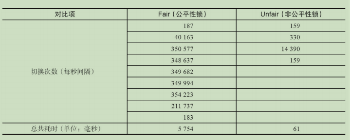

## 重入锁

重入锁ReentrantLock，顾名思义，就是支持重进入的锁，它表示该锁能支持一个线程对资源的重复加锁。除此之外，该锁的还支持获取锁时的公平和非公平性选择。

ReentrantLock虽然没有像synchronized关键字一样支持隐式的重进入，但是在调用lock()方法时，已经获取到锁的线程，能够再次调用lock()方法获取锁而不被阻塞。

事实上，公平的锁机制往往没有非公平的效率高，但是，并不时任何场景都是以TPS作为唯一的指标，公平锁能够减少“饥饿”发生的效率，等待越久的请求越是能够得到优先满足。

---

1.实现重进入

重进入是指任意线程在获取到锁之后能够再次获取该锁而不会被锁锁阻塞。该特性的实现需要解决以下两个问题。

1）**线程再次获取锁**。

2）**锁的最终释放**。

ReentrantLock是通过组合自定义同步器来实现锁的获取与释放，以非公平性（默认的）实现为例，获取同步状态的代码如代码：

```java
final boolean nonfairTryAcquire(int acquires){
    fianl Thread current = Thread.currentThread();
    int c = getState();
    if(c == 0){
        if(compareAndSetState(0,acquires)){
            setExclusiveOwnerThread(current);
            return true;
        }
    }else if(current == getExclusiveOwnerThread()){
        int nextc = c + acquires;
        if(nextc < 0){
            throw new Error("Maximum lock count exceeded");
        }
        setState(nextc);
        return true;
    }
    return false;
}
```

该方法增加了再次获取同步状态的处理逻辑：通过判断当前线程是否为获取锁的线程来决定获取操作是否成功，如果是获取锁的线程再次请求，则将同步状态进行增加并返回true，表示获取同步状态成功。

成功获取锁的线程再次获取锁，只是增加了同步状态值，这也就要求ReentrantLock在释放同步状态时减少同步状态值，该方法的代码：

```java
protected final boolean tryRelease(int releases){
    int c = getState() - releases;
    if(Thread.currentThread() != getExclusiveOwnerThread()){
        throw new IllegalMonitorStateException();
    }
    boolean free = false;
    if(c == 0){
        free = true;
        setExclusiveOwnerThread(null);
    }
    setState(c);
    return free;
}
```

如果该锁被释放了n次，那么前(n-1)次tryRelease(int releases)方法必须返回false，而只有同步状态完全释放了，才能返回true。可以看到，该方法将同步状态是否为0作为最终释放的条件，当同步状态为0时，将占有线程设置为null，并返回true，表示释放成功。

---

2.公平与非公平获取锁的区别

公平性与否是针对获取锁而言的，如果一个锁是公平的，那么锁的获取顺序就应该符合请求的绝对时间顺序，也就是FIFO。

公平性和非公平性在系统线程上下问切换方面的对比：



公平性锁保证了锁的获取按照FIFO原则，而代价是进行大量的线程切换。非公平锁虽然可能造成线程“饥饿”，但极少的线程切换，保证了其更大的吞吐量。
