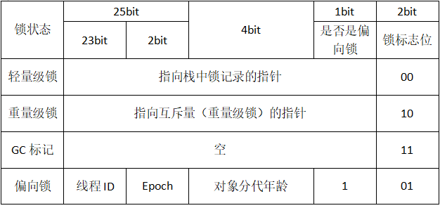
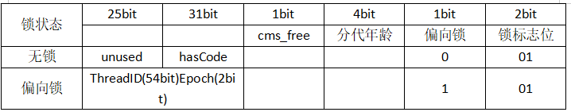

# synchronized概述

在多线程并发编程中synchronized一直是元老级角色，很多人都会称呼它为重量级锁。但是，随着Java SE 1.6对synchronized进行了各种优化之后，有些情况下它就并不那么重了。

先来看下利用synchronized实现同步的基础：Java中的每一个对象都可以作为锁。具体表现为以下3种形式：

- 对于普通同步方法，锁是当前实例对象。
- 对于静态同步方法，锁是当前类的Class对象。
- 对于同步方法块，锁是synchronized括号里配置的对象。

当一个线程试图访问同步代码块时，它首先必须得到锁，退出或抛出异常时必须释放锁。那么所到底存在哪里呢？锁里面会存储什么信息呢？

# synchronized实现原理

从JVM规范中可以看到synchronized在JVM里的实现原理，`JVM基于进入和退出Monitor对象来实现方法同步和代码块同步`，但两者的实现细节不一样。`代码块同步是使用monitorenter和monitorexit指令实现的`，而`方法同步是使用另外一种方式实现的，细节在JVM规范里并没有详细说明。但是，方法的同步同样可以使用这两个指令来实现`。

`monitorenter指令是在编译后插入到同步代码块的开始位置，而monitorexit是插入到方法结束处和异常处，JVM要保证每个monitorenter必须有对应的monitorexit与之配对`。**任何对象都有一个monitor与之关联，当且一个monitor被持有后，它将处于锁定状态**。线程执行到monitorenter指令时，将会尝试获取对象所对应的monitor的所有权，即尝试获得对象的锁。

详见：https://docs.oracle.com/javase/specs/jvms/se8/html/jvms-2.html#jvms-2.11.10

## Java对象头

synchronized用的锁是存在Java对象头里的。如果对象是数组类型，则虚拟机用3个字款（Word）存储对象头，如果对象是非数组类型，则用2字宽存储对象头。在32位虚拟机中，1字宽等于4字节，即32bit，如表所示：

| 长度     | 内容                   | 说明                             |
| -------- | ---------------------- | -------------------------------- |
| 32/64bit | Mark Word              | 存储对象的hashCode或锁信息等     |
| 32/64bit | Class Metadata Address | 存储到对象类型数据的指针         |
| 32/32bit | Array length           | 数组的长度（如果当前对象是数组） |

Java对象头里的Mark Word里默认存储对象的HashCode、分代年龄和锁标记位。32位JVM的Mark Word的默认存储结构如表所示

| 锁状态   | 25bit          | 4bit         | 1bit是否是偏向锁 | 2bit锁标志位 |
| -------- | -------------- | ------------ | ---------------- | ------------ |
| 无锁状态 | 对象的hashCode | 对象分代年龄 | 0                | 01           |

在运行期间，Mark Word里存储的数据会随着锁标志位的变化而变化。Mark Word可能变化位存储以下4种数据，如表所示：

在64位虚拟机下，Mark Word是64bit大小的，其存储结构如表所示：

# synchronized的应用

## 锁的升级与对比

Java SE 1.6为了减少获得锁和释放锁带来的性能消耗，引入了“偏向锁”和“轻量级锁”，在Java SE 1.6种，锁一共有4种状态，级别从低到高依次是：无锁状态、偏向锁状态、轻量级锁状态和重量级锁状态，这几个状态会随着竞争情况逐渐升级。锁可以升级但不能降级，意味着偏向锁升级成轻量级锁后不能降级成偏向锁。这种锁升级却不能降级的策略，目的是为了提高获得锁和释放锁的效率。

## 偏向锁

HotSpot的作者经常研究发现，大多数情况下，锁不仅不存在多线程竞争，而且总是由同一线程多次获得，为了让线程获得锁的代价更低而引入了偏向锁。当一个线程访问同步块并获取锁时，会在对象头和栈帧种的锁记录里存储锁偏向的线程ID，以后该线程在进入和退出同步块时不需要进行CAS操作来加锁和解锁，只需简单地测试下对象头的Mark Word里是否存储着指向当前线程的偏向锁。如果测试成功，表示线程已经获得了锁。如果测试失败，则需要再测试一下Mark Word中偏向锁的标识是否设置成1（表示当前是偏向锁）；如果没有设置，则使用CAS竞争锁；如果设置了，则尝试使用CAS将对象头的偏向锁指向当前线程。

## 锁的优缺点对比

| 锁       | 优点                                                         | 缺点                                           | 适用场景                         |
| -------- | ------------------------------------------------------------ | ---------------------------------------------- | -------------------------------- |
| 偏向锁   | 加锁和解锁不需要额外的消耗，和执行非同步方法相比仅存在纳秒级的差距 | 如果线程间存在锁竞争，会带来额外的锁撤销的消耗 | 适用于只有一个线程访问同步块场景 |
| 轻量级锁 | 竞争的线程不会阻塞，提高了程序的响应速度                     | 如果始终得不到锁竞争的线程，使用自旋会消耗CPU  | 追求响应时间同步块执行速度非常快 |
| 重量级锁 | 线程竞争不使用自旋，不会消耗CPU                              | 线程阻塞，响应时间缓慢                         | 追求吞吐量同步块执行速度较长     |
