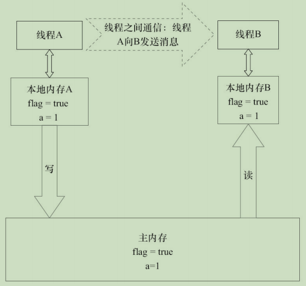
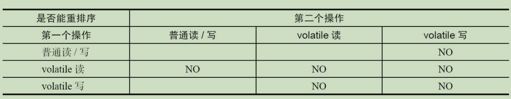
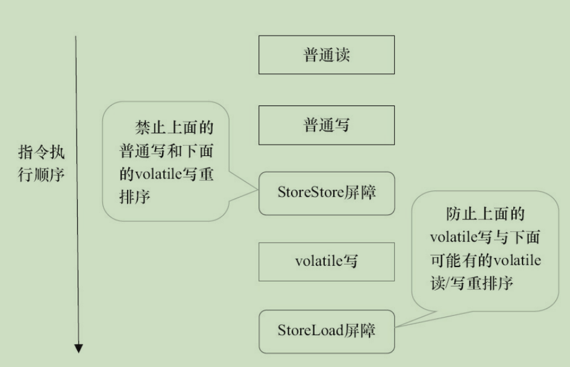
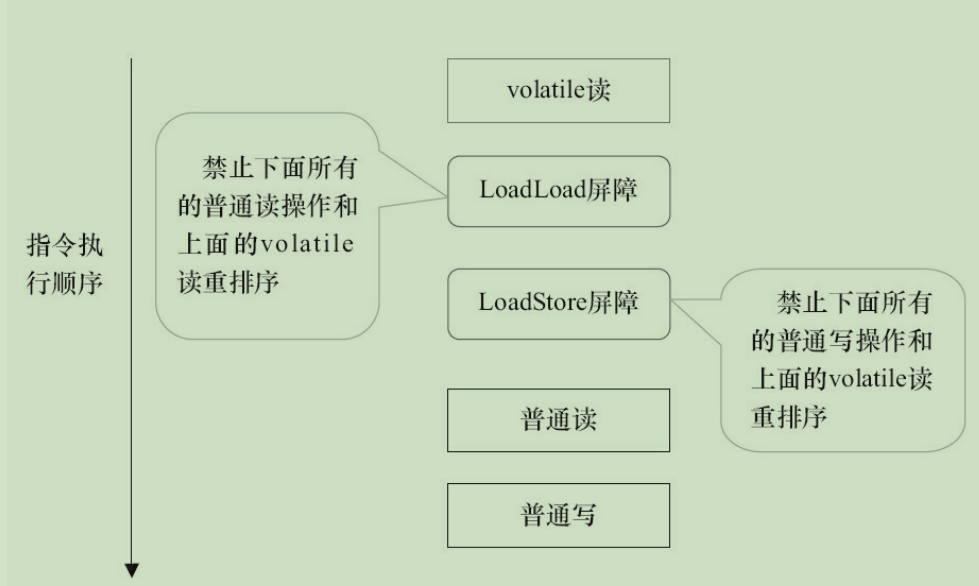

# volatile的内存语义

## volatile的特性

理解volatile特性的一个好方法是把对volatile变量的单个读/写，堪称是使用同一个锁对这些单个读/写操作做了同步。

锁的happens-before规则保证释放锁和获取锁的两个线程之间的内存可见性，这意味着对一个volatile变量的读，总是能看到（任意线程）对这个volatile变量最后的写入。

锁的语义决定了临界区代码的执行具有原子性。即使是64位的long型和double型变量，只要它是volatile变量，对该变量的读/写就具有原子性。如果是多个volatile操作或类似于volatile++这种复合操作，这些操作整体上不具有原子性。

volatile变量自身具有下列特性。

- 可见性。对一个volatile变量的读，总是能看到（任意线程）对这个volatile变量最后的写入。
- 原子性：对任意单个volatile变量的读/写具有原子性，但类似于volatile++这种复合操作不具有原子性。

## volatile写-读的内存语义

volatile写的内存语义如下。

**当写一个volatile变量时，JMM会把该线程对应的本地内存中的共享变量值刷新到主内存。**

volatile读的内存语义如下。

**当读一个volatile变量时，JMM会把该线程对应的本地内存置为无效。线程接下来将从主内存中读取共享变量。**

对volatile写和volatile读的内存语义做个总结。

- 线程A写一个volatile变量，实质上是线程A向接下来将要读这个volatile变量的某个线程发出了（其对共享变量所做修改的）消息。
- 线程B读一个volatile变量，实质上是线程B接受了之前某个线程发出的（在写这个volatile变量之前对共享变量所做的修改的）消息。
- 线程A写一个volatile变量，随后线程B读这个volatile变量，这个过程实质上是线程A通过主内存线程B发送消息。

## volatile内存语义的实现

volatile重排序规则表

从表中我们可以看出。

- 当第二个操作是volatile写时，不管第一个操作是什么，都不能重排序。
- 当第一个操作是volatile读时，不管第二个操作是什么，都不能重排序。
- 当第一个操作是volatile写，第二个操作是volatile读时，不能重排序。

保守策略下，volatile写插入内存屏障后生成的指令序列示意图：

在保守策略下，volatile读插入内存屏障后生成的指令序列示意图：

## JSR-133为什么要增强volatile的内存语义

严格限制编译器和处理器对volatile变量与普通变量的重排序，确保volatile的写-读和锁的释放-获取具有相同的内存语义。

在功能上，锁比volatile更强大；在可伸缩性和执行性能上，volatile更加优势。
