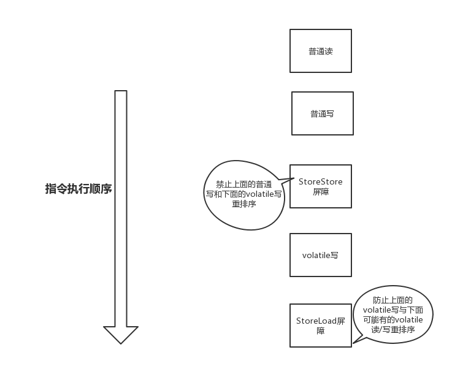
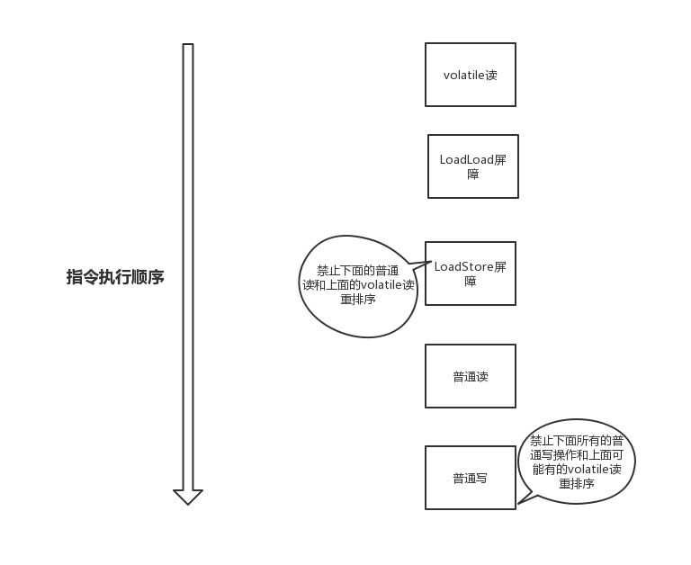

# volatile的内存语义

## volatile的特性

理解volatile特性的一个好方法是把对volatile变量的单个读/写，堪称是使用同一个锁对这些单个读/写操作做了同步。

锁的happens-before规则保证释放锁和获取锁的两个线程之间的内存可见性，这意味着对一个volatile变量的读，总是能看到（任意线程）对这个volatile变量最后的写入。

锁的语义决定了临界区代码的执行具有原子性。即使是64位的long型和double型变量，只要它是volatile变量，对该变量的读/写就具有原子性。如果是多个volatile操作或类似于volatile++这种复合操作，这些操作整体上不具有原子性。

volatile变量自身具有下列特性。

- 可见性。对一个volatile变量的读，总是能看到（任意线程）对这个volatile变量最后的写入。
- 原子性：对任意单个volatile变量的读/写具有原子性，但类似于volatile++这种复合操作不具有原子性。

## volatile写-读的内存语义

volatile写的内存语义如下。

**当写一个volatile变量时，JMM会把该线程对应的本地内存中的共享变量值刷新到主内存。**

volatile读的内存语义如下。

**当读一个volatile变量时，JMM会把该线程对应的本地内存置为无效。线程接下来将从主内存中读取共享变量。**

对volatile写和volatile读的内存语义做个总结。

- 线程A写一个volatile变量，实质上是线程A向接下来将要读这个volatile变量的某个线程发出了（其对共享变量所做修改的）消息。
- 线程B读一个volatile变量，实质上是线程B接受了之前某个线程发出的（在写这个volatile变量之前对共享变量所做的修改的）消息。
- 线程A写一个volatile变量，随后线程B读这个volatile变量，这个过程实质上是线程A通过主内存线程B发送消息。


## volatile内存语义的实现

volatile重排序规则表


从表中我们可以看出。

- 当第二个操作是volatile写时，不管第一个操作是什么，都不能重排序。
- 当第一个操作是volatile读时，不管第二个操作是什么，都不能重排序。
- 当第一个操作是volatile写，第二个操作是volatile读时，不能重排序。

保守策略下，volatile写插入内存屏障后生成的指令序列示意图：



在保守策略下，volatile读插入内存屏障后生成的指令序列示意图：



## JSR-133为什么要增强volatile的内存语义

严格限制编译器和处理器对volatile变量与普通变量的重排序，确保volatile的写-读和锁的释放-获取具有相同的内存语义。

在功能上，锁比volatile更强大；在可伸缩性和执行性能上，volatile更加优势。

转载自[并发编程网 – ifeve.com](http://ifeve.com/)**参考链接地址:** [JSR133中文版](http://ifeve.com/jsr133-cn/)

# 参考资料

- [Java并发编程的艺术](https://book.douban.com/subject/26591326/)

# volatile的应用

在多线程并发编程中synchronized和volatile都扮演着重要的角色，volatile是轻量级的synchronized，它在多处理器开发中保证了共享变量的“可见性”。可见性的意思是当一个线程修改一个共享变量时，另外一个线程能读到这个修改的值。如果volatile变量修饰符使用恰当的话，它比synchronized的使用和执行成本更低，因为它不会引起线程上下文的切换和调度。

## 1.volatile的定义与实现原理

Java语言规范第3版中对volatile的定义如下：Java编程语言允许线程访问共享变量，为了确保共享变量能被准确和一致地更新，线程应该确保通过排他锁单独获得这个变量。Java语言提供了volatile，在某些情况下比锁要更加方便。如果一个字段被声明成volatile，Java线程内存模型确保所有线程看到这个变量的值是一致的。

在了解volatile实现原理之前，我们先来看下与其实现原理相关的CPU术语与说明。

| 术语       | 英文单词               | 术语描述                                                     |
| ---------- | ---------------------- | ------------------------------------------------------------ |
| 内存屏障   | memory barriers        | 是一组处理器指令，用于实现对内存操作的顺序限制               |
| 缓冲行     | cache line             | 缓存中可以分配的最小存储单位。处理器填写缓存线时会加载整个缓存线，需要使用多个主内存读周期 |
| 原子操作   | atomic operations      | 不可中断的一个或一系列操作                                   |
| 缓冲行填充 | cache line fill        | 当处理器识别到从内存中读取操作数是可缓存的，处理器读取整个缓存行到适当的缓存（L1，L2，L3的或所有） |
| 缓存命中   | cache hit              | 如果进行告诉缓存行填充操作的内存位置仍然是下次处理器访问的地址时，处理器从缓存中读取操作数，而不是从内存读取 |
| 写命中     | write hit              | 当处理器将操作数写回到一个内存缓存的区域时，它首先会检查这个缓存的内存地址是否在缓存行中，如果存在一个有效的缓存行，则处理器将这个操作数写回到缓存，而不是写回到内存，这个操作被称为写命中 |
| 写缺失     | write misses the cache | 一个有效的缓存行被写入到不存在的内存区域                     |


volatile是如何来保证可见性的呢？让我们在X86处理器下通过工具获取JIT编译器生成的汇编指令来查看对volatile进行写操作时，CPU会做什么事情。

Java代码如下：

> instance = new Singleton(); //instance是volatile变量

转变成汇编代码，如下：

> 0x01a3de1d: movb $0x0,0x1104800(%esi);
>
> oxo1a3de24: lock add1 $0x0,(%esp);

有volatile变量修饰的共享变量进行写操作的时候会多出第二行汇编代码，通过查IA-32架构软件开发者手册可知，Lock前缀的指令在多核处理器下会引发了两件事情。

1) 将当前处理器缓存行的数据写回到系统内存。

2) 这个写回内存的操作会使在其他CPU里缓存了该内存地址的数据无效。

为了提高处理速度，处理器不直接和内存进行通信，而是先将系统内存的数据读到内存缓存（L1，L2或其他）后再进行操作，但操作完不知道何时会写到内存。如果对声明了volatile的变量进行写操作，JVM就会向处理器发送一条Lock前缀的指令，将这个变量所在缓存行的数据写回到系统内存。但是就算写回到内存，如果其他处理器缓存的值还是旧的，再执行计算操作就会有问题。所以，在多处理器下，为了保证各个处理器的缓存是一致的，就会实现缓存一致性协议，每个处理器通过嗅探在总线上传播的数据来检查自己缓存的值是不是过期了，当处理器发现自己缓存行对应的内存地址被修改，就会将当前处理器的缓存行设置成无效状态，当处理器对这个数据进行修改操作的时候，会重新从系统内存中把数据读到处理器缓存里。

下面来具体讲解volatile的两条实现原则。

1) **Lock前缀指令会引起处理器缓存回写到内存**。Lock前缀指令导致在执行指令期间，声名处理器的LOCK#信号。在多处理器环境中，LOCK#信号确保在声名该信号期间，处理器可以独占任何共享内存。但是，在最近的处理器里，LOCK#信号一般不锁总线，而是锁缓存，毕竟锁总线开销的比较大。对于Intel486和Pentium处理器，在锁操作时，总是在总线上声明LOCK#信号。但在P6和目前的处理器中，如果访问的内存区域已经缓存在处理器内部，则不会声明LOCK#信号。相反，它会锁定这块内存区域的缓存并会写到内存，并使用缓存一致性机制来确保修改的原子性，此操作被称为“缓存锁定”，缓存一致性机制会阻止同时修改由两个以上处理器缓存的内存区域数据。

2) **一个处理器的缓存回写到内存会导致其他处理器的缓存无效**。IA-32处理器和inter 64处理器使用MESI（修改、独占、共享、无效）控制协议去维护内部缓存和其他处理器缓存的一致性。在多核处理器系统中进行操作的时候，IA-32和inter 64处理器能嗅探其他处理器访问系统内存和它们的内部缓存。处理器使用嗅探技术保证它的内部缓存、系统内存和其他处理器的缓存的数据在总线上保持一致。例如，在Pentium和P6 family处理器中，如果通过嗅探一个处理器来检测其他处理器打算写内存地址，而这个地址当前处于共享状态，那么正在嗅探的处理器将使它的缓存行无效，在下次访问相同内存地址时，强制执行缓存行填充。

## 2.volatile的使用优化

著名的Java并发编程大师Dourg Lea在JDK7的并发包里新增一个队列集合类LinkedTransferQueue，它在使用volatile变量时，用一种追加字节的方式来优化队列出队和入队的性能。LinkedTransferQueue的代码如下

```java
//队列中的头部节点
private transient final PaddedAtomicReference<QNode> head;
//队列中的尾部节点
private transient final PaddedAtomicReferfence<QNode> tail;
static final class PaddedAtomicReference<T> extends AtomicReference {
    //使用很多4个字节的引用追加64个字节
    Object p0,p1,p2,p3,p4,p5,p6,p7,p8,p9,pa,pb,pc,pd,pe;
    PaddedAtomicReference(T r){
        super(r);
    }
}
public class AtomicReference <V> implements java.io.Serializable{
    private volatile V value;
    //省略其他代码
}
```

**追加字节能优化性能**？这种方式看起来很神奇，但如果深入理解处理器架构就能理解其中的奥秘。让我们先来看看LinkedTransferQueue这个类，它使用一个内部类类型来定义队列的头节点（head）和尾节点（tail），而这个内部类PaddedAtomicReference相对于父类AtomicReference只做了一件事情，就是将共享变量追加到64字节。我们可以来计算下，一个对象的引用占4个字节，它追加了15个变量（共占60个字节），再加上父类的value变量，一个64个字节。

**为什么追加64字节能够提高并发编程的效率呢**？因为对于英特尔酷睿i7、酷睿、Atom和NetBurst，以及Core Solo和Pentium M处理器的L1、L2或L3缓存的高速缓存行是64个字节宽，不支持部分填充缓存行，这意味着，如果队列的头节点和尾节点都不足64字节的话，处理器会将它们都读到同一个高速缓存行中，在多处理器下每个处理器都会缓存同样的头、尾节点，当一个处理器试图修改头节点时，会将整个缓存行锁定，那么在缓存一致性机制的作用下，会导致其他处理器不能访问自己高速缓存中的尾节点，而队列的入队和出队操作则需要不停修改头节点和尾节点，所以在多处理器的情况下将会严重影响到队列的入队和出队效率。Douglea使用追加到64字节的方式来填满高速缓冲区的缓存行，避免头节点和尾节点加载到同一个缓存行，使头、尾节点在修改时不会互相锁定。

**那么是不是在使用volatile变量时都应该追加到64字节呢**？不是的。在两种场景下不应该使用这种方式：

1. **缓存行非64字节宽的处理器**。如P6系列和奔腾处理器，它们的L1和L2告诉缓存行是32个字节宽。
2. **共享变量不会被频繁地写**。因为使用追加字节地方式需要处理器读取更多的字节到高速缓冲区，这本身就会带来一定的性能消耗，如果共享变量不被频繁写的话，锁的几率也非常小，就没必要通过追加字节的方式来避免相互锁定。