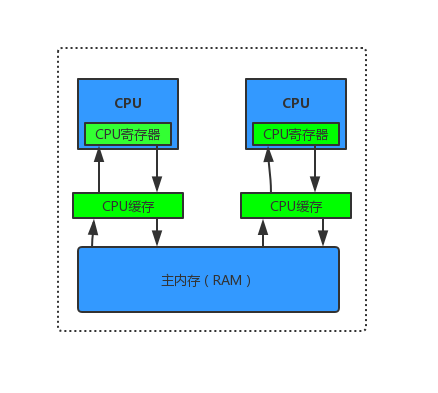
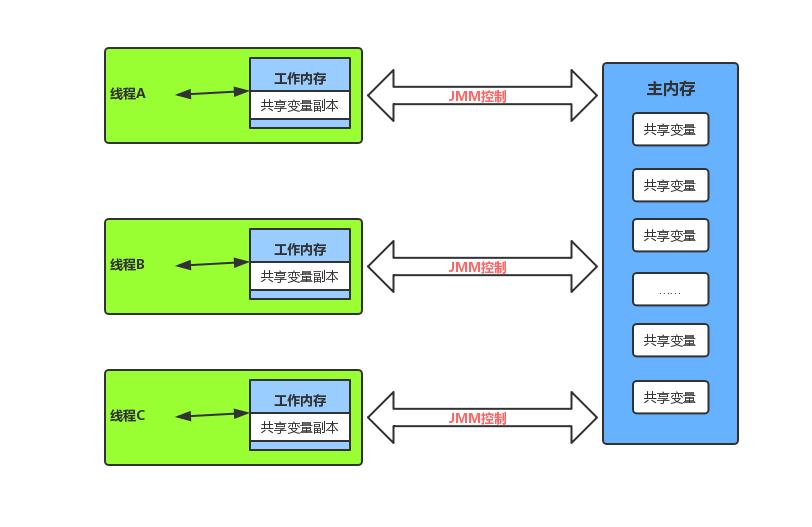
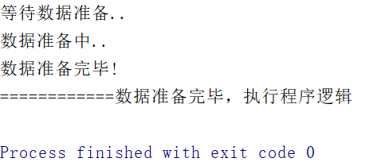
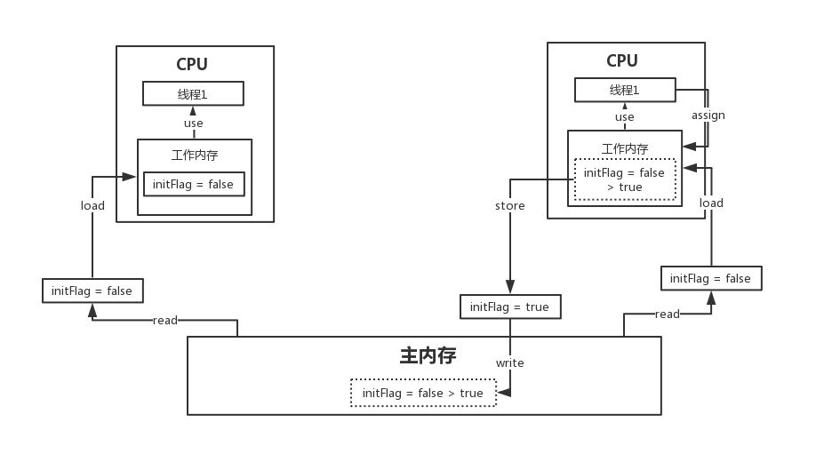
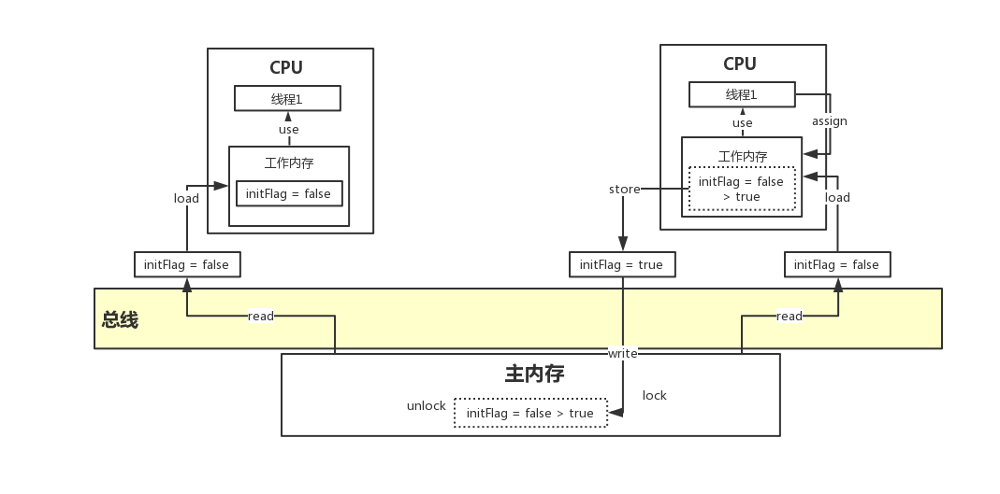
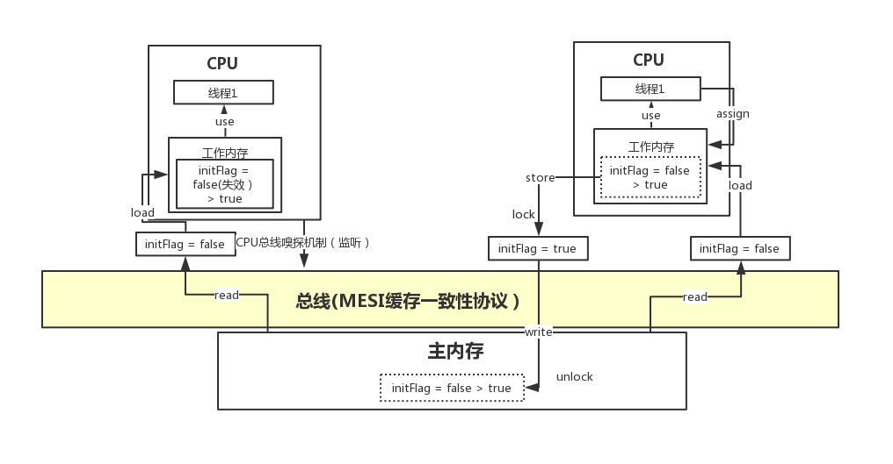
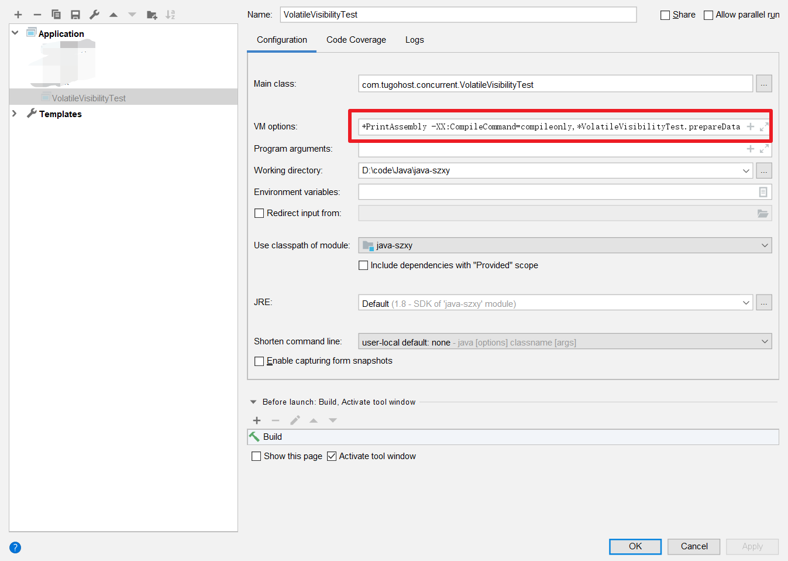

# 深入理解Java内存模型JMM与volatile关键字

# 多核并发缓存架构



# Java内存模型

Java线程内存模型跟CPU缓存模型类似，是基于CPU缓存模型来建立的，Java线程内存模型是标准化的，屏蔽掉了底层不同计算机的区别。



# 例子

编写代码来分析

```java
public class VolatileVisibilityTest {
    private static boolean initFlag = false;

    public static void main(String[] args) throws InterruptedException {
        new Thread(new Runnable() {
            @Override
            public void run() {
                System.out.println("等待数据准备..");
                while (!initFlag){

                }
                System.out.println("============数据准备完毕，执行程序逻辑");
            }
        }).start();
        Thread.sleep(2000);
        
        new Thread(new Runnable() {
            @Override
            public void run() {
                prepareData();
            }
        }).start();
    }

    public static void prepareData(){
        System.out.println("数据准备中..");
        initFlag = true;
        System.out.println("数据准备完毕!");
    }
}
```

执行程序，打印结果


并未出现

> ============数据准备完毕，执行程序逻辑

这段结果

### 分析

第一个线程给了initFlag为false，第二个执行了prepareData()所以initFlag为true，但是第一个线程中的flag还是为false。

如果给initFlag加个`volatile`关键字：

```java
public class VolatileVisibilityTest {
    private static volatile boolean initFlag = false;

    public static void main(String[] args) throws InterruptedException {
        new Thread(new Runnable() {
            @Override
            public void run() {
                System.out.println("等待数据准备..");
                while (!initFlag){

                }
                System.out.println("============数据准备完毕，执行程序逻辑");
            }
        }).start();
        Thread.sleep(2000);

        new Thread(new Runnable() {
            @Override
            public void run() {
                prepareData();
            }
        }).start();
    }
    public static void prepareData(){
        System.out.println("数据准备中..");
        initFlag = true;
        System.out.println("数据准备完毕!");
    }
}

```

执行程序，返回结果



# JMM数据原子操作

- read（读取）：从主内存读取数据
- load（载入）：将主内存读取到的数据写入工作内存
- use（使用）：从工作内存读取数据来计算
- assign（赋值）：将计算好的值重新赋值到工作内存中
- strore（存储）：将工作内存数据写入主内存
- write（写入）：将store过去的变量值赋值给主内存中的变量
- lock（锁定）：将主内存变量枷锁，表示为线程独占状态
- unlock（解锁）：将主内存变量解锁，解锁后其他线程可以锁定该变量

整个过程如下



# JMM缓存不一致问题

- **总线枷锁（性能太低）**

  - CPU从主内存读取数据到高速缓存，会在总线对这个数据加锁，这样其他CPU没法去读或写这个数据，直到这个CPU使用完整数据释放锁之后其他CPU才能读取该数据。

  

- MESI缓存一致性协议

  - 多个CPU从主内存读取同一个数据到各自的高速缓存，当其中某个CPU修改了缓存里的数据，该数据会马上同步回主内存，其他CPU通过`总线嗅探机制`可以感知到数据的变化从而将自己缓存里的数据失效。

  

# Volatile可见性底层实现原理

- Volatile缓存可见性实现原理

  - 底层实现主要是通过汇编lock前缀指令，它会锁定这块内存区域的缓存并回写到主内存，此操作被称为“缓存锁定”，MESI缓存一致性协议机制会阻止同时修改被两个以上处理器缓存的内存区域数据。一个处理器的缓存值通过总线回写到内存会导致其他处理器响应的缓存失效。

  Java程序汇编代码查看

  - -server -Xcomp -XX:+UnlockDiagnosticVMOptions -XX:+PrintAssembly -XX:CompileCommand=compileonly,*VolatileVisibilityTest.prepareData
  - 需要先下载hsdis-amd64

  

  IDEA这样设置

  显式出的结果，其中volatile修饰的汇编代码如下：

  > 0x000000000349eaff: `lock` add dword ptr [rsp],0h  ;*putstatic initFlag
  >                                                 ; - com.tugohost.concurrent.VolatileVisibilityTest::prepareData@9 (line 31)

   

# 可见性、原子性与有序性

- 并发编程三大特性：可见性，原子性，有序性
- Volatile保证可见性与有序性，但是不保证原子性，保证原子性需要借助synchronized这样的锁机制。

