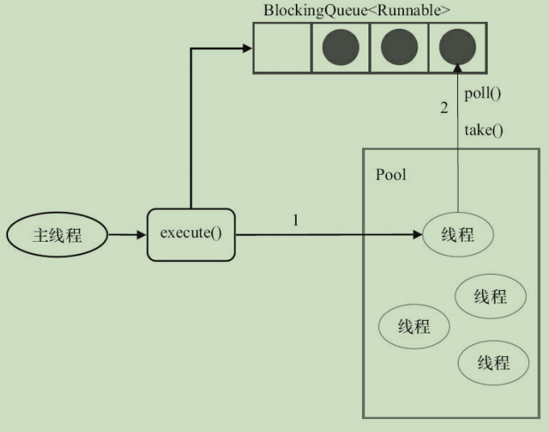

在开发过程中，合理地使用线程池能够带来3个好处。

第一：降低资源消耗。通过重复利用已创建的线程降低线程创建和销毁造成的销毁。

第二：提高响应速度。当任务到达时，任务可以不需要等到线程床架你就能立即执行。

第三：提高线程的可管理性，线程是稀缺资源，如果无限地创建，不仅会消耗系统资源，还会降级系统的五年提醒，使用线程池可以进行统一分配、调优和监控。

# 线程池的实现原理

当向线程池提交一个任务之后，线程池是如何处理这个任务的呢？线程池的主要处理流程图如下：


从图中可以看出，当提交一个新任务到线程池时，线程池的处理流程如下。

1）线程池判断核心线程池里的线程是否都在执行任务。如果不是，则创建一个新的工作线程来执行工作。如果核心线程池里的线程都在执行任务，则进入下个流程。

2）线程池判断工作队列是否已经满。如果工作队列没有满，则将新提交的任务存储在这个工作队列里。如果工作队列满了，则进入下个流程。

3）线程池判断线程池的线程是否都处于工作状态。如果没有，则创建一个新的工作线程来执行任务。如果已经满了，则交给包和策略来处理这个任务。

ThreadPoolExecutor执行executer()方法的示意图，如图所示：


1)如果当前运行的线程少于corePoolSize，则创建新线程来执行任务（注意，执行这一步骤需要获取全局锁）。

2）如果运行的线程等于或多于corePoolSize，则将任务加入BlockingQueue。

3）如果无法将任务加入BlockingQueue（队列已满），则创建新的线程来处理任务（注意，执行这一步骤需要获取全局锁）。

4）如果创建新线程将使用当前运行的线程超出maximumPoolSize，任务将被拒绝，并调用RejectedExceutionHandler.rejectedExecution()方法。

ThreadPoolExecutor采取上述步骤的总体设计思路，是为了在执行execute()方法时，尽可能地避免获取全局锁（那将会是一个严重的可伸缩瓶颈）。在ThreadPoolExecutor完成预热之后（当前运行的线程数大于等于corePoolSize），几乎所有的execute()方法调用都是执行步后2，而步骤2不需要获取全局锁。

> 源码分析：上面的流程分析让我们很直观地了解了线程池的工作原理，让我们再通过源代码来看看是如何实现的，线程池执行任务的方法如下。

```java
public void execute(Runnable command){
    if(command == null){
        throw new NullPointerException();
    }
    //如果线程数小于基本线程数，则创建线程并执行当前任务
    if(poolSize >= corePoolSize || !addIfUnderCorePoolSize(command)){
        //如果线程数大于等于基本线程数或线程创建失败，则将当前任务放到工作队列中。
        if(runState == RUNNING && workQueue.offer(command)){
            if(runState != RUNNING || poolSize == 0){
                ensureQueueTaskHandled(command);
            }
        }
        //如果线程池不处于运行中或任务无法放入队列，并且当前线程数量小于最大允许的线程数量，
        //则创建一个线程执行任务。
        else if(!addIfUnderCoreMaximumPoolSize(command)){
            //抛出RejectedExecutionException异常
            reject(command); //is shutdown or saturated
        }
    }
}
```

> 工作流程：线程池创建线程时，会将线程封装成工作线程Worker，Worker在执行完任务后，还会循环获取工作队列里的任务来执行。我们可以从Worker类的run()方法里看到这点。

```java
public void run(){
    try{
        Runnable task = firstTask;
        firstTask = null;
        while(task != null || (task = getTask()) != null){
            runTask(task);
            task = null;
        }
    }finally{
        workerDone(this);
    }
}
```

ThreadPoolExecutor中线程执行任务的示意图如下：




线程池中的线程执行任务分两种情况，如下：

1）在execute()方法中创建一个线程时，会让这个线程执行当前任务。

2）这个线程执行完上图中的1的任务后，会反复从BlockingQueue获取任务来执行。

# 线程池的使用

### 线程池的创建

我们可以通过ThreadPoolExecutor来创建一个线程池。

> new ThreadPoolExecutor(corePoolSize,maxmumPoolSize,keepAliveTime,millseconds,runnableTaskQueue,handler);

创建一个线程池时需要输入几个参数，如下：

1. corePoolSize（线程池的基本大小）：当提交一个任务到线程池时，线程池会创建一个线程来执行任务，即使其他空闲的基本线程能够执行新任务也会创建线程，等到需要执行的任务数大于线程池基本大小时就不再创建。

2. runnableTaskQueue（任务队列）：用于保存等待执行的任务的阻塞队列。

   - ArrayBlockingQueue：是一个基于数组结构的有界阻塞队列，此队列按FIFO原则对元素进行排序。
   - LinkedBlockingQueue：一个基于链表结构的阻塞队列，此队列按FIFO排序元素，吞吐量通常要高于runnableTaskQueue。
   - SynchronousQueue：一个不存储元素的阻塞队列。
   - PriorityBlockingQueue：一个具有优先级的无限阻塞队列。

3. maxmumPoolSize（线程池最大数量）：线程池允许创建的最大线程数。

4. ThreadFactory：用于设置创建线程的工厂，可以通过线程工厂给每个创建出来的线程设置更有意义的名字。

5. RejectedExecutionHandler（饱和策略）：当队列和线程池都满了，说明线程池处于包和状态，那么必须采取一种策略处理提交的新任务。

   - AbortPolicy：直接抛出异常。
   - CallerRunsPolicy：只用调用者所在线程来运行任务。
   - DiscardOldestPolicy：丢弃队列里最近的一个任务，并执行当前任务。
   - DiscardPolicy：不处理，丢弃掉。

   当然，也可以根据引用场景需要来实现RejectedExecutionHandler接口自定义策略。

   - keepAliveTime（线程活动保持时间）：线程池的工作线程空闲后，保持存活的时间。
   - TimeUnit（线程活动保持时间的单位）：可选的单位有天（DAYS）、小时（HOURS）、分钟（MINUTES）、毫秒（MILLISECONDS）、微秒（MICROSECONDS，千分之一毫秒）和纳秒（NANOSECONDS，千分之一微秒）。

### 向线程池提交任务

可以使用两个方法向线程池提交任务，分别为execute()和submit()方法。

execute()方法用于提交不需要返回值的任务，所以无法判断任务是否被线程池执行成功。

```java
treadsPool.execute(new Runnable(){
    @Override
    public void run(){
        //TODO
    }
});
```

submit()方法用于提交需要返回值的任务。

```java
Future<Object> future = executor.submit(harReturnValuetask);
try{
   Object s = future.get();
}catch(InterruptedException e){
    //处理中断异常
}catch(ExecutionException e){
    //处理无法执行任务异常
}finally{
    //关闭线程池
    executor.shutdown();
}
```

### 关闭线程池

可以通过调用线程池的shuntdown或shutdownNow方法来关闭线程池。它们的原理是遍历线程池中的工作线程，然后逐个调用线程的interrupt方法来中断线程，所以无法响应中断的任务可能永远无法终止。但是它们存在一定的区别，shutdownNow首先将线程池的状态设置成STOP，然后尝试停止所有的正在执行或暂停任务的线程，并返回等待执行任务的列表，而shutdown只是将线程池的状态设置成SHUTDOWN状态，然后中断所有没有正在执行人物的线程。