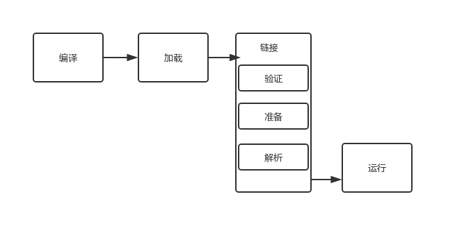
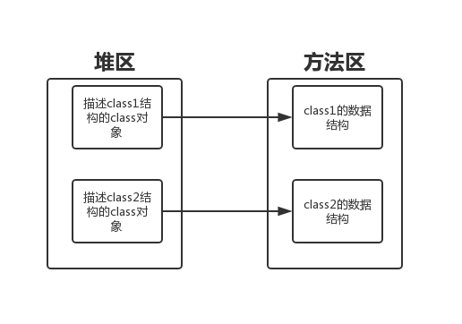

# 前言
由于本人参加面试，但是JVM这块回答的十分不好，问了面试官，面试官说我基础不行！我真的不行，所以看过的不一定能理解，感觉之前就是糊弄任务，然后这次等实训结束，啥都干完了，我就记录下，深入了解下面试中不会的题。

# 类加载过程
1、**加载**：这个很简单，程序运行之前jvm会把编译完成的.class二进制文件加载到内存，供程序使用，用到的就是类加载器classLoader ，这里也可以看出java程序的运行并不是直接依   靠底层的操作系统，而是基于jvm虚拟机。如果没有类加载器，java文件就只是磁盘中的一个普通文件。

2、**连接**：连接是很重要的一步，过程比较复杂，分为三步  验证  》准备  》解析  　　

　　验证：确保类加载的正确性。一般情况由javac编译的class文件是不会有问题的，但是可能有人的class文件是自己通过其他方式编译出来的，这就很有可能不符合jvm的编 译规则，这一步就是要过滤掉这部分不合法文件　

　　准备：为类的静态变量分配内存，将其初始化为默认值 。我们都知道静态变量是可以不用我们手动赋值的，它自然会有一个初始值 比如int 类型的初始值就是0 ；boolean类型初始值为false，引用类型的初始值为null 。 这里注意，只是为静态变量分配内存，此时是没有对象实例的　

　　解析：把类中的符号引用转化为直接引用。解释一下符号引用和直接引用。比如在方法A中使用方法B，A（）{B（）；}，这里的B（）就是符号引用，初学java时我们都是知道这是java的引用，以为B指向B方法的内存地址，但是这是不完整的，这里的B只是一个符号引用，它对于方法的调用没有太多的实际意义，可以这么认为，他就是给程序员看的一个标志，让程序员知道，这个方法可以这么调用，但是B方法实际调用时是通过一个指针指向B方法的内存地址，这个指针才是真正负责方法调用，他就是直接引用。

3、**初始化**：为类的静态变量赋予正确的初始值，上述的准备阶段为静态变量赋予的是虚拟机默认的初始值，此处赋予的才是程序编写者为变量分配的真正的初始值

# 创建对象时的内存分配情况
类加载到底是什么呢？其实类加载不过就是居民虚拟机为类分配了几块内存空间，说的具体一点，就是jvm虚拟机将类的.class文件加载到内存，并将它放到运行时数据区的方法区内，然后在堆区创建一个java.lang.Class对象，用来封装类在方法区内的数据结构

这里可能很多人不知道什么是运行时方法区。我们简单了解一下jvm虚拟机的内存管理

Java虚拟机在执行Java程序的过程中会把它所管理的内存划分为若干个不同的数据区域。这些区域都有各自的用途，以及创建和销毁的时间，有的区域随着虚拟机进程的启动而存在，有些区域则依赖用户线程的启动和结束而建立和销毁。java虚拟机所管理的内存将会包括以下几个运行时数据区域

很多区域的作用大家可能都不知道，这里也不多做解释，我们只需要知道 其中的两个

方法区：用于存储已被虚拟机加载的类信息、常量、静态变量、即时编译器编译后的代码等数据

堆区：存放对象实例，几乎所有的对象实例都在这里分配内存

也就是说，类被加载后，方法区会被分出一块内存，存储这个类的所有信息，但是这个内存块存储的依然是.class文件，并不能被我们使用，我们还需要一个能被直接使用的对象，此时堆区就开始发挥作用。类的信息被存储在方法区后，jvm虚拟机又会在堆区创建一个java.lang.Class对象，这个对象就好像方法区对应类的一个镜子，把方法区存储的类的结构全部反射过来，然后封装起来，成为了一个Class类的对象（此处运用到反射知识）。这个Class对象与对应的类是一对一服务，因为他有类的结构信息，所以他自然可以构造出一个类的对象。我们平时使用的对象就是由这个Class类的对象生成。到此，类的加载已经完成，但是此时依旧没有我们需要使用的对象产生（这里比较绕，说的比较啰嗦）

来个总结
- 类的加载的最终产品是位于堆区中的Class 对象
- Class对象封装了类在方法区内的数据结构，并且向Java程序员提供了访问方法区内的数据结构的接口

# class文件结构

# 元数据区和永久代的关系
