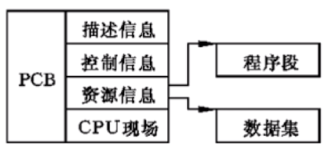
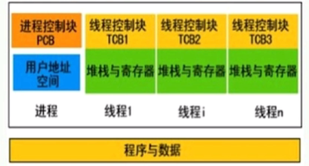
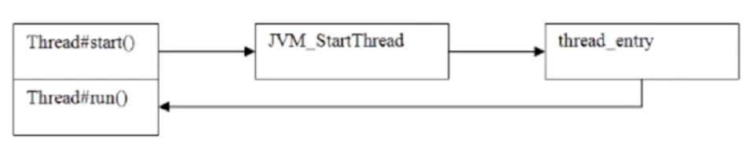

# Java内存模型（JMM）
## 进程和线程的区别
** 进程是资源分配的最小单位，线程是CPU调度的最小单位 **
- 所有与进程相关的资源，都被记录在PCB中

- 进程是抢占处理机的调度单位；线程属于某个进程，共享其资源
- 线程只由堆栈寄存器、程序计数器和TCB组成

### 总结
- 线程不能看作独立应用，而进程可看作独立应用
- 进程有独立的地址空间，相互不影响，线程只是进程的不同执行路径
- 线程没有独立的地址空间，多进程的程序比多线程的程序健壮
- 进程的切换比线程的切换开销大
### Java进程和线程的关系
- Java对操作系统提供的功能进行封装，包括进程和线程
- 运行一个程序会产生一个进程，进程包含至少一个线程
- 每个进程对应一个JVM实例，多个线程共享JVM里的堆
- Java采用单线程编程模型，程序会自动创建主线程
- 主线程可以创建子线程，原则上要后于子线程完成执行
## Thread中的start和run方法的区别

- 调用start()方法会创建一个新的子线程并启动
- run()方法只是Thread的一个普通方法的调用
## Thread和Runnable
- Thread是实现了Runnable接口的类，使得run支持多线程
- 因类的单一继承原则，推荐多使用Runnable接口
## 线程的状态
- 新建(New)：创建后未启动的线程状态
- 运行(Runnable)：包含Runnable和Ready
- 无限期等待(Waiting)：不会被分配CPU执行时间，需要显式被唤醒
- 限期等待(Timeed Waiting)：在一定时间后会由系统自动唤醒
- 阻塞(Blocked)：等待获取排它锁
- 结束(Terminated)：已终止线程的状态，线程已经结束执行
## sleep和wait的区别
- sleep是Thread类的方法，wait是Object类中定义的方法
- sleep()方法可以在任何地方使用
- wait()方法只能在synchronizated方法活synchronizated块中使用
### 最本质的区别
- Thread.sleep只会让出CPU，不会导致锁行为的改变
- Object.wait不仅让出CPU，还会释放已经占有的同步资源锁
## notify和notifyAll的区别
- notifyAll会让所有处于等待池的线程全部进入锁池去竞争获取锁的机会
- notify只会随机选取一个处于等待池中的线程进入锁池去竞争获取锁的机会
## 如何中断线程
已经抛弃的方法：
- 通过调用stop()方法停止线程
- 通过调用suspend()和resume()方法
目前使用的方法：
- 调用interrupt(),通知线程应该中断了
 1. 如果线程处于被阻塞状态，那么线程将立即退出被阻塞状态，并抛出一个InterruptedException异常
 2. 如果线程处于正常活动状态，那么会将该线程的中断标志设置为true。被设置中断标志的线程将继续正常运行，不受影响
## synchronized
### 互斥锁的特性

## happens-before

# 参考资料
- 方腾飞 魏鹏 程晓明. Java并发编程的艺术 [M]. 机械工业出版社, 2015.