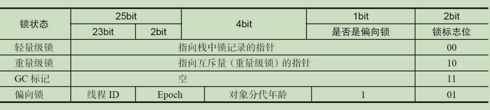
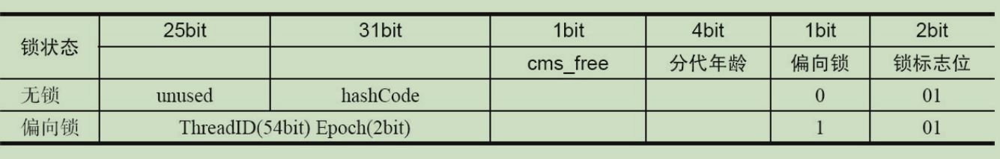
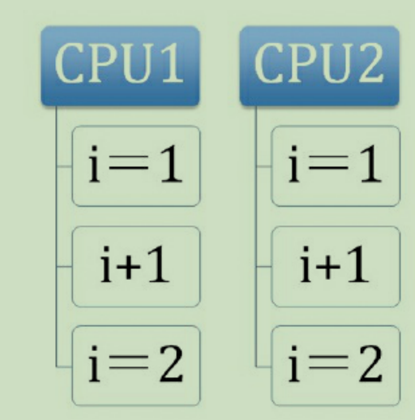
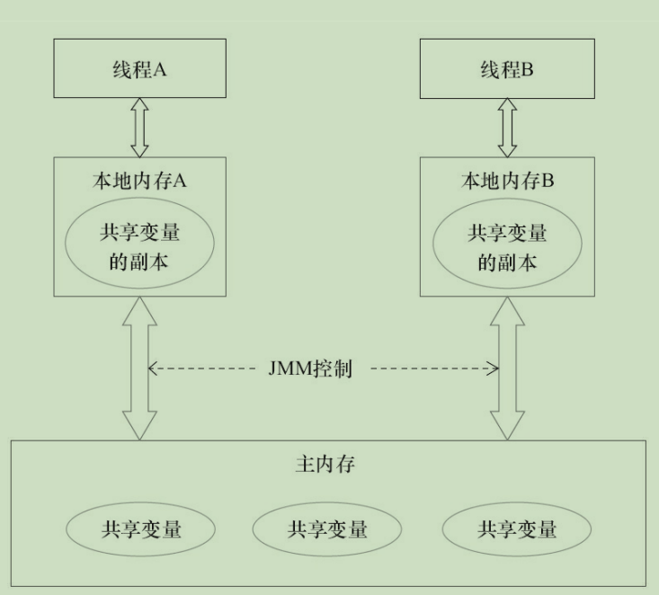
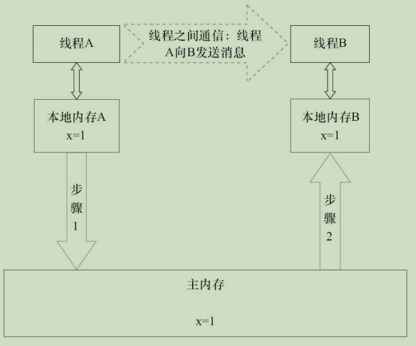
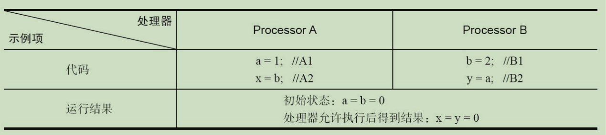
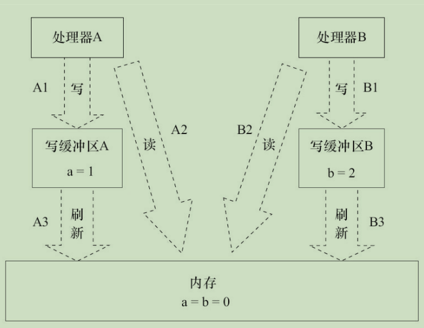
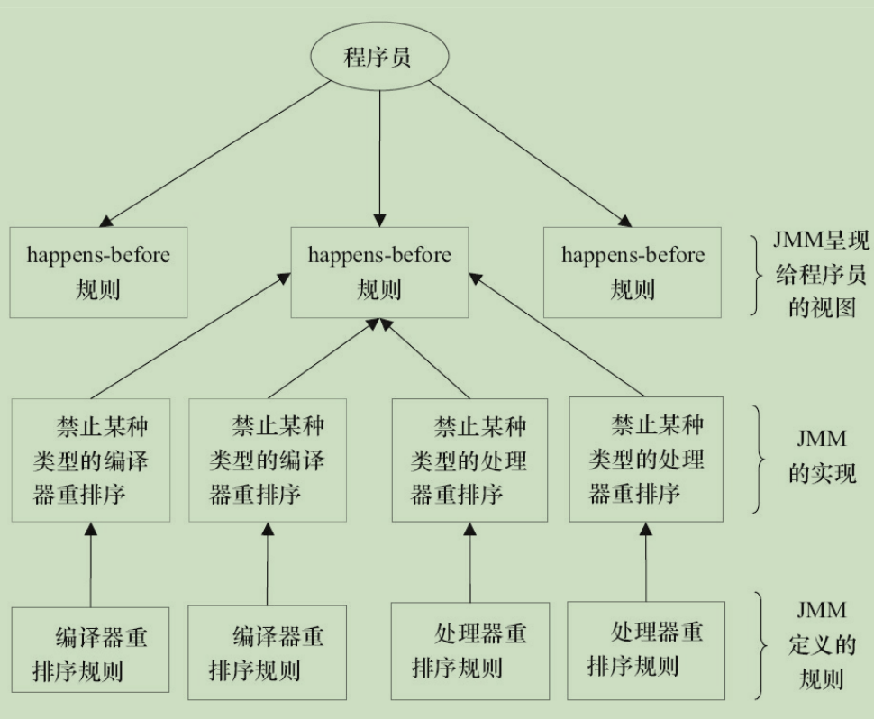

# 并发编程的挑战

## 上下文切换

# Java并发机制的底层实现原理

Java代码在编译后会变成Java字节码，字节码被类加载器加载到JVM里，JVM执行字节码，最终需要转化为汇编指令在CPU上执行，Java中所使用的并发机制依赖于JVM的实现和CPU的指令。

### volatile的应用

在多线程并发编程中synchronized和volatile都扮演着重要的角色，volatile是轻量级的synchronized，它在多处理器开发中保证了共享变量的“可见性”。可见性的意思是当一个线程修改一个共享变量时，另外一个线程能读到这个修改的值。如果volatile变量修饰符使用恰当的话，它比synchronized的使用和执行成本更低，因为它不会引起线程上下文的切换和调度。

#### 1.volatile的定义与实现原理

Java语言规范第3版中对volatile的定义如下：Java编程语言允许线程访问共享变量，为了确保共享变量能被准确和一致地更新，线程应该确保通过排他锁单独获得这个变量。Java语言提供了volatile，在某些情况下比锁要更加方便。如果一个字段被声明成volatile，Java线程内存模型确保所有线程看到这个变量的值是一致的。

在了解volatile实现原理之前，我们先来看下与其实现原理相关的CPU术语与说明。

| 术语       | 英文单词               | 术语描述                                                     |
| ---------- | ---------------------- | ------------------------------------------------------------ |
| 内存屏障   | memory barriers        | 是一组处理器指令，用于实现对内存操作的顺序限制               |
| 缓冲行     | cache line             | 缓存中可以分配的最小存储单位。处理器填写缓存线时会加载整个缓存线，需要使用多个主内存读周期 |
| 原子操作   | atomic operations      | 不可中断的一个或一系列操作                                   |
| 缓冲行填充 | cache line fill        | 当处理器识别到从内存中读取操作数是可缓存的，处理器读取整个缓存行到适当的缓存（L1，L2，L3的或所有） |
| 缓存命中   | cache hit              | 如果进行告诉缓存行填充操作的内存位置仍然是下次处理器访问的地址时，处理器从缓存中读取操作数，而不是从内存读取 |
| 写命中     | write hit              | 当处理器将操作数写回到一个内存缓存的区域时，它首先会检查这个缓存的内存地址是否在缓存行中，如果存在一个有效的缓存行，则处理器将这个操作数写回到缓存，而不是写回到内存，这个操作被称为写命中 |
| 写缺失     | write misses the cache | 一个有效的缓存行被写入到不存在的内存区域                     |


volatile是如何来保证可见性的呢？让我们在X86处理器下通过工具获取JIT编译器生成的汇编指令来查看对volatile进行写操作时，CPU会做什么事情。

Java代码如下：

> instance = new Singleton(); //instance是volatile变量

转变成汇编代码，如下：

> 0x01a3de1d: movb $0x0,0x1104800(%esi);
>
> oxo1a3de24: lock add1 $0x0,(%esp);

有volatile变量修饰的共享变量进行写操作的时候会多出第二行汇编代码，通过查IA-32架构软件开发者手册可知，Lock前缀的指令在多核处理器下会引发了两件事情。

1) 将当前处理器缓存行的数据写回到系统内存。

2) 这个写回内存的操作会使在其他CPU里缓存了该内存地址的数据无效。

为了提高处理速度，处理器不直接和内存进行通信，而是先将系统内存的数据读到内存缓存（L1，L2或其他）后再进行操作，但操作完不知道何时会写到内存。如果对声明了volatile的变量进行写操作，JVM就会向处理器发送一条Lock前缀的指令，将这个变量所在缓存行的数据写回到系统内存。但是就算写回到内存，如果其他处理器缓存的值还是旧的，再执行计算操作就会有问题。所以，在多处理器下，为了保证各个处理器的缓存是一致的，就会实现缓存一致性协议，每个处理器通过嗅探在总线上传播的数据来检查自己缓存的值是不是过期了，当处理器发现自己缓存行对应的内存地址被修改，就会将当前处理器的缓存行设置成无效状态，当处理器对这个数据进行修改操作的时候，会重新从系统内存中把数据读到处理器缓存里。

下面来具体讲解volatile的两条实现原则。

1) **Lock前缀指令会引起处理器缓存回写到内存**。Lock前缀指令导致在执行指令期间，声名处理器的LOCK#信号。在多处理器环境中，LOCK#信号确保在声名该信号期间，处理器可以独占任何共享内存。但是，在最近的处理器里，LOCK#信号一般不锁总线，而是锁缓存，毕竟锁总线开销的比较大。对于Intel486和Pentium处理器，在锁操作时，总是在总线上声明LOCK#信号。但在P6和目前的处理器中，如果访问的内存区域已经缓存在处理器内部，则不会声明LOCK#信号。相反，它会锁定这块内存区域的缓存并会写到内存，并使用缓存一致性机制来确保修改的原子性，此操作被称为“缓存锁定”，缓存一致性机制会阻止同时修改由两个以上处理器缓存的内存区域数据。

2) **一个处理器的缓存回写到内存会导致其他处理器的缓存无效**。IA-32处理器和inter 64处理器使用MESI（修改、独占、共享、无效）控制协议去维护内部缓存和其他处理器缓存的一致性。在多核处理器系统中进行操作的时候，IA-32和inter 64处理器能嗅探其他处理器访问系统内存和它们的内部缓存。处理器使用嗅探技术保证它的内部缓存、系统内存和其他处理器的缓存的数据在总线上保持一致。例如，在Pentium和P6 family处理器中，如果通过嗅探一个处理器来检测其他处理器打算写内存地址，而这个地址当前处于共享状态，那么正在嗅探的处理器将使它的缓存行无效，在下次访问相同内存地址时，强制执行缓存行填充。

#### 2.volatile的使用优化

著名的Java并发编程大师Dourglea在JDK7的并发包里新增一个队列集合类LinkedTransferQueue，它在使用volatile变量时，用一种追加字节的方式来优化队列出队和入队的性能。LinkedTransferQueue的代码如下

```java
//队列中的头部节点
private transient final PaddedAtomicReference<QNode> head;
//队列中的尾部节点
private transient final PaddedAtomicReferfence<QNode> tail;
static final class PaddedAtomicReference<T> extends AtomicReference {
    //使用很多4个字节的引用追加64个字节
    Object p0,p1,p2,p3,p4,p5,p6,p7,p8,p9,pa,pb,pc,pd,pe;
    PaddedAtomicReference(T r){
        super(r);
    }
}
public class AtomicReference <V> implements java.io.Serializable{
    private volatile V value;
    //省略其他代码
}
```

**追加字节能优化性能**？这种方式看起来很神奇，但如果深入理解处理器架构就能理解其中的奥秘。让我们先来看看LinkedTransferQueue这个类，它使用一个内部类类型来定义队列的头节点（head）和尾节点（tail），而这个内部类PaddedAtomicReference相对于父类AtomicReference只做了一件事情，就是将共享变量追加到64字节。我们可以来计算下，一个对象的引用占4个字节，它追加了15个变量（共占60个字节），再加上父类的value变量，一个64个字节。

**为什么追加64字节能够提高并发编程的效率呢**？因为对于英特尔酷睿i7、酷睿、Atom和NetBurst，以及Core Solo和Pentium M处理器的L1、L2或L3缓存的高速缓存行是64个字节宽，不支持部分填充缓存行，这意味着，如果队列的头节点和尾节点都不足64字节的话，处理器会将它们都读到同一个高速缓存行中，在多处理器下每个处理器都会缓存同样的头、尾节点，当一个处理器试图修改头节点时，会将整个缓存行锁定，那么在缓存一致性机制的作用下，会导致其他处理器不能访问自己高速缓存中的尾节点，而队列的入队和出队操作则需要不停修改头节点和尾节点，所以在多处理器的情况下将会严重影响到队列的入队和出队效率。Douglea使用追加到64字节的方式来填满高速缓冲区的缓存行，避免头节点和尾节点加载到同一个缓存行，使头、尾节点在修改时不会互相锁定。

**那么是不是在使用volatile变量时都应该追加到64字节呢**？不是的。在两种场景下不应该使用这种方式：

1. **缓存行非64字节宽的处理器**。如P6系列和奔腾处理器，它们的L1和L2告诉缓存行是32个字节宽。
2. **共享变量不会被频繁地写**。因为使用追加字节地方式需要处理器读取更多的字节到高速缓冲区，这本身就会带来一定的性能消耗，如果共享变量不被频繁写的话，锁的几率也非常小，就没必要通过追加字节的方式来避免相互锁定。

### synchronized的实现原理与应用

在多线程并发编程中synchronized一直是元老级角色，很多人都会称呼它为重量级锁。但是，随着Java SE 1.6对synchronized进行了各种优化之后，有些情况下它就并不那么重了。

先来看下利用synchronized实现同步的基础：Java中的每一个对象都可以作为锁。具体表现为以下3种形式：

- 对于普通同步方法，锁是当前实例对象。
- 对于静态同步方法，锁是当前类的Class对象。
- 对于同步方法块，锁是synchronized括号里配置的对象。

当一个线程试图访问同步代码块时，它首先必须得到锁，退出或抛出异常时必须释放锁。那么所到底存在哪里呢？锁里面会存储什么信息呢？

从JVM规范中可以看到synchronized在JVM里的实现原理，JVM基于进入和退出Monitor对象来实现方法同步和代码块同步，但两者的实现细节不一样。代码块同步是使用monitorenter和monitorexit指令实现的，而方法同步是使用另外一种方式实现的，细节在JVM规范里并没有详细说明。但是，方法的同步同样可以使用这两个指令来实现。

monitorenter指令是在编译后插入到同步代码块的开始位置，而monitorexit是插入到方法结束处和异常处，JVM要保证每个monitorenter必须有对应的monitorexit与之配对。任何对象都有一个monitor与之关联，当且一个monitor被持有后，它将处于锁定状态。线程执行到monitorenter指令时，将会尝试获取对象所对应的monitor的所有权，即尝试获得对象的锁。

#### Java对象头

synchronized用的锁是存在Java对象头里的。如果对象是数组类型，则虚拟机用3个字款（Word）存储对象头，如果对象是非数组类型，则用2字宽存储对象头。在32位虚拟机中，1字宽等于4字节，即32bit，如表所示：

| 长度     | 内容                   | 说明                             |
| -------- | ---------------------- | -------------------------------- |
| 32/64bit | Mark Word              | 存储对象的hashCode或锁信息等     |
| 32/64bit | Class Metadata Address | 存储到对象类型数据的指针         |
| 32/32bit | Array length           | 数组的长度（如果当前对象是数组） |

Java对象头里的Mark Word里默认存储对象的HashCode、分代年龄和锁标记位。32位JVM的Mark Word的默认存储结构如表所示

| 锁状态   | 25bit          | 4bit         | 1bit是否是偏向锁 | 2bit锁标志位 |
| -------- | -------------- | ------------ | ---------------- | ------------ |
| 无锁状态 | 对象的hashCode | 对象分代年龄 | 0                | 01           |

在运行期间，Mark Word里存储的数据会随着锁标志位的变化而变化。Mark Word可能变化位存储以下4种数据，如表所示：



在64位虚拟机下，Mark Word是64bit大小的，其存储结构如表所示：



#### 锁的升级与对比

Java SE 1.6为了减少获得锁和释放锁带来的性能消耗，引入了“偏向锁”和“轻量级锁”，在Java SE 1.6种，锁一共有4种状态，级别从低到高依次是：无锁状态、偏向锁状态、轻量级锁状态和重量级锁状态，这几个状态会随着竞争情况逐渐升级。锁可以升级但不能降级，意味着偏向锁升级成轻量级锁后不能降级成偏向锁。这种锁升级却不能降级的策略，目的是为了提高获得锁和释放锁的效率。

##### 1.偏向锁

HotSpot的作者经常研究发现，大多数情况下，锁不仅不存在多线程竞争，而且总是由同一线程多次获得，为了让线程获得锁的代价更低而引入了偏向锁。当一个线程访问同步块并获取锁时，会在对象头和栈帧种的锁记录里存储锁偏向的线程ID，以后该线程在进入和退出同步块时不需要进行CAS操作来加锁和解锁，只需简单地测试下对象头的Mark Word里是否存储着指向当前线程的偏向锁。如果测试成功，表示线程已经获得了锁。如果测试失败，则需要再测试一下Mark Word中偏向锁的标识是否设置成1（表示当前是偏向锁）；如果没有设置，则使用CAS竞争锁；如果设置了，则尝试使用CAS将对象头的偏向锁指向当前线程。


##### 3.锁的优缺点对比

| 锁       | 优点                                                         | 缺点                                           | 适用场景                         |
| -------- | ------------------------------------------------------------ | ---------------------------------------------- | -------------------------------- |
| 偏向锁   | 加锁和解锁不需要额外的消耗，和执行非同步方法相比仅存在纳秒级的差距 | 如果线程间存在锁竞争，会带来额外的锁撤销的消耗 | 适用于只有一个线程访问同步块场景 |
| 轻量级锁 | 竞争的线程不会阻塞，提高了程序的响应速度                     | 如果始终得不到锁竞争的线程，使用自旋会消耗CPU  | 追求响应时间同步块执行速度非常快 |
| 重量级锁 | 线程竞争不使用自旋，不会消耗CPU                              | 线程阻塞，响应时间缓慢                         | 追求吞吐量同步块执行速度较长     |

### 原子操作的实现原理

原子（atomic）本意是“不能被进一步分割的最小粒子”，而原子操作（atomic operation）意为“不可被中断的一个或一系列操作”。在多处理器上实现原子操作就变得有点复杂。

#### 1.术语定义

| 术语名称     | 英文                   | 解释                                                         |
| ------------ | ---------------------- | ------------------------------------------------------------ |
| 缓存行       | Cache line             | 缓存的最小操作单位                                           |
| 比较并交换   | Compare and Swap       | CAS操作需要输入两个数值，一个旧制（期望操作前的值）和一个新值，在操作期间先比较旧值没有发生变化，入宫没有发生变化，才交换新值，发生了则不交换 |
| CPU流水线    | CPU pipeline           | CPU流水线的工作方式就像工业生产上的装配流水线，在CPU中由5~6个不同功能的电路单元组成一条指令处理流水线，然后将一条X86指令5 ~ 6步后再由这些电路单元分别执行，这样就能实现在一个CPU时钟周期完成一条指令，因此提高CPU的运算速度 |
| 内存顺序冲突 | Memory order violation | 内存顺序冲突一般是由假共享引起的，假共享是指多个CPU同时修改同一个缓存行的不同部分而引起其中一个CPU的操作无效，当出现这个内存顺序冲突时，CPU必须清空流水线 |

#### 2.处理器如何实现原子操作

32位IA-32处理器使用基于对缓存加锁或总线加锁的方式来实现多处理器之间的原子操作。首先处理器会自动保证基本的内存操作的原子性。处理器保证从系统内存中读取或写入一个字节是原子的，意思是当一个处理器读取一个字节时，其他处理器不能访问这个字节的内存地址。Pentium 6和最新的处理器能自动保证单处理器对同一个缓存行里进行16/32/64位的操作是原子的，但是复杂的内存操作处理器是不能自动保证其原子性的，比如跨总线宽度、跨多个缓存行和跨页表的访问。但是，处理器提供总线锁定和缓存锁定两个机制来保证复杂内存操作的原子性。

（1）使用总线锁保证原子性

**第一个机制是通过总线锁保证原子性**。如果多个处理器同时对共享变量进行读改写操作（i++就是经典的读改写操作），那么共享变量就会被多个处理器同时进行操作，这样读改写操作就不是原子的，操作完之后共享变量的值会和期望的不一致。举个例子，如果i=1，我们进行两次i++操作，我们期望的结果是3，但是有可能结果是2，如果所示：



原因可能是多个处理器同时从各自的缓存中读取变量i，分别进行加1操作，然后分别写入系统内存中。那么，想要保证读写改共享变量的操作是原子的，就必须保证CPU1读改写共享变量的时候，CPU2不能操作缓存了该共享变量内存地址的缓存。

处理器使用总线锁就是来解决这个问题的。所谓总线锁就是使用处理器提供的一个LOCK#信号，当一个处理器在总线上输出此信号时，其他处理器的请求将被阻塞住，那么该处理器可以独占共享内存。

（2）使用缓存锁保证原子性

**第二个机制是通过缓存锁定来保证原子性**。在同一时刻，我们只需保证对某个内存地址的操作是原子性即可，但总线锁定把CPU和内存之间的通信锁住了，这使得锁定期间，其他处理器不能操作其他内存地址的数据，所以总线锁定的开销比较大，目前处理器在某些场合下使用缓存锁定代替总线锁定来进行优化。

**但是有两种情况下处理器不会使用缓存锁定**

第一种情况是：当操作的数据不能被缓存在处理器内部，或操作的数据跨多个缓存行（cache line）时，则处理器会调用总线锁定。

第二种情况是：有些处理器不支持缓存锁定。对于Inter 486和Pentium处理器，就算锁定的内存区域在处理器的缓存行中也会调用总线锁定。

#### 3.Java如何实现原子操作

在Java中可以通过锁和循环CAS的方式来实现原子操作。

（1）使用循环CAS实现原子操作

JVM中的CAS操作正是利用了处理器提供的MPXCHG指令实现的。自旋CAS实现的基本思路就是循环进行CAS操作直到成功为止，以下代码实现了一个基于CAS线程安全的计数器方法safeCount和一个非线程安全的计数器count。

```java
private AtomicInteger atomicI = new AtomicInteger(0);
private int i = 0;
public static void main(Stirng[] args){
    final Counter cas = new Counter();
    List<Thread> ts = new ArrayList<Thread>(600);
    long start = System.currentTimeMillis();
    for(int j = 0; j < 100; j++){
        Thread t = new Thread(new Runnable(){
        @Override
        public void run(){
            for(int i = 0; i < 1000; i++){
                cas.count();
                cas.safeCount();
            }
        }
        });
        ts.add(t);
    }
    for(Thread t : ts){
        t.start();
    }
    //等待所有线程执行完成
    for(Thread t : ts){
        try{
            t.join();
        }catch(InterruptedException e){
            e.printStackTrace();
        }
    }
    System.out.println(cas.i);
    System.out.pritnln(cas.atomicI.get());
    System.out.pritnln(System.currentTimeMillis() - start);
}
//使用CAS实现线程安全计数器
private void safeCount(){
    for(;;){
        int i = atomicI.get();
        boolean suc = atomicI.compareAndSet(i, ++i);
        if(suc){
            break;
        }
    }
}
//非线程安全计数器
private void ocunt(){
    i++;
}
}
```


（2）CAS实现原子操作的三大问题

在Java并发包中有一些并发框架也使用了自旋CAS的方式来实现原子操作，比如LinkedTransferQueue类的Xfer方法。CAS虽然很高效地解决了原子操作，但是CAS仍然存在三大问题。

**1)ABA问题**。因为CAS需要在操作值地时候，检查值有没有发生变化，如果没有发生变化则更新，但是如果一个值原来是A，变成了B，又变成了A，那么使用CAS进行检查时会发现它地值没有发生变化，但是实际上却变化了。ABA问题地解决思路就是使用版本号。在变量前面追加上版本号，每次变量更新地时候把版本号加1，那么A->B->A就会变成1A->2B->3A。从Java1.5开始，JDK地Atomic包里提供了一个类AtomicStampeReference来解决ABA问题。这个类地comareAndSet方法地作用是首先检查当前引用是否等于预期引用，并且检查当前标志是否等于预期标志，如果全部相等，则以源自方式将该引用和该标志地值设置为给定的更新值。

**2)循环时间长开销大**。自旋CAS如果长时间不成功，会给CPU带来非常大的执行开销。如果JVM能支持处理器提供的pause指令，那么效率会有一定的提示。

**3)只能保证一个共享变量的原子操作**。当对一个共享变量执行操作时，我们可以使用循环CAS的方式来保证原子操作，但是对多个共享变量操作时，循环CAS就无法保证操作的原子性，这个时候就可以用锁。

（3）使用锁机制实现原子操作

锁机制保证了只有获得锁的线程才能够操作锁定的内存区域。JVM内部实现了很多种锁机制，有偏向锁、轻量级锁和互斥锁。除了偏向锁，JVM实现锁的方式都用了循环CAS，即当一个线程想进入同步块的时候使用循环CAS的方式来获取锁，当它退出同步块的时候使用循环CAS释放锁。

# Java内存模型

## Java内存模型的基础

### 并发编程模型的两个关键问题

在并发编程种，需要处理两个关键问题：线程之间如何通信及线程之间如何同步（这里的线程是指并发执行的活动实体）。通信是指线程之间以何种机制来交换信息。在命令式编程种，线程之间的通信机制有两种：共享内存和消息传递。

在共享内存的并发模型里，线程之间共享程序的公共状态，通过写-读内存中的公共状态进行隐式通信。在消息传递的并发模型里，线程之间没有公共状态，线程之间必须通过发送消息来显式进行通信。

同步是指程序中用于控制不同线程间操作发生相对顺序的机制。在共享内存并发模型里，同步是闲时间进行的。程序员必须显式指定某个方法或某段代码需要在线程之间互斥执行。在消息传递的并发模型里，由于消息的发送必须在消息的接受之前，因此同步是隐式进行的。

Java的并发采用的是共享内存模型，Java线程之间的通信总是隐式进行，整个通信过程对程序员完全透明。如果编写多线程程序的Java程序员不理解隐式进行的线程之间通信的工作机制，很可能会遇到各种奇怪的内存可见性问题。

### Java内存模型的抽象结构

Java线程之间的通信由Java内存模型（简称为JMM）控制，JMM决定一个线程对共享变量的写入何时对另一个线程可见。

Java内存模型的抽象示意图如图所示：



如果线程A与线程B之间要通信的话，必须要经历下面2个步骤：

1)线程A把本地内存A中更新过的共享变量刷新到主内存中去。

2)线程B到主内存中去读取线程A之前已更新过的共享变量。

下面通过示意图来说明这两个步骤：



如图所示，本地内存A和本地内存B由主内存中共享变量x的副本。假设初始时，这3个内存中的x值都为0。线程A在执行时，把更新后的x值（假设值为1）临时存放在自己的本地内存A中。当线程A和线程B需要通信时，线程A首先会把自己本地内存中修改后的x值刷新到主内存中，此时主内存中的x值变为了1.随后，线程B到主内存中读取线程A更新后的x值，此时线程B的本地内存的x值也变为了1。

从整体来看，这两个步骤实质上是线程A在向线程B发送消息，而且这个通信过程必须要经过主内存。JMM通过控制主内存与每个线程的本地内存之间的交互，来为Java程序提供内存可见性保证。

### 从源代码到指令序列的重排序

在执行程序时，为了提高性能，编译器和处理器常常会对指令做重排序。重排序分3种类型。

1) 编译器优化的重排序。编译器在不改变单线程程序语义的前提下，可以重新安排语句的执行顺序。

2) 指令级并行的重排序。现代处理器采用了指令级并行技术（Instruction-Level Parallelism，ILP）来讲多条指令重叠执行。如果不存在数据依赖性，处理器可以改变语句对应机器指令的执行顺序。

3) 内存系统的重排序。由于处理器使用缓存和读/写缓冲区，这使得加载和存储操作看上去可能是在乱序执行。

从Java源代码到最终实际执行的指令序列，会分别经历下面3种重排序，如图所示：


上述的1属于编译器重排序，2和3属于处理器重排序。

### 并发编程模型的分类

现在的处理器使用写缓冲区临时保存向内存写入的数据。写缓冲区可以保证指令流水线持续运行，它可以避免由于处理器停顿下来等待向内存写入数据而产生的延迟。同时，通过以批处理的方式刷新写缓冲区，以及合并写缓冲区中对同一内存地址的多次写，减少对内存总线的占用。虽然写缓存区有这么多好处，但每个处理器上的写缓冲区，仅仅对它所在的处理器可见。这个特性会对内存操作的执行顺序产生重要的影响：处理器对内存的读/写操作的执行顺序，不一定与内存实际发生的读/写操作顺序一致！为了具体说明，请看下面的图：



假设处理器A和处理器B按程序的顺序并执行内存访问，最终可能得到x=y=0的结果。



这里处理器A和处理器B可以同时把共享变量写入自己的写缓冲区（A1，B1），然后从内存中读取另一个共享变量（A2，B2），最后才把自己写缓存区中保存的脏数据刷新到内存中（A3，B3）。当以这种时序执行时，程序就可以得到x=y=0的结果。

从内存操作实际发生的顺序来看，直到处理器A执行A3来刷新自己的写缓存区，写操作A1才算真正执行了。虽然处理器A执行内存操作的顺序为A1->A2，但内存操作实际发生的顺序却是A2->A1。此时，处理器A的内存操作顺序被重排序了（处理器B的情况和处理器A一样这里就不赘述了）。

---

**注意**

- sparc_TSO是指以TSO(Total Store Order)内存模型运行时sparc处理器的特性。
- 表中的X86包含X64及AMD64。
- 由于ARM处理器的内存模型与PowerPC处理器的内存模型非常类似，本文将忽略它。

为了保证内存可见性，Java编译器在生成指令序列的适当位置会插入内存屏障指令来禁止特定类型的处理器重排序。JMM把内存屏障指令来禁止指令分为四类，如表所示：

| 屏障类型            | 指令实例                 | 说明                                                         |
| ------------------- | ------------------------ | ------------------------------------------------------------ |
| LoadLoad Barriers   | Load1;LoadLoad;Load2     | 确保Load1数据的装载先于Load2及所有后续装载指令的装载         |
| StoreStore Barriers | Store1;StoreStore;Store2 | 确保Store1数据对其他处理器可见（刷新到内存）先于Store2及所有后续存储指令的存储 |
| LoadStore Barriers  | Load1;LoadStroe;Store2   | 确保Load1数据装载先于Store2及所有后续的存储指令刷新到内存    |
| StoreLoad Barriers  | Store1;StoreLoad;Load2   | 确保Store1数据对其他处理器变得可见（指刷新到内存）先于Load2及所有后续装载指令的装载。StoreLoad Barriers会使该屏障之前的所有内存访问指令（存储和装载指令）完成之后，才执行该屏障之后的内存访问指令。 |

StoreLoad Barriers是一个“全能型”的屏障，它同时具有其他3个屏障的效果。现代的多处理器大多支持该屏障（其他类型的屏障不一定被所有处理器支持）。执行该屏障开销会很昂贵，因为当前处理器通常要把写缓冲区中的数据全部刷新到内存中（Buffer Fuller Flush）。

### happens-before简介

从JDK5开始，Java使用新的JSR-133内存模型（除非特别说明，本文针对的都是JSR-133内存模型）。JSR-133使用happens-before的概念来阐述操作之间的内存可见性。在JMM中，如果一个操作执行的结果需要对另一个操作可见，那么这两个操作之间必须要存在happens-before关系。这里提到的两个操作既可以是在一个线程之内，也可以是在不同线程之间。

与程序员密切相关的happens-before规则如下。

- 程序顺序规则：一个线程中的每个操作，happens-before于该线程中的任意后续操作。
- 监视器锁规则：对一个锁的解锁，happens-before于随后对这个锁的加锁。
- volatile变量规则：对一个volatile域的写，happens-before于任意后续对这个volatile域的读。
- 传递性：如果A happens-before B，且B happens-before C，那么A happens-before C。

---

**注意**  两个操作之间具有happens-before关系，并不意味着前一个操作必须要在后一个操作之前执行！happens-before仅仅要求前一个操作（执行的结果）对后一个操作可见，且前一个操作按顺序排在第二个操作之前（this first is visible to and ordered before the second）。

happens-before与JMM的关系如图所示：



如图所示，一个happens-before规则对应于一个或多个编译器和处理器重排序规则。对于Java程序员来说，happens-before规则简单易懂，它避免Java程序员为了理解JMM提供的内存可见性保证而去学习复杂的重排序规则以及这些规则的具体实现方法。

## 重排序

重排序是指编译器和处理器为了优化程序性能而对指令序列进行重新排序的一种手段。

### 数据依赖性

如果两个操作访问同一个变量，且这两个操作中有一个为写操作，此时这两个操作之间就存在数据依赖性。数据以来分为下列3种类型。

| 名称   | 代码示例  | 说明                         |
| ------ | --------- | ---------------------------- |
| 写后读 | a=1; b=a; | 写一个变量之后，再读这个位置 |
| 写后写 | a=1; a=2; | 写一个变量之后，再写这个变量 |
| 读后写 | a=b; b=1; | 读一个变量之后，再写这个变量 |

### as-if-serial语义

as-if-serial语义的意思是：不管怎么重排序（编译器和处理器为了提高并行度），（单线程）程序的执行结果不能被改变。编译器、runtime和处理器都必须遵守as-if-serial语义。