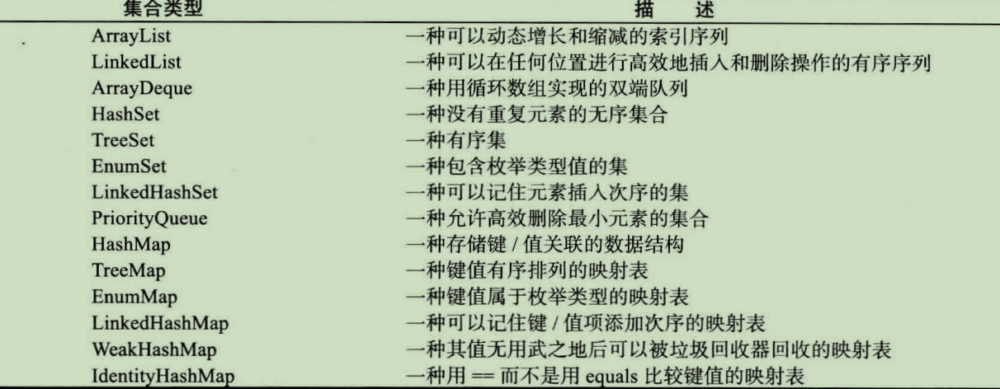
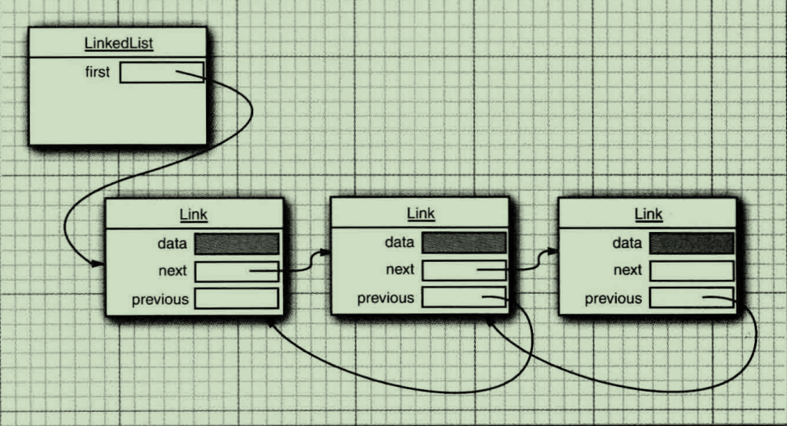
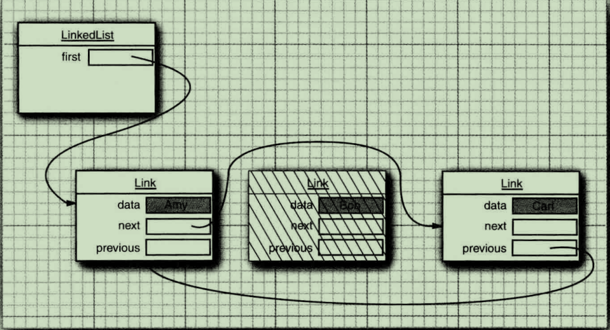
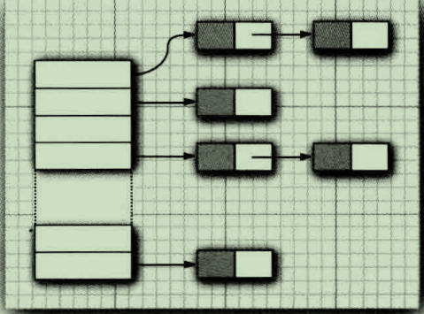
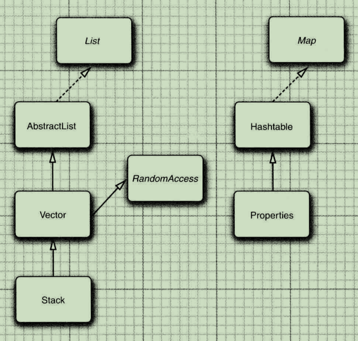
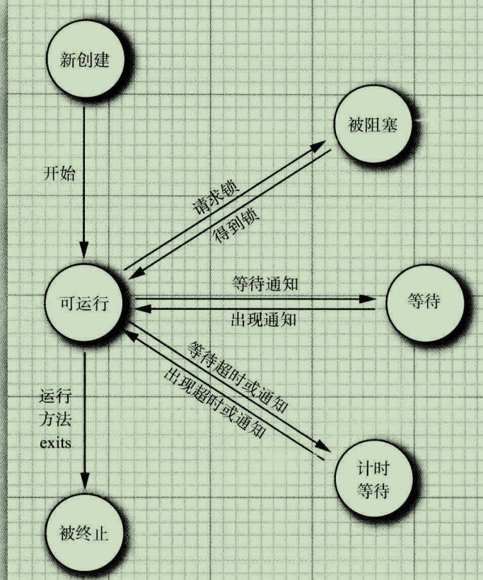
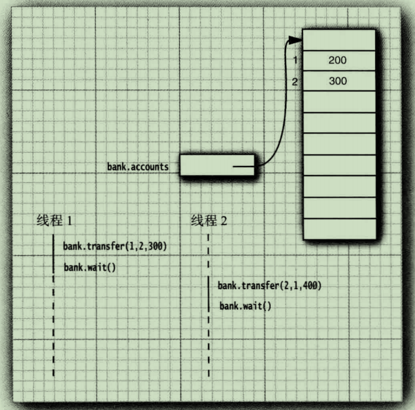

# 继承

### super关键字

```java
public Manager(String name, double salary, int year, int month, int day){
	super(name, salary, year, month, day);
    bonus = 0;
}
```

这里的关键字super具有不同的含义。语句`super(n, s, year, month, day);`是“调用超类Employee中含有n、s、year、month和day参数的构造器”的简写形式。

由于Manager类的构造器不能访问Employee类的私有域，所以必须利用Employee类的构造器对这部分私有域进行初始化，我们可以通过super实现对超类构造器的调用。使用super调用构造器的语句必须是子类构造器的第一条语句。

注意区分`this`和`super`关键字。

关键字`this`的两个用途：

1. 引用yin'shi隐式参数
2. 调用该类其他的构造器

关键字`super`的两个用途：

1. 调用超类的方法
2. 调用超类的构造器

`调用构造器的语句只能作为另一个构造器的第一天语句`

### 理解方法调用

1. 编译器查看对象的声明类型和方法名
2. 接下来编译器将查看调用方法时提供的参数类型
3. 至此，编译器已获得需要调用的方法名字和参数类型

### 强制类型转换

在进行类型转换之前，先查看一下是否能够成功地转换。这个过程简单地使用instanceof操作符就可以实现。

### Object：所有类的超类

Object类是Java中所有类的始祖，在Java中每个类都是由他扩展而来的。

Object类中的equals方法用于监测一个对象是否等于另外一个对象。在Object类中，这个方法判断两个对象是否具有相同的引用。如果两个对象具有相同的引用，他们一定是相等的。

### 对象包装器与自动装箱

这些对象包装器类拥有很明显的名字：Integer、Long、Float、Double、Short、Byte、Character、Void和Boolean（前6个类派生于公共的超类Number）

### 反射

反射库（reflection library）提供了一个非常丰富且精心设计的工具集，以便编写能够动态操纵Java代码的程序。

能够分析类能力的程序成为反射（reflective）

反射机制可以用来：

- 在运行时分析类的能力
- 在运行时查看对象，例如，编写一个toString方法供所有类使用
- 实现通用的数组操作码
- 利用Method对象，这个对象很想C++中的函数指针

Object类中的getClass()方法将会返回一个Class类型的实例。

最常用的Class方法是getName。这个方法将返回类的名字。

Class类实际上是一个泛型类。

newInstance()方法可以用来动态地创建一个类的实例。

#### 捕获异常

当程序运行过程中发生错误时，就会“抛出异常”。抛出异常比终止程序要灵活得多，这是因为可以提供一个“捕获”异常的处理器（handler）对异常情况进行处理。

如果没有提供处理器， 程序就会终止，并在控制台上打印出一条信息，其中给出了异常的类型。可能在前面已经看到过一些异常报告，例如，偶然使用了null引用或者数组越界等。

异常有两种类型：未检查异常和已检查异常。对于已检查异常，编译器将会检查是否提供了处理器。然而，有很多常见的异常，例如，访问null引用，都属于未检查异常。编译器不会查看是否为这些错误提供了处理器。毕竟，应该精心地编写代码来避免这些错误的发生，而不要将精力花在编写异常处理器上。

#### 利用反射分析类的能力

在java.long.reflect包中有三个类Field、Method和Constructor分别用于描述类的域、方法和构造器。

Class类中地getFields、getMethods和getConstructors方法将分别返回类提供的public域、方法和构造器数组，其中包括超类的公有成员。Class类的getDeclareFields、getDeclareMethods和getDeclaredConstructors方法将分别返回类中声明的全部域、方法和构造器，其中包括私有和受保护成员，但不包括超类的成员。

### 继承的设计技巧

1. 将公共操作和域放在超类
2. 不要使用受保护的域
3. 使用继承实现“is-a”关系
4. 除非所有继承的方法都有意义，否则不要使用继承
5. 在覆盖方法时，不要改变预期的行为
6. 使用多态，而非类型信息
7. 不要过多地使用反射

# 接口

### 接口

一个类可以实现（implement）一个或多个接口，并在需要接口的地方，随时使用实现了相应接口的对象。

#### 接口概念

在Java程序设计语言中，接口不是类，而是对类的一组需求描述，这些类要遵从接口描述的统一格式进行定义。

# Java的基本程序设计结构

### 3.2 注释

当需要长篇的注释时，既可以在每行的注释前面标记//，也可以使用`/*`和`*/`将一段比较长的注释括起来。自动生成文档注释，`/**`开始，`*/`结束。

### 3.3 数据类型

整型用于表示没有小数部分的数值


# 集合

### 9.2 具体的集合



除了Map结尾的类之外，其他都实现了Collection接口，而以Map结尾的类实现了Map接口。

#### 链表

在Java程序设计语言中，所有链表实际上都是双向链表的（double linked）——即每个节点还存放着指向前去节点的引用。



从链表中间删除一个元素是一个很轻松的操作， 即需要更新被删除元素附近的链接。



在链表中添加或删除元素时，绕来绕去的指针可能已经给人们留下了极坏的印象。如果真是如此的话，就会为Java集合类库提供一个LinkedList而感到拍手称快。

在下面的代码示例中，先添加3个元素，然后再将第2个元素删除；

```java
List<String> staff = new LinkedList<>();// LinkedList implements List
staff.add("Amy");
staff.add("Bob");
staff.add("Carl");
Interator iter = staff.iterator();
String first = iter.next();//visit first element
String second = iter.next();//visit second element
iter.remove();//remove last visited element
```

链表是一个有序集合（ordered collection），每个对象的位置十分重要。LinkedList.add方法将对象添加到链表的尾部。由于迭代器时描述集合中位置的，所以这种依赖于位置的add方法将由迭代器负责。只有对自然有序的集合使用迭代器添加元素才有实际意义。Add方法在迭代器之前添加一个新对象。

当用一个刚刚由Iterator方法返回，并且指向链表表头的迭代器调用add操作时，新添加的元素将变成列表的新表头。当迭代器越过链表的最后一个元素时（即hasNext返回false），添加的元素将变成列表的新表尾。如果链表由n个元素，由n+1个位置可以添加新元素。这些位置与迭代器的n+1个可能的位置相对应。例如，如果链表包含3个元素，A、B、C，就有四个位置（标有|）可以插入新元素：

> |ABC
>
> A|BC
>
> AB|C
>
> ABC|

**注释**：在用“光标”类比时要格外小心。remove操作与BACKSPACE键的工作方式不太一样。在调用next之后，remove方法确实与BACKSPACE键一样删除了迭代器左侧的元素。但是如果调用previous就会将右侧的元素删除掉，并且不能连续调用两次remove。

add方法只依赖于迭代器的位置，而remove方法依赖于迭代器的状态。

例如，一个迭代器指向另一个迭代器刚刚删除的元素前面，现在这个迭代器就是无效的，并且不应该在使用。链表迭代器的设计使它能够检测到这种修改。如果迭代器发现它的集合被另一个迭代器修改了，或是被该集合自身的方法修改了，就会抛出一个ConcurrentModificationException异常。

为了避免发生并发修改的异常，请遵循下述简单规则：可以根据需要给容器附加许多的迭代器，但是这些迭代器只能读取列表。另外，再单独附加一个既能读又能写的迭代器。

有一个简单的方法可以检测到并发修改的问题。集合可以跟踪改写操作（诸如添加或删除元素）的次数。每个迭代器都维护一个独立的计数值。在每个迭代器方法的开始处检查自己改写操作的计数值是否与集合的改写操作计数值一致。如果不一致，抛出一个ConcurrentModificationException异常。

**注释**：对于并发修改列表的检测有一个奇怪的例外。链表只负责跟踪对列表的结构性修改，例如，添加元素、删除元素。set方法不被视为结构性修改。可以将多个迭代器附加给一个链表，所有的迭代器都调用set方法对现有节点的内容进行修改。

使用链表的唯一理由是尽可能地减少在列表中间插入或删除元素所付出的代价。如果列表只有少数几个元素，就完全可以使用ArrayList。

我们建议避免使用以整数索引表示链表中位置的所有方法。如果需要对集合进行随机访问，就使用数组或ArrayLister，而不要使用链表。

#### 数组列表

#### 散列集

有一种众所周知的数据结构，可以快速地查找所需要的对象，这就是散列表（hash table）。散列表为每个对象计算一个整数，称为散列码（hash code）。散列码是由对象地实例域产生的一个整数。更准确地说，具有不同数据域的对象将产生不同的散列码。

在Java中，散列表用链表数组实现。每个列表被称为桶（bucket）。

要想查找表中对象的位置，就要先计算它的散列码，然后与桶的总数取余，所得到的结果就是保存这个元素的桶的索引。当然，有时候会遇到桶被占满的情况，这也是不可避免地。这种现象被称为散列冲突（hash collision）。这时，需要用新对象与桶中的所有对象进行比较，查看这个对象是否已经存在。如果散列码是合理且随机分布的，桶的数目也足够大，需要比较的次数就会很少。

**注释**：在Java SE 8中，桶满时会从链表变为平衡二叉树。如果选择的散列函数不当，会产生很多冲突，或者如果有恶意代码视图在散列表中填充多个有相同散列码的值，这样就能提高性能。

如果想更多地控制散列表地运行性能，就要指定一个初始的桶数。桶数是指用于收集具有相同散列值的桶的数目。如果要插入到散列表中的元素太多，就会增加冲突的可能性，降低运行性能。入宫大致知道最终会有多少个元素要插入到散列表中，就可以设置桶数。通常，将桶数设置为预计元素个数的75%~150%。有些研究人员认为：尽管还没有确凿的证据，但最好将桶数设置为一个素数，以防键的集聚。

如果散列表太满，就需要再散列（rehashed）。如果对散列表再散列，就需要创建一个桶数更多的表，并将所有元素插入到这个新表中，然后丢弃原来的表。装填因子（load factor）决定何时对散列表进行再散列。

Java集合类库提供了一个HashSet类，它实现了基于散列表的集。可以用add方法添加元素。contains方法已经被重新定义，用来快速地查看是否某个元素已经出现在集中。散列表迭代器将依次访问所有的桶。由于散列将元素分散在表的各个位置上，所以访问他们的顺序几乎是随机的。

#### 树集

TreeSet类与散列集十分类似，不过，它比散列集有所改进。树集是一个有序集合（sorted collection）。可以以任意顺序将元素插入到集合中。在对集合进行遍历时，每个值将自动地按照排序后的顺序呈现。

树地排序必须是全序。也就是说，任意两个元素必须是可比的，并且只有在两个元素相等时结果才为0。

#### 队列与双端队列

队列可以让人们有效地在尾部添加一个元素，在头部删除一个元素。有两个端头的队列，即双端队列，可以让人们有效地在头部和尾部同时添加或删除元素。不支持在队列中间添加元素。在Java SE 6中引入了Deque接口，并由ArrayDeque和LinkedList类实现。这两个类都提供了双端队列，而且在必要时可以增加队列的长度。

#### 优先级队列

优先级队列（priority queue）中的元素可以按照任意的顺序插入，却总是按照排序的顺序进行检索。也就是说，无论何时调用remove方法，总会获得当前优先级队列中最小的元素。优先级队列使用了一个优雅且高效的数据结构，称为堆（heap）。堆是一个可以自我调整的二叉树，对树执行添加（add）和删除（remove）操作，可以让最小的元素移动到根，而不必花费时间对元素进行排序。

使用优先级队列的典型示例是任务调度。每个任务有一个优先级，任务以随机顺序添加到队列中。每当启动一个新的任务时，都将优先级最高的任务从队列中删除（由于习惯上将1设为“最高”优先级，所以会将最小的元素删除）。

### 9.3 映射

集是一个集合，它可以快速地查找现有的元素。但是，要查看一个元素，需要有要查找元素的精确副本。这不是一种非常通用的查找方式。通常，我们知道某些键的信息，并想要查找与之对应的元素。映射（map）数据结构就是为此设计的。映射用来存放键/值对。如果提供了键，就能够查找到值。

#### 基本映射操作

Java类库为映射提供了两个通用的实现：HashMap和TreeMap。这两个类都实现了Map接口。

散列映射对键进行散列，树映射用键的整体顺序对元素进行排序，并将其组织成搜索树。散列或比较函数职能作用于键。于键关联的值不能进行散列或比较。

散列稍微快一些，如果不需要按照排序顺序访问键，就最好选择散列。

下列代码将为存储的员工信息建立一个散列映射：

```java
Map<String, Employee> staff = new HashMap<>(); // HashMap implements Map
Employee harry = new Employee("Harry Hacker");
staff.put("987-98-9996", harry);
```

每当往映射中添加对象时，必须同时提供一个键。在这里，键是一个字符串，对应的值是Employee对象。

要想检索一个对象，必须使用（因而，必须记住）一个键。

> String id = "987-98-9996";
>
> e = staff.get(id);

如果在映射中没有与定键对应的消息，get将返回null。null返回值可能并不方便。有时可以有一个好的默认值，用作为映射中不存在的键。然后使用getOrDefault方法。

> Map<String, Integer> scores = ...;
>
> int score = scores.get(id,0); // Gets 0 if the id is not present

键必须是唯一的。不能对同一个键存放两个值。如果对同一个键两次调用put方法，第二个值就会取代第一个值。实际上，put将返回用这个键参数存储的上一个值。

remove方法用于从映射中删除给定键对应的元素。size方法用于返回映射中的元素数。

要迭代处理映射的键和值，最容易的方法是使用forEach方法。

#### 更新映射项

处理映射时的一个难点就是更新映射项。正常情况下，可以得到与一个键关联的原值，完成更新，再放回更新后的值。不过，必须考虑一个特殊情况，即键第一次出现。下面来看一个例子，使用一个映射统计一个单词再文件中出现的频度。看到单词（word）时，我们将计数器增1，如下所示：

> counts.put(word, counts.get(word) + 1)

这是可以的，不过一种情况除外：就是第一次看到word时。在这种情况下，get会返回null，因此会出现NullPointerException异常。

作为一个简单的补救，可以使用getOrDefault方法：

> counts.put(word, counts.getOrDefault(word, 0) + 1);

另一个方法是首先调用putIfAbsent方法。只有当键原先存在时才会放入一个值。

> counts.putInfAbsent(word, 0 );
>
> counts.put(word,counts.get(word) + 1);

不过还可以做得更好。merge方法可以简化这个常见的操作。如果键原先不存在，下面的调用：

> counts.merge(word, 1,Integer::sum);

将把word与1关联，否则使用Integer::sum函数组合原值和1（也就是将原值与1求和）。

#### 映射视图

集合框架不认为映射本身是一个集合。（其他数据结构框架认为映射是一个键/值对集合，或者是由键索引的值集合。）

#### 弱散列映射

设计WeakHashMap类是为了解决一个有趣的问题。如果有一个值，对应的键已经不再使用了，将会出现什么情况呢？

首先，垃圾回收器跟踪活动的对象。只要映射对象是活动的，其中的所有桶也是活动的，它们不能被回收。

WeakHashMap使用弱引用（weak references）保存键。WeakReference对象将引用保存到另外一个对象中，在这里，就是散列键。对于这种类型的对象，垃圾回收器用一种特有的方式进行处理。通常，如果垃圾回收器发现某个特定的对象已经没有他人引用了，就将其回收。然而，如果某个对象只能由WeakReference引用，垃圾回收器仍然回收它，但要将引用这个对象的弱引用放入队列中。WeakHashMap将周期性地检查队列，以便找出新添加地弱引用。一个弱引用进入队列意味着这个键不再被他人使用，并且已经被收集起来。于是，WeakHashMap将删除对应的条目。

#### 链接散列集与映射

链接散列映射将用访问顺序，而不是插入顺序，对映射条目进行迭代。每次调用get或put，受到影响的条目将从当前的位置删除，并放到条目链表的尾部（只有条目在链表中的位置会受影响，而散列表中的桶不会受影响。一个条目总位于与键散列码对应的桶中）。

访问顺序对于实现高速缓存的“最近最少使用”原则十分重要。

#### 枚举集与映射

EnumSet是一个枚举类型元素集的高效实现。由于枚举类型只有有限个实例，所以EnumSet内部用位序列实现。如果对应的值在集中，则相应的位被置为1。

EnumMap是一个键类型为枚举类型的映射。他可以直接且高效地用一个值数组实现。

#### 标识散列映射

类IdentityHashMap有特殊的作用。在这个类中，键的散列值不是用hashCode函数计算的，而是用System.identityHashCode方法计算的。这是Object.hashCode方法根据对象的内存地址类计算散列码所使用的方式。而且，在对两个对象进行比较时，IdentityHashMap类使用==，而不是用equals。

也就是说，不同的键对象，即使内容相同，也被视为是不同的对象。在实现对象遍历算法（如对象串行化）时，这个类非常有用，可以用来跟踪每个对象的遍历状况。

### 9.4 视图与包装器

#### 轻量级集合包装器

Arrays类的静态方法asList将返回一个包装了普通Java数组的List包装器。

#### 子范围

#### 不课修改的视图

#### 同步视图

#### 受查视图

#### 关于可选操作的说明

### 算法

这章都是讲一些算法API的。

泛型集合接口有一个很大的优点，即算法只需要实现一次。

#### 排序与混排

#### 简单算法

#### 批操作

#### 集合与数组的转换

Array.asList包装器。

### 遗留的集合



# 并发

多任务（multitasking）：在同一时刻运行多个程序的能力。

并发执行的进程数目并不是由CPU数目制约的。操作系统将CPU的时间片分配给每一个进程，给人并发处理的感觉。

多线程程序在较低的层次上扩展了多任务的概念：一个程序同时执行多个任务。通常，每一个任务称为线程（thread），它是线程控制的简称。可以同时运行一个以上线程的程序称为多线程程序（multithreaded）。

多进程与多线程有哪些区别呢？本质的区别在于每个进程拥有自己的一整套变量，而线程则共享数据。

### 14.1 什么是线程

调用Thread.sleep不会创建一个新线程，sleep是Thread类的静态方法，用于暂停当前线程的活动。

### 14.2 中断线程

当线程的run方法执行方法体中最后一条语句后，并经由执行return语句返回时，或者出现了在方法中没有捕获的异常时，线程将终止。

**注释**：Interrupted方法是一个静态方法，它监测当前的线程是否被中断。而且，调用interrupted方法会清除该线程的中断状态。另一方面，isInterrupted方法是一个实例方法，可用来检验是否有线程被中断。调用这个方法不会改变中断的状态。

### 线程状态

线程可以有如下6种状态：

- New（新创建）
- Runnable（可运行）
- Blocked（被阻塞）
- Waiting（等待）
- Timed waiting（计时等待）
- Terminated（被终止）

#### 新创建线程

当用new操作符创建一个新线程时，如new Thread(r)，该线程还没有开始运行。这意味着它的状态是new。当一个线程处于新创建状态时，程序还没有开始运行线程中的代码。在线程运行之前还有一些基础工作要做。

#### 可运行线程

一旦调用start方法，线程处于runnable状态。一个可运行的线程可能正在运行也可能没有运行，这取决于操作系统给线程提供运行的时间。抢占式调度系统给每一个可运行线程一个时间片来执行任务。当时间片用完，操作系统剥夺该线程的运行权，并给另一个线程运行机会。现在所有的桌面以及服务器操作系统都是用抢占式调度。

记住，在任何给定时刻，一个可运行的线程可能正在运行也可能没有运行（这就是为什么将这个状态称为可运行而不是运行）。

#### 被阻塞线程和等待线程

当线程处于被阻塞或等待状态时，它暂时不活动。它不运行任何代码且消耗最少的资源。直到线程调度器重新激活它。细节取决于它是怎样达到非活动状态的。

- 当一个线程试图获取一个内部的对象锁（而不是java.util.concurrent库中的锁），而该锁被其他线程持有，则该线程进入阻塞状态

- 当线程等待另一个线程通知调度器一个条件时，它自己进入等待状态。在调用Object.wait方法或Thread.join方法，或者是等待java.util.concurrent库中的Lock或Condition时，就会出现这种情况。实际上，被阻塞状态与等待状态是很大不同的。
- 有几个方法有一个超时参数。调用它们导致线程进入计时等待（timed waiting）状态。这一状态将一直保持到超时期满或者接收到适当的通知。带有超时参数的方法有Thread.sleep和Object.wait、Thread.join、Lock.tryLock以及Condition.await的计时版。

#### 被终止的线程

线程因如下两个原因之一而被终止：

- 因为run方法正常退出而自然死亡；
- 因为一个没有捕获的异常终止了run方法而意外死亡。



### 14.4 线程的属性


### 同步


### 14.5 同步


#### synchronized关键字

总结一些有关锁和条件的关键之处：

- 锁用来保护代码片段，任何时刻只能有一个线程执行被保护的代码。
- 锁可以管理试图进入被保护代码段的线程。
- 锁可以拥有一个或多个相关的条件对象。
- 每个条件对象管理那些已经进入被保护的代码段但还不能运行的线程。

Lock和Condition接口为程序设计人员提供了高度的锁定控制。然而，大多数情况下，并不需要那样的控制，并且可以使用一种嵌入到Java语言内部的机制。从1.0版开始，Java中的每一个对象都有一个内部锁。如果一个方法用了synchronized关键字声明，那么对象的锁将保护整个方法。也就是说，要调用该方法，线程必须获得内部的对象锁。

换句话说，

```java
public synchronized void method(){
    method body;
}
```

等价于

```java
public void method(){
    this.intrinsicLock.lock();
    try{
        method body;
    }
    finally{this.intrinsicLock.unlock();}
}
```

将静态方法声明为synchronized也是合法的。如果调用这种方法，该方法获得相关的类对象的内部锁。例如，如果Bank类有一个静态同步的方法，那么当该方法被调用时，Bank.class对象的锁被锁住。因此，没有其他线程可以调用同一个类的这个或任何其他的同步静态方法。

内部锁和条件存在一些局限。包括：

- 不能中断一个正在试图获得锁的线程。
- 试图获得锁时不能设定超时。
- 每个锁仅有单一的条件，可能时不够的。

在代码中应该使用哪一种？Lock和Condition对象还是同步方法？下面是一些建议：

- 最好即不适用Lock/Condition也不适用synchronized关键字。在许多情况下你可以使用java.util.concurrent包中的一种机制，它会为你处理所有的加锁。
- 如果synchronized关键字适合你的程序，那么请尽量使用它，这样可以减少编写的代码数量，减少出错的几率。
- 如果特别需要Lock/Condition结构提供的独有特性时，才使用Lock/Condition。

#### 同步阻塞

正如刚刚讨论的，每一个Java对象有一个锁。线程可以通过调用同步方法获得锁。还有另一种机制可以获得锁，通过进入一个同步阻塞。当线程进入如下形式的阻塞：

```java
synchronized(obj) 
{
    critical setion
}
```

于是它获得obj的锁。

有时会发现“特殊的”锁，例如：

```java
public class Bank
{
    private double[] accounts;
    private Object lock = new Object();
    ...
        public void transfer(int from,int to, int amount){
        synchronized(lock){
            accounts[from] -= amount;
            accounts[to] += amount;
        }
        System.out.println(...);
    }
}
```

在此，lock对象被创建仅仅是用来使用每个Java对象持有的锁。

有时程序员使用一个对象的锁来实现额外的原子操作，实际上称为客户端锁定（clientside locking）。

#### 监视器概念

锁和条件是线程同步的强大工具，但是，严格地讲，它们不是面向对象的。多年来，研究人员努力寻找一种方法，可以在不需要程序员考虑如何加锁的情况下，就可以保证多线程的安全性。

用Java的术语来讲，监视器具有如下特性：

- 监视器是只包含私有域的类。
- 每个监视器类的对象有一个相关的锁。
- 使用该锁对所有的方法进行加锁。换句话说，如果客户端调用obj.method()，那么obj对象的锁是在方法调用开始时自动获得，并且当方法返回时自动释放该锁。因为所有的域是私有的，这样的安排可以确保一个线程在对对像操作时，没有其他线程能访问该域。
- 该锁可以有任意多个相关条件。

Java设计者以不是很精确的方式采用了监视器概念，Java中的每一个对象有一个内部锁和内部的条件。如果一个方法用synchronized关键字声明，那么，它表现的就是一个监视器方法。通过调用wait/notifyAll/notify来访问条件变量。

然而，在下述的3个方面Java对象不同于监视器，从而使得线程的安全性下降：

- 域不要求必须是private。
- 方法不要求必须是synchronized。
- 内部锁对客户是可用的。

#### volatile域

有时，仅仅为了读写一个或两个实例域就使用同步，显得开销过大了。毕竟，什么地方能出错呢？遗憾的是，使用现代的处理器与编译器，出错的可能性很大。

- 多处理器的计算机能够暂时在寄存器或本地内存缓冲区中保存内存中的值。结果是，运行在不同处理器上的线程可能在同一个内存位置取到不同的值。
- 编译器可以改变指令执行的顺序以使吞吐量最大化。这种顺序上的变化不会改变代码语义，但是编译器假定内存的值仅仅在代码中有显示的修改指令时才会改变。然而，内存的值可以被另一个线程改变！

如果你使用锁来保护可以被多个线程访问的代码，那么可以不考虑这种问题。编译器被要求通过在必要的时候刷新本地缓存来保护锁的效应，并且不能不正当地重新排序指令。

**注释**：Brian Goetz给出了下述“同步格言”：“如果向一个变量写入值，而这个变量接下来可能会被另一个线程读取，或者，从一个变量读值，而这个变量可能时之前被另一个线程写入的，此时必须使用同步”。

volatile关键字为实例域的同步访问提供了一种免锁机制。如果声明一个域为volatile，那么编译器和虚拟机就知道该域是可能被另一个线程并发更新的。

#### final变量

除非使用锁或volatile修饰符，否则无法从多个线程安全地读取一个域。

还有一种情况可以安全地访问一个共享域，即这个域声明为final时。

#### 原子性

java.util.concurrent.atomic包中有很多类使用了很高效地机器级指令（而不是锁）来保证其他操作的原子性。

原子性（Atomic）
一个事务包含多个操作，这些操作要么全部执行，要么全都不执行。实现事务的原子性，要支持回滚操作，在某个操作失败后，回滚到事务执行之前的状态。
回滚实际上是一个比较高层抽象的概念，大多数DB在实现事务时，是在事务操作的数据快照上进行的（比如，MVCC），并不修改实际的数据，如果有错并不会提交，所以很自然的支持回滚。
而在其他支持简单事务的系统中，不会在快照上更新，而直接操作实际数据。可以先预演一边所有要执行的操作，如果失败则这些操作不会被执行，通过这种方式很简单的实现了原子性。

如果有大量线程要访问相同的原子值，性能会大幅下降，因为乐观更新需要太多次重试。Java SE 8提供了LongAdder和LongAccumulator类来解决这个问题。LongAdder包括多个变量（加数），其总和为当前值。可以有多个线程更新不同的加数，线程个数增加时会自动提供新的加数。通常情况下，只有当所有工作都完成之后才需要总和的值，对于这种情况，这种方法会很高效。性能会有显著的提升。

#### 死锁

考虑下面的情况：

账户1：￥200

账户2：￥300

线程1：从账户1转移￥300到账户2

线程2：从账户2转移￥400到账户1



如图所示，线程1和线程2都被阻塞了。因为账户1以及账户2中余额都不足以进入转账，两个线程都无法执行下去。

有可能会因为每一个线程要等待更多的钱款存入而导致所有线程都被阻塞。这样的状态称为死锁（deadlock）。

导致死锁的另一种途径是让第i个线程负责向第i个账户存钱，而不是从第i个账户取钱。这样一来，有可能将所有的线程都集中到一个账户上，每一个线程都试图从这个账户中取出大于该账户余额的钱。

#### 线程局部变量

有时可能要避免共享变量，使用ThreadLocal辅助类为各个线程提供各自的实例。

例如，SimpleDateFormat类不是线程安全的。假设有一个静态变量：

public static final SimpleDateFormat dateFormat = new SimpleDateFormat("yyyy-MM-dd");

如果两个线程都执行以下操作：

String dateStamp = dateFormat.format(new Date());

结果可能很混乱，因为dateFormat使用的内部数据结构可能被并发的访问所破坏。当然可以使用同步，但开销很大；或者也可以在需要时构造一个局部SimpleDateFormat对象，不过这也太浪费了。

要为每个线程构造一个实例，可以使用以下代码：

public static final ThreadLocal<SimpleDateFormat> dateFormat = ThreadLocal.withInitial(()->new SimpleDateFormat(
"yyyy-MM-dd"));

要访问具体的格式化方法，可以调用：

String dateStamp = dataFormat.get().format(new Date());

在一个给定线程中首次调用get时，会调用initialValue方法。在此之后，get方法会返回属于当前线程的那个实例。

在多个线程中生成随机数也存在类似的问题。java.util.Random类是线程安全的。但是如果多个线程需要等待一个共享的随机数生成器，这会很低效。

可以使用ThreadLocal辅助类为各个线程提供一个单独的生成器，不过Java SE 7还另外提供了一个便利类。只需要做一下调用：

int random = ThreadLocalRandom.current().nextInt(upperBound);

ThreadLocalRandom.current()调用会返回特定于当前线程的Random类实例。

#### 读/写锁

如果很多线程从一个数据结构读取数据而很少线程修改其中数据的话，后者是十分有用的。在这种情况下，允许对读者线程共享访问是合适的。当然，写者线程依然必须是互斥访问的。

使用读/写锁的必要步骤：

1. 构造一个ReentrantReadWriteLock对象：

private ReentrantReadWriteLock rwl = new ReentrantReadWriteLock();

2. 抽取读锁和写锁：

private Lock readLock = rwl.readLock();

private Lock writeLock = rwl.writeLock();

3. 对所有的获取方法加读锁：

public double getTotalBalance(){

​	readLock.lock();

​	try{...}

​	finally { readLock.unlock();}

}

4. 对所有的修改方法加写锁：

public void transfer(...){

​	writeLock.lock();

​	try{...}

​	finally {writeLock.unlock();}

}

#### 为什么弃用stop和suspend方法

stop、suspend和resume方法已经弃用。stop方法天生就不安全，经验证明suspend方法会经藏导致死锁。

**注释**：一些作者声称stop方法被弃用是因为它会导致对象被一个已停止的线程永远锁定。但是，这一说法是错误的。从技术上讲，被停止的线程通过抛出ThreadDeath异常退出所有它调用的同步方法。结果是，该线程释放了它持有的内部对象锁。

