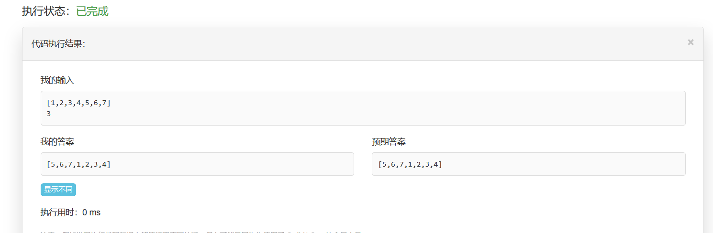

LeetCode

## 最大子序和

### 题目描述

给定一个整数数组 nums ，找到一个具有最大和的连续子数组（子数组最少包含一个元素），返回其最大和。

示例:
```
输入: [-2,1,-3,4,-1,2,1,-5,4],
输出: 6
解释: 连续子数组 [4,-1,2,1] 的和最大，为 6。
```
### 分析
最大子序列是要找出由数组成的一维数组中和最大的连续子序列。比如{5,-3,4,2}的最大子序列就是 {5,-3,4,2}，它的和是8,达到最大；而 {5,-6,4,2}的最大子序列是{4,2}，它的和是6。你已经看出来了，找最大子序列的方法很简单，只要前i项的和还没有小于0那么子序列就一直向后扩展，否则丢弃之前的子序列开始新的子序列，同时我们要记下各个子序列的和，最后找到和最大的子序列。
动态方程： 
最大子序列和是连续的子序列 
ThisSum[i]表示第i处，以A[i]结尾的子序列的最大和。 
则状态方程为ThisSum[i]=max(ThisSum[i-1]+nums[i],nums[i])
也即是说，如果ThisSum[i-1]<0则ThisSum[i]就是nums[i],否则ThisSum[i]=nums[i]+ThisSum[i-1]（因为是以i结尾的
### 代码
```java
package leetcode;

public class maxSubArray {

	public static void main(String[] args) {
		// TODO Auto-generated method stub
		int[] nums = {-2,1,-3,4,-1,2,1,-5,4};
		System.out.println(maxSubArray(nums));
	}
	public static int maxSubArray(int[] nums) {
        int r,l;
        int maxSum = nums[0],thisSum = nums[0];
        int new_l = 0;
        for(int i = 1; i < nums.length; i++) {
        	if(thisSum < 0) {
        		thisSum = nums[i];
        		new_l = i;
        	}else {
        		thisSum += nums[i];
        	}
        	if(thisSum > maxSum) {
        		maxSum = thisSum;
        		l = new_l;
        		r = i;
        	}
        }
        
        return maxSum;
    }
}

```
## 加一

### 题目描述

给定一个**非负整数**组成的**非空**数组，在该数的基础上加一，返回一个新的数组。

最高位数字存放在数组的首位， 数组中每个元素只存储一个数字。

你可以假设除了整数 0 之外，这个整数不会以零开头。

**示例 1:** 

```
输入: [1,2,3]
输出: [1,2,4]
解释: 输入数组表示数字 123。
```

**示例 2:** 

```
输入: [4,3,2,1]
输出: [4,3,2,2]
解释: 输入数组表示数字 4321。
```

### 分析

这题，一开始以为是给最后一个数+1，没想到是进位的问题，题目理解真是一知半解。。。语文还是要好好学的啊。

下面这个是我在百度中了解的：

将一个数字的每个位上的数字分别存到一个一维向量中，最高位在最开头，我们需要给这个数字加一，即在末尾数字加一，如果末尾数字是9，那么则会有进位问题，而如果前面位上的数字仍为9，则需要继续向前进位。

具体算法如下：首先判断最后一位是否为9，若不是，直接加一返回，若是，则该位赋0，再继续查前一位，同样的方法，知道查完第一位。如果第一位原本为9，加一后会产生新的一位，那么最后要做的是，查运算完的第一位是否为0，如果是，则在最前头加一个1。 

### 贴出来代码

```java
class Solution {
    public int[] plusOne(int[] digits) {
        int n = digits.length;
		for(int i = digits.length -1; i>=0;--i) {
			if(digits[i]<9) {
				++digits[i];
				return digits;
			}
			digits[i] =0;
		}
		int[] res = new int[n+1];
		res[0] =1;
		return res;
    }
}
```

## 合并两个有序数组

### 题目描述

给定两个有序整数数组 *nums1* 和 *nums2*，将 *nums2* 合并到 *nums1* 中*，*使得 *num1* 成为一个有序数组。

**说明:**

- 初始化 *nums1* 和 *nums2* 的元素数量分别为 *m* 和 *n*。
- 你可以假设 *nums1* 有足够的空间（空间大小大于或等于 *m + n*）来保存 *nums2* 中的元素。

**示例:**

```
输入:
nums1 = [1,2,3,0,0,0], m = 3
nums2 = [2,5,6],       n = 3

输出: [1,2,2,3,5,6]
```

### 分析

***思路1：***

```
先合并两个数组，再来排序
```

***思路2：***

```
从后往前填充即可

先当两个数组都有元素的时候填充大的到末尾，如果有一个数组的数用完了，说明剩下的那个数组的所有数都小于当前填充的位置：
如果是第一个数组用完了，说明剩下的(最小的那些)全是数组2，把数组2填充进去就好了
如果是第二个数组用完了，说明剩下的全是数组1，不用填充了，他们已经在了
```

### 贴出来代码

```java
public class Solution {
    public void merge(int[] nums1, int m, int[] nums2, int n) {
        int i = m - 1, j = n - 1, writeIdx = m + n - 1;
        while (i >= 0 && j >= 0)
            nums1[writeIdx--] = nums1[i] > nums2[j]? nums1[i--] : nums2[j--];
        while (j >= 0)
            nums1[writeIdx--] = nums2[j--];
    }
}
```

## 买卖股票的最佳时机II 

### 题目描述

给定一个数组，它的第 *i* 个元素是一支给定股票第 *i* 天的价格。

如果你最多只允许完成一笔交易（即买入和卖出一支股票），设计一个算法来计算你所能获取的最大利润。

注意你不能在买入股票前卖出股票。

**示例 1:**

```
输入: [7,1,5,3,6,4]
输出: 5
解释: 在第 2 天（股票价格 = 1）的时候买入，在第 5 天（股票价格 = 6）的时候卖出，最大利润 = 6-1 = 5 。
     注意利润不能是 7-1 = 6, 因为卖出价格需要大于买入价格。
```

**示例 2:** 

```
输入: [7,6,4,3,1]
输出: 0
解释: 在这种情况下, 没有交易完成, 所以最大利润为 0。
```

### 分析

1. 始终保存最小的买入价格
2. 始终保存最大的利润

比如数据2,7,1,3

首先找到最小买入是2，然后做差7-2=5，保存利润，然后到最小买入变成1，此时利润还是5，然后到3，注意，这里就是核心了。

如果1后面出现的数字足够大，大到和1做差的值大于5，那么最大利润值就改变，否则，最大利润还是5.

这里暗含的逻辑是，后面的数如果减1的差肯定比减2的差来的大。

### 贴出代码

 ```java
class Solution {
public int maxProfit(int[] prices) {
        if (prices == null || prices.length == 0) {
            return 0;
        }
        int profit = 0;
        for (int i = 1; i < prices.length; i++) {
            if (prices[i - 1] < prices[i]) {
                profit += prices[i] - prices[i - 1];
            }
        }
        return profit;
    }
};
 ```

## 买卖股票的最佳时机

### 题目描述

给定一个数组，它的第 *i* 个元素是一支给定股票第 *i* 天的价格。

如果你最多只允许完成一笔交易（即买入和卖出一支股票），设计一个算法来计算你所能获取的最大利润。

注意你不能在买入股票前卖出股票。

**示例 1:**

```
输入: [7,1,5,3,6,4]
输出: 5
解释: 在第 2 天（股票价格 = 1）的时候买入，在第 5 天（股票价格 = 6）的时候卖出，最大利润 = 6-1 = 5 。
     注意利润不能是 7-1 = 6, 因为卖出价格需要大于买入价格。
```

**示例 2:** 

```
输入: [7,6,4,3,1]
输出: 0
解释: 在这种情况下, 没有交易完成, 所以最大利润为 0。
```

### 分析

1. 始终保存最小的买入价格
2. 始终保存最大的利润

比如数据2,7,1，3

首先找到最小买入是2，然后做差7-2=5，保存利润，然后到最小买入变成1，此时利润还是5，然后到3，注意，这里就是核心了。

如果1后面出现的数字足够大，大到和1做差的值大于5，那么最大利润值就改变，否则，最大利润还是5.

这里暗含的逻辑是，后面的数如果减1的差肯定比减2的差来的大。

### 贴出代码

```java
class Solution {
    public int maxProfit(int[] prices) {
        int result =0;
        int buy = Integer.MAX_VALUE;
        for(int price : prices){
            buy = min(buy,price);
            result = max(result,price - buy);
        }
        return result;
    }
    public int max(int i,int j){
        return i>j?i:j;
    }
    public int min(int i,int j){
        return i<j?i:j;
    }
}
```

## 转置矩阵 

### 题目描述

给定一个矩阵 `A`， 返回 `A` 的转置矩阵。

矩阵的转置是指将矩阵的主对角线翻转，交换矩阵的行索引与列索引。

**示例 1：** 

```
输入：[[1,2,3],[4,5,6],[7,8,9]]
输出：[[1,4,7],[2,5,8],[3,6,9]]
```

**示例 2：** 

```
输入：[[1,2,3],[4,5,6]]
输出：[[1,4],[2,5],[3,6]]
```

### 分析

设数组中元素坐标位(x,y)，互换x,y位置即可

(x,y) --> (y,x)

所以重新设一个二维数组B

使得B.x=A[0].length

B.y=A.length

### 贴出代码

```java
class Solution {
    public int[][] transpose(int[][] A) {
        int m = A.length;
		int n = A[0].length;
		int[][] B = new int[n][m];
		for(int i =0;i<n;i++) {
			for(int j = 0;j<m;j++) {
				B[i][j] =A[j][i];
			}
		}
        return B;
    }
}
```

## 求众数

### 题目描述

给定一个大小为 *n* 的数组，找到其中的众数。众数是指在数组中出现次数**大于** `⌊ n/2 ⌋` 的元素。

你可以假设数组是非空的，并且给定的数组总是存在众数。

**示例 1:**

```
输入: [3,2,3]
输出: 3
```

**示例 2:** 

```
输入: [2,2,1,1,1,2,2]
输出: 2
```

### 分析

众数的定义，题目已经给出，要解决的问题是，如何让计算机知道数组中相同元素出现的次数。

思路一：

众数出现次数大于n/2，然后对数组排序，取中间的元素

思路二（百度得来）：

利用哈希表的映射，储存数组中的数字以及它们出现的次数，当众数出现时，返回这个数字。 


根据思路一，先对数组排序，然后取中间元素，结果超时，虽然答案对了，但是时间超过，这也不符合。

### 贴出来代码

```java

//思路二
class Solution {
    public int majorityElement(int[] nums) {
               
        Map<Integer,Integer> map = new HashMap<Integer,Integer>(); 
        int n = nums.length;
        
        for(int num : nums)   //统计每个元素出现的次数
        {
            Integer count = map.get(num);
            if(count == null) 
                count =1;
            else
                count++;
            map.put(num,count);
            
            if(map.get(num) > n/2)
                return num;
        }
        
        return 0;
    }
}
```

## 两数之和 II - 输入有序数组

### 题目描述

给定一个已按照**升序排列** 的有序数组，找到两个数使得它们相加之和等于目标数。

函数应该返回这两个下标值 index1 和 index2，其中 index1 必须小于 index2*。*

**说明:**

- 返回的下标值（index1 和 index2）不是从零开始的。
- 你可以假设每个输入只对应唯一的答案，而且你不可以重复使用相同的元素。

**示例:**

```
输入: numbers = [2, 7, 11, 15], target = 9
输出: [1,2]
解释: 2 与 7 之和等于目标数 9 。因此 index1 = 1, index2 = 2 。
```

### 分析

设置两套循环，j=i+1; 判断条件：numbers[i]+numbers[j] = target才算成功。

### 贴出代码

```java
class Solution {
    public int[] twoSum(int[] numbers, int target) {
         int[] index = new int[2];
        for(int i =0 ;i<numbers.length;i++){
            for(int j = i+1;j<numbers.length;j++){
                //System.out.println(index[0]+" "+index[1]);
                if(numbers[i]+numbers[j]==target){
                        index[0] = i +1;
                        index[1] = j+1;
                        break;
                }
            }
        }
        //System.out.println(index[0]);
        //System.out.println(index[1]);
        return index;
    }
}
```

# 杨辉三角

### 题目描述

给定一个非负整数 *numRows，*生成杨辉三角的前 *numRows* 行。


在杨辉三角中，每个数是它左上方和右上方的数的和。

**示例:**

```
输入: 5
输出:
[
     [1],
    [1,1],
   [1,2,1],
  [1,3,3,1],
 [1,4,6,4,1]
]
```

### 分析


根据上面那个图，我们可以发现，第一行和第二行都由1组成。其他行的起始和结束都是1.内容由上一行相邻两个数组和组成。由此我们可以写出代码。

### 贴出代码

```java
class Solution {
    public List<List<Integer>> generate(int numRows) {
        List<List<Integer>> res = new ArrayList<List<Integer>>();
        
        if(numRows == 0) 
        	return res;
        
        for(int j = 0;j<numRows;j++) {
        	List<Integer> row = new ArrayList<Integer>();
        	row.add(1);
        	
        for(int i = 1;i<j;i++) {
        	List<Integer> prevRow = res.get(j-1);
        	int temp = prevRow.get(i-1)+prevRow.get(i);
        	row.add(temp);
        }
        
        if(j!=0)
        	row.add(1);
        res.add(row);
        }
        return res;
    }
}
```

# 杨辉三角 II

### 题目描述

给定一个非负索引 *k*，其中 *k* ≤ 33，返回杨辉三角的第 *k* 行。


在杨辉三角中，每个数是它左上方和右上方的数的和。

**示例:**

```
输入: 3
输出: [1,3,3,1]
```

### 贴出代码

```java
class Solution {
    public List<Integer> getRow(int rowIndex) {
        List<Integer> list = new ArrayList<>();
        if(rowIndex < 0)
        	return list;
        list.add(1);
        if(rowIndex == 0)
        	return list;
        for(int i = 1;i<=rowIndex;i++) {
        	for(int j = list.size()-1;j>0;j--) {
        		list.set(j, list.get(j-1)+list.get(j));
        	}
        	list.add(1);
        }
        return list;
    }
}
```

# 旋转数组

### 题目描述

给定一个数组，将数组中的元素向右移动 *k* 个位置，其中 *k* 是非负数。

**示例 1:**

```
输入: [1,2,3,4,5,6,7] 和 k = 3
输出: [5,6,7,1,2,3,4]
解释:
向右旋转 1 步: [7,1,2,3,4,5,6]
向右旋转 2 步: [6,7,1,2,3,4,5]
向右旋转 3 步: [5,6,7,1,2,3,4]
```

**示例 2:**

```
输入: [-1,-100,3,99] 和 k = 2
输出: [3,99,-1,-100]
解释: 
向右旋转 1 步: [99,-1,-100,3]
向右旋转 2 步: [3,99,-1,-100]
```

**说明:**

- 尽可能想出更多的解决方案，至少有三种不同的方法可以解决这个问题。
- 要求使用空间复杂度为 O(1) 的原地算法。

### 分析

按照题目说明，要求空间复杂度为O(1)，并且这题有三种以上的解法。

1. 让数组插入到第一个数组之前。但这样空间复杂度就不是O(1)了。

这是错误的，超时了。不过能够得到正确答案。

```java
class Solution {
    public void rotate(int[] nums, int k) {
      int n = nums.length;
		while(k != 0){
			int temp = nums[n-1];
			nums[n-1] = 0;
			for(int i = n-2; i > -1 ; i--) {
				int temp1 = nums[i];
				nums[i+1] = temp1;
				nums[i] = 0;
			}
			nums[0] = temp;
			k--;
		}
    }
}
```




### 解法1

借助O(n)的空间解法。再利用`(i + k) % n = 旋转后的位置`，可以将原有数组中的数据复制到新数组中。

例如：

```repl
3元素在数组中的2位置上，(2+3) % 7 = 5
5元素在数组中的4位置上，(4+3) % 7 = 0
6元素在数组中的5位置上，(5+3) % 7 = 1
7元素在数组中的6位置上，(6+3) % 7 = 2
```

根据以上可以推断出，诸如将一个数组向右偏移或者旋转多少步等之类的题目，可以通过`(元素位置+偏移或旋转步数) 模与 数组长度`可以得到偏移或者旋转之后的`元素位置`。

这是代码最少的方法了，不过因为leetcode对函数的类型是void，没有返回值，符合题目要求，不符合oj运行。

```java
public int[] rotate(int[] nums, int k) {

    k =  k % nums.length;

    int[] result = new int[nums.length];

    for (int i = 0; i < nums.length; i++) {
        result[(i + k) % nums.length] = nums[i];
    }

    return result;
}
```

### 解法2

依旧可以利用`(i+k)%n`等于新`i`的思路，不过这次是每次调换一个元素，后一个元素的调换基于上一个的位置。

例如：让数组`[1,2,3,4,5,6,7]`向右旋转1，可以按照以下步骤来：

```java
public void rotate2(int[] nums, int k) {
    if (nums.length == 0 || (k %= nums.length) == 0) {
        return;
    }
    int length = nums.length;
    int start = 0;
    int i = 0;
    int cur = nums[i];
    int cnt = 0;

    while (cnt++ < length) {
        i = (i + k) % length;
        int t = nums[i];
        nums[i] = cur;
        if (i == start) {
            ++start;
            ++i;
            cur = nums[i];
        } else {
            cur = t;
        }
    }
}
```

# 存在重复元素

### 题目描述

给定一个整数数组，判断是否存在重复元素。

如果任何值在数组中出现至少两次，函数返回 true。如果数组中每个元素都不相同，则返回 false。

**示例 1:**

```
输入: [1,2,3,1]
输出: true
```

**示例 2:**

```
输入: [1,2,3,4]
输出: false
```

**示例 3:**

```
输入: [1,1,1,3,3,4,3,2,4,2]
输出: true
```

### 分析

这是一道很简单的题，只需要遍历数组就可以，而且不用全部依次遍历，简单点的方法就是先对数组排完序，然后依次对比是否相等。

### 贴出代码

```java
class Solution {
    public boolean containsDuplicate(int[] nums) {
        Arrays.sort(nums);
		for(int i = 0; i < nums.length-1; i++) {
			if(nums[i] == nums[i+1]) {
				return true;
			}
		}
		return false;
    }
}
```

# 存在重复元素 II

### 题目描述

给定一个整数数组和一个整数 *k*，判断数组中是否存在两个不同的索引 *i* 和 *j*，使得 **nums [i] = nums [j]**，并且 *i* 和 *j* 的差的绝对值最大为 *k*。

**示例 1:**

```
输入: nums = [1,2,3,1], k = 3
输出: true
```

**示例 2:**

```
输入: nums = [1,0,1,1], k = 1
输出: true
```

**示例 3:**

```
输入: nums = [1,2,3,1,2,3], k = 2
输出: false
```

### 分析

利用HashMap数据结构，每次存入数值钱先看一下有没有这个数了，如果已经有了，那么看一下这两个数的索引下标之差是不是小于等于k的，如果是的话那么久说明找到了，返回true，如果没有找到就返回false。

### 贴出代码

```java
class Solution {
    public boolean containsNearbyDuplicate(int[] nums, int k) {
        HashMap<Integer,Integer> hm = new HashMap<>();
		for(int i = 0; i < nums.length; i++) {
			if(hm.containsKey(nums[i])) {
				int sub = i - hm.get(nums[i]);
				if(sub <= k) 
					return true;
				else 
					hm.put(nums[i], i);
		
			}else 
				hm.put(nums[i], i);
		
		}
        	return false;
    }	
}
```

# 缺失数字

### 题目描述

给定一个包含 `0, 1, 2, ..., n` 中 *n* 个数的序列，找出 0 .. *n* 中没有出现在序列中的那个数。

**示例 1:**

```
输入: [3,0,1]
输出: 2
```

**示例 2:**

```
输入: [9,6,4,2,3,5,7,0,1]
输出: 8
```

**说明:**
 你的算法应具有线性时间复杂度。你能否仅使用额外常数空间来实现?

### 分析

我们就简单把这道题当成一道数学题来算就可以了，因为是连续的，所以不缺失数字时候的加和可以计算，缺失数字之后的加和遍历一遍也可以计算出来，二者相减不就是缺失的数字了。

### 贴出代码

```java
class Solution {
    public int missingNumber(int[] nums) {
        int res = nums.length;
        for(int i = 0; i < nums.length; i++){
            res +=(i-nums[i]);
        }
        return res;
    }
}
```

# 移动零

### 题目描述

给定一个数组 `nums`，编写一个函数将所有 `0` 移动到数组的末尾，同时保持非零元素的相对顺序。

**示例:**

```
输入: [0,1,0,3,12]
输出: [1,3,12,0,0]
```

**说明**:

1. 必须在原数组上操作，不能拷贝额外的数组。
2. 尽量减少操作次数。

### 分析

使用使用两个索引`lastIndex`和`curIndex`，`curIndex`从后向前遍历直到其元素为`0`，然后根据`lastIndex`与`curIndex`之间的差值，将元素前移。

### 贴出代码

```java
class Solution {
    public void moveZeroes(int[] nums) {
        int curIndex = nums.length - 1;
		int lastIndex = nums.length - 1;
		//int count = 0;
		
		while(curIndex >= 0) {
			if(nums[curIndex] == 0) {
				int count = lastIndex - curIndex;
				for(int i = 0;i < count; i++) {
					nums[curIndex + i] = nums[curIndex + i + 1];
				}//元素往前移动
				nums[lastIndex] = 0;
				lastIndex--;
			}
			curIndex--;
		}
    }
}
```

