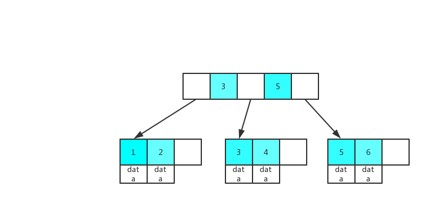

# InnoDB索引总结
索引是应用程序设计和开发的一个重要方面。若索引太多，应用程序的性能可能会受到影响。而索引太少，对查询性能又会产生影响。

# B+ Tree原理

### 数据结构

B Tree指的是Balance Tree，也就是平衡树。平衡树是一颗查找树，并且所有叶子节点位于同一层。

B+ Tree是基于B Tree和叶子节点顺序访问指针j进行实现，它具有B Tree的平衡性，并且通过顺序访问指针来提高区间查询的性能。

在B+ Tree中，一个节点中的key从左到右非递减排列，如果某个指针的左右相邻key分别是keyi和keyi+1。

### 操作

进行查找操作时，首先在根节点进行二分查找，找到一个key所在的指针，然后递归地在指针所指向的节点进行查找。直到查找叶子节点，然后在叶子节点上进行二分查找，找出key所对应的data。

插入删除操作会破坏平衡树的平衡性，因此在插入删除操作之后，需要对树进行一个分裂、合并、旋转等操作来维护平衡性。

### 与红黑树的比较

红黑树等平衡树也可以用来实现索引，但是文件系统及数据库系统普遍采用B+ Tree作为索引结构，主要有以下两个原因：

（一）更少的查找次数

平衡树查找操作的时间复杂度和树高 h 相关，O(h)=O(logdN)，其中 d 为每个节点的出度。红黑树的出度为 2，而 B+ Tree 的出度一般都非常大，所以红黑树的树高 h 很明显比 B+ Tree 大非常多，查找的次数也就更多。

（二）利用磁盘预读特性

为了减少磁盘 I/O 操作，磁盘往往不是严格按需读取，而是每次都会预读。预读过程中，磁盘进行顺序读取，顺序读取不需要进行磁盘寻道，并且只需要很短的磁盘旋转时间，速度会非常快。操作系统一般将内存和磁盘分割成固定大小的块，每一块称为一页，内存与磁盘以页为单位交换数据。数据库系统将索引的一个节点的大小设置为页的大小，使得一次 I/O 就能完全载入一个节点。并且可以利用预读特性，相邻的节点也能够被预先载入。

# InnoDB存储引擎索引概述

InnoDB存储引擎支持以下几种常见的索引：
## B+树索引

## 全文索引

## 自适应哈希索引

# 数据结构和算法

# 参考资料
- 姜承尧.MySQL计数内幕 InnoDB存储引擎（第二版）[M].机械工业出版社，2013.
- Baron Scbwartz等 著，王小东等 译；高性能MySQL（High Performance MySQL）(第三版)；电子工业出版社，2013
- [MySQL索引背后的数据结构及算法原理](http://blog.codinglabs.org/articles/theory-of-mysql-index.html)