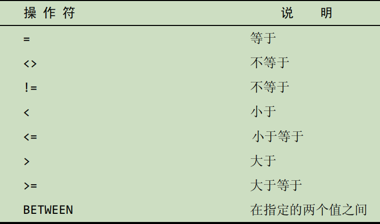

# 检索数据

将介绍如何使用SELECT语句从表中检索一个或多个数据列。

## 检索单个列

**输入**

```sql
SELECT prod_name FROM products;
```

**分析**

上述语句利用SELECT语句从products表中检索一个名为prod_name的列。所需的列名在SELECT关键字之后给出，FROM关键字指出从其中检索数据的表名。

## 检索多个列

在选择多个列时，一定要在列名之间加上逗号，但最后一个列名后不加。

**输入**

```sql
SELECT prod_id, prod_name, prod_price FROM products;
```

**分析**

与前一个列子一样，这条语句使用SELCT语句从表products中选择数据。

## 检索所有列

**输入**

```sql
SELECT * FROM products;
```

**分析**

如果给定一个通配符（*），则返回表中所有列。列的顺序一般是列在表中定义中出现的顺序。但有时候并不是这样的，表的模式的变化（如添加或删除列）可能会导致顺序的变化。

## 检索不同的行

使用`DISTINCT`关键字，指示MySQL只返回不同的值。

**输入**

```sql
SELECT DISTINCT vend_id FROM products;
```

## 限制结果

为了返回第一行或前几行，可使用LIMIT子句。

**输入**

```sql
SELECT prod_name FROM products LIMIT 5;
```

**分析**

此语句使用SELECT语句检索单个列。LIMIT 5指示MySQL返回不多于5行。

**输入**

```sql
SELECT prod_name FROM products LIMIT 5, 5;
```

**分析**

LIMIT 5, 5只是MySQL返回从行5开始的5行。


行0 检索出来的第一行为行0而不是行1


## 使用完全限定的表名

迄今为止使用的SQL例子只通过列名引用列。也可能会使用完全限定的名字来引用列（同时使用表名和列字）。

**输入**

```sql
SELECT products.prod_name FROM products;
```

这条语句等同于

```sql
SELECT prod_name FROM products;
```

表名也可以是完全限定的，如下所示：

**输入**

```sql
SELECT produrcts.prod_name FROM crashcourse.productsl
```

这条语句在功能上也等于刚使用的那条语句。

# 排序检索数据

## 按多个列排序

下面的代码检索3个列，并按其中两个列对结果进行排序——首先按价格，然后再按名称排序。

**输入**

```sql
SELECT prod_id, prod_price, prod_name FROM products ORDER BY prod_price, prod_name;
```


## 指定排序方向

下面的例子按价格以降序排序产品

**输入**

```sql
SELECT prod_id, prod_price, prod_name FROM products ORDER BY prod_price DESC;
```

如果打算用多个列排序怎么办？

**输入**

```sql
SELECT prod_id, prod_price, prod_name FROM products ORDER BY prod_price DESC, prod_name;
```


**分析**

DESC关键字只应用到直接位于其前面的列名。


与DESC相反的关键字是ASC（ASCENDING），在升序排序时可以指定它。

使用ORDER BY 和LIMIT的组合，能够找出一个列中最高或最低的值。

**输入**

```sql
SELECT prod_price FROM products ORDER BY prod_price DESC LIMIT 1;
```


**分析**

prod_price DESC保证行是按照由最昂贵到最便宜检索的，而LIMIT 1告诉MySQL仅返回一行。


# 过滤数据

## 使用WHERE子句

数据库表一般包含大量的数据，很少需要检索表中所有行。通常只会根据特定操作或报告的需要提取表数据的子集。只检索所需数据需要指定搜索条件（search criteria），搜索条件也称为过滤条件（filter condition）。

在SELECT语句中，数据根据WHERE子句中指定的搜索条件进行过滤。WHERE子句在表名（FROM子句）之后给出。

**输入**

```sql
SELECT prod_name, prod_price FROM products WHERE prod_price = 2.50;
```

**分析**

这条语句从products表中检索两个列，但不返回所有行，只返回prod_price值为2.50的行

## WHERE子句操作符



### 检索单个值

**输入**

```sql
SELECT prod_name, prod_price FROM products WHERE prod_name = 'fuses';
```

**分析**

检查WHERE prod_name='fusesd'语句，它返回prod_name的值为Fuses的一行。

### 不匹配检查

以下例子列出不是由供应商1003制造的所有产品：

**输入**

```sql
SELECT vend_id, prod_name FROM products WHERE vend_id <> 1003;
```

### 范围值检查

为了检查某个范围的值，可使用BETWEEN操作符。

下面的例子说明如何使用BETWEEN操作符，它检索价格在5美元和10美元之间的所有产品：

**输入**

```sql
SELECT prod_name, prod_price FROM products WHERE prod_price BETWEEN 5 AND 10;
```

**分析**

从这个例子中可以看到，在使用BETWEEN时，必须指定两个值——所需范围的低端值和高端值。

### 空值检查

在创建表时，表设计人员可以指定其中的列是否可以不包含值。在一个列不包含值时，称其为包含控制NULL。

SELECT语句有一个特殊的WHERE子句，可用来检查具有NULL值的列。这个WHERE子句就是IS NULL子句。

**输入**

```SQL
SELECT prod_name FROM products WHERE prod_price IS NULL;
```

# 数据过滤

