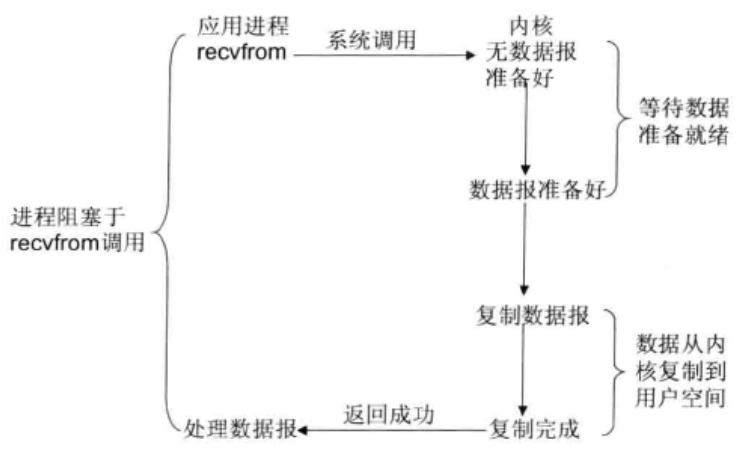
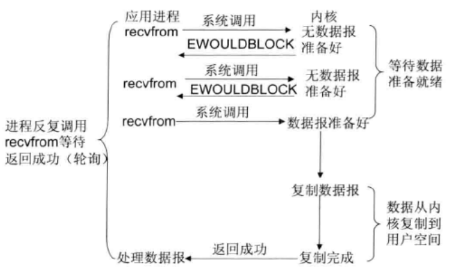
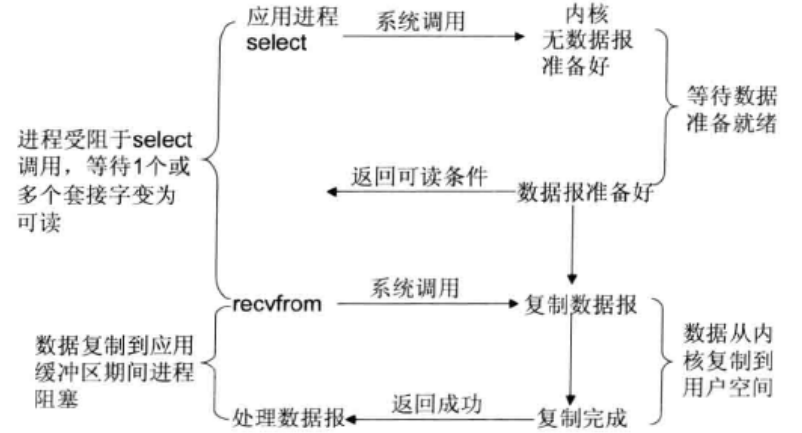
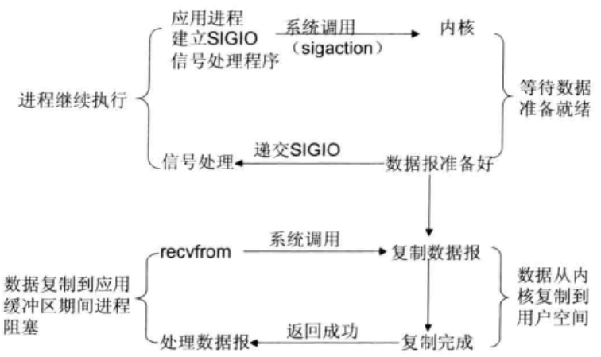
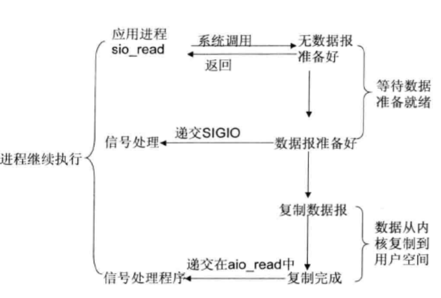

# 阻塞I/O模型

最常用的I/O模型就是阻塞I/O模型，缺省情形下，所有文件操作都是阻塞的。我们以套接字接口为例来讲解此模型：在进程空间中调用recvfrom，其系统调用直到数据报到达且被复制到应用进程的缓冲区中或者发生错误时才返回，在此期间一直会等待，进程在从调用recvfrom开始到它返回的整段时间内都是被阻塞的，因此被称为阻塞I/O模型。

# 非阻塞I/O模型

recvfrom从应用层到内核的时候，如果该缓冲区没有数据的话，就直接返回一个EWOULDBLOCK错误，一般都对非阻塞I/O模型进行轮询检查这个状态，看内核是不是有数据到来。

# I/O复用模型

Linux提供select/poll，进程通过将一个或多个fd传递给select或poll系统调用，阻塞在select操作上，这样select/poll可以帮我们侦测多个fd是否处于就绪状态。select/poll是顺序扫描fd是否就绪，而且支持的fd数量有限，因此它的使用受到一些制约。Linux还提供了一个epoll系统调用，epoll使用基于事件驱动方式代替顺序扫描，因此性能更高。当fd就绪时，立即回调函数rollback。

# 信号驱动I/O模型

首先开启套接口信号驱动I/O功能，并通过系统调用sigaction执行一个信号处理函数（此系统调用立即返回，进程继续工作，它是非阻塞的）。当数据准备就绪时，就为该进程生成一个SIGIO信号，通过信号回调通知应用程序调用recvfrom来读取数据，并通过主循环函数处理数据。

# 异步I/O

告知内核启动某个操作，并让内核在整个操作完成后（包括将数据从内核复制到用户自己的缓冲区）通知我们。这种模型与信号驱动模型的主要区别是：信号驱动I/O由内核通知我们何时可以开始一个I/O操作；异步I/O模型由内核通知我们I/O操作何时已经完成。

