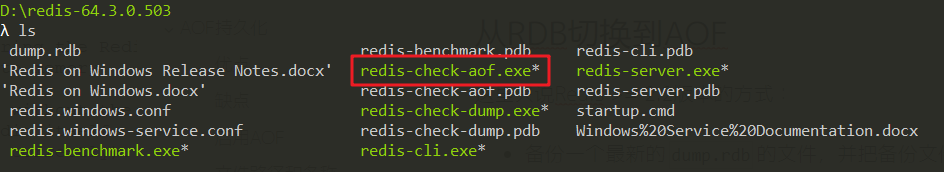

# Redis持久化

Redis提供了不同的持久化选项：

- **RDB持久化**以指定的时间间隔保存那个时间点的数据快照。
- **AOF持久化**方法则会记录每一个服务器收到的写操作。在服务器启动时，这些记录的操作会逐条执行从而重建出原来的数据。写操作命令记录的格式跟Redis协议一致，以追加的方式进行保存。
- Redis的持久化时可以禁用的，就是说你可以让数据的生命周期只存在服务器的运行时间里。
- 两种方式的持久化是可以同时存在的，但是当Redis重启时，AOF文件会被`优先`用于重建数据。

最重要的是要理解RDB和AOF持久化之间的不同区别。

# RDB持久化

## RDB文件的创建和载入

有两个Redis命令可以用于生成RDB文件，一个是**SAVE**，另一个是**BGSAVE**。

**SAVE**命令会阻塞Redis服务器进程，直到RDB文件创建完毕为止，在服务器进程阻塞期间，服务器不能处理任何命令请求：


和**SAVE**命令直接阻塞服务器进程的做法不同，BGSAVE命令会去派生出一个子进程，然后由紫禁城负责创建RDB文件，服务器进程（父进程）继续处理命令请求：


## RDB的优势

- RDB文件是一个经过压缩的二进制文件，保存着某个时间点的Redis数据。RDB文件非常适合备份。你可以设定一个时间点对RDB文件进行归档，这样就能在需要的时候很轻易的把数据恢复到不同的版本。
- RDB非常适用于**灾备**。单文件很方便传输到远程的服务器上。
- RDB的性能很好，需要进行持久化时，主进程会fork一个子进程出来，然后把持久化工作交给子进程，自己不会有相关的I/O操作，也就是上面说是的**BGSAVE**。
- 比起AOF，在数据量比较大的情况下，RDB的启动速度更快。

## RDB的缺点

- RDB容易造成数据的丢失。假设每5分钟保存一次快照，如果Redis因为某些原因不能工作，那么从上次产生快照到Redis出现问题这段时间的数据就会丢失了。上述的**SAVE**缺点。
- RDB使用**fork()**产生子进程进行数据的持久化，如果数据比较大可能就会花费点时间，造成Redis停止服务几毫秒。如果数据很大且CPU性能不是很好的时候，停止服务的时间甚至更多。上述的**BGSAVE**缺点。

## 文件路径和名称

默认Redis会把快照文件存储为当前目录下一个名为`dump.rdb`的文件。要修改文件的存储路径和名称，可以通过修改配置文件`redis.conf`实现：

```
# RDB文件名，默认为dump.rdb。
dbfilename dump.rdb

# 文件存放的目录，AOF文件同样存放在此目录下。默认为当前工作目录。
dir ./
```


## 保存点（RDB的启用和禁用）

你可以配置保存点，使Redis如果在每N秒后数据发生了M次改变就保存快照文件。例如下面这个保存点配置表示每60秒，如果数据发生了1000次以上的变动，Redis就会自动保存快照文件：

```
save 60 1000
```

保存点可以设置多个，Redis的配置文件就默认设置了3个保存点：

```
# 格式为：save <seconds> <changes>
# 可以设置多个。
save 900 1 #900秒后至少1个key有变动
save 300 10 #300秒后至少10个key有变动
save 60 10000 #60秒后至少10000个key有变动
```

如果想禁用快照保存的功能，可以通过注释掉所有"save"配置达到，或者在最后一条"save"配置后添加如下的配置：

```
save ""
```

## 错误处理

默认情况下，如果Redis在后台生成快照的时候失败，那么就会停止接收数据，目的是让用户能知道数据没有持久化成功。但是如果你有其他的方式可以监控到Redis及其持久化的状态，那么可以把这个功能禁止掉。

```
stop-writes-on-bgsave-error yes
```

## 数据压缩

默认Redis会采用`LZF`对数据进行压缩。如果你想节省点CPU的性能，你可以把压缩功能禁用掉，但是数据集就会比没压缩的时候要打。

```
rdbcompression yes
```

## 数据校验

从版本5的RDB的开始，一个`CRC64`的校验码会放在文件的末尾。这样更能保证文件的完整性，但是在保存或者加载文件时会损失一定的性能（大概10%）。如果想追求更高的性能，可以把它禁用掉，这样文件在写入校验码时会用`0`替代，加载的时候看到`0`就会直接跳过校验。

```
rdbchecksum yes
```

# AOF持久化

快照并不是很可靠。如果你的电脑突然宕机了，或者电源断了，又或者不小心杀掉了进程，那么最新的数据就会丢失。而AOF文件则提供了一种更为可靠的持久化方式。每当Redis接受到会修改数据集的命令时，就会把命令追加到AOF文件里，当你重启Redis时，AOF里的命令会被重新执行一次，重建数据。

使用AOF持久化需要设置同步选项，从而确保命令同步到磁盘文件上的时机。这是因为文件进行写入b并不会马上将内容同步到磁盘上，而是先存储到缓冲区，然后由操作系统决定什么时候同步到磁盘。有以下同步选项：

| **选项** | **同步频率**             |
| -------- | ------------------------ |
| always   | 每个写命令都同步         |
| everysec | 每秒同步一次             |
| no       | 让操作系统来决定何时同步 |


## 优点

- 比RDB可靠。你可以制定不同的fsync策略：不进行fsync、每秒fsync一次和每次查询进行fsync。默认是每秒fsync一次。这意味着你最多丢失一秒钟的数据。
- AOF日志文件是一个纯追加的文件。就算是遇到突然停电的情况，也不会出现日志的定位或者损坏问题。甚至如果因为某些原因（例如磁盘满了）命令只写了一半到日志文件里，我们也可以用`redis-check-aof`这个工具很简单的进行修复。
- 当AOF文件太大时，Redis会自动在后台进行重写。重写很安全，因为重写是在一个新的文件上进行，同时Redis会继续往旧的文件追加数据。新文件上会写入能重建当前数据集的最小操作命令的集合。当新文件重写完，Redis会把新旧文件进行切换，然后开始把数据写到新文件上。
- AOF把操作命令以简单易懂的格式一条接一条的保存在文件里，很容易导出来用于恢复数据。例如我们不小心用`FLUSHALL`命令把所有数据刷掉了，只要文件没有被重写，我们可以把服务停掉，把最后那条命令删掉，然后重启服务，这样就能把被刷掉的数据恢复回来。

## 缺点

- 在相同的数据集下，AOF文件的大小一般会比RDB文件大。
- 在某些fsync策略下，AOF的速度会比RDB慢。通常fsync设置为每秒一次就能获得比较高的性能，而在禁止fsync的情况下速度可以达到RDB的水平。
- 在过去曾经发现一些很罕见的BUG导致使用AOF重建的数据跟原数据不一致的问题。

## 启用AOF

把配置项`appendonly`设为`yes`：

```
appendonly yes
```


## 文件路径和名称

```
# 文件存放目录，与RDB共用。默认为当前工作目录。
dir ./

# 默认文件名为appendonly.aof
appendfilename "appendonly.aof"
```

## 可靠性

你可以配置Redis调用fsync的频率，有三个选项：

- 每当有新命令追加到AOF的时候调用fsync。速度最慢，但是最安全。
- 每秒fsync一次。速度快（2.4版本跟快照方式速度差不多），安全性不错（最多丢失1秒的数据）。
- 从不fsync，交由系统去处理。这个方式速度最快，但是安全性一般。

推荐使用每秒fsync一次的方式（默认的方式），因为它速度快，安全性也不错。相关配置如下：

```
# appendfsync always
appendfsync everysec
# appendfsync no
```


## 日志重写

随着写操作的不断增加，AOF文件会越来越大。例如你递增一个计数器100次，那么最终结果就是数据集里的计数器的值为最终的递增结果，但是AOF文件里却会把这100次操作完整的记录下来。而事实上要恢复这个记录，只需要1个命令就行了，也就是说AOF文件里那100条命令其实可以精简为1条。所以Redis支持这样一个功能：在不中断服务的情况下在后台重建AOF文件。

工作原理如下：

- Redis调用fork()，产生一个子进程。
- 子进程把新的AOF写到一个临时文件里。
- 主进程持续把新的变动写到内存里的buffer，同时也会把这些新的变动写到旧的AOF里，这样即使重写失败也能保证数据的安全。
- 当子进程完成文件的重写后，主进程会获得一个信号，然后把内存里的buffer追加到子进程生成的那个新AOF里。
- Redis

我们可以通过配置设置日志重写的条件：

```
# Redis会记住自从上一次重写后AOF文件的大小（如果自Redis启动后还没重写过，则记住启动时使用的AOF文件的大小）。
# 如果当前的文件大小比起记住的那个大小超过指定的百分比，则会触发重写。
# 同时需要设置一个文件大小最小值，只有大于这个值文件才会重写，以防文件很小，但是已经达到百分比的情况。

auto-aof-rewrite-percentage 100
auto-aof-rewrite-min-size 64mb
```


要禁用自动的日志重写功能，我们可以把百分比设置为0：

```
auto-aof-rewrite-percentage 0
```

> Redis 2.4以上才可以自动进行日志重写，之前的版本需要手动运行[BGREWRITEAOF](http://redis.io/commands/bgrewriteaof)这个命令。

## 数据损坏修复

如果因为某些原因（例如服务器崩溃）AOF文件损坏了，导致Redis加载不了，可以通过以下方式进行修复：

- 备份AOF文件。

- 使用`redis-check-aof`命令修复原始的AOF文件：

  ```
  $ redis-check-aof --fix
  ```

  

- 可以使用`diff -u`命令看下两个文件的差异。

- 使用修复过的文件重启Redis服务。

### 从RDB切换到AOF

这里只说Redis >= 2.2版本的方式：

- 备份一个最新的`dump.rdb`的文件，并把备份文件放在一个安全的地方。

- 运行以下两条命令：

  ```
  $ redis-cli config set appendonly yes
  $ redis-cli config set save ""
  ```

- 确保数据跟切换前一致。

- 确保数据正确的写到AOF文件里。

> 第二条命令是用来禁用RDB的持久化方式，但是这不是必须的，因为你可以同时启用两种持久化方式。

> 记得对配置文件`redis.conf`进行编辑启用AOF，因为命令行方式修改配置在重启Redis后就会失效。

# 备份

### 建议的备份方法：

- 创建一个定时任务，每小时和每天创建一个快照，保存在不同的文件夹里。
- 定时任务运行时，把太旧的文件进行删除。例如只保留48小时的按小时创建的快照和一到两个月的按天创建的快照。
- 每天确保一次把快照文件传输到数据中心外的地方进行保存，至少不能保存在Redis服务所在的服务器。

# 参考

- 黄健宏. Redis 设计与实现 [M]. 机械工业出版社, 2014.
- https://redis.io/topics/persistence