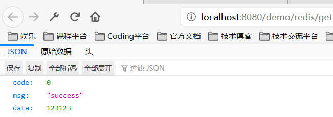
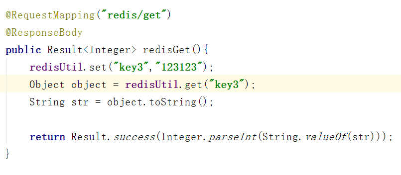

# 前言
想做一个秒杀项目，问了几个大佬要了项目视频，结果，自己本地实践的时候，发现不太一样，所以写下这篇，为以后做准备。
# 环境配置
- IDE：IDEA
- 环境：Windows
- 数据库：Redis

# Maven配置
习惯用SpringBoot的小伙伴都知道，需要配置Maven，添加几个dependency。
```xml
<dependency>
  <groupId>org.springframework.boot</groupId>
  <artifactId>spring-boot-starter-web</artifactId>
</dependency>
<dependency>
  <groupId>org.springframework.boot</groupId>
  <artifactId>spring-boot-starter-data-redis</artifactId>
</dependency>
```

# application.properties中加入redis相关配置
```properties
# Redis数据库索引（默认为0）  
spring.redis.database=0  
# Redis服务器地址  
spring.redis.host=localhost
# Redis服务器连接端口 
spring.redis.port=6379  
# Redis服务器连接密码（默认为空）  
spring.redis.password=  
# 连接池最大连接数（使用负值表示没有限制） 
spring.redis.pool.max-active=200  
# 连接池最大阻塞等待时间（使用负值表示没有限制）  
spring.redis.pool.max-wait=-1  
# 连接池中的最大空闲连接  
spring.redis.pool.max-idle=10 
# 连接池中的最小空闲连接
spring.redis.pool.min-idle=0  
# 连接超时时间（毫秒）  
spring.redis.timeout=1000 
```

# RedisConfig
```java
import com.fasterxml.jackson.annotation.JsonAutoDetect;
import com.fasterxml.jackson.annotation.PropertyAccessor;
import com.fasterxml.jackson.databind.ObjectMapper;
import org.springframework.context.annotation.Bean;
import org.springframework.context.annotation.Configuration;
import org.springframework.data.redis.connection.RedisConnectionFactory;
import org.springframework.data.redis.core.RedisTemplate;
import org.springframework.data.redis.serializer.Jackson2JsonRedisSerializer;
import org.springframework.data.redis.serializer.StringRedisSerializer;
/**
 * @author: Tu9ohost
 */
@Configuration
public class RedisConfig {

    @Bean
    @SuppressWarnings("all")
    public RedisTemplate<String, Object> redisTemplate(RedisConnectionFactory factory){
        RedisTemplate<String, Object> template = new RedisTemplate<String, Object>();
        template.setConnectionFactory(factory);
        Jackson2JsonRedisSerializer jackson2JsonRedisSerializer = new Jackson2JsonRedisSerializer(Object.class);
        ObjectMapper om = new ObjectMapper();
        om.setVisibility(PropertyAccessor.ALL, JsonAutoDetect.Visibility.ANY);
        om.enableDefaultTyping(ObjectMapper.DefaultTyping.NON_FINAL);
        jackson2JsonRedisSerializer.setObjectMapper(om);
        StringRedisSerializer stringRedisSerializer = new StringRedisSerializer();
        template.setKeySerializer(stringRedisSerializer);
        template.setHashKeySerializer(stringRedisSerializer);
        template.setValueSerializer(jackson2JsonRedisSerializer);
        template.setHashValueSerializer(jackson2JsonRedisSerializer);
        template.afterPropertiesSet();
        return template;
    }
}
```

# RedisUtil工具类
```java
import org.springframework.beans.factory.annotation.Autowired;
import org.springframework.data.redis.core.RedisTemplate;
import org.springframework.stereotype.Component;
import org.springframework.util.CollectionUtils;

import java.util.List;
import java.util.Map;
import java.util.Set;
import java.util.concurrent.TimeUnit;

/**
 * @author: Tu9ohost
 */
@Component
public class RedisUtil {
    @Autowired
    private RedisTemplate<String,Object> redisTemplate;

    /**
     * 指定缓存失效时间
     * @param key
     * @param time
     * @return
     */
    public boolean expire(String key, long time){
        try{
            if (time > 0){
                redisTemplate.expire(key,time, TimeUnit.SECONDS);
            }
            return true;
        }catch (Exception e){
            e.printStackTrace();
            return false;
        }
    }

    /**
     * 根据key获取过期时间
     * @param key
     * @return
     */
    public long getExpire(String key){
        return redisTemplate.getExpire(key,TimeUnit.SECONDS);
    }

    /**
     *
     * @param key
     * @return
     */
    public boolean hasKey(String key){
       try {
           return redisTemplate.hasKey(key);
       }catch (Exception e){
           e.printStackTrace();
           return false;
       }
    }

    /**
     * 删除缓存
     * @param key
     */
    @SuppressWarnings("unchecked")
    public void del(String... key){
        if (key != null && key.length > 0){
            if (key.length == 1){
                redisTemplate.delete(key[0]);
            }else{
                redisTemplate.delete(CollectionUtils.arrayToList(key));
            }
        }
    }

    /**
     * 普通缓存获取
     * @param key
     * @return
     */
    public Object get(String key){
        return key == null ? null : redisTemplate.opsForValue().get(key);
    }

    /**
     * 普通缓存放入
     * @param key
     * @param value
     * @return
     */
    public boolean set(String key, Object value){
        try {
            redisTemplate.opsForValue().set(key,value);
            return true;
        }catch (Exception e){
            e.printStackTrace();
            return false;
        }
    }

    /**
     * 普通缓存放入并设置时间
     * @param key
     * @param value
     * @param time
     * @return
     */
    public boolean set(String key,Object value, long time){
        try {
            if (time > 0){
                redisTemplate.opsForValue().set(key,value,time,TimeUnit.SECONDS);
            }else{
                set(key,value);
            }
            return true;
        }catch (Exception e){
            e.printStackTrace();
            return false;
        }
    }

    /**
     * 递增
     * @param key
     * @param delta
     * @return
     */
    public long incr(String key, long delta){
        if (delta < 0){
            throw new RuntimeException("递增因子必须大于0");
        }
        return redisTemplate.opsForValue().increment(key,delta);
    }

    public long decr(String key, long delta){
        if (delta < 0){
            throw new RuntimeException("递减因子必须大于0");
        }
        return redisTemplate.opsForValue().increment(key,-delta);
    }

    /**
     * HashGet
     * @param key
     * @param item
     * @return
     */
    public Object hget(String key,String item){
        return redisTemplate.opsForHash().get(key,item);
    }

    /**
     * 获取hashKey对应的所有键值
     * @param key
     * @return
     */
    public Map<Object,Object> hmget(String key){
        return redisTemplate.opsForHash().entries(key);
    }

    /**
     * HashSet
     * @param key
     * @param map
     * @return
     */
    public boolean hmset(String key,Map<String,Object> map){
        try {
            redisTemplate.opsForHash().putAll(key,map);
            return true;
        }catch (Exception e){
            e.printStackTrace();
            return false;
        }
    }

    /**
     * HashSet 并设置时间
     * @param key
     * @param map
     * @param time
     * @return
     */
    public boolean hmset(String key, Map<String,Object> map,long time){
        try {
            redisTemplate.opsForHash().putAll(key,map);
            if (time > 0){
                expire(key,time);
            }
            return true;
        }catch (Exception e){
            e.printStackTrace();
            return false;
        }
    }

    /**
     * 向一张hash表中放入数据，如果不存在将创建
     * @param key
     * @param item
     * @param value
     * @return
     */
    public boolean hset(String key,String item, Object value){
        try {
            redisTemplate.opsForHash().put(key,item,value);
            return true;
        }catch (Exception e){
            e.printStackTrace();
            return false;
        }
    }

    /**
     * 向一张hash表中放入数据，如果不存在将创建
     * @param key
     * @param item
     * @param value
     * @param time
     * @return
     */
    public boolean hset(String key,String item,Object value,long time){
        try {
            redisTemplate.opsForHash().put(key,item,value);
            if (time > 0){
                expire(key,time);
            }
            return true;
        }catch (Exception e){
            e.printStackTrace();
            return false;
        }
    }

    /**
     * 删除hash表中的值
     * @param key
     * @param item
     */
    public void hdel(String key, Object... item){
        redisTemplate.opsForHash().delete(key,item);
    }

    /**
     * 判断hash表中是否有该项的值
     * @param key
     * @param item
     * @return
     */
    public boolean hHasKey(String key,String item){
        return redisTemplate.opsForHash().hasKey(key,item);
    }

    /**
     * hsah递增 如果不存在，就会创建一个 并把新增后的值返回
     * @param key
     * @param item
     * @param by
     * @return
     */
    public double hincr(String key,String item,double by){
        return redisTemplate.opsForHash().increment(key,item,by);
    }

    /**
     * hash递减
     * @param key
     * @param item
     * @param by
     * @return
     */
    public double hdecr(String key,String item,double by){
        return redisTemplate.opsForHash().increment(key,item,-by);
    }

    /**
     * 根据key获取Set中的所有值
     * @param key
     * @return
     */
    public Set<Object> sGet(String key){
        try {
            return redisTemplate.opsForSet().members(key);
        }catch (Exception e){
            e.printStackTrace();
            return null;
        }
    }

    /**
     * 根据value从一个set中查询，是否存在
     * @param key
     * @param value
     * @return
     */
    public boolean sHasKey(String key,Object value){
        try {
            return redisTemplate.opsForSet().isMember(key,value);
        }catch (Exception e){
            e.printStackTrace();
            return false;
        }
    }

    /**
     * 将数据放入set缓存
     * @param key
     * @param values
     * @return
     */
    public long sSet(String key,Object... values){
        try{
            return redisTemplate.opsForSet().add(key,values);
        }catch (Exception e){
            e.printStackTrace();
            return 0;
        }
    }

    /**
     * 将set数据放入缓存
     * @param key
     * @param time
     * @param values
     * @return
     */
    public long sSetAndTime(String key,long time,Object... values){
        try {
            Long count = redisTemplate.opsForSet().add(key,values);
            if (time > 0){
                expire(key,time);
            }
            return count;
        }catch (Exception e){
            e.printStackTrace();
            return 0;
        }
    }


    /**
     * 获取set缓存的长度
     * @param key
     * @return
     */
    public long sGetSetSize(String key){
        try {
            return redisTemplate.opsForSet().size(key);
        }catch (Exception e){
            e.printStackTrace();
            return 0;
        }
    }

    /**
     * 移除值为value的
     * @param key
     * @param values
     * @return
     */
    public long setRemove(String key,Object... values){
        try {
            Long count = redisTemplate.opsForSet().remove(key,values);
            return count;
        }catch (Exception e){
            e.printStackTrace();
            return 0;
        }
    }

    /**
     * 获取list缓存的内容
     * @param key
     * @param start
     * @param end
     * @return
     */
    public List<Object> lGet(String key,long start,long end){
        try {
            return redisTemplate.opsForList().range(key,start,end);
        }catch (Exception e){
            e.printStackTrace();
            return null;
        }
    }


    /**
     * 获取list缓存的长度
     * @param key
     * @return
     */
    public long lGetListSize(String key){
        try {
            return redisTemplate.opsForList().size(key);
        }catch (Exception e){
            e.printStackTrace();
            return 0;
        }
    }

    /**
     * 通过索引，获取list中的值
     * @param key
     * @param index
     * @return
     */
    public Object lGetIndex(String key,Long index){
        try {
            return redisTemplate.opsForList().index(key,index);
        }catch (Exception e){
            e.printStackTrace();
            return null;
        }
    }

    /**
     * 将list放入缓存
     * @param key
     * @param value
     * @return
     */
    public boolean lSet(String key,Object value){
        try {
            redisTemplate.opsForList().rightPush(key,value);
            return true;
        }catch (Exception e){
            e.printStackTrace();
            return false;
        }
    }

    /**
     * 将list放入缓存
     * @param key
     * @param value
     * @return
     */
    public boolean lSet(String key,Object value,long time){
        try {
            redisTemplate.opsForList().rightPush(key,value);
            if (time > 0){
                expire(key,time);
            }
            return true;
        }catch (Exception e){
            e.printStackTrace();
            return false;
        }
    }

    /**
     * 将list放入缓存
     * @param key
     * @param value
     * @return
     */
    public boolean lSet(String key,List<Object> value){
        try {
            redisTemplate.opsForList().rightPushAll(key,value);
            return true;
        }catch (Exception e){
            e.printStackTrace();
            return false;
        }
    }

    /**
     * 将list放入缓存
     * @param key
     * @param value
     * @return
     */
    public boolean lSet(String key,List<Object> value,long time){
        try {
            redisTemplate.opsForList().rightPushAll(key,value);
            if (time > 0){
                expire(key,time);
            }
            return true;
        }catch (Exception e){
            e.printStackTrace();
            return false;
        }
    }

    /**
     * 根据索引修改list中的某条数据
     * @param key
     * @param index
     * @param value
     * @return
     */
    public boolean lUpdateIndex(String key,long index ,Object value){
        try {
            redisTemplate.opsForList().set(key,index,value);
            return true;
        }catch (Exception e){
            e.printStackTrace();
            return false;
        }
    }

    public long lRemove(String key,long count,Object value){
        try {
            Long remove = redisTemplate.opsForList().remove(key,count,value);
            return remove;
        }catch (Exception e){
            e.printStackTrace();
            return 0;
        }
    }
}
```

# 测试
由于我本人是看视频项目的，用到了web，所以这里测试大家自行准备，可以不用项目，直接一个测试类看看结果。

