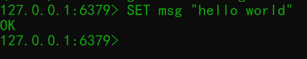
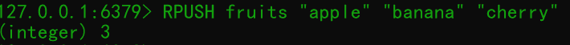
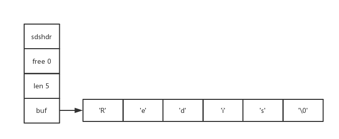
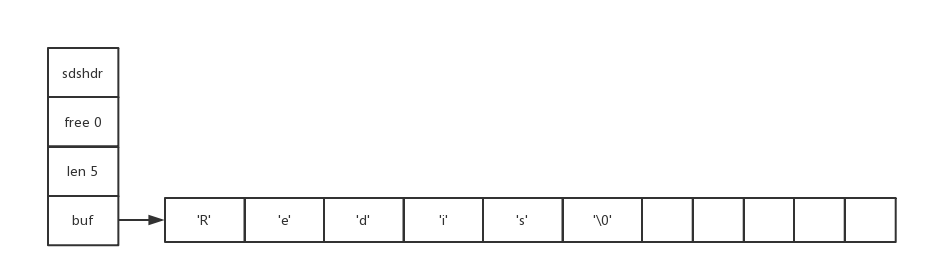
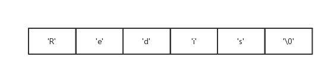
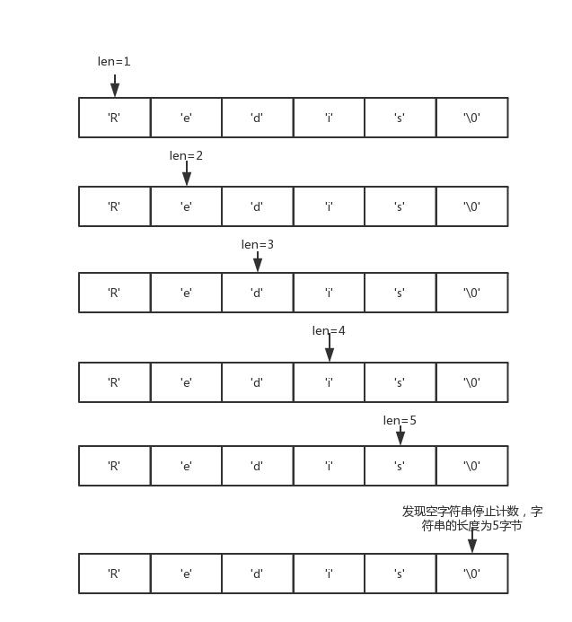
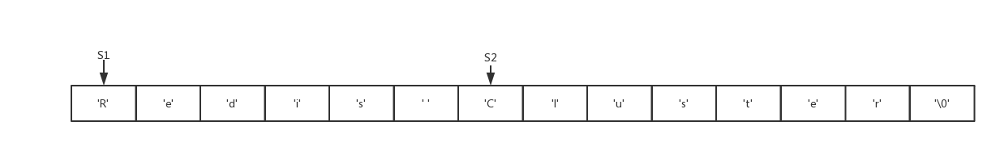
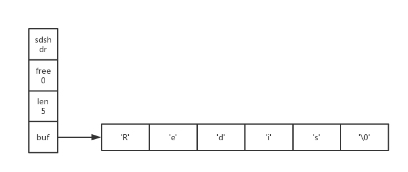
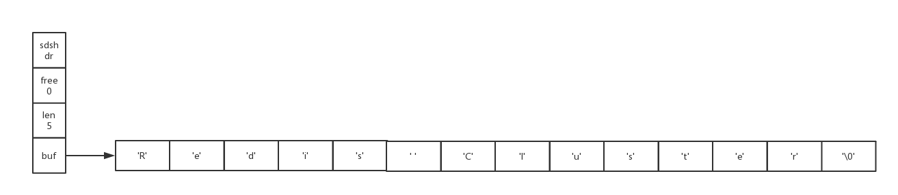

# 简单动态字符串
Redis没有直接使用C语言传统的字符串表示（以空字符结尾的字符数组，以下简称C字符串），而是自己构建了一种名为简单动态字符串（simple dynamic string，SDS）的抽象类型，并将SDS用作Redis的默认字符串表示。
在Redis里面，C字符串只会作为字符串字面量（string literal）用在一些无须对字符串值进行修改的地方，比如打印日志。
当Redis需要的不仅仅是一个字符串字面量，而是一个可以被修改的字符串值时，Redis就会使用SDS来表示字符串值，比如Redis的数据库里面，包含字符串的键值对在底层都是由SDS实现的。
举个例子：

那么Redis将在数据库中创建一个新的键值对，其中：

- 键值对的健是一个字符串对象，对象的底层实现是一个保存着字符串"msg"的SDS。
- 键值对的值也是一个字符串对象，对象的底层实现是一个保存着字符串"hello world"的SDS。

又比如:

那么Redis将在数据库中创建一个新的键值对，其中：

- 键值对的健是一个字符串对象，对象的底层实现是一个保存了字符串"fruits"的SDS。
- 键值对的值是一个列表对象，列表对象包含了三个字符串对象，这三个字符串对象分别由三个SDS实现：第一个SDS保存着字符串"apple"，第二个SDS保存着字符串"banana"，第三个SDS保存着字符串"cherry"。

除了用来保存数据库中的字符串值之外，SDS还被用作缓冲区（buffer）：AOF模块中的AOF缓冲区，以及客户端状态中的输入缓冲区，都是由SDS实现的，在之后介绍AOF持久化和客户端的时候，我们会看到SDS在这两个模块中的应用。

## SDS的定义
每个`sds.h/sdshdr`结构表示一个SDS值：
```c
// 记录buf数据中已使用字节的数量
// 等于SDS所保存字符串的长度
int len;

// 记录buf数组中未使用字节的数量
int free;

// 字节数组，用于保存字符串
char buf[];
```
下图展示了一个SDS示例：

- free属性的值为0，表示这个SDS没有分配任何未使用空间。
- len属性的值为5，表示这个SDS保存了一个5字节长的字符串。
- buf属性是一个char类型的数组，数组的前5歌字节分别保存了'R'、'e'、'd'、'i'、's'五个字符，而最后一个字节则保存了空字符'\0'。

SDS遵循C字符串以空字符结尾的惯例，保存空字符的1字节空间不计算在SDS的len属性里面，并且为空字符分配额外的1字节空间，以及添加空字符到字符串末尾等操作，都是由SDS函数自动完成的，所以这个空字符对于SDS的使用者来说是完全透明的。

下图展示了另一个SDS示例。

这个SDS和之前展示的SDS一样，都保存了字符串值"Redis"。这个SDS和之前展示的SDS区别在于，这个SDS为buf数组分配了5字节未使用空间，所以它的free属性的值为5。

## SDS与C字符串的区别
根据传统，C语言使用长度为N+1的字符串组来表示长度为N的字符串，并且字符串数组的最后一个元素总是空字符串'\0'。

下图为展示一个值为"Redis"的C字符串。



C语言使用的这种简单的字符串表示方式，并不能满足Redis对字符串在安全行、效率以及功能方面的要求。

### 常数复杂度获取字符串长度
因为C字符串并不记录自身的长度信息，所以为了获取一个C字符串的长度，程序必须遍历整个字符串，对于道德每个字符进行计数，直到遇到代表字符串结尾的空字符为止，这个操作的复杂度为O(N)。
举个例子，下图展示了程序计算一个C字符串长度的过程。


和C字符串不同，因为SDS在len属性中记录了SDS本身的长度，所以获取一个SDS长度的复杂度仅为O(1)。设置和更新SDS长度的工作是由SDS的API在执行时自动完成的，使用SDS无须进行任何手动修改长度的工作。

通过使用SDS而不是C字符串，Redis讲获取字符串长度所需的复杂度从O(N)降低到了O(1)，这确保了获取字符串长度的工作不会成为Redis的性能瓶颈。

### 杜绝缓冲区溢出
除了获取字符串长度的复杂度高之外，C字符串不记录自身长度带来的另一个问题是容易造成缓冲区溢出（buffer overflow）。举个例子，`<string.h>/strcat`函数可以将src字符串中的内容拼接到dest字符串的末尾：
> char *strcat(char *dest, const char *src);

因为C字符串不记录自身的长度，所以strcat假定用户在执行这个函数时，已经为dest分配了足够多的内存，可以容纳src字符串中的所有内容，而一旦这个假定不成立时，就会产生缓冲区溢出。

举个例子，假设程序里有两个在内存中紧邻着的C字符串S1和S2，其中S1保存了字符串"Redis"，而S2保存了字符串"MongoDB"，如下图所示：


如果一个程序员决定通过执行：
> strcat(S1, " Cluster");

将S1的内容修改为了"Redis Cluster"，但粗心的他却忘了在执行strcat之前为S1分配足够的空间，那么在strcat函数执行之后，S1的数据将溢出到S2所在的空间中，导致S2保存的内容被意外地修改，如下图所示：


与C字符串不同，SDS的空间分配策略完全杜绝了发生缓冲区溢出的可能性：当SDS API需要对SDS进行修改时，API会先检查SDS的空间是否满足修改所需的要求，如果不满足的话，API会自动将SDS的空间扩展至执行修改所需的大小，然后才执行实际的修改操作，所以使用SDS既不需要手动修改SDS的空间大小，也不会出现前面所说的缓冲区溢出问题。

举个例子，SDS的API里面也有一个用于执行拼接操作的sdscat函数，它可以将一个C字符串拼接到给定SDS所保存的字符串的后面，但是在执行拼接操作之前，sdscat会先检查给定SDS的空间是否足够，如果不够的话，sdscat就会扩展SDS的空间，然后才会执行拼接操作。

例如，如果我们执行：
> sdscat(s, " Cluster");

其中SDS值s如下图所示：

那么sdscat将在执行拼接操作之前检查s的长度是否足够，在发现s目前的空间不足以拼接" Cluster"之后，sdscat就会先扩展s的空间，然后才执行拼接" Cluster"的操作，拼接操作完成之后的SDS如下图所示：


### 减少修改字符串时带来的内存重分配次数
因为C字符串并不会记录自身的长度，所以对于一个包含了N个字符的C字符串来说，这个C字符串的底层实现总是一个N+1个字符长的数组。因为C字符串的长度和底层数组的长度之间存在着这种关联性，所以每次增长或者缩短一个C字符串，程序都总要对保存这个C字符串的数组进行一次内存重分配操作：
- 如果程序执行的是增长字符串的操作，比如拼接操作（append），那么在执行这个操作之前，程序需要先通过内存重分配来扩展底层数组的空间大小——如果忘了这一步就会产生缓冲区溢出。
- 如果程序执行的是缩短字符串的操作，比如截断操作（trim），那么在执行这个操作之后，程序需要通过内存重分配来释放字符串不再使用的那部分空间——如果忘了这一步就会产生内存泄漏。

因为内存重分配设计复杂的算法，并且可能需要执行系统调用，所以它通常是一个比较耗时的操作：
- 在一般程序中，入宫修改字符长度的情况不太常出现，那么每次修改都执行一次内存重分配是可以接受的。
- 但是Redis作为数据库，经常被用于速度要求严苛，数据被频繁修改的场合，如果每次修改字符串的长度都需要执行一次内存重分配的话，那么光是执行内存重分配的时间就会占去字符串所用时间的一大部分，如果这种修改频繁地发生的话，可能还会对性能造成影响。

为了避免C字符串的这种缺陷，SDS通过未使用空间解除了字符串长度和底层数组长度的之间的关联：在SDS中，buf数组的长度不一定就是字符数量加一，数组里面可以包含未使用的字节，而这些字节的数量就由SDS的free属性记录。
通过未使用空间，SDS实现了空间预分配和惰性空间释放两种优化策略。

#### 1.空间预分配

空间预分配用于优化SDS的字符串增长操作：当SDS的API对一个SDS进行修改，并且需要对SDS进行空间扩展的时候，程序不仅会为SDS分配修改所必要的空间，还会为SDS分配额外的未使用空间。


#### 2.惰性空间释放

惰性空间释放用于优化SDS的字符串缩短操作：当SDS的API需要缩短SDS保存的字符串时，程序并不立即使用内存重分配来回收缩短后多出来的字节，而是使用free属性将这些字节的数量记录起来，并等待将来使用。

### 二进制安全

C字符串中的字符必须符合某种编码（比如ASCII），并且除了字符串的末尾之外，字符串里面不能包含空字符，否则最先被程序读入的空字符将被误认为是字符串结尾，这些限制使得C字符串只能保存文本数据，而不能保存像图片、音频、视频、压缩文件这样的二进制数据。

为了确保Redis可以适用各种不同的使用场景，SDS的API都是二进制安全的（binary-safe）。通过使用二进制安全的SDS，而不是C字符串，使得Redis不仅可以保存文本数据，还可以保存任意格式的二进制数据。

## 参考资料
《Redis设计与实现》