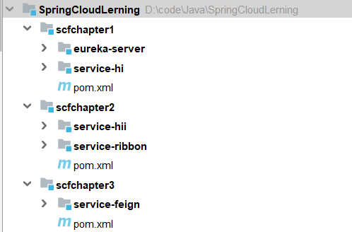
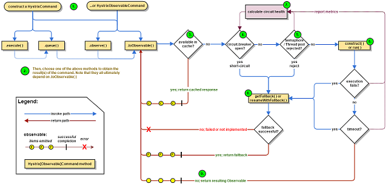
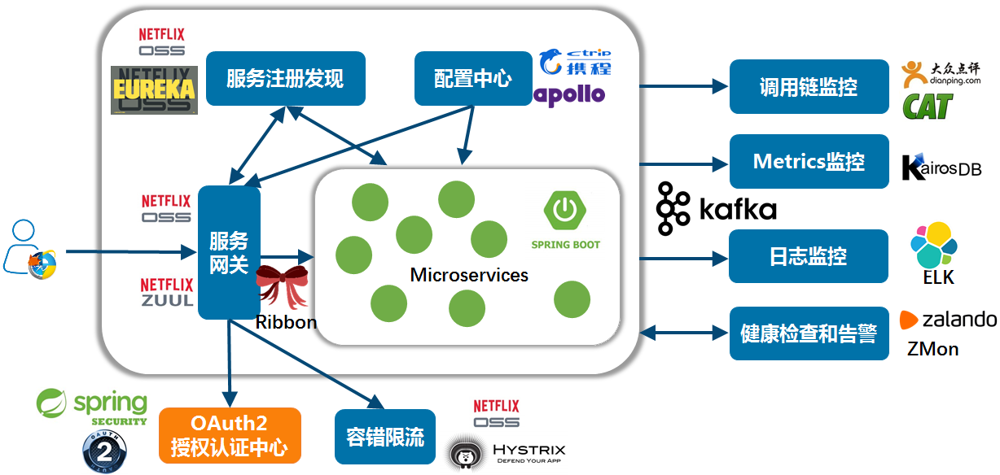

# 服务的注册与发现Eureka(Finchley版本)
## 创建服务注册中心
在这里，我还是采用Eureka作为服务注册与发现的组件。
### 首先创建一个空项目
首先创建一个空项目，再创建一个maven项目，首先创建一个主Maven工程，在其pom文件引入依赖，spring Boot版本为2.0.3.RELEASE，Spring Cloud版本为Finchley.RELEASE。
其目录结构如下：

这个pom文件作为父pom文件，起到依赖版本控制的作用，其他module工程继承该pom。这一系列文章全部采用这种模式，其他文章的pom跟这个pom一样。再次说明一下，以后不再重复引入。代码如下：
```xml
<?xml version="1.0" encoding="UTF-8"?>
<project xmlns="http://maven.apache.org/POM/4.0.0"
         xmlns:xsi="http://www.w3.org/2001/XMLSchema-instance"
         xsi:schemaLocation="http://maven.apache.org/POM/4.0.0 http://maven.apache.org/xsd/maven-4.0.0.xsd">
    <modelVersion>4.0.0</modelVersion>

    <groupId>com.tugohost</groupId>
    <artifactId>sc-f-chapter1</artifactId>
    <version>1.0-SNAPSHOT</version>
    <modules>
        <module>eureka-server</module>
        <module>service-hi</module>
    </modules>
    <packaging>pom</packaging>

    <name>sc-f-chapter1</name>

    <parent>
        <groupId>org.springframework.boot</groupId>
        <artifactId>spring-boot-starter-parent</artifactId>
        <version>2.0.3.RELEASE</version>
        <relativePath/>
    </parent>

    <properties>
        <project.build.sourceEncoding>UTF-8</project.build.sourceEncoding>
        <project.reporting.outputEncoding>UTF-8</project.reporting.outputEncoding>
        <java.version>1.8</java.version>
        <spring-cloud.version>Finchley.SR3</spring-cloud.version>
    </properties>

    <dependencies>
        <dependency>
            <groupId>org.springframework.boot</groupId>
            <artifactId>spring-boot-starter-test</artifactId>
            <scope>test</scope>
        </dependency>
    </dependencies>

    <dependencyManagement>
        <dependencies>
            <dependency>
                <groupId>org.springframework.cloud</groupId>
                <artifactId>spring-cloud-dependencies</artifactId>
                <version>${spring-cloud.version}</version>
                <type>pom</type>
                <scope>import</scope>
            </dependency>
        </dependencies>
    </dependencyManagement>

    <build>
        <plugins>
            <plugin>
                <groupId>org.springframework.boot</groupId>
                <artifactId>spring-boot-maven-plugin</artifactId>
            </plugin>
        </plugins>
    </build>
</project>
```
### 创建两个model项目
一个model工程作为服务注册中心，即Eureka Server,另一个作为Eureka Client。
#### Eureka Server
`Eureka Server`pom文件代码：
```xml
<?xml version="1.0" encoding="UTF-8"?>
<project xmlns="http://maven.apache.org/POM/4.0.0"
         xmlns:xsi="http://www.w3.org/2001/XMLSchema-instance"
         xsi:schemaLocation="http://maven.apache.org/POM/4.0.0 http://maven.apache.org/xsd/maven-4.0.0.xsd">
    <parent>
        <artifactId>sc-f-chapter1</artifactId>
        <groupId>com.tugohost</groupId>
        <version>1.0-SNAPSHOT</version>
    </parent>
    <modelVersion>4.0.0</modelVersion>

    <groupId>com.tugohost</groupId>
    <artifactId>eureka-server</artifactId>
    <version>1.0-SNAPSHOT</version>
    <packaging>jar</packaging>


    <dependencies>
        <dependency>
            <groupId>org.springframework.cloud</groupId>
            <artifactId>spring-cloud-starter-netflix-eureka-server</artifactId>
        </dependency>
    </dependencies>

</project>
```

启动一个服务注册中心，只需要一个注解@EnableEurekaServer，这个注解需要在springboot工程的启动application类上加。代码如下：
```java
/**
 * @author: Tu9ohost
 */
@SpringBootApplication
@EnableEurekaServer
public class EurekaServerApplication  {
    public static void main(String[] args) {
        SpringApplication.run(EurekaServerApplication .class,args);
    }
}
```
eureka是一个高可用的组件，它没有后端缓存，每一个实例注册之后需要向注册中心发送心跳（因此可以在内存中完成），在默认情况下erureka server也是一个eureka client ,必须要指定一个 server。eureka server的配置文件`application.yml`：
```yml
server:
  port: 8761

eureka:
  instance:
    hostname: localhost
  client:
    fetch-registry: false
    register-with-eureka: false
    service-url:
      defaultZone: http://${eureka.instance.hostname}:${server.port}/eureka/

spring:
  application:
    name: eureka-server
```
通过eureka.client.registerWithEureka：false和fetchRegistry：false来表明自己是一个eureka server。

启动启动类，打开 http://localhost:8761/

#### Eureka Client
`Eureka Client`pom文件代码：
```xml
<?xml version="1.0" encoding="UTF-8"?>
<project xmlns="http://maven.apache.org/POM/4.0.0"
         xmlns:xsi="http://www.w3.org/2001/XMLSchema-instance"
         xsi:schemaLocation="http://maven.apache.org/POM/4.0.0 http://maven.apache.org/xsd/maven-4.0.0.xsd">
    <parent>
        <artifactId>sc-f-chapter1</artifactId>
        <groupId>com.tugohost</groupId>
        <version>1.0-SNAPSHOT</version>
    </parent>
    <modelVersion>4.0.0</modelVersion>

    <groupId>com.tugohost</groupId>
    <artifactId>service-hi</artifactId>
    <version>1.0-SNAPSHOT</version>
    <packaging>jar</packaging>

    <dependencies>
        <dependency>
            <groupId>org.springframework.cloud</groupId>
            <artifactId>spring-cloud-netflix-eureka-client</artifactId>
        </dependency>
        <dependency>
            <groupId>org.springframework.boot</groupId>
            <artifactId>spring-boot-starter-web</artifactId>
        </dependency>
    </dependencies>

    <build>
        <plugins>
            <plugin>
                <groupId>org.springframework.boot</groupId>
                <artifactId>spring-boot-maven-plugin</artifactId>
            </plugin>
        </plugins>
    </build>

</project>
```
当client向server注册时，它会提供一些元数据，例如主机和端口，URL，主页等。Eureka server 从每个client实例接收心跳消息。 如果心跳超时，则通常将该实例从注册server中删除。
通过注解`@EnableEurekaClient`表明自己是一个eurekaclient。
```java
/**
 * @author: Tu9ohost
 */
@SpringBootApplication
@EnableEurekaClient
@RestController
public class ServiceHiApplication {
    public static void main(String[] args) {
        SpringApplication.run(ServiceHiApplication.class,args);
    }

    @Value("${server.port}")
    String port;

    @RequestMapping("/hi")
    public String home(@RequestParam(value = "name", defaultValue = "tugohost") String name){
        return "hi " + name + " , i am from port:" + port;
    }
}
```
仅仅`@EnableEurekaClient`是不够的，还需要在配置文件中注明自己的服务注册中心的地址，`application.yml`配置文件如下：
```yml
server:
  port: 8762

spring:
  application:
    name: service-hi
eureka:
  client:
    service-url:
      defaultZone: http://localhost:8761/eureka/

```
需要指明`spring.application.name`,这个很重要，这在以后的服务与服务之间相互调用一般都是根据这个name 。
启动工程，打开http://localhost:8761 ，即eureka server 的网址：
你会发现一个服务已经注册在服务中了，服务名为SERVICE-HI ,端口为7862

这时打开 http://localhost:8762/hi?name=tugohost ，你会在浏览器上看到 
> hi tugohost,i am from port:8762
### 最后的目录结构

# 服务消费者（rest+ribbon）(Finchley版本)
在微服务架构中，业务都会被拆分成一个独立的服务，服务与服务的通讯是基于http restful的。Spring cloud有两种服务调用方式，一种是ribbon+restTemplate，另一种是feign。
## ribbon简介
Ribbon is a client-side load balancer that gives you a lot of control over the behavior of HTTP and TCP clients. Feign already uses Ribbon, so, if you use @FeignClient, this section also applies.
-- [官方文档](https://cloud.spring.io/spring-cloud-static/Finchley.SR2/single/spring-cloud.html#spring-cloud-ribbon)

ribbon是一个负载均衡客户端，可以很好的控制htt和tcp的一些行为。Feign默认集成了ribbon。
## 准备工作
重新新建一个maven工程，取名为：service-ribbon;
在它的pom.xml继承了父pom文件，并引入了以下依赖：
```xml
<?xml version="1.0" encoding="UTF-8"?>
<project xmlns="http://maven.apache.org/POM/4.0.0"
         xmlns:xsi="http://www.w3.org/2001/XMLSchema-instance"
         xsi:schemaLocation="http://maven.apache.org/POM/4.0.0 http://maven.apache.org/xsd/maven-4.0.0.xsd">
    <parent>
        <artifactId>sc-f-chapter2</artifactId>
        <groupId>com.tugohost</groupId>
        <version>1.0-SNAPSHOT</version>
    </parent>
    <modelVersion>4.0.0</modelVersion>

    <groupId>com.tugohost</groupId>
    <artifactId>service-ribbon</artifactId>
    <version>1.0-SNAPSHOT</version>

    <dependencies>
        <dependency>
            <groupId>org.springframework.cloud</groupId>
            <artifactId>spring-cloud-netflix-eureka-client</artifactId>
        </dependency>
        <dependency>
            <groupId>org.springframework.boot</groupId>
            <artifactId>spring-boot-starter-web</artifactId>
        </dependency>
        <dependency>
            <groupId>org.springframework.cloud</groupId>
            <artifactId>spring-cloud-starter-netflix-ribbon</artifactId>
        </dependency>
    </dependencies>

</project>
```
目录结构：

在工程的配置文件指定服务的注册中心地址为http://localhost:8761/eureka/，程序名称为 service-ribbon，程序端口为8764。配置文件`application.yml`如下：
```yml
eureka:
  client:
    service-url:
      defaultZone: http://localhost:8761/eureka/
server:
  port: 8764
spring:
  application:
    name: service-ribbon
```
在工程的启动类中,通过@EnableDiscoveryClient向服务中心注册；并且向程序的ioc注入一个bean: restTemplate;并通过@LoadBalanced注解表明这个restRemplate开启负载均衡的功能。
```java
/**
 * @author: Tu9ohost
 */
@SpringBootApplication
@EnableEurekaClient
@EnableDiscoveryClient
public class ServiceRibbonApplition {
    public static void main(String[] args) {
        SpringApplication.run(ServiceRibbonApplition.class,args);
    }

    @Bean
    @LoadBalanced
    RestTemplate restTemplate(){
        return new RestTemplate();
    }
}
```
写一个测试类HelloService，通过之前注入ioc容器的restTemplate来消费service-hi服务的“/hi”接口，在这里我们直接用的程序名替代了具体的url地址，在ribbon中它会根据服务名来选择具体的服务实例，根据服务实例在请求的时候会用具体的url替换掉服务名，代码如下：
```java
/**
 * @author: Tu9ohost
 */
@Service
public class HelloService {
    @Autowired
    RestTemplate restTemplate;

    public String hiService(String name){
        return restTemplate.getForObject("http://localhost:8762/hi?name="+name,String.class);
    }
}
```
写一个controller，在controller中用调用HelloService 的方法，代码如下：
```java
/**
 * @author: Tu9ohost
 */
@RestController
public class HelloController {
    @Autowired
    HelloService helloService;

    @GetMapping(value = "/hi")
    public String hello(@RequestParam String name){
        return helloService.hiService(name);
    }
}
```
在浏览器上多次访问http://localhost:8764/hi?name=forezp，浏览器交替显示：
>   hi forezp,i am from port:8762
    hi forezp,i am from port:8763
> 
这说明当我们通过调用restTemplate.getForObject(“http://SERVICE-HI/hi?name=”+name,String.class)方法时，已经做了负载均衡，访问了不同的端口的服务实例。
### 此时架构

- 一个服务注册中心，eureka server,端口为8761
-service-hi工程跑了两个实例，端口分别为8762,8763，分别向服务注册中心注册
- sercvice-ribbon端口为8764,向服务注册中心注册
- 当sercvice-ribbon通过restTemplate调用service-hi的hi接口时，因为用ribbon进行了负载均衡，会轮流的调用service-hi：8762和8763 两个端口的hi接口；

# 服务消费者（Feign）(Finchley版本)
上一篇文章，讲述了如何通过RestTemplate+Ribbon去消费服务，这篇文章主要讲述如何通过Feign去消费服务。
## Feign简介
Feign是一个声明式的伪Http客户端，它使得写Http客户端变得更简单。使用Feign，只需要创建一个接口并注解。它具有可插拔的注解特性，可使用Feign 注解和JAX-RS注解。Feign支持可插拔的编码器和解码器。Feign默认集成了Ribbon，并和Eureka结合，默认实现了负载均衡的效果。
简而言之：
- Feign 采用的是基于接口的注解
- Feign 整合了ribbon，具有负载均衡的能力
- 整合了Hystrix，具有熔断的能力

## 准备工作
继续用上一节的工程， 启动eureka-server，端口为8761; 启动service-hi 两次，端口分别为8762 、8773.
### 创建一个feign的服务
新建一个spring-boot工程，取名为service-feign，在它的pom文件引入Feign的起步依赖spring-cloud-starter-feign、Eureka的起步依赖spring-cloud-starter-netflix-eureka-client、Web的起步依赖spring-boot-starter-web，代码如下：
```xml
<?xml version="1.0" encoding="UTF-8"?>
<project xmlns="http://maven.apache.org/POM/4.0.0"
         xmlns:xsi="http://www.w3.org/2001/XMLSchema-instance"
         xsi:schemaLocation="http://maven.apache.org/POM/4.0.0 http://maven.apache.org/xsd/maven-4.0.0.xsd">
    <parent>
        <artifactId>sc-f-chapter3</artifactId>
        <groupId>com.tugohost</groupId>
        <version>1.0-SNAPSHOT</version>
    </parent>
    <modelVersion>4.0.0</modelVersion>

    <groupId>com.tugohost</groupId>
    <artifactId>service-feign</artifactId>
    <version>1.0-SNAPSHOT</version>

    <dependencies>
        <dependency>
            <groupId>org.springframework.cloud</groupId>
            <artifactId>spring-cloud-netflix-eureka-client</artifactId>
        </dependency>
        <dependency>
            <groupId>org.springframework.boot</groupId>
            <artifactId>spring-boot-starter-web</artifactId>
        </dependency>
        <dependency>
            <groupId>org.springframework.cloud</groupId>
            <artifactId>spring-cloud-starter-openfeign</artifactId>
        </dependency>
    </dependencies>


</project>
```
目录结构；

在工程的配置文件`application.yml`文件，指定程序名为service-feign，端口号为8765，服务注册地址为http://localhost:8761/eureka/ ，代码如下：
```yml
eureka:
  client:
    service-url: http://localhost:8761/eureka/
server:
  port: 8765
spring:
  application:
    name: service-feign

```

在程序的启动类`ServiceFeignApplication`，加上@EnableFeignClients注解开启Feign的功能：
```java
/**
 * @author: Tu9ohost
 */
@SpringBootApplication
@EnableEurekaClient
@EnableDiscoveryClient
@EnableFeignClients
public class ServiceFeignApplication {
    public static void main(String[] args) {
        SpringApplication.run(ServiceFeignApplication.class,args);
    }
}
```
service层定义一个feign接口，通过@ FeignClient（“服务名”），来指定调用哪个服务。比如在代码中调用了service-hi服务的“/hi”接口，代码如下：
```java
/**
 * @author: Tu9ohost
 */
@FeignClient(value = "service-hi")
public interface SchedualServiceHi {
    @RequestMapping(value = "/hi",method = RequestMethod.GET)
    String sayHiFromClientOne(@RequestParam(value = "name") String name);
}
```

在Web层的controller层，对外暴露一个"/hi"的API接口，通过上面定义的Feign客户端SchedualServiceHi 来消费服务。代码如下：
```java
/**
 * @author: Tu9ohost
 */
@RestController
public class HiController {
    @Autowired
    SchedualServiceHi schedualServiceHi;

    @GetMapping(value = "/hi")
    public String sayHi(@RequestParam String name){
        return schedualServiceHi.sayHiFromClientOne(name);
    }
}
```

启动程序，多次访问http://localhost:8765/hi?name=tugohost,浏览器交替显示：
>     
    hi tugohost,i am from port:8762
    hi tugohost,i am from port:8763

# 断路器（Hystrix）(Finchley版本)
在微服务架构中，根据业务来拆分成一个个的服务，服务与服务之间可以相互调用（RPC），在Spring Cloud可以用RestTemplate+Ribbon和Feign来调用。为了保证其高可用，单个服务通常会集群部署。由于网络原因或者自身的原因，服务并不能保证100%可用，如果单个服务出现问题，调用这个服务就会出现线程阻塞，此时若有大量的请求涌入，Servlet容器的线程资源会被消耗完毕，导致服务瘫痪。服务与服务之间的依赖性，故障会传播，会对整个微服务系统造成灾难性的严重后果，这就是服务故障的“雪崩”效应。

为了解决这个问题，业界提出了断路器模型。
## 熔断器介绍
Netflix开源了Hystrix组件，实现了断路器模式，SpringCloud对这一组件进行了整合。 在微服务架构中，一个请求需要调用多个服务是非常常见的，如下图：

较底层的服务如果出现故障，会导致连锁故障。当对特定的服务的调用的不可用达到一个阀值（Hystric 是5秒20次） 断路器将会被打开。
断路打开后，可用避免连锁故障，fallback方法可以直接返回一个固定值。
## 准备工作
这篇文章基于[上一篇文章](https://www.cnblogs.com/Tu9oh0st/p/10873089.html)的工程，首先启动上一篇文章的工程，启动eureka-server 工程；启动service-hi工程，它的端口为8762。
## 在ribbon使用断路器
改造serice-ribbon 工程的代码，首先在pox.xml文件中加入spring-cloud-starter-netflix-hystrix的起步依赖：
```xml
<dependency>
            <groupId>org.springframework.cloud</groupId>
            <artifactId>spring-cloud-starter-netflix-hystrix</artifactId>
  </dependency>

```
在程序的启动类ServiceRibbonApplication 加@EnableHystrix注解开启Hystrix：
```java
/**
 * @author: Tu9ohost
 */
@SpringBootApplication
@EnableEurekaClient
@EnableDiscoveryClient
@EnableHystrix
public class ServiceRibbonApplication {
    public static void main(String[] args) {
        SpringApplication.run( ServiceRibbonApplication.class, args );
    }

    @Bean
    @LoadBalanced
    RestTemplate restTemplate() {
        return new RestTemplate();
    }
}

```
改造HelloService类，在hiService方法上加上@HystrixCommand注解。该注解对该方法创建了熔断器的功能，并指定了fallbackMethod熔断方法，熔断方法直接返回了一个字符串，字符串为”hi,”+name+”,sorry,error!”，代码如下：
```java
/**
 * @author: Tu9ohost
 */
@Service
public class HelloService {
    @Autowired
    RestTemplate restTemplate;

    @HystrixCommand(fallbackMethod = "hiError")
    public String hiService(String name) {
        return restTemplate.getForObject("http://SERVICE-HI/hi?name="+name,String.class);
    }

    public String hiError(String name) {
        return "hi,"+name+",sorry,error!";
    }
}
```
启动：service-ribbon 工程，当我们访问http://localhost:8764/hi?name=tugohost,浏览器显示：
> hi tugohost,i am from port:8762

此时关闭 service-hi 工程，当我们再访问http://localhost:8764/hi?name=tugohost，浏览器会显示：
> hi ,tugohost,orry,error!

这就说明当 service-hi 工程不可用的时候，service-ribbon调用 service-hi的API接口时，会执行快速失败，直接返回一组字符串，而不是等待响应超时，这很好的控制了容器的线程阻塞。
## Feign中使用断路器
Feign是自带断路器的，在D版本的Spring Cloud之后，它没有默认打开。需要在配置文件中配置打开它，在配置文件加以下代码：
> feign.hystrix.enabled=true

基于service-feign工程进行改造，只需要在FeignClient的SchedualServiceHi接口的注解中加上fallback的指定类就行了：
```java
/**
 * @author: Tu9ohost
 */
@FeignClient(value = "service-hi",fallback = SchedualServiceHiHystric.class)
public interface SchedualServiceHi {
    @RequestMapping(value = "/hi",method = RequestMethod.GET)
    String sayHiFromClientOne(@RequestParam(value = "name") String name);
}
```
SchedualServiceHiHystric需要实现SchedualServiceHi 接口，并注入到Ioc容器中，代码如下：
```java
/**
 * @author: Tu9ohost
 */
@Component
public class SchedualServiceHiHystric implements SchedualServiceHi{
    @Override
    public String sayHiFromClientOne(String name) {
        return "sorry "+name;
    }
}

```
启动servcie-feign工程，浏览器打开http://localhost:8765/hi?name=tugohost,注意此时service-hi工程没有启动，网页显示：
> sorry tugohost

打开service-hi工程，再次访问，浏览器显示：
> hi tugohost,i am from port:8762

这证明断路器起到作用了。

# 路由网关(zuul)(Finchley版本)
在微服务架构中，需要几个基础的服务治理组件，包括服务注册与发现、服务消费、负载均衡、断路器、智能路由、配置管理等，由这几个基础组件相互协作，共同组建了一个简单的微服务系统。一个简单的微服务系统如下图：

Cloud微服务系统中，一种常见的负载均衡方式是，客户端的请求首先经过负载均衡（zuul、Ngnix），再到达服务网关（zuul集群），然后再到具体的服。，服务统一注册到高可用的服务注册中心集群，服务的所有的配置文件由配置服务管理（下一篇文章讲述），配置服务的配置文件放在git仓库，方便开发人员随时改配置。
## Zuul介绍
Zuul的主要功能是路由转发和过滤器。路由功能是微服务的一部分，比如／api/user转发到到user服务，/api/shop转发到到shop服务。zuul默认和Ribbon结合实现了负载均衡的功能。
zuul有以下功能：

- Authentication
- Insights
- Stress Testing
- Canary Testing
- Dynamic Routing
- Service Migration
- Load Shedding
- Security
- Static Response handling
- Active/Active traffic management

## 准备工作
继续使用[上一节](https://www.cnblogs.com/Tu9oh0st/p/10878873.html)的工程。在原有的工程上，创建一个新的工程。
## 创建service-zuul工程
其pom.xml文件如下：
```xml
<?xml version="1.0" encoding="UTF-8"?>
<project xmlns="http://maven.apache.org/POM/4.0.0"
         xmlns:xsi="http://www.w3.org/2001/XMLSchema-instance"
         xsi:schemaLocation="http://maven.apache.org/POM/4.0.0 http://maven.apache.org/xsd/maven-4.0.0.xsd">
    <parent>
        <artifactId>sc-f-chapter1</artifactId>
        <groupId>com.tugohost</groupId>
        <version>1.0-SNAPSHOT</version>
    </parent>
    <modelVersion>4.0.0</modelVersion>

    <groupId>com.tugohost</groupId>
    <artifactId>service-zuul</artifactId>
    <version>1.0-SNAPSHOT</version>


    <dependencies>
        <dependency>
            <groupId>org.springframework.cloud</groupId>
            <artifactId>spring-cloud-starter-netflix-eureka-client</artifactId>
        </dependency>
        <dependency>
            <groupId>org.springframework.boot</groupId>
            <artifactId>spring-boot-starter-web</artifactId>
        </dependency>
        <dependency>
            <groupId>org.springframework.cloud</groupId>
            <artifactId>spring-cloud-starter-netflix-zuul</artifactId>
        </dependency>
    </dependencies>

</project>
```

在其入口applicaton类加上注解@EnableZuulProxy，开启zuul的功能：
```java
/**
 * @author: Tu9ohost
 */
@SpringBootApplication
@EnableZuulProxy
@EnableEurekaClient
@EnableDiscoveryClient
public class ServiceZuulApplication {

    public static void main(String[] args) {
        SpringApplication.run(ServiceZuulApplication.class,args);
    }
}
```
加上配置文件application.yml加上以下的配置代码：
```yml
eureka:
  client:
    serviceUrl:
      defaultZone: http://localhost:8761/eureka/
server:
  port: 8769
spring:
  application:
    name: service-zuul
zuul:
  routes:
    api-a:
      path: /api-a/**
      serviceId: service-ribbon
    api-b:
      path: /api-b/**
      serviceId: service-feign
```
首先指定服务注册中心的地址为http://localhost:8761/eureka/，服务的端口为8769，服务名为service-zuul；以/api-a/ 开头的请求都转发给service-ribbon服务；以/api-b/开头的请求都转发给service-feign服务；

依次运行这五个工程;打开浏览器访问：http://localhost:8769/api-a/hi?name=tugohost ;浏览器显示：

> hi tugohost,i am from port:8762

打开浏览器访问：http://localhost:8769/api-b/hi?name=forezp ;浏览器显示：

> hi tugohost,i am from port:8762

这说明zuul起到了路由的作用
## 服务过滤
zuul不仅只是路由，并且还能过滤，做一些安全验证。继续改造工程；
```java
/**
 * @author: Tu9ohost
 */
@Component
public class MyFilter extends ZuulFilter {
    private static Logger log = LoggerFactory.getLogger(MyFilter.class);

    @Override
    public String filterType() {
        return "pre";
    }

    @Override
    public int filterOrder() {
        return 0;
    }

    @Override
    public boolean shouldFilter() {
        return true;
    }

    @Override
    public Object run() throws ZuulException {
        RequestContext ctx = RequestContext.getCurrentContext();
        HttpServletRequest request = ctx.getRequest();
        log.info(String.format("%s >>> %s",request.getMethod(),request.getRequestURI().toString()));
        Object accessToken = request.getParameter("token");
        if (accessToken == null){
            log.warn("token is empty");
            ctx.setSendZuulResponse(false);
            ctx.setResponseStatusCode(401);
            try {
                ctx.getResponse().getWriter().write("token is empty");
            }catch (Exception e){

            }
            return null;
        }
        log.info("ok");
        return null;
    }
}
```
- filterType：返回一个字符串代表过滤器的类型，在zuul中定义了四种不同生命周期的过滤器类型，具体如下： 
    - pre：路由之前
    - routing：路由之时
    - post： 路由之后
    - error：发送错误调用
- filterOrder：过滤的顺序
- shouldFilter：这里可以写逻辑判断，是否要过滤，本文true,永远过滤。
- run：过滤器的具体逻辑。可用很复杂，包括查sql，nosql去判断该请求到底有没有权限访问。

这时访问：http://localhost:8769/api-a/hi?name=tugohost ；网页显示：

> token is empty

访问 http://localhost:8769/api-a/hi?name=tugohost&token=22 ； 网页显示：

> hi tugohost,i am from port:8762

# 分布式配置中心(Spring Cloud Config)(Finchley版本)
在[上一篇文章](https://www.cnblogs.com/Tu9oh0st/p/10887379.html)讲述zuul的时候，已经提到过，使用配置服务来保存各个服务的配置文件。它就是Spring Cloud Config。
## 简介
在分布式系统中，由于服务数量巨多，为了方便服务配置文件统一管理，实时更新，所以需要分布式配置中心组件。在Spring Cloud中，有分布式配置中心组件spring cloud config ，它支持配置服务放在配置服务的内存中（即本地），也支持放在远程Git仓库中。在spring cloud config 组件中，分两个角色，一是config server，二是config client。 
## 构建Config Server
创建一个spring-boot项目，取名为config-server,其pom.xml如下：
```xml
<?xml version="1.0" encoding="UTF-8"?>
<project xmlns="http://maven.apache.org/POM/4.0.0"
         xmlns:xsi="http://www.w3.org/2001/XMLSchema-instance"
         xsi:schemaLocation="http://maven.apache.org/POM/4.0.0 http://maven.apache.org/xsd/maven-4.0.0.xsd">
    <parent>
        <artifactId>sc-f-chapter1</artifactId>
        <groupId>com.tugohost</groupId>
        <version>1.0-SNAPSHOT</version>
    </parent>
    <modelVersion>4.0.0</modelVersion>

    <groupId>com.tugohost</groupId>
    <artifactId>config-server</artifactId>
    <version>1.0-SNAPSHOT</version>


    <dependencies>
        <dependency>
            <groupId>org.springframework.boot</groupId>
            <artifactId>spring-boot-starter-web</artifactId>
        </dependency>
        <dependency>
            <groupId>org.springframework.cloud</groupId>
            <artifactId>spring-cloud-config-server</artifactId>
        </dependency>
    </dependencies>
    <build>
        <plugins>
            <plugin>
                <groupId>org.springframework.boot</groupId>
                <artifactId>spring-boot-maven-plugin</artifactId>
            </plugin>
        </plugins>
    </build>

</project>
```

在程序的入口Application类加上@EnableConfigServer注解开启配置服务器的功能，代码如下：
```java
/**
 * @author: Tu9ohost
 */
@SpringBootApplication
@EnableConfigServer
public class ConfigServerApplication {
    public static void main(String[] args) {
        SpringApplication.run(ConcurrentHashMap.class,args);
    }
}
```
需要在程序的配置文件application.properties文件配置以下：
```properties
spring.application.name=config-server
server.port=8888

spring.cloud.config.server.git.uri=https://github.com/forezp/SpringcloudConfig/
spring.cloud.config.server.git.searchPaths=respo
spring.cloud.config.label=master
spring.cloud.config.server.git.username=
spring.cloud.config.server.git.password=
```
- spring.cloud.config.server.git.uri：配置git仓库地址
- spring.cloud.config.server.git.searchPaths：配置仓库路径
- spring.cloud.config.label：配置仓库的分支
- spring.cloud.config.server.git.username：访问git仓库的用户名
- spring.cloud.config.server.git.password：访问git仓库的用户密码
如果Git仓库为公开仓库，可以不填写用户名和密码，如果是私有仓库需要填写，本例子是公开仓库，放心使用。
远程仓库https://github.com/forezp/SpringcloudConfig/ 中有个文件config-client-dev.properties文件中有一个属性：
> foo = foo version 3
启动程序：访问http://localhost:8888/foo/dev
```
{"name":"foo","profiles":["dev"],"label":"master",
"version":"792ffc77c03f4b138d28e89b576900ac5e01a44b","state":null,"propertySources":[]}
```

证明配置服务中心可以从远程程序获取配置信息。
http请求地址和资源文件映射如下:

- /{application}/{profile}[/{label}]
- /{application}-{profile}.yml
- /{label}/{application}-{profile}.yml
- /{application}-{profile}.properties
- /{label}/{application}-{profile}.properties

## 构建一个config client
重新创建一个springboot项目，取名为config-client,其pom文件：
```xml
<?xml version="1.0" encoding="UTF-8"?>
<project xmlns="http://maven.apache.org/POM/4.0.0"
         xmlns:xsi="http://www.w3.org/2001/XMLSchema-instance"
         xsi:schemaLocation="http://maven.apache.org/POM/4.0.0 http://maven.apache.org/xsd/maven-4.0.0.xsd">
    <parent>
        <artifactId>sc-f-chapter1</artifactId>
        <groupId>com.tugohost</groupId>
        <version>1.0-SNAPSHOT</version>
    </parent>
    <modelVersion>4.0.0</modelVersion>

    <groupId>com.tugohost</groupId>
    <artifactId>config-client</artifactId>
    <version>1.0-SNAPSHOT</version>
    <packaging>jar</packaging>

    <name>config-client</name>


    <dependencies>
		<dependency>
			<groupId>org.springframework.boot</groupId>
			<artifactId>spring-boot-starter-web</artifactId>
		</dependency>
		<dependency>
			<groupId>org.springframework.cloud</groupId>
			<artifactId>spring-cloud-starter-config</artifactId>
		</dependency>
	</dependencies>

	<build>
		<plugins>
			<plugin>
				<groupId>org.springframework.boot</groupId>
				<artifactId>spring-boot-maven-plugin</artifactId>
			</plugin>
		</plugins>
	</build>

</project>
```
其配置文件bootstrap.properties：
```properties
spring.application.name=config-client
spring.cloud.config.label=master
spring.cloud.config.profile=dev
spring.cloud.config.uri= http://localhost:8888/
server.port=8881
```
- spring.cloud.config.label 指明远程仓库的分支
- spring.cloud.config.profile 
    - dev开发环境配置文件
    - test测试环境
    - pro正式环境
- spring.cloud.config.uri= http://localhost:8888/ 指明配置服务中心的网址。
程序的入口类，写一个API接口“／hi”，返回从配置中心读取的foo变量的值，代码如下：
```java
@SpringBootApplication
@RestController
public class ConfigClientApplication {

	public static void main(String[] args) {
		SpringApplication.run(ConfigClientApplication.class, args);
	}

	@Value("${foo}")
	String foo;
	@RequestMapping(value = "/hi")
	public String hi(){
		return foo;
	}
}
```
打开网址访问：http://localhost:8881/hi，网页显示：
> foo version 3
这就说明，config-client从config-server获取了foo的属性，而config-server是从git仓库读取的

# 高可用的分布式配置中心(Spring Cloud Config)(Finchley版本)
[上一篇文章](https://www.cnblogs.com/Tu9oh0st/p/10887633.html)讲述了一个服务如何从配置中心读取文件，配置中心如何从远程git读取配置文件，当服务实例很多时，都从配置中心读取文件，这时可以考虑将配置中心做成一个微服务，将其集群化，从而达到高可用

## 准备工作
创建一个eureka-server工程，用作服务注册中心。
在其pom.xml文件引入Eureka的起步依赖spring-cloud-starter-netflix- eureka-server，代码如下:
```xml
<?xml version="1.0" encoding="UTF-8"?>
<project xmlns="http://maven.apache.org/POM/4.0.0"
         xmlns:xsi="http://www.w3.org/2001/XMLSchema-instance"
         xsi:schemaLocation="http://maven.apache.org/POM/4.0.0 http://maven.apache.org/xsd/maven-4.0.0.xsd">
    <parent>
        <artifactId>sc-f-chapter6</artifactId>
        <groupId>com.tugohost</groupId>
        <version>1.0-SNAPSHOT</version>
    </parent>
    <modelVersion>4.0.0</modelVersion>

    <groupId>com.tugohost</groupId>
    <artifactId>eureka-server</artifactId>
    <version>1.0-SNAPSHOT</version>


    <dependencies>
        <dependency>
            <groupId>org.springframework.cloud</groupId>
            <artifactId>spring-cloud-starter-netflix-eureka-server</artifactId>
        </dependency>
        <dependency>
            <groupId>org.springframework.boot</groupId>
            <artifactId>spring-boot-starter-web</artifactId>
        </dependency>
        <dependency>
            <groupId>org.springframework.cloud</groupId>
            <artifactId>spring-cloud-config-server</artifactId>
        </dependency>

    </dependencies>
    <build>
        <plugins>
            <plugin>
                <groupId>org.springframework.boot</groupId>
                <artifactId>spring-boot-maven-plugin</artifactId>
            </plugin>
        </plugins>
    </build>

</project>
```
在配置文件application.yml上，指定服务端口为8889，加上作为服务注册中心的基本配置，代码如下：
```yml
server:
  port: 8889

eureka:
  instance:
    hostname: localhost
  client:
    registerWithEureka: false
    fetchRegistry: false
    serviceUrl:
      defaultZone: http://${eureka.instance.hostname}:${server.port}/eureka/
```
入口类：
```java
/**
 * @author: Tu9ohost
 */
@SpringBootApplication
@EnableEurekaServer
public class EurekaServerApplication {
    public static void main(String[] args) {
        SpringApplication.run(EurekaServerApplication.class,args);
    }
}
```
## 改造config-server
在其pom.xml文件加上EurekaClient的起步依赖spring-cloud-starter-netflix-eureka-client，代码如下:
```xml
<dependencies>
        <dependency>
            <groupId>org.springframework.cloud</groupId>
            <artifactId>spring-cloud-starter-netflix-eureka-client</artifactId>
        </dependency>
        <dependency>
            <groupId>org.springframework.boot</groupId>
            <artifactId>spring-boot-starter-web</artifactId>
        </dependency>
        <dependency>
            <groupId>org.springframework.cloud</groupId>
            <artifactId>spring-cloud-config-server</artifactId>
        </dependency>

    </dependencies>
```
配置文件application.yml，指定服务注册地址为http://localhost:8889/eureka/，其他配置同上一篇文章，完整的配置如下：
```yml
spring.application.name=config-server
server.port=8888

spring.cloud.config.server.git.uri=https://github.com/forezp/SpringcloudConfig/
spring.cloud.config.server.git.searchPaths=respo
spring.cloud.config.label=master
spring.cloud.config.server.git.username=
spring.cloud.config.server.git.password=
eureka.client.serviceUrl.defaultZone=http://localhost:8889/eureka/
```
最后需要在程序的启动类Application加上@EnableEureka的注解。
## 改造config-client
将其注册微到服务注册中心，作为Eureka客户端，需要pom文件加上起步依赖spring-cloud-starter-netflix-eureka-client，代码如下：
```xml
<dependencies>
        <dependency>
            <groupId>org.springframework.cloud</groupId>
            <artifactId>spring-cloud-starter-config</artifactId>
        </dependency>

        <dependency>
            <groupId>org.springframework.boot</groupId>
            <artifactId>spring-boot-starter-web</artifactId>
        </dependency>

        <dependency>
            <groupId>org.springframework.cloud</groupId>
            <artifactId>spring-cloud-starter-netflix-eureka-client</artifactId>
        </dependency>
    </dependencies>
```
配置文件bootstrap.properties，注意是bootstrap。加上服务注册地址为http://localhost:8889/eureka/
```properties
spring.application.name=config-client
spring.cloud.config.label=master
spring.cloud.config.profile=dev
#spring.cloud.config.uri= http://localhost:8888/

eureka.client.serviceUrl.defaultZone=http://localhost:8889/eureka/
spring.cloud.config.discovery.enabled=true
spring.cloud.config.discovery.serviceId=config-server
server.port=8881
```

- spring.cloud.config.discovery.enabled 是从配置中心读取文件。
- spring.cloud.config.discovery.serviceId 配置中心的servieId，即服务名。
这时发现，在读取配置文件不再写ip地址，而是服务名，这时如果配置服务部署多份，通过负载均衡，从而高可用。

依次启动eureka-servr,config-server,config-client 访问网址：http://localhost:8889/
访问http://localhost:8881/hi，浏览器显示：

> foo version 3

# 消息总线(Spring Cloud Bus)(Finchley版本)
Spring Cloud Bus 将分布式的节点用轻量的消息代理连接起来。它可以用于广播配置文件的更改或者服务之间的通讯，也可以用于监控。本文要讲述的是用Spring Cloud Bus实现通知微服务架构的配置文件的更改。

## 准备工作
本文还是基于上一篇文章来实现。按照官方文档，我们只需要在配置文件中配置 spring-cloud-starter-bus-amqp ；这就是说我们需要装rabbitMq，点击[rabbitmq](http://www.rabbitmq.com/)下载。至于怎么使用 rabbitmq，搜索引擎下。

## 改造config-client
在pom文件加上起步依赖spring-cloud-starter-bus-amqp，完整的配置文件如下：
```xml
<dependencies>
        <dependency>
            <groupId>org.springframework.cloud</groupId>
            <artifactId>spring-cloud-starter-config</artifactId>
        </dependency>

        <dependency>
            <groupId>org.springframework.boot</groupId>
            <artifactId>spring-boot-starter-web</artifactId>
        </dependency>

        <dependency>
            <groupId>org.springframework.cloud</groupId>
            <artifactId>spring-cloud-starter-netflix-eureka-client</artifactId>
        </dependency>

        <dependency>
            <groupId>org.springframework.cloud</groupId>
            <artifactId>spring-cloud-starter-bus-amqp</artifactId>
        </dependency>

        <dependency>
            <groupId>org.springframework.boot</groupId>
            <artifactId>spring-boot-starter-actuator</artifactId>
        </dependency>
    </dependencies>
```

在配置文件application.properties中加上RabbitMq的配置，包括RabbitMq的地址、端口，用户名、密码。并需要加上spring.cloud.bus的三个配置，具体如下：
```properties
spring.rabbitmq.host=localhost
spring.rabbitmq.port=5672
spring.rabbitmq.username=guest
spring.rabbitmq.password=guest

spring.cloud.bus.enabled=true
spring.cloud.bus.trace.enabled=true
management.endpoints.web.exposure.include=bus-refresh
```

ConfigClientApplication启动类代码如下：
```java
/**
 * @author: Tu9ohost
 */
@SpringBootApplication
@RestController
@EnableEurekaClient
@EnableDiscoveryClient
@RefreshScope
public class ConfigClientApplication {
    public static void main(String[] args) {
        SpringApplication.run(ConfigClientApplication.class, args);
    }


    @Value("${foo}")
    String foo;

    @RequestMapping(value = "/hi")
    public String hi(){
        return foo;
    }
}
```

依次启动eureka-server、confg-cserver,启动两个config-client，端口为：8881、8882。
访问http://localhost:8881/hi 或者http://localhost:8882/hi 浏览器显示：
> foo version 23

这时我们去[代码仓库](https://github.com/forezp/SpringcloudConfig/blob/master/respo/config-client-dev.properties)将foo的值改为“foo version 24”，即改变配置文件foo的值。如果是传统的做法，需要重启服务，才能达到配置文件的更新。此时，我们只需要发送post请求：http://localhost:8881/actuator/bus-refresh，你会发现config-client会重新读取配置文件

这时我们再访问http://localhost:8881/hi 或者http://localhost:8882/hi 浏览器显示：
> foo version 24

另外，/actuator/bus-refresh接口可以指定服务，即使用”destination”参数，比如 “/actuator/bus-refresh?destination=customers:**” 即刷新服务名为customers的所有服务。

## 分析
当git文件更改的时候，通过pc端用post 向端口为8882的config-client发送请求/bus/refresh／；此时8882端口会发送一个消息，由消息总线向其他服务传递，从而使整个微服务集群都达到更新配置文件。

# 服务链路追踪(Spring Cloud Sleuth)(Finchley版本)