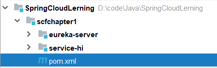
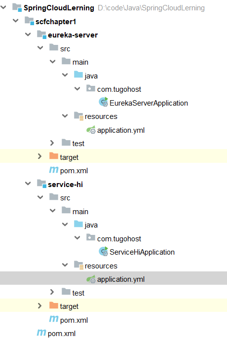
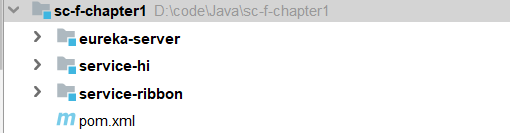
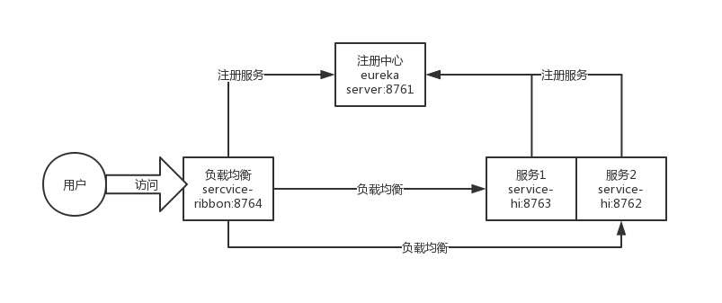

# 服务的注册与发现Eureka(Finchley版本)
## 创建服务注册中心
在这里，我还是采用Eureka作为服务注册与发现的组件。
### 首先创建一个空项目
首先创建一个空项目，再创建一个maven项目，首先创建一个主Maven工程，在其pom文件引入依赖，spring Boot版本为2.0.3.RELEASE，Spring Cloud版本为Finchley.RELEASE。
其目录结构如下：

这个pom文件作为父pom文件，起到依赖版本控制的作用，其他module工程继承该pom。这一系列文章全部采用这种模式，其他文章的pom跟这个pom一样。再次说明一下，以后不再重复引入。代码如下：
```xml
<?xml version="1.0" encoding="UTF-8"?>
<project xmlns="http://maven.apache.org/POM/4.0.0"
         xmlns:xsi="http://www.w3.org/2001/XMLSchema-instance"
         xsi:schemaLocation="http://maven.apache.org/POM/4.0.0 http://maven.apache.org/xsd/maven-4.0.0.xsd">
    <modelVersion>4.0.0</modelVersion>

    <groupId>com.tugohost</groupId>
    <artifactId>sc-f-chapter1</artifactId>
    <version>1.0-SNAPSHOT</version>
    <modules>
        <module>eureka-server</module>
        <module>service-hi</module>
    </modules>
    <packaging>pom</packaging>

    <name>sc-f-chapter1</name>

    <parent>
        <groupId>org.springframework.boot</groupId>
        <artifactId>spring-boot-starter-parent</artifactId>
        <version>2.0.3.RELEASE</version>
        <relativePath/>
    </parent>

    <properties>
        <project.build.sourceEncoding>UTF-8</project.build.sourceEncoding>
        <project.reporting.outputEncoding>UTF-8</project.reporting.outputEncoding>
        <java.version>1.8</java.version>
        <spring-cloud.version>Finchley.SR3</spring-cloud.version>
    </properties>

    <dependencies>
        <dependency>
            <groupId>org.springframework.boot</groupId>
            <artifactId>spring-boot-starter-test</artifactId>
            <scope>test</scope>
        </dependency>
    </dependencies>

    <dependencyManagement>
        <dependencies>
            <dependency>
                <groupId>org.springframework.cloud</groupId>
                <artifactId>spring-cloud-dependencies</artifactId>
                <version>${spring-cloud.version}</version>
                <type>pom</type>
                <scope>import</scope>
            </dependency>
        </dependencies>
    </dependencyManagement>

    <build>
        <plugins>
            <plugin>
                <groupId>org.springframework.boot</groupId>
                <artifactId>spring-boot-maven-plugin</artifactId>
            </plugin>
        </plugins>
    </build>
</project>
```
### 创建两个model项目
一个model工程作为服务注册中心，即Eureka Server,另一个作为Eureka Client。
#### Eureka Server
`Eureka Server`pom文件代码：
```xml
<?xml version="1.0" encoding="UTF-8"?>
<project xmlns="http://maven.apache.org/POM/4.0.0"
         xmlns:xsi="http://www.w3.org/2001/XMLSchema-instance"
         xsi:schemaLocation="http://maven.apache.org/POM/4.0.0 http://maven.apache.org/xsd/maven-4.0.0.xsd">
    <parent>
        <artifactId>sc-f-chapter1</artifactId>
        <groupId>com.tugohost</groupId>
        <version>1.0-SNAPSHOT</version>
    </parent>
    <modelVersion>4.0.0</modelVersion>

    <groupId>com.tugohost</groupId>
    <artifactId>eureka-server</artifactId>
    <version>1.0-SNAPSHOT</version>
    <packaging>jar</packaging>


    <dependencies>
        <dependency>
            <groupId>org.springframework.cloud</groupId>
            <artifactId>spring-cloud-starter-netflix-eureka-server</artifactId>
        </dependency>
    </dependencies>

</project>
```

启动一个服务注册中心，只需要一个注解@EnableEurekaServer，这个注解需要在springboot工程的启动application类上加。代码如下：
```java
/**
 * @author: Tu9ohost
 */
@SpringBootApplication
@EnableEurekaServer
public class EurekaServerApplication  {
    public static void main(String[] args) {
        SpringApplication.run(EurekaServerApplication .class,args);
    }
}
```
eureka是一个高可用的组件，它没有后端缓存，每一个实例注册之后需要向注册中心发送心跳（因此可以在内存中完成），在默认情况下erureka server也是一个eureka client ,必须要指定一个 server。eureka server的配置文件`application.yml`：
```yml
server:
  port: 8761

eureka:
  instance:
    hostname: localhost
  client:
    fetch-registry: false
    register-with-eureka: false
    service-url:
      default-zone: http://${eureka.instance.hostname}:${server.port}/eureka/

spring:
  application:
    name: eureka-server
```
通过eureka.client.registerWithEureka：false和fetchRegistry：false来表明自己是一个eureka server。

启动启动类，打开 http://localhost:8761/

#### Eureka Client
`Eureka Client`pom文件代码：
```xml
<?xml version="1.0" encoding="UTF-8"?>
<project xmlns="http://maven.apache.org/POM/4.0.0"
         xmlns:xsi="http://www.w3.org/2001/XMLSchema-instance"
         xsi:schemaLocation="http://maven.apache.org/POM/4.0.0 http://maven.apache.org/xsd/maven-4.0.0.xsd">
    <parent>
        <artifactId>sc-f-chapter1</artifactId>
        <groupId>com.tugohost</groupId>
        <version>1.0-SNAPSHOT</version>
    </parent>
    <modelVersion>4.0.0</modelVersion>

    <groupId>com.tugohost</groupId>
    <artifactId>service-hi</artifactId>
    <version>1.0-SNAPSHOT</version>
    <packaging>jar</packaging>

    <dependencies>
        <dependency>
            <groupId>org.springframework.cloud</groupId>
            <artifactId>spring-cloud-netflix-eureka-client</artifactId>
        </dependency>
        <dependency>
            <groupId>org.springframework.boot</groupId>
            <artifactId>spring-boot-starter-web</artifactId>
        </dependency>
    </dependencies>

    <build>
        <plugins>
            <plugin>
                <groupId>org.springframework.boot</groupId>
                <artifactId>spring-boot-maven-plugin</artifactId>
            </plugin>
        </plugins>
    </build>

</project>
```
当client向server注册时，它会提供一些元数据，例如主机和端口，URL，主页等。Eureka server 从每个client实例接收心跳消息。 如果心跳超时，则通常将该实例从注册server中删除。
通过注解`@EnableEurekaClient`表明自己是一个eurekaclient。
```java
/**
 * @author: Tu9ohost
 */
@SpringBootApplication
@EnableEurekaClient
@RestController
public class ServiceHiApplication {
    public static void main(String[] args) {
        SpringApplication.run(ServiceHiApplication.class,args);
    }

    @Value("${server.port}")
    String port;

    @RequestMapping("/hi")
    public String home(@RequestParam(value = "name", defaultValue = "tugohost") String name){
        return "hi " + name + " , i am from port:" + port;
    }
}
```
仅仅`@EnableEurekaClient`是不够的，还需要在配置文件中注明自己的服务注册中心的地址，`application.yml`配置文件如下：
```yml
server:
  port: 8762

spring:
  application:
    name: service-hi
eureka:
  client:
    service-url:
      default-zone: http://localhost:8762/eureka/

```
需要指明`spring.application.name`,这个很重要，这在以后的服务与服务之间相互调用一般都是根据这个name 。
启动工程，打开http://localhost:8761 ，即eureka server 的网址：
你会发现一个服务已经注册在服务中了，服务名为SERVICE-HI ,端口为7862

这时打开 http://localhost:8762/hi?name=tugohost ，你会在浏览器上看到 
> hi tugohost,i am from port:8762
### 最后的目录结构

# 服务消费者（rest+ribbon）(Finchley版本)
在微服务架构中，业务都会被拆分成一个独立的服务，服务与服务的通讯是基于http restful的。Spring cloud有两种服务调用方式，一种是ribbon+restTemplate，另一种是feign。
## ribbon简介
Ribbon is a client-side load balancer that gives you a lot of control over the behavior of HTTP and TCP clients. Feign already uses Ribbon, so, if you use @FeignClient, this section also applies.
-- [官方文档](https://cloud.spring.io/spring-cloud-static/Finchley.SR2/single/spring-cloud.html#spring-cloud-ribbon)

ribbon是一个负载均衡客户端，可以很好的控制htt和tcp的一些行为。Feign默认集成了ribbon。
## 准备工作
重新新建一个maven工程，取名为：service-ribbon;
在它的pom.xml继承了父pom文件，并引入了以下依赖：
```xml
<?xml version="1.0" encoding="UTF-8"?>
<project xmlns="http://maven.apache.org/POM/4.0.0"
         xmlns:xsi="http://www.w3.org/2001/XMLSchema-instance"
         xsi:schemaLocation="http://maven.apache.org/POM/4.0.0 http://maven.apache.org/xsd/maven-4.0.0.xsd">
    <parent>
        <artifactId>sc-f-chapter2</artifactId>
        <groupId>com.tugohost</groupId>
        <version>1.0-SNAPSHOT</version>
    </parent>
    <modelVersion>4.0.0</modelVersion>

    <groupId>com.tugohost</groupId>
    <artifactId>service-ribbon</artifactId>
    <version>1.0-SNAPSHOT</version>

    <dependencies>
        <dependency>
            <groupId>org.springframework.cloud</groupId>
            <artifactId>spring-cloud-netflix-eureka-client</artifactId>
        </dependency>
        <dependency>
            <groupId>org.springframework.boot</groupId>
            <artifactId>spring-boot-starter-web</artifactId>
        </dependency>
        <dependency>
            <groupId>org.springframework.cloud</groupId>
            <artifactId>spring-cloud-starter-netflix-ribbon</artifactId>
        </dependency>
    </dependencies>

</project>
```
目录结构：

在工程的配置文件指定服务的注册中心地址为http://localhost:8761/eureka/，程序名称为 service-ribbon，程序端口为8764。配置文件`application.yml`如下：
```yml
eureka:
  client:
    service-url:
      default-zone: http://localhost:8761/eureka/
server:
  port: 8764
spring:
  application:
    name: service-ribbon
```
在工程的启动类中,通过@EnableDiscoveryClient向服务中心注册；并且向程序的ioc注入一个bean: restTemplate;并通过@LoadBalanced注解表明这个restRemplate开启负载均衡的功能。
```java
/**
 * @author: Tu9ohost
 */
@SpringBootApplication
@EnableEurekaClient
@EnableDiscoveryClient
public class ServiceRibbonApplition {
    public static void main(String[] args) {
        SpringApplication.run(ServiceRibbonApplition.class,args);
    }

    @Bean
    @LoadBalanced
    RestTemplate restTemplate(){
        return new RestTemplate();
    }
}
```
写一个测试类HelloService，通过之前注入ioc容器的restTemplate来消费service-hi服务的“/hi”接口，在这里我们直接用的程序名替代了具体的url地址，在ribbon中它会根据服务名来选择具体的服务实例，根据服务实例在请求的时候会用具体的url替换掉服务名，代码如下：
```java
/**
 * @author: Tu9ohost
 */
@Service
public class HelloService {
    @Autowired
    RestTemplate restTemplate;

    public String helloService(String name){
        return restTemplate.getForObject("http://SERVICE-HI/hello?name="+name,String.class);
    }
}
```
写一个controller，在controller中用调用HelloService 的方法，代码如下：
```java
/**
 * @author: Tu9ohost
 */
@RestController
public class HelloController {
    @Autowired
    HelloService helloService;

    @GetMapping(value = "/hello")
    public String hello(@RequestParam String name){
        return helloService.helloService(name);
    }
}
```
在浏览器上多次访问http://localhost:8764/hi?name=forezp，浏览器交替显示：
>   hi forezp,i am from port:8762
    hi forezp,i am from port:8763
> 
这说明当我们通过调用restTemplate.getForObject(“http://SERVICE-HI/hi?name=”+name,String.class)方法时，已经做了负载均衡，访问了不同的端口的服务实例。
### 此时架构

- 一个服务注册中心，eureka server,端口为8761
-service-hi工程跑了两个实例，端口分别为8762,8763，分别向服务注册中心注册
- sercvice-ribbon端口为8764,向服务注册中心注册
- 当sercvice-ribbon通过restTemplate调用service-hi的hi接口时，因为用ribbon进行了负载均衡，会轮流的调用service-hi：8762和8763 两个端口的hi接口；