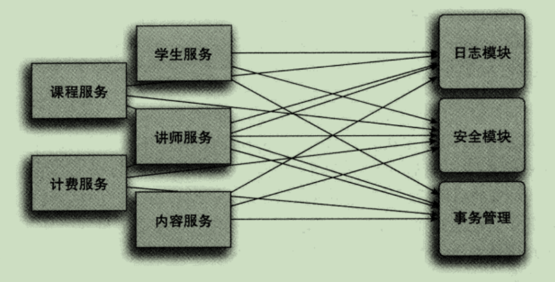
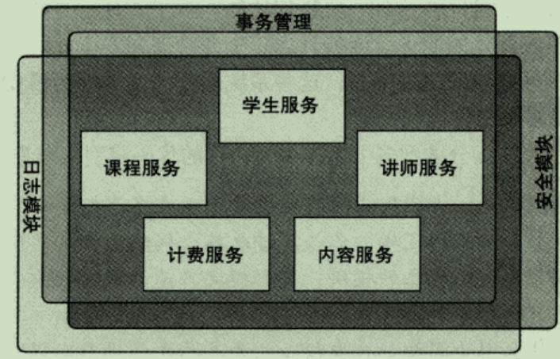
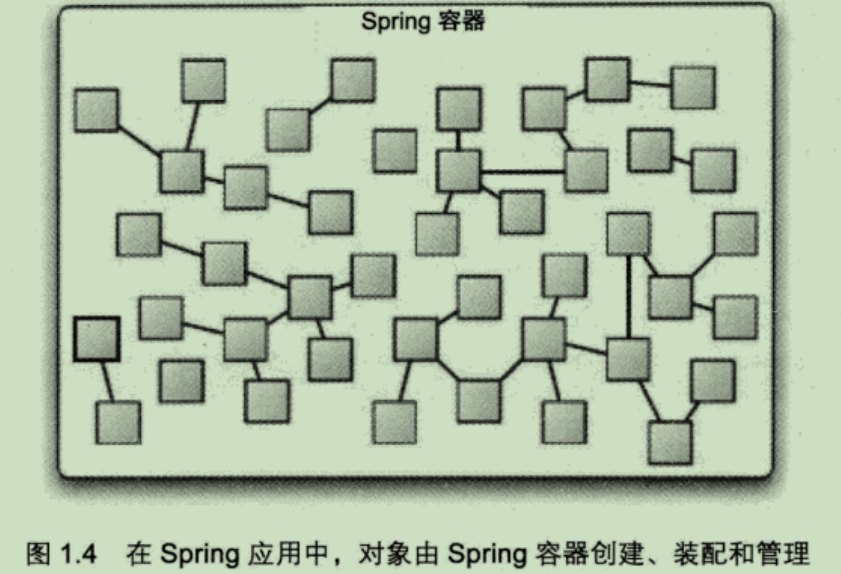
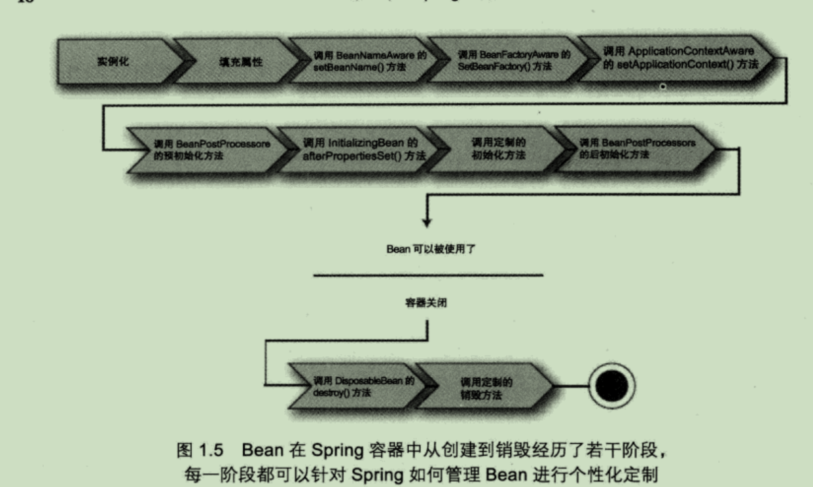
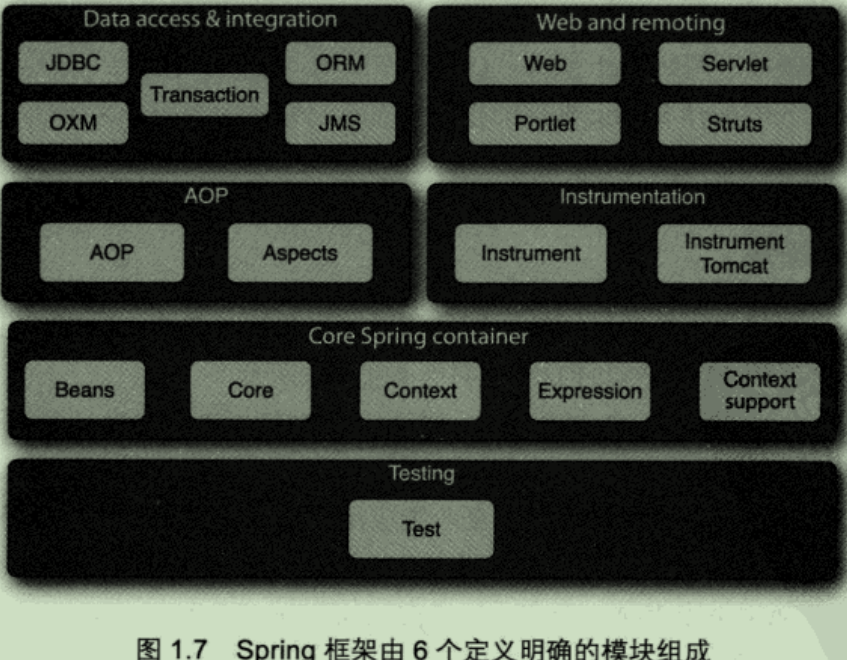

# Spring入门

Sping是一个开源框架，最早由Rod Johnson创建，并在《Expert One-on-ONe; JE22 Design and Development》这本著作中进行了介绍。Spring是为了解决企业级应用开发的复杂性而创建的，使用Spring可以让简单的JavaBean实现之前只有EJB才能完成的事情。但Spring不仅仅局限于服务器端开发，任何Java应用都能在简单性、可测试性和松耦合等方面从Spring中获益。

为了降低Java开发的复杂性，Spring采取了以下4种关键策略：

- 基于POJO的轻量级和最小侵入性编程；
- 通过依赖注入和面向接口实现松耦合；
- 基于切面和惯例进行声明式编程；
- 通过切面和模板减少样板式代码。

#### 激发POJO的潜能

相对于EJB的臃肿，Spring尽量避免因自身的api而弄乱用户的应用代码，Spring不会强迫用户实现Spring规范的接口或继承Spring规范的类，相反，在基于Spring构建的应用中，它的类通常没有任何痕迹表明你使用了Spring。最坏的场景是，一个类或许会使用Spring注解，但它依旧是POJO。

Spring赋予POJO魔力的方式之一就是通过`依赖注入`来装载它们。

### 依赖注入

任何一个有意义的应用一般都需要多个组件，这些组件之间必定需要进行相互协作才能完成特定的业务，从而导致组件之间的紧耦合，**牵一发而动全身**。
 代码示例：

```java
package com.springinaction.knights;

public class DamselRescuingKnight implements Knight {

    private RescueDamselQuest quest;

    public DamselRescuingKnight() {
        quest = new RescueDamselQuest();// 与RescueDamselQuest紧耦合
    }

    @Override
    public void embarhOnQuest() throws QuestException {
        quest.embark();
    }

}
```

正如你所见，DamselRescuingKnight 在它的构造函数中自行创建了RescueDamselQuest，这使得DamselRescuingKnight和RescueDamselQuest紧密地耦合到了一起，因此极大地限制了这个骑士的执行能力。如果一个少女需要救援，这个骑士能够召之即来。但是如果一条恶龙需要杀掉，那么这个骑士只能爱莫能助了。

另一方面，可以通过`依赖注入`的方式来完成对象之间的依赖关系，对象不再需要自行管理它们的依赖关系，而是通过依赖注入自动地注入到对象中去。

代码示例：

```java
package com.springinaction.knights;

public class BraveKnight implements Knight {

    private Quest quest;

    public BraveKnight(Quest quest) {
        this.quest = quest;// quest被注入到对象中
    }

    @Override
    public void embarhOnQuest() throws QuestException {
        quest.embark();
    }

}
```

不同于之前的DamselRescuingKnight，BraveKnight没有自行创建探险任务，而是在构造器中把探险任务作为参数注入，这也是依赖注入的一种方式，即**构造器注入**。

更为重要的是，BraveKnight中注入的探险类型是Quest，Quest只是一个探险任务所必须实现的接口。因此，BraveKnight能够响RescueDamselQuest、SlayDraonQuest等任意一种Quest实现，这正是**多态**的体现。

这里的要点是BraveKnight没有与任何特定的Quest实现发生耦合。对它来说，被要求挑战的探险任务只要实现了Quest接口，那么具体是哪一类型的探险就无关紧要了。这就是依赖注入最大的好处--**松耦合**。如果一个对象只通过**接口**（而不是具体实现或初始化的过程）来表明依赖关系，那么这种依赖就能够在对象本身毫不知情的情况下，用不同的具体实现进行替换。

#### 注入一个Quest到Knight

创建应用组件之间协作关系的行为称为**装配**，Spring有多种装配Bean的方式，其中最常用的就是通过XML配置文件的方式装配。
 示例代码：使用Spring将SlayDragonQuest注入到BraveKnight中。

```xml
<?xml version="1.0" encoding="UTF-8"?>
<beans xmlns="http://www.springframework.org/schema/beans"
    xmlns:xsi="http://www.w3.org/2001/XMLSchema-instance"
    xsi:schemaLocation="http://www.springframework.org/schema/beans http://www.springframework.org/schema/beans/spring-beans.xsd">

    <bean id="knight" class="com.springinaction.knights.BraveKnight">
        <constructor-arg ref="quest"></constructor-arg>
    </bean>

    <bean id="quest" class="com.springinaction.knights.SlayDragonQuest"></bean>

</beans>
```

### Spring是如何注入的？

Spring通过应用上下文（`ApplicationContext`）来装载Bean，`ApplicationContext`全权负责对象的创建和组装。

Spring自带了多种ApplicationContext来加载配置，比如，Spring可以使用`ClassPathXmlApplicationContext`来装载XML文件中的Bean对象。

```java
package com.springinaction.knights;

import org.springframework.context.ApplicationContext;
import org.springframework.context.support.ClassPathXmlApplicationContext;

public class KnightMain {
    public static void main(String[] args) {
        ApplicationContext context = new ClassPathXmlApplicationContext("knights.xml");// 加载Spring上下文
        Knight knight = (Knight) context.getBean("knight");// 获取knight Bean
        knight.embarhOnQuest();// 使用knight
    }
}
```

这个示例代码中，Spring上下文加载了`knights.xml`文件，随后获取了一个ID为knight的Bean的实例，得到该对象实例后，就可以进行正常的使用了。需要注意的是，这个类中完全不知道是由哪个Knight来执行何种Quest任务，只有`knights.xml`文件知道。

### 应用切面

通常情况下，系统由许多不同组件组成，其中的每一个组件分别负责一块特定功能。除了实现自身核心的功能之外，这些组件还经常承担着额外的职责，诸如日志、事务管理和安全等，此类的系统服务经常融入到有自身核心业务逻辑的组件中去，这些系统服务通常被称为**横切关注点**，因为它们总是跨越系统的多个组件，如下图所示。



对遍布系统的横切关注点的调用散布在各个组件里，而这些关注点并不是组件的核心业务

AOP可以使得这些服务模块化，并以声明的方式将它们应用到相应的组件中去，这样，这些组件就具有更高内聚性以及更加关注自身业务，完全不需要了解可能涉及的系统服务的复杂性。总之，AOP确保POJO保持简单。



利用AOP，可以将横切关注点覆盖在所需的组件之上，而这些组件不再需要额外的关注这些非核心业务。

如图所示，我们可以把切面想象为覆盖在很多组件之上的一个**外壳**。利用AOP，你可以使用各种功能层去包裹核心业务层。这些层以**声明的方式**灵活应用到你的系统中，甚至你的核心应用根本不知道它们的存在。

#### AOP应用

接上面骑士的故事，现在需要一个诗人来歌颂骑士的勇敢事迹，代码如下「Minstrel是中世纪的音乐记录器」：

```java
package com.springinaction.knights;

public class Minstrel {
    public void singBeforeQuest() { // 探险之前调用
        System.out.println("Fa la la; The knight is so brave!");
    }

    public void singAfterQuest() { // 探险之后调用
        System.out.println("Tee hee he; The brave knight did embark on a quest!");
    }
}
```

如代码中所示，诗人会在骑士每次执行探险前和结束时被调用，完成骑士事迹的歌颂。骑士必须调用诗人的方法完成歌颂：

```java
package com.springinaction.knights;

public class BraveKnight implements Knight {

    private Quest quest;
    private Minstrel minstrel;

    public BraveKnight(Quest quest) {
        this.quest = quest;// quest被注入到对象中
    }
    
    public BraveKnight(Quest quest, Minstrel minstrel) {
        this.quest = quest;// quest被注入到对象中
        this.minstrel = minstrel;
    }

    @Override
    public void embarhOnQuest() throws QuestException {
        minstrel.singAfterQuest();
        quest.embark();
        minstrel.singAfterQuest();
    }

}
```

但是，感觉是骑士在路边抓了一个诗人为自己「歌功颂德」，而不是诗人主动地为其传扬事迹。简单的BraveKnight类开始变得复杂，如果骑士不需要诗人，那么代码将会更加复杂。

但是有了AOP，骑士就不再需要自己调用诗人的方法为自己服务了，这就需要把Minstrel声明为一个切面：

```xml
<?xml version="1.0" encoding="UTF-8"?>
<beans xmlns="http://www.springframework.org/schema/beans"
    xmlns:xsi="http://www.w3.org/2001/XMLSchema-instance" xmlns:aop="http://www.springframework.org/schema/aop"
    xsi:schemaLocation="http://www.springframework.org/schema/beans http://www.springframework.org/schema/beans/spring-beans.xsd        
    http://www.springframework.org/schema/aop 
    http://www.springframework.org/schema/aop/spring-aop.xsd">

    <bean id="knight" class="com.springinaction.knights.BraveKnight">
        <constructor-arg ref="quest"></constructor-arg>
    </bean>

    <bean id="quest" class="com.springinaction.knights.SlayDragonQuest"></bean>

    <!-- 声明诗人Minstrel，待切入的对象（刀） -->
    <bean id="minstrel" class="com.springinaction.knights.Minstrel"></bean>

    <aop:config>
        <aop:aspect ref="minstrel">
            <!-- 定义切面，即定义从哪里切入 -->
            <aop:pointcut expression="execution(* *.embarkOnQuest(..))"
                id="embark" />
            <!-- 声明前置通知，在切入点之前执行的方法 -->
            <aop:before method="singBeforeQuest" pointcut-ref="embark" />

            <!-- 声明后置通知，在切入点之后执行的方法  -->
            <aop:after method="singAfterQuest" pointcut-ref="embark" />
        </aop:aspect>
    </aop:config>

</beans>
```

通过运行结果可以发现，在没有改动BraveKnight的代码的情况下，就完成了Minstrel对其的歌颂，而且BraveKnight并不知道Minstrel的存在。

### Bean

#### 容纳Bean

在Spring中，应用对象生存于Spring容器中，如图所示，Spring容器可以创建、装载、配置这些Bean，并且可以管理它们的生命周期。



#### Spring的容器实现

- Bean工厂（`org.springframework.beans.factory.BeanFactory`）：最简单的容器，提供基本的DI支持；
- 应用上下文（`org.springframework.context.ApplicationContext`）：基于BeanFactory之上构建，提供面向应用的服务。

#### 常用的几种应用上下文

- ClassPathXmlApplicationContext：从类路径中的XML配置文件加载上下文，会在所有的类路径（包括jar文件）下查找；
- FileSystemXmlApplicationContext：从文件系统中读取XML配置文件并加载上下文，在指定的文件系统路径下查找；
- XmlWebApplicationContext：读取Web应用下的XML配置文件并加载上下文；

#### Bean的生命周期



1. Spring对Bean进行实例化；

2. Spring将值和Bean的引用注入进Bean对应的属性中；

3. 如果Bean实现了`BeanNameAware`接口，Spring将Bean的ID传递给`setBeanName()`接口方法；

4. 如果Bean实现了`BeanFactoryAware`接口，Spring将调`setBeanFactory()`接口方法，将BeanFactory容器实例传入；

5. 如果Bean实现了`ApplicationContextAware`接口，Spring将调用`setApplicationContext()`接口方法，将应用上下文的引用传入；

6. 如果Bean实现了`BeanPostProcessor`接口，Spring将调用`postProcessBeforeInitialization()`接口方法；

7. 如果Bean实现了`InitializationBean`接口，Spring将调用`afterPropertiesSet()`方法。类似的如果Bean使用了`init-method`声明了初始化方法，该方法也会被调用；

8. 如果Bean实现了`BeanPostProcessor`接口，Spring将调用`ProcessAfterInitialization()`方法；

9. 此时此刻，Bean已经准备就绪，可以被应用程序使用了，它们将一直`驻留在应用上下文中`，直到该应用上下文被销毁；

10. 如果Bean实现了`DisposableBean`接口，Spring将调用`destory()`方法，同样的，如果Bean中使用了`destroy-method`声明了销毁方法，也会调用该方法；

### Spring模块



### 核心Spring容器

**容器**是Spring框架最核心的部分，它负责Spring应用中Bean的创建、配置和管理。Spring模块都构建与核心容器之上，当配置应用时，其实都隐式地使用了相关的核心容器类。另外，该模块还提供了许多企业级服务，如邮件、JNDI访问、EJB集成和调度等。

#### AOP

AOP是Spring应用系统开发切面的基础，与依赖注入一样，可以帮助应用对象`解耦`。借助于AOP，可以将遍布于应用的关注点（如事务和安全等）从所应用的对象中解耦出来。

#### 数据访问与集成

Spring的JDBC和DAO模块封装了大量的样板代码，这样可以使得在数据库代码变得简洁，也可以更专注于我们的业务，还可以避免数据库资源释放失败而引发的问题。另外，Spring AOP为数据访问提供了事务管理服务。同时，Spring还与流程的ORM（Object-Relational Mapping）进行了集成，如Hibernate、MyBatis等。

#### Web和远程调用

Spring提供了两种Web层框架：面向传统Web应用的基于Servlet的框架和面向使用Java Portlet API的基于Portlet的应用。Spring远程调用服务集成了RMI、Hessian、Burlap、JAX-WS等。

#### 测试

Spring提供了测试模块来测试Spring应用。

# 装配Bean

## 声明Bean

