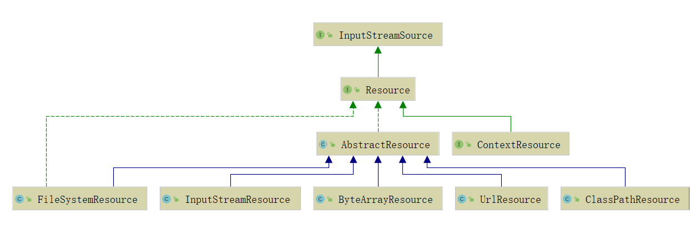
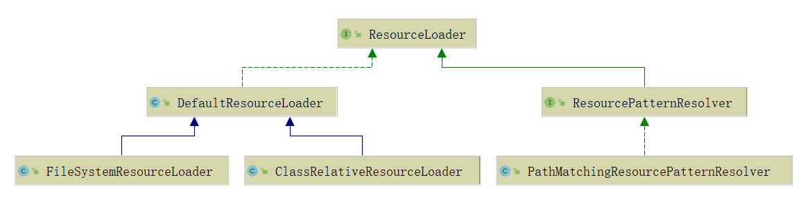
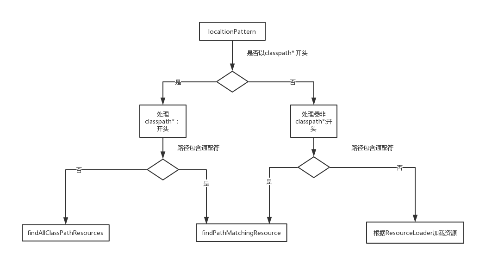

# IOC 之 Spring 统一资源加载策略 
在学 Java SE 的时候我们学习了一个标准类`java.net.URL`，该类在 Java SE 中的定位为统一资源定位器（Uniform Resource Locator），但是我们知道它的实现基本只限于网络形式发布的资源的查找和定位。然而，实际上资源的定义比较广泛，除了网络形式的资源，还有以二进制形式存在的、以文件形式存在的、以字节流形式存在的等等。而且它可以存在于任何场所，比如网络、文件系统、应用程序中。所以`java.net.URL`的局限性迫使 Spring 必须实现自己的资源加载策略，该资源加载策略需要满足如下要求：

1. 职能划分清楚。资源的定义和资源的加载应该要有一个清晰的界限；

2. 统一的抽象。统一的资源定义和资源加载策略。资源加载后要返回统一的抽象给客户端，客户端要对资源进行怎样的处理，应该由抽象资源接口来界定。
## 统一资源：Resource
`org.springframework.core.io.Resource`为 Spring 框架所有资源的抽象和访问接口，它继承 `org.springframework.core.io.InputStreamSource`接口。作为所有资源的统一抽象，Source 定义了一些通用的方法，由子类 `AbstractResource`提供统一的默认实现。定义如下：
```java
    public interface Resource extends InputStreamSource {

        /**

         * 资源是否存在

         */

        boolean exists();

        /**

         * 资源是否可读

         */

        default boolean isReadable() {

            return true;

        }

        /**

         * 资源所代表的句柄是否被一个stream打开了

         */

        default boolean isOpen() {

            return false;

        }

        /**

         * 是否为 File

         */

        default boolean isFile() {

            return false;

        }

        /**

         * 返回资源的URL的句柄

         */

        URL getURL() throws IOException;

        /**

         * 返回资源的URI的句柄

         */

        URI getURI() throws IOException;

        /**

         * 返回资源的File的句柄

         */

        File getFile() throws IOException;

        /**

         * 返回 ReadableByteChannel

         */

        default ReadableByteChannel readableChannel() throws IOException {

            return Channels.newChannel(getInputStream());

        }

        /**

         * 资源内容的长度

         */

        long contentLength() throws IOException;

        /**

         * 资源最后的修改时间

         */

        long lastModified() throws IOException;

        /**

         * 根据资源的相对路径创建新资源

         */

        Resource createRelative(String relativePath) throws IOException;

        /**

         * 资源的文件名

         */

        @Nullable

        String getFilename();

        /**

         * 资源的描述

         */

        String getDescription();

    }
```
类结构图如下：

从上图可以看到，Resource 根据资源的不同类型提供不同的具体实现，如下：
- FileSystemResource：对`java.io.File`类型资源的封装，只要是跟 File 打交道的，基本上与 FileSystemResource 也可以打交道。支持文件和 URL 的形式，实现 WritableResource 接口，且从 Spring Framework 5.0 开始，FileSystemResource 使用NIO.2 API进行读/写交互
- ByteArrayResource：对字节数组提供的数据的封装。如果通过 InputStream 形式访问该类型的资源，该实现会根据字节数组的数据构造一个相应的 ByteArrayInputStream。
- UrlResource：对 java.net.URL类型资源的封装。内部委派 URL 进行具体的资源操作。
- ClassPathResource：class path 类型资源的实现。使用给定的 ClassLoader 或者给定的 Class 来加载资源。
- InputStreamResource：将给定的 InputStream 作为一种资源的 Resource 的实现类。

AbstractResource 为 Resource 接口的默认实现，它实现了 Resource 接口的大部分的公共实现，作为 Resource 接口中的重中之重，其定义如下：
```java
    public abstract class AbstractResource implements Resource {

        /**

         * 判断文件是否存在，若判断过程产生异常（因为会调用SecurityManager来判断），就关闭对应的流

         */

        @Override

        public boolean exists() {

            try {

                return getFile().exists();

            }

            catch (IOException ex) {

                // Fall back to stream existence: can we open the stream?

                try {

                    InputStream is = getInputStream();

                    is.close();

                    return true;

                }

                catch (Throwable isEx) {

                    return false;

                }

            }

        }

        /**

         * 直接返回true，表示可读

         */

        @Override

        public boolean isReadable() {

            return true;

        }

        /**

         * 直接返回 false，表示未被打开

         */

        @Override

        public boolean isOpen() {

            return false;

        }

        /**

         *  直接返回false，表示不为 File

         */

        @Override

        public boolean isFile() {

            return false;

        }

        /**

         * 抛出 FileNotFoundException 异常，交给子类实现

         */

        @Override

        public URL getURL() throws IOException {

            throw new FileNotFoundException(getDescription() + " cannot be resolved to URL");

        }

        /**

         * 基于 getURL() 返回的 URL 构建 URI

         */

        @Override

        public URI getURI() throws IOException {

            URL url = getURL();

            try {

                return ResourceUtils.toURI(url);

            }

            catch (URISyntaxException ex) {

                throw new NestedIOException("Invalid URI [" + url + "]", ex);

            }

        }

        /**

         * 抛出 FileNotFoundException 异常，交给子类实现

         */

        @Override

        public File getFile() throws IOException {

            throw new FileNotFoundException(getDescription() + " cannot be resolved to absolute file path");

        }

        /**

         * 根据 getInputStream() 的返回结果构建 ReadableByteChannel

         */

        @Override

        public ReadableByteChannel readableChannel() throws IOException {

            return Channels.newChannel(getInputStream());

        }

        /**

         * 获取资源的长度

         *

         * 这个资源内容长度实际就是资源的字节长度，通过全部读取一遍来判断

         */

        @Override

        public long contentLength() throws IOException {

            InputStream is = getInputStream();

            try {

                long size = 0;

                byte[] buf = new byte[255];

                int read;

                while ((read = is.read(buf)) != -1) {

                    size += read;

                }

                return size;

            }

            finally {

                try {

                    is.close();

                }

                catch (IOException ex) {

                }

            }

        }

        /**

         * 返回资源最后的修改时间

         */

        @Override

        public long lastModified() throws IOException {

            long lastModified = getFileForLastModifiedCheck().lastModified();

            if (lastModified == 0L) {

                throw new FileNotFoundException(getDescription() +

                        " cannot be resolved in the file system for resolving its last-modified timestamp");

            }

            return lastModified;

        }

        protected File getFileForLastModifiedCheck() throws IOException {

            return getFile();

        }

        /**

         * 交给子类实现

         */

        @Override

        public Resource createRelative(String relativePath) throws IOException {

            throw new FileNotFoundException("Cannot create a relative resource for " + getDescription());

        }

        /**

         * 获取资源名称，默认返回 null

         */

        @Override

        @Nullable

        public String getFilename() {

            return null;

        }

        /**

         * 返回资源的描述

         */

        @Override

        public String toString() {

            return getDescription();

        }

        @Override

        public boolean equals(Object obj) {

            return (obj == this ||

                (obj instanceof Resource && ((Resource) obj).getDescription().equals(getDescription())));

        }

        @Override

        public int hashCode() {

            return getDescription().hashCode();

        }

    }
```
如果我们想要实现自定义的 Resource，记住不要实现 Resource 接口，而应该继承 AbstractResource 抽象类，然后根据当前的具体资源特性覆盖相应的方法即可。
## 统一资源定位：ResourceLoader
一开始就说了 Spring 将资源的定义和资源的加载区分开了，Resource 定义了统一的资源，那资源的加载则由 ResourceLoader 来统一定义。

`org.springframework.core.io.ResourceLoader`为 Spring 资源加载的统一抽象，具体的资源加载则由相应的实现类来完成，所以我们可以将 ResourceLoader 称作为统一资源定位器。其定义如下：
```java
    public interface ResourceLoader {

        String CLASSPATH_URL_PREFIX = ResourceUtils.CLASSPATH_URL_PREFIX;

        Resource getResource(String location);

        ClassLoader getClassLoader();

    }
```

ResourceLoader 接口提供两个方法：`getResource()`、`getClassLoader()`。
`getResource()`根据所提供资源的路径 location 返回 Resource 实例，但是它不确保该 Resource 一定存在，需要调用`Resource.exist()`方法判断。该方法支持以下模式的资源加载：
- URL位置资源，如”file:C:/test.dat”
- ClassPath位置资源，如”classpath:test.dat”
- 相对路径资源，如”WEB-INF/test.dat”，此时返回的Resource实例根据实现不同而不同

该方法的主要实现是在其子类 DefaultResourceLoader 中实现，具体过程我们在分析 DefaultResourceLoader 时做详细说明。

`getClassLoader()`返回 ClassLoader 实例，对于想要获取 ResourceLoader 使用的 ClassLoader 用户来说，可以直接调用该方法来获取，

对于想要获取 ResourceLoader 使用的 ClassLoader 用户来说，可以直接调用`getClassLoader()`方法获得。在分析 Resource 时，提到了一个类 ClassPathResource ，这个类是可以根据指定的 ClassLoader 来加载资源的。

作为 Spring 统一的资源加载器，它提供了统一的抽象，具体的实现则由相应的子类来负责实现，其类的类结构图如下：

### DefaultResourceLoader
与 DefaultResource 相似，DefaultResourceLoader 是 ResourceLoader 的默认实现，它接收 ClassLoader 作为构造函数的参数或者使用不带参数的构造函数，在使用不带参数的构造函数时，使用的 ClassLoader 为默认的 ClassLoader（一般为 Thread.currentThread().getContextClassLoader()），可以通过 ClassUtils.getDefaultClassLoader()获取。当然也可以调用 setClassLoader()方法进行后续设置。如下：
```java
        public DefaultResourceLoader() {

            this.classLoader = ClassUtils.getDefaultClassLoader();

        }

        public DefaultResourceLoader(@Nullable ClassLoader classLoader) {

            this.classLoader = classLoader;

        }

        public void setClassLoader(@Nullable ClassLoader classLoader) {

            this.classLoader = classLoader;

        }

        @Override

        @Nullable

        public ClassLoader getClassLoader() {

            return (this.classLoader != null ? this.classLoader : ClassUtils.getDefaultClassLoader());

        }
```
ResourceLoader 中最核心的方法为`getResource()`,它根据提供的 location 返回相应的 Resource，而 DefaultResourceLoader 对该方法提供了核心实现(它的两个子类都没有提供覆盖该方法，所以可以断定ResourceLoader 的资源加载策略就封装 DefaultResourceLoader中)，如下：
```java
 public Resource getResource(String location) {

        Assert.notNull(location, "Location must not be null");

        for (ProtocolResolver protocolResolver : this.protocolResolvers) {

            Resource resource = protocolResolver.resolve(location, this);

            if (resource != null) {

                return resource;

            }

        }

        if (location.startsWith("/")) {

            return getResourceByPath(location);

        }

        else if (location.startsWith(CLASSPATH_URL_PREFIX)) {

            return new ClassPathResource(location.substring(CLASSPATH_URL_PREFIX.length()), getClassLoader());

        }

        else {

            try {

                // Try to parse the location as a URL...

                URL url = new URL(location);

                return (ResourceUtils.isFileURL(url) ? new FileUrlResource(url) : new UrlResource(url));

            }

            catch (MalformedURLException ex) {

                // No URL -> resolve as resource path.

                return getResourceByPath(location);

            }

        }

    }
```
首先通过 ProtocolResolver 来加载资源，成功返回 Resource，否则调用如下逻辑：
- 若 location 以 / 开头，则调用`getResourceByPath()`构造 ClassPathContextResource 类型资源并返回。
- 若 location 以 classpath: 开头，则构造 ClassPathResource 类型资源并返回，在构造该资源时，通过`getClassLoader()`获取当前的 ClassLoader。
- 构造 URL ，尝试通过它进行资源定位，若没有抛出 MalformedURLException 异常，则判断是否为 FileURL , 如果是则构造 FileUrlResource 类型资源，否则构造 UrlResource。若在加载过程中抛出 MalformedURLException 异常，则委派`getResourceByPath()`实现资源定位加载。

ProtocolResolver ，用户自定义协议资源解决策略，作为 DefaultResourceLoader 的 SPI，它允许用户自定义资源加载协议，而不需要继承 ResourceLoader 的子类。在介绍 Resource 时，提到如果要实现自定义 Resource，我们只需要继承 DefaultResource 即可，但是有了 ProtocolResolver 后，我们不需要直接继承 DefaultResourceLoader，改为实现 ProtocolResolver 接口也可以实现自定义的 ResourceLoader。
ProtocolResolver 接口，仅有一个方法 Resourceresolve(Stringlocation,ResourceLoaderresourceLoader)，该方法接收两个参数：资源路径location，指定的加载器 ResourceLoader，返回为相应的 Resource 。在 Spring 中你会发现该接口并没有实现类，它需要用户自定义，自定义的 Resolver 如何加入 Spring 体系呢？调用 DefaultResourceLoader.addProtocolResolver() 即可，如下：
```java
        public void addProtocolResolver(ProtocolResolver resolver) {

            Assert.notNull(resolver, "ProtocolResolver must not be null");

            this.protocolResolvers.add(resolver);

        }
```
### FileSystemResourceLoader
从上面的示例我们看到，其实 DefaultResourceLoader 对`getResourceByPath(String)`方法处理其实不是很恰当，这个时候我们可以使用 FileSystemResourceLoader ，它继承 DefaultResourceLoader 且覆写了`getResourceByPath(String)`，使之从文件系统加载资源并以 FileSystemResource 类型返回，这样我们就可以得到想要的资源类型，如下：
```java
        @Override

        protected Resource getResourceByPath(String path) {

            if (path.startsWith("/")) {

                path = path.substring(1);

            }

            return new FileSystemContextResource(path);

        }
```
FileSystemContextResource 为 FileSystemResourceLoader 的内部类，它继承 FileSystemResource。
```java
        private static class FileSystemContextResource extends FileSystemResource implements ContextResource {

            public FileSystemContextResource(String path) {

                super(path);

            }

            @Override

            public String getPathWithinContext() {

                return getPath();

            }

        }
```
在构造器中也是调用 FileSystemResource 的构造方法来构造 FileSystemResource 的。

如果将上面的示例将 DefaultResourceLoader 改为 FileSystemContextResource ，则 fileResource1 则为 FileSystemResource。

### ResourcePatternResolver
ResourceLoader 的`ResourcegetResource(Stringlocation)`每次只能根据 location 返回一个 Resource，当需要加载多个资源时，我们除了多次调用`getResource()`外别无他法。ResourcePatternResolver 是 ResourceLoader 的扩展，它支持根据指定的资源路径匹配模式每次返回多个 Resource 实例，其定义如下：
```java
    public interface ResourcePatternResolver extends ResourceLoader {

        String CLASSPATH_ALL_URL_PREFIX = "classpath*:";

        Resource[] getResources(String locationPattern) throws IOException;

    }
```
ResourcePatternResolver 在 ResourceLoader 的基础上增加了 getResources(StringlocationPattern)，以支持根据路径匹配模式返回多个 Resource 实例，同时也新增了一种新的协议前缀 classpath*:，该协议前缀由其子类负责实现。

PathMatchingResourcePatternResolver 为 ResourcePatternResolver 最常用的子类，它除了支持 ResourceLoader 和 ResourcePatternResolver 新增的 classpath*: 前缀外，还支持 Ant 风格的路径匹配模式（类似于 **/*.xml）。

PathMatchingResourcePatternResolver 提供了三个构造方法，如下：
```java
    public PathMatchingResourcePatternResolver() {

            this.resourceLoader = new DefaultResourceLoader();

        }

        public PathMatchingResourcePatternResolver(ResourceLoader resourceLoader) {

            Assert.notNull(resourceLoader, "ResourceLoader must not be null");

            this.resourceLoader = resourceLoader;

        }

        public PathMatchingResourcePatternResolver(@Nullable ClassLoader classLoader) {

            this.resourceLoader = new DefaultResourceLoader(classLoader);

        }
```
PathMatchingResourcePatternResolver 在实例化的时候，可以指定一个 ResourceLoader，如果不指定的话，它会在内部构造一个 DefaultResourceLoader。
**Resource getResource(String location)**
```java
        @Override

        public Resource getResource(String location) {

            return getResourceLoader().getResource(location);

        }
```
`getResource()`方法直接委托给相应的 ResourceLoader 来实现，所以如果我们在实例化的 PathMatchingResourcePatternResolver 的时候，如果不知道 ResourceLoader ，那么在加载资源时，其实就是 DefaultResourceLoader 的过程。其实在下面介绍的`Resource[]getResources(StringlocationPattern)`也相同，只不过返回的资源时多个而已。
**Resource[] getResources(String locationPattern)**
```java
        public Resource[] getResources(String locationPattern) throws IOException {

            Assert.notNull(locationPattern, "Location pattern must not be null");

            // 以 classpath*: 开头

            if (locationPattern.startsWith(CLASSPATH_ALL_URL_PREFIX)) {

                // 路径包含通配符

                if (getPathMatcher().isPattern(locationPattern.substring(CLASSPATH_ALL_URL_PREFIX.length()))) {

                    return findPathMatchingResources(locationPattern);

                }

                else {

                    // 路径不包含通配符

                    return findAllClassPathResources(locationPattern.substring(CLASSPATH_ALL_URL_PREFIX.length()));

                }

            }

            else {

                int prefixEnd = (locationPattern.startsWith("war:") ? locationPattern.indexOf("*/") + 1 :

                        locationPattern.indexOf(':') + 1);

                // 路径包含通配符

                if (getPathMatcher().isPattern(locationPattern.substring(prefixEnd))) {

                    return findPathMatchingResources(locationPattern);

                }

                else {

                    return new Resource[] {getResourceLoader().getResource(locationPattern)};

                }

            }

        }
```
处理逻辑如下图：

下面就`findAllClassPathResources()`、` findAllClassPathResources()`做详细分析。
#### findAllClassPathResources()
当 locationPattern 以 classpath*: 开头但是不包含通配符，则调用`findAllClassPathResources()`方法加载资源。该方法返回 classes 路径下和所有 jar 包中的所有相匹配的资源。
```java
  protected Resource[] findAllClassPathResources(String location) throws IOException {

        String path = location;

        if (path.startsWith("/")) {

            path = path.substring(1);

        }

        Set<Resource> result = doFindAllClassPathResources(path);

        if (logger.isDebugEnabled()) {

            logger.debug("Resolved classpath location [" + location + "] to resources " + result);

        }

        return result.toArray(new Resource[0]);

    }
```
真正执行加载的是在`doFindAllClassPathResources()`方法，如下：
```java
        protected Set<Resource> doFindAllClassPathResources(String path) throws IOException {

            Set<Resource> result = new LinkedHashSet<>(16);

            ClassLoader cl = getClassLoader();

            Enumeration<URL> resourceUrls = (cl != null ? cl.getResources(path) : ClassLoader.getSystemResources(path));

            while (resourceUrls.hasMoreElements()) {

                URL url = resourceUrls.nextElement();

                result.add(convertClassLoaderURL(url));

            }

            if ("".equals(path)) {

                addAllClassLoaderJarRoots(cl, result);

            }

            return result;

        }
```
`doFindAllClassPathResources()`根据 ClassLoader 加载路径下的所有资源。在加载资源过程中如果，在构造 PathMatchingResourcePatternResolver 实例的时候如果传入了 ClassLoader，则调用其`getResources()`，否则调用`ClassLoader.getSystemResources(path)`。`ClassLoader.getResources()`如下:
```java
        public Enumeration<URL> getResources(String name) throws IOException {

            @SuppressWarnings("unchecked")

            Enumeration<URL>[] tmp = (Enumeration<URL>[]) new Enumeration<?>[2];

            if (parent != null) {

                tmp[0] = parent.getResources(name);

            } else {

                tmp[0] = getBootstrapResources(name);

            }

            tmp[1] = findResources(name);

            return new CompoundEnumeration<>(tmp);

        }
```
看到这里是不是就已经一目了然了？如果当前父类加载器不为 null，则通过父类向上迭代获取资源，否则调用 `getBootstrapResources()`。这里是不是特别熟悉，(^▽^)。

若 path 为 空（“”）时，则调用`addAllClassLoaderJarRoots()`方法。该方法主要是加载路径下得所有 jar 包，方法较长也没有什么实际意义就不贴出来了。

通过上面的分析，我们知道`findAllClassPathResources()`其实就是利用 ClassLoader 来加载指定路径下的资源，不过它是在 class 路径下还是在 jar 包中。如果我们传入的路径为空或者 /，则会调用`addAllClassLoaderJarRoots()`方法加载所有的 jar 包。
#### findAllClassPathResources()
当 locationPattern 以 classpath*: 开头且当中包含了通配符，则调用该方法进行资源加载。如下：
```java
    protected Resource[] findPathMatchingResources(String locationPattern) throws IOException {

            // 确定跟路径

            String rootDirPath = determineRootDir(locationPattern);

            String subPattern = locationPattern.substring(rootDirPath.length());

            // 获取根据路径下得资源

            Resource[] rootDirResources = getResources(rootDirPath);

            Set<Resource> result = new LinkedHashSet<>(16);

            for (Resource rootDirResource : rootDirResources) {

                rootDirResource = resolveRootDirResource(rootDirResource);

                URL rootDirUrl = rootDirResource.getURL();

                // bundle 资源类型

                if (equinoxResolveMethod != null && rootDirUrl.getProtocol().startsWith("bundle")) {

                    URL resolvedUrl = (URL) ReflectionUtils.invokeMethod(equinoxResolveMethod, null, rootDirUrl);

                    if (resolvedUrl != null) {

                        rootDirUrl = resolvedUrl;

                    }

                    rootDirResource = new UrlResource(rootDirUrl);

                }

                // VFS 资源

                if (rootDirUrl.getProtocol().startsWith(ResourceUtils.URL_PROTOCOL_VFS)) {

                    result.addAll(VfsResourceMatchingDelegate.findMatchingResources(rootDirUrl, subPattern, getPathMatcher()));

                }

                // Jar

                else if (ResourceUtils.isJarURL(rootDirUrl) || isJarResource(rootDirResource)) {

                    result.addAll(doFindPathMatchingJarResources(rootDirResource, rootDirUrl, subPattern));

                }

                else {

                    result.addAll(doFindPathMatchingFileResources(rootDirResource, subPattern));

                }

            }

            if (logger.isDebugEnabled()) {

                logger.debug("Resolved location pattern [" + locationPattern + "] to resources " + result);

            }

            return result.toArray(new Resource[0]);

        }
```
方法有点儿长，但是思路还是很清晰的，主要分两步：
1. 确定目录，获取该目录下得所有资源
2. 在所获得的所有资源中进行迭代匹配获取我们想要的资源。

在这个方法里面我们要关注两个方法，一个是`determineRootDir()`,一个是`doFindPathMatchingFileResources()`。
determineRootDir()主要是用于确定根路径，如下：
```java
        protected String determineRootDir(String location) {

            int prefixEnd = location.indexOf(':') + 1;

            int rootDirEnd = location.length();

            while (rootDirEnd > prefixEnd && getPathMatcher().isPattern(location.substring(prefixEnd, rootDirEnd))) {

                rootDirEnd = location.lastIndexOf('/', rootDirEnd - 2) + 1;

            }

            if (rootDirEnd == 0) {

                rootDirEnd = prefixEnd;

            }

            return location.substring(0, rootDirEnd);

        }
```
该方法一定要给出一个确定的根目录。该根目录用于确定文件的匹配的起始点，将根目录位置的资源解析为`java.io.File`并将其传递到`retrieveMatchingFiles()`，其余为知用于模式匹配，找出我们所需要的资源。
| 原路经 | 确定根路径 | 
|--- | --- |
| classpath*:test/cc*/spring-*.xml | classpath*:test/ |
| classpath*:test/aa/spring-*.xml | classpath*:test/aa/ |

至此 Spring 整个资源记载过程已经分析完毕。下面简要总结下：确定根路径后，则调用 getResources() 方法获取该路径下得所有资源，然后迭代资源获取符合条件的资源。

- Spring 提供了 Resource 和 ResourceLoader 来统一抽象整个资源及其定位。使得资源与资源的定位有了一个更加清晰的界限，并且提供了合适的 Default 类，使得自定义实现更加方便和清晰。

- DefaultResource 为 Resource 的默认实现，它对 Resource 接口做了一个统一的实现，子类继承该类后只需要覆盖相应的方法即可，同时对于自定义的 Resource 我们也是继承该类。

- DefaultResourceLoader 同样也是 ResourceLoader 的默认实现，在自定 ResourceLoader 的时候我们除了可以继承该类外还可以实现 ProtocolResolver 接口来实现自定资源加载协议。

- DefaultResourceLoader 每次只能返回单一的资源，所以 Spring 针对这个提供了另外一个接口 ResourcePatternResolver ，该接口提供了根据指定的 locationPattern 返回多个资源的策略。其子类 PathMatchingResourcePatternResolver 是一个集大成者的`ResourceLoader`，因为它即实现了`ResourcegetResource(Stringlocation)`也实现了`Resource[]getResources(StringlocationPattern)`。