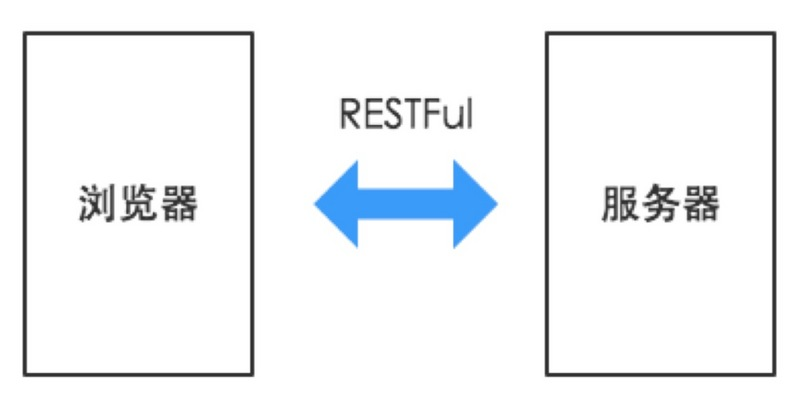
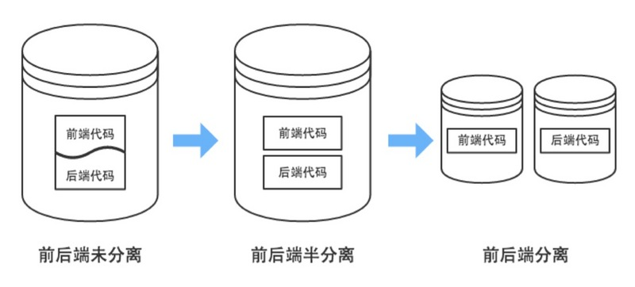
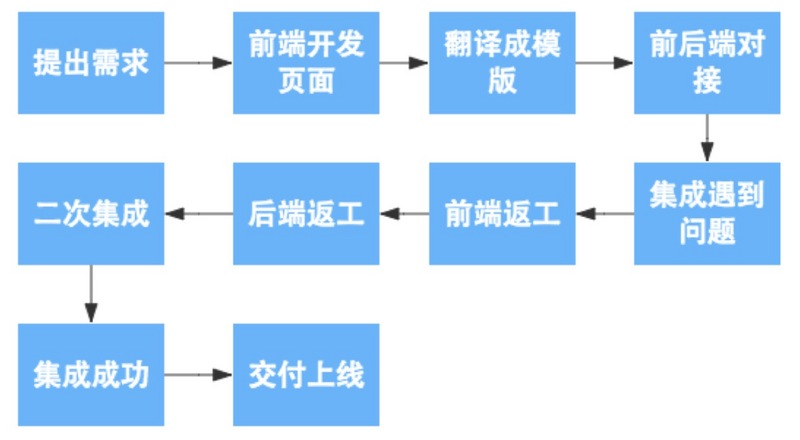
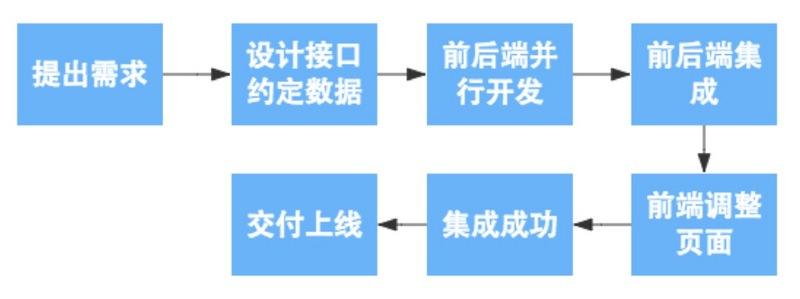
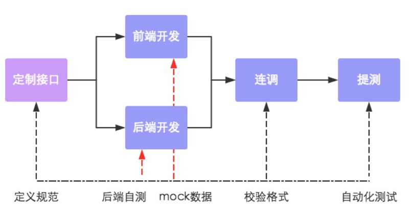
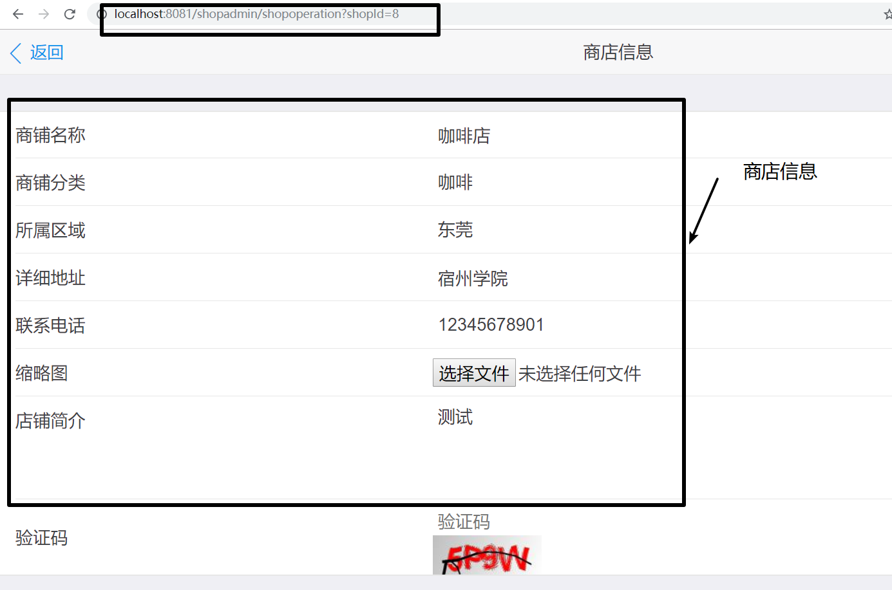
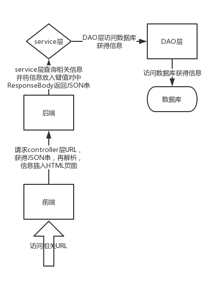

# SSM框架中的前后端分离

## 认识前后端分离

在传统的web应用开发中，大多数的程序员会将浏览器作为前后端的分界线。将浏览器中为用户进行页面展示的部分称之为前端，而将运行在服务器，为前端提供业务逻辑和数据准备的所有代码统称为后端。

由于前后端分离这个概念相对来说刚出现不久，很多人都是只闻其声，不见其形，所以可能会对它产生一些误解，误以为前后端分离只是一种web应用开发模式，只要在web应用的开发期进行了前后端开发工作的分工就是前后端分离。

其实`前后端分离并不只是开发模式，而是web应用的一种架构模式`。在开发阶段，前后端工程师约定好数据交互接口，实现并行开发和测试；在运行阶段前后端分离模式需要对web应用进行分离部署，前后端之前使用HTTP或者其他协议进行交互请求。然而作为一种架构模式，我们在实施的过程中主要对以下四个方面来进行比较和重新认识。

前后端分离大概可以从四个方面来理解：

1. 交互形式
2. 代码组织方式
3. 开发模式
4. 数据接口规范流程

### 一、交互形式



在前后端分离架构中，后端只需要负责按照约定的数据格式向前端提供可调用的API服务即可。前后端之间通过HTTP请求进行交互，前端获取到数据后，进行页面的组装和渲染，最终返回给浏览器。

### 二、代码组织方式



在传统架构模式中，前后端代码存放于同一个代码库中，甚至是同一工程目录下。页面中还夹杂着后端代码。前后端工程师进行开发时，都必须把整个项目导入到开发工具中。

而前后端分离模式在代码组织形式上有以下两种:

- **半分离**
  前后端共用一个代码库，但是代码分别存放在两个工程中。后端不关心或很少 关心前端元素的输出情况，前端不能独立进行开发和测试，项目中缺乏前后端 交互的测试用例。
- **分离** 
  前后端代码库分离，前端代码中有可以进行Mock测试(通过构造虚拟测试对 象以简化测试环境的方法)的伪后端，能支持前端的独立开发和测试。而后端 代码中除了功能实现外，还有着详细的测试用例，以保证API的可用性，降低 集成风险。

### 三、开发模式

我们之前的架构属于传统的MVC架构，整体没有进行前后端分离，在项目的开发阶段，前端工程师负责编写HTML，完成前端的页面设计并套页面，然后再使用模板技术将写好的前端代码转换为Smarty脚本，同时内嵌一些后端提供的模板变量和一些逻辑操作。应用运行期，将全部代码进行打包，和后端代码部署到同一服务器上，同时会进行简单的动静态分离部署。

此时，应用的开发流程如下图所示。



而在实现前后端分离架构之后，前端工程师只需要编写HTML、js、CSS等前端资源，然后通 过HTTP请求调用后端提供的服务即可。除了开发期的分离，在运行期前后端资源也 会进行分离部署。

前后端分离之后，开发流程将如下图所示。



通过上面的两幅流程图，不难发现，在开发模式上，前后段分离不仅仅只是工程师的分工开发，更重要的意义在于`实现了前后端的并行开发，简化了开发流程`。

### 四、数据接口规范流程

在开发期间前后端共同商定好数据接口的交互形式和数据格式。然后实现前后端的并行开发，其中前端工程师再开发完成之后可以独自进行mock测试，而后端也可以使用接口测试平台进行接口自测，然后前后端一起进行功能联调并校验格式，最终进行自动化测试。



## 分离的四个好处

前后端分离模式和传统的web应用架构相比有很大的不同，到底分还是不分，这还真是个问题。

从目前应用软件开发的发展趋势来看，主要有两方面需要注意：

1. 越来越注重用户体验，随着互联网的发展，开始多终端化。
2. 大型应用架构模式正在向云化、微服务化发展。

我们主要通过前后端分离架构，为我们带来以下四个方面的提升：

- **为优质产品打造精益团队**
  通过将开发团队前后端分离化，让前后端工程师只需要专注于前端或后端的开发工作，是的前后端工程师实现自治，培养其独特的技术特性，然后构建出一个全栈式的精益开发团队。
- **提升开发效率**
  前后端分离以后，可以实现前后端代码的解耦，只要前后端沟通约定好应用所需接口以及接口参数，便可以开始并行开发，无需等待对方的开发工作结束。与此同时，即使需求发生变更，只要接口与数据格式不变，后端开发人员就不需要修改代码，只要前端进行变动即可。如此一来整个应用的开发效率必然会有质的提升。
- **完美应对复杂多变的前端需求**
  如果开发团队能完成前后端分离的转型，打造优秀的前后端团队，开发独立化，让开发人员做到专注专精，开发能力必然会有所提升，能够完美应对各种复杂多变的前端需求。
- **增强代码可维护性**
  前后端分离后，应用的代码不再是前后端混合，只有在运行期才会有调用依赖关系。

应用代码将会变得整洁清晰，不论是代码阅读还是代码维护都会比以前轻松。


---

以上转自[前后端分离实践（一）](https://segmentfault.com/a/1190000009329474)

## 利用JSON串来实现前后端分离

在自己最近做的项目中，使用的是利用SSM框架中的controller层来传出JSON串，再通过jQuery中的`.getJSON()`来进行解析，再将数据传到前端页面。

### controller层

部分代码省略，放出关键代码：

`ShopManagementController`

```java
@Controller
@RequestMapping("/shopadmin")
public class ShopManagementController {
    @Autowired
    private ShopService shopService;
    @Autowired
    private ShopCategoryService shopCategoryService;
    @Autowired
    private AreaService areaService;
    @RequestMapping(value = "/getshopmanagementinfo",method = RequestMethod.GET)
    @ResponseBody
    private Map<String,Object> getShopManagementInfo(HttpServletRequest request) {
        Map<String,Object> modelMap = new HashMap<String, Object>();
        long shopId = HttpServletRequestUtil.getLong(request,"shopId");
        if(shopId <= 0){
            Object currentShopObj = request.getSession().getAttribute("shopId");
            if(currentShopObj == null){
                modelMap.put("redirect",true);
                modelMap.put("url","/shopadmin/shoplist");
            }else {
                Shop currentShop = (Shop) currentShopObj;
                modelMap.put("redirect",false);
                modelMap.put("shopId",currentShop.getShopId());
            }
        }else{
            Shop currentShop = new Shop();
            currentShop.setShopId(shopId);
            request.getSession().setAttribute("currentShop",currentShop);
            modelMap.put("redirect",false);
        }
        return modelMap;
    }

    @RequestMapping(value = "/getshoplist",method = RequestMethod.GET)
    @ResponseBody
    private Map<String,Object> getShopList(HttpServletRequest request){
        Map<String,Object> modelMap = new HashMap<String, Object>();
        PersonInfo user = new PersonInfo();
        user.setUserId(1L);
        user.setName("test");
        request.getSession().setAttribute("user",user);
        user = (PersonInfo) request.getSession().getAttribute("user");
        try{
            Shop shopCondition;
            shopCondition = new Shop();
            shopCondition.setOwner(user);
            ShopExecution se = shopService.getShopList(shopCondition,0,100);
            modelMap.put("shopList",se.getShopList());
            modelMap.put("user",user);
            modelMap.put("success",true);
        }catch (Exception e){
            modelMap.put("success",false);
            modelMap.put("errMsg",e.getMessage());
        }
        return modelMap;
    }

    @RequestMapping(value = "/getshopbyid",method = RequestMethod.GET)
    @ResponseBody
    private Map<String,Object> getShopById(HttpServletRequest request){
        Map<String,Object> modelMap = new HashMap<String,Object>();
        Long shopId = HttpServletRequestUtil.getLong(request,"shopId");
        if(shopId > -1){
            try {
                Shop shop = shopService.getByShopId(shopId);
                List<Area> areaList = areaService.getAreaList();
                modelMap.put("shop",shop);
                modelMap.put("areaList",areaList);
                modelMap.put("success",true);
            }catch (Exception e){
                modelMap.put("success",false);
                modelMap.put("errMsg",e.getMessage());
            }
        }else {
            modelMap.put("success",false);
            modelMap.put("errMsg","empty shopId");
        }
        return modelMap;
    }

    @RequestMapping(value = "/getshopinitinfo",method = RequestMethod.GET)
    @ResponseBody
    public Map<String,Object> getShopInitInfo(){
        Map<String,Object> modelMap = new HashMap<String, Object>();
        List<ShopCategory> shopCategoryList = new ArrayList<ShopCategory>();
        List<Area> areaList = new ArrayList<Area>();
        try {
            shopCategoryList = shopCategoryService.getShopCategoryList(new ShopCategory());
            areaList = areaService.getAreaList();
            modelMap.put("shopCategoryList",shopCategoryList);
            modelMap.put("areaList",areaList);
            modelMap.put("success",true);
        }catch (Exception e){
            modelMap.put("success",false);
            modelMap.put("errMsg",e.getMessage());
        }
        return modelMap;
    }

    @RequestMapping(value = "/modifyshop",method = {RequestMethod.POST})
    @ResponseBody
    public Map<String,Object> modifyShop(HttpServletRequest request) throws IOException {
        Map<String,Object> modelMap = new HashMap<String, Object>();
        //判断验证码是否正确
        if(!CodeUtil.checkVerifyCode(request)){
            modelMap.put("success",false);
            modelMap.put("errMsg","输入了错误的验证码");
            return modelMap;
        }
        //1.接收并转化相应的参数，包括店铺信息以及图片信息
        String shopStr = HttpServletRequestUtil.getString(request,"shopStr");
        ObjectMapper mapper = new ObjectMapper();
        Shop shop = null;
        try {
            shop = mapper.readValue(shopStr,Shop.class);
        }catch (Exception e){
            modelMap.put("success",false);
            modelMap.put("errMsg",e.getMessage());
            return modelMap;
        }
        CommonsMultipartFile shopImg = null;
        CommonsMultipartResolver commonsMultipartResolver =new CommonsMultipartResolver(
                request.getSession().getServletContext());
        // 检测文件是否有上传文件流
        if (commonsMultipartResolver.isMultipart(request)){
            MultipartHttpServletRequest multipartHttpServletRequest = (MultipartHttpServletRequest) request;
            shopImg = (CommonsMultipartFile) multipartHttpServletRequest.getFile("shopImg");
        }
        //2.修改店铺信息
        if(shop != null && shop.getShopId() != null){
            PersonInfo owner =(PersonInfo) request.getSession().getAttribute("user");
            // session
            owner.setUserId(1L);
            shop.setOwner(owner);
            ShopExecution se;
            try {
                if (shopImg == null){
                    se = shopService.modifyShop(shop, new ImageHolder(null, null));
                }else {
                    se = shopService.modifyShop(shop,
                            new ImageHolder(shopImg.getInputStream(), shopImg.getOriginalFilename()));
                }
                if(se.getState()==ShopStateEnum.SUCCESS.getState()){
                    modelMap.put("success",true);
                }else {
                    modelMap.put("success",false);
                    modelMap.put("errMsg",se.getStateInfo());
                }
            }catch (ShopOperationException e){
                modelMap.put("success",false);
                modelMap.put("errMsg",e.getMessage());
            } catch (IOException e){
                modelMap.put("success",false);
                modelMap.put("errMsg",e.getMessage());
            }
            return modelMap;
        }else {
            modelMap.put("success",false);
            modelMap.put("errMsg","请输入店铺Id");
            return  modelMap;
        }
    }
}
```

拿`getShopById`做分析

```java
	//返回/getshopbyid的url，方法为get
	@RequestMapping(value = "/getshopbyid",method = RequestMethod.GET)
	//返回JSON串
    @ResponseBody
    private Map<String,Object> getShopById(HttpServletRequest request){
        //初始化要返回的JSON串
        Map<String,Object> modelMap = new HashMap<String,Object>();
        //从Http请求中获得shopId值
        Long shopId = HttpServletRequestUtil.getLong(request,"shopId");
        if(shopId > -1){
            try {
                /**
                * 下面代码做service层查询，获得商店Id为shopId的商店信息
                */
                Shop shop = shopService.getByShopId(shopId);
                List<Area> areaList = areaService.getAreaList();
                modelMap.put("shop",shop);
                modelMap.put("areaList",areaList);
                modelMap.put("success",true);
            }catch (Exception e){
                modelMap.put("success",false);
                modelMap.put("errMsg",e.getMessage());
            }
        }else {
            modelMap.put("success",false);
            modelMap.put("errMsg","empty shopId");
        }
        return modelMap;
    }
```

再来看看前端页面是如何处理的。

```javascript
(function() {
    var shopId = getQueryString('shopId');
    var isEdit = shopId?true:false;
    var initUrl = '/shopadmin/getshopinitinfo';
    var registerShopUrl = '/shopadmin/registershop';
    //访问/shopadmin/getshopbyid这个url
    var shopInfoUrl = "/shopadmin/getshopbyid?shopId=" + shopId;
```

```javascript
//从/shopadmin/getshopbyid?shopId这个url中获得controller层返回的JSON串，通过$.getJSON函数进行解析。
//获取相关的键值对，然后插入前端HTML页面。
function getShopInfoUrl(shopId) {
        $.getJSON(shopInfoUrl,function (data) {
            if(data.success){
                var shop = data.shop;
                $('#shop-name').val(shop.shopName);
                $('#shop-addr').val(shop.shopAddr);
                $('#shop-phone').val(shop.phone);
                $('#shop-desc').val(shop.shopDesc);
                var shopCategory = '<option data-id="'
                    + shop.shopCategory.shopCategoryId +'"selected>'
                    + shop.shopCategory.shopCategoryName +'</option>';
                var tempAreaHtml = '';
                data.areaList.map(function (item,index) {
                    tempAreaHtml += '<option data-id="' + item.areaId+'"selected>'
                        + item.areaName+'</option>';
                });
                $('#shop-category').html(shopCategory);
                $('#shop-category').attr('disable','disable');
                $('#shop-area').html(tempAreaHtml);
                $("#shop-area option[data-id='"+shop.area.areaId+"']").attr("selected","selected");
            }
        });
    }
```

访问url，即可获得商店信息



流程图：

