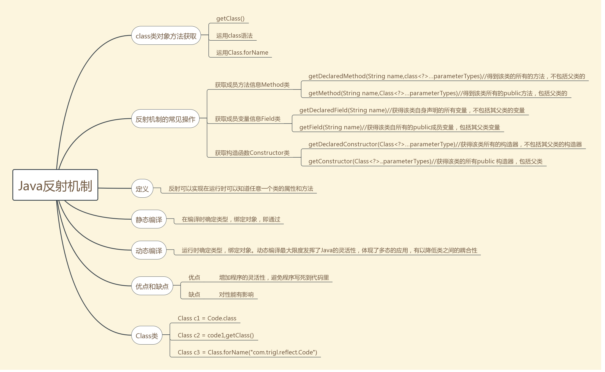
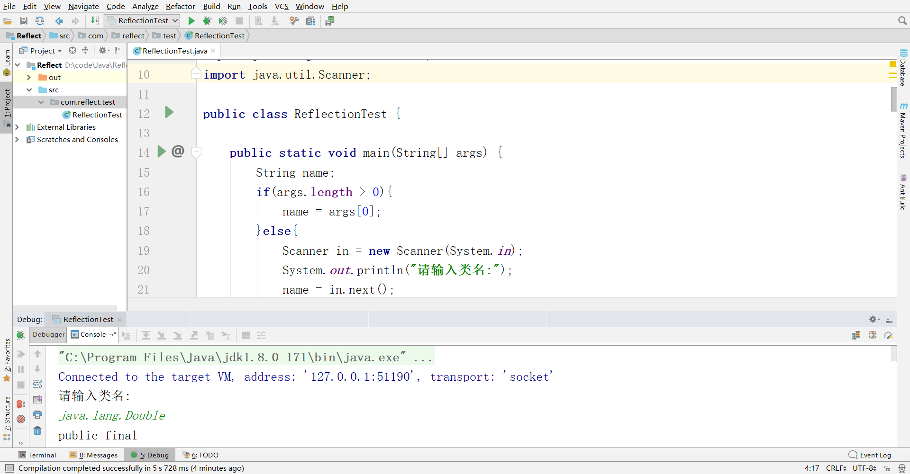
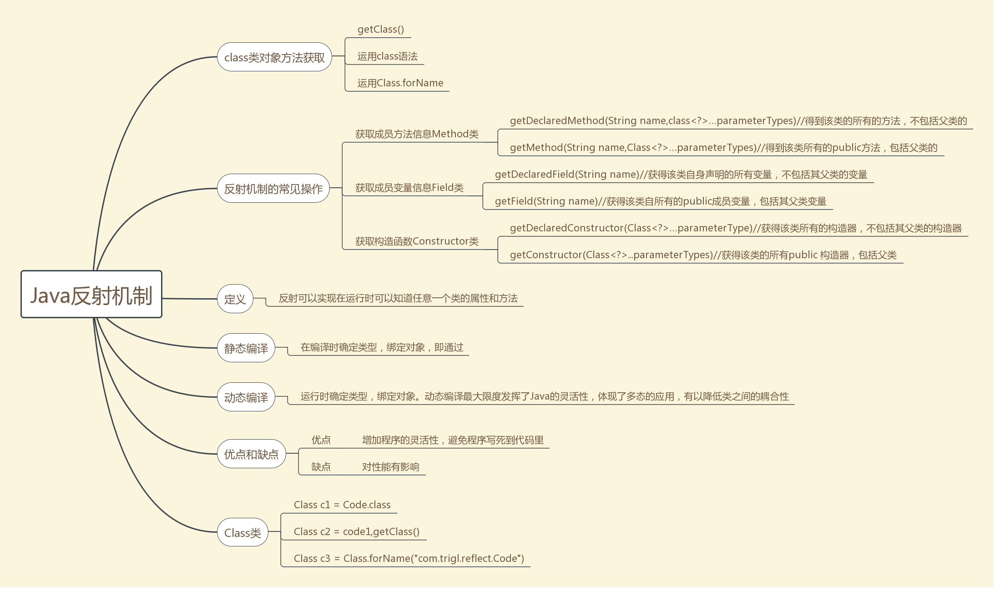

# 第一次内作业

**详细理解Java反射机制**



## 反射是什么

反射的作用用一句简单的话来讲就是可以对代码进行操作的代码，这个特性经常在被用于创建JavaBean中，通常造轮子的人会用到这个特性，而应用程序员用到这个特性的场景则较少。

能够分析类能力的程序就叫做反射，简单来说就是可以对代码进行操作的代码。反射机制的功能极为强大，可以用来：

- 在运行时分析类的能力
- 在运行时查看对象
- 实现通用的数组操作代码
- 利用Method对象来实现方法

 ## 从获取Class类开始

在程序运行期间，Java运行时系统始终为所有的对象维护一个被称为运行时的类型标识。这个信息跟踪着每个对象所属的类。这个类的获取方式有以下三种：

1. 使用Object类中的`getClass()`方法来`返回一个Class类的实例`：

   ```java
   User user;
   Class userClass  = user.getClass();
   ```

2. 我们可以使用Class类的`getName()`方法来`获取包含包名在内的类名`。同样的，在已知这个名字的情况下，我们可以使用静态方法`forName()获得类名对应的Class对象`：

```java
Random generator = new Random();
Class randomClass = generator.getClass();
//className = "java.util.Random"
String className = randomClass.getName();
//第二种方式获取
Class newRandomClass = Class.forName(className);
```

3. 获得Class类对象的第三种方法很简单，如果T是任意的Java类型（或者void关键字），T.class将代表匹配的类对象。例如：

```java
Class randomClass = Random.class;
Class intClass = int.class;
Class doubleClass = Double[].class;
```

如果我们想要创建一个类的实例，可以使用`newInstance()`方法来动态创建：

```java
String s = "java.util.Random";
Object m = Class.forName(s).newInstance();
```

## 构造函数的反射

获得构造函数的方法

```java
    //根据指定参数获得public构造器
    Constructor getConstructor(Class[] params);
    //获得public的所有构造器
    Constructor[] getConstructors();
    //根据指定参数获得public和非public的构造器
    Constructor getDeclaredConstructor(Class[] params);
    //获得public的所有构造器 
    Constructor[] getDeclaredConstructors();
```

看这些方法如何使用，先来个Student类供我们反射使用

```java
public class Student {

    private static String TAG = Student.class.getSimpleName();
    public int age;
    private String name;

    public Student() {
        age = 20;
        name = "小明";
    }

    public Student(int age, String name) {
        Log.e(TAG, "Student: " + "age " + age + " name " + name);
    }

    public void StudentA() {
        Log.e(TAG, "StudentA: ");
    }

    public void StudentA(int age) {
        Log.e(TAG, "StudentA: " + "age " + age);
    }

    public void StudentA(int age, String name) {
        Log.e(TAG, "StudentA: " + "age " + age + " name " + name);
    }
}
```

## 利用反射分析类的能力

在java.lang.reflect包(反射库)中有三各类`Field`,`Method`和`Constructor`分别用于描述类的域，方法和构造器。这三个类都有一个叫做`getName()`的方法，用于返回项目的名称。Filed类有一个`getType()`方法，用于返回描述域所属类型的Class对象。Method和Constructor类有能够报告参数类型的方法，Method类还有一个可以报告返回类型的方法。

这三个类还有一个叫做`getModifiers()`的方法，它将返回一个整型数值，用不同的位开关描述public和static这样的修饰符使用情况。另外，还可以利用java.lang.reflect包中的Modifier类的静态方法分析`getModifiers()`返回的整型数值。例如，可以使用Modifier类中的`isPublic()`，`isPrivate()`或`isFinal()`判断方法或构造器是否是public,private或final。我们需要做的全部工作就是调用Modifier类的相应方法，并对返回的整数数值进行分析，另外，还可以利用`Modifier.toString()`方法将修饰符打印出来。

Class类中的`getFields()`，`getMethods()`和`getConstructors()`方法将分别返回类提供的public域、方法和构造器数组，其中包括超类的公有成员。Class类的`getDeclareFieds()`，`getDeclareMethods()`和`getDeclareConstructors()`方法将分别返回类中声明的全部域、方法和构造器，其中包括私有和受保护成员，但不包括超类的成员。

下面我们来编写一个程序可以做到输入类名，然后打印出这个类的全部信息的作用：

```java
package com.reflect.test;

import com.sun.org.apache.xpath.internal.operations.Mod;

import java.io.File;
import java.lang.reflect.Constructor;
import java.lang.reflect.Field;
import java.lang.reflect.Method;
import java.lang.reflect.Modifier;
import java.util.Scanner;

public class ReflectionTest {

    public static void main(String[] args) {
        String name;
        if(args.length > 0){
            name = args[0];
        }else{
            Scanner in = new Scanner(System.in);
            System.out.println("请输入类名:");
            name = in.next();
        }

        try{
            Class c1 = Class.forName(name);
            Class superclass = c1.getSuperclass();
            String modifiers = Modifier.toString(c1.getModifiers());
            if(modifiers.length() > 0){
                System.out.println(modifiers + " ");
            }
            System.out.println("class"+name);
            if(superclass != null && superclass != Object.class){
                System.out.println("extends"+superclass.getName());
            }
            System.out.println("\n{\n");
            printConstructors(c1);
            System.out.println();
            printMethods(c1);
            System.out.println();
            printFields(c1);
            System.out.println("}");
        }catch (ClassNotFoundException e){
            e.printStackTrace();
        }
        System.exit(0);
    }

    private static void printFields(Class c1) {
        Field[] fields = c1.getDeclaredFields();

        for(Field field : fields){
            Class type = field.getType();
            String name = field.getName();
            System.out.println("   ");
            String modifiers = Modifier.toString(field.getModifiers());
            if(modifiers.length() > 0){
                System.out.println(modifiers + " ");
            }
            System.out.println(type.getName() + " " + name + ";");
        }
    }

    private static void printMethods(Class c1) {
        Method[] methods = c1.getDeclaredMethods();

        for(Method method : methods){
            Class returnType = method.getReturnType();
            String name = method.getName();
            System.out.println("  ");
            String modifiers = Modifier.toString(method.getModifiers());
            if(modifiers.length() > 0){
                System.out.println(modifiers + " ");
            }
            System.out.println(returnType.getName()+" "+name+"(");
            Class[] paramTypes = method.getParameterTypes();
            for(int j = 0; j < paramTypes.length; j++){
                if(j > 0){
                    System.out.println(",");
                }
                System.out.println(paramTypes[j].getName());
            }
            System.out.println(");");
        }
    }

    private static void printConstructors(Class c1) {
        Constructor[] constructors = c1.getDeclaredConstructors();
        for(Constructor constructor : constructors){
            String name = constructor.getName();
            System.out.println("  ");
            String modifiers = Modifier.toString(constructor.getModifiers());
            if(modifiers.length() > 0){
                System.out.println(modifiers + " ");
            }
            System.out.println(name + "(");
            Class[] paramTypes = constructor.getParameterTypes();
            for(int j = 0; j < paramTypes.length; j++){
                if(j > 0){
                    System.out.println(",");
                }
                System.out.println(paramTypes[j].getName());

            }
            System.out.println(");");
        }
    }
}

```

输入`java.long.Double`

回显：

```java
请输入类名:
java.lang.Double
public final 
Disconnected from the target VM, address: '127.0.0.1:51190', transport: 'socket'
classjava.lang.Double
extendsjava.lang.Number

{

  
public 
java.lang.Double(
double
);
  
public 
java.lang.Double(
java.lang.String
);

  
public 
boolean equals(
java.lang.Object
);
  
public static 
java.lang.String toString(
double
);
  
public 
java.lang.String toString(
);
  
public 
int hashCode(
);
  
public static 
int hashCode(
double
);
  
public static 
double min(
double
,
double
);
  
public static 
double max(
double
,
double
);
  
public static native 
long doubleToRawLongBits(
double
);
  
public static 
long doubleToLongBits(
double
);
  
public static native 
double longBitsToDouble(
long
);
  
public volatile 
int compareTo(
java.lang.Object
);
  
public 
int compareTo(
java.lang.Double
);
  
public 
byte byteValue(
);
  
public 
short shortValue(
);
  
public 
int intValue(
);
  
public 
long longValue(
);
  
public 
float floatValue(
);
  
public 
double doubleValue(
);
  
public static 
java.lang.Double valueOf(
java.lang.String
);
  
public static 
java.lang.Double valueOf(
double
);
  
public static 
java.lang.String toHexString(
double
);
  
public static 
int compare(
double
,
double
);
  
public static 
boolean isNaN(
double
);
  
public 
boolean isNaN(
);
  
public static 
boolean isFinite(
double
);
  
public static 
boolean isInfinite(
double
);
  
public 
boolean isInfinite(
);
  
public static 
double sum(
double
,
double
);
  
public static 
double parseDouble(
java.lang.String
);

   
public static final 
double POSITIVE_INFINITY;
   
public static final 
double NEGATIVE_INFINITY;
   
public static final 
double NaN;
   
public static final 
double MAX_VALUE;
   
public static final 
double MIN_NORMAL;
   
public static final 
double MIN_VALUE;
   
public static final 
int MAX_EXPONENT;
   
public static final 
int MIN_EXPONENT;
   
public static final 
int SIZE;
   
public static final 
int BYTES;
   
public static final 
java.lang.Class TYPE;
   
private final 
double value;
   
private static final 
long serialVersionUID;
}

Process finished with exit code 0

```



`不积跬步无以至千里`

## 思维导图



扩展阅读：

https://blog.csdn.net/zhangqiluGrubby/article/details/60874013

https://www.daidingkang.cc/2017/07/18/java-reflection-annotations/

https://www.javazhiyin.com/17014.html

https://www.javazhiyin.com/17008.html

# Java注解

## 概念及作用

1. 概念

- 注解即元数据,就是源代码的元数据
- 注解在代码中添加信息提供了一种形式化的方法,可以在后续中更方便的 使用这些数据
- Annotation是一种应用于类、方法、参数、变量、构造器及包声明中的特殊修饰符。它是一种由JSR-175标准选择用来描述元数据的一种工具。

1. 作用

- 生成文档
- 跟踪代码依赖性，实现替代配置文件功能,减少配置。如Spring中的一些注解
- 在编译时进行格式检查，如@Override等
- 每当你创建描述符性质的类或者接口时,一旦其中包含重复性的工作，就可以考虑使用注解来简化与自动化该过程。

## 什么是java注解？

在java语法中，使用`@`符号作为开头，并在@后面紧跟注解名。被运用于类，接口，方法和字段之上，例如：

```

@Override
void myMethod() { 
......
}
```

这其中@Override就是注解。这个注解的作用也就是告诉编译器，myMethod()方法覆写了父类中的myMethod()方法。

## java中内置的注解

java中有三个内置的注解：

- **@Override:**表示当前的方法定义将覆盖超类中的方法，如果出现错误，编译器就会报错。

- **@Deprecated:**如果使用此注解，编译器会出现警告信息。

- **@SuppressWarnings:**忽略编译器的警告信息。

本文不在阐述三种内置注解的使用情节和方法，感兴趣的请看[这里](http://www.jianshu.com/p/89c07ce0c99c)

## 元注解

> 自定义注解的时候用到的，也就是自定义**注解的注解**；（这句话我自己说的，不知道对不对）

元注解的作用就是负责注解其他注解。`Java5.0`定义了4个标准的meta-annotation类型，它们被用来提供对其它 annotation类型作说明。

### `Java5.0`定义的4个元注解：

1. @Target
2. @Retention
3. @Documented
4. @Inherited

> java8加了两个新注解，后续我会讲到。

这些类型和它们所支持的类在java.lang.annotation包中可以找到。

### @Target

> @Target说明了Annotation所修饰的对象范围：Annotation可被用于  packages、types（类、接口、枚举、Annotation类型）、类型成员（方法、构造方法、成员变量、枚举值）、方法参数和本地变量（如循环变量、catch参数）。在Annotation类型的声明中使用了target可更加明晰其修饰的目标。

**作用：用于描述注解的使用范围（即：被描述的注解可以用在什么地方）**

**取值(ElementType)有：**

| 类型           | 用途                                      |
| -------------- | ----------------------------------------- |
| CONSTRUCTOR    | 用于描述构造器                            |
| FIELD          | 用于描述域                                |
| LOCAL_VARIABLE | 用于描述局部变量                          |
| METHOD         | 用于描述方法                              |
| PACKAGE        | 用于描述包                                |
| PARAMETER      | 用于描述参数                              |
| TYPE           | 用于描述类、接口(包括注解类型) 或enum声明 |

比如说这个注解表示只能在方法中使用：

```

@Target({ElementType.METHOD})
public @interface MyCustomAnnotation {

}

//使用
public class MyClass {
   @MyCustomAnnotation
   public void myMethod()
   {
    ......
   }
}
```

### @Retention

> @Retention定义了该Annotation被保留的时间长短：某些Annotation仅出现在源代码中，而被编译器丢弃；而另一些却被编译在class文件中；编译在class文件中的Annotation可能会被虚拟机忽略，而另一些在class被装载时将被读取（请注意并不影响class的执行，因为Annotation与class在使用上是被分离的）。使用这个meta-Annotation可以对  Annotation的“生命周期”限制。

**作用：表示需要在什么级别保存该注释信息，用于描述注解的生命周期（即：被描述的注解在什么范围内有效）**

**取值（RetentionPoicy）有：**

| 类型    | 用途                             | 说明                             |
| ------- | -------------------------------- | -------------------------------- |
| SOURCE  | 在源文件中有效（即源文件保留）   | 仅出现在源代码中，而被编译器丢弃 |
| CLASS   | 在class文件中有效（即class保留） | 被编译在class文件中              |
| RUNTIME | 在运行时有效（即运行时保留）     | 编译在class文件中                |

使用示例：

```

/***
 * 字段注解接口
 */
@Target(value = {ElementType.FIELD})//注解可以被添加在属性上
@Retention(value = RetentionPolicy.RUNTIME)//注解保存在JVM运行时刻,能够在运行时刻通过反射API来获取到注解的信息
public @interface Column {
    String name();//注解的name属性
}
```

### @Documented

> @Documented用于描述其它类型的annotation应该被作为被标注的程序成员的公共API，因此可以被例如javadoc此类的工具文档化。Documented是一个标记注解，没有成员。

**作用：将注解包含在javadoc中**

示例：

```

java.lang.annotation.Documented
@Documented
public @interface MyCustomAnnotation { //Annotation body}
```

### @Inherited

- 是一个标记注解

- 阐述了某个被标注的类型是被继承的

- 使用了@Inherited修饰的annotation类型被用于一个class,则这个annotation将被用于该class的子类
  @Inherited annotation类型是被标注过的class的子类所继承。类并不从实现的接口继承annotation,方法不从它所重载的方法继承annotation

- 当@Inherited  annotation类型标注的annotation的Retention是RetentionPolicy.RUNTIME，则反射API增强了这种继承性。如果我们使用java.lang.reflect去查询一个@Inherited   annotation类型的annotation时，反射代码检查将展开工作：检查class和其父类，直到发现指定的annotation类型被发现，或者到达类继承结构的顶层。

**作用：允许子类继承父类中的注解**

示例，这里的MyParentClass 使用的注解标注了@Inherited，所以子类可以继承这个注解信息：

```

java.lang.annotation.Inherited
@Inherited
public @interface MyCustomAnnotation {
}

@MyCustomAnnotation
public class MyParentClass { 
  ... 
}

public class MyChildClass extends MyParentClass { 
   ... 
}
```

## 自定义注解

### 格式

```

public @interface 注解名{
  定义体
}
```

### 注解参数的可支持数据类型:

- 所有基本数据类型(int,float,double,boolean,byte,char,long,short)
- String 类型
- Class类型
- enum类型
- Annotation类型
- 以上所有类型的数组

### 规则

- 修饰符只能是public 或默认(default)
- 参数成员只能用基本类型byte,short,int,long,float,double,boolean八种基本类型和String,Enum,Class,annotations及这些类型的数组
- 如果只有一个参数成员,最好将名称设为”value”
- 注解元素必须有确定的值,可以在注解中定义默认值,也可以使用注解时指定,非基本类型的值不可为null,常使用空字符串或0作默认值
- 在表现一个元素存在或缺失的状态时,定义一下特殊值来表示,如空字符串或负值

### 示例:

```

/**
 * test注解
 * @author ddk
 *
 */ 
@Target(ElementType.FIELD)
@Retention(RetentionPolicy.RUNTIME)
@Documented
public @interface TestAnnotation {
    /**
     * id
     * @return
     */
    public int id() default -1;
    /**
     * name
     * @return
     */
    public String name() default "";
}
```

## 注解处理器类库

> java.lang.reflect.AnnotatedElement

Java使用Annotation接口来代表程序元素前面的注解，该接口是所有Annotation类型的父接口。除此之外，Java在java.lang.reflect  包下新增了AnnotatedElement接口，该接口代表程序中可以接受注解的程序元素，该接口主要有如下几个实现类：

- 　Class：类定义
- 　Constructor：构造器定义
- 　Field：累的成员变量定义
- 　Method：类的方法定义
- 　Package：类的包定义

java.lang.reflect 包下主要包含一些实现反射功能的工具类，实际上，java.lang.reflect  包所有提供的反射API扩充了读取运行时Annotation信息的能力。当一个Annotation类型被定义为运行时的Annotation后，该注解才能是运行时可见，当class文件被装载时被保存在class文件中的Annotation才会被虚拟机读取。

AnnotatedElement 接口是所有程序元素（Class、Method和Constructor）的父接口，所以程序通过反射获取了某个类的AnnotatedElement对象之后，程序就可以调用该对象的如下四个个方法来访问Annotation信息：

- 方法1： T getAnnotation(Class annotationClass): 返回改程序元素上存在的、指定类型的注解，如果该类型注解不存在，则返回null。
- 方法2：Annotation[] getAnnotations():返回该程序元素上存在的所有注解。
- 方法3：boolean is AnnotationPresent(Class<?extends Annotation> annotationClass):判断该程序元素上是否包含指定类型的注解，存在则返回true，否则返回false.
- 方法4：Annotation[]  getDeclaredAnnotations()：返回直接存在于此元素上的所有注释。与此接口中的其他方法不同，该方法将忽略继承的注释。（如果没有注释直接存在于此元素上，则返回长度为零的一个数组。）该方法的调用者可以随意修改返回的数组；这不会对其他调用者返回的数组产生任何影响。

### 注解处理器示例:

```

/***********注解声明***************/

/**
 * 水果名称注解
 * @author peida
 *
 */
@Target(ElementType.FIELD)
@Retention(RetentionPolicy.RUNTIME)
@Documented
public @interface FruitName {
    String value() default "";
}

/**
 * 水果颜色注解
 * @author peida
 *
 */
@Target(ElementType.FIELD)
@Retention(RetentionPolicy.RUNTIME)
@Documented
public @interface FruitColor {
    /**
     * 颜色枚举
     * @author peida
     *
     */
    public enum Color{ BULE,RED,GREEN};
    
    /**
     * 颜色属性
     * @return
     */
    Color fruitColor() default Color.GREEN;

}

/**
 * 水果供应者注解
 * @author peida
 *
 */
@Target(ElementType.FIELD)
@Retention(RetentionPolicy.RUNTIME)
@Documented
public @interface FruitProvider {
    /**
     * 供应商编号
     * @return
     */
    public int id() default -1;
    
    /**
     * 供应商名称
     * @return
     */
    public String name() default "";
    
    /**
     * 供应商地址
     * @return
     */
    public String address() default "";
}

/***********注解使用***************/

public class Apple {
    
    @FruitName("Apple")
    private String appleName;
    
    @FruitColor(fruitColor=Color.RED)
    private String appleColor;
    
    @FruitProvider(id=1,name="陕西红富士集团",address="陕西省西安市延安路89号红富士大厦")
    private String appleProvider;
    
    public void setAppleColor(String appleColor) {
        this.appleColor = appleColor;
    }
    public String getAppleColor() {
        return appleColor;
    }
    
    public void setAppleName(String appleName) {
        this.appleName = appleName;
    }
    public String getAppleName() {
        return appleName;
    }
    
    public void setAppleProvider(String appleProvider) {
        this.appleProvider = appleProvider;
    }
    public String getAppleProvider() {
        return appleProvider;
    }
    
    public void displayName(){
        System.out.println("水果的名字是：苹果");
    }
}

/***********注解处理器***************/
//其实是用的反射


public class FruitInfoUtil {
    public static void getFruitInfo(Class<?> clazz){
        
        String strFruitName=" 水果名称：";
        String strFruitColor=" 水果颜色：";
        String strFruitProvicer="供应商信息：";
        
        Field[] fields = clazz.getDeclaredFields();
        
        for(Field field :fields){
            if(field.isAnnotationPresent(FruitName.class)){
                FruitName fruitName = (FruitName) field.getAnnotation(FruitName.class);
                strFruitName=strFruitName+fruitName.value();
                System.out.println(strFruitName);
            }
            else if(field.isAnnotationPresent(FruitColor.class)){
                FruitColor fruitColor= (FruitColor) field.getAnnotation(FruitColor.class);
                strFruitColor=strFruitColor+fruitColor.fruitColor().toString();
                System.out.println(strFruitColor);
            }
            else if(field.isAnnotationPresent(FruitProvider.class)){
                FruitProvider fruitProvider= (FruitProvider) field.getAnnotation(FruitProvider.class);
                strFruitProvicer=" 供应商编号："+fruitProvider.id()+" 供应商名称："+fruitProvider.name()+" 供应商地址："+fruitProvider.address();
                System.out.println(strFruitProvicer);
            }
        }
    }
}

/***********输出结果***************/
public class FruitRun {

    /**
     * @param args
     */
    public static void main(String[] args) {
        
        FruitInfoUtil.getFruitInfo(Apple.class);
        
    }

}

====================================
 水果名称：Apple
 水果颜色：RED
 供应商编号：1 供应商名称：陕西红富士集团 供应商地址：陕西省西安市延安路89号红富士大厦
```

## Java 8 中注解新特性

- @Repeatable 元注解,表示被修饰的注解可以用在同一个声明式或者类型加上多个相同的注解（包含不同的属性值）

- @Native 元注解,本地方法 

- java8 中Annotation 可以被用在任何使用 Type 的地方

```

 //初始化对象时
String myString = new @NotNull String();
//对象类型转化时
myString = (@NonNull String) str;
//使用 implements 表达式时
class MyList<T> implements @ReadOnly List<@ReadOnly T>{
...
}
//使用 throws 表达式时
public void validateValues() throws @Critical ValidationFailedException{
...
}
```

## 思维导图


## 扩展阅读

http://www.cnblogs.com/ITtangtang/p/3974531.html

www.jianshu.com/p/948549b92e0a

https://www.jianshu.com/p/89c07ce0c99c

# 第二次内作业

**干掉第3章、第8章**

