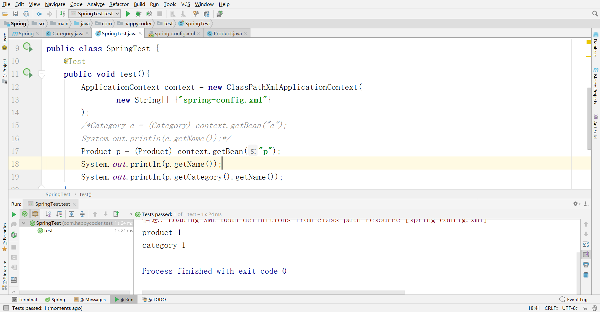

# Spring+SpringMVC+MyBatis入门实践

全文转自how2j官网。

转发目的：好记性不如烂笔头。

## Spring

### IOC/DI

Spring是一个基于IOC和AOP的结构J2EE系统的框架 
IOC 反转控制 是Spring的基础，Inversion Of Control 
简单说就是创建对象由以前的程序员自己new 构造方法来调用，变成了交由Spring创建对象 
DI 依赖注入 Dependency Inject. 简单地说就是拿到的对象的属性，已经被注入好相关值了，直接使用即可。 

必读： 基于框架的程序要成功运行，对于JAR包的版本，配置文件的正确性有着苛刻的要求，任何一个地方出错了，都会导致框架程序运行失败。 如果你是第一次学习本框架，务必严格按照教程的指导，完全模仿操作，直到成功看到运行效果。 第一次成功之后，信心，思路都会有较好的铺垫，然后再根据自己的疑惑，在“成功”的代码上做原本想做的改动和调整，这样可以大大节约学习的时间，提高效率，切勿一来就擅自改动，给自己的学习制造障碍  

1. 编写`pom.xml`，加入相关依赖包

```xml
<?xml version="1.0" encoding="UTF-8"?>
<project xmlns="http://maven.apache.org/POM/4.0.0"
         xmlns:xsi="http://www.w3.org/2001/XMLSchema-instance"
         xsi:schemaLocation="http://maven.apache.org/POM/4.0.0 http://maven.apache.org/xsd/maven-4.0.0.xsd">
    <modelVersion>4.0.0</modelVersion>

    <groupId>com.happycoder</groupId>
    <artifactId>Spring</artifactId>
    <version>1.0-SNAPSHOT</version>

    <dependencies>
        <!-- 单元测试 -->
        <dependency>
            <groupId>junit</groupId>
            <artifactId>junit</artifactId>
            <version>4.11</version>
        </dependency>
        <!-- spring核心件 -->
        <dependency>
            <groupId>org.springframework</groupId>
            <artifactId>spring-context-support</artifactId>
            <version>4.3.3.RELEASE</version>
        </dependency>
        <dependency>
            <groupId>org.springframework</groupId>
            <artifactId>spring-aop</artifactId>
            <version>4.3.3.RELEASE</version>
        </dependency>
        <dependency>
            <groupId>org.springframework</groupId>
            <artifactId>spring-core</artifactId>
            <version>4.3.3.RELEASE</version>
        </dependency>
        <dependency>
            <groupId>org.springframework</groupId>
            <artifactId>spring-beans</artifactId>
            <version>4.3.3.RELEASE</version>
        </dependency>
        <dependency>
            <groupId>org.springframework</groupId>
            <artifactId>spring-context</artifactId>
            <version>4.3.3.RELEASE</version>
        </dependency>
        <dependency>
            <groupId>org.springframework</groupId>
            <artifactId>spring-tx</artifactId>
            <version>4.3.3.RELEASE</version>
        </dependency>
    </dependencies>

    
</project>
```

2. 编写pojo Category，用来演示IOC和DI

```java
package com.happycoder.pojo;

public class Category {
    private int id;
    private String name;

    public int getId() {
        return id;
    }

    public void setId(int id) {
        this.id = id;
    }

    public String getName() {
        return name;
    }

    public void setName(String name) {
        this.name = name;
    }
}

```

3. 在resource目录下新建spring-config.xml

   spring-config.xml是Spring的核心配置文件，通过关键字c即可获取Category对象，该对象获取的时候，即被注入了字符串"category 1“到name属性中

   ```xml
   <?xml version="1.0" encoding="UTF-8" ?>
   <beans xmlns="http://www.springframework.org/schema/beans"
          xmlns:xsi="http://www.w3.org/2001/XMLSchema-instance"
          xmlns:aop="http://www.springframework.org/schema/aop"
          xmlns:tx="http://www.springframework.org/schema/tx"
          xmlns:context="http://www.springframework.org/schema/context"
          xsi:schemaLocation="
      http://www.springframework.org/schema/beans
      http://www.springframework.org/schema/beans/spring-beans-3.0.xsd
      http://www.springframework.org/schema/aop
      http://www.springframework.org/schema/aop/spring-aop-3.0.xsd
      http://www.springframework.org/schema/tx
      http://www.springframework.org/schema/tx/spring-tx-3.0.xsd
      http://www.springframework.org/schema/context
      http://www.springframework.org/schema/context/spring-context-3.0.xsd">
   
       <bean name="c" class="com.happycoder.pojo.Category">
           <property name="name" value="category 1" />
       </bean>
   </beans>
   ```

4. 编写单元测试类 SpringTest

```java
package com.happycoder.test;

import com.happycoder.pojo.Category;
import org.junit.Test;
import org.springframework.context.ApplicationContext;
import org.springframework.context.support.ClassPathXmlApplicationContext;

public class SpringTest {
    @Test
    public void test(){
        ApplicationContext context = new ClassPathXmlApplicationContext(
                new String[] {"spring-config.xml"}
        );
        Category c = (Category) context.getBean("c");
        System.out.println(c.getName());
    }
}

```


### 原理图
以获取对象的方式来进行比较

**传统的方式：** 
通过new 关键字主动创建一个对象
**IOC方式**
对象的生命周期由Spring来管理，直接从Spring那里去获取一个对象。 IOC是**反转控制 (Inversion Of Control)**的缩写，就像控制权从本来在自己手里，交给了Spring。 

打个比喻：
**传统方式：**相当于你自己去菜市场new 了一只鸡，不过是生鸡，要自己拔毛，去内脏，再上花椒，酱油，烤制，经过各种工序之后，才可以食用。
**用 IOC：**相当于去馆子(Spring)点了一只鸡，交到你手上的时候，已经五味俱全，你就只管吃就行了。  

### 练习

使用IOC的方式，获取一个Product对象

## 注入对象

1. Product.java

```java
package com.happycoder.pojo;

public class Product {
    private int id;
    private String name;
    private Category category;

    public int getId() {
        return id;
    }

    public void setId(int id) {
        this.id = id;
    }

    public String getName() {
        return name;
    }

    public void setName(String name) {
        this.name = name;
    }

    public Category getCategory() {
        return category;
    }

    public void setCategory(Category category) {
        this.category = category;
    }
}

```

2. 修改spring-config.xml

```xml
...
<bean name="c" class="com.happycoder.pojo.Product">
        <property name="name" value="Product" />
        <property name="category" ref="c" />
    </bean>
...
```

3. 单元测试类

```java
...
Product p = (Product) context.getBean("p");
        System.out.println(p.getName());
        System.out.println(p.getCategory().getName());
...
```


## 注解方式IOC/DI

1. 修改spring-config.xml

```xml
...

    <context:annotation-config/>
    <bean name="c" class="com.happycoder.pojo.Category">
        <property name="name" value="category 1" />
    </bean>
    <bean name="p" class="com.happycoder.pojo.Product">
        <property name="name" value="product 1" />
        <!--<property name="category" ref="c" />-->
    </bean>
</beans>
```

2. @Autowired

在Product.java的category属性前加上@Autowire注解

> @Autowired
>
> private Category category;

```java
...
    @Autowired
    private Category category;
...
```

3. @Autowired的位置

除了前面的这种方式外，也可以在setCategory方法前加上@Autowired，这样来达到相同的效果

> @Autowired
>
> public void setCategory(Category category) 

4. @Resource

除了@Autuwired之外，@Resource也是常用的手段

>  @Resource(name="c")
>
> private Category category;

5. 对Bean的注解

上述例子是对注入对象行为的注解，那么bean对象本身，比如Category,Product可不可以移出applicationContext.xml配置文件，也通过注解进行呢？
接下来就讲解如何对Bean进行注解配置

6. 修改spring-config.xml

什么都去掉，只新增：

> ```xml
> <context:component-scan base-package="com.happycoder.pojo" />
> ```

```xml
<?xml version="1.0" encoding="UTF-8" ?>
<beans xmlns="http://www.springframework.org/schema/beans"
       xmlns:xsi="http://www.w3.org/2001/XMLSchema-instance"
       xmlns:aop="http://www.springframework.org/schema/aop"
       xmlns:tx="http://www.springframework.org/schema/tx"
       xmlns:context="http://www.springframework.org/schema/context"
       xsi:schemaLocation="
   http://www.springframework.org/schema/beans
   http://www.springframework.org/schema/beans/spring-beans-3.0.xsd
   http://www.springframework.org/schema/aop
   http://www.springframework.org/schema/aop/spring-aop-3.0.xsd
   http://www.springframework.org/schema/tx
   http://www.springframework.org/schema/tx/spring-tx-3.0.xsd
   http://www.springframework.org/schema/context
   http://www.springframework.org/schema/context/spring-context-3.0.xsd">

    <!--<context:annotation-config/>
    <bean name="c" class="com.happycoder.pojo.Category">
        <property name="name" value="category 1" />
    </bean>
    <bean name="p" class="com.happycoder.pojo.Product">
        <property name="name" value="product 1" />
        &lt;!&ndash;<property name="category" ref="c" />&ndash;&gt;
    </bean>-->
    <context:component-scan base-package="com.happycoder.pojo" />
</beans>
```

6. @Component

为Product类加上@Component注解，即表明此类是bean

 

>  @Component("p")
>
> public class Product { 

为Category 类加上@Component注解，即表明此类是bean 


>  @Component("c")
>
> public class Category {

另外，因为配置从applicationContext.xml中移出来了，所以属性初始化放在属性声明上进行了。

> private String name="product 1";
>
> private String name="category 1";

 `Product.java`

```java
package com.happycoder.pojo;

import org.springframework.beans.factory.annotation.Autowired;
import org.springframework.stereotype.Component;

@Component("p")
public class Product {
    private int id;
    private String name = "product 1";
    @Autowired
    private Category category;

    public int getId() {
        return id;
    }

    public void setId(int id) {
        this.id = id;
    }

    public String getName() {
        return name;
    }

    public void setName(String name) {
        this.name = name;
    }

    public Category getCategory() {
        return category;
    }

    public void setCategory(Category category) {
        this.category = category;
    }
}

```


 `Category.java`

```java
package com.happycoder.pojo;

import org.springframework.stereotype.Component;

@Component("c")
public class Category {
    private int id;
    private String name="category 1";

    public int getId() {
        return id;
    }

    public void setId(int id) {
        this.id = id;
    }

    public String getName() {
        return name;
    }

    public void setName(String name) {
        this.name = name;
    }
}

```

运行测试类



## AOP

 AOP 即 Aspect Oriented Program 面向切面编程 
首先，在面向切面编程的思想里面，把功能分为**核心业务**功能，和**周边功能**。 
所谓的核心业务，比如登陆，增加数据，删除数据都叫核心业务 
所谓的周边功能，比如性能统计，日志，事务管理等等 

周边功能在Spring的面向切面编程AOP思想里，即被定义为**切面** 

在面向切面编程AOP的思想里面，核心业务功能和切面功能分别**独立进行开发**
然后把切面功能和核心业务功能 "**编织**" 在一起，这就叫AOP  

### 思路图

1. 功能分两大类，辅助功能和核心业务功能
2. 辅助功能和核心业务功能**彼此独立**进行开发
3. 比如登陆功能，即便是没有性能统计和日志输出，也可以正常运行
4. 如果有需要，就把"日志输出" 功能和 "登陆" 功能 **编织**在一起，这样登陆的时候，就可以看到日志输出了
5. 辅助功能，又叫做**切面**，这种能够**选择性的，低耦合的**把切面和核心业务功能结合在一起的编程思想，就叫做切面编程


1. 准备业务类ProductService

```java
package com.happycoder.service;

import org.springframework.stereotype.Component;

@Component("s")
public class ProductService {
    public void doSomeService(){
        System.out.println("doSomeService");
    }
}

```

2. 修改spring-config.xml

```xml
<context:component-scan base-package="com.happycoder" />
```

3. 修改测试类

```java
 @Test
    public void test(){
        ApplicationContext context = new ClassPathXmlApplicationContext(
                new String[] {"spring-config.xml"}
        );
        ProductService ps = (ProductService) context.getBean("s");
        ps.doSomeService();
    }
```

4. 准备日志切面LoggerAspect

先添加依赖

```xml
<dependency>
            <groupId>org.aspectj</groupId>
            <artifactId>aspectjweaver</artifactId>
            <version>1.8.10</version>
        </dependency>
```

该日志切面的功能是 在调用核心功能之前和之后分别打印日志，切面就是原理图中讲的那些辅助功能。

> Object object = joinPoint.proceed();

就是将来与某个核心功能编织之后，用于执行核心功能的代码

```java
//LoggerAspect.java
package com.happycoder.aspect;

import org.aspectj.lang.ProceedingJoinPoint;

public class LoggerAspect {
    public Object log(ProceedingJoinPoint joinPoint) throws Throwable{
        System.out.println("sytart log:" +joinPoint.getSignature().getName());
        Object object = joinPoint.proceed();
        System.out.println("end log:"+joinPoint.getSignature().getName());
        return object;
    }
}

```

5. 修改spring-config.xml

```xml
<bean name="s" class="com.happycoder.service.ProductService">
    </bean>

    <bean id="loggerAspect" class="com.happycoder.aspect.LoggerAspect" />
    
    <aop:config>
        <aop:pointcut id="loggerCutpoint"
                      expression=
                              "execution(* com.happycoder.service.ProductService.*(..))"    />
        <aop:aspect id="logAspect" ref="loggerAspect" >
            <aop:around method="log" pointcut-ref="loggerCutpoint"/>
        </aop:aspect>
    </aop:config>
```

6. 运行测试类


## 注解方式AOP

### 注解配置切面

@Aspect 注解表示这是一个切面
@Component 表示这是一个bean,由Spring进行管理
@Around(value = "execution(* com.happycoder.service.ProductService.*(..))") 表示对com.happycoder.service.ProductService 这个类中的所有方法进行切面操作

```java
package com.happycoder.aspect;

import org.aspectj.lang.ProceedingJoinPoint;
import org.aspectj.lang.annotation.Around;
import org.aspectj.lang.annotation.Aspect;
import org.springframework.stereotype.Component;

@Aspect
@Component
public class LoggerAspect {
    @Around(value = "execution(* com.happycoder.service.ProductService.*(..))")
    public Object log(ProceedingJoinPoint joinPoint) throws Throwable{
        System.out.println("sytart log:" +joinPoint.getSignature().getName());
        Object object = joinPoint.proceed();
        System.out.println("end log:"+joinPoint.getSignature().getName());
        return object;
    }
}

```

1. 修改spring-config.xml

去掉原有信息，添加如下3行

> ```xml
> <context:component-scan base-package="com.happycoder.aspect"/>
> <context:component-scan base-package="com.happycoder.service" />
> <aop:aspectj-autoproxy />
> ```

2. 运行测试类


## 注解方式测试

先添加依赖

```xml
<dependency>
            <groupId>org.hamcrest</groupId>
            <artifactId>hamcrest-all</artifactId>
            <version>1.3</version>
        </dependency>
<dependency>
            <groupId>org.springframework</groupId>
            <artifactId>spring-test</artifactId>
            <version>4.3.3.RELEASE</version>
        </dependency>
```

1. 修改测试类

1. @RunWith(SpringJUnit4ClassRunner.class) 
    表示这是一个Spring的测试类

2. @ContextConfiguration("classpath:applicationContext.xml")
    定位Spring的配置文件

3. @Autowired
    给这个测试类装配Category对象

4. @Test
    测试逻辑，打印c对象的名称

```java
package com.happycoder.test;

import com.happycoder.pojo.Category;
import com.happycoder.pojo.Product;
import com.happycoder.service.ProductService;
import org.aspectj.lang.annotation.Around;
import org.junit.Test;
import org.junit.runner.RunWith;
import org.springframework.beans.factory.annotation.Autowired;
import org.springframework.test.context.ContextConfiguration;
import org.springframework.test.context.junit4.SpringJUnit4ClassRunner;

@RunWith(SpringJUnit4ClassRunner.class)
@ContextConfiguration("classpath:spring-config.xml")
public class SpringTest {
    @Autowired
    Category c;
    @Test
    public void test(){
        System.out.println(c.getName());
    }
}

```

# SpringMVC

## Hello SpringMVC

**必读：**  基于框架的程序要成功运行，对于JAR包的版本，配置文件的正确性有着苛刻的要求，任何一个地方出错了，都会导致框架程序运行失败。 如果你是第一次学习本框架，**务必严格按照教程的指导，完全模仿操作** ，直到成功看到运行效果。 第一次成功之后，信心，思路都会有较好的铺垫，然后再根据自己的疑惑，在“成功”的代码上做原本想做的改动和调整，这样可以大大节约学习的时间，提高效率，**切勿一来就擅自改动** ，给自己的学习制造障碍

1. 导入依赖

   ```xml
   <!-- pom.xml -->
   <?xml version="1.0" encoding="UTF-8"?>
   <project xmlns="http://maven.apache.org/POM/4.0.0"
            xmlns:xsi="http://www.w3.org/2001/XMLSchema-instance"
            xsi:schemaLocation="http://maven.apache.org/POM/4.0.0 http://maven.apache.org/xsd/maven-4.0.0.xsd">
       <modelVersion>4.0.0</modelVersion>
   
       <groupId>com.happycoder</groupId>
       <artifactId>Spring</artifactId>
       <version>1.0-SNAPSHOT</version>
   
       <dependencies>
           <!-- 单元测试 -->
           <dependency>
               <groupId>junit</groupId>
               <artifactId>junit</artifactId>
               <version>4.11</version>
           </dependency>
           <!-- spring核心件 -->
           <dependency>
               <groupId>org.springframework</groupId>
               <artifactId>spring-context-support</artifactId>
               <version>4.3.3.RELEASE</version>
           </dependency>
           <dependency>
               <groupId>org.hamcrest</groupId>
               <artifactId>hamcrest-all</artifactId>
               <version>1.3</version>
           </dependency>
           <dependency>
               <groupId>org.springframework</groupId>
               <artifactId>spring-test</artifactId>
               <version>4.3.3.RELEASE</version>
           </dependency>
           <!-- spring-mvc 这个依赖中已经包含了事务管理和aop -->
           <dependency>
               <groupId>org.springframework</groupId>
               <artifactId>spring-webmvc</artifactId>
               <version>4.3.3.RELEASE</version>
           </dependency>
           <!-- 第三方依赖，防止部分依赖不可用 -->
           <dependency>
               <groupId>org.aspectj</groupId>
               <artifactId>aspectjweaver</artifactId>
               <version>1.8.10</version>
           </dependency>
           <!-- jstl语法依赖 -->
           <dependency>
               <groupId>jstl</groupId>
               <artifactId>jstl</artifactId>
               <version>1.2</version>
           </dependency>
           <!-- spring-jdbc -->
           <dependency>
               <groupId>org.springframework</groupId>
               <artifactId>spring-jdbc</artifactId>
               <version>4.3.3.RELEASE</version>
           </dependency>
           <!-- servle库 -->
           <dependency>
               <groupId>javax.servlet</groupId>
               <artifactId>servlet-api</artifactId>
               <version>2.5</version>
           </dependency>
   
       </dependencies>
   
       
   </project>
   ```

   2. 创建spring-servlet.xml

   在resource目录建

   这是Spring MVC的 映射配置文件
   表示访问路径/index会交给id=indexController的bean处理
   id=indexController的bean配置为类：**IndexController**

   ```xml
   <?xml version="1.0" encoding="UTF-8" ?>
   <beans xmlns="http://www.springframework.org/schema/beans"
          xmlns:xsi="http://www.w3.org/2001/XMLSchema-instance" xmlns:aop="http://www.springframework.org/schema/aop"
          xmlns:tx="http://www.springframework.org/schema/tx" xmlns:jdbc="http://www.springframework.org/schema/jdbc"
          xmlns:context="http://www.springframework.org/schema/context"
          xmlns:mvc="http://www.springframework.org/schema/mvc"
          xsi:schemaLocation="http://www.springframework.org/schema/jdbc http://www.springframework.org/schema/jdbc/spring-jdbc-3.0.xsd
           http://www.springframework.org/schema/aop http://www.springframework.org/schema/aop/spring-aop-3.0.xsd
           http://www.springframework.org/schema/beans http://www.springframework.org/schema/beans/spring-beans-3.0.xsd
           http://www.springframework.org/schema/context http://www.springframework.org/schema/context/spring-context-3.0.xsd
           http://www.springframework.org/schema/tx http://www.springframework.org/schema/tx/spring-tx-3.0.xsd
           http://www.springframework.org/schema/mvc http://www.springframework.org/schema/mvc/spring-mvc-3.2.xsd">
       <bean id="simpleUrlHandlerMapping"
             class="org.springframework.web.servlet.handler.SimpleUrlHandlerMapping">
           <property name="mappings">
               <props>
                   <prop key="/index">indexController</prop>
               </props>
           </property>
       </bean>
       <bean id="indexController" class="com.happycoder.controller.IndexController"></bean>
   </beans>
   ```

   3. 编写web.xml

   在WEB/INF目录下有web.xml

   配置Spring MVC的入口 DispatcherServlet，把所有的请求都提交到该Servlet

   ```xml
   <?xml version="1.0" encoding="UTF-8"?>
   <web-app xmlns:xsi="http://www.w3.org/2001/XMLSchema-instance"
            xmlns="http://java.sun.com/xml/ns/javaee"
            xmlns:web="http://java.sun.com/xml/ns/javaee"
            xsi:schemaLocation="http://java.sun.com/xml/ns/javaee http://java.sun.com/xml/ns/javaee/web-app_2_5.xsd" version="2.5">
       <!-- spring mvc核心：分发servlet -->
       <servlet>
           <servlet-name>mvc-dispatcher</servlet-name>
           <servlet-class>org.springframework.web.servlet.DispatcherServlet</servlet-class>
           <!-- spring mvc的配置文件 -->
           <init-param>
               <param-name>contextConfigLocation</param-name>
               <param-value>classpath:springmvc-servlet.xml</param-value>
           </init-param>
           <load-on-startup>1</load-on-startup>
       </servlet>
       <servlet-mapping>
           <servlet-name>mvc-dispatcher</servlet-name>
           <url-pattern>/</url-pattern>
       </servlet-mapping>
   </web-app>
   ```


   4. 编写控制类

        控制类 IndexController实现接口Controller ，提供方法handleRequest处理请求

      SpringMVC通过 ModelAndView 对象把模型和视图结合在一起
        
      > ```jsp
      > ModelAndView mav = new ModelAndView("index.jsp");
      > mav.addObject("message","Hello SpringMVC!");
      > ```

   表示视图是index.jsp
   模型数据是 message，内容是 “Hello Spring MVC”

   ```java
   package com.happycoder.controller;
   
   
   import org.springframework.web.servlet.ModelAndView;
   import org.springframework.web.servlet.mvc.Controller;
   
   import javax.servlet.http.HttpServletRequest;
   import javax.servlet.http.HttpServletResponse;
   
   public class IndexController implements Controller {
       public ModelAndView handleRequest(HttpServletRequest req, HttpServletResponse res) throws Exception{
           ModelAndView mav = new ModelAndView("index.jsp");
           mav.addObject("message","Hello SpringMVC!");
           return mav;
       }
   }
   
   ```

   一定要记得导包到web的lib目录下，要不然tomcat找不到jar包。

   ### 原理图

1.  用户访问 /index
2.  根据web.xml中的配置 所有的访问都会经过DispatcherServlet
3.  根据 根据配置文件springmvc-servlet.xml ，访问路径/index
    会进入IndexController类
4.  在IndexController中指定跳转到页面index.jsp，并传递message数据
5.  在index.jsp中显示message信息


### 练习

本例实现了访问路径/index，服务端跳转到index.jsp的效果

练习：访问路径/hello 服务端跳转到hello.jsp  

## 视图定位

如果代码写成这样，就表示跳转到页面 index.jsp 
new ModelAndView("index.jsp"); 

所谓的视图定位，指的是代码还是写成这样，但是会跳转到 /WEB-INF/page/index.jsp 
new ModelAndView("index");  

1. 修改springmvc-servlet.xml

增加

> <bean id="viewResolver" class="org.springframework.web.servlet.view.InternalResourceViewResolver">
>
>    <property name="prefix" value="/WEB-INF/page/" />
>
>    <property name="suffix" value=".jsp" />
>
> </bean>

```xml
<?xml version="1.0" encoding="UTF-8" ?>
<beans xmlns="http://www.springframework.org/schema/beans"
       xmlns:xsi="http://www.w3.org/2001/XMLSchema-instance" xmlns:aop="http://www.springframework.org/schema/aop"
       xmlns:tx="http://www.springframework.org/schema/tx" xmlns:jdbc="http://www.springframework.org/schema/jdbc"
       xmlns:context="http://www.springframework.org/schema/context"
       xmlns:mvc="http://www.springframework.org/schema/mvc"
       xsi:schemaLocation="http://www.springframework.org/schema/jdbc http://www.springframework.org/schema/jdbc/spring-jdbc-3.0.xsd
        http://www.springframework.org/schema/aop http://www.springframework.org/schema/aop/spring-aop-3.0.xsd
        http://www.springframework.org/schema/beans http://www.springframework.org/schema/beans/spring-beans-3.0.xsd
        http://www.springframework.org/schema/context http://www.springframework.org/schema/context/spring-context-3.0.xsd
        http://www.springframework.org/schema/tx http://www.springframework.org/schema/tx/spring-tx-3.0.xsd
        http://www.springframework.org/schema/mvc http://www.springframework.org/schema/mvc/spring-mvc-3.2.xsd">
    <bean id="viewResolver"
          class="org.springframework.web.servlet.view.InternalResourceViewResolver">
        <property name="prefix" value="/WEB-INF/page/" />
        <property name="suffix" value=".jsp" />
    </bean>
    <bean id="simpleUrlHandlerMapping"
          class="org.springframework.web.servlet.handler.SimpleUrlHandlerMapping">
        <property name="mappings">
            <props>
                <prop key="/index">indexController</prop>
            </props>
        </property>
    </bean>
    <bean id="indexController" class="com.happycoder.controller.IndexController"></bean>
</beans>
```

2. 修改IndexController.xml

把IndexController类的这一行代码

> ModelAndView mav = new ModelAndView("index.jsp");

修改为

> ModelAndView mav = new ModelAndView("index");

## 注解方式

前面的例子，都是使用配置的方式进行跳转的配置，本例讲解如何使用注解的方式进行跳转的配置

1. 修改IndexController

在类前面加上**@Controller** 表示该类是一个控制器
在方法handleRequest 前面加上 **@RequestMapping("/index")**  表示路径/index会映射到该方法上
**注意：** 不再让IndexController实现Controller接口

```java
package com.happycoder.controller;


import org.springframework.web.bind.annotation.RequestMapping;
import org.springframework.web.servlet.ModelAndView;
import org.springframework.web.servlet.mvc.Controller;

import javax.servlet.http.HttpServletRequest;
import javax.servlet.http.HttpServletResponse;

//表示该类是一个控制器
@Controller
public class IndexController{
    @RequestMapping("/index")
    public ModelAndView handleRequest(HttpServletRequest req, HttpServletResponse res) throws Exception{
        ModelAndView mav = new ModelAndView("index");
        mav.addObject("message","Hello SpringMVC!");
        return mav;
    }
}

```

2. 修改spring-servlet.xml

去掉映射相关的配置，因为已经使用注解方式了

增加  

> <context:component-scan base-package="controller" />

表示从包controller下扫描有@Controller注解的类

```xml
<?xml version="1.0" encoding="UTF-8" ?>
<beans xmlns="http://www.springframework.org/schema/beans"
       xmlns:xsi="http://www.w3.org/2001/XMLSchema-instance" xmlns:aop="http://www.springframework.org/schema/aop"
       xmlns:tx="http://www.springframework.org/schema/tx" xmlns:jdbc="http://www.springframework.org/schema/jdbc"
       xmlns:context="http://www.springframework.org/schema/context"
       xmlns:mvc="http://www.springframework.org/schema/mvc"
       xsi:schemaLocation="http://www.springframework.org/schema/jdbc http://www.springframework.org/schema/jdbc/spring-jdbc-3.0.xsd
        http://www.springframework.org/schema/aop http://www.springframework.org/schema/aop/spring-aop-3.0.xsd
        http://www.springframework.org/schema/beans http://www.springframework.org/schema/beans/spring-beans-3.0.xsd
        http://www.springframework.org/schema/context http://www.springframework.org/schema/context/spring-context-3.0.xsd
        http://www.springframework.org/schema/tx http://www.springframework.org/schema/tx/spring-tx-3.0.xsd
        http://www.springframework.org/schema/mvc http://www.springframework.org/schema/mvc/spring-mvc-3.2.xsd">
    <context:component-scan base-package="com.happycoder.controller" />
    <bean id="viewResolver"
          class="org.springframework.web.servlet.view.InternalResourceViewResolver">
        <property name="prefix" value="/WEB-INF/page/" />
        <property name="suffix" value=".jsp" />
    </bean>
  <!--  <bean id="simpleUrlHandlerMapping"
          class="org.springframework.web.servlet.handler.SimpleUrlHandlerMapping">
        <property name="mappings">
            <props>
                <prop key="/index">indexController</prop>
            </props>
        </property>
    </bean>-->
    <bean id="indexController" class="com.happycoder.controller.IndexController"></bean>
</beans>
```

## 接收表单数据

浏览器提交数据是非常常见的场景，本例演示用户提交产品名称和价格到Spring MVC Spring MVC如何接受数据

1. 修改实体类Product

```java
package com.happycoder.pojo;

import org.springframework.beans.factory.annotation.Autowired;
import org.springframework.stereotype.Component;

@Component("p")
public class Product {
    private int id;
    private String name = "product 1";
    private float price;

    public float getPrice() {
        return price;
    }

    public void setPrice(float price) {
        this.price = price;
    }

    @Autowired
    private Category category;

    public int getId() {
        return id;
    }

    public void setId(int id) {
        this.id = id;
    }

    public String getName() {
        return name;
    }

    public void setName(String name) {
        this.name = name;
    }

    public Category getCategory() {
        return category;
    }

    public void setCategory(Category category) {
        this.category = category;
    }
}
```

2. 添加addProduct.jsp

在web目录下 （不是在WEB-INF下）增加商品的页面addProduct.jsp
注意：产品名称input的name要使用name，而不是 product.name

```jap
<%@ page language="java" contentType="text/html; charset=UTF-8"
         pageEncoding="UTF-8" import="java.util.*" isELIgnored="false"%>

<form action="addProduct">

    产品名称 ：<input type="text" name="name" value=""><br />
    产品价格： <input type="text" name="price" value=""><br />

    <input type="submit" value="增加商品">
</form>
```

3. 添加ProductController控制器

  控制器ProductController，准备一个add方法映射/addProduct路径

为add方法准备一个Product 参数，用于接收注入

最后跳转到showProduct页面显示用户提交的数据  

注： [addProduct.jsp](http://how2j.cn/k/springmvc/springmvc-form/618.html#step1912) 提交的name和price会自动注入到参数 product里
注： 参数product会默认被当做值加入到ModelAndView 中，相当于：

> mav.addObject("product",product);

```java
package com.happycoder.controller;

import com.happycoder.pojo.Product;
import com.sun.org.apache.xpath.internal.operations.Mod;
import org.springframework.stereotype.Controller;
import org.springframework.web.bind.annotation.RequestMapping;
import org.springframework.web.servlet.ModelAndView;

@Controller
public class ProductController {
    @RequestMapping("/addProduct")
    public ModelAndView add(Product product) throws Exception{
        ModelAndView mav = new ModelAndView("showPoudct");
        return mav;
    }
}

```

4. 添加showProduct.jsp

在WEB-INF/page 目录下创建 showProduct.jsp 
用 EL 表达式显示用户提交的名称和价格

```jsp
<%@ page language="java" contentType="text/html; charset=UTF-8"
         pageEncoding="UTF-8" isELIgnored="false"%>

产品名称： ${product.name}<br>
产品价格： ${product.price}
```

## 客户端跳转

  在前面的例子中，无论是/index跳转到index.jsp 还是/addProduct 跳转到showProduct.jsp，都是[服务端跳转](http://how2j.cn/k/servlet/servlet-jump/551.html#step1568)。 

本例讲解如何进行[客户端跳转](http://how2j.cn/k/servlet/servlet-jump/551.html#step1567)  

1. 修改IndexController

首先映射/jump到jump()方法
在jump()中编写如下代码

>  ModelAndView mav = new ModelAndView("redirect:/index");

**redirect:/index**
即表示客户端跳转的意思

```java
package com.happycoder.controller;


import org.springframework.ui.Model;
import org.springframework.web.bind.annotation.RequestMapping;
import org.springframework.web.servlet.ModelAndView;
import org.springframework.stereotype.Controller;

import javax.servlet.http.HttpServletRequest;
import javax.servlet.http.HttpServletResponse;

//表示该类是一个控制器
@Controller
public class IndexController{
    @RequestMapping("/index")
    public ModelAndView handleRequest(HttpServletRequest req, HttpServletResponse res) throws Exception{
        ModelAndView mav = new ModelAndView("index");
        mav.addObject("message","Hello SpringMVC!");
        return mav;
    }
    @RequestMapping("/jump")
    public ModelAndView jump(){
        ModelAndView mav = new ModelAndView("redirect:/index");
        return mav;
    }
}

```

## Session

Session在用户登录，一些特殊场合在页面间传递数据的时候会经常用到

1. 修改IndexController

映射/check到方法check()

为方法check()提供**参数HttpSession session**，这样就可以在方法体中使用session了

接下来的逻辑就是每次访问session中的count+1。

最后跳转到check.jsp页面

```java
package com.happycoder.controller;


import org.springframework.ui.Model;
import org.springframework.web.bind.annotation.RequestMapping;
import org.springframework.web.servlet.ModelAndView;
import org.springframework.stereotype.Controller;
import org.springframework.web.servlet.view.InternalResourceViewResolver;

import javax.jws.WebParam;
import javax.servlet.http.HttpServletRequest;
import javax.servlet.http.HttpServletResponse;
import javax.servlet.http.HttpSession;

//表示该类是一个控制器
@Controller
public class IndexController{
    @RequestMapping("/index")
    public ModelAndView handleRequest(HttpServletRequest req, HttpServletResponse res) throws Exception{
        ModelAndView mav = new ModelAndView("index");
        mav.addObject("message","Hello SpringMVC!");
        return mav;
    }
    @RequestMapping("/jump")
    public ModelAndView jump(){
        ModelAndView mav = new ModelAndView("redirect:/index");
        return mav;
    }
    @RequestMapping("/check")
    public ModelAndView check(HttpSession session){
        Integer i = (Integer) session.getAttribute("count");
        if(i == null)
            i = 0;
        i++;
        session.setAttribute("count",i);
        ModelAndView mav = new ModelAndView("check");
        return mav;
    }
}

```

2. 添加check.jsp

```jsp
<%@ page language="java" contentType="text/html; charset=UTF-8"
    pageEncoding="UTF-8" isELIgnored="false"%>
 
session中记录的访问次数：${count}
```

### 练习

  配置一个路径 /clear

访问该路径后，清空session中的count. 并且客户端跳转到/check  

## 中文问题

在Spring MVC中处理中文问题和[Filter处理中文问题](http://how2j.cn/k/filter/filter-encoding/589.html)是一样的手段

1. 修改web.xml

   ```xml
   <?xml version="1.0" encoding="UTF-8"?>
   <web-app xmlns:xsi="http://www.w3.org/2001/XMLSchema-instance"
            xmlns="http://java.sun.com/xml/ns/javaee"
            xmlns:web="http://java.sun.com/xml/ns/javaee"
            xsi:schemaLocation="http://java.sun.com/xml/ns/javaee http://java.sun.com/xml/ns/javaee/web-app_2_5.xsd" version="2.5">
       <!-- spring mvc核心：分发servlet -->
       <servlet>
           <servlet-name>mvc-dispatcher</servlet-name>
           <servlet-class>org.springframework.web.servlet.DispatcherServlet</servlet-class>
           <!-- spring mvc的配置文件 -->
           <init-param>
               <param-name>contextConfigLocation</param-name>
               <param-value>classpath:springmvc-servlet.xml</param-value>
           </init-param>
           <load-on-startup>1</load-on-startup>
       </servlet>
       <servlet-mapping>
           <servlet-name>mvc-dispatcher</servlet-name>
           <url-pattern>/</url-pattern>
       </servlet-mapping>
       <filter>
           <filter-name>CharacterEncodingFitler</filter-name>
           <filter-class>org.springframework.web.filter.CharacterEncodingFilter</filter-class>
           <init-param>
               <param-name>encoding</param-name>
               <param-value>utf-8</param-value>
           </init-param>
       </filter>
       <filter-mapping>
           <filter-name>CharacterEncodingFilter</filter-name>
           <url-pattern>/*</url-pattern>
       </filter-mapping>
   </web-app>
   ```

## 上传文件

1. 配置web.xml允许访问*.jpg

在web.xml中新增加一段

> <servlet-mapping>
>
> ​	    <servlet-name>default</servlet-name>
>
> ​	    <url-pattern>*.jpg</url-pattern>
>
> ​	</servlet-mapping>

  表示允许访问*.jpg。

为什么要加这一段呢？ 因为配置springmvc的servlet的时候，使用的路径是"/"，导致静态资源在默认情况下不能访问，所以要加上这一段，允许访问jpg。 并且必须加在springmvc的servlet之前

如果你配置spring-mvc使用的路径是/*.do，就不会有这个问题了。

注： 这里仅仅是允许访问jpg,如果你要显示png,gif那么需要额外进行配置  

```xml
...
<servlet-mapping>
        <servlet-name>default</servlet-name>
        <url-pattern>*.jsp</url-pattern>
    </servlet-mapping>
...
```

2. 配置springmvc-servlet.xml

新增加一段配置

> <bean id="multipartResolver" class="org.springframework.web.multipart.commons.CommonsMultipartResolver"/>

开放对上传功能的支持

3. upload.jsp上传页面

上传页面，需要注意的是form 的两个属性必须提供
method="post" 和 enctype="multipart/form-data" 缺一不可
上传组件 增加一个属性 accept="image/*" 表示只能选择图片进行上传
留意 <input type="file" name="image" accept="image/*" /> 这个image，后面会用到这个image

```jsp
<%@ page language="java" contentType="text/html; charset=UTF-8"
    pageEncoding="UTF-8" import="java.util.*" isELIgnored="false"%>
  
<form action="uploadImage" method="post" enctype="multipart/form-data">
  选择图片:<input type="file" name="image" accept="image/*" /> <br>
  <input type="submit" value="上传">
</form>
```

4. 准备UploadImageFile

  在UploadedImageFile中封装MultipartFile类型的字段 image ，用于接受页面的注入

这里的字段 image必须和上传页面upload.jsp中的image
<input type="file" name="image" accept="image/*" />
保持一致  

```java
package com.happycoder.pojo;

import org.springframework.web.multipart.MultipartFile;

public class UploadImageFile {
    MultipartFile image;
    public MultipartFile getImage(){
        return image;
    }
    public void setImage(MultipartFile image){
        this.image = image;
    }
}

```

5. UploadController 上传控制器

新建类UploadController 作为上传控制器
准备方法upload 映射上传路径/uploadImage

1. 方法的第二个参数UploadedImageFile 中已经注入好了 image
2. 通过 RandomStringUtils.randomAlphanumeric(10);获取一个随机文件名。 因为用户可能上传相同文件名的文件，为了不覆盖原来的文件，通过随机文件名的办法来规避
3. 根据request.getServletContext().getRealPath 获取到web目录下的image目录，用于存放上传后的文件。
4. 调用file.getImage().transferTo(newFile); 复制文件
5. 把生成的随机文件名提交给视图，用于后续的显示

```java
package com.happycoder.controller;

import com.happycoder.pojo.UploadImageFile;
import org.apache.commons.lang.RandomStringUtils;
import org.springframework.stereotype.Controller;
import org.springframework.web.bind.annotation.RequestMapping;
import org.springframework.web.servlet.ModelAndView;

import javax.servlet.http.HttpServletRequest;
import javax.servlet.http.HttpServletResponse;
import java.io.File;
import java.io.IOException;

@Controller
public class UploadController {
    @RequestMapping("/uploadImage")
    public ModelAndView upload(HttpServletRequest req, UploadImageFile file) throws IllegalStateException, IOException {
        String name = RandomStringUtils.randomAlphanumeric(10);
        String newFileName = name = ".jpg";
        File newFile = new File(req.getServletContext().getRealPath("/image"),newFileName);
        newFile.getParentFile().mkdir();
        file.getImage().transferTo(newFile);

        ModelAndView mav = new ModelAndView("showUploadedFile");
        mav.addObject("imageName",newFile);
        return mav;
    }
}

```

6. showUploadedFile.jsp显示图片的页面

   在WEB-INF/page 下新建文件showUploadedFile 显示上传的图片

   ```xml
   <%@ page language="java" contentType="text/html; charset=UTF-8"
       pageEncoding="UTF-8" isELIgnored="false"%>
    
   
   ```

## 拦截器

1. 拦截器类：IndexInterceptor

```java
package com.happycoder.interceptor;

import org.springframework.web.servlet.ModelAndView;
import org.springframework.web.servlet.handler.HandlerInterceptorAdapter;

import javax.servlet.http.HttpServletRequest;
import javax.servlet.http.HttpServletResponse;
import java.util.Date;

public class IndexInterceptor extends HandlerInterceptorAdapter {
/**
 * 在业务处理器处理请求之前被调用
 * 如果返回false
 *     从当前的拦截器往回执行所有拦截器的afterCompletion(),再退出拦截器链
 * 如果返回true
 *    执行下一个拦截器,直到所有的拦截器都执行完毕
 *    再执行被拦截的Controller
 *    然后进入拦截器链,
 *    从最后一个拦截器往回执行所有的postHandle()
 *    接着再从最后一个拦截器往回执行所有的afterCompletion()
 *
 */
 public boolean preHandle(HttpServletRequest req,
                          HttpServletResponse res,Object handler) throws Exception{
     System.out.println("preHandle(), 在访问Controller之前被调用");
     return true;
 }
    /**
     * 在业务处理器处理请求执行完成后,生成视图之前执行的动作
     * 可在modelAndView中加入数据，比如当前时间
     */

    public void postHandle(HttpServletRequest req,
                           HttpServletResponse res, Object handler,
                           ModelAndView modelAndView) throws Exception{
        System.out.println("postHandle(), 在访问Controller之后，访问视图之前被调用,这里可以注入一个时间到modelAndView中，用于后续视图显示");
        modelAndView.addObject("date","由拦截器生成的时间:" + new Date());
    }
    /**
     * 在DispatcherServlet完全处理完请求后被调用,可用于清理资源等
     *
     * 当有拦截器抛出异常时,会从当前拦截器往回执行所有的拦截器的afterCompletion()
     */
    public void afterCompletion(HttpServletResponse res,
                                HttpServletRequest req,Object handler,Exception ex) throws Exception{
        System.out.println("afterCompletion(), 在访问视图之后被调用");
    }
}

```

2. 配置拦截器

  修改springmvc-servlet.xml以对/index路径进行拦截

如果要拦截其他路径：
/** 拦截所有
/category/** 拦截/category路径下的所有  

```xml
...
<mvc:interceptors>
        <mvc:interceptor>
            <mvc:mapping path="/index"/>
            <!-- 定义在mvc:interceptor下面的表示是对特定的请求才进行拦截的 -->
            <bean class="com.happycoder.interceptor.IndexInterceptor"/>
        </mvc:interceptor>\
        <!-- 当设置多个拦截器时，先按顺序调用preHandle方法，然后逆序调用每个拦截器的postHandle和afterCompletion方法 -->
    </mvc:interceptors>
...
```

3. 修改index.jsp

打印拦截器放进去的日期

```jsp
<%@ page language="java" contentType="text/html; charset=UTF-8"
    pageEncoding="UTF-8" isELIgnored="false"%>
 
<h1>${message}</h1>
 
<p>${date}</p>
```

# MyBatis

## 入门

  平时我们都用JDBC访问数据库，除了需要自己写SQL之外，还必须操作Connection, Statment, ResultSet 这些其实只是手段的辅助类。 不仅如此，访问不同的表，还会写很多雷同的代码，显得繁琐和枯燥。 

那么用了Mybatis之后，只需要自己提供SQL语句，其他的工作，诸如建立连接，Statement， JDBC相关异常处理等等都交给Mybatis去做了，那些重复性的工作Mybatis也给做掉了，我们只需要关注在增删改查等操作层面上，而把技术细节都封装在了我们看不见的地方。 

必读： 基于框架的程序要成功运行，对于JAR包的版本，配置文件的正确性有着苛刻的要求，任何一个地方出错了，都会导致框架程序运行失败。 如果你是第一次学习本框架，务必严格按照教程的指导，完全模仿操作，直到成功看到运行效果。 第一次成功之后，信心，思路都会有较好的铺垫，然后再根据自己的疑惑，在“成功”的代码上做原本想做的改动和调整，这样可以大大节约学习的时间，提高效率，切勿一来就擅自改动，给自己的学习制造障碍  

1. 创建数据库

```sql
CREATE DATEBASE test;
```

2. 创建表

```sql
USE test;
CREATE TABLE category_ (
  id int(11) NOT NULL AUTO_INCREMENT,
  name varchar(32) DEFAULT NULL,
  PRIMARY KEY (id)
) ENGINE=MyISAM AUTO_INCREMENT=1 DEFAULT CHARSET=utf8;
```

3. 插入测试数据

```sql
INSERT INTO category_ VALUES (null,'category1');
INSERT INTO category_ VALUES (null,'category2');
```

4. 添加依赖

```xml
<?xml version="1.0" encoding="UTF-8"?>
<project xmlns="http://maven.apache.org/POM/4.0.0"
         xmlns:xsi="http://www.w3.org/2001/XMLSchema-instance"
         xsi:schemaLocation="http://maven.apache.org/POM/4.0.0 http://maven.apache.org/xsd/maven-4.0.0.xsd">
    <modelVersion>4.0.0</modelVersion>

    <groupId>com.happycoder</groupId>
    <artifactId>MyBatis</artifactId>
    <version>1.0-SNAPSHOT</version>

    <dependencies>
        <!-- MySQL驱动 -->
        <dependency>
            <groupId>mysql</groupId>
            <artifactId>mysql-connector-java</artifactId>
            <version>5.1.17</version>
        </dependency>
        <!-- druid数据源 -->
        <dependency>
            <groupId>com.alibaba</groupId>
            <artifactId>druid</artifactId>
            <version>0.1.18</version>
        </dependency>
        <!-- mybatis -->
        <dependency>
            <groupId>org.mybatis</groupId>
            <artifactId>mybatis</artifactId>
            <version>3.2.1</version>
        </dependency>
        <!-- 单元测试 -->
        <dependency>
            <groupId>junit</groupId>
            <artifactId>junit</artifactId>
            <version>4.11</version>
        </dependency>

        <!-- spring-jdbc -->
        <dependency>
            <groupId>org.springframework</groupId>
            <artifactId>spring-jdbc</artifactId>
            <version>4.3.3.RELEASE</version>
        </dependency>
    </dependencies>
    
</project>
```

5. 创建实体类

准备实体类Category，用于映射表category_

```java
package com.happycoder.pojo;

public class Category {
    private int id;
    private String name;

    public int getId() {
        return id;
    }

    public void setId(int id) {
        this.id = id;
    }

    public String getName() {
        return name;
    }

    public void setName(String name) {
        this.name = name;
    }
}

```

6. 配置文件mybatis-config.xml

在resources目录下创建mybatis的主配置文件mybatis-config.xml

其作用主要是提供连接数据库用的驱动，数据库名称，编码方式，账号密码

> <property name="driver" value="com.mysql.jdbc.Driver"/>
>
> <property name="url" value="jdbc:mysql://localhost:3306/how2java?characterEncoding=UTF-8"/>
>
> <property name="username" value="root"/>
>
> <property name="password" value="admin"/>

以及别名，自动扫描com.happycoder.pojo下的类型，使得在后续配置Category.xml中使用resultType的时候，可以直接使用Category，而不必写com.happycoder.pojo.Category

> <typeAliases>
>
> ​    <package name="com.how2java.pojo"/>
>
> </typeAliases>

映射Category.xml

> <mappers>
>
> ​    <mapper resource="com/how2java/pojo/Category.xml"/>
>
> </mappers>

```xml
<?xml version="1.0" encoding="UTF-8" ?>
<!DOCTYPE configuration
        PUBLIC "-//mybatis.org//DTD Config 3.0//EN"
        "http://mybatis.org/dtd/mybatis-3-config.dtd">
<configuration>
    <typeAliases>
        <package name="com.happycoder.pojo" />
    </typeAliases>
    <environments default="development">
        <environment id="development">
            <transactionManager type="JDBC" />
            <dataSource type="POOLED">
                <property name="driver" value="com.mysql.jdbc.Driver" />
                <property name="url" value="jdbc:mysql://localhost:3306/test?characterEncoding=UTF-8" />
                <property name="username" value="root" />
                <property name="password" value="root" />
            </dataSource>
        </environment>
    </environments>
    <mappers>
        <mapper resource="Category.xml" />
    </mappers>
</configuration>
```

7. 配置文件Category.xml

在resources目录下，新建文件Category.xml

> namespace="com.happycoder.pojo"

表示命名空间是com.how2java.pojo，在后续调用sql语句的时候，会用到它
里面定义了一条sql语句

> select * from category_

这条sql语句用id: listCategory 进行标示以供后续代码调用。resultType="Category" 表示返回的数据和Category关联起来，这里本应该使用的是 com.happycoder.pojo.Category, 但是因为上一步配置了别名，所以直接使用Category就行了

```xml
<?xml version="1.0" encoding="UTF-8" ?>
<!DOCTYPE mapper
        PUBLIC "-//mybatis.org//DTD Mapper 3.0//EN"
        "http://mybatis.org/dtd/mybatis-3-mapper.dtd">
<mapper namespace="com.happycoder.pojo">
    <select id="selectAll" resultType="Category">
        select * from category_
    </select>
</mapper>
```

8. 编写测试类

```java
package com.happycoder.test;

import com.happycoder.pojo.Category;
import org.apache.ibatis.io.Resources;
import org.apache.ibatis.session.SqlSession;
import org.apache.ibatis.session.SqlSessionFactory;
import org.apache.ibatis.session.SqlSessionFactoryBuilder;
import org.junit.Test;


import java.io.IOException;
import java.io.InputStream;
import java.util.List;

public class TestMybatis {
    @Test
    public void test() throws IOException{
        String resource = "mybatis-config.xml";
        InputStream inputStream = Resources.getResourceAsStream(resource);
        SqlSessionFactory sqlSessionFactory = new SqlSessionFactoryBuilder().build(inputStream);
        SqlSession session = sqlSessionFactory.openSession();

        List<Category> cs = session.selectList("selectAll");
        for(Category c : cs){
            System.out.println(c.getName());
        }
    }
}

```

运行并观察到如图所示的结果。
根据配置文件mybatis-config.xml得到sqlSessionFactory 。

> String resource = "mybatis-config.xml";
>
> InputStream inputStream = Resources.getResourceAsStream(resource);
>
> SqlSessionFactory sqlSessionFactory = new SqlSessionFactoryBuilder().build(inputStream);

然后再根据sqlSessionFactory 得到session

> SqlSession session=sqlSessionFactory.openSession();

最后通过session的selectList方法，调用sql语句listCategory。listCategory这个就是在配置文件Category.xml中那条sql语句设置的id。
执行完毕之后，得到一个Category集合，遍历即可看到数据。

> List<Category> cs = session.selectList("listCategory");
>
> for (Category c : cs) {
>
> ​	System.out.println(c.getName());
>
> }


### 原理图

1. 应用程序找Mybatis要数据
2. mybatis从数据库中找来数据
    2.1 通过mybatis-config.xml 定位哪个数据库
    2.2 通过Category.xml执行对应的select语句
    2.3 基于Category.xml把返回的数据库记录封装在Category对象中
    2.4 把多个Category对象装在一个Category集合中
3. 返回一个Category集合


### 练习

参考Category，做一个Product类的mybatis查询。 Product类有三个属性：
int id
String name
float price

## CRUD

1. 配置文件Category.xml

首先一次性修改配置文件Category.xml，提供CRUD对应的sql语句。

```xml
<?xml version="1.0" encoding="UTF-8" ?>
<!DOCTYPE mapper
        PUBLIC "-//mybatis.org//DTD Mapper 3.0//EN"
        "http://mybatis.org/dtd/mybatis-3-mapper.dtd">
<mapper namespace="com.happycoder.pojo">
    <insert id="add" parameterType="Category" >
        insert int category_ (name) values (#{name})
    </insert>
    <delete id="delect" parameterType="Category">
        delete from category_ where id = #{id}
    </delete>
    <select id="selectOne" resultType="Category" parameterType="_int">
        select * from category_ where id = #{id}
    </select>
    <update id="update" parameterType="Category">
        update category_ set name = #{name} where id = #{id}
    </update>
    <select id="selectAll" resultType="Category">
        select * from category_
    </select>
</mapper>
```

2. 测试类

- 增加

```java
 @Test
    public void test() throws IOException {
        String resource = "mybatis-config.xml";
        InputStream inputStream = Resources.getResourceAsStream(resource);
        SqlSessionFactory sqlSessionFactory = new SqlSessionFactoryBuilder().build(inputStream);
        SqlSession session = sqlSessionFactory.openSession();

        Category c = new Category();
        c.setName("新增加的category");
        session.insert("add", c);

        all(session);

        session.commit();
        session.close();
    }

    public void all(SqlSession session){
        List<Category> cs = session.selectList("selectAll");
        for(Category c : cs){
            System.out.println(c.getName());
        }
    }
```

- 删除

```java
 @Test
    public void test() throws IOException {
        String resource = "mybatis-config.xml";
        InputStream inputStream = Resources.getResourceAsStream(resource);
        SqlSessionFactory sqlSessionFactory = new SqlSessionFactoryBuilder().build(inputStream);
        SqlSession session = sqlSessionFactory.openSession();

        Category c = new Category();
        c.setId(2);
        session.delete("delect",c.getId());

        all(session);

        session.commit();
        session.close();
    }

   
```

- 更新

```java
@Test
    public void test() throws IOException {
        String resource = "mybatis-config.xml";
        InputStream inputStream = Resources.getResourceAsStream(resource);
        SqlSessionFactory sqlSessionFactory = new SqlSessionFactoryBuilder().build(inputStream);
        SqlSession session = sqlSessionFactory.openSession();

        Category c = session.selectOne("selectOne",3);
        c.setName("新增加的第二个category");
        session.update("update",c);

        all(session);

        session.commit();
        session.close();
    }
```

- 查找

```java
@Test
    public void test() throws IOException {
        String resource = "mybatis-config.xml";
        InputStream inputStream = Resources.getResourceAsStream(resource);
        SqlSessionFactory sqlSessionFactory = new SqlSessionFactoryBuilder().build(inputStream);
        SqlSession session = sqlSessionFactory.openSession();

        Category c = session.selectOne("selectOne",3);
        System.out.println(c.getName());

        //all(session);

        session.commit();
        session.close();
    }
```

## 更多查找

### 模糊查询

1. 修改Category.xml，提供listCateogryByName查询语句

> select * from   category_  where name like concat('%',#{0},'%')

concat('%',#{0},'%') 这是mysql的写法
如果是oracle，写法是

select * from   category_  where name like '%'||#{0}||'%'

2. 运行测试

```xml
<!-- 新增语句 -->
<select id="selectByName" parameterType="string" resultType="Category">
        select * from   category_  where name like concat('%',#{0},'%')
    </select>
```

```java
@Test
    public void test() throws IOException {
        String resource = "mybatis-config.xml";
        InputStream inputStream = Resources.getResourceAsStream(resource);
        SqlSessionFactory sqlSessionFactory = new SqlSessionFactoryBuilder().build(inputStream);
        SqlSession session = sqlSessionFactory.openSession();

        List<Category> cs = session.selectList("selectByName","cat");
        for(Category c :cs ){
            System.out.println(c.getName());
        }
        session.commit();
        session.close();
    }
```

### 多条件查询

 结合前面的模糊查询，多一个id>多少的条件

1. Category.xml准备sql语句

> <select id="listCategoryByIdAndName"  parameterType="map" resultType="Category">
>
> ​    select * from   category_  where id> #{id}  and name like concat('%',#{name},'%')
>
> </select>

2. 测试代码

因为是多个参数，而selectList方法又只接受一个参数对象，所以需要把多个参数放在Map里，然后把这个Map对象作为参数传递进去

```java
Map<String,Object> params = new HashMap<>();
        params.put("id", 3);
        params.put("name", "cat");
        List<Category> cs = session.selectList("listCategoryByIdAndName",params);
        session.commit();
        session.close();
```

## 一对多

1. 创建数据

```sql
use test;
create table product_(
id int NOT NULL AUTO_INCREMENT,
name varchar(30)  DEFAULT NULL,
price float  DEFAULT 0,
cid int ,
PRIMARY KEY (id)
)AUTO_INCREMENT=1 DEFAULT CHARSET=utf8;
delete from category_;
INSERT INTO category_ VALUES (1,'category1');
INSERT INTO category_ VALUES (2,'category2');
INSERT INTO product_ VALUES (1,'product a', 88.88, 1);
INSERT INTO product_ VALUES (2,'product b', 88.88, 1);
INSERT INTO product_ VALUES (3,'product c', 88.88, 1);
INSERT INTO product_ VALUES (4,'product x', 88.88, 2);
INSERT INTO product_ VALUES (5,'product y', 88.88, 2);
INSERT INTO product_ VALUES (6,'product z', 88.88, 2);
```

2. Product实体类

```java
package com.happycoder.pojo;

public class Product {
    private int id;
    private String name;
    private float price;
	//get//set//toString
}
```

3. 修改Category实体类

修改Category实体类，提供products的集合

```java
package com.happycoder.pojo;

import java.util.List;

public class Category {
    private int id;
    private String name;
    List<Product> products;
 	//get//set/toString   
}
```

4. 修改Category.xml

通过left join关联查询，对Category和Product表进行关联查询。
与前面学习的有所区别，这里不是用的resultType, 而是resultMap，通过resultMap把数据取出来放在对应的 对象属性里
**注：** Category的id 字段 和Product的id字段同名，Mybatis不知道谁是谁的，所以需要通过取别名cid,pid来区分。
name字段同理。

```xml
<mapper namespace="com.happycoder.pojo">
    <resultMap id="categoryBean" type="Category">
        <id column="cid" property="id" />
        <result column="cname" property="name" />

    <!-- 一对多的关系 -->
    <!-- property: 指的是集合属性的值, ofType：指的是集合中元素的类型 -->
    <collection property="products" ofType="Product">
        <id column="pid" property="id" />
        <result column="pname" property="name" />
        <result column="price" property="price" />
    </collection>
    </resultMap>

    <!-- 关联查询分类和产品表 -->
    <select id="listCategory" resultMap="categoryBean">
            select c.*, p.*, c.id 'cid', p.id 'pid', c.name 'cname', p.name 'pname' from category_ c left join product_ p on c.id = p.cid
    </select>
</mapper>
```

5. 运行测试类

```java
List<Category> cs = session.selectList("listCategory");
        for(Category c : cs){
            System.out.println(c);
            List<Product> ps = c.getProducts();
            for(Product p : ps){
                System.out.println("\t" + p);
            }
        }
        session.commit();
        session.close();
```

## 多对一

1. 修改Product.java

为Product增加category属性

```java
...
private Category category;
//get//set
...
```

2. Product.xml

提供Product.xml，通过listProduct配置关联查询的sql语句。
然后通过resultMap ，进行字段和属性的对应。
使用association 进行多对一关系关联，指定表字段名称与对象属性名称的一一对应关系
**注：** Category的id 字段 和Product的id字段同名，Mybatis不知道谁是谁的，所以需要通过取别名cid,pid来区分。
name字段同理。

```xml
<mapper namespace="com.happycoder.pojo">
    <resultMap id="productBean" type="Product">
        <id column="pid" property="id" />
        <result column="pname" property="name" />
        <result column="price" property="price" />

        <!-- 多对一的关系 -->
        <!-- property: 指的是属性名称, javaType：指的是属性的类型 -->
        <association property="category" javaType="Category">
            <id column="cid" property="id"/>
            <result column="cname" property="name"/>
        </association>
    </resultMap>

    <!-- 根据id查询Product, 关联将Orders查询出来 -->
    <select id="listProduct" resultMap="productBean">
            select c.*, p.*, c.id 'cid', p.id 'pid', c.name 'cname', p.name 'pname' from category_ c left join product_ p on c.id = p.cid
    </select>
</mapper>
```

在mybatis-confing.xml中增加product映射文件

```xml
<mapper resource="Product.xml" />
```

3. 运行测试类

```java
...
List<Product> ps = session.selectList("listProduct");
        for(Product p : ps){
            System.out.println(p + "对应的分类是\t" + p.getCategory());
        }
        session.commit();
        session.close(); 
...
```

### 练习-修改多对一关系

眼下的多对一关系是
product(id=5) 对应 category(id=2)
结合CRUD ，通过Mybatis，做到 product(id=5) 对应category(id=1)

## 多对多

### 定义多对多关系

  知识点是基于多对一的基础上进行。
在学习之前首先要理清楚多对多的关系，这里以订单Order和产品Product为例：
一张订单里 可以包含多种产品
一种产品 可以出现在多张订单里
这就是多对多关系
为了维系多对多关系，必须要一个中间表。 在这里我们使用订单项(OrderItem)表来作为中间表

本知识点讲解如何**查询多对多关系，建立多对多关系，删除多对多关系** 。  

### 创建数据

```sql
create table order_ (
  id int(11) NOT NULL AUTO_INCREMENT,
  code varchar(32) DEFAULT NULL,
  PRIMARY KEY (id)
) ENGINE=MyISAM AUTO_INCREMENT=1 DEFAULT CHARSET=utf8;
 
create table order_item_(
  id int(11) NOT NULL AUTO_INCREMENT, 
  oid int ,
  pid int ,
  number int ,
  PRIMARY KEY(id)
)AUTO_INCREMENT=1 DEFAULT CHARSET=utf8;
INSERT INTO order_ VALUES (1,'code000A');
INSERT INTO order_ VALUES (2,'code000B');
 
INSERT INTO order_item_ VALUES (null, 1, 1, 100);
INSERT INTO order_item_ VALUES (null, 1, 2, 100);
INSERT INTO order_item_ VALUES (null, 1, 3, 100);
INSERT INTO order_item_ VALUES (null, 2, 2, 100);
INSERT INTO order_item_ VALUES (null, 2, 3, 100);
INSERT INTO order_item_ VALUES (null, 2, 4, 100);
```

1. 插入两个订单
2. 插入6条订单项数据，建立如下关系
    2.1 订单1对应产品 1，2，3
    2.2 订单2对应产品 2，3，4

### 实体类

```java
package com.happycoder.pojo;

public class OrderItem {
    private int id;
    private int number;
    private Order order;
    private Product product;
    //get//set
}
```

```java
package com.happycoder.pojo;

import java.util.List;

public class Order {
    private int id;
    private String code;
    List<OrderItem> orderItems;
    //get//set
}
```

### 映射文件

Order.xml

```xml
<mapper namespace="com.happycoder.pojo">
    <resultMap type="Order" id="orderBean">
        <id column="oid" property="id" />
        <result column="code" property="code" />

        <collection property="orderItems" ofType="OrderItem">
            <id column="oiid" property="id" />
            <result column="number" property="number" />
            <association property="product" javaType="Product">
                <id column="pid" property="id"/>
                <result column="pname" property="name"/>
                <result column="price" property="price"/>
            </association>
        </collection>
    </resultMap>

    <select id="listOrder" resultMap="orderBean">
            select o.*,p.*,oi.*, o.id 'oid', p.id 'pid', oi.id 'oiid', p.name 'pname'
                from order_ o
                left join order_item_ oi    on o.id =oi.oid
                left join product_ p on p.id = oi.pid
        </select>

    <select id="getOrder" resultMap="orderBean">
            select o.*,p.*,oi.*, o.id 'oid', p.id 'pid', oi.id 'oiid', p.name 'pname'
                from order_ o
                left join order_item_ oi on o.id =oi.oid
                left join product_ p on p.id = oi.pid
            where o.id = #{id}
        </select>
</mapper>
```

Product.xml

```xml
<mapper namespace="com.happycoder.pojo">
    <resultMap id="productBean" type="Product">
        <id column="pid" property="id" />
        <result column="pname" property="name" />
        <result column="price" property="price" />

        <!-- 多对一的关系 -->
        <!-- property: 指的是属性名称, javaType：指的是属性的类型 -->
        <association property="category" javaType="Category">
            <id column="cid" property="id"/>
            <result column="cname" property="name"/>
        </association>
    </resultMap>

    <select id="listProduct" resultMap="productBean">
            select c.*, p.*, c.id 'cid', p.id 'pid', c.name 'cname', p.name 'pname'
                from category_ c
                left join product_ p on c.id = p.cid
        </select>
    <select id="getProduct" resultMap="productBean">
            select c.*, p.*, c.id 'cid', p.id 'pid', c.name 'cname', p.name 'pname'
                from category_ c
                left join product_ p on c.id = p.cid
            where p.id = #{id}
    </select>
</mapper>
```

OrderItem.xml

```xml
<mapper namespace="com.happycoder.pojo">

    <insert id="addOrderItem" parameterType="OrderItem">
            insert into order_item_
                values(null,#{order.id},#{product.id},#{number})
        </insert>
    <insert id="deleteOrderItem" parameterType="OrderItem">
            delete from order_item_
                where oid = #{order.id} and pid = #{product.id}
    </insert>

</mapper>
```

在mybatis-config.xml中添加Order.xml和OrderItem.xml的映射

```xml
<mapper resource="Order.xml"/>
        <mapper resource="OrderItem.xml" />
```

### 查询操作

  如图所示，查询出所有的订单，然后遍历每个订单下的多条订单项，以及订单项对应的产品名称，价格，购买数量

通过Order.xml的listOrder对应的sql语句进行查询：  

> <select id="listOrder" resultMap="orderBean">
>
> ​	select o.*,p.*,oi.*, o.id 'oid', p.id 'pid', oi.id 'oiid', p.name 'pname' 
>
> ​		from order_ o 
>
> ​		left join order_item_ oi	on o.id =oi.oid 
>
> ​		left join product_ p on p.id = oi.pid 
>
> </select>

联合order_, order_item_, product_ 三张表进行查询

> <resultMap type="Order" id="orderBean">
>
> ​	<id column="oid" property="id" />
>
> ​	<result column="code" property="code" />
>
> ​	
>
> ​	<collection property="orderItems" ofType="OrderItem">
>
> ​		<id column="oiid" property="id" />
>
> ​		<result column="number" property="number" />
>
> ​		<association property="product" javaType="Product">
>
> ​			<id column="pid" property="id"/>
>
> ​			<result column="pname" property="name"/>
>
> ​			<result column="price" property="price"/>
>
> ​		</association>				
>
> ​	</collection>
>
> </resultMap>

查询结果 id和code字段放在Order对象里， 然后通过一对多的<collection>标签把oiid和number放在OrderItem对象里，最后把pid,pname,price放进Product对象里。


```java
//测试类
@Test
    public void test() throws IOException {
        String resource = "mybatis-config.xml";
        InputStream inputStream = Resources.getResourceAsStream(resource);
        SqlSessionFactory sqlSessionFactory = new SqlSessionFactoryBuilder().build(inputStream);
        SqlSession session = sqlSessionFactory.openSession();

        listOrder(session);
        session.commit();
        session.close();
    }
public void listOrder(SqlSession session){
        List<Order> os = session.selectList("listOrder");
        for(Order o : os){
            System.out.println(o.getCode());
            List<OrderItem> ois = o.getOrderItems();
            for(OrderItem oi : ois){
                System.out.format("\t%s\t%f\t%d\n",
                        oi.getProduct().getName(),oi.getProduct().getPrice(),oi.getNumber());
            }
        }
    }
```

### 建立关系

如图所示，建立了让订单000A和产品z建立了关系
首先通过id分别获取Ordre对象和Product对象，然后创建一个新的OrderItem对象，接着设置Order，设置Product，设置数量，最后调用"addOrderItem" 对应的sql语句插入数据。

> Order o1 = session.selectOne("getOrder", 1);
>
> Product p6 = session.selectOne("getProduct", 6);
>
> OrderItem oi = new OrderItem();
>
> oi.setProduct(p6);
>
> oi.setOrder(o1);
>
> oi.setNumber(200);
>
> session.insert("addOrderItem", oi);

addOrderItem调用insert into 语句插入一条OrderItem记录

> <insert id="addOrderItem" parameterType="OrderItem">
>
> ​	insert into order_item_ 
>
> ​		values(null,#{order.id},#{product.id},#{number})
>
> </insert> 


```java
//测试类
@Test
    public void test() throws IOException {
        String resource = "mybatis-config.xml";
        InputStream inputStream = Resources.getResourceAsStream(resource);
        SqlSessionFactory sqlSessionFactory = new SqlSessionFactoryBuilder().build(inputStream);
        SqlSession session = sqlSessionFactory.openSession();

        addOrderItem(session);
        listOrder(session);
        session.commit();
        session.close();
    }
public void addOrderItem(SqlSession session){
        Order o1 = session.selectOne("getOrder",1);
        Product p6 = session.selectOne("getProduct",6);
        OrderItem oi = new OrderItem();
        oi.setProduct(p6);
        oi.setOrder(o1);
        oi.setNumber(200);

        session.insert("addOrderItem",oi);
    }
```

### 删除关系

如图所示，删除了订单00A和产品z的关系，再次查询，就看不到产品z了。
删除关系的时候，通过订单id(1)和产品id(6)进行删除。
其实所谓的删除关系，就是删除掉OrderItem记录。


```java
//测试类
@Test
    public void test() throws IOException {
        String resource = "mybatis-config.xml";
        InputStream inputStream = Resources.getResourceAsStream(resource);
        SqlSessionFactory sqlSessionFactory = new SqlSessionFactoryBuilder().build(inputStream);
        SqlSession session = sqlSessionFactory.openSession();

        deleteOrderItem(session);
        listOrder(session);
        session.commit();
        session.close();
    }
public void deleteOrderItem(SqlSession session){
        Order o1 = session.selectOne("getOrder",1);
        Product p6 = session.selectOne("getProduct",6);
        OrderItem oi = new OrderItem();
        oi.setProduct(p6);
        oi.setOrder(o1);
        session.delete("deleteOrderItem",oi);
    }
```

### 修改关系

多对多不存在修改关系的做法，就是删除旧的，然后新增一条即达到修改的效果。

### 练习-删除订单时，删除对应的订单项

  比如删除订单A，那么就应该删除订单A在订单项里所对应的数据。

提示，通过Mybatis执行多条sql语句需要增加一个参数：allowMultiQueries  

> <property name="url" value="jdbc:mysql://localhost:3306/how2java?characterEncoding=UTF-8&amp;allowMultiQueries=true"/>

## if where choose foreach bind

### if标签

如果Product的字段比较多的话，为了应付各个字段的查询，那么就需要写多条sql语句，这样就变得难以维护。
这个时候，就可以使用Mybatis 动态SQL里的if标签

> <select id="listProduct" resultType="Product">
>
> ​	select * from product_
>
> ​	<if test="name!=null">
>
> ​		where name like concat('%',#{name},'%')
>
> ​	</if>		 	
>
> </select>

如果没有传参数name,那么就查询所有，如果有name参数，那么就进行模糊查询。
这样只需要定义一条sql语句即可应付多种情况了，在测试的时候，也只需要调用这么一条sql语句listProduct 即可。

```xml
<!-- Product.xml -->
<select id="listProduct" resultType="Product">
            select * from product_
            <if test="name!=null">
                where name like concat('%',#{name},'%')
            </if>        
        </select>
```

```java
//测试类
@Test
    public void test() throws IOException {
        String resource = "mybatis-config.xml";
        InputStream inputStream = Resources.getResourceAsStream(resource);
        SqlSessionFactory sqlSessionFactory = new SqlSessionFactoryBuilder().build(inputStream);
        SqlSession session = sqlSessionFactory.openSession();

        System.out.println("查询所有的");
        List<Product> ps = session.selectList("listProduct");
        for(Product p : ps ){
            System.out.println(p);
        }

        System.out.println("模糊查询");
        Map<String,Object> params = new HashMap<>();
        params.put("name","a");
        List<Product> ps2 = session.selectList("listProduct",params);
        for(Product p : ps2 ){
            System.out.println(p);
        }

        session.commit();
        session.close();
    }
```

### where标签

如果要进行多条件判断，就会写成这样：

> <select id="listProduct" resultType="Product">
>
> ​	select * from product_
>
> ​	<if test="name!=null">
>
> ​		where name like concat('%',#{name},'%')
>
> ​	</if>		 	
>
> ​	<if test="price!=0">
>
> ​		and price > #{price}
>
> ​	</if>		 	
>
> </select>

这么写的问题是：当没有name参数，却有price参数的时候，执行的sql语句就会是：

> select * from product_ and price > 10.

这样执行就会报错

这个问题可以通过<where>标签来解决，如代码所示

> <select id="listProduct" resultType="Product">
>
> ​	select * from product_
>
> ​	<where>
>
> ​		<if test="name!=null">
>
> ​			and name like concat('%',#{name},'%')
>
> ​		</if>		 	
>
> ​		<if test="price!=null and price!=0">
>
> ​			and price > #{price}
>
> ​		</if>	
>
> ​	</where>	 	
>
> </select>

  <where>标签会进行自动判断
如果任何条件都不成立，那么就在sql语句里就不会出现where关键字
如果有任何条件成立，会自动去掉多出来的 and 或者 or。

所以在测试代码里  

> Map<String,Object> params = new HashMap<>(); 
>
> ​        //params.put("name","a");
>
> ​        params.put("price","10");

这个参数map，无论是否提供值否都可以正常执行

```xml
<select id="listProduct" resultType="Product">
        select * from product_
        <where>
            <if test="name!=null">
                and name like concat('%',#{name},'%')
            </if>        
            <if test="price!=null and price!=0">
                and price > #{price}
            </if>
        </where>     
    </select>
```

```java
@Test
    public void test() throws IOException {
        String resource = "mybatis-config.xml";
        InputStream inputStream = Resources.getResourceAsStream(resource);
        SqlSessionFactory sqlSessionFactory = new SqlSessionFactoryBuilder().build(inputStream);
        SqlSession session = sqlSessionFactory.openSession();

        System.out.println("多条件查询");
        Map<String,Object> params = new HashMap<>();
        //params.put("name","a");
        params.put("price","10");
        List<Product> ps2 = session.selectList("listProduct",params);
        for(Product p : ps2 ){
            System.out.println(p);
        }

        session.commit();
        session.close();
    }
```

### set标签

与where标签类似的，在update语句里也会碰到多个字段相关的问题。 在这种情况下，就可以使用set标签：

>  <set>
>
> ​     	<if test="name != null">name=#{name},</if>
>
> ​     	<if test="price != null">price=#{price}</if>
>
> ​    </set>

其效果与where标签类似，有数据的时候才进行设置。

```xml
<update id="updateProduct" parameterType="Product" >
        update product_
        <set>
            <if test="name != null">name=#{name},</if>
            <if test="price != null">price=#{price}</if>
              
        </set>
         
         where id=#{id}   
    </update>
```

```java
@Test
    public void test() throws IOException {
        String resource = "mybatis-config.xml";
        InputStream inputStream = Resources.getResourceAsStream(resource);
        SqlSessionFactory sqlSessionFactory = new SqlSessionFactoryBuilder().build(inputStream);
        SqlSession session = sqlSessionFactory.openSession();

        Product p = new Product();
        p.setId(6);
        p.setName("product zz");
        p.setPrice(99.99F);
        session.update("updateProduct",p);
        //System.out.println("多条件查询");
        Map<String,Object> params = new HashMap<>();
        //params.put("name","a");
        //params.put("price","10");
        List<Product> ps2 = session.selectList("listProduct",params);
        for(Product product : ps2 ){
            System.out.println(product);
        }

        session.commit();
        session.close();
    }
```

### trim标签

trim 用来定制想要的功能，比如where标签就可以用

> <trim prefix="WHERE" prefixOverrides="AND |OR ">
>
>   ... 
>
> </trim>

  来替换

set标签就可以用  

>  
>
> <trim prefix="SET" suffixOverrides=",">
>
>   ...
>
> </trim>

### choose标签

Mybatis里面没有else标签，但是可以使用when otherwise标签来达到这样的效果。

> <select id="listProduct" resultType="Product">
>
> ​	  SELECT * FROM product_ 
>
> ​	  <where>
>
> ​	  	<choose>
>
> ​		  <when test="name != null">
>
> ​		    and name like concat('%',#{name},'%')
>
> ​		  </when>			  
>
> ​		  <when test="price !=null and price != 0">
>
> ​		    and price > #{price}
>
> ​		  </when>			  		
>
> ​	  	  <otherwise>
>
> ​	  	  	and id >1
>
> ​	  	  </otherwise>
>
> ​	  	</choose>
>
> ​	  </where>
>
> </select>

起作用是： 提供了任何条件，就进行条件查询，否则就使用id>1这个条件。

```xml
<select id="listProduct" resultType="Product">
              SELECT * FROM product_
              <where>
                <choose>
                  <when test="name != null">
                    and name like concat('%',#{name},'%')
                  </when>          
                  <when test="price !=null and price != 0">
                    and price > #{price}
                  </when>                
                  <otherwise>
                    and id >1
                  </otherwise>
                </choose>
              </where>
        </select>
```

```java
@Test
    public void test() throws IOException {
        String resource = "mybatis-config.xml";
        InputStream inputStream = Resources.getResourceAsStream(resource);
        SqlSessionFactory sqlSessionFactory = new SqlSessionFactoryBuilder().build(inputStream);
        SqlSession session = sqlSessionFactory.openSession();
        
        Map<String,Object> params = new HashMap<>();
        List<Product> ps2 = session.selectList("listProduct",params);
        for(Product product : ps2 ){
            System.out.println(product);
        }

        session.commit();
        session.close();
    }
```

### foreach标签

>  SELECT * FROM product_ 
>
>  	WHERE ID in
>
> ​			<foreach item="item" index="index" collection="list"
>
> ​    			open="(" separator="," close=")">
>
> ​      		             #{item}
>
> ​			</foreach>

foreach标签通常用于in 这样的语法里，参考 [Oracle的in语法](http://how2j.cn/k/oracle/oracle-where/218.html#step396) 。
如例，如图查询出id等于1,3,5的数据出来.


```xml
<select id="listProduct" resultType="Product">
        SELECT * FROM product_
        WHERE ID in
        <foreach item="item" index="index" collection="list"
                 open="(" separator="," close=")">
            #{item}
        </foreach>
    </select>
```

```java
@Test
    public void test() throws IOException {
        String resource = "mybatis-config.xml";
        InputStream inputStream = Resources.getResourceAsStream(resource);
        SqlSessionFactory sqlSessionFactory = new SqlSessionFactoryBuilder().build(inputStream);
        SqlSession session = sqlSessionFactory.openSession();

        List<Integer> ids = new ArrayList<>();
        ids.add(1);
        ids.add(3);
        ids.add(5);

        //Map<String,Object> params = new HashMap<>();
        List<Product> ps2 = session.selectList("listProduct",ids);
        for(Product product : ps2 ){
            System.out.println(product);
        }

        session.commit();
        session.close();
    }
```

### bind标签

bind标签就像是再做一次字符串拼接，方便后续使用
如本例，在模糊查询的基础上，把模糊查询改为bind标签。

```xml
<!-- 本来的模糊查询方式 -->
<!--         <select id="listProduct" resultType="Product"> -->
<!--             select * from   product_  where name like concat('%',#{0},'%') -->
<!--         </select> -->
             
        <select id="listProduct" resultType="Product">
            <bind name="likename" value="'%' + name + '%'" />
            select * from   product_  where name like #{likename}
        </select>
```

```java
@Test
    public void test() throws IOException {
        String resource = "mybatis-config.xml";
        InputStream inputStream = Resources.getResourceAsStream(resource);
        SqlSessionFactory sqlSessionFactory = new SqlSessionFactoryBuilder().build(inputStream);
        SqlSession session = sqlSessionFactory.openSession();

        Map<String,String> params = new HashMap<>();
        params.put("name","product");
        List<Product> ps2 = session.selectList("listProduct",params);
        for(Product product : ps2 ){
            System.out.println(product);
        }

        session.commit();
        session.close();
    }
```

## 通过注解方式实现增删改查CRUD

本知识点把XML方式的CRUD 修改为注解方式

### Mapper接口

新增加接口CategoryMapper ，并在接口中声明的方法上，加上注解

对比配置文件Category.xml，其实就是把SQL语句从XML挪到了注解上来

### mybatis-config.xml

增加对CategoryMapper映射，原来的Category.xml 是否保留随意

> ```xml
> <mapper class="com.happycoder.mapper" />
> ```

```java
 @Test
    public void test() throws IOException {
        String resource = "mybatis-config.xml";
        InputStream inputStream = Resources.getResourceAsStream(resource);
        SqlSessionFactory sqlSessionFactory = new SqlSessionFactoryBuilder().build(inputStream);
        SqlSession session = sqlSessionFactory.openSession();
        CategoryMapper mapper = session.getMapper(CategoryMapper.class);
        //add(mapper);
        //delete(mapper);
        //get(mapper);
        //update(mapper);

        all(mapper);
        session.commit();
        session.close();
    }
    private void update(CategoryMapper mapper) {
        Category c= mapper.get(8);
        c.setName("修改了的Category名稱");
        mapper.update(c);
        all(mapper);
    }

    private void get(CategoryMapper mapper) {
        Category c= mapper.get(8);
        System.out.println(c.getName());
    }

    private void delete(CategoryMapper mapper) {
        mapper.delete(2);
        all(mapper);
    }

    private  void add(CategoryMapper mapper) {
        Category c = new Category();
        c.setName("新增加的Category");
        mapper.add(c);
        all(mapper);
    }

    public void all(CategoryMapper mapper){
        List<Category> cs = mapper.list();
        for(Category c : cs){
            System.out.println(c.getName());
        }
    }
```

一对多,多对一,多对多,还有动态SQL语句以后再说.

# Spring + MyBatis整合

本教程基于Mybatis入门进行, 所以在开始之前希望你建库，表结构，Mybatis的常用用法都已经熟练了。

### pom.xml

```xml
<?xml version="1.0" encoding="UTF-8"?>
<project xmlns="http://maven.apache.org/POM/4.0.0"
         xmlns:xsi="http://www.w3.org/2001/XMLSchema-instance"
         xsi:schemaLocation="http://maven.apache.org/POM/4.0.0 http://maven.apache.org/xsd/maven-4.0.0.xsd">
    <modelVersion>4.0.0</modelVersion>

    <groupId>com.happycoder</groupId>
    <artifactId>MyBatis</artifactId>
    <version>1.0-SNAPSHOT</version>
    <build>
        <plugins>
            <plugin>
                <groupId>org.apache.maven.plugins</groupId>
                <artifactId>maven-compiler-plugin</artifactId>
                <configuration>
                    <source>7</source>
                    <target>7</target>
                </configuration>
            </plugin>
        </plugins>
    </build>

    <dependencies>
        <!-- MySQL驱动 -->
        <dependency>
            <groupId>mysql</groupId>
            <artifactId>mysql-connector-java</artifactId>
            <version>5.1.17</version>
        </dependency>
        <!-- druid数据源 -->
        <dependency>
            <groupId>com.alibaba</groupId>
            <artifactId>druid</artifactId>
            <version>0.1.18</version>
        </dependency>
        <!-- mybatis -->
        <dependency>
            <groupId>org.mybatis</groupId>
            <artifactId>mybatis</artifactId>
            <version>3.2.1</version>
        </dependency>
        <!-- 单元测试 -->
        <dependency>
            <groupId>junit</groupId>
            <artifactId>junit</artifactId>
            <version>4.12</version>
        </dependency>
        <!--  -->
        <dependency>
            <groupId>org.hamcrest</groupId>
            <artifactId>hamcrest-core</artifactId>
            <version>1.3</version>
        </dependency>

        <!-- spring-jdbc -->
        <dependency>
            <groupId>org.springframework</groupId>
            <artifactId>spring-jdbc</artifactId>
            <version>4.2.4.RELEASE</version>
        </dependency>
        <!--mybatis-spring整合包，这样就可以通过spring配置bean的方式进行mybatis配置了，
    不然需要单独使用mybatis的配置-->
        <dependency>
            <groupId>org.mybatis</groupId>
            <artifactId>mybatis-spring</artifactId>
            <version>1.2.2</version>
        </dependency>

        <!-- 导入dbcp的jar包，用来在spring-mybatis.xml中配置数据库 -->
        <dependency>
            <groupId>commons-dbcp</groupId>
            <artifactId>commons-dbcp</artifactId>
            <version>1.4</version>
        </dependency>

        <!--对Spring 对JDBC 数据访问进行封装的所有类-->
        <dependency>
            <groupId>org.springframework</groupId>
            <artifactId>spring-jdbc</artifactId>
            <version>4.2.4.RELEASE</version>
        </dependency>
        <dependency>
            <groupId>org.springframework</groupId>
            <artifactId>spring-context-support</artifactId>
            <version>4.3.4.RELEASE</version>
            <type>pom</type>
        </dependency>
        <!-- spring-mvc 这个依赖中已经包含了事务管理和aop -->
        <dependency>
            <groupId>org.springframework</groupId>
            <artifactId>spring-webmvc</artifactId>
            <version>4.3.4.RELEASE</version>
        </dependency>
        <!-- 第三方依赖，防止部分依赖不可用 -->
        <dependency>
            <groupId>org.aspectj</groupId>
            <artifactId>aspectjweaver</artifactId>
            <version>1.8.10</version>
        </dependency>
        <!-- jstl语法依赖 -->
        <dependency>
            <groupId>jstl</groupId>
            <artifactId>jstl</artifactId>
            <version>1.2</version>
        </dependency>

        <!-- https://mvnrepository.com/artifact/org.springframework/spring-test -->
        <dependency>
            <groupId>org.springframework</groupId>
            <artifactId>spring-test</artifactId>
            <version>4.3.4.RELEASE</version>
            <scope>test</scope>
        </dependency>


    </dependencies>
    
</project>
```


### pojo

```java
package com.happycoder.pojo;

public class Product {
    private int id;
    private String name;
    private float price;
    private Category category;

    public Category getCategory() {
        return category;
    }

    public void setCategory(Category category) {
        this.category = category;
    }

    public int getId() {
        return id;
    }

    public void setId(int id) {
        this.id = id;
    }

    public String getName() {
        return name;
    }

    public void setName(String name) {
        this.name = name;
    }

    public float getPrice() {
        return price;
    }

    public void setPrice(float price) {
        this.price = price;
    }

    @Override
    public String toString() {
        return "Product{" +
                "id=" + id +
                ", name='" + name + '\'' +
                ", price=" + price +
                '}';
    }
}

```

### mapper

```java
package com.happycoder.mapper;


import com.happycoder.pojo.Category1;

import java.util.List;

public interface Category1Mapper {
    public int add(Category1 category1);
    public void delete(int id);
    public Category1 get(int id);
    public int update(Category1 category1);
    public List<Category1> list();
    public int count();
}

```

### category.xml

```xml
<?xml version="1.0" encoding="UTF-8" ?>
<!DOCTYPE mapper
        PUBLIC "-//mybatis.org//DTD Mapper 3.0//EN"
        "http://mybatis.org/dtd/mybatis-3-mapper.dtd">
<mapper namespace="com.happycoder.mapper">
    <insert id="add" parameterType="Category" >
            insert into category_ ( name ) values (#{name})
        </insert>

    <delete id="delete" parameterType="Category" >
            delete from category_ where id= #{id}
        </delete>

    <select id="get" parameterType="_int" resultType="Category">
            select * from   category_  where id= #{id}
        </select>

    <update id="update" parameterType="Category" >
            update category_ set name=#{name} where id=#{id}
        </update>
    <select id="list" resultType="Category">
            select * from   category_
        </select>
</mapper>
```

### spring-config.xml

```xml
<?xml version="1.0" encoding="UTF-8"?>
<beans xmlns="http://www.springframework.org/schema/beans"
       xmlns:xsi="http://www.w3.org/2001/XMLSchema-instance" xmlns:aop="http://www.springframework.org/schema/aop"
       xmlns:tx="http://www.springframework.org/schema/tx" xmlns:jdbc="http://www.springframework.org/schema/jdbc"
       xmlns:context="http://www.springframework.org/schema/context"
       xmlns:mvc="http://www.springframework.org/schema/mvc"
       xsi:schemaLocation="
     http://www.springframework.org/schema/context http://www.springframework.org/schema/context/spring-context-3.0.xsd
     http://www.springframework.org/schema/beans http://www.springframework.org/schema/beans/spring-beans-3.0.xsd
     http://www.springframework.org/schema/jdbc http://www.springframework.org/schema/jdbc/spring-jdbc-3.0.xsd
     http://www.springframework.org/schema/tx http://www.springframework.org/schema/tx/spring-tx-3.0.xsd
     http://www.springframework.org/schema/aop http://www.springframework.org/schema/aop/spring-aop-3.0.xsd
     http://www.springframework.org/schema/mvc http://www.springframework.org/schema/mvc/spring-mvc.xsd">

    <context:annotation-config />
    <bean id="dataSource" class="org.springframework.jdbc.datasource.DriverManagerDataSource">
        <property name="driverClassName">
            <value>com.mysql.jdbc.Driver</value>
        </property>
        <property name="url">
            <value>jdbc:mysql://localhost:3306/test?characterEncoding=UTF-8</value>
        </property>
        <property name="username">
            <value>root</value>
        </property>
        <property name="password">
            <value>root</value>
        </property>
    </bean>

    <bean id="sqlSession" class="org.mybatis.spring.SqlSessionFactoryBean">
        <property name="typeAliasesPackage" value="com.happycoder.pojo"/>
        <property name="dataSource" ref="dataSource" />
        <property name="mapperLocations" value="classpath:*.xml"/>
    </bean>

    <bean class="org.mybatis.spring.mapper.MapperScannerConfigurer">
        <property name="basePackage" value="com.happycoder.mapper"/>
    </bean>
</beans>
```

### 测试类

```java
package com.happycoder.test;

import com.happycoder.mapper.Category1Mapper;
import com.happycoder.pojo.Category1;

import org.junit.Test;
import org.junit.runner.RunWith;
import org.springframework.beans.factory.annotation.Autowired;
import org.springframework.test.context.ContextConfiguration;
import org.springframework.test.context.junit4.SpringJUnit4ClassRunner;
import java.util.List;

@RunWith(SpringJUnit4ClassRunner.class)
@ContextConfiguration("classpath:spring-config.xml")
public class TestMybatis {
    @Autowired
    private Category1Mapper category1Mapper;

    @Test
    public void testAdd(){
        Category1 category1 = new Category1();
        category1.setName("new Category");
        category1Mapper.add(category1);
    }

    @Test
    public void testList(){
        System.out.println(category1Mapper);
        List<Category1> cs = category1Mapper.list();
        for(Category1 c : cs){
            System.out.println(c.getName());
        }
    }


}

```

## SSM

  本例演示从0开始逐一整合SSM的步骤，要学习本知识，需要具备[Spring](https://blog.csdn.net/tangzongpi6936/article/details/82954208), [SpringMVC](https://blog.csdn.net/tangzongpi6936/article/details/82955491), [Mybatis ](https://blog.csdn.net/tangzongpi6936/article/details/82958791)的基础，如果没有这些基础，请把基础掌握之后再学习，不要跳跃学习，欲速则不达。 

**必读**： 基于框架的程序要成功运行，对于JAR包的版本，配置文件的正确性有着苛刻的要求，任何一个地方出错了，都会导致框架程序运行失败。

## 用IDEA搭建SSM环境


next

### 准备

`pom.xml`加载相关依赖

```xml
<?xml version="1.0" encoding="UTF-8"?>

<project xmlns="http://maven.apache.org/POM/4.0.0" xmlns:xsi="http://www.w3.org/2001/XMLSchema-instance"
  xsi:schemaLocation="http://maven.apache.org/POM/4.0.0 http://maven.apache.org/xsd/maven-4.0.0.xsd">
  <modelVersion>4.0.0</modelVersion>

  <groupId>com.happycoder</groupId>
  <artifactId>ssm</artifactId>
  <version>1.0-SNAPSHOT</version>
  <packaging>war</packaging>

  <name>ssm Maven Webapp</name>
  <!-- FIXME change it to the project's website -->
  <url>http://www.example.com</url>

  <properties>
    <project.build.sourceEncoding>UTF-8</project.build.sourceEncoding>
    <maven.compiler.source>1.7</maven.compiler.source>
    <maven.compiler.target>1.7</maven.compiler.target>
  </properties>

  <dependencies>
    <!--  单元测试 -->
    <dependency>
      <groupId>junit</groupId>
      <artifactId>junit</artifactId>
      <version>4.12</version>
      <scope>test</scope>
    </dependency>
    <!-- junit依赖包 -->
    <dependency>
      <groupId>org.hamcrest</groupId>
      <artifactId>hamcrest-all</artifactId>
      <version>1.3</version>
    </dependency>
      <!-- spring-test依赖包 -->
      <dependency>
          <groupId>org.springframework</groupId>
          <artifactId>spring-test</artifactId>
          <version>3.2.16.RELEASE</version>
      </dependency>

      <!-- json依赖 -->
    <dependency>
      <groupId>com.fasterxml.jackson.core</groupId>
      <artifactId>jackson-annotations</artifactId>
      <version>2.5.0</version>
    </dependency>
    <dependency>
      <groupId>com.fasterxml.jackson.core</groupId>
      <artifactId>jackson-core</artifactId>
      <version>2.6.0</version>
    </dependency>
    <dependency>
      <groupId>com.fasterxml.jackson.core</groupId>
      <artifactId>jackson-databind</artifactId>
      <version>2.6.5</version>
    </dependency>
    <dependency>
      <groupId>com.alibaba</groupId>
      <artifactId>fastjson</artifactId>
      <version>1.2.10</version>
    </dependency>
    <!-- MySQL数据库驱动依赖 -->
    <dependency>
      <groupId>mysql</groupId>
      <artifactId>mysql-connector-java</artifactId>
      <version>5.1.6</version>
    </dependency>
    <!-- druid数据库连接池 -->
    <dependency>
      <groupId>com.alibaba</groupId>
      <artifactId>druid</artifactId>
      <version>1.1.0</version>
    </dependency>
    <!-- mybatis -->
    <dependency>
      <groupId>org.mybatis</groupId>
      <artifactId>mybatis</artifactId>
      <version>3.2.1</version>
    </dependency>
    <!-- spring相关依赖 -->
    <dependency>
      <groupId>org.springframework</groupId>
      <artifactId>spring-context-support</artifactId>
      <version>3.2.16.RELEASE</version>
    </dependency>
    <!-- spring-jdbc -->
    <dependency>
      <groupId>org.springframework</groupId>
      <artifactId>spring-jdbc</artifactId>
      <version>3.2.16.RELEASE</version>
    </dependency>
    <!-- springmvc相关依赖， 这个依赖中已经包含了事务管理（tx）和aop -->
    <dependency>
      <groupId>org.springframework</groupId>
      <artifactId>spring-webmvc</artifactId>
      <version>3.2.16.RELEASE</version>
    </dependency>
      <!-- jstl语法依赖 -->
      <dependency>
          <groupId>org.glassfish.web</groupId>
          <artifactId>javax.servlet.jsp.jstl</artifactId>
          <version>1.2.2</version>
      </dependency>
    <!-- 第三方依赖，防止部分依赖不可用 -->
    <dependency>
      <groupId>org.aspectj</groupId>
      <artifactId>aspectjweaver</artifactId>
      <version>1.8.10</version>
    </dependency>
<!-- servlet依赖 -->
    <dependency>
      <groupId>javax.servlet</groupId>
      <artifactId>javax.servlet-api</artifactId>
      <version>3.1.0</version>
    </dependency>
      
  </dependencies>

  <build>
    <finalName>ssm</finalName>
    <pluginManagement><!-- lock down plugins versions to avoid using Maven defaults (may be moved to parent pom) -->
      <plugins>
        <plugin>
          <artifactId>maven-clean-plugin</artifactId>
          <version>3.0.0</version>
        </plugin>
        <!-- see http://maven.apache.org/ref/current/maven-core/default-bindings.html#Plugin_bindings_for_war_packaging -->
        <plugin>
          <artifactId>maven-resources-plugin</artifactId>
          <version>3.0.2</version>
        </plugin>
        <plugin>
          <artifactId>maven-compiler-plugin</artifactId>
          <version>3.7.0</version>
        </plugin>
        <plugin>
          <artifactId>maven-surefire-plugin</artifactId>
          <version>2.20.1</version>
        </plugin>
        <plugin>
          <artifactId>maven-war-plugin</artifactId>
          <version>3.2.0</version>
        </plugin>
        <plugin>
          <artifactId>maven-install-plugin</artifactId>
          <version>2.5.2</version>
        </plugin>
        <plugin>
          <artifactId>maven-deploy-plugin</artifactId>
          <version>2.8.2</version>
        </plugin>
      </plugins>
    </pluginManagement>
  </build>
</project>

```

`创建数据库`

```sql
create database test;
use test;
CREATE TABLE category_ (
  id int(11) NOT NULL AUTO_INCREMENT,
  name varchar(30) ,
  PRIMARY KEY (id)
) DEFAULT CHARSET=UTF8;
insert into category_ values(null,"category1");
insert into category_ values(null,"category2");
insert into category_ values(null,"category3");
insert into category_ values(null,"category4");
insert into category_ values(null,"category5");
```

### 实践

`Category.java`

```java
package com.happycoder.pojo;

public class Category {
    private int id;
    private String name;
    //get//set//toString
}
```

`CategoryMapper.java`

```java
package com.happycoder.mapper;

import com.happycoder.pojo.Category;

import java.util.List;

public interface CategoryMapper {
    public int add(Category category);
    public void delete(int id);
    public Category get(int id);
    public int update(Category category);
    public List<Category> list();
    public int count();
}
```

`Category.xml`

```xml
<?xml version="1.0" encoding="UTF-8"?>
<!DOCTYPE mapper
        PUBLIC "-//mybatis.org//DTD Mapper 3.0//EN"
        "http://mybatis.org/dtd/mybatis-3-mapper.dtd">

<mapper namespace="com.how2java.mapper.CategoryMapper">
    <insert id="add" parameterType="Category" >
            insert into category_ ( name ) values (#{name})
        </insert>

    <delete id="delete" parameterType="Category" >
            delete from category_ where id= #{id}
        </delete>

    <select id="get" parameterType="_int" resultType="Category">
            select * from   category_  where id= #{id}
        </select>

    <update id="update" parameterType="Category" >
            update category_ set name=#{name} where id=#{id}
        </update>
    <select id="list" resultType="Category">
            select * from   category_
        </select>
</mapper>
```

`CategoryService.java`

```java
package com.happycoder.service;

import com.happycoder.pojo.Category;

import java.util.List;

public interface CategoryService {
    List<Category> list();
}

```

`CateogryServiceImpl.java`

```java
package com.happycoder.service.impl;

import com.happycoder.mapper.CategoryMapper;
import com.happycoder.pojo.Category;
import com.happycoder.service.CategoryService;
import org.springframework.beans.factory.annotation.Autowired;
import org.springframework.stereotype.Service;

import java.util.List;

@Service
public class CategoryServiceImpl implements CategoryService {
    @Autowired
    CategoryMapper categoryMapper;
    public List<Category> list(){
        return categoryMapper.list();
    }
}

```

`CateogryController.java`

```java
package com.happycoder.controller;

import com.happycoder.pojo.Category;
import com.happycoder.service.CategoryService;
import org.springframework.beans.factory.annotation.Autowired;
import org.springframework.stereotype.Controller;
import org.springframework.web.bind.annotation.RequestMapping;
import org.springframework.web.servlet.ModelAndView;

import java.util.List;

@Controller
@RequestMapping("")
public class CategoryController {
    @Autowired
    CategoryService categoryService;

    @RequestMapping("listCategory")
    public ModelAndView listCategory(){
        ModelAndView mav = new ModelAndView();
        List<Category> cs = categoryService.list();

        //放入转发参数
        mav.addObject("cs",cs);
        //放入jsp路径
        mav.setViewName("listCategory");
        return mav;
    }
}

```

`web.xml`

```xml
<?xml version="1.0" encoding="UTF-8"?>
<web-app xmlns:xsi="http://www.w3.org/2001/XMLSchema-instance"
         xmlns="http://java.sun.com/xml/ns/javaee"
         xmlns:web="http://java.sun.com/xml/ns/javaee"
         xsi:schemaLocation="http://java.sun.com/xml/ns/javaee http://java.sun.com/xml/ns/javaee/web-app_2_5.xsd" version="2.5">

  <!-- spring的配置文件-->
  <context-param>
    <param-name>contextConfigLocation</param-name>
    <param-value>classpath:spring.xml</param-value>
  </context-param>
  <listener>
    <listener-class>org.springframework.web.context.ContextLoaderListener</listener-class>
  </listener>

  <!-- spring mvc核心：分发servlet -->
  <servlet>
    <servlet-name>mvc-dispatcher</servlet-name>
    <servlet-class>org.springframework.web.servlet.DispatcherServlet</servlet-class>
    <!-- spring mvc的配置文件 -->
    <init-param>
      <param-name>contextConfigLocation</param-name>
      <param-value>classpath:springmvc.xml</param-value>
    </init-param>
    <load-on-startup>1</load-on-startup>
  </servlet>
  <servlet-mapping>
    <servlet-name>mvc-dispatcher</servlet-name>
    <url-pattern>/</url-pattern>
  </servlet-mapping>

</web-app>
```

`spring.xml`

这是Spring的配置文件，其作用

1. 通过注解，将Service的生命周期纳入Spring的管理

> ```xml
> <context:annotation-config />
> <context:component-scan base-package="com.happycoder.service" />
> ```

2. 配置数据源

> ```xml
> <bean id="dataSource" class="org.springframework.jdbc.datasource.DriverManagerDataSource">
> ```

3. 扫描存放SQL语句的Category.xml

> <bean id="sqlSession" class="org.mybatis.spring.SqlSessionFactoryBean">

4. 扫描Mapper，并将其生命周期纳入Spring的管理

> <bean class="org.mybatis.spring.mapper.MapperScannerConfigurer">

```xml
<?xml version="1.0" encoding="UTF-8"?>
<beans xmlns="http://www.springframework.org/schema/beans"
       xmlns:xsi="http://www.w3.org/2001/XMLSchema-instance" xmlns:aop="http://www.springframework.org/schema/aop"
       xmlns:tx="http://www.springframework.org/schema/tx" xmlns:jdbc="http://www.springframework.org/schema/jdbc"
       xmlns:context="http://www.springframework.org/schema/context"
       xmlns:mvc="http://www.springframework.org/schema/mvc"
       xsi:schemaLocation="
     http://www.springframework.org/schema/context http://www.springframework.org/schema/context/spring-context-3.0.xsd
     http://www.springframework.org/schema/beans http://www.springframework.org/schema/beans/spring-beans-3.0.xsd
     http://www.springframework.org/schema/jdbc http://www.springframework.org/schema/jdbc/spring-jdbc-3.0.xsd
     http://www.springframework.org/schema/tx http://www.springframework.org/schema/tx/spring-tx-3.0.xsd
     http://www.springframework.org/schema/aop http://www.springframework.org/schema/aop/spring-aop-3.0.xsd
     http://www.springframework.org/schema/mvc http://www.springframework.org/schema/mvc/spring-mvc.xsd">

    <context:annotation-config />
    <context:component-scan base-package="com.happycoder.service" />

    <bean id="dataSource" class="org.springframework.jdbc.datasource.DriverManagerDataSource">
        <property name="driverClassName">
            <value>com.mysql.jdbc.Driver</value>
        </property>
        <property name="url">
            <value>jdbc:mysql://localhost:3306/test?characterEncoding=UTF-8</value>

        </property>
        <property name="username">
            <value>root</value>
        </property>
        <property name="password">
            <value>root</value>
        </property>
    </bean>

    <bean id="sqlSession" class="org.mybatis.spring.SqlSessionFactoryBean">
        <property name="typeAliasesPackage" value="com.happycoder.pojo" />
        <property name="dataSource" ref="dataSource"/>
        <property name="mapperLocations" value="classpath:/mapper/*.xml"/>
    </bean>

    <bean class="org.mybatis.spring.mapper.MapperScannerConfigurer">
        <property name="basePackage" value="com.how2java.mapper"/>
    </bean>

</beans>
```

`springmvc.xml`

1. 扫描Controller,并将其生命周期纳入Spring管理

> ```xml
> <context:annotation-config/>
> <context:component-scan base-package="com.happycoder.controller">
>     <context:include-filter type="annotation"
>                             expression="org.springframework.stereotype.Controller"/>
> </context:component-scan>
> ```

2. 注解驱动，以使得访问路径与方法的匹配可以通过注解配置

> ```xml
> <mvc:annotation-driven />
> ```

3. 静态页面，如html,css,js,images可以访问

> ```xml
> <mvc:default-servlet-handler />
> ```

4. 视图定位到/jsp 这个目录下

> ```xml
> <bean
>         class="org.springframework.web.servlet.view.InternalResourceViewResolver">
>     <property name="viewClass"
>               value="org.springframework.web.servlet.view.JstlView" />
>     <property name="prefix" value="/jsp/" />
>     <property name="suffix" value=".jsp" />
> </bean>
> ```

```xml
<?xml version="1.0" encoding="UTF-8"?>
<beans xmlns="http://www.springframework.org/schema/beans"
       xmlns:xsi="http://www.w3.org/2001/XMLSchema-instance" xmlns:aop="http://www.springframework.org/schema/aop"
       xmlns:tx="http://www.springframework.org/schema/tx" xmlns:jdbc="http://www.springframework.org/schema/jdbc"
       xmlns:context="http://www.springframework.org/schema/context"
       xmlns:mvc="http://www.springframework.org/schema/mvc"
       xsi:schemaLocation="http://www.springframework.org/schema/jdbc http://www.springframework.org/schema/jdbc/spring-jdbc-3.0.xsd
        http://www.springframework.org/schema/aop http://www.springframework.org/schema/aop/spring-aop-3.0.xsd
        http://www.springframework.org/schema/beans http://www.springframework.org/schema/beans/spring-beans-3.0.xsd
        http://www.springframework.org/schema/context http://www.springframework.org/schema/context/spring-context-3.0.xsd
        http://www.springframework.org/schema/tx http://www.springframework.org/schema/tx/spring-tx-3.0.xsd
        http://www.springframework.org/schema/mvc http://www.springframework.org/schema/mvc/spring-mvc-3.2.xsd">

    <context:annotation-config/>

    <context:component-scan base-package="com.happycoder.controller">
        <context:include-filter type="annotation"
                                expression="org.springframework.stereotype.Controller"/>
    </context:component-scan>

    <mvc:annotation-driven />

    <mvc:default-servlet-handler />

    <!-- 视图定位 -->
    <bean
            class="org.springframework.web.servlet.view.InternalResourceViewResolver">
        <property name="viewClass"
                  value="org.springframework.web.servlet.view.JstlView" />
        <property name="prefix" value="/jsp/" />
        <property name="suffix" value=".jsp" />
    </bean>
</beans>
```

在webapp目录下新建jsp文件夹，新建`listCategory.jsp`

```jsp
<%@ page language="java" contentType="text/html; charset=UTF-8"
         pageEncoding="UTF-8" import="java.util.*"%>

<%@ taglib uri="http://java.sun.com/jsp/jstl/core" prefix="c"%>

<table align='center' border='1' cellspacing='0'>
    <tr>
        <td>id</td>
        <td>name</td>
    </tr>
    <c:forEach items="${cs}" var="c" varStatus="st">
        <tr>
            <td>${c.id}</td>
            <td>${c.name}</td>

        </tr>
    </c:forEach>
</table>
```

### 思路图

1. 首先浏览器上访问路径 /listCategory
2. tomcat根据web.xml上的配置信息，拦截到了/listCategory，并将其交由DispatcherServlet处理。
3. DispatcherServlet 根据springmvc的配置，将这次请求交由CategoryController类进行处理，所以需要进行这个类的实例化
4. 在实例化CategoryController的时候，注入CategoryServiceImpl。 (自动装配实现了CategoryService接口的的实例，只有CategoryServiceImpl实现了CategoryService接口，所以就会注入CategoryServiceImpl)
5. 在实例化CategoryServiceImpl的时候，又注入CategoryMapper
6. 根据spring.xml中的配置信息，将CategoryMapper和Category.xml关联起来了。
7. 这样拿到了实例化好了的CategoryController,并调用 list 方法
8. 在listCategory方法中，访问CategoryService,并获取数据，并把数据放在"cs"上，接着服务端跳转到listCategory.jsp去
9. 最后在listCategory.jsp 中显示数据


## 分页

`Page.java`

start: 开始位置
count: 每页的个数
last: 最后一页的位置
caculateLast()方法: 通过总数total和每页的个数计算出最后一页的位置

```java
package com.happycoder.util;

public class Page {
    int start = 0;
    int count = 5;
    int last = 0;

    public int getStart() {
        return start;
    }

    public void setStart(int start) {
        this.start = start;
    }

    public int getCount() {
        return count;
    }

    public void setCount(int count) {
        this.count = count;
    }

    public int getLast() {
        return last;
    }

    public void setLast(int last) {
        this.last = last;
    }

    public void caculateLast(int total) {
        // 假设总数是50，是能够被5整除的，那么最后一页的开始就是45
        if (0 == total % count)
            last = total - count;
            // 假设总数是51，不能够被5整除的，那么最后一页的开始就是50
        else
            last = total - total % count;
    }
}

```

`Category.xml`

修改list，根据当有分页信息的时候，进行分页查询
增加total sql语句

```xml
?xml version="1.0" encoding="UTF-8"?>
        <!DOCTYPE mapper
                PUBLIC "-//mybatis.org//DTD Mapper 3.0//EN"
                "http://mybatis.org/dtd/mybatis-3-mapper.dtd">

<mapper namespace="com.how2java.mapper.CategoryMapper">
    <insert id="add" parameterType="Category" >
        insert into category_ ( name ) values (#{name})
    </insert>

    <delete id="delete" parameterType="Category" >
        delete from category_ where id= #{id}
    </delete>

    <select id="get" parameterType="_int" resultType="Category">
        select * from   category_  where id= #{id}
    </select>

    <update id="update" parameterType="Category" >
        update category_ set name=#{name} where id=#{id}
    </update>
    <select id="list" resultType="Category">
        select * from   category_
        <if test="start!=null and count!=null">
            limit #{start},#{count}
        </if>
    </select>
    <select id="total" resultType="int">
        select count(*) from   category_
    </select>
</mapper>
```

`CategoryMapper.java`

增加total方法用于调用Category.xml 中total对应的sql语句
增加 list(Page page)，根据分页来查询数据

```java
package com.happycoder.mapper;

import com.happycoder.pojo.Category;
import com.happycoder.util.Page;

import java.util.List;

public interface CategoryMapper {

    public int add(Category category);

    public void delete(int id);

    public Category get(int id);

    public int update(Category category);

    public List<Category> list();

    public List<Category> list(Page page);

    public int total();

}

```

`CategoryService.java`

增加total用于获取所有
增加 list(Page page)，根据分页来查询数据

```java
package com.happycoder.service;

import com.happycoder.pojo.Category;
import com.happycoder.util.Page;

import java.util.List;

public interface CategoryService {
    List<Category> list();
    int total();
    List<Category> list(Page page);
}

```

`CategoryServiceImpl.java`

实现total()和list(Page page) 方法

```java
package com.happycoder.service.impl;

import com.happycoder.mapper.CategoryMapper;
import com.happycoder.pojo.Category;
import com.happycoder.service.CategoryService;
import com.happycoder.util.Page;
import org.springframework.beans.factory.annotation.Autowired;
import org.springframework.stereotype.Service;

import java.util.List;

@Service
public class CategoryServiceImpl  implements CategoryService {
    @Autowired
    CategoryMapper categoryMapper;

    public List<Category> list() {
        return categoryMapper.list();
    }

    @Override
    public List<Category> list(Page page) {
        // TODO Auto-generated method stub
        return categoryMapper.list(page);
    }

    @Override
    public int total() {
        return categoryMapper.total();
    };
}
```

`CategoryController.java`

修改listCategory，接受分页信息的注入

>  listCategory(Page page)

根据分页对象，进行查询获取对象集合cs

> List<Category> cs= categoryService.list(page);

根据总数，计算出最后一页的信息

> int total = categoryService.total();

```java
package com.happycoder.controller;

import com.happycoder.pojo.Category;
import com.happycoder.service.CategoryService;
import com.happycoder.util.Page;
import org.springframework.beans.factory.annotation.Autowired;
import org.springframework.stereotype.Controller;
import org.springframework.web.bind.annotation.RequestMapping;
import org.springframework.web.servlet.ModelAndView;

import java.util.List;

//告诉springmvc这是一个控制器
@Controller
@RequestMapping("")
public class CategoryController {
    @Autowired
    CategoryService categoryService;

    @RequestMapping("listCategory")
    public ModelAndView listCategory(Page page){
        ModelAndView mav = new ModelAndView();
        List<Category> cs = categoryService.list();
        int total = categoryService.total();

        page.caculateLast(total);

        //放入转发参数
        mav.addObject("cs",cs);
        //放入jsp路径
        mav.setViewName("listCategory");
        return mav;
    }
}

```

`listCategory.jsp`

修改listCategory.jsp，分别提供首页，上一页，下一页，末页等连接

```jsp
<%@ page language="java" contentType="text/html; charset=UTF-8"
         pageEncoding="UTF-8" import="java.util.*"%>

<%@ taglib uri="http://java.sun.com/jsp/jstl/core" prefix="c"%>

<div style="width:500px;margin:0px auto;text-align:center">
    <table align='center' border='1' cellspacing='0'>
        <tr>
            <td>id</td>
            <td>name</td>
        </tr>
        <c:forEach items="${cs}" var="c" varStatus="st">
            <tr>
                <td>${c.id}</td>
                <td>${c.name}</td>
            </tr>
        </c:forEach>
    </table>
    <div style="text-align:center">
        <a href="?start=0">首  页</a>
        <a href="?start=${page.start-page.count}">上一页</a>
        <a href="?start=${page.start+page.count}">下一页</a>
        <a href="?start=${page.last}">末  页</a>
    </div>
</div>
```

`MybtaisTest.java`

MybatisTest 类，新增100个对象，用于分页测试

```java
package com.happycoder.test;

import java.util.List;
import org.junit.Test;
import org.junit.runner.RunWith;
import org.springframework.beans.factory.annotation.Autowired;
import org.springframework.test.context.ContextConfiguration;
import org.springframework.test.context.junit4.SpringJUnit4ClassRunner;

import com.happycoder.mapper.CategoryMapper;
import com.happycoder.pojo.Category;
import com.happycoder.util.Page;

@RunWith(SpringJUnit4ClassRunner.class)
@ContextConfiguration("classpath:spring.xml")
public class MybatisTest {

    @Autowired
    private CategoryMapper categoryMapper;

    //  @Test
    public void testAdd() {
        for (int i = 0; i < 100; i++) {
            Category category = new Category();
            category.setName("new Category");
            categoryMapper.add(category);
        }

    }

    @Test
    public void testTotal() {
        int total = categoryMapper.total();
        System.out.println(total);
    }

    @Test
    public void testList() {
        Page p = new Page();
        p.setStart(2);
        p.setCount(3);
        List<Category> cs=categoryMapper.list(p);
        for (Category c : cs) {
            System.out.println(c.getName());
        }
    }

}

```

## PageHelper

因为是第三方插件，所以需要额外的jar包

`pom.xml`

```xml
<!-- pagehelp -->
    <dependency>
      <groupId>com.github.pagehelper</groupId>
      <artifactId>pagehelper</artifactId>
      <version>5.1.0-beta2</version>
    </dependency>
    <dependency>
      <groupId>com.github.jsqlparser</groupId>
      <artifactId>jsqlparser</artifactId>
      <version>1.0</version>
    </dependency>
```

`修改spring.xml`

```xml
...
<property name="mapperLocations" value="classpath:/mapper/*.xml"/>
        <property name="plugins">
            <array>
                <bean class="com.github.pagehelper.PageInterceptor">
                    <property name="properties">
                        <!--使用下面的方式配置参数，一行配置一个 -->
                        <value>
                        </value>
                    </property>
                </bean>
            </array>
        </property>
    </bean>
...
```

`CategoryService.java`

CategoryService去掉total方法和list(Page) 方法

`CategoryServiceImpl.java`

CategoryServiceImpl去掉total方法和list(Page) 方法

`CategoryMapper.java`

CategoryMapper去掉total方法和list(Page) 方法

`Category.xml`

Category.xml去掉total对应的sql语句，list也去掉limit

`CategoryController.java`

CategoryController在调用categoryService.list(); 之前，执行：

> PageHelper.offsetPage(page.getStart(),5);

并通过int total = (int) new PageInfo<>(cs).getTotal();获取总数。
其他都不变

`MybatisTest.java`

MybatisTest 类注释掉用旧方式分页的代码，其实全部都注释掉了

## 连接池

`修改spring.xml`

注释掉原有datasource，新增Druid连接池

```xml
...
<context:annotation-config />
    <context:component-scan base-package="com.happycoder.service" />

    <bean id="dataSource" class="com.alibaba.druid.pool.DruidDataSource" init-method="init" destroy-method="close">
        <!-- 基本属性 url、user、password -->
        <property name="url" value="jdbc:mysql://localhost:3306/test?characterEncoding=UTF-8" />
        <property name="username" value="root" />
        <property name="password" value="root" />
        <property name="driverClassName" value="com.mysql.jdbc.Driver" />

        <!-- 配置初始化大小、最小、最大 -->
        <property name="initialSize" value="3" />
        <property name="minIdle" value="3" />
        <property name="maxActive" value="20" />

        <!-- 配置获取连接等待超时的时间 -->
        <property name="maxWait" value="60000" />

        <!-- 配置间隔多久才进行一次检测，检测需要关闭的空闲连接，单位是毫秒 -->
        <property name="timeBetweenEvictionRunsMillis" value="60000" />

        <!-- 配置一个连接在池中最小生存的时间，单位是毫秒 -->
        <property name="minEvictableIdleTimeMillis" value="300000" />

        <property name="validationQuery" value="SELECT 1" />
        <property name="testWhileIdle" value="true" />
        <property name="testOnBorrow" value="false" />
        <property name="testOnReturn" value="false" />

        <!-- 打开PSCache，并且指定每个连接上PSCache的大小 -->
        <property name="poolPreparedStatements" value="true" />
        <property name="maxPoolPreparedStatementPerConnectionSize" value="20" />
    </bean>
...
```

## 事务管理

### MySQL表的类型必须是INNODB才支持事务

  在Mysql中，只有当表的类型是INNODB的时候，才支持事务，所以需要把表的类型设置为INNODB,否则无法观察到事务.

修改表的类型为INNODB的SQL：  

> alter table category_ ENGINE  = innodb;

查看表的类型的SQL

> show table status from test;

### 实践

`CategoryService.java`

为接口CategoryService增加addTwo和deleteAll方法

```java
...
void addTwo();
 
void deleteAll();
...
```

`CategoryServiceImpl.java`

在CategoryServiceImpl中实现deleteAll和addTwo方法。
分别做如下事情：

1. 删除所有Category
2. 增加2个Category对象，第一个可以正常增加，第二个因为名字太长，加入会失败。

```java
...
    public void deleteAll() {
        List<Category> cs = list();
        for (Category c : cs) {
             
            categoryMapper.delete(c.getId());
        }
    }
     
    @Override
    public void addTwo() {
         
        Category c1 = new Category();
        c1.setName("短的名字");
        categoryMapper.add(c1);
         
        Category c2 = new Category();
        c2.setName("名字长对应字段放不下,名字长对应字段放不下,名字长对应字段放不下,名字长对应字段放不下,名字长对应字段放不下,名字长对应字段放不下,名字长对应字段放不下,名字长对应字段放不下,");
        categoryMapper.add(c2);
    };
...
```

### 修改测试类，观察效果

修改测试类MybatisTest ：注入CategoryService 对象，并调用deleteAll和addTwo方法，运行后在数据库中发现只有只有一条数据插入成功了，说明addTwo方法不是事务管理的。 如果是事务管理的，那么就应该都成功，或者都失败。

```java
...
@Test
    public void testAddTwo() {
        categoryService.deleteAll();
        categoryService.addTwo();
    }
...
```

### 进行事务配置

修改spring.xml，添加事务管理器和事务注解扫描器

```xml
...
<tx:annotation-driven transaction-manager="transactionManager"/>
    <bean id="transactionManager" class="org.springframework.jdbc.datasource.DataSourceTransactionManager">
        <property name="dataSource" ref="dataSource" />
    </bean>
...
```

### 使用注解方式

在`CategoryServiceImpl`中为addTwo方法加上事务注解

```java
...
@Override
@Transactional(propagation=Propagation.REQUIRED,rollbackForClassName="Exception")
    public void addTwo() {
...
```

### 使用xml配置方式

修改spring.xml，以支持AOP方式

注释掉`<tx:annotation-driven transaction-manager=``"transactionManager"/>`

添加

```xml
<tx:advice id="txadvice" transaction-manager="transactionManager">
        <tx:attributes>
            <tx:method name="add*" propagation="REQUIRED" rollback-for="Exception" />
            <tx:method name="del*" propagation="REQUIRED" rollback-for="Exception"/>
            <tx:method name="edit*" propagation="REQUIRED" rollback-for="Exception" />
            <tx:method name="update*" propagation="REQUIRED" rollback-for="Exception"/>
            <tx:method name="list*" propagation="REQUIRED" rollback-for="Exception"/>
        </tx:attributes>
    </tx:advice>

    <aop:config>
        <aop:pointcut id="serviceMethod" expression="execution(* com.how2java.service.*.*(..))"/>
        <aop:advisor pointcut-ref="serviceMethod" advice-ref="txadvice"/>
    </aop:config>
```

## JSON

### jsquery.min.js

因为要使用jquery进行提交和解析json格式数据，所以要用bootcdn支持

`<script src="https://cdnjs.cloudflare.com/ajax/libs/jquery/3.3.1/jquery.min.js"></script>`

加载html文件上面

### JSON中文问题

虽然在[spring mvc](https://blog.csdn.net/tangzongpi6936/article/details/82955491)里已经提供了过滤器进行ssm的中文处理，但是json处理还要加点额外的内容。
把原本的 `<mvc:annotation-driven /> `

修改为如下：

```xml
 <mvc:annotation-driven >
	   <mvc:message-converters register-defaults="true">
	      <bean class="org.springframework.http.converter.StringHttpMessageConverter">
	         <property name="supportedMediaTypes" value="text/plain;charset=UTF-8" />
	      </bean>
	   </mvc:message-converters>    
    </mvc:annotation-driven>
```

`CategoryController.java`

控制器里提供3个方法，分别用来处理json 提交，json获取单个对象，json获取多个对象

```java
// 告诉spring mvc这是一个控制器类
@Controller
@RequestMapping("")
public class CategoryController {
    @ResponseBody
    @RequestMapping("/submitCategory")
    public String submitCategory(@RequestBody Category category) {
        System.out.println("SSM接受到浏览器提交的json，并转换为Category对象:"+category);
        return "ok";
    }
     
    @ResponseBody
    @RequestMapping("/getOneCategory")
    public String getOneCategory() {
         Category c = new Category();
         c.setId(100);
         c.setName("第100个分类");
         JSONObject json= new JSONObject();
         json.put("category", JSONObject.toJSON(c));
         return json.toJSONString();
    }
    @ResponseBody
    @RequestMapping("/getManyCategory")
    public String getManyCategory() {
        List<Category> cs = new ArrayList<>();
        for (int i = 0; i < 10; i++) {
            Category c = new Category();
            c.setId(i);
            c.setName("分类名称:"+i);
            cs.add(c);
        }
 
        return JSONObject.toJSON(cs).toString();
    }
```

`submit.html`

提交成功后，在tomcat控制台查看使用json方式提交的数据

```html
<!DOCTYPE html>
<html>
<head>
<meta http-equiv="Content-Type" content="text/html; charset=utf-8">  
<title>用AJAX以JSON方式提交数据</title>  
<script type="text/javascript" src="jquery.min.js"></script>  
</head>  
<body>  
    <form >  
       id：<input type="text" id="id" value="123" /><br/>  
       名称：<input type="text" id="name" value="category xxx"/><br/>  
        <input type="button" value="提交" id="sender">   
    </form>  
    <div id="messageDiv"></div>  
       
    <script>  
    $('#sender').click(function(){  
        var id=document.getElementById('id').value;  
        var name=document.getElementById('name').value;  
        var category={"name":name,"id":id};  
        var jsonData = JSON.stringify(category);
        var page="submitCategory";  
        
        $.ajax({
        		type:"post",
        	   url: page,
        	   data:jsonData,
               dataType:"json",
               contentType : "application/json;charset=UTF-8",
        	   success: function(result){
        	   }
        	});
		   alert("提交成功，请在Tomcat控制台查看服务端接收到的数据");

    });
    </script>  
</body>  
   
</html>

```

`getOne.html`

点击按钮，获取json数据

```html
<!DOCTYPE html>
<html>
<head>
<meta http-equiv="Content-Type" content="text/html; charset=utf-8">  
<title>用AJAX以JSON方式获取数据</title>  
<script type="text/javascript" src="jquery.min.js"></script>  
</head>  
<body>  
    <input type="button" value="通过AJAX获取一个Hero对象---" id="sender">   
   
    <div id="messageDiv"></div>  
       
    <script>  
    $('#sender').click(function(){  
        var url="getOneCategory";  
        $.post(
                url, 
                function(data) {
                     var json=JSON.parse(data);  
                     var name =json.category.name;  
                     var id = json.category.id;
                     $("#messageDiv").html("分类id："+ id + "<br>分类名称:" +name );
                      
         });   
    });  
    </script>  
</body>  
   
</body>
</html>

```

`getMany.html`

点击按钮，获取多个json数据

```html
<!DOCTYPE html>
<html>
<head>
<meta http-equiv="Content-Type" content="text/html; charset=utf-8">  
<title>用AJAX以JSON方式获取数据</title>  
<script type="text/javascript" src="jquery.min.js"></script>  
</head>  
<body>  
    <input type="button" value="通过AJAX获取多个Hero对象111" id="sender">   
   
    <div id="messageDiv"></div>  
       
    <script>  
    $('#sender').click(function(){  
        var url="getManyCategory";  
        $.post(
                url, 
                function(data) { 
                	console.log(data);
                    var categorys = $.parseJSON(data);
                	console.log(categorys.length);

                     for(i in categorys){
                         var old = $("#messageDiv").html();
                         var category = categorys[i];
                         $("#messageDiv").html(old + "<br>"+category.id+"   -----   "+category.name);  
                     }
         });   
    });  
    </script>  
</body>  
   
</body>
</html>

```

## restful风格

### Restfil风格是什么？

大家在做Web开发的过程中，method常用的值是get和post. 可事实上，method值还可以是put和delete等等其他值。
既然method值如此丰富，那么就可以考虑使用同一个url，但是约定不同的method来实施不同的业务，这就是Restful的基本考虑。
CRUD是最常见的操作，在使用Restful 风格之前，通常的增加做法是这样的：

> /addCategory?name=xxx

可是使用了Restful风格之后，增加就变成了：

> /categories

CRUD如下表所示，URL就都使用一样的 "/categories"，区别只是在于method不同，服务器根据method的不同来判断浏览器期望做的业务行为

|      | 传统风格                        |        | Restful风格     |        |
| ---- | ------------------------------- | ------ | --------------- | ------ |
|      | url                             | method | url             | method |
| 增加 | /addCategory?name=xxx           | POST   | /categories     | POST   |
| 删除 | /deleteCategory?id=123          | GET    | /categories/123 | DELETE |
| 修改 | /updateCategory?id=123&name=yyy | POST   | /categories/123 | PUT    |
| 获取 | /getCategory?id=123             | GET    | /categories/123 | GET    |
| 查询 | /listCategory                   | GET    | /categories     | GET    |

### 实践

`web.xml`

SpringMVC 只能处理post和get,为了还原对put和delete的处理，web.xml里面要加如下过滤器

```xml
<filter>
   <filter-name>HiddenHttpMethodFilter</filter-name>
   <filter-class>org.springframework.web.filter.HiddenHttpMethodFilter</filter-class>
</filter>
<filter-mapping>
   <filter-name>HiddenHttpMethodFilter</filter-name>
   <url-pattern>/*</url-pattern>
</filter-mapping>
```

`listCategory.jsp`

listCategory.jsp 做了如下修改
1. 增加
    action修改为"categories"
2. 删除
    2.1 url修改为categories/id
    2.2 点击超链后，会使用form提交，并且提交_method的值为delete, 这样在 springmvc得到后，就会以 method=delete 处理了。

```javascript
$(function(){                     
    	   $(".delete").click(function(){
    		   var href=$(this).attr("href");
    		   $("#formdelete").attr("action",href).submit();
    		   return false;
    	   })
       }) 
```

3. 获取
   3.1 url修改为了/categories/id

4. 在最开始增加了jquery.min.js的引入  

>  <script type="text/javascript" src="js/jquery.min.js"></script>

```jsp
<%@ page language="java" contentType="text/html; charset=UTF-8"
    pageEncoding="UTF-8" import="java.util.*"%>
  
<%@ taglib uri="http://java.sun.com/jsp/jstl/core" prefix="c"%>
  
 <script type="text/javascript" src="js/jquery.min.js"></script>
  
    <script type="text/javascript">
       /*将post method 改变为delete*/
      $(function(){                    
           $(".delete").click(function(){
               var href=$(this).attr("href");
               $("#formdelete").attr("action",href).submit();
               return false;
           })
       })
   </script>
    
 <div style="width:500px;margin:0px auto;text-align:center">
    <table align='center' border='1' cellspacing='0'>
        <tr>
            <td>id</td>
            <td>name</td>
            <td>编辑</td>
            <td>删除</td>
        </tr>
        <c:forEach items="${cs}" var="c" varStatus="st">
            <tr>
                <td>${c.id}</td>
                <td>${c.name}</td>
                <td><a href="categories/${c.id}">编辑</a></td>
                <td><a class="delete" href="categories/${c.id}">删除</a></td>
            </tr>
        </c:forEach>
    </table>
    <div style="text-align:center">
        <a href="?start=0">首  页</a>
        <a href="?start=${page.start-page.count}">上一页</a>
        <a href="?start=${page.start+page.count}">下一页</a>
        <a href="?start=${page.last}">末  页</a>
    </div>
     
    <div style="text-align:center;margin-top:40px">
        <form method="POST" action="categories">
                分类名称： <input name="name" value="" type="text"> <br><br>
                <input type="submit" value="增加分类">
        </form>
    </div>   
 </div>
 
    <form id="formdelete" action="" method="POST" >
       <input type="hidden" name="_method" value="DELETE">
   </form>
```

`editCategory.jsp`

action修改为了 categories/id
注意：form 下增加 filed, 虽然这个form的method是post, 但是springmvc看到这个_method的值是put后，会把其修改为put.

> <input type="hidden" name="_method" value="PUT">

```jsp
<%@ page language="java" contentType="text/html; charset=UTF-8"
    pageEncoding="UTF-8" import="java.util.*"%>
  
<%@ taglib uri="http://java.sun.com/jsp/jstl/core" prefix="c"%>
  
 <div style="width:500px;margin:0px auto;text-align:center">
    <div style="text-align:center;margin-top:40px">
        <form method="post" action="../categories/${c.id}">
            <input type="hidden" name="_method" value="PUT">
            分类名称： <input name="name" value="${c.name}" type="text"> <br><br>
            <input type="submit" value="修改分类">
        </form>
 
    </div>   
 </div>
```

`CategoryController.java`

CRUD的RequestMapping都修改为了/categories,只是method各不相同。 
其他的。。。没变化

```java
...
@RequestMapping(value="/categories",method=RequestMethod.GET)
    public ModelAndView listCategory(Page page){
     
        ModelAndView mav = new ModelAndView();
        List<Category> cs= categoryService.list(page);
        int total = categoryService.total();
         
        page.caculateLast(total);
         
        // 放入转发参数
        mav.addObject("cs", cs);
        // 放入jsp路径
        mav.setViewName("listCategory");
        return mav;
    }
     
    @RequestMapping(value="/categories",method=RequestMethod.POST)
    public ModelAndView addCategory(Category category){
        System.out.println("category.getName():"+category.getName());
        categoryService.add(category);
        ModelAndView mav = new ModelAndView("redirect:/categories");
        return mav;
    }  
     
    @RequestMapping(value="/categories/{id}",method=RequestMethod.DELETE)
    public ModelAndView deleteCategory(Category category){
        categoryService.delete(category);
        ModelAndView mav = new ModelAndView("redirect:/categories");
        return mav;
    }  
    @RequestMapping(value="/categories/{id}",method=RequestMethod.GET)
    public ModelAndView editCategory(Category category){
        Category c= categoryService.get(category.getId());
        ModelAndView mav = new ModelAndView("editCategory");
        mav.addObject("c", c);
        return mav;
    }  
    @RequestMapping(value="/categories/{id}",method=RequestMethod.PUT)
    public ModelAndView updateCategory(Category category){
        categoryService.update(category);
        ModelAndView mav = new ModelAndView("redirect:/categories");
        return mav;
...
```

