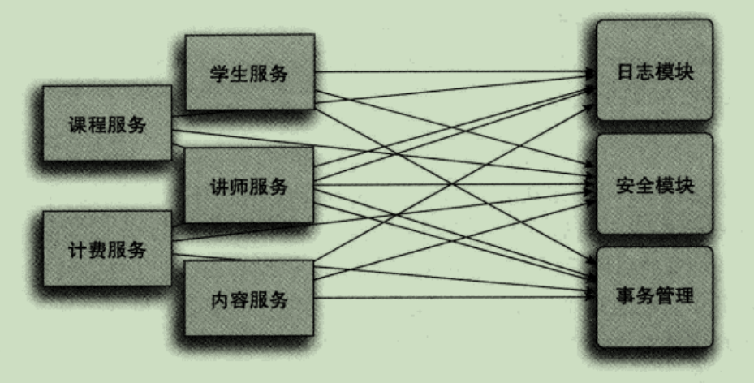
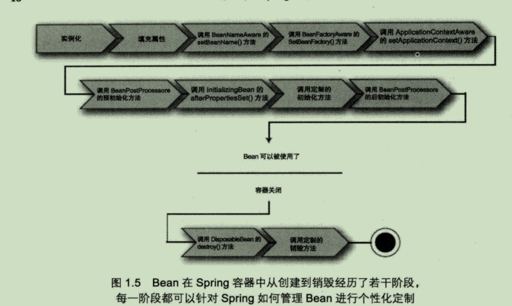
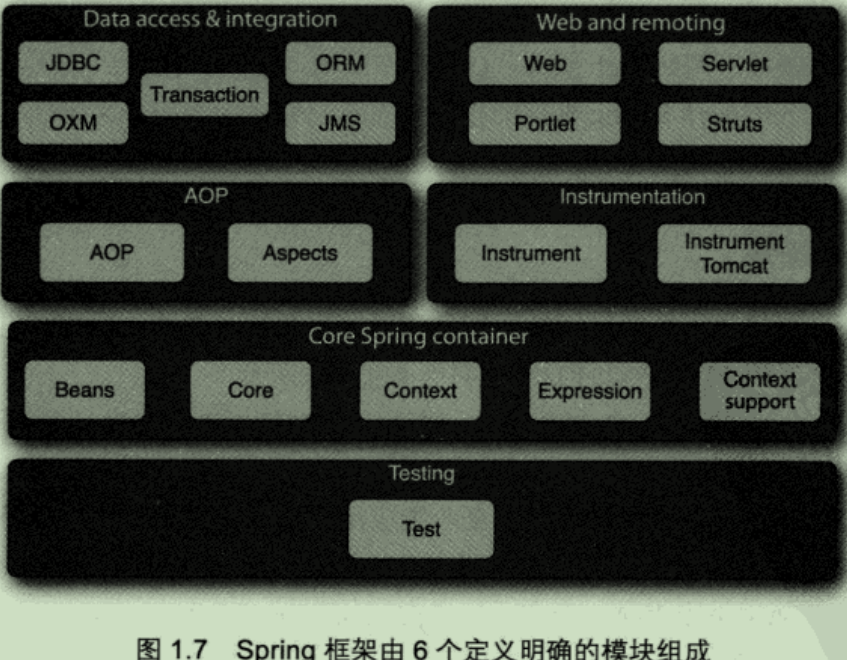

# Spring入门

Sping是一个开源框架，最早由Rod Johnson创建，并在《Expert One-on-ONe; JE22 Design and Development》这本著作中进行了介绍。Spring是为了解决企业级应用开发的复杂性而创建的，使用Spring可以让简单的JavaBean实现之前只有EJB才能完成的事情。但Spring不仅仅局限于服务器端开发，任何Java应用都能在简单性、可测试性和松耦合等方面从Spring中获益。

为了降低Java开发的复杂性，Spring采取了以下4种关键策略：

- 基于POJO的轻量级和最小侵入性编程；
- 通过依赖注入和面向接口实现松耦合；
- 基于切面和惯例进行声明式编程；
- 通过切面和模板减少样板式代码。

#### 激发POJO的潜能

相对于EJB的臃肿，Spring尽量避免因自身的api而弄乱用户的应用代码，Spring不会强迫用户实现Spring规范的接口或继承Spring规范的类，相反，在基于Spring构建的应用中，它的类通常没有任何痕迹表明你使用了Spring。最坏的场景是，一个类或许会使用Spring注解，但它依旧是POJO。

Spring赋予POJO魔力的方式之一就是通过`依赖注入`来装载它们。

### 依赖注入

任何一个有意义的应用一般都需要多个组件，这些组件之间必定需要进行相互协作才能完成特定的业务，从而导致组件之间的紧耦合，**牵一发而动全身**。
 代码示例：

```java
package com.springinaction.knights;

public class DamselRescuingKnight implements Knight {

    private RescueDamselQuest quest;

    public DamselRescuingKnight() {
        quest = new RescueDamselQuest();// 与RescueDamselQuest紧耦合
    }

    @Override
    public void embarhOnQuest() throws QuestException {
        quest.embark();
    }

}
```

正如你所见，DamselRescuingKnight 在它的构造函数中自行创建了RescueDamselQuest，这使得DamselRescuingKnight和RescueDamselQuest紧密地耦合到了一起，因此极大地限制了这个骑士的执行能力。如果一个少女需要救援，这个骑士能够召之即来。但是如果一条恶龙需要杀掉，那么这个骑士只能爱莫能助了。

另一方面，可以通过`依赖注入`的方式来完成对象之间的依赖关系，对象不再需要自行管理它们的依赖关系，而是通过依赖注入自动地注入到对象中去。

代码示例：

```java
package com.springinaction.knights;

public class BraveKnight implements Knight {

    private Quest quest;

    public BraveKnight(Quest quest) {
        this.quest = quest;// quest被注入到对象中
    }

    @Override
    public void embarhOnQuest() throws QuestException {
        quest.embark();
    }

}
```

不同于之前的DamselRescuingKnight，BraveKnight没有自行创建探险任务，而是在构造器中把探险任务作为参数注入，这也是依赖注入的一种方式，即**构造器注入**。

更为重要的是，BraveKnight中注入的探险类型是Quest，Quest只是一个探险任务所必须实现的接口。因此，BraveKnight能够响RescueDamselQuest、SlayDraonQuest等任意一种Quest实现，这正是**多态**的体现。

这里的要点是BraveKnight没有与任何特定的Quest实现发生耦合。对它来说，被要求挑战的探险任务只要实现了Quest接口，那么具体是哪一类型的探险就无关紧要了。这就是依赖注入最大的好处--**松耦合**。如果一个对象只通过**接口**（而不是具体实现或初始化的过程）来表明依赖关系，那么这种依赖就能够在对象本身毫不知情的情况下，用不同的具体实现进行替换。

#### 注入一个Quest到Knight

创建应用组件之间协作关系的行为称为**装配**，Spring有多种装配Bean的方式，其中最常用的就是通过XML配置文件的方式装配。
 示例代码：使用Spring将SlayDragonQuest注入到BraveKnight中。

```xml
<?xml version="1.0" encoding="UTF-8"?>
<beans xmlns="http://www.springframework.org/schema/beans"
    xmlns:xsi="http://www.w3.org/2001/XMLSchema-instance"
    xsi:schemaLocation="http://www.springframework.org/schema/beans http://www.springframework.org/schema/beans/spring-beans.xsd">

    <bean id="knight" class="com.springinaction.knights.BraveKnight">
        <constructor-arg ref="quest"></constructor-arg>
    </bean>

    <bean id="quest" class="com.springinaction.knights.SlayDragonQuest"></bean>

</beans>
```

### Spring是如何注入的？

Spring通过应用上下文（`ApplicationContext`）来装载Bean，`ApplicationContext`全权负责对象的创建和组装。

Spring自带了多种ApplicationContext来加载配置，比如，Spring可以使用`ClassPathXmlApplicationContext`来装载XML文件中的Bean对象。

```java
package com.springinaction.knights;

import org.springframework.context.ApplicationContext;
import org.springframework.context.support.ClassPathXmlApplicationContext;

public class KnightMain {
    public static void main(String[] args) {
        ApplicationContext context = new ClassPathXmlApplicationContext("knights.xml");// 加载Spring上下文
        Knight knight = (Knight) context.getBean("knight");// 获取knight Bean
        knight.embarhOnQuest();// 使用knight
    }
}
```

这个示例代码中，Spring上下文加载了`knights.xml`文件，随后获取了一个ID为knight的Bean的实例，得到该对象实例后，就可以进行正常的使用了。需要注意的是，这个类中完全不知道是由哪个Knight来执行何种Quest任务，只有`knights.xml`文件知道。

### 应用切面

通常情况下，系统由许多不同组件组成，其中的每一个组件分别负责一块特定功能。除了实现自身核心的功能之外，这些组件还经常承担着额外的职责，诸如日志、事务管理和安全等，此类的系统服务经常融入到有自身核心业务逻辑的组件中去，这些系统服务通常被称为**横切关注点**，因为它们总是跨越系统的多个组件，如下图所示。



对遍布系统的横切关注点的调用散布在各个组件里，而这些关注点并不是组件的核心业务

AOP可以使得这些服务模块化，并以声明的方式将它们应用到相应的组件中去，这样，这些组件就具有更高内聚性以及更加关注自身业务，完全不需要了解可能涉及的系统服务的复杂性。总之，AOP确保POJO保持简单。


利用AOP，可以将横切关注点覆盖在所需的组件之上，而这些组件不再需要额外的关注这些非核心业务。

如图所示，我们可以把切面想象为覆盖在很多组件之上的一个**外壳**。利用AOP，你可以使用各种功能层去包裹核心业务层。这些层以**声明的方式**灵活应用到你的系统中，甚至你的核心应用根本不知道它们的存在。

#### AOP应用

接上面骑士的故事，现在需要一个诗人来歌颂骑士的勇敢事迹，代码如下「Minstrel是中世纪的音乐记录器」：

```java
package com.springinaction.knights;

public class Minstrel {
    public void singBeforeQuest() { // 探险之前调用
        System.out.println("Fa la la; The knight is so brave!");
    }

    public void singAfterQuest() { // 探险之后调用
        System.out.println("Tee hee he; The brave knight did embark on a quest!");
    }
}
```

如代码中所示，诗人会在骑士每次执行探险前和结束时被调用，完成骑士事迹的歌颂。骑士必须调用诗人的方法完成歌颂：

```java
package com.springinaction.knights;

public class BraveKnight implements Knight {

    private Quest quest;
    private Minstrel minstrel;

    public BraveKnight(Quest quest) {
        this.quest = quest;// quest被注入到对象中
    }
    
    public BraveKnight(Quest quest, Minstrel minstrel) {
        this.quest = quest;// quest被注入到对象中
        this.minstrel = minstrel;
    }

    @Override
    public void embarhOnQuest() throws QuestException {
        minstrel.singAfterQuest();
        quest.embark();
        minstrel.singAfterQuest();
    }

}
```

但是，感觉是骑士在路边抓了一个诗人为自己「歌功颂德」，而不是诗人主动地为其传扬事迹。简单的BraveKnight类开始变得复杂，如果骑士不需要诗人，那么代码将会更加复杂。

但是有了AOP，骑士就不再需要自己调用诗人的方法为自己服务了，这就需要把Minstrel声明为一个切面：

```xml
<?xml version="1.0" encoding="UTF-8"?>
<beans xmlns="http://www.springframework.org/schema/beans"
    xmlns:xsi="http://www.w3.org/2001/XMLSchema-instance" xmlns:aop="http://www.springframework.org/schema/aop"
    xsi:schemaLocation="http://www.springframework.org/schema/beans http://www.springframework.org/schema/beans/spring-beans.xsd        
    http://www.springframework.org/schema/aop 
    http://www.springframework.org/schema/aop/spring-aop.xsd">

    <bean id="knight" class="com.springinaction.knights.BraveKnight">
        <constructor-arg ref="quest"></constructor-arg>
    </bean>

    <bean id="quest" class="com.springinaction.knights.SlayDragonQuest"></bean>

    <!-- 声明诗人Minstrel，待切入的对象（刀） -->
    <bean id="minstrel" class="com.springinaction.knights.Minstrel"></bean>

    <aop:config>
        <aop:aspect ref="minstrel">
            <!-- 定义切面，即定义从哪里切入 -->
            <aop:pointcut expression="execution(* *.embarkOnQuest(..))"
                id="embark" />
            <!-- 声明前置通知，在切入点之前执行的方法 -->
            <aop:before method="singBeforeQuest" pointcut-ref="embark" />

            <!-- 声明后置通知，在切入点之后执行的方法  -->
            <aop:after method="singAfterQuest" pointcut-ref="embark" />
        </aop:aspect>
    </aop:config>

</beans>
```

通过运行结果可以发现，在没有改动BraveKnight的代码的情况下，就完成了Minstrel对其的歌颂，而且BraveKnight并不知道Minstrel的存在。

### Bean

#### 容纳Bean

在Spring中，应用对象生存于Spring容器中，如图所示，Spring容器可以创建、装载、配置这些Bean，并且可以管理它们的生命周期。


#### Spring的容器实现

- Bean工厂（`org.springframework.beans.factory.BeanFactory`）：最简单的容器，提供基本的DI支持；
- 应用上下文（`org.springframework.context.ApplicationContext`）：基于BeanFactory之上构建，提供面向应用的服务。

#### 常用的几种应用上下文

- ClassPathXmlApplicationContext：从类路径中的XML配置文件加载上下文，会在所有的类路径（包括jar文件）下查找；
- FileSystemXmlApplicationContext：从文件系统中读取XML配置文件并加载上下文，在指定的文件系统路径下查找；
- XmlWebApplicationContext：读取Web应用下的XML配置文件并加载上下文；

#### Bean的生命周期



1. Spring对Bean进行实例化；

2. Spring将值和Bean的引用注入进Bean对应的属性中；

3. 如果Bean实现了`BeanNameAware`接口，Spring将Bean的ID传递给`setBeanName()`接口方法；

4. 如果Bean实现了`BeanFactoryAware`接口，Spring将调`setBeanFactory()`接口方法，将BeanFactory容器实例传入；

5. 如果Bean实现了`ApplicationContextAware`接口，Spring将调用`setApplicationContext()`接口方法，将应用上下文的引用传入；

6. 如果Bean实现了`BeanPostProcessor`接口，Spring将调用`postProcessBeforeInitialization()`接口方法；

7. 如果Bean实现了`InitializationBean`接口，Spring将调用`afterPropertiesSet()`方法。类似的如果Bean使用了`init-method`声明了初始化方法，该方法也会被调用；

8. 如果Bean实现了`BeanPostProcessor`接口，Spring将调用`ProcessAfterInitialization()`方法；

9. 此时此刻，Bean已经准备就绪，可以被应用程序使用了，它们将一直`驻留在应用上下文中`，直到该应用上下文被销毁；

10. 如果Bean实现了`DisposableBean`接口，Spring将调用`destory()`方法，同样的，如果Bean中使用了`destroy-method`声明了销毁方法，也会调用该方法；

### Spring模块



### 核心Spring容器

**容器**是Spring框架最核心的部分，它负责Spring应用中Bean的创建、配置和管理。Spring模块都构建与核心容器之上，当配置应用时，其实都隐式地使用了相关的核心容器类。另外，该模块还提供了许多企业级服务，如邮件、JNDI访问、EJB集成和调度等。

#### AOP

AOP是Spring应用系统开发切面的基础，与依赖注入一样，可以帮助应用对象`解耦`。借助于AOP，可以将遍布于应用的关注点（如事务和安全等）从所应用的对象中解耦出来。

#### 数据访问与集成

Spring的JDBC和DAO模块封装了大量的样板代码，这样可以使得在数据库代码变得简洁，也可以更专注于我们的业务，还可以避免数据库资源释放失败而引发的问题。另外，Spring AOP为数据访问提供了事务管理服务。同时，Spring还与流程的ORM（Object-Relational Mapping）进行了集成，如Hibernate、MyBatis等。

#### Web和远程调用

Spring提供了两种Web层框架：面向传统Web应用的基于Servlet的框架和面向使用Java Portlet API的基于Portlet的应用。Spring远程调用服务集成了RMI、Hessian、Burlap、JAX-WS等。

#### 测试

Spring提供了测试模块来测试Spring应用。

# 装配Bean

## 声明Bean

#### 创建Spring配置

从Spring3.0开始，Spring容器提供了两种配置Bean的方式。传统上，Spring使用一个或多个XML文件作为配置文件，而Spring3.0还同时提供了基于Java注解的配置方式，我们首先来关注传统的XML文件配置方式

在XML文件中声明Bean时，**Spring配置文件的根元素是来源于Spring beans命名空间所定义的<beans>元素**。以下为一个典型的Spring XML配置文件：

```xml
<?xml version="1.0" encoding="UTF-8"?>
<beans xmlns="http://www.springframework.org/schema/beans"
       xmlns:xsi="http://www.w3.org/2001/XMLSchema-instance"
       xsi:schemaLocation="http://www.springframe.org/schema/beans
       http://www.springframework.org/schema/beans/spring-beans-3.0.xsd">
    <!-- Bean declarations go here -->
    </bean>
```

在<beans>元素内，你可以放置所有的Spring配置信息，包括<bean>元素的声明。Spring的核心框架自带了10个命名空间配置，如表：

| 命名空间 | 用途                                                         |
| -------- | ------------------------------------------------------------ |
| aop      | 为声明切面以及将@AspectJ注解的类代理为Spring切面提供了配置元素 |
| beans    | 支持声明Bean和装配Bean，是Spring最核心也是最原始的命名空间   |
| context  | 为配置Spring应用上下文提供了配置元素，包括自动检测和自动装配Bean、注入非Spring直接管理的对象 |
| jee      | 提供了与Java EE API的集成，例如JNDI和EJB                     |
| jms      | 为声明消息驱动的POJO提供了配置元素                           |
| lang     | 支持配置由Groovy、JRuby或BeanShell等脚本实现的Bean           |
| mvc      | 启用Spring MVC的能力，例如面向注解的控制器、视图控制器和拦截器 |
| tx       | 提供声明式配置                                               |
| oxm      | 支持Spring的对象到XML映射配置                                |
| util | 提供各种各样的工具类元素，包括把集合配置为Bean、支持属性占位符元素 |


#### 声明一个简单的Bean

```xml
<bean id="duke" class="com.springaction.springidol.Juggler" />
```

<bean>元素是Spring中最基本的配置单元，通过该元素SPring将创建一个对象。这里创建了一个由SPring容器管理的名字为duke的Bean。这有可能是最简单的<bean>配置方式。id属性定义了Bean的名字，也作为该Bean在Spring容器中的引用。这个Bean被称为duke。你还可以根据class属性得知，duke是一个Juggler。

当Spring容器加载该Bean时，Spring将使用默认的构造器来实例化duke Bean。实际上duke会使用如下代码来创建：

```java
new com.springincation.springidol.Juggler();
```

为了给Duke一个排练的机会，你可以使用如下代码加载Spring上下文：

```java
ApplicationContext ctx = new ClassPathXmlApplicationContext(
"classpath/spring-idol.xml");
```

#### 通过构造器注入

下面的XML声明了Duke成为一个可以同时抛15个豆子的杂技师：

```xml
<bena id="duke"
      class="com.spirngincation.springidol.Juggler">
<constructor-arg value="15" />
</bena>
```

在构造Bean的时候，我们可以使用<constructor-arg>元素告诉Spring额外的信息。不配置<constructor-arg>元素，那么Spring将使用默认的构造方法。

**通过构造器注入对象引用**

可以使用下面的XML配置将Sonnet29声明为一个Spring<bean>:

```xml
<bean id="sonnet29"
      class="com.springinaction.springidol.Sonnet29" />
```

有了poem，你需要做的就是将poem赋予Duke。现在Duke是一个PoeticJuggler了，它的<bean>声明需要稍微修改一下：

```xml
<bean id="poeticDuke"
      class="com.springinaction.springidol.PoeticJuggler">
<constructor-arg value="15"/>
<constructor-arg ref="sonnet29" />
</bean>
```

构造PoeticJuggler的唯一方法只能使用带有参数的构造方法。*我们可以使用带有int参数和Poem引用的构造方法。在Duke Bean的声明中，我们通过<constructor-arg>元素的value属性将豆袋子的个数配置为15。

但是，我们不能使用value属性为第二个构造参数赋值，因为Poem不是简单类型。取而代之的是，我们使用ref属性来讲ID为sonnet29的Bean引用传递给构造器。可以想象当Spring碰到sonnet29和duke的<bean>声明时，它所执行的逻辑本质上与下面的Java代码相同：

```java
Poem sonnet29 = new Sonnet29();
Performer duke = new PoeticJuggler(15, sonnet29);
```

**通过工厂方法创建Bean**

有时候静态工厂方法是实例化对象的唯一方法。Spring支持通过<bean>元素的factory-method属性来装配工厂创建的Bean。

#### Bean的作用域

所有的Spring Bean默认都是单例。当容器分配一个Bean时（不论是通过装配还是调用容器的getBean()方法），它总是返回Bean的同一个实例。

当在Spring中配置<bean>元素时，我们可以为Bean声明一个作用域。为了让Spring在每次请求时都为Bean产生一个新的实例，我们只需要配置Bean的scope属性为prototype即可。

<bean id="" class="" scope="prototype" />

| 作用域         | 定义                                                         |
| -------------- | ------------------------------------------------------------ |
| singleton      | 在每一个Spirng容器中，一个Bean定义只有一个对象实例           |
| prototype      | 允许Bean的定义可以被实例化任意次（每次调用都创建一个实例）   |
| request        | 在一次HTTP请求中，每个Bean定义对应一个实例。该作用域仅在基于Web的Spring上下文（例文（例如Spring MVC）中才有效 |
| session        | 在一个HTTP Session中，每个Bean定义对应一个实例。该作用域仅在基于Web的Spring上下文（例文（例如Spring MVC）中才有效 |
| global-session | 在一个全局HTTP Session中，每个Bean定义对应一个实例。该作用于仅在Portlet上下文中才有效 |

#### 初始化和销毁Bean

为Bean定义初始化和销毁操作，只需要使用init-method和destroy-method参数来配置<bean>元素。init-method属性指定了在初始化Bean时要调用的方法。类似地，destroy-method属性指定了Bean从容器移除之前要调用的放法。

### 注入Bean属性

通常，JavaBean的属性是私有的，同时拥有一组存取器方法，以setXXX()和getXXX()形式存在。Spring可以借助属性的set方法来配置属性的值，以实现setter方式的注入。

# 最小化Spring XML配置

Spring提供了几种技巧，可以帮助我们减少XML的配置数量。

- 自动装配（autowiring）有助于减少甚至消除配置<property>元素和<constructor-arg>元素，让Spring自动识别如何装配Bean的依赖关系。
- 自动检测（autodiscovery）比自动装配更进了一步，让Spring能够自动识别哪些类需要被装配成Spring Bean，从而减少对<bean>元素的使用。

当自动装配和自动检测一起使用时，它们可以显著减少Spring的XML配置数量。通常只需要配置少量的几行XML代码，而无需知道在Spring的应用上下文中究竟有多少Bean。

### 自动装配Bean属性

自动装配（autowiring）

#### 4种类型的自动装配

当涉及自动装配Bean的依赖关系时，Spring有多种处理方式。因此，Spring提供了4种各具特色的自动装配策略。

- byName——把与Bean的属性具有相同名字（或者ID）的其他Bean自动装配到Bean的对应属性中。如果没有跟属性的名字相匹配的Bean，则该属性不进行装配。
- byType——把与Bean的属性具有相同类型的其他Bean自动装配到Bean的对应属性中。如果没有跟属性的类型相匹配的Bean，则该属性不被装配。
- constructor——把与Bean的构造器入参具有相同类型的其他Bean自动装配到Bean构造器的对应入参中。
- autodetect——首先尝试使用constructor进行自动装配。如果失败，再尝试使用byType进行自动装配。

**byName自动装配**

举个栗子：

```xml
<bean id="kenny2"
      class="com.springinaction.springidol.Instrumentalist">
<property name="song" value="Jingle Bells" />
    <property name="instrument" ref="saxophone" />
</bean>
```

在这里，我们使用<property>元素显式装配了Kenny的instrument属性。假设使用<bean>元素在定义萨克斯（saxophone）时，把Bean的id属性设置为instrument：

```xml
<bean id="instrument"
  		class="com.springinaction.springIdol.Saxphone" />
```

在本示例中，萨克斯（saxophone）Bean的id属性与Keeny Bean的instrument属性的名字是一样的。通过配置autowire属性，Spring就可以利用此信息自动装配kenny的instrument属性

```xml
<bena id="kenny"
      class="com.springinaction.springidol.Instrumentlist"
      autowire="byName">
<property name="song" value="Jingle Bells"/>
</bena>
```


byName自动装配遵循一项约定：为属性自动装配ID与该属性的名字相同的Bena。通过设置autowire属性为byName，Spring将特殊对待kenny的所有属性，为这些属性寻找与其名字相同的Spring Bean。在这里，Spring会发现instrument属性可以通过setter注入来进行自动装配。

使用byName自动装配的缺点是需要假设Bean的名字与其他Bean的属性的名字一样。

**byType自动装配**

byType自动装配的工作方式类似于byName自动装配，只不过不再是匹配属性的名字而是检查属性的类型。当我们尝试使用byType自动装配时，Spring会寻找哪一个Bean的类型与属性的类型相匹配。

**constructor自动装配**

如果要通过构造器注入来配置Bean，那我们可以移除<constructor-arg>元素，由Spring在应用上下文中自动选择Bean注入到构造器入参中。

例如：

```xml
<bean id="duke"
      class="com.springinaction.springidol.PoeticJuggler"
      autowire="constructor"
      />
```

上述声明告诉Spring去审视PoeticJuggler的构造器，并尝试在Spring配置中寻找匹配PoeticJuggler某一个构造器所有入参的Bean。

**最佳自动装配**

如果想自动装配Bean，但是又不能决定该使用那一种类型的自动装配。现在不必担心了，我们可以设置autuwire属性为autodetect，由Spring来决定。例如

```xml
<bean id="duke"
      class="com.springinaction.springidol.PoeticJuggle"
      autowire="autodetect"/>
```

当配置一个Bean的autowire属性为autodetect时，Spring将首先尝试使用constructor自动装配，如果没有发现与构造器相匹配的Bean时，Spring将尝试使用byType自动装配。

#### 默认自动装配

default-autowire

#### 混合使用自动装配和显式装配


### 使用注解装配

从Spring2.5开始，最有趣的一种装配Spring Bean的方式是使用注解自动装配Bean的属性。使用注解自动装配与在XML中使用autowire属性自动装配并没有太大差别。但是使用注解方式允许更细粒度的自动装配，我们可以选择性地标注某一属性来对应其应用自动装配。

Spring容器默认禁止注解装配。所以，在使用基于注解的自动装配前，我们需要在Spring配置中启用它。最简单的启用方式是使用Spring的context命名空间配置中的<context:annotation-config  />元素。

<context:annotation-config  />元素告诉Spring我们打算使用基于注解的自动装配。一旦配置完成，我们就可以对代码添加注解，标识Spring应该为属性、方法和构造器进行自动装配。

Spring3支持几种不同的用于自动装配的注解：

- Spring自带的@Autowired注解
- JSR-330的@Inject注解
- JSR-250的@Resource注解

#### 使用@Autowired

假设我们希望使用@Autowired让Spring自动装配乐器演奏家（Instrumentalist）Bean的instrument属性。则可以对setInstrument()方法进行标注，如下

```java
@Autowired
public void setInstrument(Instrument instrument){
    this.instrument = instrument;
}
```

当Spring发现我们对setInstrument()方法使用了@Autowired注解时，Spring就会尝试对该方法执行byType自动装配。@Autowired也可以用于装配Bean的引用和标注构造器。

##### 可选的自动装配

默认情况下，@Autowired具有强契约特征，其所标注的属性或参数必须是可装配的。如果没有Bean可以装配到@Autowired所标注的属性或参数中，自动装配就会失败（抛出令人讨厌的NoSuchBeanDefinitionException）。这可能是我们所期望的处理方式——当自动装配无法完成时，让Spring尽早失败，远胜于以后抛出异常。

属性不一定非要装配，null值也是可以接受的。在这种场景下，可以通过设置@Autowired的required属性为false来配置自动装配是可选的。

```java
@Autowired(required=false)
private Instrument instrument;
```

在这里，Spring将尝试装配instrument属性，但是如果没有查找到与之匹配的类型为Instrument的Bean，应用就不会发生任何问题，而instrument属性的值会设置为null。

##### 限定歧义性的依赖

为了帮助@Autowired鉴别出哪一个Bean才是我们所需要的，我们可以配合使用Spring的@Qualifier注解。

例如，为了确保Spirng为eddie Bean选择吉他（guitar）来演奏，即使有其他Bean也可以装配到instrument属性中，但我们可以使用@Qualifier来明确指定名为guitar的Bean：

```java
@Autowired
@Qualifier("guitar")
private Instrument instrument;
```

如上所示，@Qualifier注解将尝试注入ID为guitar的Bean。

#### 借助@Inject实现基于标准的自动装配

和@Autowired一样，@Inject可以用来自动装配属性、方法和构造器；与@Autowired不同的是，@Injet没有required属性。因此，@Inject注解所标注的依赖关系必须存在，如果不存在，则会抛出异常。

例如，我们有一个KnifeJuggler类需要注入一个或多个Knife的实例。假设Knife Bean的作用域声明为prototype，下面的KnifeJuggler的构造器将获得5个Knife Bean：

```java
private Set<Knife> knives;

@Inject
public KnifeJuggler(Provider<Knife> knifeProvider){
	knives = new HashSet<Knife>();
    for(int i=0;i<5;i++){
		knives.add(knifeProvider.get());
    }
}
```

KnifeJuggler将获得一个Provider<Knife>，而不是在构造器中获得一个Knife实例。这个时候，只有provider被注入进去；在调用provider的get()方法之前，实际的Knife对象并没有被注入。在这个示例中，get()方法被调用了5次。因为Knife Bean的作用域为prototype，所以knife的Set集合将被赋予5个不同的Knife对象。

##### 限定@Inject所标注的属性

@Named注解的工作方式非常类似于Spring的@Qualifier，正如我们在这里所看到的：

```java
@Inject
@Named("guitar")
private Instrument instrument;
```

#### 在注解注入中使用表达式

@Value注解尽管易于使用，但我们很快就会发现，它同样具有威力。我们可以通过@Value直接标注某个属性、方法或者方法参数，并传入一个String类型的表达式来装配属性。例如：

```java
@Value("Eruption")
private String song;
```

在这里，我们为String类型的属性装配了一个String类型的值。但是传入@Value的String类型的参数只是一个表达式——它的结算结果可以是任意类型，因此@Value能够标注任意类型的属性。

### 自动检测Bean

\<context:component-scan>元素除了完成了与\<context:annotation-config>一样的工作，还允许Spring自动检测Bean和定义Bean。

\<context:component-scan>元素会扫描指定的包及其所有子包，并查找能够自动注册为Spring Bean的类。base-package属性标识了\<context:component-scan>元素所扫描的包。

#### 为自动检测标注Bean

默认情况下，<context:component-scan >查找使用构造器（stereotype）注解所有标注的类，这些特殊的注解如下：

- @Component ——通用的构造型注解，标识该类为Spring组件。
- @Controller——标识将该类定义为SpringMVC controller。
- @Repository——标识将该类定义为数据仓库
- @Service——标识将该类定义为服务。
- 使用@Component标注的任意自定义注解。


#### 过滤组件扫描

通过为\<context:component-scan>配置\<context:include-filter>和/或者\<context:exclude-filter>子元素，我们可以随意调整扫描行为。

| 过滤器类型 | 描述                                                         |
| ---------- | ------------------------------------------------------------ |
| annotation | 过滤器扫描使用指定注解所标注的那些类，通过expression属性指定要扫描的注解 |
| assignable | 过滤器扫描派生于expression属性所指定类型的那些类             |
| aspectj    | 过滤器扫描与expression属性所指定的AspectJ表达式所匹配的那些类 |
| custom     | 使用自定义的org.springframework.core.type.TypeFilter实现类，该类由expression |
| regex      | 过滤器扫描类的名称与expression属性所指定的正则表达式匹配的那些类 |


# 面向切面的Spring

## 什么是面向切面编程

在软件开发中，分布于应用中多处的功能被称为**横切关注点**（cross-cutting concerns）。通常，这些横切关注点从概念上是与应用的业务逻辑相分离的（但是往往直接嵌入到应用的业务逻辑之中）。将这些横切关注点与业务逻辑相分离正是**面向切面编程（AOP）**所要解决的。例如，安全就是一个横切关注点，应用中的许多方法都会设计安全规划。图4.1直接呈现了横切关注点的概念。


### 定义AOP术语

与大多数技术一样，AOP已经形成了自己的术语。横切关注点的常用术语有通知（advice）、切点（pointcut）和连接点（join point）。如图展示了这些概念是如何关联在一起的。


**通知（Advice）**

当抄表员出现在我们家门口时，他们要登记用电量并回去向电力公司报告。显然，他们必须有一份需要抄表的住户清单，他们所汇报的信息也很重要。但是记录用电量才是抄表员的主要工作。

类似地，切面也有目标——它必须要完成的工作。在AOP术语中，切面的工作被称为通知。

通知定义了切面是什么以及何时使用。除了描述切面要完成的工作，通知还解决了何时执行这个工作的问题。它应该应用于某个方法被调用之前？之后？之前和之后？还是只在方法抛出异常时？

Spirng切面可以应用5种类型的通知。

- Before——在方法被调用之前调用通知。
- After——在方法完成之后调用通知，无论方法执行是否成功。
- After-returning——在方法成功执行之后调用通知。
- After-throwing——在方法抛出异常后调用通知。
- Around——通知包裹了被通知的方法，在被通知的方法调用之前和调用之后执行自定义的行为。

**连接点（Joinpoint）**

我们的应用可能也需要对数以千计的时机应用通知。这些时机被称为来连接点。连接点是在应用执行过程种能够插入切面的一个点。这个点可以是调用方法时、抛出异常时、甚至修改一个字段时。切面代码可以利用这些点插入到应用的正常流程之中，并添加新的行为。

**切点（Pointcut）**

一个切面并不需要通知应用的所有连接点。切点有助于缩小切面通知连接点的范围。

如果通知定义了切面的“什么”和“何时”，那么切点就定义了“何处”。切点的定义会匹配通知所要织入的一个或多个连接点。我们通常使用明确的类和方法名称类指定这些切点，或是利用正则表达式定义匹配的类和方法名称模式来指定这些切点。有些AOP框架允许我们创建动态的切点，可以根据运行时的决策（比如方法的参数值）来决定是否应用通知。

**切面（Aspect）**

切面是通知和切点的结合。通知和切点共同定义了关于切面的全部内容——它是什么，在何时和何处完成其功能。

**引入（Introduction）**

引入允许我们向现有的类添加新方法或属性。

**织入（Weaving）**

织入是将切面应用到目标对象来创建新的代理对象的过程。切面在指定的连接点被织入到目标对象种。在目标对象的生命周期里有多个点可以进行织入。

- 编译期——切面在目标类编译时被织入。这种方式需要特殊的编译器。AspectJ的织入编译器就是以这种方式织入切面的。
- 类加载期——切面在目标类加载到JVM时被织入。这种方式需要特殊的类加载器（ClassLoader），它可以在目标类被引用应用之前增强该目标类的字节码。AspectJ5的LTW（load-time weaving）就支持以这种方式织入切面。
- 运行期——切面在应用运行的某个时刻被织入。一般情况下，在织入切面时，AOP容器会为目标对象动态地创建一个代理对象。Spring  AOP就是以这种方式织入切面的。

### Spring对AOP的支持

并不是所有的AOP框架都是一样的，它们在连接点模型上可能有强弱之分。有些允许对字段修饰符级别应用通知，而另一些只支持与方法调用相关的连接点。它们织入切面的方式和时机也有所不同。但是无论无何，创建切点来定义切面织入的连接点是AOP框架的基本功能。

主要有如下三个框架：

- AspectJ（http://eclipse.org/aspectj）；
- JBoss AOP（http://www.jboss.org/jbossaop）；
- Spring AOP（http://www.springframework.org）。

Spring提供了4种各具特色的AOP支持：

- 基于代理的经典AOP；
- @AspectJ注解驱动的切面；
- 纯POJO切面；
- 注入式AspectJ切面（适合Spring各版本）。

前3种都是Spring基于代理的AOP变体，因此，Spring对AOP的支持局限于方法拦截。如果AOP需求超过了简单方法拦截的范畴（比如构造器或属性拦截），那么应该考虑在AspectJ里实现切面，利用Spring的DI把Spring  Bean注入到AspectJ切面中。

**Spring通知是Java编写的**

Spring所创建的通知都是用标准的Java类编写的。这样的话，我们就可以使用与普通Java开发一样的集成开发环境（IDE）来开发切面。

AspectJ与之相反。虽然AspectJ现在支持基于注解的切面，但是AspectJ最初是以Java语言扩展的方式实现的。

## 使用切点选择连接点


### 编写切点

### 使用Spring的bean()指示器


## 在XML中声明切面


| AOP配置元素              | 描述 |
| ------------------------ | ---- |
| \<aop:advisor>           | 定义AOP通知器 |
| \<aop:after>             | 定义AOP后置通知（不管被通知的方法是否执行成功） |
| \<aop:after-returning>   | 定义AOP after-returning通知 |
| \<aop:after-throwing>    | 定义after-throwing通知 |
| \<aop:around>            | 定义AOP环绕通知 |
| \<aop:aspect>            | 定义切面 |
| \<aop:aspectj-autoproxy> | 启用@AspectJ注解驱动的切面 |
| \<aop:before>            | 定义AOP前置通知 |
| \<aop:config>            | 顶层的AOP配置元素，大多数的\<aop:*>元素必须包含在\<aop:config>元素内 |
| \<aop:declare-parents>            | 为被通知的对象引入额外的接口，并透明地实现 |
| \<aop:pointcut>            | 定义切点 |

# 构建Spring Web应用程序

## Spring  MVC 起步

### 跟踪Spring MVC的请求


在请求离开浏览器时①，会带有用户所请求内容的信息，至少会包含请求的URL。

请求旅程的第一站是Spring的DispatcherServlet。与大多数基于Java的Web框架一样，SpringMVC所有的请求都会通过一个前端控制器（front controller）servlet。前端控制器是常用的Web应用程序模式，在这里一个单实例的Servlet将请求委托给应用程序的其他组件来执行实际的处理。在SpringMVC中，DispatcherServlet就是前端控制器。

DispatcherServlet的任务是将请求发送给Spring MVC控制器（controller）。控制器是一个用于处理请求的Spring组件。在典型的应用程序中可能会有多个控制器，DispatcherServlet需要知道应该将请求发送给那个控制器。所以DispatcherServlet以会查询一个或多个处理器映射（handler mapping）②来确定请求的下一个站在哪里。处理器映射会根据请求所携带的URL信息来进行决策。

一旦选择了合适的控制器，DispatcherServlet会将请求发送给选中的控制器③。到了控制器，请求会卸下其负载（用户提交的信息）并耐心等待控制器处理这些信息。（实际上，设计良好的控制器本身只处理很少甚至不处理工作，而是将业务逻辑委托给一个或多个服务对象进行处理）。

控制器在完成逻辑处理后，通常会产生一些信息，这些信息需要返回给用户并在浏览器上显示。这些信息被称为模型（model）。不过仅仅给用户返回原始的信息是不够的——这些信息需要以用户友好的方式进行格式化，一般会是HTML。所以，信息需要发送给一个视图（view），通常会是JSP。

控制器所做的最后一件事就是将模型数据打包，并且标示出用于渲染输出的视图名。它接下来会将请求联通模型和视图名发送回DispatcherServlet④。

这样，控制器就不会与特定的视图相耦合，传递给DispatcherServlet的视图名并不直接表示某个特定的JSP。实际上，它甚至并不能确定视图就是JSP。相反，它仅仅传递了一个逻辑名称，这个名字将会用来查找产生结果的真正视图。DispatcherServlet将会使用视图解析器（view resolver）⑤来将逻辑视图名匹配为一个特定的视图实现，它可能是也可能不是JSP。

既然DispatcherServlet已经知道由哪个视图渲染结果，那请求的任务基本上也就完成了。它的最后一站是视图的实现（可能是JSP）⑥，在这里它交付模型数据。请求的任务就完成了。视图将使用模型数据渲染输出，这个输出会通过响应对象传递给客户端（不会像听上去那样硬编码）⑦。

### Spring MVC中几个常见的注解 

在Spring MVC中，控制器只是方法上添加了@RequestMapping注解的类，这个注解声明了它们所要处理的请求。他的value属性指定了这个方法所要处理的请求路径，method属性细化了它所处理的HTTP方法。被注解的函数，如果返回一个String类型。这个String将会被Spring MVC解读为要渲染的视图名称。DispatcherServlet会要求视图解析器将这个逻辑名称解析为实际的视图。

@Controller是一个构造型（stereotype）的注解，它基于@Component注解。在这里，它的目的就是辅助实现组件扫描。

Model实际上就是一个Map（也就是key-value对的集合），它会传递给视图，这样数据就能渲染到客户端了。