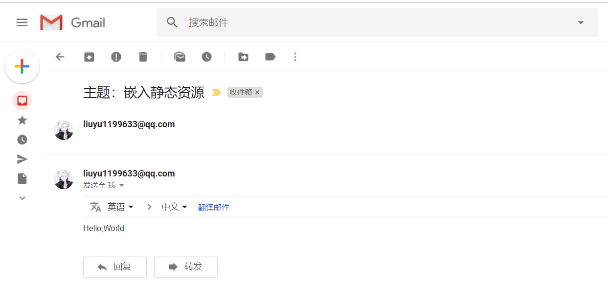

相信使用过Spring的众多开发者都知道Spring提供了非常好用的JavaMailSender接口实现邮件发送。在Spring Boot的Starter模块中也为此提供了自动化配置。下面通过实例看看如何在Spring Boot中使用JavaMailSender发送邮件。

## 快速入门

### 在Spring Boot的工程中的pom.xml中引入spring-boot-starter-mail依赖：
```xml
<?xml version="1.0" encoding="UTF-8"?>
<project xmlns="http://maven.apache.org/POM/4.0.0" xmlns:xsi="http://www.w3.org/2001/XMLSchema-instance"
         xsi:schemaLocation="http://maven.apache.org/POM/4.0.0 http://maven.apache.org/xsd/maven-4.0.0.xsd">
    <modelVersion>4.0.0</modelVersion>
    <parent>
        <groupId>org.springframework.boot</groupId>
        <artifactId>spring-boot-starter-parent</artifactId>
        <version>2.1.1.RELEASE</version>
        <relativePath/> <!-- lookup parent from repository -->
    </parent>
    <groupId>com.ctf</groupId>
    <artifactId>project</artifactId>
    <version>0.0.1-SNAPSHOT</version>
    <name>project</name>
    <description>Demo project for Spring Boot</description>

    <properties>
        <java.version>1.8</java.version>
    </properties>

    <dependencies>
        <dependency>
            <groupId>org.mybatis.spring.boot</groupId>
            <artifactId>mybatis-spring-boot-starter</artifactId>
            <version>1.3.2</version>
        </dependency>
        <dependency>
            <groupId>org.springframework.boot</groupId>
            <artifactId>spring-boot-starter-mail</artifactId>
        </dependency>
        <dependency>
            <groupId>org.springframework.boot</groupId>
            <artifactId>spring-boot-starter-test</artifactId>
        </dependency>
    </dependencies>
</project>
```

如其他自动化配置模块一样，在完成了依赖引入之后，只需要在application.properties中配置相应的属性内容。

下面我们以QQ邮箱为例，在application.properties中加入如下配置（注意替换自己的用户名和密码）：
```xml
spring.mail.host=smtp.qq.com
spring.mail.username=QQ邮箱地址
spring.mail.password=QQ邮箱的授权码
spring.mail.properties.mail.smtp.auth=true
spring.mail.properties.mail.smtp.starttls.enable=true
spring.mail.properties.mail.smtp.starttls.required=true
```

如果不是用QQ邮箱做邮箱服务器的话，请参考相关邮箱服务的相关说明。

这里给出QQ邮箱的相关说明：https://service.mail.qq.com/cgi-bin/help?subtype=1&&id=28&&no=1001256

### 通过单元测试来实现一封简单邮件的发送：

```java
package com.ctf.project;

import org.junit.Test;
import org.junit.runner.RunWith;
import org.springframework.beans.factory.annotation.Autowired;
import org.springframework.boot.test.context.SpringBootTest;
import org.springframework.mail.javamail.JavaMailSender;
import org.springframework.mail.javamail.MimeMessageHelper;
import org.springframework.test.context.junit4.SpringJUnit4ClassRunner;

import javax.mail.internet.MimeMessage;

/**
 * @author: Tu9ohost
 */
@RunWith(SpringJUnit4ClassRunner.class)
@SpringBootTest
public class sendInlineMail {
    @Autowired
    private JavaMailSender mailSender;

    @Test
    public void sendAttachmentsMail() throws Exception{
        MimeMessage mimeMessage = mailSender.createMimeMessage();

        MimeMessageHelper helper = new MimeMessageHelper(mimeMessage,true);
        helper.setFrom("liuyu1199633@qq.com");
        helper.setTo("tugohost@gmail.com");
        helper.setSubject("主题：嵌入静态资源");
        helper.setText("<html><body>Hello,World</body></html>",true);
/*
        FileSystemResource fileSystemResource = new FileSystemResource(new File("weixin.jpg"));
        helper.addInline("weixin",fileSystemResource);*/

        mailSender.send(mimeMessage);
    }
}

```

## 效果展示：
我用的我自己的QQ邮箱发给我的Gmail邮箱。
