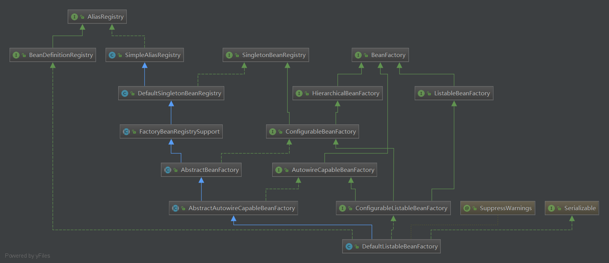

# 容器的基本实现

## 容器基本用法

bean是Spring中最核心的东西，因为Spring就像是个大水桶，而bean就像是容器中的水，水桶脱离了水便也没什么用处了，那么我们先看看bean的定义。

```java
public class MyTestBean{
    private String testStr = "testStr";
    public String getTestStr(){
        return testStr;
    }
    public void setTestStr(String testStr)
}
```

接下来是配置文件：

```xml
<beans><bean id="myTestBean" class="bean.MyTestBean"/></beans>
```

测试代码：

```java
@SuppressWarnings("deprecation")
public class BeanFactoryTest{
    @Test
    public void testSimpleLoad(){
        BeanFactory bf = new XmlBeanFactory(new ClassPathResource("beanFactoryTest.xml"));
        MyTestBean bean = (MyTestBean) bf.getBean("myTestBean");
        assertEquals("testStr",bean.getTestStr());
    }
}
```

这段测试代码完成的功能无非就是以下几点：

1. 读取配置文件`beanFactoryTest.xml`。
2. 根据`beanFactoryTest.xml`中的配置找到对应的类的配置，并实例化。
3. 调用实例化后的实例。

## Spring的结构组成

### 核心类介绍

1）`DefaultListableBeanFactory`

`XmlBeanFactory`继承自`DefaultListableBeanFactory`，而`DefaultListableBeanFactory`是整个bean的加载的核心部分，是Spring注册及加载bean的默认实现，而对于`XmlBeanFactory`与`DefaultListableBeanFactory`不同的地方其实是在`XmlBeanFactory`中使用了自定义的XML读取器`XmlBeanDefinitionReader`，实现了个性化的`BeanDefinitionReader`读取，`DefaultListableBeanFactory`继承了`AbstractAutowireCapableBeanFactory`并实现了`ConfigurableListableBeanFactory`以及`BeanDefinitionRegistry`接口。以下是`DefaultListableBeanFactory`的相关类图：



- AliasRegistry：定义对alias的简单增删改等操作。
- SimpleAliasRegistry：主要使用map作为alias的缓存，并对接口AliasRegistry进行实习。
- SingletonBeanRegistry：定义对单例的注册及获取。
- BeanFactory：定义获取bean及bean的各种属性。
- DefaultSingletonBeanRegistry：对接口SingletonBeanRegistry各函数的实现。
- HierarchicalBeanFactory：继承BeanFactory，也就是在BeanFactory定义的功能的基础上增加了对parentFactory的支持。
- BeanDefinitionRegistry：定义对BeanDefinition的各种增删改操作。
- FactoryBeanRegistrySuport：在DefaultSingletonBeanRegistry基础上增加了对FactoryBean的特殊处理功能。
- ConfigurableBeanFactory：提供配置Factory的各种方法。
- List