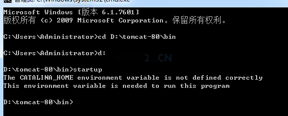

# Tomcat问题排查

转自[how2java](http://how2j.cn/k/tomcat/tomcat-faq/1132.html)

---

列罗出了Tomcat常见的问题，如不能启动，屏幕一闪而过，启动之后，访问总是出现404等等常见问题。   以下排查手段都是针对通过startup.bat 独立方式启动的Tomcat，集成开发环境IDE(IDEA,ECLIPSE,MYECLIPSE等) 下的Tomcat启动不在此知识点讨论范围之内。 

---

### JAVA_HOME

现象：点击startup.bat之后，屏幕一闪而过 检验：如图所示, 首先通过cmd命令进入控制台，然后切换到对应的目录执行startup命令，得到JRE_HOME environment .... 这么个提示，就表示JAVA_HOME环境变量没有设置。 分析：Tomcat本身是JAVA程序，必须要有JDK才可以执行，所以必须配置JAVA_HOME。 

解决：重新配置一下

### CATALINA_HOME未设置 

现象：点击startup.bat之后，屏幕一闪而过 检验：如图所示, 首先通过cmd命令进入控制台，然后切换到对应的目录执行startup命令，得到CATALINA_HOME environment .... 这么个提示，就表示CATALINA_HOME环境变量设置错误。 

分析：Tomcat执行必须依赖CATALINA_HOME或者CATALINA_BASE这两个环境变量。 如果没有在环境变量里配置过，那么会自动采用bin目录的父目录作为CATALINA_HOME和CATALINA_BASE。 如果配置了，而所配置的地方又不是正确的TOMCAT目录，那么就会出现这个错误。 

解决： 1. 在环境变量中删除CATALINA_HOME,CATALINA_BASE的配置，记得不仅要检查环境变量，还要检查用户变量。 2. 或者把CATALINA_HOME设置为正确的TOMCAT目录。 

### CATALINA_HOME错误设置 

现象：Tomcat可以成功启动，但是就是不能访问自己配置的web应用，老是提示404错误 检验：如图所示, 在环境变量里，CATALINA_HOME设置在了另一个合法的tomcat目录上，所以无论运行哪个startup.bat，都会导致这个d:/tomcatxxxx目录下的程序被启动，而不是你期望的那个。 

分析：默认的Tomcat会优先根据环境变量中的CATALINA_HOME来定位目录，并运行。 

解决： 

1. 在环境变量中删除CATALINA_HOME,CATALINA_BASE的配置，记得不仅要检查环境变量，还要检查用户变量。 
2. 或者使用本站的[纯净版 Tomcat](http://how2j.cn/k/tomcat/tomcat-download/1130.html)，已经取消了对环境变量CATALINA_HOME和CATALINA_BASE的依赖。 

### 端口冲突 

现象：屏幕一闪而过，或者不会关闭，但是提示大量错误，其中会看到如图所示的Address already in use: JVM_Bind <null>:80，即表示端口被占用了。  

检验：如果是这个错误，在TOMCAT目录下的logs目录里，会有一个日志文件：catalina.yyyy-mm-dd.log（当天时间），在这个日志文件里会记载一样的错误:Address already in use: JVM_Bind <null>:80。即表明80端口被占用了。  

分析：端口是独占式的，一旦一个程序占用了这个端口，其他程序就不能够再去占用它了。而80端口，有可能是被已经存在的Tomcat占用了，也有可能是被其他不知名的软件占用了，比如Apache,IIS,Oracle等等。 

解决：请按照[Tomcat 端口被占用了怎么办？](http://how2j.cn/k/tomcat/tomcat-portfix/545.html) 步骤进行操作，定位占用端口的程序，并关闭，即可。 

### localhost.yyyy-mm-dd.log 

现象：404错误 

检验：打开tomcat/logs目录里的localhost.yyyy-mm-dd.log文件，发现大量的报错信息。 

分析：当server.xml， web.xml配置错误的时候，当前web应用就会部署失败，并且会将错误信息输出到localhost.yyyy-mm-dd.log文件中。 

解决： 要在localhost.yyyy-mm-dd.log文件中看提示什么错误，有可能是配置的context目录不存在，有可能是多了一个>符号，具体问题，具体分析了。 

### Error FilterStart 

现象：404错误，明明有文件，但是就是不能访问。
检验：这个严格地说，也是配置失败，但是tomcat不会大量报错，只会偷偷地来这么一句： startup failed due to previous errors。
分析：过滤器启动失败就会报这个错。
解决：同样的，过滤器启动失败原因也是多种多样，好在它都会把具体错误信息输出到localhost.yyyy-mm-dd.log，这样打开localhost.yyyy-mm-dd.log根据实际情况分析，就可以较快定位问题所在了。

 

### JDK版本

现象：404错误，明明有文件，但是就是不能访问。 

检验：在命令行中运行java -version 检查一下当前java的版本 分析：当部署的web应用中的类是由高版本JDK编译生成，而当前tomcat运行所使用的JDK又是低版本的话，就会报出如图所示的错误：UnsupportedClassVersionError，进而导致web应用启动失败。 

解决：请使用JDK8或者更高版本，请参考 [检测JDK版本，以及下载与配置](http://how2j.cn/k/helloworld/helloworld-jdk/141.html) 

