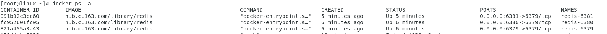
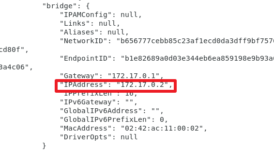
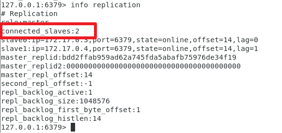

# 简介
## 什么是Docker
Docker 最初是 dotCloud 公司创始人 Solomon Hykes 在法国期间发起的一个公司内部项目，它是基于dotCloud 公司多年云服务技术的一次革新，并于 2013 年 3 月以 Apache 2.0 授权协议开源，主要项目代码在 GitHub 上进行维护。Docker 项目后来还加入了 Linux 基金会，并成立推动 开放容器联盟（OCI）。

Docker 使用 Google 公司推出的 Go 语言 进行开发实现，基于 Linux 内核的cgroup，namespace，以及 AUFS 类的 Union FS 等技术，对进程进行封装隔离，属于 操作系统层面的虚拟化技术。由于隔离的进程独立于宿主和其它的隔离的进程，因此也称其为容器。最初实现是基于 LXC，从 0.7 版本以后开始去除 LXC，转而使用自行开发的libcontainer，从 1.11 开始，则进一步演进为使用 runC 和 container。

Docker 在容器的基础上，进行了进一步的封装，从文件系统、网络互联到进程隔离等等，极大的简化了容器的创建和维护。使得 Docker 技术比虚拟机技术更为轻便、快捷。

下面的图片比较了 Docker 和传统虚拟化方式的不同之处。传统虚拟机技术是虚拟出一套硬件后，在其上运行一个完整操作系统，在该系统上再运行所需应用进程；而容器内的应用进程直接运行于宿主的内核，容器内没有自己的内核，而且也没有进行硬件虚拟。因此容器要比传统虚拟机更为轻便。


## 为什么要使用Docker
作为一种新兴的虚拟化方式，Docker 跟传统的虚拟化方式相比具有众多的优势。
### 更高效的利用系统资源
由于容器不需要进行硬件虚拟以及运行完整操作系统等额外开销，Docker 对系统资源的利用率更高。无论是应用执行速度、内存损耗或者文件存储速度，都要比传统虚拟机技术更高效。因此，相比虚拟机技术，一个相同配置的主机，往往可以运行更多数量的应用。

### 更快速的启动时间
传统的虚拟机技术启动应用服务往往需要数分钟，而 Docker 容器应用，由于直接运行于宿主内核，无需启动完整的操作系统，因此可以做到秒级、甚至毫秒级的启动时间。大大的节约了开发、测试、部署的时间。

### 一致的运行环境
开发过程中一个常见的问题是环境一致性问题。由于开发环境、测试环境、生产环境不一致，导致有些 bug 并未在开发过程中被发现。而 Docker 的镜像提供了除内核外完整的运行时环境，确保了应用运行环境一致性，从而不会再出现 「这段代码在我机器上没问题啊」 这类问题。

### 持续交付和部署
对开发和运维（DevOps）人员来说，最希望的就是一次创建或配置，可以在任意地方正常运行。

使用 Docker 可以通过定制应用镜像来实现持续集成、持续交付、部署。开发人员可以通过 Dockerfile 来进行镜像构建，并结合 持续集成(Continuous Integration) 系统进行集成测试，而运维人员则可以直接在生产环境中快速部署该镜像，甚至结合 持续部署(Continuous Delivery/Deployment) 系统进行自动部署。

而且使用`Dockerfile`使镜像构建透明化，不仅仅开发团队可以理解应用运行环境，也方便运维团队理解应用运行所需条件，帮助更好的生产环境中部署该镜像。

### 更轻松的迁移
由于 Docker 确保了执行环境的一致性，使得应用的迁移更加容易。Docker 可以在很多平台上运行，无论是物理机、虚拟机、公有云、私有云，甚至是笔记本，其运行结果是一致的。因此用户可以很轻易的将在一个平台上运行的应用，迁移到另一个平台上，而不用担心运行环境的变化导致应用无法正常运行的情况。

### 更轻松的维护和扩展
Docker 使用的分层存储以及镜像的技术，使得应用重复部分的复用更为容易，也使得应用的维护更新更加简单，基于基础镜像进一步扩展镜像也变得非常简单。此外，Docker 团队同各个开源项目团队一起维护了一大批高质量的 官方镜像，既可以直接在生产环境使用，又可以作为基础进一步定制，大大的降低了应用服务的镜像制作成本。

### 对比传统虚拟机总结
|    特性    | 容器 | 虚拟机 |
| ---------- | --- |   --- |
| 启动 |  秒级 | 分钟级 |
| 磁盘使用       |  一般为MB | 一般位GB |
| 性能 | 接近原生 | 弱于 |
| 系统支持量 | 单机支持上千个容器 | 一般几十个 |

# 基本概念
## 镜像
我们都知道，操作系统分为内核和用户空间。对于 Linux 而言，内核启动后，会挂载 root 文件系统为其提供用户空间支持。而 Docker 镜像（Image            ），就相当于是一个 root 文件系统。比如官方镜像`ubuntu:18.04`就包含了完整的一套 Ubuntu 18.04 最小系统的 root 文件系统。

Docker 镜像是一个特殊的文件系统，除了提供容器运行时所需的程序、库、资源、配置等文件外，还包含了一些为运行时准备的一些配置参数（如匿名卷、环境变量、用户等）。镜像不包含任何动态数据，其内容在构建之后也不会被改变。
## 容器
镜像（Image）和容器（Container）的关系，就像是面向对象程序设计中的 类 和 实例 一样，镜像是静态的定义，容器是镜像运行时的实体。容器可以被创建、启动、停止、删除、暂停等。

容器的实质是进程，但与直接在宿主执行的进程不同，容器进程运行于属于自己的独立的 命名空间。因此容器可以拥有自己的 root 文件系统、自己的网络配置、自己的进程空间，甚至自己的用户 ID 空间。容器内的进程是运行在一个隔离的环境里，使用起来，就好像是在一个独立于宿主的系统下操作一样。这种特性使得容器封装的应用比直接在宿主运行更加安全。也因为这种隔离的特性，很多人初学 Docker 时常常会混淆容器和虚拟机。
## 仓库
Docker Registry 公开服务是开放给用户使用、允许用户管理镜像的 Registry 服务。一般这类公开服务允许用户免费上传、下载公开的镜像，并可能提供收费服务供用户管理私有镜像。

最常使用的 Registry 公开服务是官方的 Docker Hub，这也是默认的 Registry，并拥有大量的高质量的官方镜像。除此以外，还有 CoreOS 的 Quay.io，CoreOS 相关的镜像存储在这里；Google 的 Google Container Registry，Kubernetes 的镜像使用的就是这个服务。

由于某些原因，在国内访问这些服务可能会比较慢。国内的一些云服务商提供了针对 Docker Hub 的镜像服务（Registry Mirror），这些镜像服务被称为加速器。常见的有 阿里云加速器、DaoCloud 加速器 等。使用加速器会直接从国内的地址下载 Docker Hub 的镜像，比直接从 Docker Hub 下载速度会提高很多。在 安装 Docker 一节中有详细的配置方法。

国内也有一些云服务商提供类似于 Docker Hub 的公开服务。比如 时速云镜像仓库、网易云镜像服务、DaoCloud 镜像市场、阿里云镜像库 等。

# 安装Docker
## Ubuntu
### Ubuntu 14.04 可选内核模块
如果系统没有安装可选内核模块的话，可以执行下面的命令来安装可选内核模块包：
```shell
sudo apt-get update

sudo apt-get install \
    linux-image-extra-$(uname - r) \
    linux-image-extra-virtual
```

### Ubuntu 16.04 +
鉴于国内网络问题，强烈建议使用国内源，官方源请在注释中查看。

为了确认所下载软件包的合法性，需要添加软件源的 GPG 密钥。
> curl -fsSL https://mirrors.ustc.edu.cn/docker-ce/linux/ubuntu/gpg | sudo apt-key add -

然后，我们需要向 source.list 中添加 Docker 软件源
```shell
sudo add-apt-repository \
    "deb [arch=amd64] https://mirrors.ustc.edu.cn/docker-ce/linux/ubuntu \
    $(lsb_release -cs) \
    stable"
```
安装 Docker CE
更新 apt 软件包缓存，并安装 docker-ce：
```shell
sudo apt-get update

sudo apt-get install docker-ce
```
#### 启动Docker CE
```shell
sudo systemctl enable docker
sudo systemctl start docker
```

#### 检测Docker是否安装正确
```shell
docker run hello-world
```
## Centos
### 使用yum安装
鉴于国内网络问题，强烈建议使用国内源，官方源请在注释中查看。

执行下面的命令添加 yum 软件源：
```shell
sudo yum-config-manager \
    --add-repo \
    https://mirrors.ustc.edu.cn/docker-ce/linux/centos/docker-ce.repo
```
执行以下命令安装依赖包：
```shell
sudo yum install -y yum-utils \
           device-mapper-persistent-data \
           lvm2
```
#### 安装Docker CE
更新 yum 软件源缓存，并安装 docker-ce。
```shell
sudo yum makecache fast
sudo yum install docker-ce
```
### 启动Docker CE
```shell
sudo systemctl enable docker
sudo systemctl start docker
```
#### 检测Docker是否安装正确
```shell
docker run hello-world
```
## 加速器
使用国内的daocloud加速器
> curl -sSL https://get.daocloud.io/daotools/set_mirror.sh | sh -s http://f1361db2.m.daocloud.io

详情：
https://www.daocloud.io/mirror
# 使用镜像
## 拉取镜像
Docker Hub 上有大量的高质量的镜像可以用，这里我们就说一下怎么获取这些镜像。

从 Docker 镜像仓库获取镜像的命令是 docker pull。其命令格式为：
> docker pull [选项] [Docker Registry 地址[:端口号]/]仓库名[:标签]

具体的选项可以通过`docker pull --help`命令看到，这里我们说一下镜像名称的格式。
比如：
> docker pull ubuntu:18.04

### 运行
有了镜像后，我们就能够以这个镜像为基础启动并运行一个容器。以上面的 ubuntu:18.04 为例，如果我们打算启动里面的 bash 并且进行交互式操作的话，可以执行下面的命令。
```shell
docker run -it --rm \
    ubuntu:18.04 \
    bash
```
`ddocker run`就是运行容器的命令，具体格式我们会在 容器 一节进行详细讲解，我们这里简要的说明一下上面用到的参数。
- `-it`：这是两个参数，一个是`-i`：交互式操作，一个是`-t`终端。我们这里打算进入`bash`执行一些命令并查看返回结果，因此我们需要交互式终端。
- `--rm`：这个参数是说容器退出后随之将其删除。默认情况下，为了排障需求，退出的容器并不会立即删除，除非手动`docker rm`。我们这里只是随便执行个命令，看看结果，不需要排障和保留结果，因此使用`--rm`可以避免浪费空间。
- `ubuntu:18.04`：这是指用`ubuntu:18.04`镜像为基础来启动容器。
- `bash`：放在镜像名后的是命令，这里我们希望有个交互式 Shell，因此用的是`bash`。
进入容器后，我们可以在`Shell`下操作，执行任何所需的命令。这里，我们执行了`cat /etc/os-release`，这是 Linux 常用的查看当前系统版本的命令，从返回的结果可以看到容器内是`Ubuntu 18.04.1 LTS`系统。
最后我们通过`exit`退出了这个容器。
## 列出镜像
要想列出已经下载下来的镜像，可以使用`docker image ls`命令。
### 中间层镜像
为了加速镜像构建、重复利用资源，Docker 会利用**中间层镜像**。所以在使用一段时间后，可能会看到一些依赖的中间层镜像。默认的`docker image ls`列表中只会显示顶层镜像，如果希望显示包括中间层镜像在内的所有镜像的话，需要加`-a`参数。
> docker image ls -a

## 删除本地镜像
如果要删除本地的镜像，可以使用`docker image rm`命令，其格式为：
> docker image rm [选项] <镜像1> [<镜像2> ...]


# 实践 —— 利用Docker Compose搭建WordPress
## Compose 简介
Compose 项目是 Docker 官方的开源项目，负责实现对 Docker 容器集群的快速编排。从功能上看，跟 OpenStack 中的 Heat 十分类似。
## 安装与卸载
Compose 支持 Linux、macOS、Windows 10 三大平台。

Compose 可以通过 Python 的包管理工具 pip 进行安装，也可以直接下载编译好的二进制文件使用，甚至能够直接在 Docker 容器中运行。
### 二进制包
在 Linux 上的也安装十分简单，从 官方 GitHub Release 处直接下载编译好的二进制文件即可。

例如，在 Linux 64 位系统上直接下载对应的二进制包。
```shell
$ sudo curl -L https://github.com/docker/compose/releases/download/1.17.1/docker-compose-`uname -s`-`uname -m` > /usr/local/bin/docker-compose

$ sudo chmod +x /usr/local/bin/docker-compose
```
### pip安装
注： x86_64 架构的 Linux 建议按照上边的方法下载二进制包进行安装，如果您计算机的架构是 ARM (例如，树莓派)，再使用 pip 安装。

这种方式是将 Compose 当作一个 Python 应用来从 pip 源中安装。

执行安装命令：

> sudo pip install -U docker-compose

### bash 补全命令
> curl -L https://raw.githubusercontent.com/docker/compose/1.8.0/contrib/completion/bash/docker-compose > /etc/bash_completion.d/docker-compose

### PIP 安装
注： x86_64 架构的 Linux 建议按照上边的方法下载二进制包进行安装，如果您计算机的架构是 ARM (例如，树莓派)，再使用 pip 安装。

这种方式是将 Compose 当作一个 Python 应用来从 pip 源中安装。

执行安装命令：
> pip install -U docker-compose
## 实战
### 创建空文件夹
假设新建一个名为 wordpress 的文件夹，然后进入这个文件夹。
### 创建 docker-compose.yml 文件
docker-compose.yml 文件将开启一个 wordpress 服务和一个独立的 MySQL 实例：
```yml
version: "3"
services:

   db:
     image: mysql:5.7
     volumes:
       - db_data:/var/lib/mysql
     restart: always
     environment:
       MYSQL_ROOT_PASSWORD: somewordpress
       MYSQL_DATABASE: wordpress
       MYSQL_USER: wordpress
       MYSQL_PASSWORD: wordpress

   wordpress:
     depends_on:
       - db
     image: wordpress:latest
     ports:
       - "8000:80"
     restart: always
     environment:
       WORDPRESS_DB_HOST: db:3306
       WORDPRESS_DB_USER: wordpress
       WORDPRESS_DB_PASSWORD: wordpress
volumes:
  db_data:
```
### 构建并运行项目
运行`docker-compose up -d`Compose 就会拉取镜像再创建我们所需要的镜像，然后启动`wordpress`和数据库容器。 接着浏览器访问`127.0.0.1:8000`端口就能看到`WordPress`安装界面了。 

# 实践 —— 利用docker搭建Redis集群
## 下载Redis镜像
> docker pull hub.c.163.com/library/redis:latest

安装完成后，使用`docker images`命令，查看是否安装成功


## Redis集群搭建
### 运行Redis镜像
分别使用以下命令启动3个Redis
> docker run --name redis-6379 -p 6379:6379 -d hub.c.163.com/library/redis
> docker run --name redis-6380 -p 6380:6379 -d hub.c.163.com/library/redis
> docker run --name redis-6381 -p 6381:6379 -d hub.c.163.com/library/redis

使用`docker ps`命令，查看是否启动成功


### 配置Redis集群
分别使用`dokcer inspect 容器ID`命令，查看3个Redis内网IP地址

在Networks栏，可以看见该容器的Docker内网IP地址。

> redis-6379：172.17.0.2:6379
redis-6380：172.17.0.3:6379
redis-6381：172.17.0.4:6379

进入Docker容器内部
> 使用redis-6379为主机，其余两台为从机
使用 docker exec -ti 容器ID /bin/bash 分别进入三个Redis容器
进入容器后，使用 redis-cli 命令，连接redis服务端
连接服务后，使用 info replication 查看当前机器的角色
未配置前，三台redis均为 master主机

使用上面的方法，分别进入 redis-6379、redis-6380、redis-6381容器内部，并连接redis服务端

> 分别在redis-6380和redis-6381使用 SLAVEOF 172.17.0.2 6379 命令
在redis-6379 使用 info replication 命令，验证主从关系是否配置成功


这样，redis的集群环境就搭建好了，本机测试无问题，这里就不演示了。为了保证redis集群的高可用，下面开始配置redis哨兵模式。

## Redis哨兵模式
### 配置Redis哨兵
Redis哨兵配置，有两种方案
> 方案一：基于现有的3台Redis容器服务，互相启动一个Redis哨兵
方案二：重新再启动3台Redis容器服务，分别启动一个Redis哨兵

方案二会额外的新增3个Redis容器服务，所以这里演示方案一

分别进入3台Redis容器内部，执行以下操作
首先，进入Docker容器内部
> 使用 docker exec -ti 容器ID /bin/bash 分别进入三个Redis容器

然后，编写Redis哨兵配置文件
> 使用 cd / 命令，进入根目录

使用`touch sentinel.conf`命令，创建哨兵配置文件

在进行编辑时，需要先安装vim，命令为`apt-get update` ,`apt-get install vim`
使用 vim 命令编辑 sentinel.conf 文件，
添加以下内容 
> sentinel monitor host6379 172.17.0.2 6379 1


最后，启动Redis哨兵

使用`redis-sentinel /sentinel.conf`启动Redis哨兵监控
使用`ps –ef |grep redis`命令，可以看到redis-server和redis-sentinel正在运行

至此，哨兵模式配置完毕。
