# 各种版本控制工具的简单比较

| 特性     | CVS        | SVN      | GIT      |
| -------- | ---------- | -------- | -------- |
| 并发修改 | 支持       | 支持     | 支持     |
| 并发提交 | 不支持     | 支持     | 支持     |
| 历史轨迹 | 不支持更名 | 支持更名 | 支持更名 |
| 分布式   | 不支持     | 不支持   | 支持     |

# SVN

### SVN服务端安装

下载地址：

https://www.visualsvn.com/server/download/

双击安装包，安装，选择好安装地址，

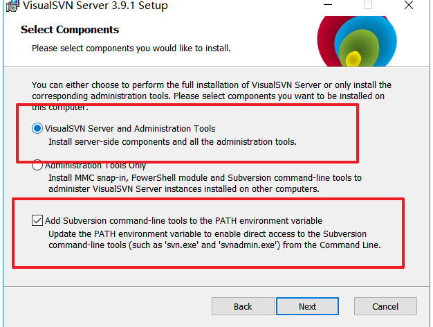

选中这两项。next


选择圈中的，

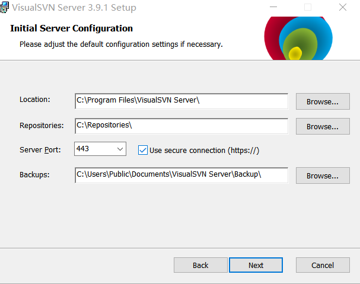

路径因人而异。端口我选择3030，这也是因人而异，最后点击install。

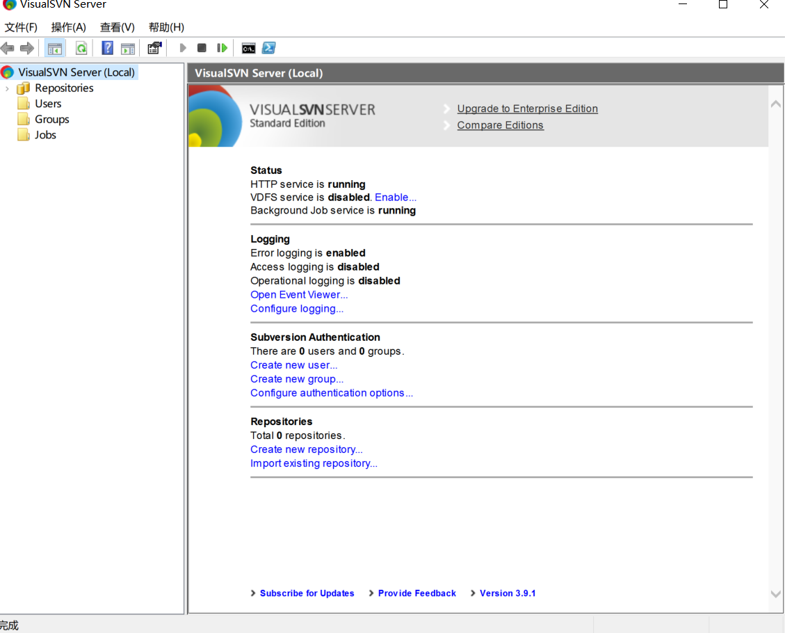

安装成功后的界面

### 新增仓库和用户

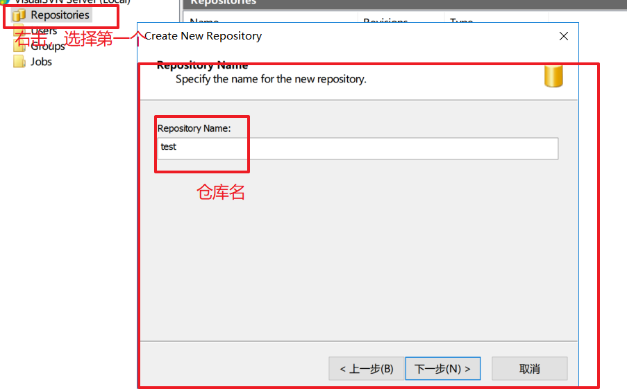

默认next。

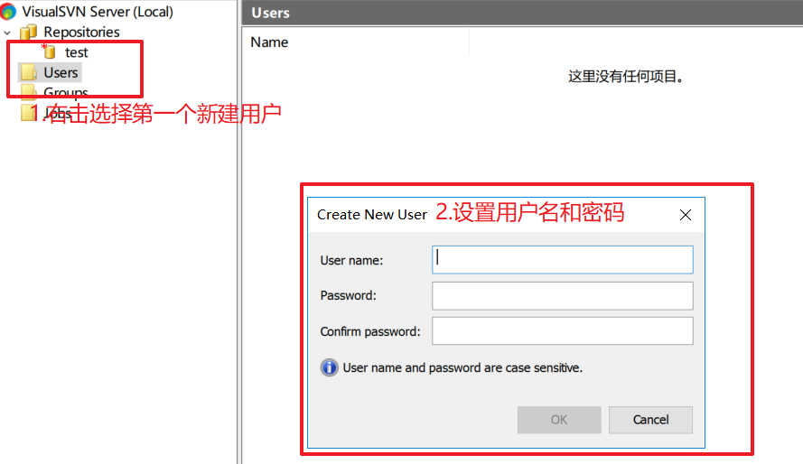

选择ok。

## 客户端安装与配置

下载地址：

https://tortoisesvn.net/downloads.html

选择好安装目录，其他都是无脑next。

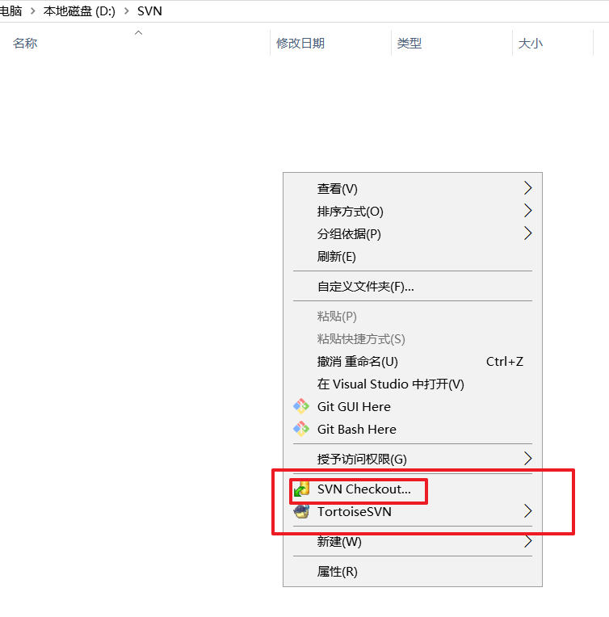

在任何一个文件夹下，右击鼠标，都会出现SVN checkout。表示SVN客户端安装完成。

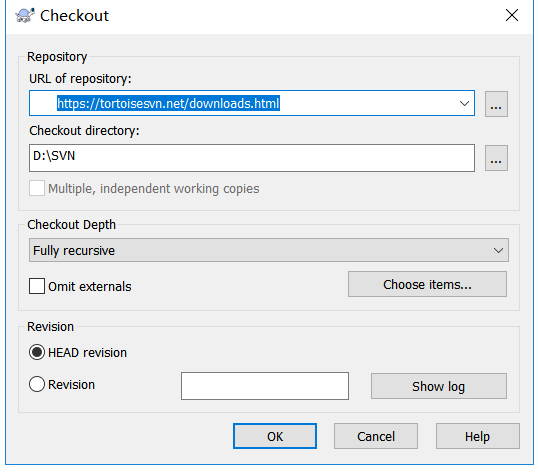

选择SVNcheckout，跳出这个框。

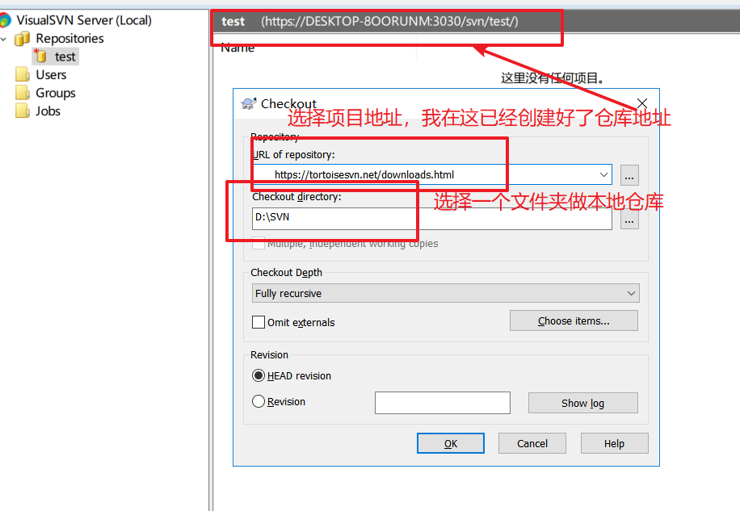

填好仓库地址后，选择ok，跳出这个确认用户框。输入账户密码然后ok。

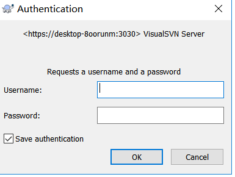

然后本地多了个.svn文件夹

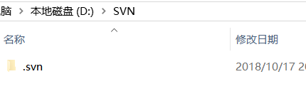

### SVN的基本操作

#### 添加

我在本地新建了test.html

右击，

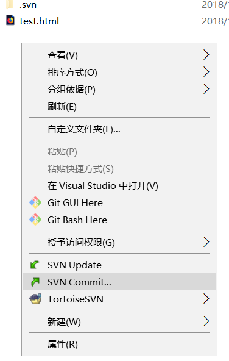

选择SVN commit。

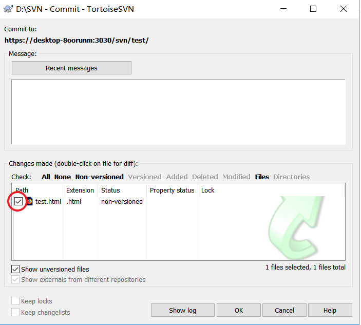

勾选对勾

刷新SVN服务端

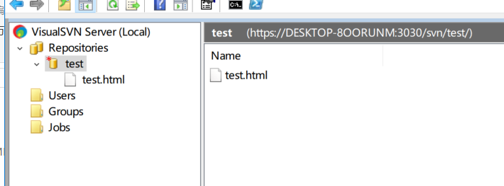

就多了test.html。

#### 删除

删除刚才本地仓库创建的test.html，然后右击选择SVN commit。

刷新SVN服务端

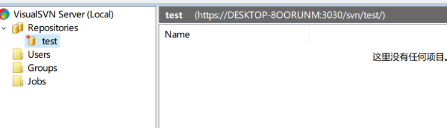

#### 修改

撤回刚才删除的test.html并修改，然后右击选择SVN commit

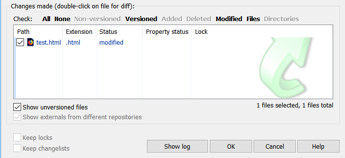

再刷先SVN服务端

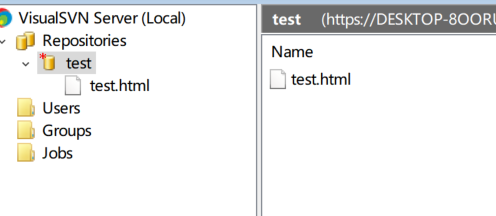

# git

说到git就会说到GitHub，因为GitHub是通过git这个工具来commit的，而GitHub网站就相当于SVN服务端。

## git安装

在Windows上使用Git，可以从Git官网直接[下载安装程序](https://git-scm.com/downloads)，（网速慢的同学请移步[国内镜像](https://pan.baidu.com/s/1kU5OCOB#list/path=%2Fpub%2Fgit)），然后按默认选项安装即可。

安装完成后，在开始菜单里找到“Git”->“Git Bash”，蹦出一个类似命令行窗口的东西，就说明Git安装成功！

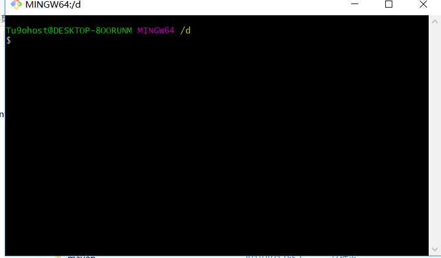

安装完成后，还需要最后一步设置，在命令行输入：

```shell
git config --global user.name "Your Name"
git config --global user.email "email@example.com"
```

如果使用GitHub（我一般都用GitHub做自己的项目仓库服务器，毕竟免费，自己代码也不值钱）

注意`git config`命令的`--global`参数，用了这个参数，表示你这台机器上所有的Git仓库都会使用这个配置，当然也可以对某个仓库指定不同的用户名和Email地址。

### 创建版本库

如果你用GitHub新建了一个仓库，

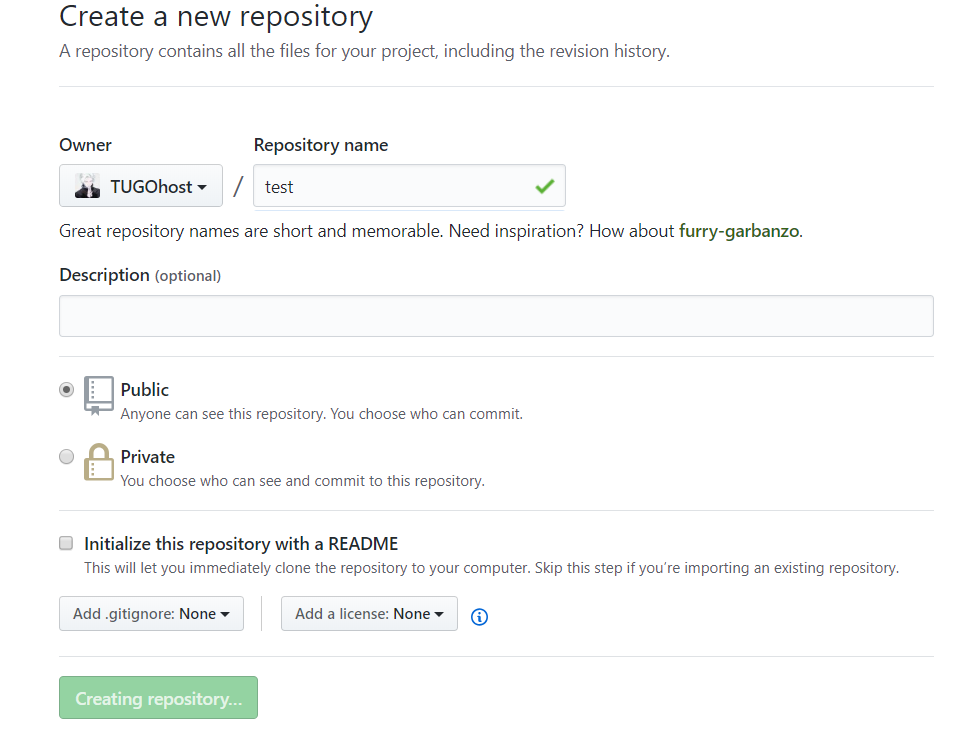

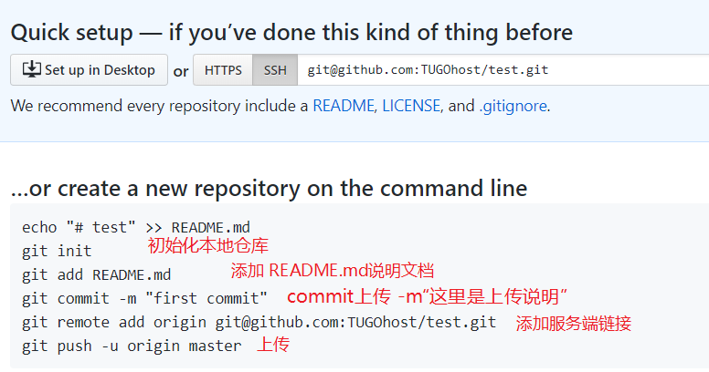

```shell
mkdir test
cd test
git init
git add README.md
git commit -m"first commit"
git remot add origin git@github.com:TUGOhost/test.git
git push -u origin master
```

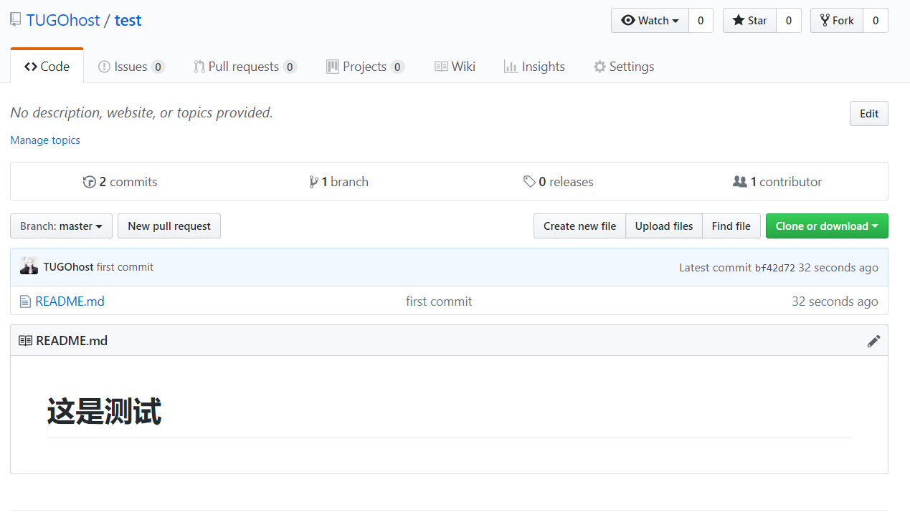

如果遇到不错的项目，可以

> git clone git@github.com:TUGOhost/test.git

服务端仓库克隆到本地。

#### 时光机穿梭

我们已经成功地添加并提交了一个READM.md文件，现在，是时候继续工作了，于是，我们继续修改READM.md文件，添加内容如下：

> test

现在，运行`git status`命令看看结果：

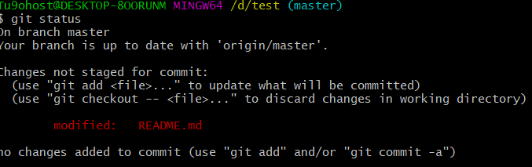

`git status`命令可以让我们时刻掌握仓库当前的状态，上面的命令输出告诉我们，READM.md被修改过了，但还没有准备提交的修改。

虽然Git告诉我们`READM.md`被修改了，但如果能看看具体修改了什么内容，自然是很好的。比如你休假两周从国外回来，第一天上班时，已经记不清上次怎么修改的READM.md，所以，需要用`git diff`这个命令看看：

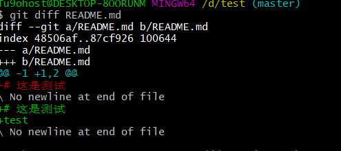

`git diff`顾名思义就是查看difference，显示的格式正是Unix通用的diff格式，可以从上面的命令输出看到。

#### 版本回退

`git log`查看我们的历史纪录

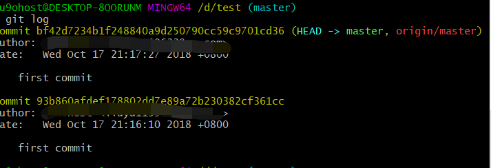

好了，现在我们启动时光穿梭机，准备把README.md回退到上一个版本，也就是第一次`first commit`的那个版本，怎么做呢？

首先，Git必须知道当前版本是哪个版本，在Git中，用`HEAD`表示当前版本，也就是最新的提交（注意我的提交ID和你的肯定不一样），上一个版本就是`HEAD^`，上上一个版本就是`HEAD^^`，当然往上100个版本写100个`^`比较容易数不过来，所以写成`HEAD~100`。

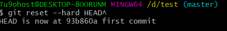

第一次写markdown文件名为`1.md`

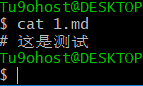

命令`git reflog`用来记录你的每一次命令：


#### 工作区和版本库

Git和其他版本控制系统如SVN的一个不同之处就是有暂存区的概念。

##### 工作区（Working Directory）

就是你在电脑里能看到的目录，比如我的D:\test\文件夹就是一个工作区：


##### 版本库（Repository）

工作区有一个隐藏目录`.git`，这个不算工作区，而是Git的版本库。

Git的版本库里存了很多东西，其中最重要的就是称为stage（或者叫index）的暂存区，还有Git为我们自动创建的第一个分支`master`，以及指向`master`的一个指针叫`HEAD`。


前面讲了我们把文件往Git版本库里添加的时候，是分两步执行的：

第一步是用`git add`把文件添加进去，实际上就是把文件修改添加到暂存区；

第二步是用`git commit`提交更改，实际上就是把暂存区的所有内容提交到当前分支。

因为我们创建Git版本库时，Git自动为我们创建了唯一一个`master`分支，所以，现在，`git commit`就是往`master`分支上提交更改。

你可以简单理解为，需要提交的文件修改通通放到暂存区，然后，一次性提交暂存区的所有修改。

#### 撤销文件和删除文件

在你准备提交前，一杯咖啡起了作用，你猛然发现了`stupid boss`可能会让你丢掉这个月的奖金！

既然错误发现得很及时，就可以很容易地纠正它。你可以删掉最后一行，手动把文件恢复到上一个版本的状态。如果用`git status`查看一下：

```shell
$ git status
On branch master
Changes not staged for commit:
  (use "git add <file>..." to update what will be committed)
  (use "git checkout -- <file>..." to discard changes in working directory)

    modified:   readme.txt

no changes added to commit (use "git add" and/or "git commit -a")
```

你可以发现，Git会告诉你，`git checkout -- file`可以丢弃工作区的修改：

```shell
$ git checkout -- README.md
```

命令`git checkout -- README.md`意思就是，把`README.md`文件在工作区的修改全部撤销，这里有两种情况：

一种是`README.md`自修改后还没有被放到暂存区，现在，撤销修改就回到和版本库一模一样的状态；

一种是`README.md`已经添加到暂存区后，又作了修改，现在，撤销修改就回到添加到暂存区后的状态。

**删除文件**

```shell
git rm README.md
```

# 在Linux中使用SVN

大多数 GNU/Linux 发行版系统自带了Subversion ，所以它很有可能已经安装在你的系统上了。可以使用下面命令检查是否安装了。

```shell
svn --version
```

如果 Subversion 客户端没有安装，命令将报告svn命令找不到的错误。

```shell
[tg@centos6 ~]$ svn --version
bash: svn: command not found
```

我们可以使用 yum install subversion 命令进行安装。(ubuntu中使用apt-get install subversion来安装)

```shell
[tg@centos6 root]$ su -
密码：
[root@centos6 ~]# yum install subversion
已加载插件：fastestmirror, security
设置安装进程
Loading mirror speeds from cached hostfile
 * base: mirrors.aliyun.com
 * epel: mirrors.neusoft.edu.cn
 * extras: mirrors.zju.edu.cn
 * updates: mirrors.aliyun.com
解决依赖关系
--&gt; 执行事务检查
...
```

安装成功之后，执行 svn --version 命令。

```shell
[tg@localhost ~]$ svn --version
svn，版本 1.7.14 (r1542130)
   编译于 Apr 11 2018，02:40:28

版权所有 (C) 2013 Apache 软件基金会。
此软件包含了许多人的贡献，请查看文件 NOTICE 以获得更多信息。
Subversion 是开放源代码软件，请参阅 http://subversion.apache.org/ 站点。

可使用以下的版本库访问模块: 

* ra_neon : 通过 WebDAV 协议使用 neon 访问版本库的模块。
  - 处理“http”方案
  - 处理“https”方案
* ra_svn : 使用 svn 网络协议访问版本库的模块。  - 使用 Cyrus SASL 认证
  - 处理“svn”方案
* ra_local : 访问本地磁盘的版本库模块。
  - 处理“file”方案
```

## SVN启动模式

首先,在服务端进行SVN版本库的相关配置

手动新建版本库目录

```shell
[tg@localhost /]$ sudo mkdir /opt/svn
```

利用svn命令创建版本库

```shell
[tg@localhost /]$ sudo svnserver -d -r /opt/svn/tg
```

使用命令svnserve启动服务

> ```
> svnserve -d -r 目录 --listen-port 端口号
> ```

- **-r:** 配置方式决定了版本库访问方式。
- **--listen-port:** 指定SVN监听端口，不加此参数，SVN默认监听3690

由于-r 配置方式的不一样，SVN启动就可以有两种不同的访问方式

方式一：-r直接指定到版本库(称之为单库svnserve方式)

```shel
[tg@localhost /]$ sudo svnserve -d -r /opt/svn/tg
```

在这种情况下，一个svnserve只能为一个版本库工作。

authz配置文件中对版本库权限的配置应这样写：

```shell
[tg@localhost /]$ sudo vim /opt/svn/tg/conf/authz
...

[groups]
admin=user1
dev=user2
[/]
@admin=tg
user2=t
```

