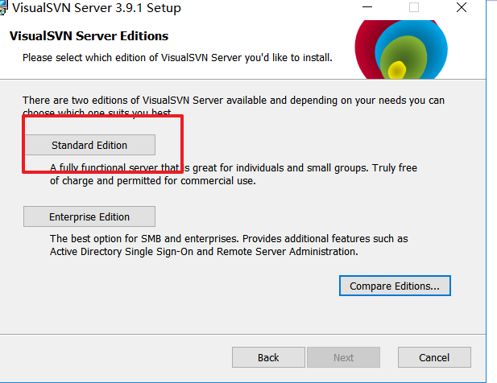
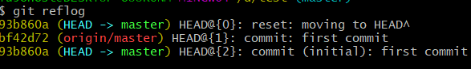
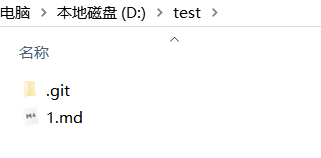

# 各种版本控制工具的简单比较

| 特性     | CVS        | SVN      | GIT      |
| -------- | ---------- | -------- | -------- |
| 并发修改 | 支持       | 支持     | 支持     |
| 并发提交 | 不支持     | 支持     | 支持     |
| 历史轨迹 | 不支持更名 | 支持更名 | 支持更名 |
| 分布式   | 不支持     | 不支持   | 支持     |

# SVN

### SVN服务端安装

下载地址：

https://www.visualsvn.com/server/download/

双击安装包，安装，选择好安装地址，


选中这两项。next



选择圈中的，


路径因人而异。端口我选择3030，这也是因人而异，最后点击install。


安装成功后的界面

### 新增仓库和用户


默认next。


选择ok。

## 客户端安装与配置

下载地址：

https://tortoisesvn.net/downloads.html

选择好安装目录，其他都是无脑next。


在任何一个文件夹下，右击鼠标，都会出现SVN checkout。表示SVN客户端安装完成。


选择SVNcheckout，跳出这个框。


填好仓库地址后，选择ok，跳出这个确认用户框。输入账户密码然后ok。


然后本地多了个.svn文件夹


### SVN的基本操作

#### 添加

我在本地新建了test.html

右击，


选择SVN commit。


勾选对勾

刷新SVN服务端


就多了test.html。

#### 删除

删除刚才本地仓库创建的test.html，然后右击选择SVN commit。

刷新SVN服务端


#### 修改

撤回刚才删除的test.html并修改，然后右击选择SVN commit


再刷先SVN服务端


# git

说到git就会说到GitHub，因为GitHub是通过git这个工具来commit的，而GitHub网站就相当于SVN服务端。

## git安装

在Windows上使用Git，可以从Git官网直接[下载安装程序](https://git-scm.com/downloads)，（网速慢的同学请移步[国内镜像](https://pan.baidu.com/s/1kU5OCOB#list/path=%2Fpub%2Fgit)），然后按默认选项安装即可。

安装完成后，在开始菜单里找到“Git”->“Git Bash”，蹦出一个类似命令行窗口的东西，就说明Git安装成功！


安装完成后，还需要最后一步设置，在命令行输入：

```shell
git config --global user.name "Your Name"
git config --global user.email "email@example.com"
```

如果使用GitHub（我一般都用GitHub做自己的项目仓库服务器，毕竟免费，自己代码也不值钱）

注意`git config`命令的`--global`参数，用了这个参数，表示你这台机器上所有的Git仓库都会使用这个配置，当然也可以对某个仓库指定不同的用户名和Email地址。

### 创建版本库

如果你用GitHub新建了一个仓库，


```shell
mkdir test
cd test
git init
git add README.md
git commit -m"first commit"
git remot add origin git@github.com:TUGOhost/test.git
git push -u origin master
```


如果遇到不错的项目，可以

> git clone git@github.com:TUGOhost/test.git

服务端仓库克隆到本地。

#### 时光机穿梭

我们已经成功地添加并提交了一个READM.md文件，现在，是时候继续工作了，于是，我们继续修改READM.md文件，添加内容如下：

> test

现在，运行`git status`命令看看结果：


`git status`命令可以让我们时刻掌握仓库当前的状态，上面的命令输出告诉我们，READM.md被修改过了，但还没有准备提交的修改。

虽然Git告诉我们`READM.md`被修改了，但如果能看看具体修改了什么内容，自然是很好的。比如你休假两周从国外回来，第一天上班时，已经记不清上次怎么修改的READM.md，所以，需要用`git diff`这个命令看看：


`git diff`顾名思义就是查看difference，显示的格式正是Unix通用的diff格式，可以从上面的命令输出看到。

#### 版本回退

`git log`查看我们的历史纪录


好了，现在我们启动时光穿梭机，准备把README.md回退到上一个版本，也就是第一次`first commit`的那个版本，怎么做呢？

首先，Git必须知道当前版本是哪个版本，在Git中，用`HEAD`表示当前版本，也就是最新的提交（注意我的提交ID和你的肯定不一样），上一个版本就是`HEAD^`，上上一个版本就是`HEAD^^`，当然往上100个版本写100个`^`比较容易数不过来，所以写成`HEAD~100`。


第一次写markdown文件名为`1.md`


命令`git reflog`用来记录你的每一次命令：



#### 工作区和版本库

Git和其他版本控制系统如SVN的一个不同之处就是有暂存区的概念。

##### 工作区（Working Directory）

就是你在电脑里能看到的目录，比如我的D:\test\文件夹就是一个工作区：



##### 版本库（Repository）

工作区有一个隐藏目录`.git`，这个不算工作区，而是Git的版本库。

Git的版本库里存了很多东西，其中最重要的就是称为stage（或者叫index）的暂存区，还有Git为我们自动创建的第一个分支`master`，以及指向`master`的一个指针叫`HEAD`。


前面讲了我们把文件往Git版本库里添加的时候，是分两步执行的：

第一步是用`git add`把文件添加进去，实际上就是把文件修改添加到暂存区；

第二步是用`git commit`提交更改，实际上就是把暂存区的所有内容提交到当前分支。

因为我们创建Git版本库时，Git自动为我们创建了唯一一个`master`分支，所以，现在，`git commit`就是往`master`分支上提交更改。

你可以简单理解为，需要提交的文件修改通通放到暂存区，然后，一次性提交暂存区的所有修改。

#### 撤销文件和删除文件

在你准备提交前，一杯咖啡起了作用，你猛然发现了`stupid boss`可能会让你丢掉这个月的奖金！

既然错误发现得很及时，就可以很容易地纠正它。你可以删掉最后一行，手动把文件恢复到上一个版本的状态。如果用`git status`查看一下：

```shell
$ git status
On branch master
Changes not staged for commit:
  (use "git add <file>..." to update what will be committed)
  (use "git checkout -- <file>..." to discard changes in working directory)

    modified:   readme.txt

no changes added to commit (use "git add" and/or "git commit -a")
```

你可以发现，Git会告诉你，`git checkout -- file`可以丢弃工作区的修改：

```shell
$ git checkout -- README.md
```

命令`git checkout -- README.md`意思就是，把`README.md`文件在工作区的修改全部撤销，这里有两种情况：

一种是`README.md`自修改后还没有被放到暂存区，现在，撤销修改就回到和版本库一模一样的状态；

一种是`README.md`已经添加到暂存区后，又作了修改，现在，撤销修改就回到添加到暂存区后的状态。

**删除文件**

```shell
git rm README.md
```

# 在Linux中使用SVN

开发人员经常会上传代码，或者改对代码做一些更改。svn就是用来将修改后的代码更新到服务器上的。下面就来看一下怎么在Linux环境下搭建svn服务（subversion）。

步骤：
1、检查是否已经有svn
2、安装subversion
3、检查是否安装成功
4、创建svn资源仓库
5、新增用户及密码，配置权限，配置资源库权限
6、启动或者重启服务
7、从机安装subversion
8、测试

一、检查是否已经有svn

如果没有安装就会是下面的样子，提示找不到命令。
```shell
[root@localhost ~]# svnserve --version
-bash: svnserve: command not found
```

如果已经安装，会显示版本信息：
```shell
[root@localhost ~]#  svnserve --version
svnserve, version 1.6.11 (r934486)
   compiled Aug 17 2015, 08:37:43

Copyright (C) 2000-2009 CollabNet.
Subversion is open source software, see http://subversion.tigris.org/
This product includes software developed by CollabNet (http://www.Collab.Net/).

The following repository back-end (FS) modules are available:

* fs_base : Module for working with a Berkeley DB repository.
* fs_fs : Module for working with a plain file (FSFS) repository.

Cyrus SASL authentication is available.
```

二、安装
在Linux下安装的是subversion，直接用yum 安装即可。
```shell
[root@localhost ~]#
[root@localhost ~]# yum install -y subversion
```

三、检查安装是否成功
同样用的是 svnserve –version成功安装会显示版本信息
```shell
[root@localhost ~]# svnserve --version
```

四、创建svn资源仓库
配置文件就是在这一步生成。
```shell
[root@localhost ~]# svnadmin create /svndir
[root@localhost ~]# cd /svndir/
[root@localhost svndir]# ls
conf  db  format  hooks  locks  README.txt
[root@localhost svndir]# cd conf/
[root@localhost conf]# ls
authz  passwd  svnserve.conf
```

五、新增用户及密码，配置权限
已经看到在仓库下面生成了三个文件
authz #权限配置文件
passwd #用户名密码文件
svnserve.conf #资源库配置文件
```shell
[root@localhost conf]# vim passwd
### This file is an example password file for svnserve.
### Its format is similar to that of svnserve.conf. As shown in the
### example below it contains one section labelled [users].
### The name and password for each user follow, one account per line.

[users]
# harry = harryssecret
# sally = sallyssecret
yunwei = 123456
~
```

新增一行：
yunwei = 123456
新增用户“yunwei”，密码是“123456”
```shell
[root@localhost conf]# vim authz


[groups]
# harry_and_sally = harry,sally
# harry_sally_and_joe = harry,sally,&joe

[/]
* = r
  @admin = rw
  dangerman =

[svndir:/]
@admin = rw
```

在[groups]下面加入：
* = r #所有用户有读权限
  dangerman = ##危险分子？什么是危险分子？没有任何权限

[svndir:/] ###定义目录，项目的根目录
* = rw
```shell
[root@localhost conf]# vim svnserve.conf
```

这个配置文件打开下面几行前面的注释，删除最前面的空格：
anon-access = read
auth-access = write
password-db = passwd
authz-db = authz
realm = My First Repository

六、启动或者重启服务
```shell
[root@localhost conf]# /etc/init.d/svnserve start
Starting svnserve:                                     [  OK  ]
```

如果要指定目录要加参数：
```shell
[root@localhost svndir]# mkdir /svndir/svn
[root@localhost svndir]# svnserve -d -r /svndir/svn  ####（只是看一下可以指定目录，这个实验不需要）
svnserve: Can't bind server socket: Address already in use
```

问题来了！！！问题来了：
显示Address already in use

原因在这里：svnserve -d -r /svndir/svn 这条命令就是指定目录的启动。但是前面已经启动一次了。解决办法：
```shell
[root@localhost svndir]# /etc/init.d/svnserve stop
Stopping svnserve:                                         [  OK  ]
[root@localhost svndir]# svnserve -d -r /svndir/
[root@localhost svndir]# ls
conf  db  format  hooks  locks  README.txt 
[root@localhost svndir]# netstat -antlp | grep svn
tcp        0      0 0.0.0.0:3690                0.0.0.0:*                   LISTEN      5045/svnserve
```

七、测试，从机安装subversion
在次从机安装也安装一个subversion 用来测试。

注:
服务主机：192.168.1.65
从机：192.168.1.121

在从机上checkout 根目录
```shell
[root@localhost ~]# svn checkout svn://192.168.1.65/svndir/
Checked out revision 0.
```

需要注意的这里check的目录跟服务主机里面定义的[svndir]要一样。
```shell
[root@localhost ~]# svn checkout svn://192.168.1.65/svndir/
svn: URL 'svn://192.168.1.65/svndir' doesn't exist
```

如果出现在这个报错，就要检查服务主机的auth配置文件了：
如果配置文件的的目录指定的是[svndir：/]，而且svndir的目录在根下（/svndir）
那启动的时候即嫑指定目录直接用/etc/init.d/svnserve start 启动即可。我们这里目录符合默认目录，不用指定了。直接用/etc/init.d/svnserve start，或者不用指定目录。
svnserve -d -r /svndir/ 这表示指定目录到/svndir/
目录不对应会报错。

7.1：在从机上从机：192.168.1.121上提交
```shell
[root@localhost ~]# ls
Desktop    Downloads  Pictures  svndir     Videos
Documents  Music      Public    Templates
[root@localhost ~]# cd svndir/
[root@localhost svndir]# ls
[root@localhost svndir]# touch xiao
```
```shell
[root@localhost svndir]# ls
xiao
[root@localhost svndir]# pwd
/root/svndir
[root@localhost svndir]# ls
xiao
[root@localhost svndir]# svn add /root/svndir/xiao
A         /root/svndir/xiao
```
```shell
[root@localhost svndir]# svn commit /root/svndir/xiao -m 1
Authentication realm: <svn://192.168.1.65:3690> My First Repository
Password for 'root':
Authentication realm: <svn://192.168.1.65:3690> My First Repository
Username: ^Csvn: Commit failed (details follow):
  n: Caught signal
[root@localhost svndir]# svn commit /root/svndir/xiao -m 1
Authentication realm: <svn://192.168.1.65:3690> My First Repository
Password for 'root':
Authentication realm: <svn://192.168.1.65:3690> My First Repository
Username: yunwei
Password for 'yunwei':

-----------------------------------------------------------------------
ATTENTION!  Your password for authentication realm:

   <svn://192.168.1.65:3690> My First Repository

can only be stored to disk unencrypted!  You are advised to configure
your system so that Subversion can store passwords encrypted, if
possible.  See the documentation for details.

You can avoid future appearances of this warning by setting the value
of the 'store-plaintext-passwords' option to either 'yes' or 'no' in
'/root/.subversion/servers'.
-----------------------------------------------------------------------
Store password unencrypted (yes/no)? yes
Adding         xiao
Transmitting file data .
Committed revision 1.
```

注意：
1、提交代码前，必须先cd到/root/svndir/（就是checkout下来的）目录里；
2、服务器上没有的文件，在客户端需要先add预提交，再commit，如果服务器端已有的文件，直接commit

预提交的命令：
```shell
 svn add /root/svndir/xiao
```

提交的命令：
```shell
svn commit /root/svndir/xiao -m 1
```

出现committed revision 1 提交成功了。

到服务端查看有没有提交成功：
服务主机:192.168.1.65
```shell
[root@localhost svndir]# svn checkout svn://192.168.1.65/svndir/
A    svndir/xiao
Checked out revision 1.
[root@localhost svndir]# ls
conf  db  format  hooks  locks  README.txt  svn  svndir
[root@localhost svndir]# cd svndir/
[root@localhost svndir]# ls
xiao
```

接下来测试更新：

从机：192.168.1.121：
```shell
[root@localhost svndir]# ls
xiao
[root@localhost svndir]# vim xiao

hello koby bryant !
~
```

修改了xiao 这个文件的内容，之前是空文件，现在加上一行内容。
然后重新提交：
```shell
[root@localhost svndir]# svn commit /root/svndir/xiao -m 2
Sending        xiao
Transmitting file data .
Committed revision 2.
```

服务器主机：192.168.1.65
```shell
[root@localhost svndir]# svn up
​     xiao
Updated to revision 2.
[root@localhost svndir]# ls
xiao
[root@localhost svndir]# vim xiao
hello koby bryant !
~
```

内容已经更改。

因为是更改内容，目录和文件已经有了，所以不用checkout了，直接svn up就可以了。

7.2、在服务器主机：192.168.1.65上提交
```shell
[root@localhost svndir]# ls
xiao  yao
[root@localhost svndir]# pwd
/svndir/svndir
[root@localhost svndir]# svn add /svndir/svndir/yao
A         /svndir/svndir/yao
[root@localhost svndir]# svn commit /svndir/svndir/yao -m 3
Authentication realm: <svn://192.168.1.65:3690> My First Repository
Password for 'root':
Authentication realm: <svn://192.168.1.65:3690> My First Repository
Username: yunwei
Password for 'yunwei':

-----------------------------------------------------------------------
ATTENTION!  Your password for authentication realm:

   <svn://192.168.1.65:3690> My First Repository

can only be stored to disk unencrypted!  You are advised to configure
your system so that Subversion can store passwords encrypted, if
possible.  See the documentation for details.

You can avoid future appearances of this warning by setting the value
of the 'store-plaintext-passwords' option to either 'yes' or 'no' in
'/root/.subversion/servers'.
-----------------------------------------------------------------------
Store password unencrypted (yes/no)? yes
Adding         yao
Transmitting file data .
Committed revision 3.
```

注意：还是要cd到/svndir/svndir里面再预提交，然后提交。
显示Committed revision 3.就说明提交成功

到从机：192.168.1.121上更新看效果：
```shell
[root@localhost svndir]# svn up
A    yao
Updated to revision 3.
[root@localhost svndir]# ls
xiao  yao
[root@localhost svndir]# cat yao
hello rayallen
```

上面提交不管是在服务器主机上还是在从机上，都需要输入服务器主机的root用户密码，以及在conf文件里面设置的用户和密码。上面测试是用的文件测试，目录同样可以。
比如：
从机上：192.168.1.121
```shell
[root@localhost svndir]# mkdir xiaoyao
[root@localhost svndir]# ls
xiao  xiaoyao  yao
[root@localhost svndir]# svn add /root/svndir/xiaoyao/
A         /root/svndir/xiaoyao
[root@localhost svndir]# svn commit /root/svndir/xiaoyao/ -m 4
Adding         xiaoyao

Committed revision 4.
```

服务器主机上：192.168.1.65
```shell
[root@localhost svndir]# svn up
A    xiaoyao
Updated to revision 4.
[root@localhost svndir]# ls
xiao  xiaoyao  yao
```
至此，svn的安装配置测试就成功了

### 参考链接

https://blog.csdn.net/weixin_37998647/article/details/78686246

https://www.liaoxuefeng.com/wiki/0013739516305929606dd18361248578c67b8067c8c017b000

https://www.imooc.com/learn/109